# 1. Getting Started

## 1.1 Product Overview

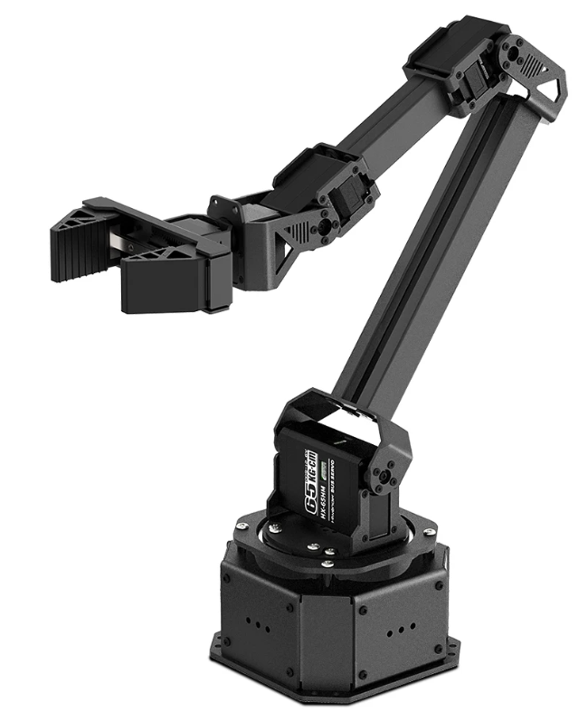

NexArm is an open-source six-axis robotic arm designed for embodied intelligence, robotics development, and artificial intelligence applications. Integrating mechanical control, teach programming, leader-follower control, and imitation learning into a single platform, it provides a comprehensive robotics development platform for developers, academic research institutions, and robotics enthusiasts. Compatible with mainstream open-source frameworks such as LeRobot and Hugging Face, it enables quick setup for algorithm validation, data collection, model training, and intelligent control.

NexArm supports fundamental motion control, trajectory teaching, action recording and playback, leader-follower cooperative control, imitation learning data collection, and AI model training and deployment. It can be widely applied in robotics teaching experiments, embodied intelligence research, reinforcement learning and imitation learning development, vision-based grasping, intelligent interaction verification, and personal development projects, helping quickly bridge the gap from robotic arm control to end-to-end AI application deployment.

## 1.2 Product Packing List and Assembly Tutorial

### 1.2.1 Starter Kit

#### 1.2.1.1 Packing List

| No. | Item Name | Image | Qty | No. | Item Name | Image | Qty |
| :--: | :-----------------: | :----------------------------------------------------------: | :--: | :--: | :----------: | :----------------------------------------------------------: | :--: |
| 1 | NexArm robotic arm |  | 1 | 2 | 12 V power adapter | 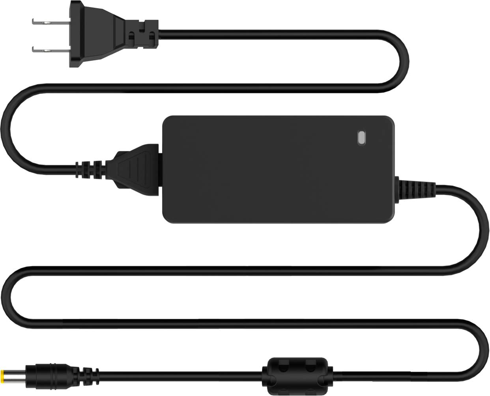 | 1 |
| 3 | 1000 mm Type-C cable | 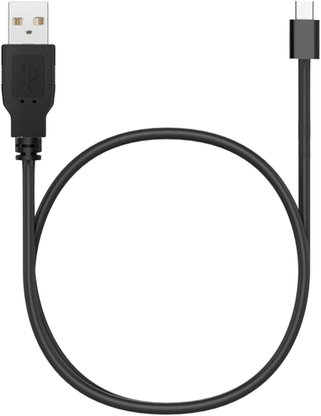 | 1 | 4 | 200 mm module cable | 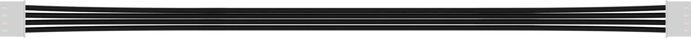 | 2 |
| 5 | 200 mm servo wire | 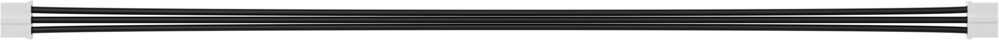 | 2 | 6 | Screwdriver | 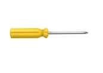 | 1 |

#### 1.2.1.2 Assembly Instructions

The Starter Kit requires no assembly and is ready to use once connected to the power adapter and turned on. Skip directly to [1.3 First Power-On](#first-power-on).

### 1.2.2 Standard Kit

#### 1.2.2.1 Packing List

| No. | Item Name | Image | Qty | No. | Item Name | Image | Qty |
| :--: | :-----------------: | :----------------------------------------------------------: | :--: | :--: | :----------: | :----------------------------------------------------------: | :--: |
| 1 | NexArm robotic arm |  | 1 | 2 | 12 V power adapter |  | 1 |
| 3 | 1000 mm Type-C cable |  | 1 | 4 | 200 mm module cable |  | 2 |
| 5 | 200 mm servo wire |  | 2 | 6 | Screwdriver |  | 1 |
| 7 | G clamp | 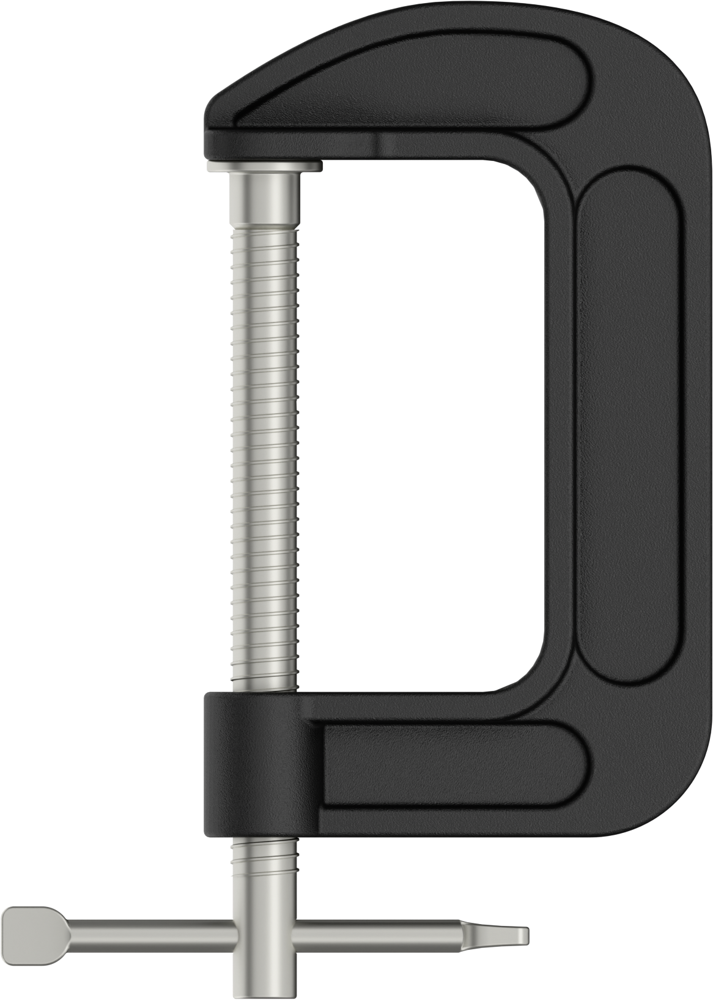 | 2 | 8 | Screw pack | 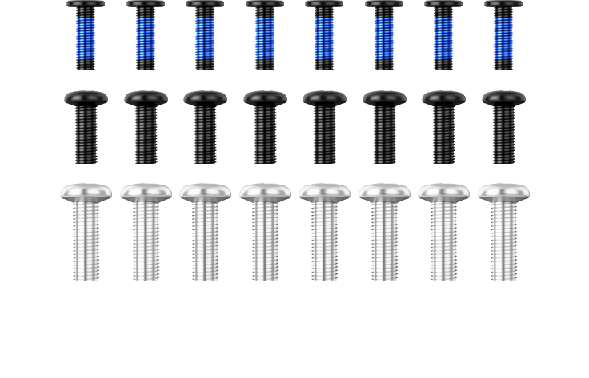 | 1 |
| 9 | Adapter base plate | 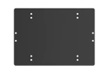 | 1 | | | | |

#### 1.2.2.2 Assembly Instructions

1. Assemble the robotic arm and the adapter base plate.

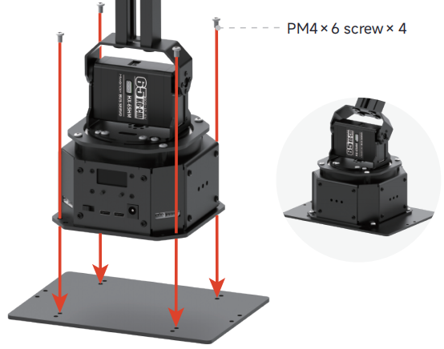

2. Place the assembled robotic arm on the desktop and secure it using G clamps.

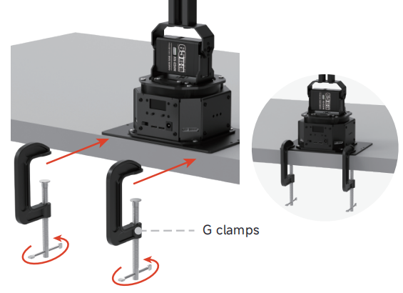

For detailed assembly videos, refer to [07 Assembly Tutorial](https://drive.google.com/drive/folders/12tt0k0Hbq1TRtyNJZ0LZa9zQYCSvr75k?usp=sharing) folder in the same directory. After assembly is complete, skip to [1.3 First Power-On](#first-power-on).

### 1.2.3 Advanced Kit

#### 1.2.3.1 Packing List

| No. | Item Name | Image | Qty | No. | Item Name | Image | Qty |
| :--: | :------------------: | :----------------------------------------------------------: | :--: | :--: | :-----------: | :----------------------------------------------------------: | :--: |
| 1 | NexArm robotic arm |  | 1 | 2 | 12 V power adapter |  | 1 |
| 3 | 1000 mm Type-C cable |  | 1 | 4 | 200 mm module cable |  | 2 |
| 5 | 200 mm servo wire |  | 2 | 6 | 1000 mm module cable |  | 1 |
| 7 | Adapter base plate |  | 1 | 8 | Screw pack |  | 1 |
| 9 | G clamp |  | 2 | 10 | K230 vision module | 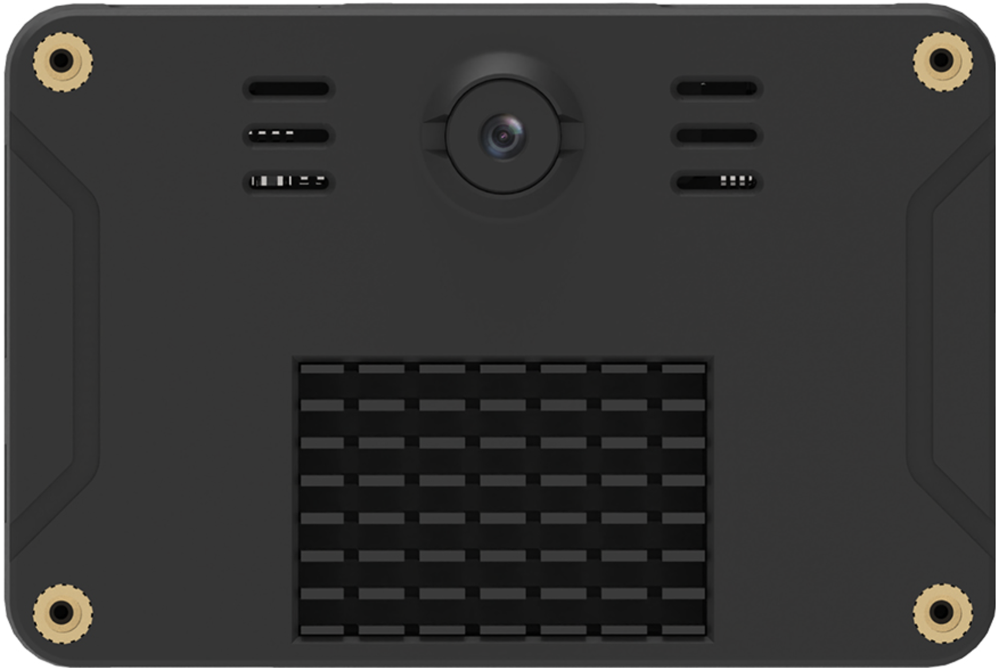 | 1 |
| 11 | K230 vision module mounting bracket | 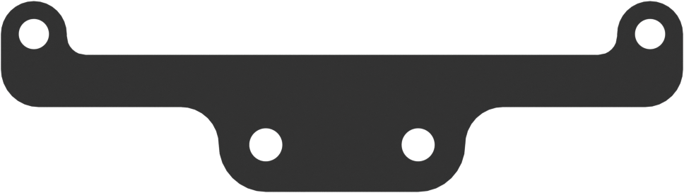 | 1 | 12 | Cable ties | 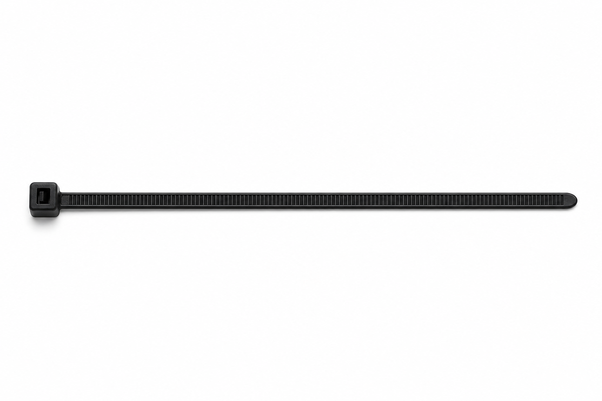 | 10 |
| 13 | Card reader | 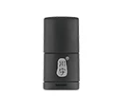 | 1 | 14 | Speaker | 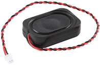 | 1 |
| 15 | Screwdriver |  | 1 | | | | |

#### 1.2.3.2 Assembly Instructions

1. Assemble the K230 vision module and mounting bracket using M3x6 screws.

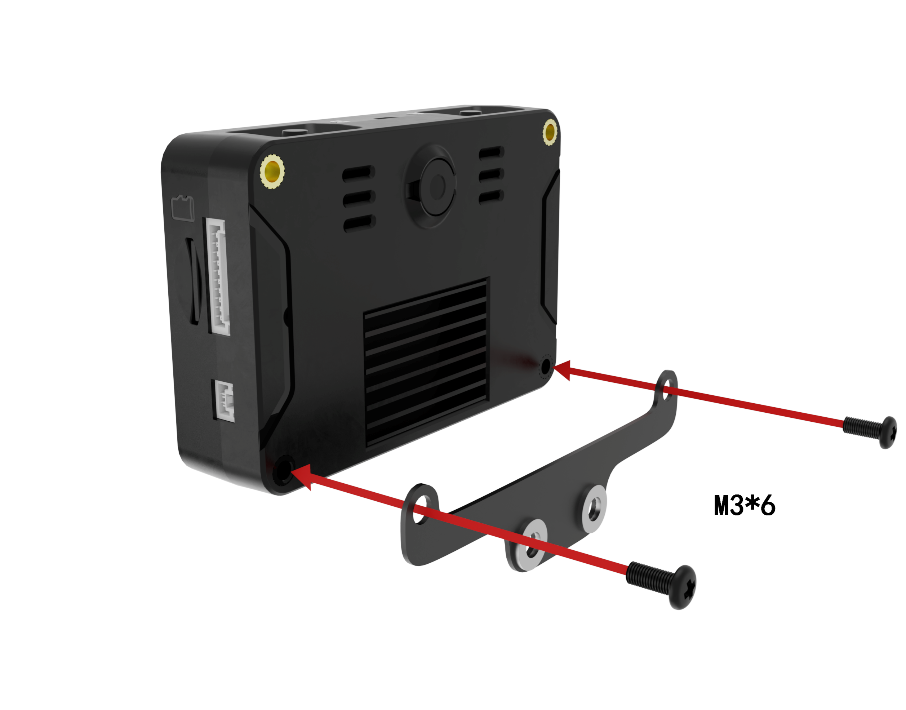

2. Secure the assembled K230 vision module and bracket onto the robotic arm.

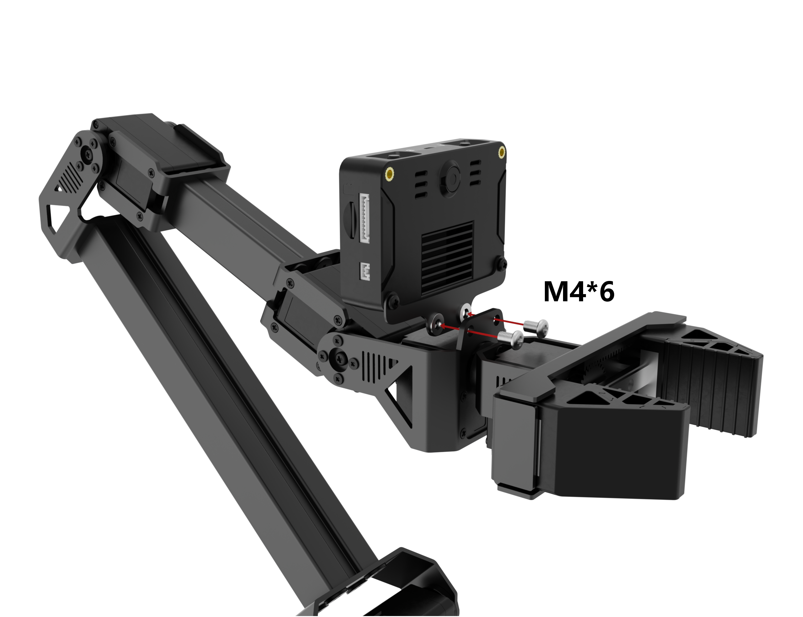

3. Connect the K230 vision module to the I2C interface of the robotic arm using the included 1000 mm module cable.

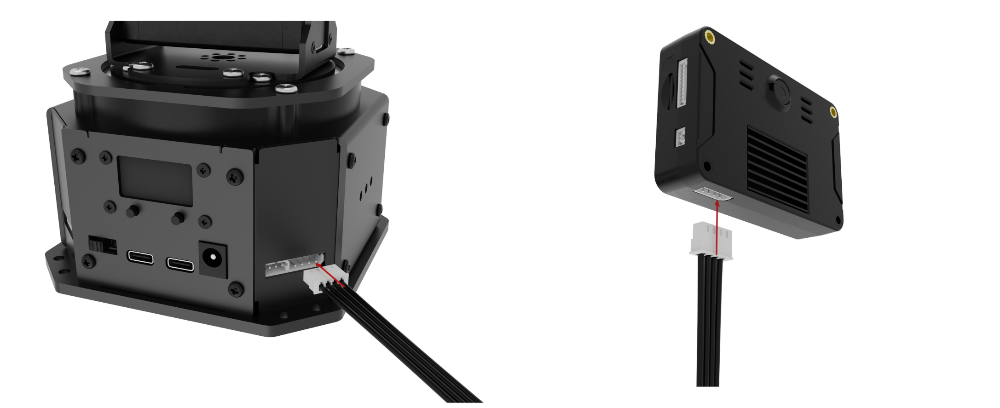

For detailed assembly videos, refer to  [07 Assembly Tutorial](https://drive.google.com/drive/folders/12tt0k0Hbq1TRtyNJZ0LZa9zQYCSvr75k?usp=sharing) folder. After assembly is complete, skip to [1.3 First Power-On](#first-power-on).

### 1.2.4 Ultimate Kit

#### 1.2.4.1 Packing List

| No. | Item Name | Image | Qty | No. | Item Name | Image | Qty |
| :--: | :--------------------: | :----------------------------------------------------------: | :--: | :--: | :------------------: | :----------------------------------------------------------: | :--: |
| 1 | NexArm robotic arm |  | 1 | 2 | 12 V power adapter |  | 2 |
| 3 | 1000 mm Type-C cable |  | 2 | 4 | 200 mm module cable |  | 2 |
| 5 | 200 mm servo wire |  | 2 | 6 | Screwdriver |  | 1 |
| 7 | Adapter base plate |  | 2 | 8 | Screw pack |  | 1 |
| 9 | G clamp |  | 4 | 10 | All-metal camera mount bracket | 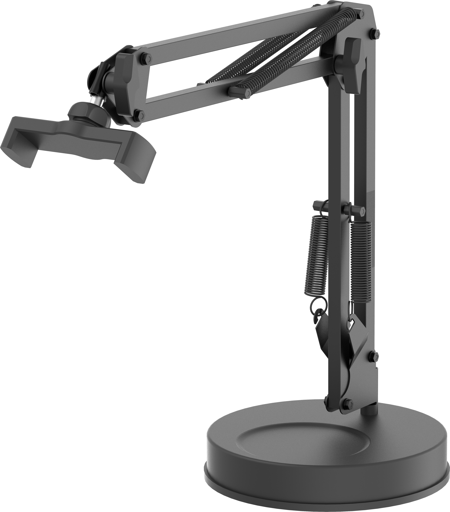 | 1 |
| 11 | NexArm leader arm | 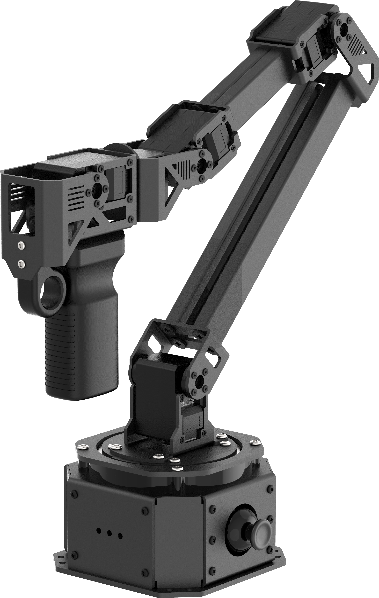 | 1 | 12 | PS3 wireless controller | 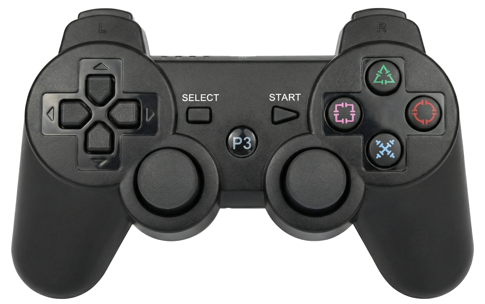 | 1 |
| 13 | 0.3 MP HD wide-angle camera | 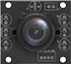 | 1 | 14 | Wrist camera mount | 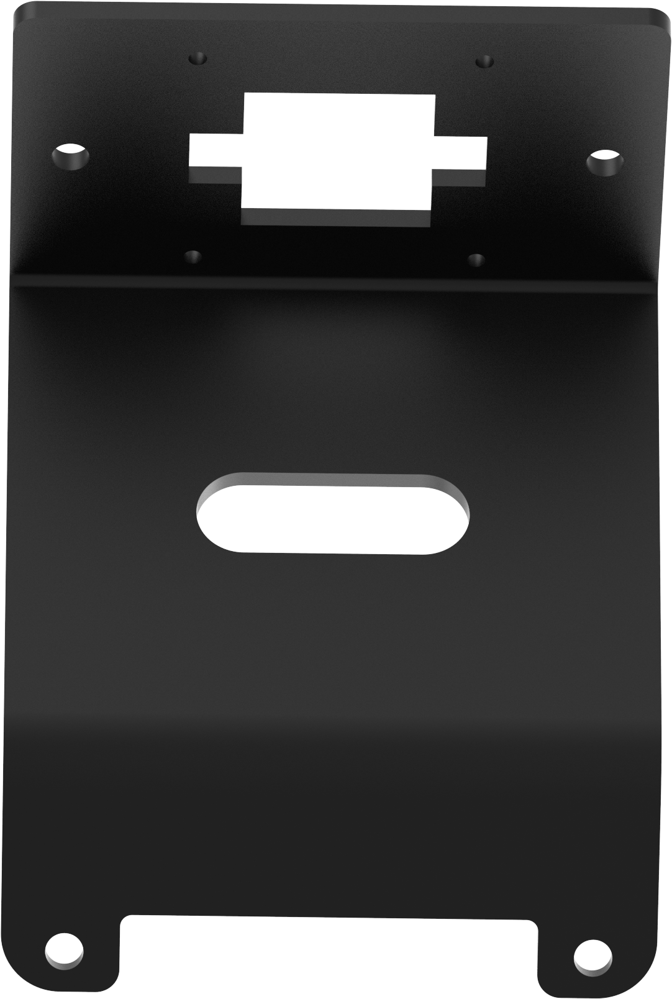 | 1 |
| 15 | 2 MP HD wide-angle camera | 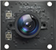 | 1 | 16 | External camera mount |  | 1 |
| 17 | USB hub | 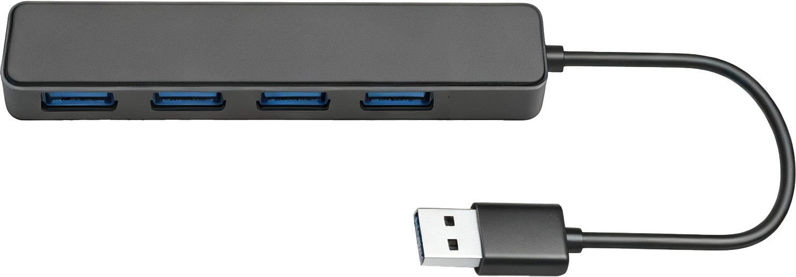 | 1 | 18 | Camera data cable | 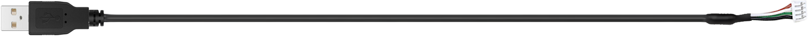 | 2 |
| 19 | K230 vision module |  | 1 | 20 | K230 vision module mounting bracket |  | 1 |
| 21 | Speaker |  | 1 | 22 | Card reader |  | 1 |

#### 1.2.4.2 Assembly Instructions

* **K230 Vision Module Assembly Steps**

1. Assemble the K230 vision module and bracket using M3x6 screws.

2. Secure the assembled K230 vision module and bracket onto the robotic arm.

3. Connect the K230 vision module to the I2C interface of the robotic arm using the included 1000 mm module cable.

For detailed assembly videos, refer to  [07 Assembly Tutorial](https://drive.google.com/drive/folders/12tt0k0Hbq1TRtyNJZ0LZa9zQYCSvr75k?usp=sharing) folder.

* **Imitation Learning Kit Assembly Steps**

1. Install the wrist camera.

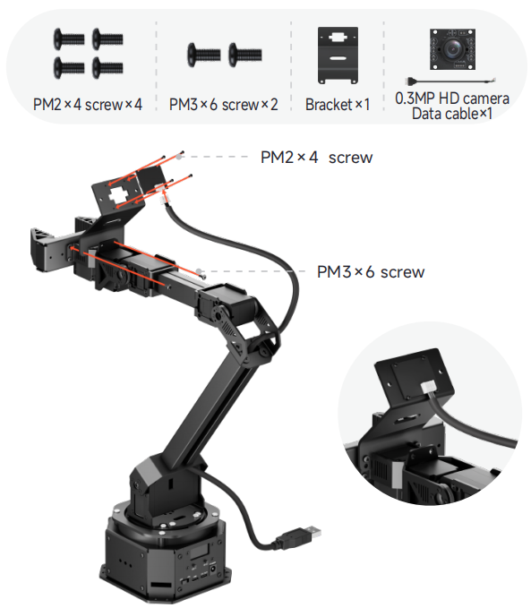

2. Install the handle of the leader arm.

   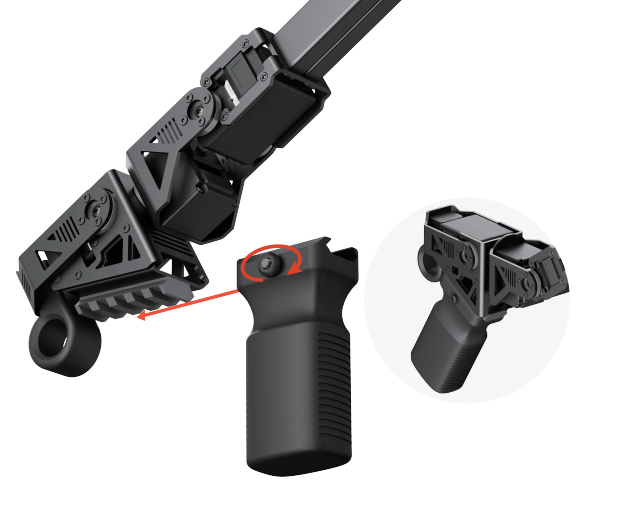

3. Assemble the external camera.

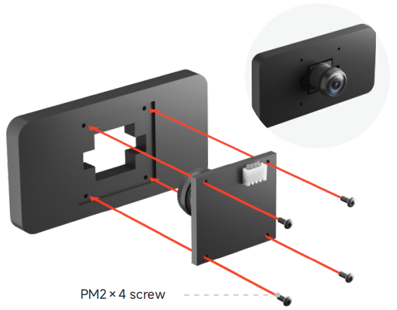

4. Mount the external camera onto the metal bracket.

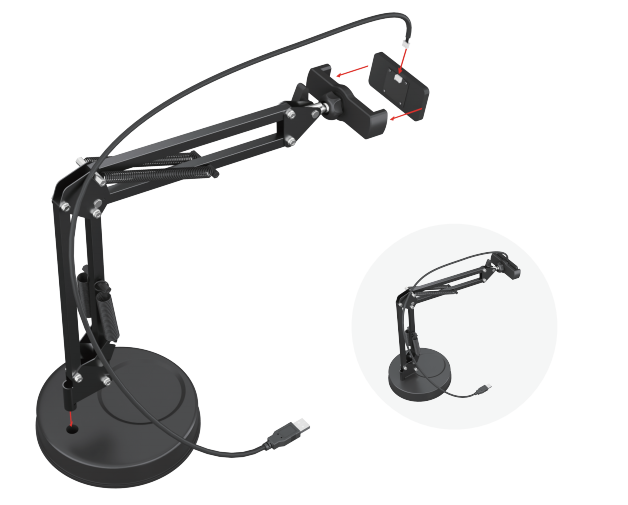

5. Wiring instructions.

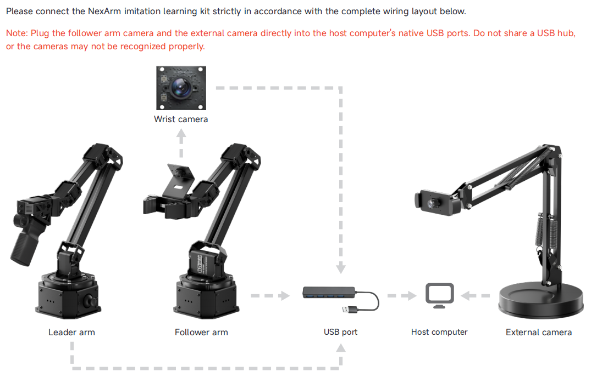

After assembly is complete, skip to [1.3 First Power-On](#first-power-on).

## 1.3 First Power-On

As shown in the image below, connect the 12.5 V power adapter to the robotic arm for power supply, and toggle the power switch to turn on the device. Connect the robotic arm USB port to a computer via a Type-C data cable to enable PC software control. Click here to skip to [1.5 PC Software Control](#pc-software-control). If not connecting to a computer via a Type-C cable, refer to the next section [1.4 App Control](#app-control).

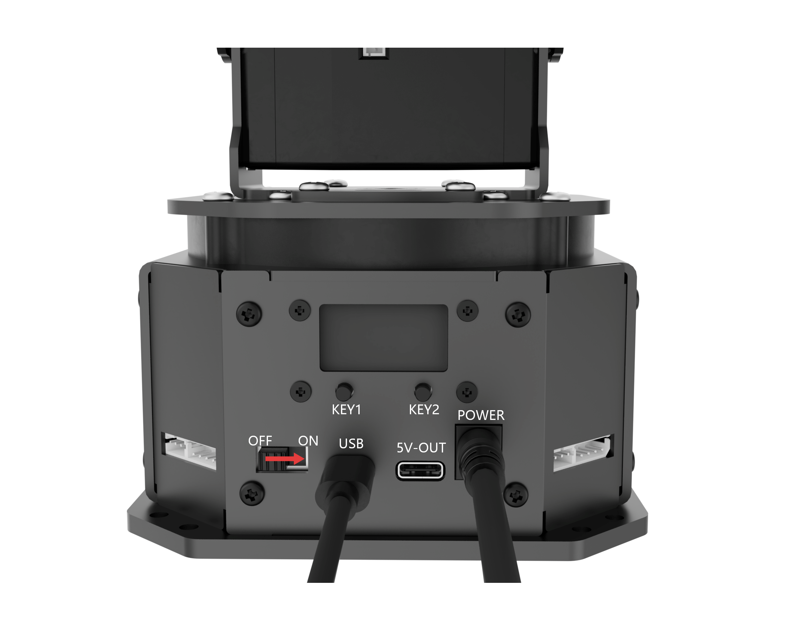

> [!NOTE]
>
> **Both the NexArm robotic arm and the leader arm are pre-flashed with factory firmware. To restore the factory state quickly after overwriting the factory program, re-flash the factory firmware. Factory firmware and flashing tutorials can be found in [04 Appendix\08 Factory Firmware & Flashing Tutorial](https://drive.google.com/drive/folders/12UmRu76Xfnj4lfgI4ZHPBUTyG9otlgQM?usp=sharing) in the same directory.**

## 1.4 App Control

### 1.4.1 App Download

1. Scan the QR code below on an iOS or Android device to download and install the app.

> [!NOTE]
>
> * **iOS 12.0 or later is required, and Android 5.0 or later is required.**
>
> * **On Android, grant all app permissions in the phone settings for proper functionality.**

2. **iOS**: Search for **Wonderbot** in the App Store and download the app.

3. **Android**: Install the APK file from [04 Appendix\02 NexArm App](https://drive.google.com/drive/folders/18P2Hdq8lnJMDxrwBa0i1F-N4CXtPB0qM?usp=sharing) in the same directory as this document, or install **Wonderbot-V2.3.4.apk** located under [2. Softwares\5. NexArm App](https://drive.google.com/drive/folders/12BpmlPFCoaP7sjbC72slKpdYFnxXIS1a?usp=sharing) in the product materials.

### 1.4.2 App Connection

> [!NOTE]
>
> **NexArm is shipped with Bluetooth connection enabled by default. After the robotic arm is powered on, open the app to discover the corresponding Bluetooth device. Pressing KEY2 switches between PS3 controller mode and app control mode.**

* Open the app, tap **Robot** on the left side, find **NexArm** in the pop-up options, and tap it to enter the control interface.

  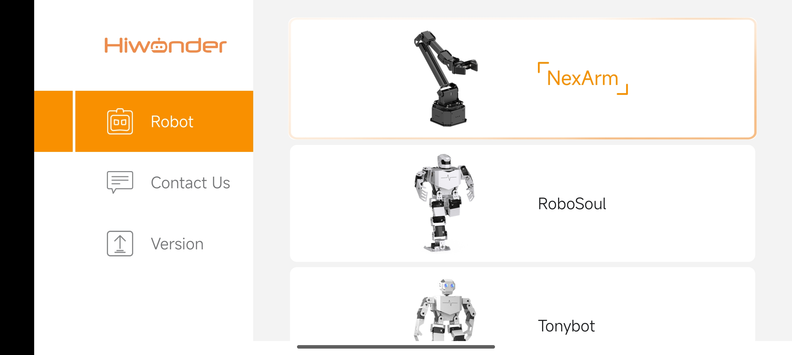

* After entering the control interface, the **Mode Selection** screen will appear. Tap the Bluetooth icon in the upper-right corner to connect Bluetooth first.

  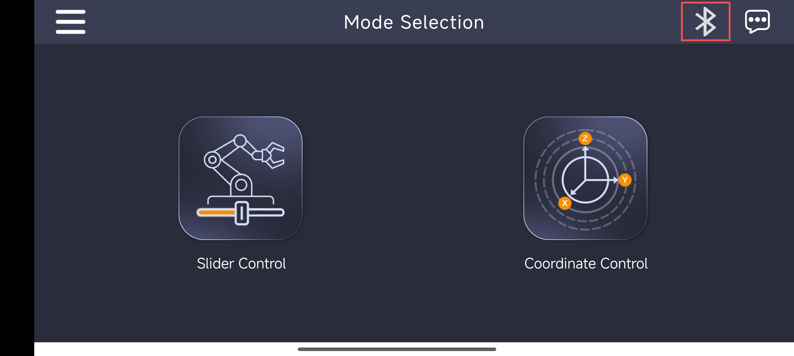

* Connect NexArm to the original power adapter, turn on the power switch, and wait a few seconds. Tap the Bluetooth connection icon in the app. When the Bluetooth list appears, find **Nex_Arm** and tap it to connect.

  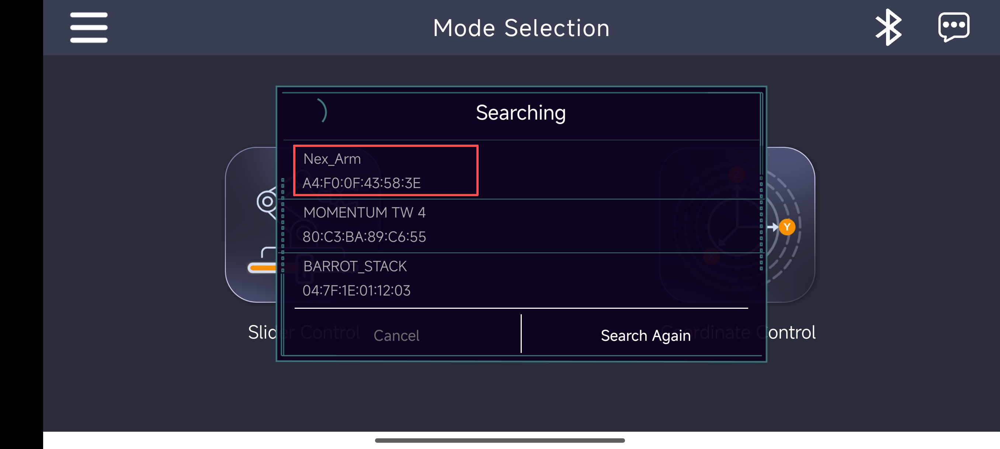

* After a successful connection, the Bluetooth list window closes automatically, and the notification **Bluetooth is connected** is displayed.

  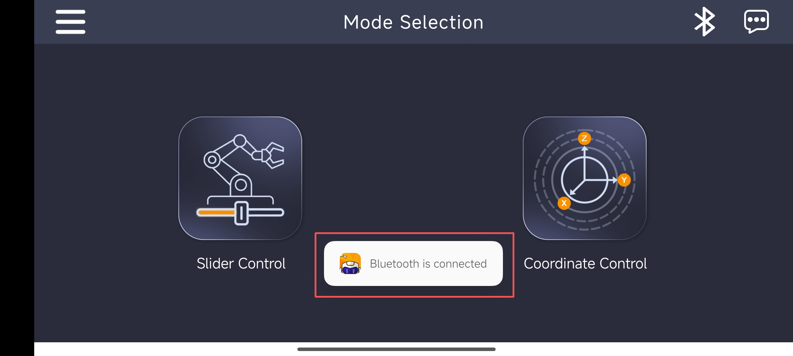

### 1.4.3 Function Overview

* **Slider Control Mode**

  In **Slider Control** mode, each NexArm servo can be controlled independently by dragging the sliders on the right side. This mode interface is divided into two main areas, marked as ① the menu bar and ② the control area.

  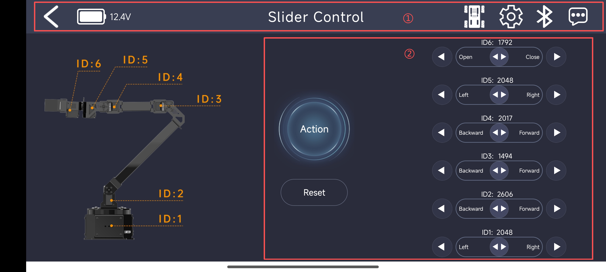

  1. Menu Bar

  | Icon | Function Description |
  | :---: | :---: |
  |  | Return to the mode selection screen. |
  | 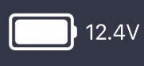 | Display the current NexArm supply voltage in real time. |
  | 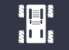 | Enter the chassis control interface. A mobile chassis is required. |
  |  | Bluetooth connection. The icon flashes when disconnected and stays on after connection. |
  |  | ESP-NOW mode configuration. A leader arm is required. |
  |  | More information. |

  2. Control Area

| Icon | Function Description |
| :---: | :---: |
| 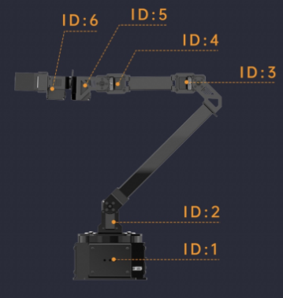 | NexArm servo ID diagram. |
| 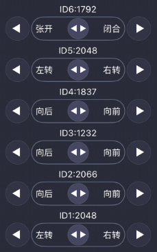 | Slider for individual servo control. |
| 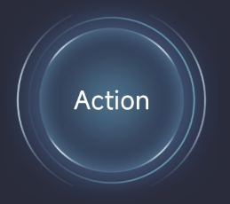 | Custom action group. The action group must be downloaded to NexArm from the host software in advance. |
|  | NexArm reset button. After pressing it, NexArm enters the reset posture for Slider Control mode. |

* **Coordinate Control Mode**

  In **Coordinate Control** mode, NexArm can perform inverse kinematics motion by adjusting the **X**, **Y**, **Z** three-axis coordinate buttons and the **Roll** and **Pitch** angle sliders. The **Clamp** slider controls the opening and closing of the gripper. This mode interface is divided into two main areas, marked as ① the menu bar and ② the control area.

  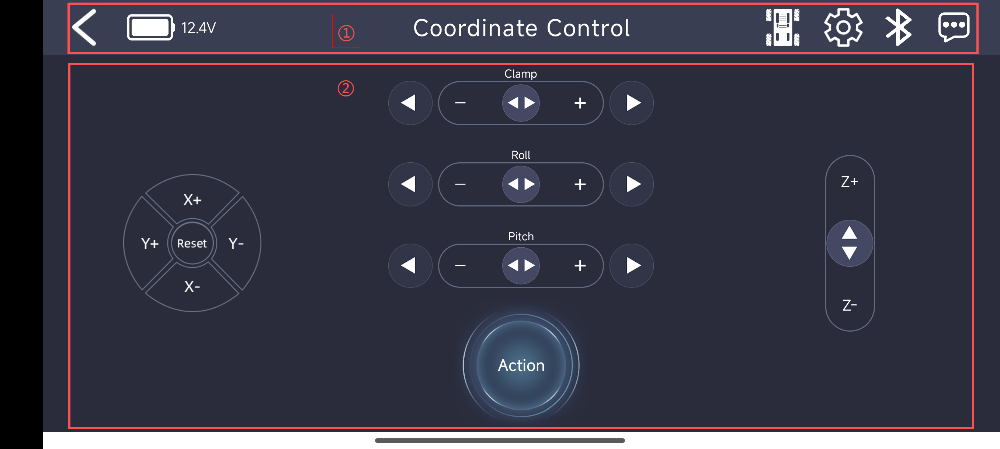

  1. Menu Bar

  | Icon | Function Description |
  | :---: | :---: |
  |  | Return to the mode selection screen. |
  |  | Display the current NexArm supply voltage in real time. |
  |  | Enter the chassis control interface. A mobile chassis is required. |
  |  | Bluetooth connection. The icon flashes when disconnected and stays on after connection. |
  |  | ESP-NOW mode configuration. A leader arm is required. |
  |  | More information. |

  2. Control Area

| Icon | Function Description |
| :---: | :---: |
| 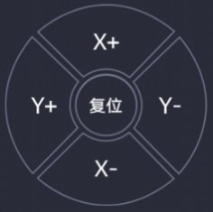 | X-axis and Y-axis motion buttons for moving NexArm along the X and Y axes and performing reset operations. |
| 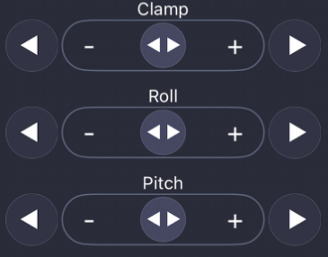 | The Clamp slider controls gripper opening and closing, while Roll and Pitch angle sliders control inverse kinematics motion. |
| 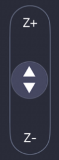 | Z-axis motion slider for moving NexArm along the Z axis. |
|  | Custom action group. The action group must be downloaded to NexArm from the host software in advance. |

### 1.4.4 Calling Action Groups

1. In either control mode, tap the action group button.

2. After tapping the button, the **Action Group** screen appears. Tap **Add** to add an action group.

   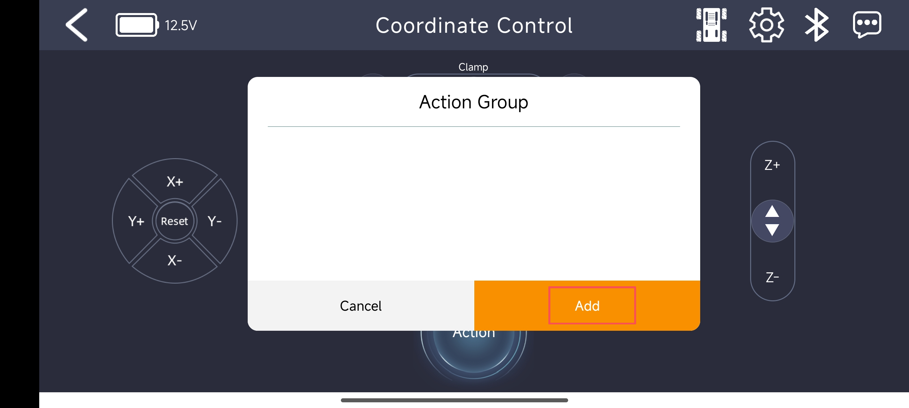

> [!NOTE]
>
> **The action group calling function requires the action group ID to be confirmed in the host software in advance, and the action group with the corresponding ID must be downloaded to NexArm. Otherwise, this function cannot be used. For the action group download procedure, refer to [1.6 Action Group Editing and Execution](#action-group-editing-and-execution) in this document.**

3. Action group 0 is downloaded to NexArm from the host software in advance. In this example, the action group is named **111**, and the action group ID is set to **0**. After the settings are complete, tap **OK**.

   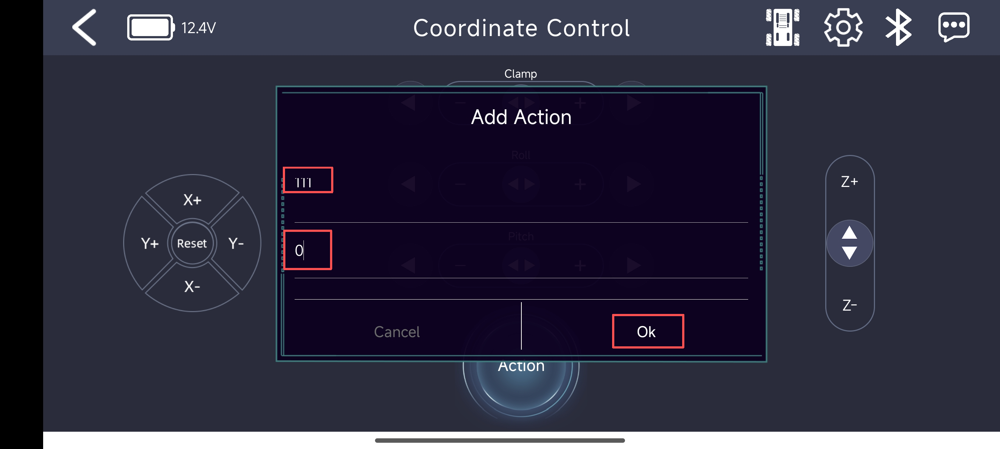

4. After entering the information, tap **OK**. The **Action Group** window closes, and the  pop-up appears. Tap the action group button again. The action group named **111** is now shown in the list. Tap it to run the action group with the corresponding ID.

   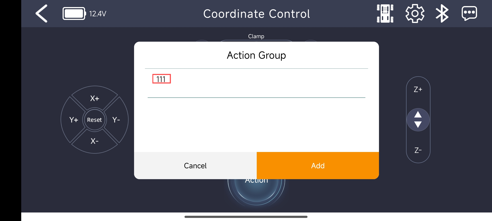

5. Press and hold the **111** item in the list. The delete and edit options for the action group will appear.

   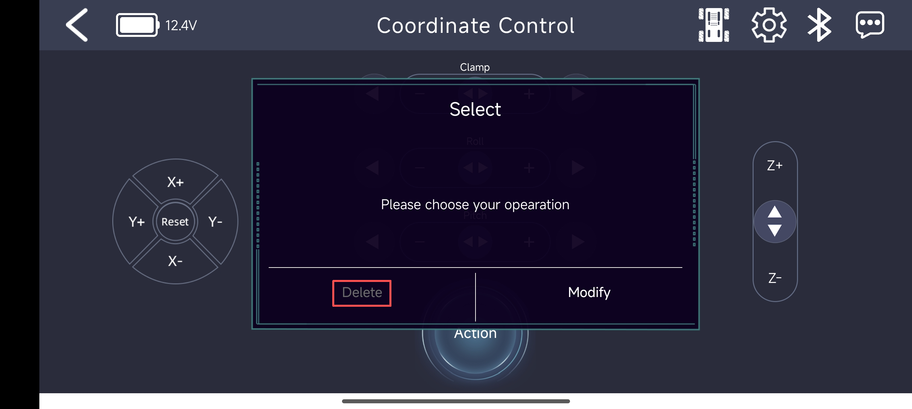

## 1.5 PC Software Control

### 1.5.1 PC Software Overview

#### 1.5.1.1 Installing the Serial Port Driver

1) Double-click **ch341ser.exe** in folder [1. Tutorials\1. Getting Started\04 Appendix\03 Serial Port Driver](https://drive.google.com/drive/folders/1DfISRUhs6I3yZvCg9s2pGMIeU8n2pko6?usp=sharing).

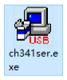

2) Click **Install**. After installation completes, a message indicating successful driver installation will appear.

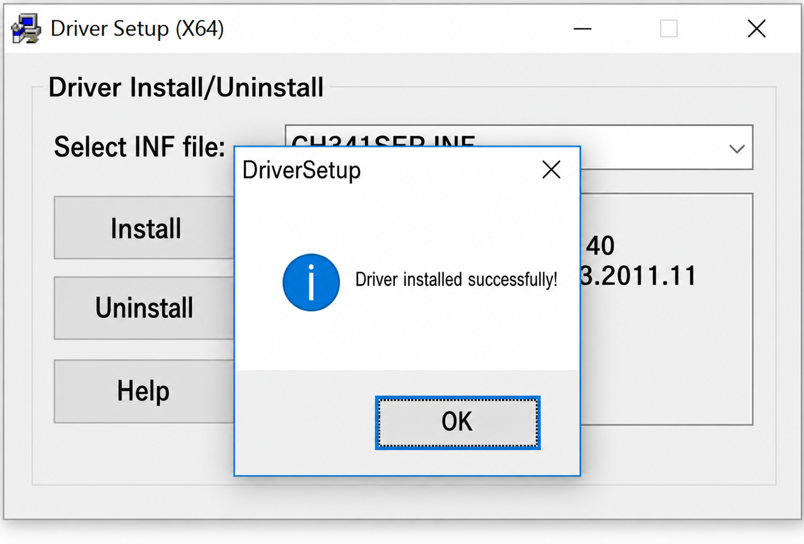

#### 1.5.1.2 Launching the Software

> [!NOTE]
>
> **The PC software does not require installation. Ensure the driver is installed on the computer before launching the software.**

1) Locate the host software executable **NexArm.exe** in folder [1. Tutorials\1. Getting Started\04 Appendix\01 NexArm PC Software](https://drive.google.com/drive/folders/1P7NKTjMPhBCG6COqJYFpmO8moWevGSiS?usp=sharing).

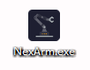

2) Switch the software language in the lower-left corner of the interface as needed.

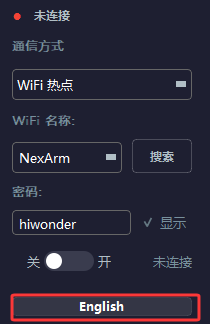

#### 1.5.1.3 Device Connection

> [!NOTE]
>
> **NexArm is shipped with factory firmware pre-downloaded, enabling direct power-on testing. If another program has overwritten the factory program, locate it under the factory program path and download it again. For flashing methods, refer to [2. ESP32 Development Basics](https://wiki.hiwonder.com/projects/NexArm/en/esp32-version/docs/2_ESP32_Development_Basics.html).**

1) Toggle the switch to **ON** to turn on the NexArm power switch.

* **Serial Port Connection**

1) After the robotic arm is powered on, connect NexArm to the computer using a Type-C data cable.

2) Open the host software, select **Serial (USB)** as the communication method, and select the corresponding device port to connect.

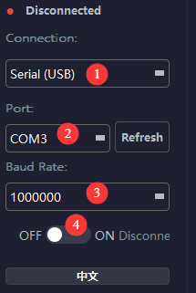

3) When the red circular icon turns green and displays connected, the connection is successful.

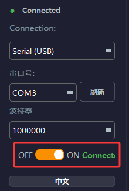

* **Wi-Fi Connection**

1. After the robotic arm is powered on, press **KEY1** to switch to **ESP-NOW** mode for leader arm control.

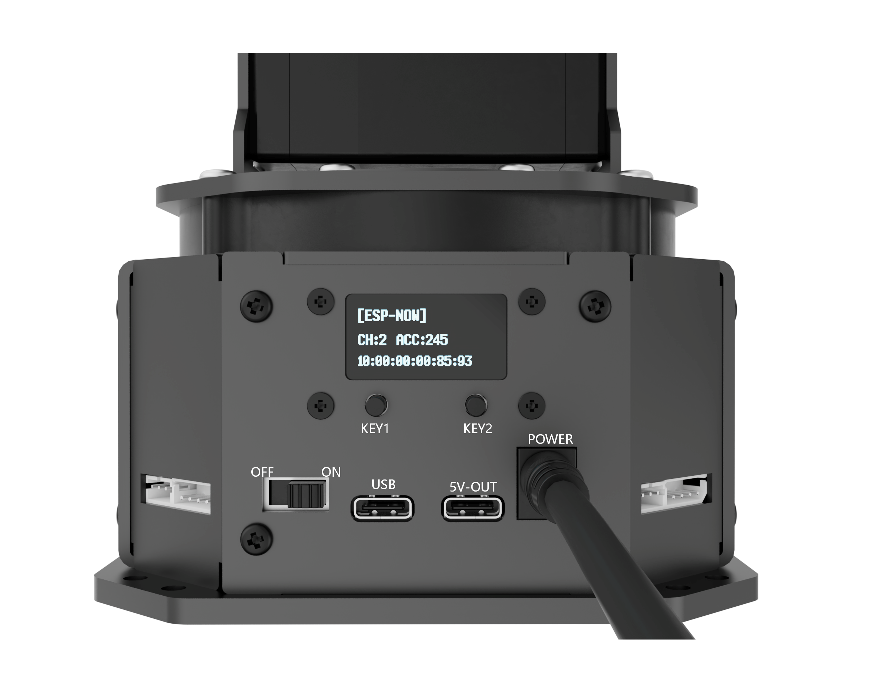

2. After switching to **ESP-NOW** mode, press **KEY1** again to switch to **WiFi AP** mode. The display will show the Wi-Fi name `NexArm` and the IP address. Wireless connection to the host software can now be established.

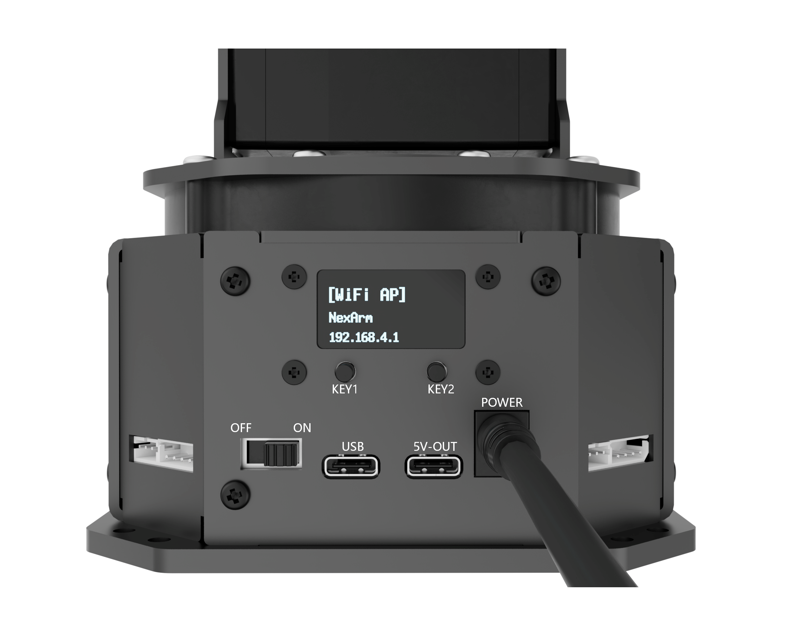

3. Open the host software, switch the communication method to **WiFi Hotspot**, search for the hotspot `NexArm`, and connect using password `hiwonder`.

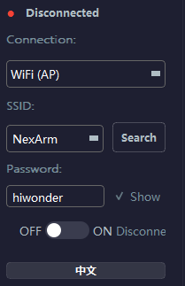

4. After a successful connection, the **Connected** prompt is displayed. At the same time, the device IP field in **System Log** displays the IP address of NexArm.

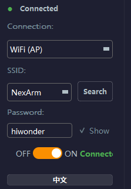

### 1.5.2 Function Overview

The host software interacts with NexArm through six control modes and system settings to implement different functions: **Action Group Control**, **Coordinate Control (FK/IK)**, **Peripheral & Chassis**, **System Settings**, **AI Play Control**, and **Teach Edit**.

#### 1.5.2.1 Action Group Control

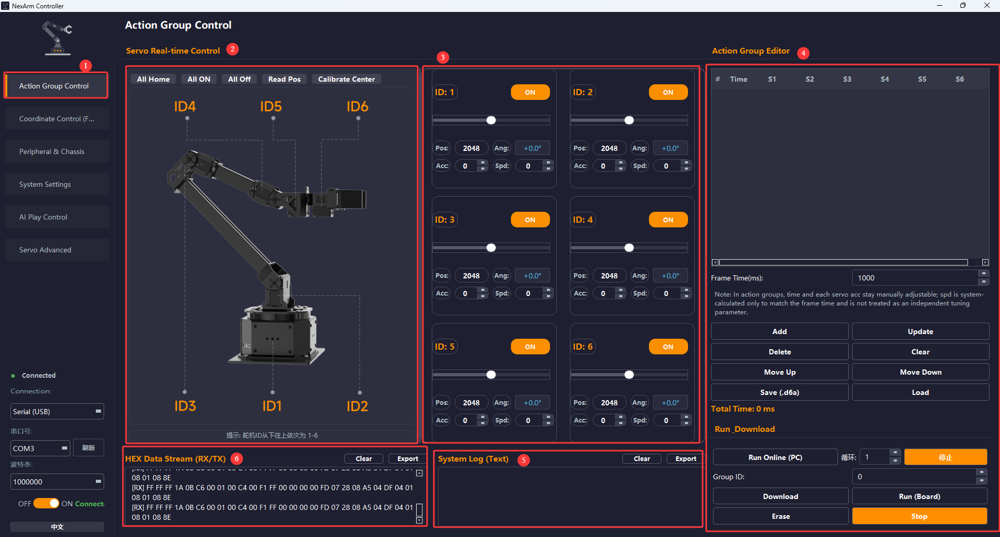

| Label | Area Name | Purpose and Function | How to Use |
| --- | --- | --- | --- |
| 1 | Action Group Control tab entry | Opens the main Action Group Control page for individual servo debugging, action group editing, action group download, and action group execution. | Click the left-side menu to enter this page after completing the serial port connection. |
| 2 | Real-time servo control and robotic arm diagram area | Displays the position relationship of the 6 servos on the robotic arm and provides whole-arm buttons: **All Home**, **All On**, **All Off**, **Read Pos**, and **Calibration Center**. **All Home** returns the whole arm to the default posture. **All On** and **All Off** enable or disable torque for the whole arm. **Read Pos** refreshes the current servo status. The **Calibration Center** is mainly used for installation and calibration, adjusting servos to the mechanical installation reference center. | Before debugging, click **All On**, then click **Read Pos**. Click **All Home** when the robotic arm needs to return to a safe posture. Use **Calibration Center** during horn installation or zero-position calibration to set the current angles of all servos as center angles, except servos 5 and 6. |
| 3 | Individual servo control card area | Each ID has an independent control card, including **ON/OFF**, a position slider, **Pos**, **Ang**, **Acc**, and **Spd** for independent debugging and fine adjustment of individual joints. | Select the corresponding ID, turn **ON**, then adjust the position through the slider or value box. **Pos** inputs a specific position to the servo, **Acc** controls the acceleration of the current motion, and **Spd** controls the speed of the servo to reach **Pos**. When a single axis behaves abnormally, check each axis individually. |
| 4 | Action group editing and running area | Edits, saves, loads, downloads, and runs action groups. The upper table saves Time + S1~S6 by frame. A single-frame time can be set in the middle area. The middle-lower area provides **Add**, **Update**, **Delete**, **Clear**, **Move Up**, **Move Down**, **Save (.d6a)**, and **Load**. The bottom area provides **Run Online (PC)**, loop count, **Group ID**, **Download**, **Run (Board)**, **Erase**, and **Stop**. **Download** writes the action group to the ESP32. During onboard execution, the controller runs the onboard file by group ID. | Workflow: 1. Manually adjust the posture. 2. Click **Add** to record one frame. 3. Repeat until the full action is recorded. 4. Save it locally as a **.d6a** file. 5. To run offline, set **Group ID**, then click **Download**. 6. Click **Run (Board)** to let the controller execute the action independently. During online debugging, **Run Online (PC)** can be used directly. |
| 5 | System Log text area | Displays connection status, action group operation results, error prompts, and function feedback for checking whether commands execute correctly. | Check this area first when running action groups, downloading files, or stopping actions. If the log is empty or abnormal, check together with the HEX data stream. |
| 6 | HEX data stream RX and TX area | Displays raw hexadecimal communication data between the host software and controller for protocol debugging and serial communication troubleshooting. | After clicking a function button, check this area first to confirm whether corresponding transmit or receive data appears when commands or responses seem missing. |

#### 1.5.2.2 Coordinate Control

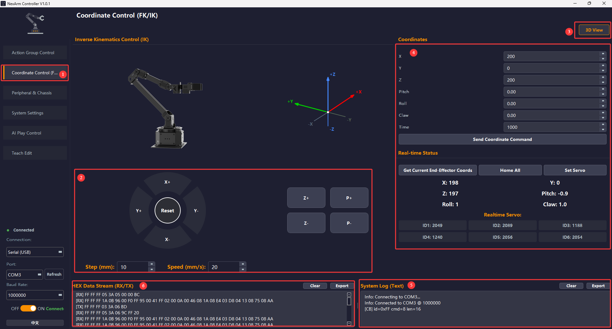

| Label | Area Name | Purpose and Function | How to Use |
| --- | --- | --- | --- |
| 1 | Coordinate Control tab entry | Opens the coordinate control page to control the robotic arm by end-effector coordinates instead of individual servo angles. | Click the left-side menu to enter this page. |
| 2 | Inverse kinematics control main area | Provides the end-effector incremental control area, including **X+**, **X-**, **Y+**, **Y-**, **Z+**, **Z-**, **P+**, **P-**, and **Reset**, and displays the robotic arm posture diagram and coordinate axis directions. **Step (mm)** sets the movement step for each click. **Speed (mm/s)** sets the robotic arm speed adjustment under coordinate control. | To fine-tune the end-effector position, set **Step (mm)** first, then click the direction buttons to approach the target position step by step. **P+** and **P-** adjust pitch angle, **Z+** and **Z-** control movement along the Z-axis coordinate, and **Reset** returns to the default reference posture in coordinate control mode. |
| 3 | 3D view button | Switches or opens the 3D posture view to observe coordinate axis directions, end-effector posture, and spatial relationships. | Click when a more intuitive posture view is needed. If a separate 3D window is not enabled in the current software version, this button serves as a posture-view entry. |
| 4 | Coordinate parameters and the real-time status area | Allows direct input of **X**, **Y**, **Z**, **Pitch**, **Roll**, **Claw**, and **Time**, then sends the full coordinate set. It also supports **Get Current End-Effector Coords**, **Home All**, and **Read Servos**. The lower area displays current TCP status and real-time values of all 6 servos. | When target coordinates are known, enter target values and click **Send Coordinate Command**. To read current posture first and make a small adjustment, click **Get Current End-Effector Coords**. To check joint status, click **Read Servos**. |
| 5 | System Log text area | Displays text feedback for coordinate control, status reading, centering, and communication exceptions. | Check this area first when no motion occurs during coordinate control. |
| 6 | HEX data stream RX and TX area | Displays coordinate control commands and returned packets, including sending coordinates, reading servos, and reading end-effector coordinates. | Used to confirm whether IK control commands have been sent to the device. |

#### 1.5.2.3 Peripheral & Chassis

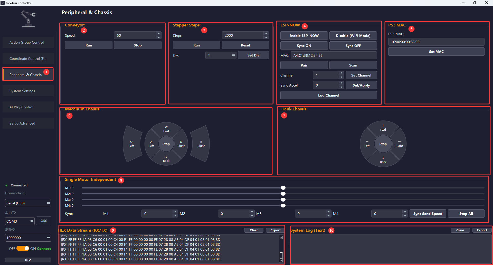

| Label | Area Name | Purpose and Function | How to Use |
| --- | --- | --- | --- |
| 1 | Peripheral Control tab entry | Opens the peripheral control page to centrally manage the conveyor belt, slide rail, ESP-NOW, PS3 MAC, chassis, and multiple motors. | Click the left-side menu to enter this page. |
| 2 | Conveyor belt | Sets conveyor belt speed and controls running and stopping. | Enter a value in the speed box, then click **Run** to start or click **Stop** to stop. Used when debugging grasping or sorting scenarios. |
| 3 | Sliding rail steps | Controls step count, reset, and microstepping settings of the stepper sliding rail. | Set target step count first, then click **Run**. Click **Reset** to return to origin. To adjust motion resolution, set **Div**, then click **Set Div**. |
| 4 | ESP-NOW | Configures ESP-NOW wireless mode, synchronization switch, target MAC, channel, and synchronization acceleration. It also supports channel scanning. | Workflow: 1. Click **Enable ESP-NOW**. 2. Configure target MAC or pairing. 3. Set **Channel**. 4. Click **Sync ON** when Leader-Follower synchronization is required. 5. If interference is heavy, click **Scan Channel** first, then select a cleaner channel. |
| 5 | PS3 MAC | Writes the PS3 controller Bluetooth MAC address. After receiving this command, the firmware saves the configuration and restarts to apply the new MAC. | Enter the correct PS3 MAC and click **Set MAC**. A brief device disconnection after setting is normal due to device restart. |
| 6 | Mecanum chassis | Controls the Mecanum chassis to move forward, move backward, strafe left, strafe right, turn left, turn right, and stop for omnidirectional chassis. | Use this area when the device chassis type is Mecanum. Click the corresponding direction button to test chassis movement. If movement is abnormal, verify chassis parameters in **System Settings**. |
| 7 | Tracked chassis | Controls the tracked or differential chassis to move forward, move backward, turn left, turn right, and stop. | Use this area when the device uses a tracked or differential chassis. Low-speed direction testing is recommended first. |
| 8 | Individual motor control | Independently controls motors M1 through M4, and can send four speed values simultaneously for correcting individual motor direction, troubleshooting motor faults, or testing combined drive motion. | During individual checks, adjust upper sliders. To send all four values together, enter M1 through M4 values below, then click **Sync Send Speed**. Click **Stop All** for emergency stop. |
| 9 | HEX data stream RX and TX area | Displays low-level commands sent from the peripheral control page to verify whether ESP-NOW, chassis, and motor commands are actually sent. | If a peripheral does not respond, check this area first to see whether packets are being sent. |
| 10 | System Log text area | Displays status feedback and error information during peripheral control. | If peripheral motion does not match expectations, check this area together with the HEX area first. |

#### 1.5.2.4 System Settings

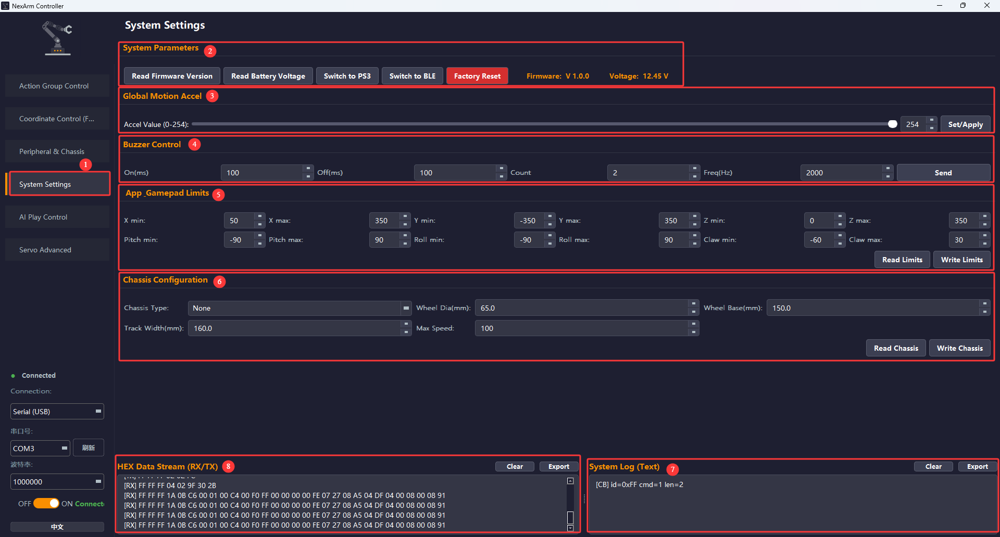

| Label | Area Name | Purpose and Function | How to Use |
| --- | --- | --- | --- |
| 1 | System Settings tab entry | Opens the system settings page for reading system parameters, restoring factory settings, setting limits, global acceleration, buzzer control, and chassis parameters. | Click the left-side menu to enter this page. |
| 2 | System parameters | Includes **Read Firmware Version**, **Read Battery Voltage**, **Switch to PS3**, **Switch to BLE**, and **Factory Reset**. Restoring Factory Settings resets coordinate limits, servo offsets, additional motion acceleration, robotic arm posture, chassis parameters, kinematics parameters, and default PS3 MAC. | Use **Factory Reset** during device delivery, maintenance, or when parameters become disordered. The device restarts after switching BLE or PS3 mode, which is normal. |
| 3 | Global motion acceleration | Sets global acceleration parameter affecting synchronized individual servo motion, ESP-NOW synchronization, and motion control functions, corresponding to `CMD_SET_GLOBAL_ACC` in firmware. | Lower the value if motion feels too abrupt, or increase it appropriately if motion feels too sluggish, and then click **Set/Apply**. |
| 4 | Buzzer control | Sets on duration, off duration, count, and frequency, then sends a buzzer prompt command for debugging or interaction feedback, corresponding to `CMD_BUZZER_SET` in firmware. | Enter parameters, then click **Send** to test whether the buzzer works properly or to create an interaction prompt. |
| 5 | App and controller limits | Sets upper and lower limits for **X**, **Y**, **Z**, **Pitch**, **Roll**, and **Claw**, which affect coordinate control and controller control ranges as safety boundaries. Firmware updates local ESP32 variables and sends limits to AT32. | Click **Read Limits** to check current configuration, then make small adjustments and click **Write Limits**. After changes are made, test boundary movement immediately to confirm no limit is exceeded. |
| 6 | Chassis parameter settings | Sets chassis type, wheel diameter, wheelbase, track width, maximum speed, and related parameters, corresponding to `CMD_SET_CHASSIS_CONFIG` and `CMD_GET_CHASSIS_CONFIG` in firmware. | Read and modify parameters here after replacing chassis or when chassis movement is inaccurate. After parameters are written, verify movement immediately on the **Peripheral & Chassis** page. |
| 7 | Kinematics parameter settings | Configures 9 floating-point parameters for robotic arm geometry model including links, link offsets, fixed offset, base radius, and base height for FK and IK. | Click **Read Chassis** first to check lower-controller configuration, modify input boxes as needed, then click **Write Chassis** to save and send parameters. After replacing links or structural parts, calibrate the full parameter set, and then perform simple point-to-point motion to verify end-effector accuracy. |
| 8 | System Log text area | Displays execution feedback for system settings, such as version reading, voltage reading, limit writing, and factory reset results. | Pay close attention to this area when operating system-level parameters. |
| 9 | HEX data stream RX and TX area | Displays low-level protocol data related to system settings. | Use this area to confirm protocol communication when limit writing, Bluetooth mode switching, or chassis parameter settings do not take effect. |

#### 1.5.2.5 AI Play Control

> [!NOTE]
>
> **This section applies only to the NexArm Advanced and Ultimate Kits equipped with the K230 vision module.**

Please note that the image pre-flashed on the K230 vision module provided with NexArm is a special custom edition for NexArm. The general course materials for standalone K230 vision modules do not apply to this module. To use standalone K230 course materials, re-flash the image from those materials.

The NexArm K230 vision module comes pre-flashed with the latest dedicated factory image. If the K230 vision module fails to power on during use, re-flash the image. For image flashing steps, refer to [1. Tutorials\1. Getting Started\04 Appendix\05 K230 Vision Module (WonderMK) Tutorial and Tools\01 K230 Vision Module Quick Start Tutorial\01 K230 Vision Module Quick Start.pdf](https://drive.google.com/drive/folders/1gbHQ8Ls8ZHCqDLKdFmw_dplVYCooHKmS?usp=sharing) in the product materials.

* **Vision Offset Calibration**

> [!NOTE]
>
> **Vision offset calibration must be performed before enabling AI vision features. The AprilTag cards required for vision offset calibration are located under [1. Tutorials\1. Getting Started\04 Appendix\06 E-Card Collection\02 AprilTag Card Collection](https://drive.google.com/drive/folders/1DYXTwGP8i_ONuzCFkW93MtWknp-X-9IQ) in the same directory.**

1. Place the AprilTag card on the desktop and click **Start Align**. The robotic arm will move to the calibration posture, and the **System Log** will print AprilTag debugging information.

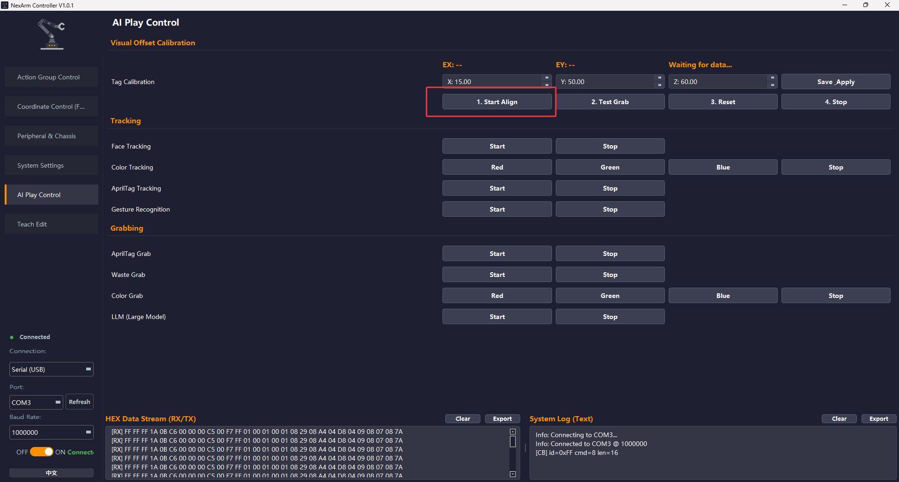

2. Move the AprilTag card according to the debugging information until the **System Log** prints "**Perfectly aligned to center!**", as shown below:

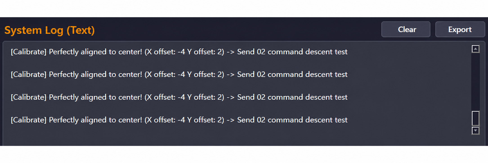

3. Click **Test Grab**. The robotic arm will lower in a grasping posture.

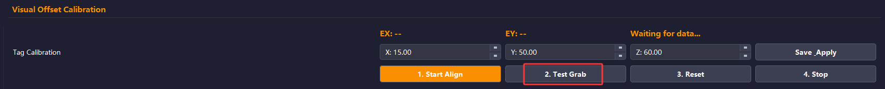

4. If the robotic arm does not reach the expected angle after lowering, click **Reset** first, then adjust the **X**, **Y**, and **Z** values. After completing adjustments, click **Save_Apply**, then click **Test Grab** again until the robotic arm reaches the expected position after lowering. Once the expected position is reached, click **Stop Align**.

> [!NOTE]
>
> * **If the robotic arm shifts left or right after lowering, adjust the Y value.**
>
> * **If the robotic arm shifts forward or backward, adjust the X value.**
>
> * **If the robotic arm shifts up or down, adjust the Z value.**

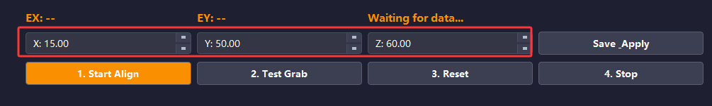

* **Tracking Features**

Click **Start** to launch the corresponding tracking feature. Once enabled, the robotic arm will perform tracking motion based on the recognized target. For detailed implementation effects and execution workflows of each tracking feature, refer to [1. Tutorials\4. AI Vision Features](https://wiki.hiwonder.com/projects/NexArm/en/esp32-version/docs/4_AI_Vision_Features.html).

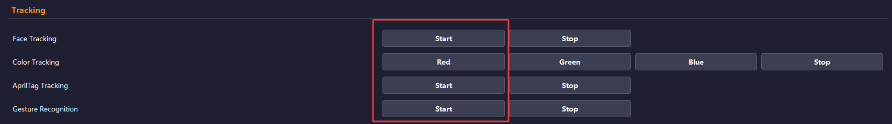

* **AprilTag Grab**

Place the AprilTag card on the desktop. After clicking **Start**, the robotic arm will automatically recognize the target, adjust its angle, lower, and grasp the target.

* **Waste Grab**

Similar to AprilTag automatic grasping, after clicking **Start**, the robotic arm will automatically recognize the target, adjust its angle, lower, and grasp the target. The waste classification electronic card collection is located under [04 Appendix\06 E-Card Collection\03 Waste Classification Card Collection](https://drive.google.com/drive/folders/1m1iCqutwfTcvbTeYInPzo406pFIBo0Gc?usp=sharing) in the same directory.

* **Color Grab**

Similar to AprilTag automatic grasping, after clicking **Start**, the robotic arm will automatically recognize the target, adjust its angle, lower, and grasp the target. When using this feature, regular-shaped color blocks are recommended as grasping targets.

* **Large AI Model Features**

1. Before using the large AI model features, configure the network connection and large AI model according to the files under [04 Appendix\05 K230 Vision Module (WonderMK) Tutorial and Tools\01 K230 Vision Module Quick Start Tutorial](https://drive.google.com/drive/folders/1gbHQ8Ls8ZHCqDLKdFmw_dplVYCooHKmS?usp=sharing) in the same directory.

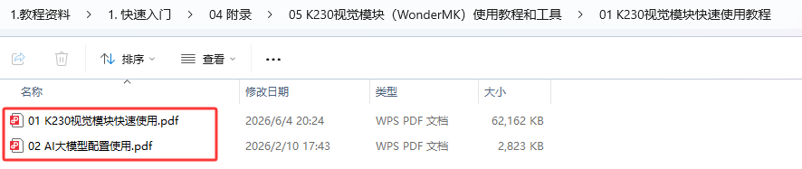

2. After configuring the network, open the **AI Model** feature on the K230 vision module and wake it up using the voice command **Hello Hiwonder**.

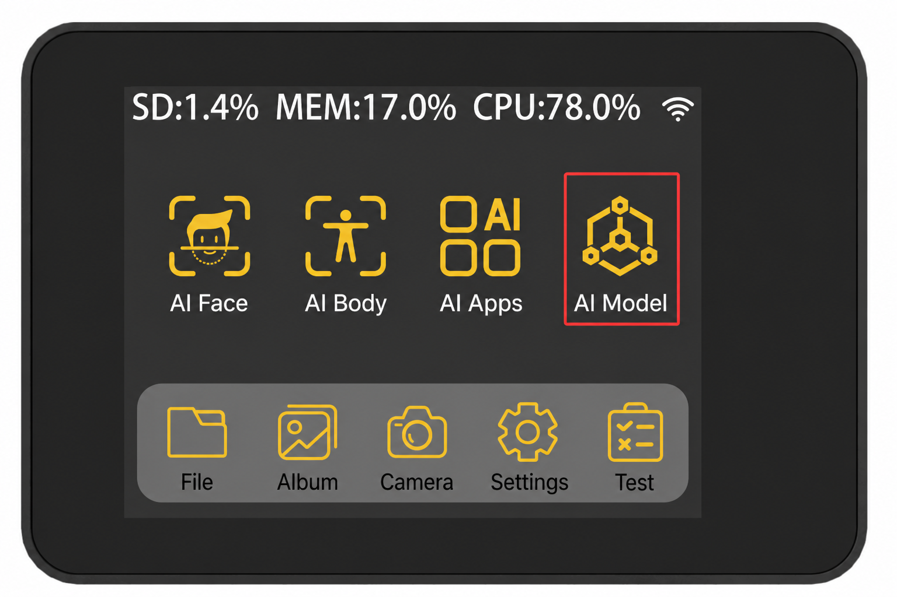

3. After waking up, click **Start** under the large AI model feature in the host software, then issue voice commands to control the robotic arm to perform corresponding actions. For specific details, refer to [1. Tutorials\5. WonderMK Large AI Model Features](https://wiki.hiwonder.com/projects/NexArm/en/esp32-version/docs/5_WonderMK_Large_AI_Model_Features.html).

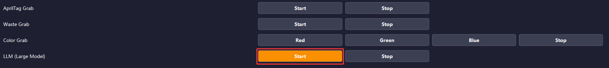

#### 1.5.2.6 Teach Edit

* **Function Entry**

  Click **Teach Edit** in the left-side menu to enter the corresponding interface.

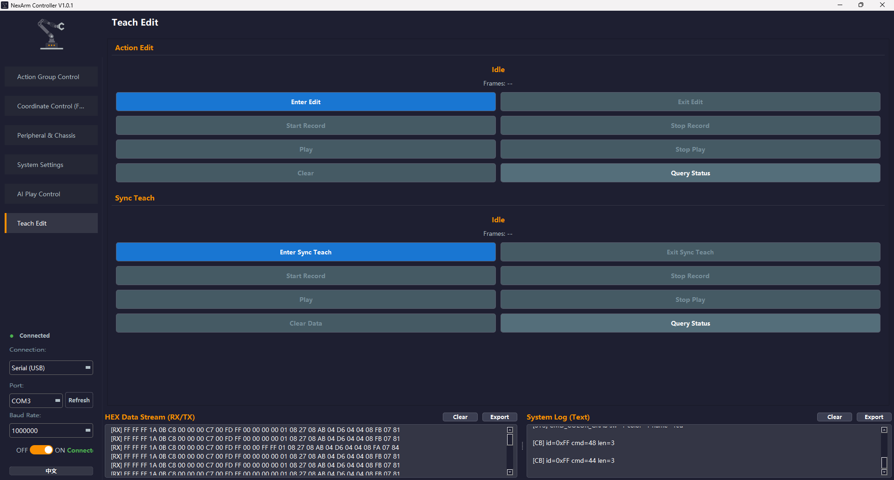

* **Local Teach Edit Steps**

  1. Click **Enter Edit**. All NexArm servos power off, allowing any servo to be manually moved by hand.
  2. Click **Start Record**, then move any servo by hand. The system automatically records the motion.
  3. Click **Stop Record**. The system stops recording the current motion automatically and saves the recorded action.
  4. Click **Play**. NexArm automatically executes the action recorded in step 2 and stops automatically after playback completes.
  5. Click **Stop Play** to interrupt an action currently playing.
  6. Click **Clear Data** to clear recorded actions.
  7. Click **Query Status** to print information such as current playback frame count in the system log.
  8. Click **Exit Edit**. All NexArm servos power on, and **Local Teach Edit** mode exits.

* **Synchronizer Teach Steps**

> [!NOTE]
>
> **This section applies only to the NexArm Ultimate Kit equipped with a leader arm.**

  1. Power on the leader arm.
  2. Click **Enter Sync Teach**. NexArm automatically connects to the leader arm and synchronizes motion.
  3. Click **Start Record**, then operate the leader arm. NexArm automatically performs the same motion, recording and saving the current action.
  4. Click **Stop Record**. The system stops recording the current motion automatically and saves the recorded action.
  5. Click **Play**. NexArm automatically executes the action recorded in step 2 and stops automatically after playback completes.
  6. Click **Stop Play** to interrupt an action currently playing.
  7. Click **Clear Data** to clear recorded actions.
  8. Click **Query Status** to print information such as current playback frame count in the system log.
  9. Click **Exit Edit**. All NexArm servos power on, and **Sync Teach Edit** mode exits.

## 1.6 Action Group Editing and Execution

### 1.6.1 Editing Action Groups

1. After connecting the robotic arm to the host software, switch to the **Servo and Action Group** interface and click **Read Pos**.

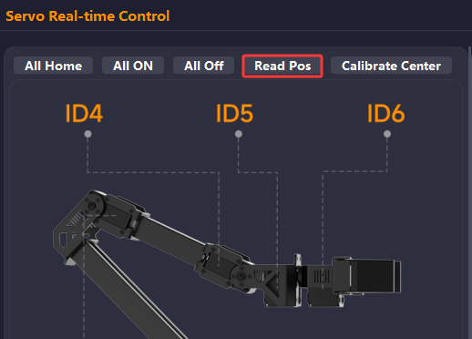

2. After reading positions, the real-time position of each ID is displayed on the right.

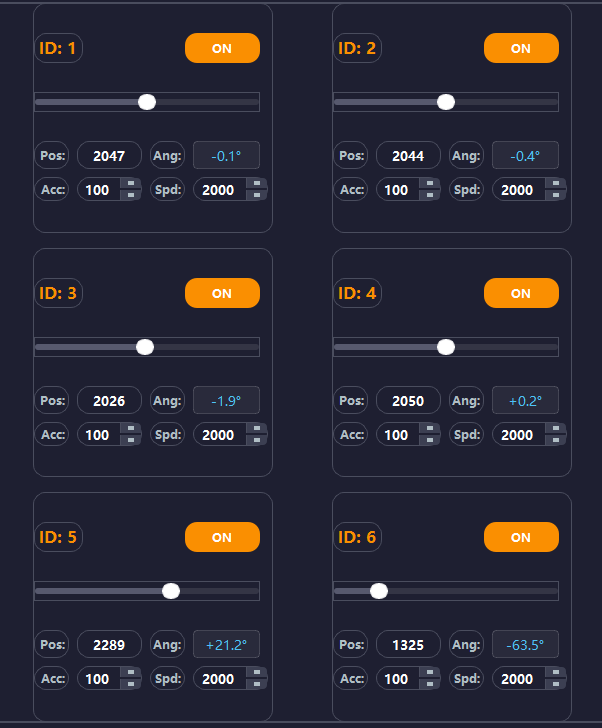

3. Click **Add** in the **Action Group Editor** section to add current angles of all servos as one action frame. Click an action group number to run that frame. After selecting a number, modify **Frame Time (ms)** and click **Update** to set the time required for running this frame.

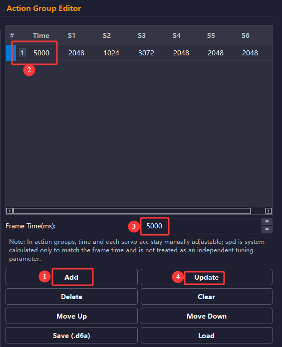

4. After clicking an action frame, adjust the individual servo **Acc** value, from **0** to **255**, and click **Update** to adjust servo acceleration for that frame.

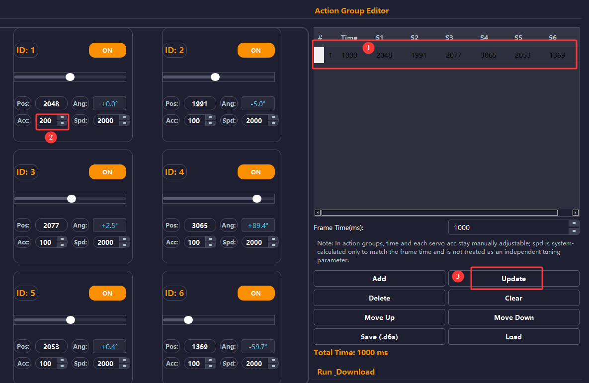

5. When editing a multi-frame action group, select an action group number and click **Delete** to delete that frame. Click **Clear** to clear all actions. After selecting an action number, click **Move Up** or **Move Down** to adjust its position. Click **Save (.d6a)** to save the current action group as a **.d6a** file. Click **Load** to parse a **.d6a** file into an action group and import it into NexArm.

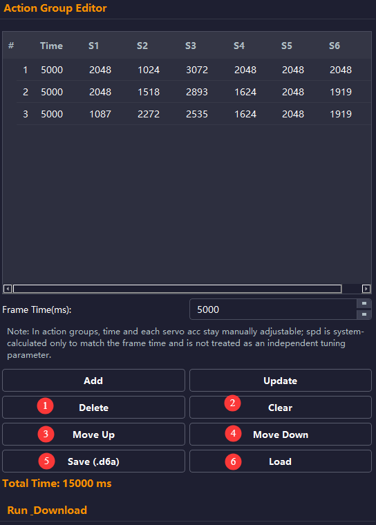

6. Factory preset action groups are provided under [1. Tutorials\1. Getting Started\04 Appendix\04 Factory Action Groups](https://drive.google.com/drive/folders/1YAblC5zxgFZk2LFSBWHdFPJaSP_0MrZU?usp=sharing). Flashing to NexArm can be performed using the method above.

### 1.6.2 Running and Downloading Action Groups

After action group editing is complete, click **Run Online (PC)** in the **Run_Download** section to run all edited action groups. Modify **Group ID**, the action group number, and click **Download** to download the current action group to the robotic arm controller. Click **Run (Board)** to run the action group downloaded to the controller. Click **Erase** to delete all action groups downloaded to the controller. Click **Stop** to stop the currently running action group.

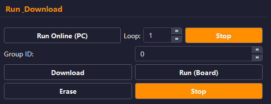

## 1.7 Wireless Controller Control

> [!NOTE]
>
> **This section applies only to the NexArm Advanced and Ultimate Kits equipped with a PS3 wireless controller.**

### 1.7.1 PS3 Controller Overview

NexArm is equipped with a PS3 protocol-compatible wireless controller held with both hands, with a D-pad on the left, four face buttons △, ○, ×, □ on the right, Select and Start in the center, and a PS button on the front. Two sets of shoulder buttons L1/L2 and R1/R2 on top, along with two pressable analog sticks (L3/R3). Communication is handled via Bluetooth connected to the controller, with a built-in battery, USB charging, and player indicators. It is used to adjust arm posture and servos in coordinate/servo control modes, as well as chassis forward movement, strafing, and turning.

### 1.7.2 Controller Button Layout

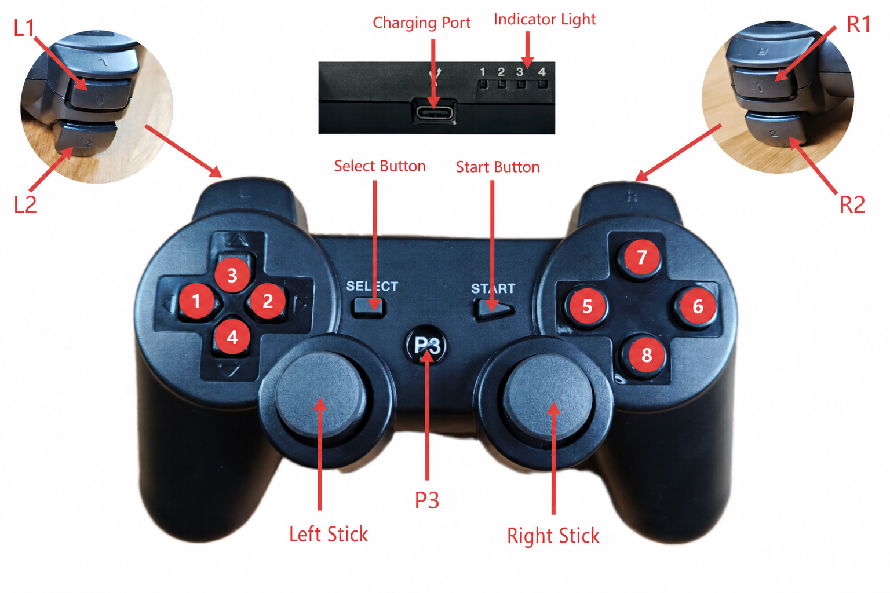

| Button No. | Coordinate Control Mode | Servo Control Mode |
| :---: | :---: | :---: |
| **P3** | Power button | Power button |
| Left joystick | Chassis control joystick 1 | Chassis control joystick 1 |
| Right joystick | Chassis control joystick 2 | Chassis control joystick 2 |
| **Select** button | Press and hold **Select** and **Start** simultaneously to switch modes. One short beep indicates coordinate control mode. Two short beeps after pressing indicate servo control mode. | Press and hold **Select** and **Start** simultaneously to switch modes. One short beep indicates coordinate control mode. Two short beeps after pressing indicate servo control mode. |
| **Start** button | Press once for reset function | Press once for reset function |
| Charging port | Type-C 5 V charging port | Type-C 5 V charging port |
| Indicator light | After power-on, all four indicator lights flash to search for device. After connection, indicator 1 stays on. | After power-on, all four indicator lights flash to search for device. After connection, indicator 1 stays on. |
| ① | Increase robotic arm movement along Y axis | Increase servo 1 angle |
| ② | Decrease robotic arm movement along Y axis | Decrease servo 1 angle |
| ③ | Increase robotic arm movement along X axis | Increase servo 2 angle |
| ④ | Decrease robotic arm movement along X axis | Decrease servo 2 angle |
| ⑤ | Decrease robotic arm Pitch angle | Increase servo 4 angle |
| ⑥ | Increase robotic arm Pitch angle | Decrease servo 4 angle |
| ⑦ | Increase robotic arm movement along Z axis | Increase servo 3 angle |
| ⑧ | Decrease robotic arm movement along Z axis | Decrease servo 3 angle |
| **L1** | Increase robotic arm Roll angle | Decrease servo 5 angle |
| **L2** | Decrease robotic arm Claw angle | Decrease servo 6 angle |
| **R1** | Decrease robotic arm Roll angle | Increase servo 5 angle |
| **R2** | Increase robotic arm Claw angle | Increase servo 6 angle |

### 1.7.3 Wireless Controller Connection

1. Look into the Bluetooth pairing code on the back of the controller.

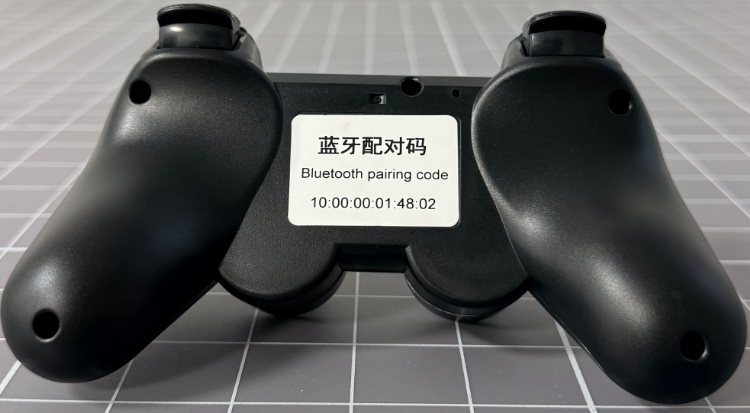

2. Connect NexArm to the PC software, then change the NexArm Bluetooth pairing code to match the controller Bluetooth pairing code. For detailed host software connection and usage, refer to [1.5 PC Software Control](#pc-software-control).

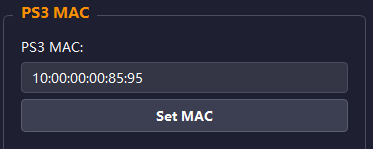

3. Power on NexArm again. The display will show NexArm posture information.

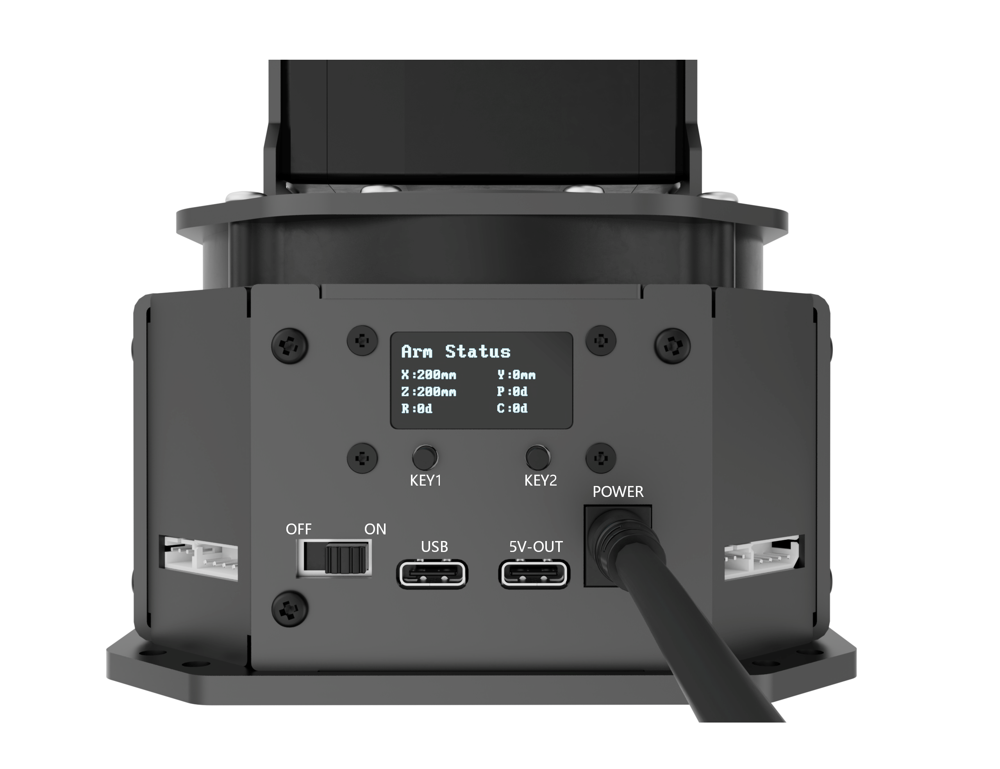

4. Press **KEY2**. The display shows the prompt **Switch to BLE Press again to confirm switch**.

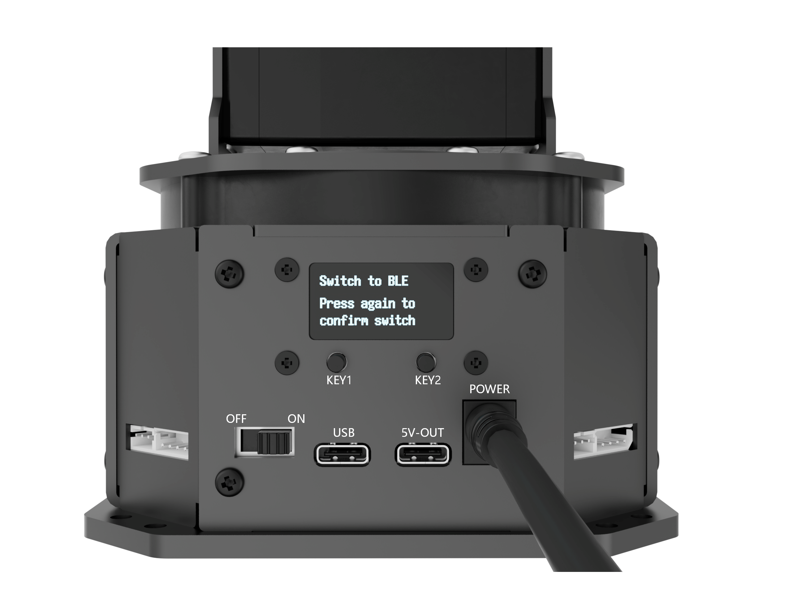

5. Press **KEY2** again to start switching. After the switch is successful, the screen restarts. The active mode is app Bluetooth control, and the robotic arm can be controlled from the app.

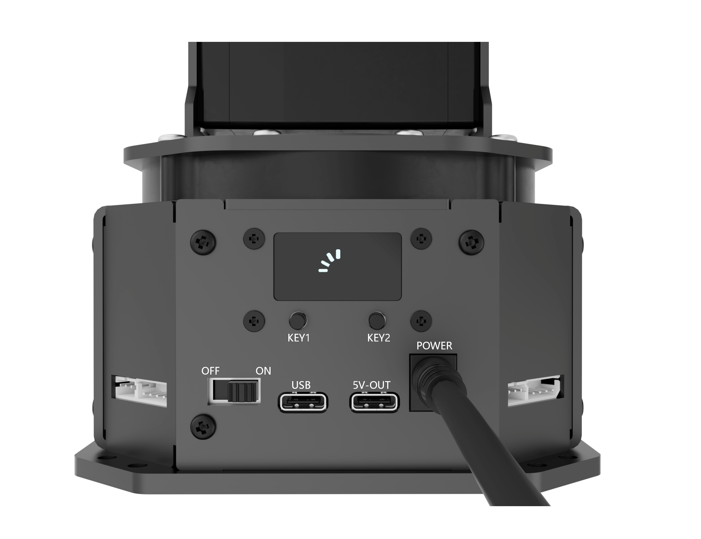

6. Press **KEY2** again. The display shows the prompt **Switch to PS3 Press again to confirm switch**.

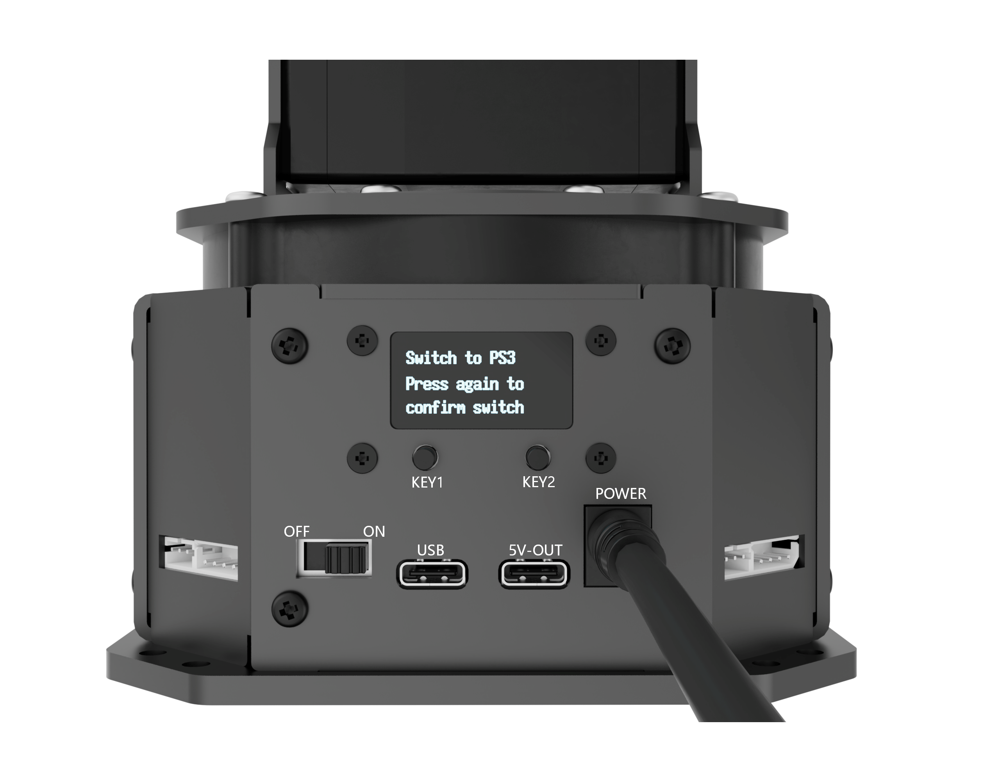

7. Press **KEY2** again to start switching. After the switch is successful, the screen restarts. Keep NexArm in this state.

8. Press and hold the controller **P3** button. The four indicator lights begin flashing.

9. After flashing for 2 to 4 seconds, indicators 2, 3, and 4 stop flashing, and indicator 1 stays on. This indicates that the controller has connected successfully. NexArm can now be controlled according to the controller button descriptions.

## 1.8 Synchronizer Control

> [!NOTE]
>
> **This section applies only to the NexArm Ultimate Kit equipped with a leader arm.**

1. Press **KEY1** to set the NexArm robotic arm to **ESP-NOW** mode.

2. Alternatively, use **Peripheral & Chassis** in the PC software: click **Enable ESP-NOW**, change the channel to **2**, click **Set Channel**, and click **Pair**. To control multiple NexArm units with the leader arm, click **Scan**.

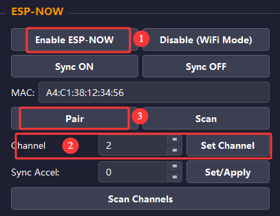

3. After the mode switch is successful, power on the leader arm. NexArm automatically pairs with the leader arm. The leader arm can control NexArm in real time for synchronized motion.
