# 10. Large AI Model Courses

## 10.1 Multimodal Large Model Applications

### 10.1.1 Preparation

<p id ="p12-2-1"></p>

This lesson covers flashing firmware to the WonderEcho Pro.

1. Connect WonderEcho Pro to the computer using a Type-C data cable.

   

2. Open the **PACK_UPDATE_TOOL.exe** file under [Appendix / Firmware Flashing Tool](https://drive.google.com/drive/folders/1r2ct899U_7aK2qF7nz46MaSzFiB6Jh4N?usp=sharing), select the **CI1302** chip, and click **Update**.

   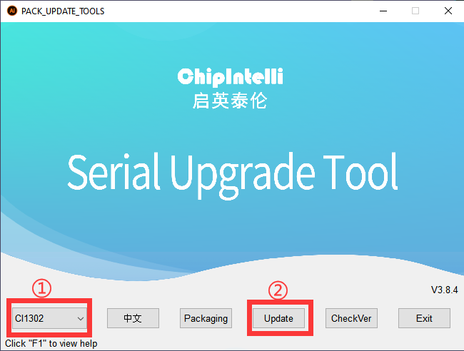

   Flashing the **English firmware (wake word hello hiwonder).bin** is used as an example, and the operating steps are equally applicable to flashing firmware with other wake words.

3. Click **Select Firmware** and locate the **English firmware (wake word hello hiwonder).bin** firmware under the [Appendix](https://drive.google.com/drive/folders/1THBsl0_o-KakU-_7QVFSXlSznB270g4v?usp=sharing) directory.

   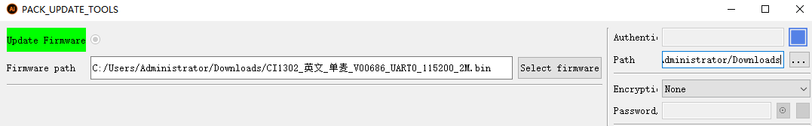

4. Locate the corresponding serial port and check the box.

   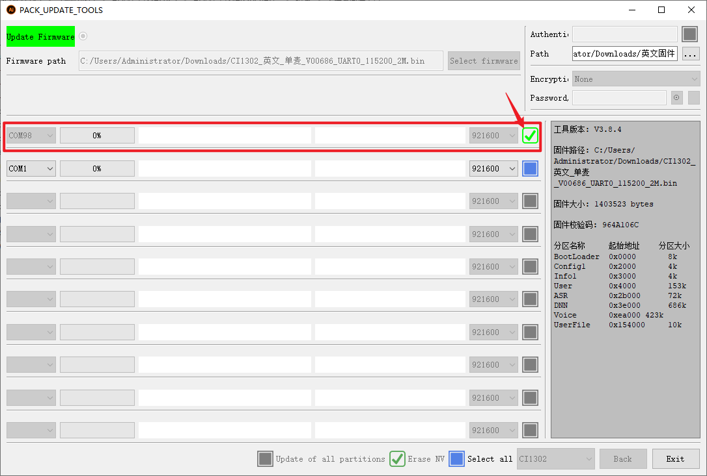

5. Press the **RST** button on the voice interaction module to enter flashing mode, and wait for the flashing process to complete successfully.

   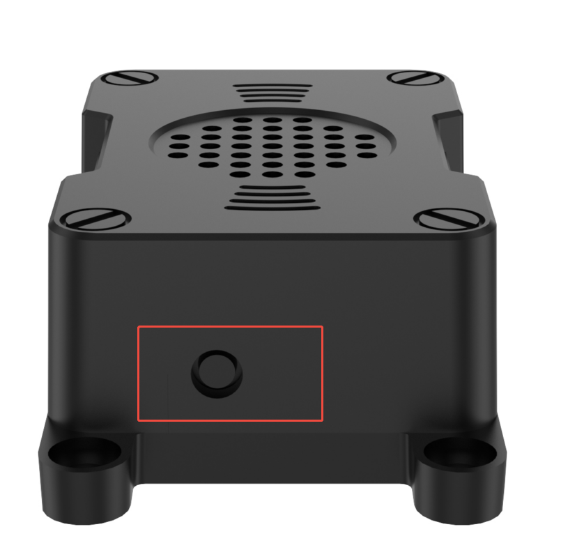


### 10.1.2 Large Language Model Deployment

<p id ="p12-2-2"></p>

This section outlines the steps to register on the official OpenAI website and obtain the API key for the Large Language Model.

#### 10.1.2.1 OpenAI Account Registration and Setup

① Copy the following URL: <https://platform.openai.com/docs/overview>

Open the OpenAI website and click the **Sign up** button in the top right corner.


② Follow the prompts to register and log in using a Google, Microsoft, or Apple account.


③ Click the settings icon, then select **Billing**, followed by **Payment methods**, to link a payment method. Top up the account to purchase tokens.


④ After completing the setup, click **API keys**, then select **Create new secret key**. Follow the prompts to fill in the required information. Once the key is created, make sure to save it for future use.


⑤ With these steps completed, the large model is successfully created and deployed. The API is ready for use in subsequent lessons.

#### 10.1.2.2 OpenRouter Account Registration and Setup

① Copy the following URL: <https://openrouter.ai/>

Open the webpage in a browser and click **Sign in**. Register using a Google account or another available login option.

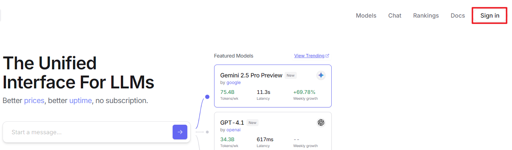


② After logging in, click the icon in the top right corner and select **Credits** to link a payment method.


③ To create an API key, go to **API Keys**, then click **Create Key**. Follow the prompts to complete the process. Once the key is generated, make sure to save it for future use.


④ At this point, the large model is successfully created and deployed. The API is ready for use in subsequent lessons.

### 10.1.3 API Configuration

<p id ="p12-2-3"></p>

1. Connect to the robot using the **VNC** remote connection tool to access the system desktop, then click the terminal icon on the left taskbar.

```bash
cd ~/ros2_ws/src/large_models/large_models/large_models/ 
```

2. Enter the command to open the large model configuration file.

```bash
gedit config.py
```

3. Enter the obtained OpenAI API key as the value for the `llm_api_Key` variable, as indicated by the red box in the image below.

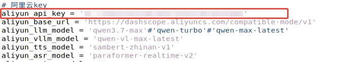

4. Enter the OpenAI API key as the value for the `llm_api_key` variable highlighted in the red box below:

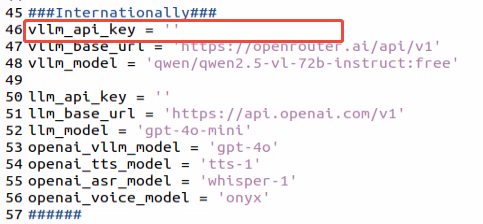

5. Press the key combination **Ctrl+S** to save the current configuration file, then click the close button in the upper right corner to exit.

6. Through the above steps, the acquisition and configuration of the large model API key are completed.

### 10.1.4 Multimodal Large Model: Voice Control

This lesson utilizes an online large model. Ensure that the controller maintains smooth network connectivity, with a wired network connection recommended.

#### 10.1.4.1 Introduction

When the program starts running and the **AI voice interaction box** broadcasts **I'm ready**, say the designated wake-up word **Hello Hiwonder** to activate the **AI voice interaction box**. The **AI voice interaction box** responds with **I'm here**. NexArm can then be controlled via voice commands to perform corresponding actions, such as **Rotate servo 1 by 90 degrees**. The terminal prints the recognized speech, and the **AI voice interaction box** broadcasts the response generated after reasoning, executing the corresponding feature.

#### 10.1.4.2 Preparation

* **Firmware Flashing**

Refer to tutorial: [10.1.1 Preparation](#p12-2-1)

* **Large Model API Key Acquisition**

Refer to tutorial: [10.1.2 Large Language Model Deployment](#p12-2-2)

* **API Key Configuration**

Refer to tutorial: [10.1.3 API Configuration](#p12-2-3)

#### 10.1.4.3 Operation Steps

> [!NOTE]
>
> * **Command input is strictly case-sensitive and space-sensitive.**
>
> * **The robot must be connected to the network, configured in STA mode on the local area network or connected via an Ethernet cable in AP direct connection mode.**
>
> * **Before powering on the robotic arm, be sure to secure the base of the robotic arm to the desktop or a stable platform using a G clamp. The robotic arm generates swing and inertia during startup and operation. If not secured, the device may tip over, fall, or suffer damage, posing safety risks.**

1. Power on the robotic arm and connect it to the remote control software **VNC**, referring to Section [1.5 Development Environment Setup and Configuration](https://wiki.hiwonder.com/projects/NexArm/en/ros-version/docs/1.%20NexArm%20User%20Manual.html#_1-5-development-environment-setup-and-configuration) in the **NexArm User Manual**.
2. Click the command-line terminal  on the left side of the system interface to open the command bar. Enter the command and press **Enter** to disable the auto-start service.

```bash
~/.stop_ros.sh
```

3. Enter the command and press **Enter** to run the voice control feature.

```bash
ros2 launch large_models_examples llm_control_servo.launch.py
```

4. When the command line displays the output shown below and broadcasts **I'm ready**, the **AI voice interaction box** has finished initialization. The wake-up word **Hello Hiwonder** can be spoken at this time.

   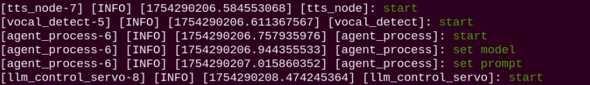

5. When the command line displays the output shown below and the **AI voice interaction box** broadcasts **I'm here**, the **AI voice interaction box** is activated. The system begins recording voice commands.

   

6. Commands can be spoken based on the **Input** prompt information in the **Task Examples** displayed by the program.

   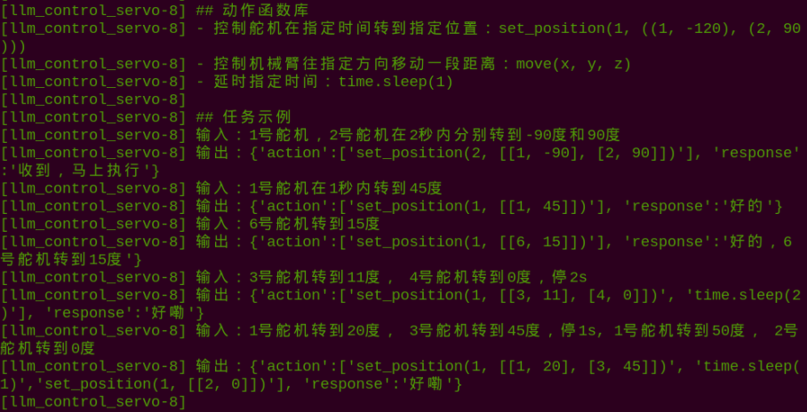

7. When the command line displays the output shown below, the **AI voice interaction box** prints out the recognized speech.

   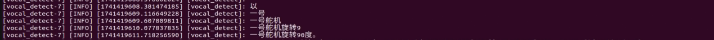

8. When the command line displays the output shown below, the speech recognition service of the cloud voice large model is successfully called to parse the command audio, and the parsed result is stored in `publish_asr_result`.

   

9. When the command line displays the output shown below, the cloud large language model is successfully invoked to process the command, providing a verbal response in `response` and designing actions conforming to the semantic meaning of the command.

   > [!NOTE]
   >
   > **The response is automatically generated by the large model. Only the semantic accuracy of the reply is guaranteed, while the text wording contains inherent randomness.**

   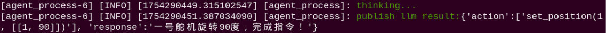

10. When the command line displays the output shown below, one round of dialogue interaction has finished. Refer to Step 4 to wake up the **AI voice interaction box** again with the wake-up word and start a new round of dialogue interaction.

    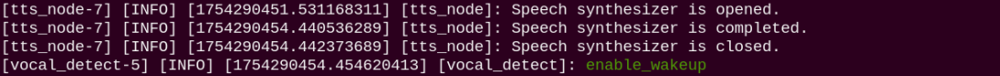

11. To terminate this feature, press **Ctrl+C** in the terminal interface. If termination fails, press it multiple times.

#### 10.1.4.4 Program Outcome

After the feature is enabled, NexArm is ready to accept voice commands. For example, saying **Rotate servo 1 by 90 degrees** controls servo 1 to rotate by 90°.

#### 10.1.4.5 Program Analysis

(1) Launch File Analysis

Program path: **/home/ubuntu/ros2_ws/src/large_models_examples/large_models_examples/llm_control_servo.launch.py**

① `launch_setup` Function

```py
def launch_setup(context):
    mode = LaunchConfiguration('mode', default=1)
    mode_arg = DeclareLaunchArgument('mode', default_value=mode)

    sdk_package_path = get_package_share_directory('sdk')
    large_models_examples_package_path = get_package_share_directory('large_models_examples')

    sdk_launch = IncludeLaunchDescription(
        PythonLaunchDescriptionSource(
            os.path.join(sdk_package_path, 'launch/armpi_ultra.launch.py')),
    )

    large_models_examples_launch = IncludeLaunchDescription(
        PythonLaunchDescriptionSource(
            os.path.join(large_models_examples_package_path, 'launch/start.launch.py')),
        launch_arguments={'mode': mode}.items(),
    )


    llm_control_servo_node = Node(
        package='large_models_examples',
        executable='llm_control_servo',
        output='screen',
    )

    return [mode_arg,
            sdk_launch,
            large_models_examples_launch,
            llm_control_servo_node,
            ]
```

This function loads **launch/armpi_ultra.launch.py** from the **sdk** package to start low-level control services for the robotic arm, including servo drivers and kinematics calculations, providing hardware support for subsequent control. It loads **launch/start.launch.py** from the **large_models_examples** package to start large-model-related services, passing the `mode` parameter via `launch_arguments` to control the operating mode of the large model, such as different interaction logic or function switches. It declares `llm_control_servo_node` to start the `llm_control_servo` executable in the **large_models_examples** package. Its core function is to convert large model outputs into robotic arm control commands, realizing a closed loop from large model decision to robotic arm action, with logs output to the screen.

② `generate_launch_description` Function

```py
def generate_launch_description():
    return LaunchDescription([
        OpaqueFunction(function = launch_setup)
    ])
```

This function creates and returns a `LaunchDescription` object, calling the `launch_setup` function via `OpaqueFunction` as the standard entry point for the ROS 2 launch file.

③ Main Function

```py
if __name__ == '__main__':
    # Create a LaunchDescription object
    ld = generate_launch_description()

    ls = LaunchService()
    ls.include_launch_description(ld)
    ls.run()
```

This block creates the `LaunchDescription` object and `LaunchService` service, adding the launch description to the launch service and running it to achieve manual system startup.

(2) Python File Analysis

Program path: **/home/ubuntu/ros2_ws/src/large_models_examples/large_models_examples/llm_control_servo.py**

① Define Prompt Template: PROMPT

```py
if os.environ["ASR_LANGUAGE"] == 'Chinese':
    PROMPT = '''
# Role and Task
You are an intelligent robotic arm that needs to generate corresponding instructions based on the input content.

## Requirements and Restrictions
1. Based on the input action content, find the corresponding command in the action function library and output the corresponding instruction.
2. Compose a concise (10 to 30 words), witty, and varied feedback message for each action sequence to make the communication engaging.
3. Upward is positive Z-axis, leftward is positive Y-axis, forward is positive X-axis, downward is negative Z-axis, rightward is negative Y-axis, backward is negative X-axis, unit: meter.
4. The servo numbers are 1, 2, 3, 4, 5, 6, with a rotation range of [-120, 120] degrees. If exceeding the range, action returns [].
6. Directly output JSON results without analysis or extraneous content.
7. Format: {'action':['xx', 'xx'], 'response':'xx'}

## Structural Requirements:
- The "action" key holds a string array of function names arranged in execution order. When no matching action function is found, action outputs [].
- The "response" key provides a well-crafted short reply adhering to the word count and style requirements above.
- Special handling: If no servo running time is specified, set it to 1 second by default. If there is no delay or pause between two actions, combine them together.

## Action Function Library
- Control servos to rotate to specified positions in a given time: set_position(1, ((1, -120), (2, 90)))
- Control the robotic arm to move a certain distance in a specified direction: move(x, y, z)
- Delay for a specified time: time.sleep(1)

## Task Examples
Input: Servo 1 and servo 2 rotate to -90 degrees and 90 degrees respectively within 2 seconds
Output: {'action':['set_position(2, [[1, -90], [2, 90]])'], 'response':'Received, executing immediately'}
Input: Servo 1 rotates to 45 degrees within 1 second
Output: {'action':['set_position(1, [[1, 45]])'], 'response':'Okay'}
Input: Servo 6 rotates to 15 degrees
Output: {'action':['set_position(1, [[6, 15]])'], 'response':'Okay, servo 6 rotates to 15 degrees'}
Input: Servo 3 rotates to 11 degrees, servo 4 rotates to 0 degrees, pause for 2s
Output: {'action':['set_position(1, [[3, 11], [4, 0]])', 'time.sleep(2)'], 'response':'Sure thing'}
Input: Servo 1 rotates to 20 degrees, servo 3 rotates to 45 degrees, pause for 1s, servo 1 rotates to 50 degrees, servo 2 rotates to 0 degrees
Output: {'action':['set_position(1, [[1, 20], [3, 45]])', 'time.sleep(1)','set_position(1, [[2, 0]])'], 'response':'Sure thing'}
Input: Move backward 5 cm
Output: {'action':['move(-0.05, 0, 0)'], 'response':'Okay, moved backward by 5 cm'}
```

② Initialize Variables

```py
class LLMControlServo(Node):
    def __init__(self, name):
        rclpy.init()
        super().__init__(name)
        
        self.action = []
        self.interrupt = False
        self.llm_result = ''
        self.action_finish = False
        self.play_audio_finish = False
        # self.llm_result = '{\'action\':[\'set_position(1, [[10, -20]])\'], \'response\':\'Got it.\'}'
        # self.llm_result = '{\"action\": [\"move(0, 0, -0.05)\"], \"response\": \"Moving downward for 5 cm, let's go!\"}'
        self.running = True
        self.id_dict = {'1': 5, "2": 4, "3": 3, "4": 2, "5": 1, "6": 0}
        self.current_pulse =  [500, 600, 825, 110, 500, 210]

       
        self.current_position = [0.1, 0, 0.226]

        timer_cb_group = ReentrantCallbackGroup()
        self.tts_text_pub = self.create_publisher(String, 'tts_node/tts_text', 1)
        self.create_subscription(String, 'agent_process/result', self.llm_result_callback, 1)
        self.create_subscription(Bool, 'tts_node/play_finish', self.play_audio_finish_callback, 1, callback_group=timer_cb_group)
        self.awake_client = self.create_client(SetBool, 'vocal_detect/enable_wakeup')
        self.awake_client.wait_for_service()
        self.create_subscription(Bool, 'vocal_detect/wakeup', self.wakeup_callback, 1)

        self.set_model_client = self.create_client(SetModel, 'agent_process/set_model')
        self.set_model_client.wait_for_service()
        self.set_prompt_client = self.create_client(SetString, 'agent_process/set_prompt')
        self.set_prompt_client.wait_for_service()
        self.set_pose_target_client = self.create_client(SetRobotPose, 'kinematics/set_pose_target')
        self.set_pose_target_client.wait_for_service()
        self.set_joint_value_target_client = self.create_client(SetJointValue, 'kinematics/set_joint_value_target')
        self.set_joint_value_target_client.wait_for_service()
        self.joints_pub = self.create_publisher(ServosPosition, 'servo_controller', 1) # Servo control

        self.timer = self.create_timer(0.0, self.init_process, callback_group=timer_cb_group)
```

This section initializes state variables, such as the action list `action` and interrupt flag `interrupt`, recording the current servo positions and robotic arm pose. It creates publishers, such as TTS text publishing, subscribers, such as large model results, TTS playback completion signals, and wake-up signals, and service clients, such as large model configuration, servo control, and robotic arm pose control, for communication and control.

③ `get_node_state` Method

```py
    def get_node_state(self, request, response):
        return response
```

This service callback function returns an empty response for querying the node state, such as confirming initialization completion.

④ `init_process` Method

```py
    def init_process(self):
        self.timer.cancel()

        msg = SetModel.Request()
        msg.model = llm_model
        msg.model_type = 'llm'
        msg.api_key = api_key 
        msg.base_url = base_url
        self.send_request(self.set_model_client, msg)

        msg = SetString.Request()
        msg.data = PROMPT
        self.send_request(self.set_prompt_client, msg)
        # -92 
        #self.set_position(1.5, [[6, 0], [5, 3], [4, 78], [3, -115], [2, 0], [1, -30]])
        #self.set_position(1.5, [[6, 0], [5, 48], [4, -72], [3, -96], [2, 0], [1, -30]])
        msg = set_joint_value_target(self.current_pulse)        
        endpoint = self.send_request(self.set_joint_value_target_client, msg)
        pose_t, pose_r = endpoint.pose.position, endpoint.pose.orientation
        mat = common.xyz_quat_to_mat([pose_t.x, pose_t.y, pose_t.z], [pose_r.w, pose_r.x, pose_r.y, pose_r.z])
        position, rpy = common.mat_to_xyz_euler(mat)

        self.current_position = [position, rpy]

        speech.play_audio(start_audio_path) 
        threading.Thread(target=self.process, daemon=True).start()
        self.create_service(Empty, '~/init_finish', self.get_node_state)
        self.get_logger().info('\033[1;32m%s\033[0m' % 'start')
        self.get_logger().info('\033[1;32m%s\033[0m' % PROMPT)
```

⑤ `send_request` Method

```py
    def send_request(self, client, msg):
        future = client.call_async(msg)
        while rclpy.ok():
            if future.done() and future.result():
                return future.result()
```

This general service call tool sends service requests and blocks to wait for results, ensuring service communication is completed, such as configuring large models and controlling robotic arm poses.

⑥ `wakeup_callback` Method

```py
    def wakeup_callback(self, msg):
        if self.llm_result:
            self.get_logger().info('wakeup interrupt')
            self.interrupt = msg.data
```

This wake-up signal subscription callback sets the `interrupt` flag when a wake-up signal is received, such as voice wake-up, to interrupt the currently executing action.

⑦ `llm_result_callback` Method

```py
    def llm_result_callback(self, msg):
        self.llm_result = msg.data
```

This callback subscribes to large model results, receiving commands generated by the large model, containing `action` and `response`, and saving them to the `llm_result` variable for subsequent processing.

⑧ `set_position` Method

```py
    def set_position(self, duration, positions):
        msg = ServosPosition()
        msg.duration = float(duration)
        position_list = []
        for i in positions:
            position = ServoPosition()
            position.id = i[0]
            position.position = float(i[1])
            position_list.append(position)
            if i[0] != 1: 
                self.current_pulse[self.id_dict[str(i[0])]] = 500 + float(i[1])/240*1000
            else:
                self.current_pulse[self.id_dict[str(i[0])]] = 700 + float(i[1])/240*1000
        msg.position = position_list
        msg.position_unit = "deg"
        self.joints_pub.publish(msg)
        # self.get_logger().info(f'{self.current_pulse}') 
        msg = set_joint_value_target(self.current_pulse[:-1])
        endpoint = self.send_request(self.set_joint_value_target_client, msg)
        pose_t, pose_r = endpoint.pose.position, endpoint.pose.orientation
        mat = common.xyz_quat_to_mat([pose_t.x, pose_t.y, pose_t.z], [pose_r.w, pose_r.x, pose_r.y, pose_r.z])
        position, rpy = common.mat_to_xyz_euler(mat)
        self.current_position = [position, rpy]
```

This method publishes servo control messages `ServosPosition` based on input duration and target positions, updating current servo position records and synchronizing robotic arm joint poses.

⑨ `move` Method

```py
    def move(self, x, y, z):
        self.current_position[0][0] += x
        self.current_position[0][1] += y
        self.current_position[0][2] += z
        self.get_logger().info(f'{self.current_position}')
        msg = set_pose_target(self.current_position[0], self.current_position[1][1], [-180.0, 180.0], 1.0)
        res = self.send_request(self.set_pose_target_client, msg)
        if res.pulse:
            servo_data = res.pulse
            self.get_logger().info(f'{servo_data}')
            #set_servo_position(self.joints_pub, 1, ((4, servo_data[3]), (3, servo_data[2]), (2, servo_data[1]), (1, servo_data[0])))
            set_servo_position(self.joints_pub, 1, ((3, servo_data[3]), (4, servo_data[2]), (5, servo_data[1]), (6, servo_data[0])))
            self.current_pulse[:-1] = servo_data
```

⑩ `play_audio_finish_callback` Method

```py
    def play_audio_finish_callback(self, msg):
        self.play_audio_finish = msg.data
```

This callback handles the completion of voice playback, re-enabling the voice wake-up function.

⑪ `process` Method

```py
    def process(self):
        while self.running:
            if self.llm_result:
                msg = String()
                if 'action' in self.llm_result:  # If a corresponding action is returned, extract it and proceed with processing.
                    result = eval(self.llm_result[self.llm_result.find('{'):self.llm_result.find('}') + 1])
                    # self.get_logger().info(str(result))
                    action_list = []
                    if 'action' in result:
                        action_list = result['action']
                    if 'response' in result:
                        response = result['response']
                    msg.data = response
                    self.tts_text_pub.publish(msg)
                    for i in action_list:
                        if self.interrupt:
                            self.get_logger().info('interrupt')
                            break
                        if 'set_position' in i:
                            eval('self.' + i)
                        elif 'move' in i:
                            eval('self.' + i)
                        else:
                            eval(i)
                else:  # No corresponding action, just respond.
                    response = self.llm_result
                    msg.data = response
                    self.tts_text_pub.publish(msg)
                self.action_finish = True 
                self.llm_result = ''
            else:
                time.sleep(0.01)
            if self.play_audio_finish and self.action_finish:
                    self.play_audio_finish = False
                    self.action_finish = False
                    msg = SetBool.Request()
                    msg.data = True
                    self.send_request(self.awake_client, msg)
        rclpy.shutdown()
```

The main processing loop continuously checks `llm_result` from the large model output, parsing the action list `action` and response text `response`. It publishes response text to the TTS node for speech playback and sequentially executes actions, such as `set_position` for servo control, `move` for robotic arm movement, and `time.sleep` for delay. After actions and speech are completed, it re-enables the wake-up function to await the next command.

⑫ `main` Function

```py
def main():
    node = LLMControlServo('llm_control_servo')
    executor = MultiThreadedExecutor()
    executor.add_node(node)
    executor.spin()
    node.destroy_node()
```

This function creates the `LLMControlServo` node instance, starts a multi-threaded executor to process callbacks, runs the node, and handles shutdown to ensure resource cleanup.

### 10.1.5 Multimodal Large Model: Color Block Sorting

This lesson utilizes an online large model. Ensure that the controller maintains smooth network connectivity, with a wired network connection recommended.

#### 10.1.5.1 Introduction

When the program starts running and the **AI voice interaction box** broadcasts **I'm ready**, say the designated wake-up word **Hello Hiwonder** to activate the **AI voice interaction box**. The **AI voice interaction box** responds with **I'm here**. NexArm can then be controlled via voice commands, such as **Take away the red block**. The terminal prints the recognized speech, and the **AI voice interaction box** broadcasts the response generated after reasoning, executing the corresponding feature.

#### 10.1.5.2 Preparation

* **Firmware Flashing**

Refer to tutorial: [10.1.1 Preparation](#p12-2-1)

* **Large Model API Key Acquisition**

Refer to tutorial: [10.1.2 Large Language Model Deployment](#p12-2-2)

* **API Key Configuration**

Refer to tutorial: [10.1.3 API Configuration](#p12-2-3)

#### 10.1.5.3 Operation Steps

> [!NOTE]
>
> * **Command input is strictly case-sensitive and space-sensitive.**
>
> * **The robot must be connected to the network, configured in STA mode on the local area network or connected via an Ethernet cable in AP direct connection mode.**
>
> * **Before powering on the robotic arm, be sure to secure the base of the robotic arm to the desktop or a stable platform using a G clamp. The robotic arm generates swing and inertia during startup and operation. If not secured, the device may tip over, fall, or suffer damage, posing safety risks.**
>
> * **Refer to Section [1.9 Object Grasping Adjustment Method](https://wiki.hiwonder.com/projects/NexArm/en/ros-version/docs/1.%20NexArm%20User%20Manual.html#_1-9-object-grasping-adjustment) in the 'NexArm User Manual' to calibrate the position of the robotic arm first. Failure to calibrate may affect object gripping.**

1. Power on the robotic arm and connect it to the remote control software **VNC**, referring to Section [1.5 Development Environment Setup and Configuration](https://wiki.hiwonder.com/projects/NexArm/en/ros-version/docs/1.%20NexArm%20User%20Manual.html#_1-5-development-environment-setup-and-configuration) in the **NexArm User Manual**.
2. Click the command-line terminal  on the left side of the system interface to open the command bar. Enter the command and press **Enter** to disable the auto-start service.

```bash
~/.stop_ros.sh
```

3. Enter the command and press **Enter** to run the color block sorting feature.

```bash
ros2 launch large_models_examples llm_object_sorting.launch.py
```

4. When the command line displays the output shown below and broadcasts **I'm ready**, the **AI voice interaction box** has finished initialization. The wake-up word **Hello Hiwonder** can be spoken at this time.

   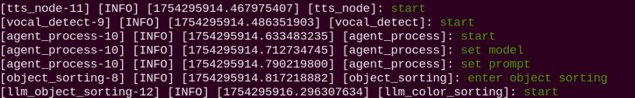

5. When the command line displays the output shown below and the **AI voice interaction box** broadcasts **I'm here**, the **AI voice interaction box** is activated. The system begins recording voice commands.

   

6. Commands can be spoken based on the **Input** prompt information in the **Task Examples** displayed by the program.

   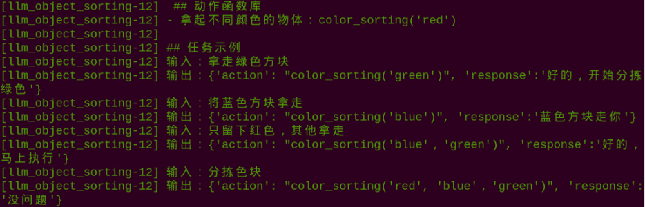

7. For example, place the color blocks in front of the camera and say the command **Take away the red block**.

   

8. When the command line displays the output shown below, the **AI voice interaction box** prints out the recognized speech.

   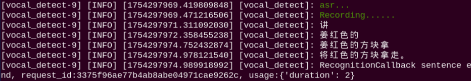

9. When the command line displays the output shown below, the speech recognition service of the cloud voice large model is successfully called to parse the command audio, and the parsed result is stored in `publish_asr_result`.

   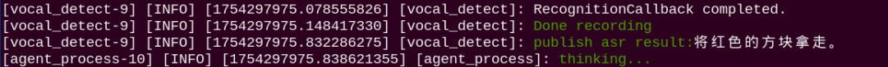

10. When the command line displays the output shown below, the cloud large language model is successfully invoked to process the command, providing a verbal response in `response` and designing actions conforming to the semantic meaning of the command.

    > [!NOTE]
    >
    > **The response is automatically generated by the large model. Only the semantic accuracy of the reply is guaranteed, while the text wording contains inherent randomness.**

    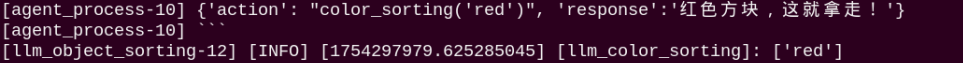

11. When the command line displays the output shown below, one round of dialogue interaction has finished. Refer to Step 4 to wake up the **AI voice interaction box** again with the wake-up word and start a new round of dialogue interaction.

    

12. To terminate this feature, press **Ctrl+C** in the terminal interface. If termination fails, press it multiple times.

#### 10.1.5.4 Program Outcome

After the feature is enabled, NexArm is ready to accept voice commands. For example, saying **Take away the red block** controls the arm to automatically grip the green block within the front field of view and place it to the left of the robotic arm.

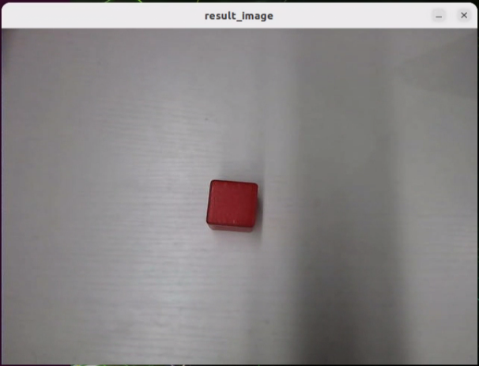

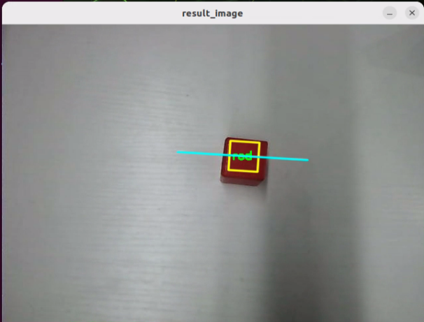

#### 10.1.5.5 Program Analysis

(1) Launch File Analysis

Program path: **/home/ubuntu/ros2_ws/src/large_models_examples/large_models_examples/llm_object_sorting.launch.py**

① `launch_setup` Function

```py
def launch_setup(context):
    mode = LaunchConfiguration('mode', default=1)
    mode_arg = DeclareLaunchArgument('mode', default_value=mode)

    large_models_examples_package_path = get_package_share_directory('large_models_examples')

    # Launch object_sorting_launch immediately
    object_sorting_launch = IncludeLaunchDescription(
        PythonLaunchDescriptionSource(
            os.path.join(large_models_examples_package_path, 'launch/object_sorting_node.launch.py')),
    )

    # Launch large_models_examples_launch and llm_object_sorting_node after 5 seconds
    delayed_launch = TimerAction(
        period=5.0,  # Delay time: 5 seconds
        actions=[
            IncludeLaunchDescription(
                PythonLaunchDescriptionSource(
                    os.path.join(large_models_examples_package_path, 'launch/start.launch.py')),
                launch_arguments={'mode': mode}.items(),
            ),
            Node(
                package='large_models_examples',
                executable='llm_object_sorting',
                output='screen',
            ),
        ]
    )

    return [mode_arg,
            object_sorting_launch,  # Launch immediately
            delayed_launch,          # Launch after 5 seconds
            ]
```

This function immediately loads **launch/object_sorting_node.launch.py** from the **large_models_examples** package to start fundamental object sorting nodes, including core features like object recognition and classification logic, as foundational system components. Through `TimerAction`, a 5-second delay is set to ensure that foundational nodes finish initialization before launching dependent components. It loads **launch/start.launch.py** from the **large_models_examples** package to start large model services, passing the `mode` parameter to control the operating mode. It starts the `llm_object_sorting` executable in the **large_models_examples** package as a bridge between the large model and object sorting logic, converting large model decisions into sorting action commands, with logs output to the screen.

② `generate_launch_description` Function

```py
def generate_launch_description():
    return LaunchDescription([
        OpaqueFunction(function=launch_setup)
    ])
```

This function creates and returns a `LaunchDescription` object, calling the `launch_setup` function via `OpaqueFunction` as the standard entry point for the ROS 2 launch file.

③ Main Function

```py
if __name__ == '__main__':
    # Create a LaunchDescription object
    ld = generate_launch_description()

    ls = LaunchService()
    ls.include_launch_description(ld)
    ls.run()
```

This block creates the `LaunchDescription` object and `LaunchService` service, adding the launch description to the launch service and running it to achieve manual system startup.

(2) Python File Analysis

Program path: **/home/ubuntu/ros2_ws/src/large_models_examples/large_models_examples/llm_object_sorting.py**

① Define Prompt Template: PROMPT

```py
# Role and Task
You are an intelligent robotic arm that needs to generate corresponding instructions based on the input content.

## Requirements and Restrictions
1. Based on the input action content, find the corresponding command in the action function library and output the corresponding instruction.
2. Compose a concise (10 to 30 words), witty, and varied feedback message for the action sequence to make communication engaging.
3. Directly output JSON results without analysis or extraneous content.
4. Three colors of objects can be sorted: red, green, and blue.
5. Format: {'action':'xx', 'response':'xx'}

## Structural Requirements:
- The "action" key holds a string array of function names. When no matching action function is found, action outputs "".
- The "response" key provides a well-crafted short reply adhering to the word count and style requirements above.

## Implementation Principles - Before final output, conduct comprehensive verification to ensure that replies are format-compliant and engaging, strictly following the specifications above.

## Action Function Library
- Pick up objects of different colors: color_sorting('red')

## Task Examples
Input: Take away the green block
Output: {'action': "color_sorting('green')", 'response':'Okay, starting to sort green'}
Input: Take away the blue block
Output: {'action': "color_sorting('blue')", 'response':'Blue block, off you go'}
Input: Keep only red, take away the others
Output: {'action': "color_sorting('blue', 'green')", 'response':'Okay, executing immediately'}
Input: Sort color blocks
Output: {'action': "color_sorting('red', 'blue', 'green')", 'response':'No problem'}
'''
```

② Initialize Variables

```py
class LLMColorSorting(Node):
    def __init__(self, name):
        rclpy.init()
        super().__init__(name)
        
        self.action = []
        self.llm_result = ''
        self.action_finish = False
        self.play_audio_finish = False
        # self.llm_result = '{"action": "color_sorting(\'blue\', \'red\', \'green\', \'tag_1\')", "response": "ok！"}'
        self.running = True
        
        timer_cb_group = ReentrantCallbackGroup()
        self.tts_text_pub = self.create_publisher(String, 'tts_node/tts_text', 1)
        self.create_subscription(String, 'agent_process/result', self.llm_result_callback, 1)
        self.create_subscription(Bool, 'tts_node/play_finish', self.play_audio_finish_callback, 1, callback_group=timer_cb_group)
        self.create_subscription(Bool, 'vocal_detect/wakeup', self.wakeup_callback, 1)
        self.awake_client = self.create_client(SetBool, 'vocal_detect/enable_wakeup')
        self.awake_client.wait_for_service()

        self.set_model_client = self.create_client(SetModel, 'agent_process/set_model')
        self.set_model_client.wait_for_service()
        self.set_prompt_client = self.create_client(SetString, 'agent_process/set_prompt')
        self.set_prompt_client.wait_for_service()
        self.enter_client = self.create_client(Trigger, 'object_sorting/enter')
        self.enter_client.wait_for_service()
        self.start_client = self.create_client(SetBool, 'object_sorting/enable_sorting')
        self.start_client.wait_for_service()

        self.set_target_client = self.create_client(SetStringBool, 'object_sorting/set_target')
        self.set_target_client.wait_for_service()
        self.timer = self.create_timer(0.0, self.init_process, callback_group=timer_cb_group)
```

This section initializes the node, configures state variables, such as action lists and large model results, creates publishers for TTS text, subscribers for large model results, TTS completion signals, and wake-up signals, and service clients for large model configuration and sorting control, starting the initialization timer.

③ `get_node_state` Method

```py
    def get_node_state(self, request, response):
        return response
```

This service callback function returns an empty response for querying the node state, such as confirming initialization completion.

④ `init_process` Method

```py
    def init_process(self):
        self.timer.cancel()
        
        msg = SetModel.Request()
        msg.model = llm_model
        msg.model_type = 'llm'
        msg.api_key = api_key 
        msg.base_url = base_url
        self.send_request(self.set_model_client, msg)

        msg = SetString.Request()
        msg.data = PROMPT
        self.send_request(self.set_prompt_client, msg)
       
        self.send_request(self.enter_client, Trigger.Request())
        speech.play_audio(start_audio_path)
        threading.Thread(target=self.process, daemon=True).start()
        self.create_service(Empty, '~/init_finish', self.get_node_state)
        self.get_logger().info('\033[1;32m%s\033[0m' % 'start')
        self.get_logger().info('\033[1;32m%s\033[0m' % PROMPT)
```

This method executes the node initialization process, canceling the timer, configuring large model parameters, such as model type and API key, sending requests to enter the sorting service, starting the processing thread, and logging initialization completion.

⑤ `send_request` Method

```py
    def send_request(self, client, msg):
        future = client.call_async(msg)
        while rclpy.ok():
            if future.done() and future.result():
                return future.result()
```

This general service call tool sends service requests and blocks to wait for results, ensuring service communication is completed, such as configuring large models and controlling sorting.

⑥ `wakeup_callback` Method

```py
    def wakeup_callback(self, msg):
        if msg.data and self.llm_result:
            self.send_request(self.enter_client, Trigger.Request())
```

This wake-up signal subscription callback re-sends the request to enter the sorting service upon receiving a wake-up signal, resetting the sorting state.

⑦ `llm_result_callback` Method

```py
    def llm_result_callback(self, msg):
        self.llm_result = msg.data
```

This callback subscribes to large model results, receiving commands generated by the large model, containing `action` and `response`, and saving them to `llm_result` for subsequent processing.

⑧ `play_audio_finish_callback` Method

```py
    def play_audio_finish_callback(self, msg):
        self.play_audio_finish = msg.data
```

This callback subscribes to the TTS playback completion signal, setting the `play_audio_finish` flag to synchronize action execution and voice playback.

⑨ `process` Method

```py
    def process(self):
        while self.running:
            if self.llm_result:
                msg = String()
                if 'action' in self.llm_result: # If a corresponding action is returned, extract it and proceed with processing.
                    result = eval(self.llm_result[self.llm_result.find('{'):self.llm_result.find('}') + 1])
                    # result = json.loads(self.llm_result)
                    if 'action' in result:
                        text = result['action']
                        # Use regular expressions to extract all strings inside.
                        pattern = r"color_sorting\((['\"][^'\"]+['\"](?:\s*,\s*['\"][^'\"]+['\"])*)\)" 
                        # Use re.search to find the matching result.
                        match = re.search(pattern, text)
                        # Extract the result.
                        if match:
                            # Retrieve all argument parts (the content inside the parentheses).
                            params = match.group(1)
                            # Use regular expressions to split the string arguments.
                            colors = re.findall(r"['\"]([^'\"]+)['\"]", params)
                            self.get_logger().info(str(colors))
                            color_msg = SetStringBool.Request()
                            for i in ['red', 'green', 'blue', 'tag_1', 'tag_2', 'tag_3']:
                                color_msg.data_str = i
                                if i in colors:
                                    color_msg.data_bool = True
                                else:
                                    color_msg.data_bool = False
                                self.send_request(self.set_target_client, color_msg)
                            # Enable sorting.
                            start_msg = SetBool.Request()
                            start_msg.data = True 
                            self.send_request(self.start_client, start_msg)
                    if 'response' in result:
                        msg.data = result['response']
                else: # No corresponding action, just respond.
                    msg.data = self.llm_result
                self.tts_text_pub.publish(msg)
                self.action_finish = True
                self.llm_result = ''
            else:
                time.sleep(0.01)
            if self.play_audio_finish and self.action_finish:
                self.play_audio_finish = False
                self.action_finish = False
                msg = SetBool.Request()
                msg.data = True
                self.send_request(self.awake_client, msg)
        rclpy.shutdown()
```

The main processing loop parses large model results, extracts color sorting actions such as `color_sorting('red')`, extracts target colors using regular expressions, sets sorting targets, and initiates sorting. It publishes TTS replies and re-enables the wake-up function upon completion.

⑩ `main` Function

```py
def main():
    node = LLMColorSorting('llm_color_sorting')
    executor = MultiThreadedExecutor()
    executor.add_node(node)
    executor.spin()
    node.destroy_node()
```

As the node entry point, this function creates the `LLMColorSorting` instance, starts a multi-threaded executor to process callbacks, runs the node, and cleans up resources.

### 10.1.6 Multimodal Large Model: Waste Sorting

This lesson utilizes an online large model. Ensure that the controller maintains smooth network connectivity, with a wired network connection recommended.

#### 10.1.6.1 Introduction

When the program starts running and the **AI voice interaction box** broadcasts **I'm ready**, say the designated wake-up word **Hello Hiwonder** to activate the **AI voice interaction box**. The **AI voice interaction box** responds with **I'm here**. NexArm can then be controlled via voice commands, such as **Clean up food waste**. The terminal prints the recognized speech, and the **AI voice interaction box** broadcasts the response generated after reasoning, executing the corresponding feature.

#### 10.1.6.2 Preparation

* **Firmware Flashing**

Refer to tutorial: [10.1.1 Preparation](#p12-2-1)

* **Large Model API Key Acquisition**

Refer to tutorial: [10.1.2 Large Language Model Deployment](#p12-2-2)

* **API Key Configuration**

Refer to tutorial: [10.1.3 API Configuration](#p12-2-3)

#### 10.1.6.3 Operation Steps

> [!NOTE]
>
> * **Command input is strictly case-sensitive and space-sensitive.**
>
> * **The robot must be connected to the network, configured in STA mode on the local area network or connected via an Ethernet cable in AP direct connection mode.**
>
> * **Before powering on the robotic arm, be sure to secure the base of the robotic arm to the desktop or a stable platform using a G clamp. The robotic arm generates swing and inertia during startup and operation. If not secured, the device may tip over, fall, or suffer damage, posing safety risks.**
>
> * **Refer to Section [1.9 Object Grasping Adjustment Method](https://wiki.hiwonder.com/projects/NexArm/en/ros-version/docs/1.%20NexArm%20User%20Manual.html#_1-9-object-grasping-adjustment) in the 'NexArm User Manual' to calibrate the position of the robotic arm first. Failure to calibrate may affect object gripping.**

1. Power on the robotic arm and connect it to the remote control software **VNC**, referring to Section [1.5 Development Environment Setup and Configuration](https://wiki.hiwonder.com/projects/NexArm/en/ros-version/docs/1.%20NexArm%20User%20Manual.html#_1-5-development-environment-setup-and-configuration) in the **NexArm User Manual**.
2. Click  to open the command bar. Enter the command and press **Enter** to disable the auto-start service.

```bash
~/.stop_ros.sh
```

3. Enter the command and press **Enter** to run the waste sorting feature.

```bash
ros2 launch large_models_examples llm_waste_classification.launch.py
```

4. When the command line displays the output shown below and broadcasts **I'm ready**, the **AI voice interaction box** has finished initialization. The wake-up word **Hello Hiwonder** can be spoken at this time.

   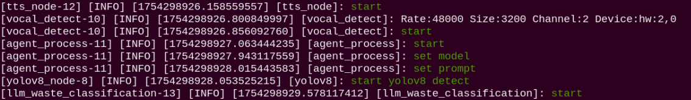

5. When the command line displays the output shown below and the **AI voice interaction box** broadcasts **I'm here**, the **AI voice interaction box** is activated. The system begins recording voice commands.

   

6. Commands can be spoken based on the **Input** prompt information in the **Task Examples** displayed by the program.

   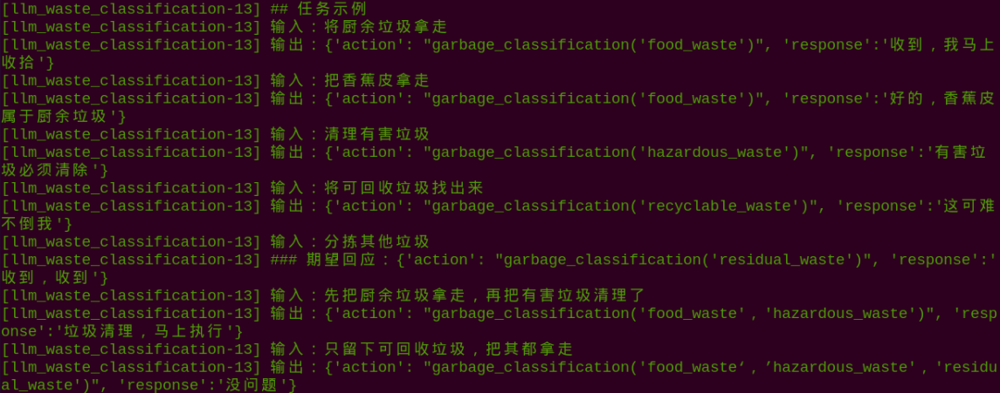

7. For example, place the corresponding waste card in front of the camera and say the command **Take away the banana peel**.

   

8. When the command line displays the output shown below, the **AI voice interaction box** prints out the recognized speech.

   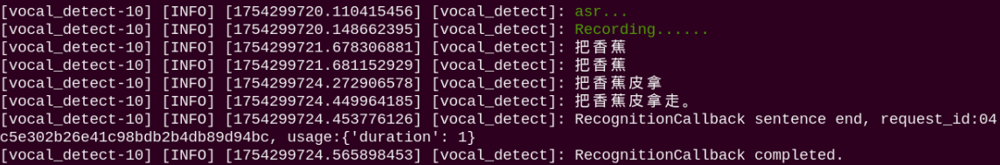

9. When the command line displays the output shown below, the speech recognition service of the cloud voice large model is successfully called to parse the command audio, and the parsed result is stored in `publish_asr_result`.

   

10. When the command line displays the output shown below, the cloud large language model is successfully invoked to process the command, providing a verbal response in `response` and designing actions conforming to the semantic meaning of the command.

    > [!NOTE]
    >
    > **The response is automatically generated by the large model. Only the semantic accuracy of the reply is guaranteed, while the text wording contains inherent randomness.**

    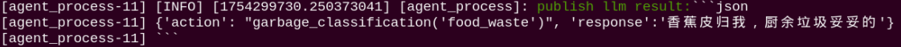

11. When the command line displays the output shown below, one round of dialogue interaction has finished. Refer to Step 4 to wake up the **AI voice interaction box** again with the wake-up word and start a new round of dialogue interaction.

    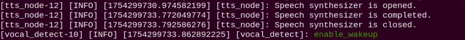

12. To terminate this feature, press **Ctrl+C** in the terminal interface. If termination fails, press it multiple times.

#### 10.1.6.4 Program Outcome

After the feature is enabled, NexArm is ready to accept voice commands. For example, saying **Take away the banana** controls the arm to automatically grip the banana waste block or food waste within the front field of view and place it to the right of the robotic arm.

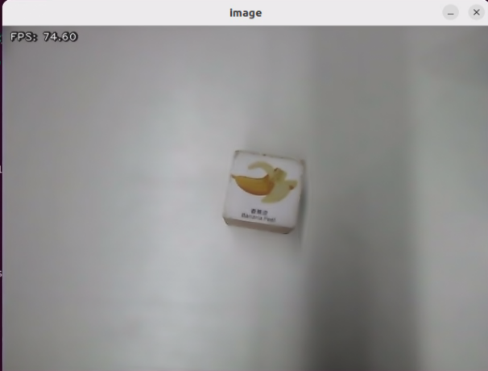

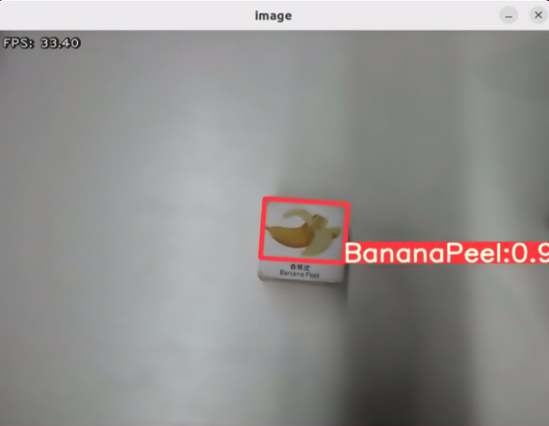

#### 10.1.6.5 Program Analysis

(1) Launch File Analysis

Program path: **/home/ubuntu/ros2_ws/src/large_models_examples/large_models_examples/llm_waste_classification.launch.py**

① `launch_setup` Function

```py
def launch_setup(context):
    mode = LaunchConfiguration('mode', default=1)
    mode_arg = DeclareLaunchArgument('mode', default_value=mode)

    large_models_examples_package_path = get_package_share_directory('large_models_examples')

    # Immediately launch include waste_classification.launch file
    waste_classification_launch = IncludeLaunchDescription(
        PythonLaunchDescriptionSource(
            os.path.join(large_models_examples_package_path, 'launch/waste_classification.launch.py')),
    )

    # Launch start.launch.py and llm_waste_classification node after 5-second delay
    delayed_launch = TimerAction(
        period=5.0,  # Delay period in seconds
        actions=[
            IncludeLaunchDescription(
                PythonLaunchDescriptionSource(
                    os.path.join(large_models_examples_package_path, 'launch/start.launch.py')),
                launch_arguments={'mode': mode}.items(),
            ),
            Node(
                package='large_models_examples',
                executable='llm_waste_classification',
                output='screen',
            ),
        ]
    )

    return [mode_arg,
            waste_classification_launch,  # Immediate launch
            delayed_launch,                # Launch after 5 seconds
            ]
```

This function immediately loads **launch/waste_classification.launch.py** from the **large_models_examples** package to start fundamental waste sorting nodes, including waste recognition and category judgment, providing underlying support. It delays launching the large model and control nodes through `TimerAction` with a 5-second delay, ensuring that fundamental nodes finish initialization before launching dependent upper-level components. It loads **launch/start.launch.py** from the **large_models_examples** package to start large model services, passing the `mode` parameter to control the operating mode. It starts the `llm_waste_classification` executable in the **large_models_examples** package as a bridge between the large model and waste sorting logic, converting large model decisions into specific sorting action commands, with logs output to the screen.

② `generate_launch_description` Function

```py
def generate_launch_description():
    return LaunchDescription([
        OpaqueFunction(function=launch_setup)
    ])
```

This function creates and returns a `LaunchDescription` object, calling the `launch_setup` function via `OpaqueFunction` as the standard entry point for the ROS 2 launch file.

③ Main Function

```py
if __name__ == '__main__':
    # Create LaunchDescription object
    ld = generate_launch_description()

    ls = LaunchService()
    ls.include_launch_description(ld)
    ls.run()
```

This block creates the `LaunchDescription` object and `LaunchService` service, adding the launch description to the launch service and running it to achieve manual system startup.

(2) Python File Analysis

Program path: **/home/ubuntu/ros2_ws/src/large_models_examples/large_models_examples/llm_waste_classification.py**

① Define Prompt Template: PROMPT

```py
## Task Examples
Input: Take away the food waste
Output: {'action': "garbage_classification('food_waste')", 'response':'Received, cleaning it up right away'}
Input: Take away the banana peel
Output: {'action': "garbage_classification('food_waste')", 'response':'Okay, banana peels belong to food waste'}
Input: Clean up hazardous waste
Output: {'action': "garbage_classification('hazardous_waste')", 'response':'Hazardous waste must be cleared'}
Input: Find recyclable waste
Output: {'action': "garbage_classification('recyclable_waste')", 'response':'This is a breeze for me'}
Input: Sort other waste
Output: {'action': "garbage_classification('residual_waste')", 'response':'Received, received'}
Input: First take away food waste, then clean up hazardous waste
Output: {'action': "garbage_classification('food_waste', 'hazardous_waste')", 'response':'Waste cleanup, executing immediately'}
Input: Keep only recyclable waste, take away the rest
Output: {'action': "garbage_classification('food_waste', 'hazardous_waste', 'residual_waste')", 'response':'No problem'}
'''
```

② Initialize Variables

```py
class LLMWasteClassification(Node):
    def __init__(self, name):
        rclpy.init()
        super().__init__(name)
        
        self.action = []
        self.llm_result = ''
        self.action_finish = False
        self.play_audio_finish = False
        # self.llm_result = '{"action": "garbage_classification(\'food_waste\', \'hazardous_waste\', \'residual_waste\', \'recyclable_waste\')", "response": "On it. Starting now."}'
        self.running = True
        
        timer_cb_group = ReentrantCallbackGroup()
        self.tts_text_pub = self.create_publisher(String, 'tts_node/tts_text', 1)
        self.create_subscription(String, 'agent_process/result', self.llm_result_callback, 1)
        self.create_subscription(Bool, 'tts_node/play_finish', self.play_audio_finish_callback, 1, callback_group=timer_cb_group)
        self.create_subscription(Bool, 'vocal_detect/wakeup', self.wakeup_callback, 1)
        self.awake_client = self.create_client(SetBool, 'vocal_detect/enable_wakeup')
        self.awake_client.wait_for_service()

        self.set_model_client = self.create_client(SetModel, 'agent_process/set_model')
        self.set_model_client.wait_for_service()

        self.set_prompt_client = self.create_client(SetString, 'agent_process/set_prompt')
        self.set_prompt_client.wait_for_service()

        self.enter_client = self.create_client(Trigger, 'waste_classification/enter')
        self.enter_client.wait_for_service()

        self.start_client = self.create_client(SetBool, 'waste_classification/enable_transport')
        self.start_client.wait_for_service()

        self.set_target_client = self.create_client(SetStringList, 'waste_classification/set_target')
        self.set_target_client.wait_for_service()

        self.timer = self.create_timer(0.0, self.init_process, callback_group=timer_cb_group)
```

This section initializes the node, configures state variables, such as action lists and large model results, creates publishers for TTS text, subscribers for large model results, TTS completion signals, and wake-up signals, and service clients for large model configuration and waste sorting control, starting the initialization timer.

③ `get_node_state` Method

```py
    def get_node_state(self, request, response):
        return response
```

This service callback function returns an empty response for confirming node initialization completion.

④ `init_process` Method

```py
    def init_process(self):
        self.timer.cancel()
        
        msg = SetModel.Request()
        msg.model = llm_model
        msg.model_type = 'llm'
        msg.api_key = api_key 
        msg.base_url = base_url
        self.send_request(self.set_model_client, msg)

        msg = SetString.Request()
        msg.data = PROMPT
        self.send_request(self.set_prompt_client, msg)
        
        self.send_request(self.enter_client, Trigger.Request())

        speech.play_audio(start_audio_path) 
        threading.Thread(target=self.process, daemon=True).start()
        self.create_service(Empty, '~/init_finish', self.get_node_state)
        self.get_logger().info('\033[1;32m%s\033[0m' % 'start')
        self.get_logger().info('\033[1;32m%s\033[0m' % PROMPT)
```

This method executes the node initialization process, canceling the timer, configuring large model parameters, such as model type and API key, sending requests to enter the waste sorting service, starting the processing thread, and logging initialization completion.

⑤ `send_request` Method

```py
    def send_request(self, client, msg):
        future = client.call_async(msg)
        while rclpy.ok():
            if future.done() and future.result():
                return future.result()
```

This general service call tool sends service requests and blocks to wait for results, ensuring service communication is completed, such as configuring large models and controlling sorting.

⑥ `wakeup_callback` Method

```py
    def wakeup_callback(self, msg):
        if msg.data and self.llm_result:
            self.send_request(self.enter_client, Trigger.Request())
```

This wake-up signal subscription callback re-sends requests to enter the waste sorting service upon receiving a wake-up signal, resetting the sorting state.

⑦ `llm_result_callback` Method

```py
    def llm_result_callback(self, msg):
        self.llm_result = msg.data
```

This callback subscribes to large model results, receiving commands generated by the large model, containing `action` and `response`, and saving them to `llm_result` for processing.

⑧ `play_audio_finish_callback` Method

```py
    def play_audio_finish_callback(self, msg):
        self.play_audio_finish = msg.data
```

This callback subscribes to the TTS playback completion signal, setting the `play_audio_finish` flag to synchronize action execution and voice playback.

⑨ `process` Method

```py
    def process(self):
        while self.running:
            if self.llm_result:
                msg = String()
                if 'action' in self.llm_result: # If there is a corresponding action, extract and process it
                    self.get_logger().info(self.llm_result)
                    result = eval(self.llm_result[self.llm_result.find('{'):self.llm_result.find('}') + 1])
                    if 'action' in result:
                        self.get_logger().info(result['action'])
                        text = result['action']
                        # Use regular expression to extract all strings inside parentheses
                        pattern = r"garbage_classification\((['\"][^'\"]+['\"](?:\s*,\s*['\"][^'\"]+['\"])*)\)" 
                        # Use re.search to find the matched result
                        match = re.search(pattern, text)
                        # Extract the result
                        if match:
                            # Get all parameter parts (content inside parentheses)
                            params = match.group(1)
                            # Use regex to split each string parameter
                            objects = re.findall(r"['\"]([^'\"]+)['\"]", params)
                            # self.get_logger().info(str(objects))
                            # Start recognition
                            msgs = SetStringList.Request()
                            msgs.data = objects
                            res = self.send_request(self.set_target_client, msgs)
                            if res.success:
                                self.get_logger().info('\033[1;32m%s\033[0m' % 'set object success')
                            else:
                                self.get_logger().info('\033[1;32m%s\033[0m' % 'set object fail')
                            start_msg = SetBool.Request()
                            start_msg.data = True
                            # Start sorting
                            self.send_request(self.start_client, start_msg)
                    if 'response' in result:
                        msg.data = result['response']
                else: # No corresponding action, only reply
                    msg.data = self.llm_result
                self.tts_text_pub.publish(msg)
                self.action_finish = True
                self.llm_result = ''
            else:
                time.sleep(0.01)
            if self.play_audio_finish and self.action_finish:
                self.play_audio_finish = False
                self.action_finish = False
                msg = SetBool.Request()
                msg.data = True
                self.send_request(self.awake_client, msg)
        rclpy.shutdown()
```

The main processing loop parses large model results, extracts waste-sorting actions such as `garbage_classification('food_waste')`, extracts target waste types via regular expressions, sets sorting targets, and initiates sorting. It publishes TTS replies and re-enables the wake-up function upon completion.

⑩ `main` Function

```py
def main():
    node = LLMWasteClassification('llm_waste_classification')
    executor = MultiThreadedExecutor()
    executor.add_node(node)
    executor.spin()
    node.destroy_node()
```

As the node entry point, this function creates the `LLMWasteClassification` instance, starts a multi-threaded executor to process callbacks, runs the node, and cleans up resources.

### 10.1.7 Multimodal Large Model: 3D Object Sorting

This lesson utilizes an online large model. Ensure that the controller maintains smooth network connectivity, with a wired network connection recommended.

#### 10.1.7.1 Introduction

When the program starts running and the **AI voice interaction box** broadcasts **I'm ready**, say the designated wake-up word **Hello Hiwonder** to activate the **AI voice interaction box**. The **AI voice interaction box** responds with **I'm here**. NexArm can then be controlled via voice commands, such as **Take away the cylinder**. The terminal prints the recognized speech, and the **AI voice interaction box** broadcasts the response generated after reasoning, executing the corresponding feature.

#### 10.1.7.2 Preparation

* **Firmware Flashing**

Refer to tutorial: [10.1.1 Preparation](#p12-2-1)

* **Large Model API Key Acquisition**

Refer to tutorial: [10.1.2 Large Language Model Deployment](#p12-2-2)

* **API Key Configuration**

Refer to tutorial: [10.1.3 API Configuration](#p12-2-3)

#### 10.1.7.3 Operation Steps

> [!NOTE]
>
> * **Command input is strictly case-sensitive and space-sensitive.**
>
> * **The robot must be connected to the network, configured in STA mode on the local area network or connected via an Ethernet cable in AP direct connection mode.**
>
> * **Before powering on the robotic arm, be sure to secure the base of the robotic arm to the desktop or a stable platform using a G clamp. The robotic arm generates swing and inertia during startup and operation. If not secured, the device may tip over, fall, or suffer damage, posing safety risks.**
>
> * **Refer to Section [1.9 Object Grasping Adjustment Method](https://wiki.hiwonder.com/projects/NexArm/en/ros-version/docs/1.%20NexArm%20User%20Manual.html#_1-9-object-grasping-adjustment) in the 'NexArm User Manual' to calibrate the position of the robotic arm first. Failure to calibrate may affect object gripping.**

1. Power on the robotic arm and connect it to the remote control software **VNC**, referring to Section [1.5 Development Environment Setup and Configuration](https://wiki.hiwonder.com/projects/NexArm/en/ros-version/docs/1.%20NexArm%20User%20Manual.html#_1-5-development-environment-setup-and-configuration) in the **NexArm User Manual**.
2. Click  to open the command bar. Enter the command and press **Enter** to disable the auto-start service.

```bash
~/.stop_ros.sh
```

3. Enter the command and press **Enter** to run the 3D object sorting feature.

```bash
ros2 launch large_models_examples llm_3d_object_sorting.launch.py
```

4. When the command line displays the output shown below and broadcasts **I'm ready**, the **AI voice interaction box** has finished initialization. The wake-up word **Hello Hiwonder** can be spoken at this time.

   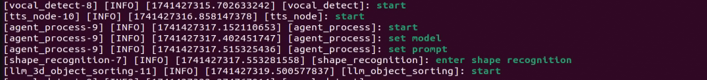

5. When the command line displays the output shown below and the **AI voice interaction box** broadcasts **I'm here**, the **AI voice interaction box** is activated. The system begins recording voice commands.

   

6. Commands can be spoken based on the **Input** prompt information in the **Task Examples** displayed by the program.

   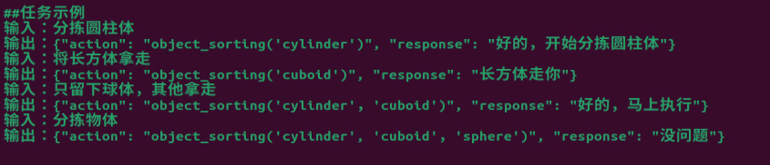

7. For example, place the props in front of the camera and say the command **Take away the cylinder**.

   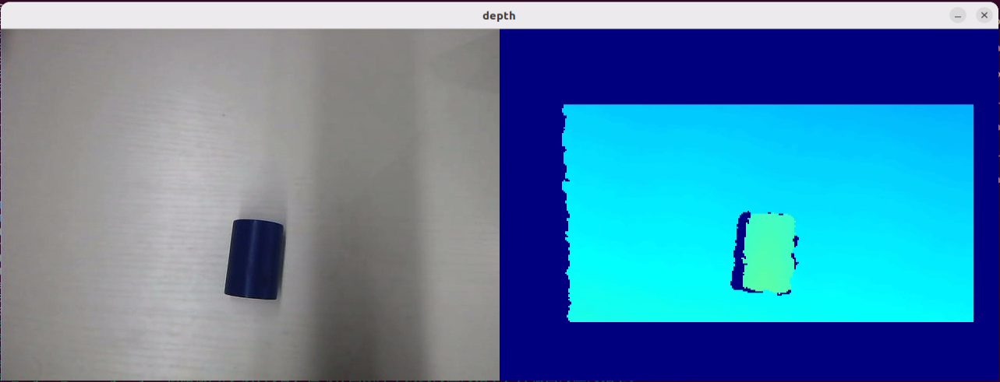

8. When the command line displays the output shown below, the **AI voice interaction box** prints out the recognized speech.

   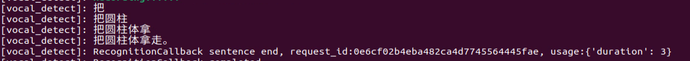

9. When the command line displays the output shown below, the speech recognition service of the cloud voice large model is successfully called to parse the command audio, and the parsed result is stored in `publish_asr_result`.

   

10. When the command line displays the output shown below, the cloud large language model is successfully invoked to process the command, providing a verbal response in `response` and designing actions conforming to the semantic meaning of the command.

    > [!NOTE]
    >
    > **The response is automatically generated by the large model. Only the semantic accuracy of the reply is guaranteed, while the text wording contains inherent randomness.**

    

11. When the command line displays the output shown below, one round of dialogue interaction has finished. Refer to Step 4 to wake up the **AI voice interaction box** again with the wake-up word and start a new round of dialogue interaction.

    

    To terminate this feature, press **Ctrl+C** in the terminal interface. If termination fails, press it multiple times.

#### 10.1.7.4 Program Outcome

After the feature is enabled, NexArm is ready to accept voice commands. For example, saying **Take away the cylinder** controls the arm to automatically grip the cylindrical block within the front field of view and place it to the left of the robotic arm.


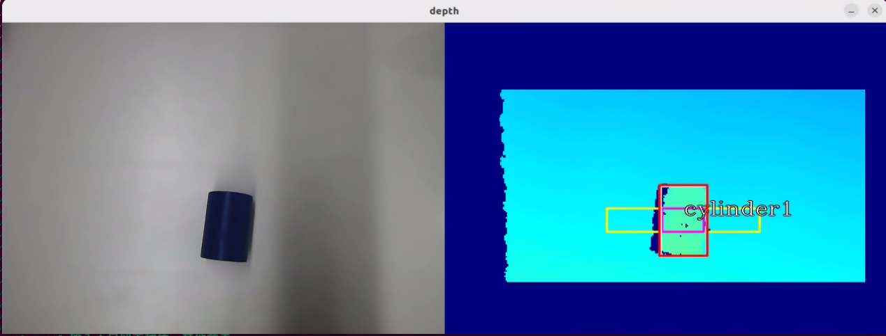

#### 10.1.7.5 Program Analysis

(1) Launch File Analysis

Program path: **/home/ubuntu/ros2_ws/src/large_models_examples/large_models_examples/llm_3d_object_sorting.launch.py**

① `launch_setup` Function

```py
def launch_setup(context):
    mode = LaunchConfiguration('mode', default=1)
    mode_arg = DeclareLaunchArgument('mode', default_value=mode)

    # Get the package path
    large_models_examples_package_path = get_package_share_directory('large_models_examples')

    object_sorting_launch = IncludeLaunchDescription(
        PythonLaunchDescriptionSource(
            os.path.join(large_models_examples_package_path, 'launch/3d_object_sorting.launch.py')),
    )

    # Launch other nodes and start.launch.py after a 5-second delay
    delayed_launch = TimerAction(
        period=5.0,  # Delay period of 5 seconds
        actions=[
            IncludeLaunchDescription(
                PythonLaunchDescriptionSource(
                    os.path.join(large_models_examples_package_path, 'launch/start.launch.py')),
                launch_arguments={'mode': mode}.items(),
            ),
            Node(
                package='large_models_examples',
                executable='llm_3d_object_sorting',
                output='screen',
            ),
        ]
    )

    return [mode_arg,
            object_sorting_launch,  # Immediate launch
            delayed_launch,          # Delayed launch
            ]
```

This function immediately loads **launch/3d_object_sorting.launch.py** from the **large_models_examples** package to start fundamental 3D object sorting nodes, including 3D object recognition, spatial positioning, and category judgment, providing underlying support and 3D spatial object information. It delays launching the large model and control nodes through `TimerAction` with a 5-second delay, ensuring that fundamental nodes finish initialization and output data stably before launching dependent components. It loads **launch/start.launch.py** from the **large_models_examples** package to start large model services, passing the `mode` parameter to control the operating mode. It starts the `llm_3d_object_sorting` executable in the **large_models_examples** package as a bridge between the large model and 3D object sorting logic, converting large model decisions into specific robotic arm action commands, with logs output to the screen.

② `generate_launch_description` Function

```py
def generate_launch_description():
    return LaunchDescription([
        OpaqueFunction(function=launch_setup)
    ])
```

This function creates and returns a `LaunchDescription` object, calling the `launch_setup` function via `OpaqueFunction` as the standard entry point for the ROS 2 launch file.

③ Main Function

```py
if __name__ == '__main__':
    # Create a LaunchDescription object
    ld = generate_launch_description()

    ls = LaunchService()
    ls.include_launch_description(ld)
    ls.run()
```

This block creates the `LaunchDescription` object and `LaunchService` service, adding the launch description to the launch service and running it to achieve manual system startup.

(2) Python File Analysis

Program path: **/home/ubuntu/ros2_ws/src/large_models_examples/large_models_examples/llm_3d_object_sorting.py**

① Define Prompt Template: PROMPT

```py
## Task Examples
Input: Sort cylinder
Output: {'action': "object_sorting('cylinder')", 'response':'Okay, starting to sort cylinder'}
Input: Take away the cuboid
Output: {'action': "object_sorting('cuboid')", 'response':'Cuboid, off you go'}
Input: Keep only sphere, take away the rest
Output: {'action': "object_sorting('cylinder', 'cuboid')", 'response':'Okay, executing immediately'}
Input: Sort objects
Output: {'action': "object_sorting('cylinder', 'cuboid', 'sphere')", 'response':'No problem'}
'''
```

② Initialize Variables

```py
class LLMObjectSorting(Node):
    def __init__(self, name):
        rclpy.init()
        super().__init__(name)

        self.action = []
        self.llm_result = ''
        self.action_finish = False
        self.play_audio_finish = False
        # self.llm_result = '{"action": "object_sorting(\'cylinder\', \'cuboid\', \'sphere\')", "response": "On it. Start sorting..."}'
        self.running = True

        timer_cb_group = ReentrantCallbackGroup()
        self.tts_text_pub = self.create_publisher(String, 'tts_node/tts_text', 1)
        self.create_subscription(Bool, 'tts_node/play_finish', self.play_audio_finish_callback, 1, callback_group=timer_cb_group)
        self.create_subscription(String, 'agent_process/result', self.llm_result_callback, 1)
        self.create_subscription(Bool, 'vocal_detect/wakeup', self.wakeup_callback, 1)

        self.awake_client = self.create_client(SetBool, 'vocal_detect/enable_wakeup')
        self.awake_client.wait_for_service()

        self.set_model_client = self.create_client(SetModel, 'agent_process/set_model')
        self.set_model_client.wait_for_service()

        self.set_prompt_client = self.create_client(SetString, 'agent_process/set_prompt')
        self.set_prompt_client.wait_for_service()

        self.enter_client = self.create_client(Trigger, 'shape_recognition/enter')
        self.enter_client.wait_for_service()

        self.start_client = self.create_client(SetBool, 'shape_recognition/set_running')
        self.start_client.wait_for_service()

        self.set_target_client = self.create_client(SetStringList, 'shape_recognition/set_shape')
        self.set_target_client.wait_for_service()

        self.timer = self.create_timer(0.0, self.init_process, callback_group=timer_cb_group)
```

This section initializes the node, configures state variables, such as action lists and large model results, creates publishers for TTS text, subscribers for large model results, TTS completion signals, and wake-up signals, and service clients for large model configuration and object sorting control, starting the initialization timer.

③ `get_node_state` Method

```py
    def get_node_state(self, request, response):
        return response
```

This service callback function returns an empty response for confirming node initialization completion.

④ `init_process` Method

```py
    def init_process(self):
        self.timer.cancel()
        
        msg = SetModel.Request()
        msg.model = llm_model
        msg.model_type = 'llm'
        msg.api_key = api_key 
        msg.base_url = base_url
        self.send_request(self.set_model_client, msg)

        msg = SetString.Request()
        msg.data = PROMPT
        self.send_request(self.set_prompt_client, msg)

        self.send_request(self.enter_client, Trigger.Request())       
        

        speech.play_audio(start_audio_path)
        threading.Thread(target=self.process, daemon=True).start()
        self.create_service(Empty, '~/init_finish', self.get_node_state)
        self.get_logger().info('\033[1;32m%s\033[0m' % 'start')
        self.get_logger().info('\033[1;32m%s\033[0m' % PROMPT)
```

This method executes the node initialization process, canceling the timer, configuring large model parameters, such as model type and API key, sending requests to enter the object sorting service, starting the processing thread, and logging initialization completion.

⑤ `send_request` Method

```py
    def send_request(self, client, msg):
        future = client.call_async(msg)
        while rclpy.ok():
            if future.done() and future.result():
                return future.result()
```

This general service call tool sends service requests and blocks to wait for results, ensuring service communication is completed, such as configuring large models and controlling sorting.

⑥ `wakeup_callback` Method

```py
    def wakeup_callback(self, msg):
        if msg.data and self.llm_result:
            self.send_request(self.enter_client, Trigger.Request())
```

This wake-up signal subscription callback re-sends requests to enter the object sorting service upon receiving a wake-up signal, resetting the sorting state.

⑦ `llm_result_callback` Method

```py
    def llm_result_callback(self, msg):
        self.llm_result = msg.data
```

This callback subscribes to large model results, receiving commands generated by the large model, containing `action` and `response`, and saving them to `llm_result` for processing.

⑧ `play_audio_finish_callback` Method

```py
    def play_audio_finish_callback(self, msg):
        self.play_audio_finish = msg.data
```

This callback subscribes to the TTS playback completion signal, setting the `play_audio_finish` flag to synchronize action execution and voice playback.

⑨ `process` Method

```py
    def process(self):
        while self.running:
            if self.llm_result:
                msg = String()
                if 'action' in self.llm_result:  # If there is a corresponding action returned, extract and handle it.
                    result = eval(self.llm_result[self.llm_result.find('{'):self.llm_result.find('}') + 1])
                    if 'action' in result:
                        text = result['action']
                        # Use regular expressions to extract all strings inside.
                        pattern = r"object_sorting\((['\"][^'\"]+['\"](?:\s*,\s*['\"][^'\"]+['\"])*)\)"
                        # Use re.search to find the matching result.
                        match = re.search(pattern, text)
                        # Extract the result.
                        if match:
                            # Retrieve all argument parts (the content inside the parentheses).
                            params = match.group(1)
                            # Use regular expressions to split the string arguments.
                            objects = re.findall(r"['\"]([^'\"]+)['\"]", params)
                            # self.get_logger().info(str(objects))
                            # Enable recognition.
                            msgs = SetStringList.Request()
                            msgs.data = objects                            
                            res = self.send_request(self.set_target_client, msgs)
                            if res.success:
                                self.get_logger().info('\033[1;32m%s\033[0m' % 'set object success')
                            else:
                                self.get_logger().info('\033[1;32m%s\033[0m' % 'set object fail')
                            start_msg = SetBool.Request()
                            start_msg.data = True
                            # Enable sorting.
                            self.send_request(self.start_client, start_msg)
                    if 'response' in result:
                        msg.data = result['response']
                else:  # No corresponding action, just respond.
                    msg.data = self.llm_result
                self.tts_text_pub.publish(msg)
                self.action_finish = True
                self.llm_result = ''
            else:
                time.sleep(0.01)
            if self.play_audio_finish and self.action_finish:
                self.play_audio_finish = False
                self.action_finish = False
                msg = SetBool.Request()
                msg.data = True
                self.send_request(self.awake_client, msg)
        rclpy.shutdown()
```

The main processing loop parses large model results, extracts object sorting actions such as `object_sorting('cylinder')`, extracts target object types via regular expressions, sets sorting targets, and initiates sorting. It publishes TTS replies and re-enables the wake-up function upon completion.

⑩ `main` Function

```py
def main():
    node = LLMObjectSorting('llm_object_sorting')
    executor = MultiThreadedExecutor()
    executor.add_node(node)
    executor.spin()
    node.destroy_node()
```

As the node entry point, this function creates the `LLMObjectSorting` instance, starts a multi-threaded executor to process callbacks, runs the node, and cleans up resources.

## 10.2 Embodied AI Applications

Embodied intelligence is an essential branch in the field of artificial intelligence, emphasizing that agents achieve autonomous learning and decision-making through physical interactions with the environment. Its core philosophy lies in "intelligence originating from dynamic interactions between the body and the environment", breaking through the limitations of traditional AI that relies on static data, and finding wide applications across industry, healthcare, services, education, and defense.

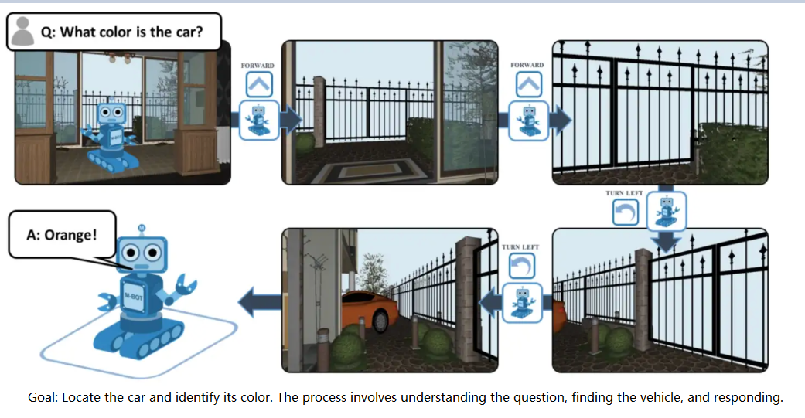

A key branch of embodied intelligence involves multimodal information fusion. Multimodal information fusion refers to the effective integration of data from different modalities, such as text, images, and voice, to obtain a more comprehensive and accurate information representation. This process is particularly critical in the field of artificial intelligence because real-world information is inherently multimodal, and a single modality often fails to provide sufficient context or detail. Therefore, multimodal information fusion aims to enhance model performance and robustness by combining data across multiple modalities.

Methods for multimodal information fusion can be broadly categorized as follows:

**Early Fusion**: Merges data from different modalities in the early stages of data processing. This method usually occurs at the input layer, mapping raw data to the same space through data alignment and transformation techniques to generate richer and more expressive data representations. For instance, in image and voice fusion, data from both modalities can be directly concatenated as input to the neural network.

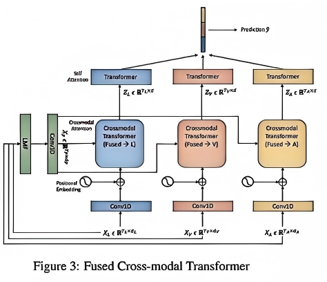

**Late Fusion**: Fuses data from different modalities at intermediate layers or the output layer of the model. This method allows specific algorithms to be trained for each modality, facilitating future additions or exchanges of different modalities. For example, results of image recognition and text analysis can be combined to arrive at the final decision.

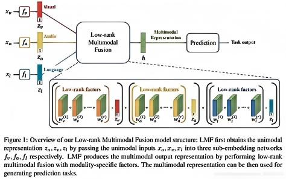

**Hybrid Fusion**: Combines the advantages of early fusion and late fusion, conducting multiple fusions at different processing stages. This method fully utilizes the complementarity among different modalities, improving model performance and robustness.

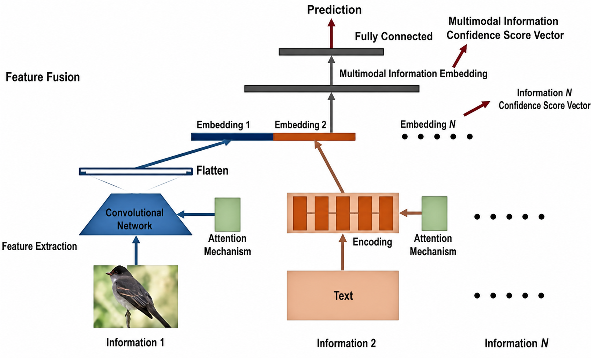

**Feature-Level Fusion**: Maps features extracted from multiple modalities into a feature vector through specific transformations, feeding it into a classification model to obtain the final decision. This method fuses different types of data during the feature extraction stage.

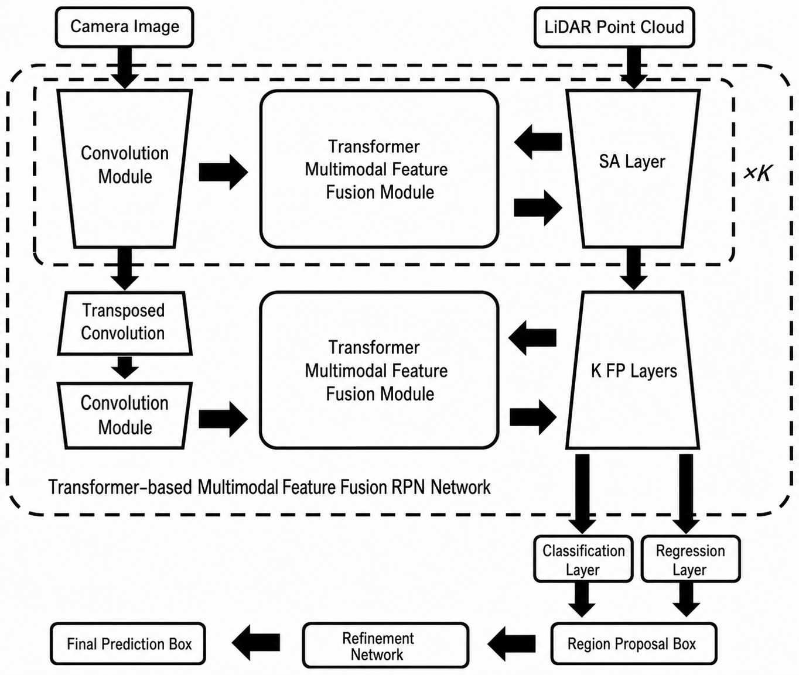

**Decision-Level Fusion**: Combines decisions obtained from different modal information to arrive at the final decision. This method exhibits good anti-interference capability with relatively low requirements for sensor performance and types, although it may entail notable information loss.

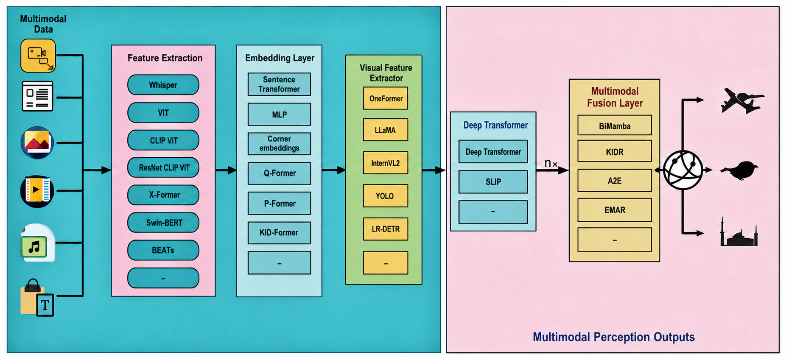

**Deep Fusion**: Occurs during the feature extraction stage, mixing multimodal data in the feature space to obtain fused features, compensating for missing features in other modalities, and then applying these fused features in the prediction stage for classification or regression tasks.

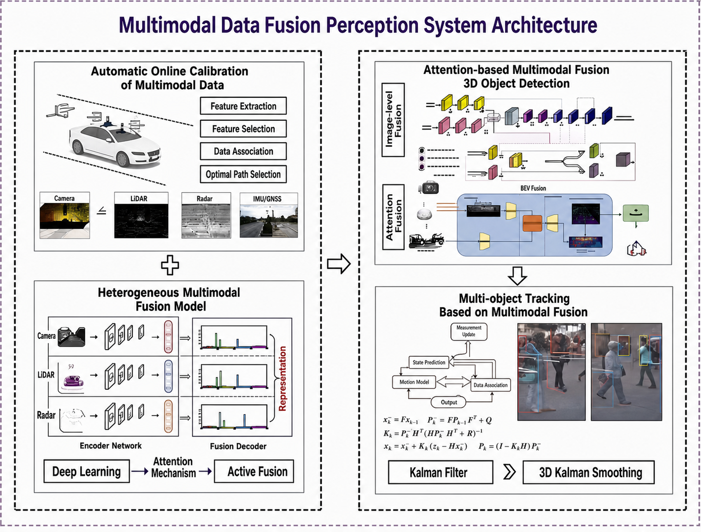

Multimodal information fusion not only holds significant theoretical importance but also demonstrates enormous potential in practical applications. In fields such as autonomous driving, medical image analysis, and human-robot interaction, multimodal information fusion technology has seen broad adoption, significantly enhancing system performance and reliability.

### 10.2.1 Preparation

<p id ="p12-3-1"></p>

This lesson covers flashing firmware to WonderEcho Pro.

1. Connect WonderEcho Pro to the computer using a Type-C data cable.

   

2. Open the **PACK_UPDATE_TOOL.exe** file under [Appendix / Firmware Flashing Tool](https://drive.google.com/drive/folders/1r2ct899U_7aK2qF7nz46MaSzFiB6Jh4N?usp=sharing), select the **CI1302** chip, and click **Update**.

   

   Flashing the **English firmware (wake word hello hiwonder).bin** is used as an example, and the operating steps are equally applicable to flashing firmware with other wake words.

3. Click **Select firmware**, locating the **English firmware (wake word hello hiwonder).bin** firmware under the [Appendix](https://drive.google.com/drive/folders/1THBsl0_o-KakU-_7QVFSXlSznB270g4v?usp=sharing) directory.

   

4. Locate the corresponding serial port and check the box.

   

5. Press the **RST** button on the voice interaction module to enter flashing mode, and wait for the flashing process to complete successfully.

   


### 10.2.2 Large Language Model Deployment

<p id ="p12-2-2"></p>

This section outlines the steps to register on the official OpenAI website and obtain the API key for the Large Language Model.

#### 10.2.2.1 OpenAI Account Registration and Setup

① Copy the following URL: <https://platform.openai.com/docs/overview>

Open the OpenAI website and click the **Sign up** button in the top right corner.


② Follow the prompts to register and log in using a Google, Microsoft, or Apple account.


③ Click on the settings icon, then select **Billing**, followed by **Payment methods**, to link a payment method. Top up the account to purchase tokens.


④ After completing the setup, click on **API keys**, then select **Create new secret key**. Follow the prompts to fill in the required information. Once the key is created, make sure to save it for future use.


⑤ With these steps completed, the large model is successfully created and deployed. The API is ready for use in subsequent lessons.

#### 10.2.2.2 OpenRouter Account Registration and Setup

① Copy the following URL: <https://openrouter.ai/>

Open the webpage in a browser and click **Sign in**. Register using a Google account or another available login option.


② After logging in, click the icon in the top-right corner and select **Credits** to link a payment method.


③ To create an API key, go to **API Keys**, then click **Create Key**. Follow the prompts to complete the process. Once the key is generated, make sure to save it for future use.


④ Then, the large model is successfully created and deployed. The API is ready for use in subsequent lessons.

### 10.2.3 API Configuration

<p id ="p12-2-3"></p>

1. Connect to the robot using the **VNC** remote connection tool to access the system desktop, then click the terminal icon  on the left taskbar.

```bash
cd ~/ros2_ws/src/large_models/large_models/large_models/ 
```

2. Enter the command to open the large model configuration file.

```bash
gedit config.py
```

3. Enter the obtained OpenAI API key as the value for the `llm_api_Key` variable, as indicated by the red box in the image below.


4. Enter the OpenAI API key as the value for the `llm_api_key` variable highlighted in the red box below:


5. Press the key combination **Ctrl+S** to save the current configuration file, then click the close button in the upper right corner to exit.

6. Through the above steps, the acquisition and configuration of the large model API key are completed.

### 10.2.4 Real-Time Detection

This lesson utilizes an online large model. Ensure that the controller maintains smooth network connectivity, with a wired network connection recommended.

#### 10.2.4.1 Introduction

When the program starts running, the **AI voice interaction box** broadcasts **I'm ready**.

Then, say the designated wake-up word **Hello Hiwonder** to activate the **AI voice interaction box**, and it responds with **I'm here**. Once activated, NexArm can be operated via voice commands, such as **What do you see**. After the command is issued, the terminal prints the recognized image content, and the **AI voice interaction box** broadcasts the response generated after reasoning.

#### 10.2.4.2 Preparation

* **Firmware Flashing**

Refer to tutorial: [10.2.1 Preparation](#p12-3-1)

* **Large Model API Key Acquisition**

Refer to tutorial: [10.2.2 Large Language Model Deployment](#p12-2-2)

* **API Key Configuration**

Refer to tutorial: [10.2.3 API Configuration](#p12-2-3)

#### 10.2.4.3 Operation Steps

> [!NOTE]
>
> * **Command input is strictly case-sensitive and space-sensitive.**
>
> * **The robot must be connected to the network, configured in STA mode on the local area network or connected via an Ethernet cable in AP direct connection mode.**
>
> * **Before powering on the robotic arm, be sure to secure the base of the robotic arm to the desktop or a stable platform using a G clamp. The robotic arm generates swing and inertia during startup and operation. If not secured, the device may tip over, fall, or suffer damage, posing safety risks.**

1. Power on the robotic arm and connect it to the remote control software **VNC**, referring to Section [1.5 Development Environment Setup and Configuration](https://wiki.hiwonder.com/projects/NexArm/en/ros-version/docs/1.%20NexArm%20User%20Manual.html#_1-5-development-environment-setup-and-configuration) in the **NexArm User Manual**.

2. Click  to open the command bar. Enter the command and press **Enter** to disable the auto-start service.

```bash
~/.stop_ros.sh
```

3. Enter the command and press **Enter** to run the real-time detection feature.

```bash
ros2 launch large_models_examples vllm_with_camera.launch.py
```

4. When the command line displays the output shown below and broadcasts **I'm ready**, the **AI voice interaction box** has finished initialization. Then, say the wake word **Hello Hiwonder**.

   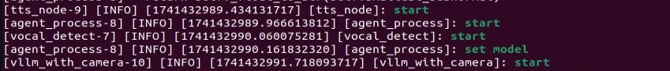

5. For example, place the content to be recognized in front of the camera and say the command "What do you see."

   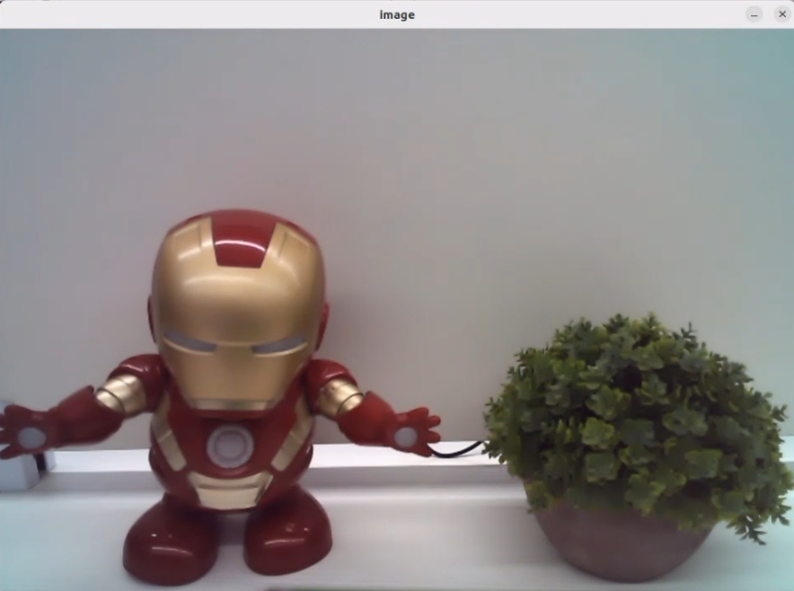

   

   > [!NOTE]
   >
   > **The response is automatically generated by the large model. Only the semantic accuracy of the reply is guaranteed, while the text wording contains inherent randomness.**

6. When the command line displays the output shown below, one round of dialogue interaction has finished. Refer to Step 4 to wake up the **AI voice interaction box** again with the wake-up word and start a new round of dialogue interaction.

   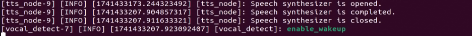

7. To terminate this feature, press **Ctrl+C** in the terminal interface. If termination fails, press it multiple times.

#### 10.2.4.4 Program Outcome

After the feature is started, NexArm is ready to accept **voice commands**. For example, say **What do you see**. NexArm automatically recognizes the scene within its field of view, reasons through it, and describes the current scene content in detail.


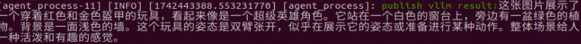

#### 10.2.4.5 Program Analysis

(1) Launch File Analysis

Program path: **/home/ubuntu/ros2_ws/src/large_models_examples/large_models_examples/vllm_with_camera.launch.py**

① Define `launch_setup` Function

```python
def launch_setup(context):
    mode = LaunchConfiguration('mode', default=1)
    mode_arg = DeclareLaunchArgument('mode', default_value=mode)

    peripherals_package_path = get_package_share_directory('peripherals')
    sdk_package_path = get_package_share_directory('sdk')
    large_models_examples_package_path = get_package_share_directory('large_models_examples')

    # Launch depth_camera_launch
    depth_camera_launch = IncludeLaunchDescription(
        PythonLaunchDescriptionSource(
            os.path.join(peripherals_package_path, 'launch/depth_camera.launch.py')),
    )

    # Launch sdk_launch and large_models_examples_launch after 5 seconds
    delayed_launch = TimerAction(
        period=5.0,  # Delay time is 5 seconds
        actions=[
            IncludeLaunchDescription(
                PythonLaunchDescriptionSource(
                    os.path.join(sdk_package_path, 'launch/armpi_ultra.launch.py')),
            ),
            IncludeLaunchDescription(
                PythonLaunchDescriptionSource(
                    os.path.join(large_models_examples_package_path, 'launch/start.launch.py')),
                launch_arguments={'mode': mode}.items(),
            ),
        ]
    )

    vllm_with_camera_node = Node(
        package='large_models_examples',
        executable='vllm_with_camera',
        output='screen',
    )

    return [depth_camera_launch,  # Launch depth_camera_launch immediately
            delayed_launch,       # Launch sdk_launch and large_models_examples_launch after delay
            vllm_with_camera_node,
            ]
```

This function immediately loads **launch/depth_camera.launch.py** from the **peripherals** package to start the depth camera node, providing RGB images and depth data as visual input foundations. It delays launching core services through `TimerAction` with a 5-second delay, ensuring that the depth camera finishes initialization and outputs data stably before starting dependent services. It loads **launch/armpi_ultra.launch.py** from the **sdk** package to start low-level control services for the robotic arm, such as servo drivers and kinematics calculations, providing hardware support for subsequent action execution. It loads **launch/start.launch.py** from the **large_models_examples** package to start large model services, passing the `mode` parameter to control its operating mode, such as different inference logic and interaction methods. It declares `vllm_with_camera_node` to start the `vllm_with_camera` executable in the **large_models_examples** package, combining depth camera data with large model capabilities, such as visual question answering and scene understanding, to achieve a closed loop of visual input to large model decision to robotic arm interaction, with logs output to the screen.

② `generate_launch_description` Function

```python
def generate_launch_description():
    return LaunchDescription([
        OpaqueFunction(function=launch_setup)
    ])
```

This function creates and returns a `LaunchDescription` object, calling the `launch_setup` function via `OpaqueFunction` as the standard entry point for the ROS 2 launch file.

③ Main Function

```python
if __name__ == '__main__':
    # Create a LaunchDescription object
    ld = generate_launch_description()

    ls = LaunchService()
    ls.include_launch_description(ld)
    ls.run()
```

This block creates the `LaunchDescription` object and `LaunchService` service, adding the launch description to the launch service and running it to achieve manual system startup.

(2) Python File Analysis

The source code for this program is located at: **/home/ubuntu/ros2_ws/src/large_models_examples/large_models_examples/vllm_with_camera.py**

① Import Packages

```python
import cv2
import time
import queue
import rclpy
import threading
import numpy as np
import os

from rclpy.node import Node
from sensor_msgs.msg import Image
from std_msgs.msg import String, Bool
from std_srvs.srv import Trigger, SetBool, Empty
from rclpy.executors import MultiThreadedExecutor
from rclpy.callback_groups import ReentrantCallbackGroup

from speech import speech
from large_models_examples.config import *
from large_models_examples_msgs.srv import SetString, SetModel
from servo_controller.bus_servo_control import set_servo_position
from servo_controller_msgs.msg import ServosPosition

from cv_bridge import CvBridge
```

1. `servo_controller_msgs.msg.ServosPosition`: Custom message type for controlling servo motors.
2. `servo_controller.bus_servo_control.set_servo_position`: Servo control function used to set servo angles.
3. `speech`: Module related to large model voice interaction.
4. `large_models_examples_msgs.srv`: Custom service types for the large model.
5. `large_models_examples.config`: Large model configuration file.

② `VLLMWithCamera` Class

```python
class VLLMWithCamera(Node):
    def __init__(self, name):
        rclpy.init()
        super().__init__(name)
        self.image_queue = queue.Queue(maxsize=2)
        self.vllm_result = ''
        self.running = True
        self.bridge = CvBridge()
        timer_cb_group = ReentrantCallbackGroup()
        self.joints_pub = self.create_publisher(ServosPosition, 'servo_controller', 1)
        self.tts_text_pub = self.create_publisher(String, 'tts_node/tts_text', 1)
        self.create_subscription(Image, 'depth_cam/rgb/image_raw', self.image_callback, 1)
        self.create_subscription(String, 'agent_process/result', self.vllm_result_callback, 1)
        self.create_subscription(Bool, 'tts_node/play_finish', self.play_audio_callback, 1, callback_group=timer_cb_group)
        self.awake_client = self.create_client(SetBool, 'vocal_detect/enable_wakeup')
        self.awake_client.wait_for_service()
        self.set_model_client = self.create_client(SetModel, 'agent_process/set_model')
        self.set_model_client.wait_for_service()
        self.set_prompt_client = self.create_client(SetString, 'agent_process/set_prompt')
        self.set_prompt_client.wait_for_service()
        self.timer = self.create_timer(0.0, self.init_process, callback_group=timer_cb_group)
```

This section initializes the node, configures core components, creates an image queue `image_queue` to buffer camera images, and defines state variables such as `vllm_result` to store large model results. It initializes ROS communication, including publishers for servo control and TTS text, subscribers for RGB images, large model results, and TTS playback completion signals, as well as service clients for large model configuration and wakeup control. It also starts the initialization timer to trigger `init_process` for subsequent configuration.

③ `get_node_state` Method

```python
    def get_node_state(self, request, response):
        return response
```

This service callback function returns an empty response to confirm node initialization completion.

④ `init_process` Method

```python
    def init_process(self):
        self.timer.cancel()
        msg = SetModel.Request()
        msg.model_type = 'vllm'
        if os.environ['ASR_LANGUAGE'] == 'Chinese':
            msg.model = stepfun_vllm_model
            msg.api_key = stepfun_api_key
            msg.base_url = stepfun_base_url
        else:
            msg.model = vllm_model
            msg.api_key = vllm_api_key
            msg.base_url = vllm_base_url
        self.send_request(self.set_model_client, msg)
        msg = SetString.Request()
        msg.data = PROMPT
        self.send_request(self.set_prompt_client, msg)
        set_servo_position(self.joints_pub, 1.0, ((6, 500), (5, 600), (4, 825), (3, 233), (2, 500), (1, 300)))
        speech.play_audio(start_audio_path)
        threading.Thread(target=self.process, daemon=True).start()
        self.create_service(Empty, '~/init_finish', self.get_node_state)
        self.get_logger().info('\033[1;32m%s\033[0m' % 'start')
```

This method executes the node initialization process, canceling the timer, configuring large model parameters such as selecting models and API keys based on the language environment, and setting prompt words. It controls the robotic arm servos to reset to initial positions, plays startup audio, starts the main processing thread for `process`, creates the initialization completion service, and outputs startup logs.

⑤ `send_request` Method

```python
    def send_request(self, client, msg):
        future = client.call_async(msg)
        while rclpy.ok():
            if future.done() and future.result():
                return future.result()
```

This general service call tool sends requests and blocks to wait for results, ensuring service communication is completed, such as configuring the large model and enabling wakeup.

⑥ `vllm_result_callback` Method

```python
    def vllm_result_callback(self, msg):
        self.vllm_result = msg.data
```

This callback subscribes to large model results, receiving model output and saving it to `vllm_result` for subsequent processing.

⑦ `process` Method

```python
    def process(self):
        while self.running:
            image = self.image_queue.get(block=True)
            if self.vllm_result:
                msg = String()
                msg.data = self.vllm_result
                self.tts_text_pub.publish(msg)
                self.vllm_result = ''
            cv2.imshow('image', image)
            cv2.waitKey(1)
        cv2.destroyAllWindows()
```

The main processing loop acquires camera images from the queue and displays them, monitoring large model results in real time. Upon receiving model results, it publishes them to the TTS node for speech playback and clears the result cache. It loops continuously until the node stops, finally closing image windows upon exit.

⑧ `play_audio_callback` Method

```python
    def play_audio_callback(self, msg):
        if msg.data:
            msg = SetBool.Request()
            msg.data = True
            self.send_request(self.awake_client, msg)
```

This TTS playback completion signal callback re-enables the wakeup function to await the next command input.

⑨ `image_callback` Method

```python
    def image_callback(self, ros_image):
        try:
            cv_image = self.bridge.imgmsg_to_cv2(ros_image, desired_encoding='bgr8')
        except Exception as e:
            self.get_logger().error(f"Image conversion error: {e}")
            return
        if self.image_queue.full():
            self.image_queue.get()
        self.image_queue.put(cv_image)
```

This RGB image subscription callback converts ROS image messages into OpenCV format and stores them in the image queue, dropping older images when the queue is full.

⑩ `main` Function

```python
def main():
    node = VLLMWithCamera('vllm_with_camera')
    executor = MultiThreadedExecutor()
    executor.add_node(node)
    executor.spin()
    node.destroy_node()
```

As the node entry point, this function creates the `VLLMWithCamera` instance, starts a multi-threaded executor to process callbacks, runs the node, and cleans up resources.

### 10.2.5 Visual Tracking

This lesson utilizes an online large model. Ensure that the controller maintains smooth network connectivity, with a wired network connection recommended.

#### 10.2.5.1 Introduction

When the program starts running, the **AI voice interaction box** broadcasts **I'm ready**.

Then, say the designated wake-up word **Hello Hiwonder** to activate the **AI voice interaction box**, and it responds with **I'm here**. Once activated, NexArm can be operated via voice commands, such as **Track the purple ball**. After the command is issued, the terminal prints the recognized speech, and the **AI voice interaction box** broadcasts the response generated after reasoning, executing the corresponding actions.

#### 10.2.5.2 Preparation

* **Firmware Flashing**

Refer to tutorial: [10.2.1 Preparation](#p12-3-1)

* **Large Model API Key Acquisition**

Refer to tutorial: [10.2.2 Large Language Model Deployment](#p12-2-2)

* **API Key Configuration**

Refer to tutorial: [10.2.3 API Configuration](#p12-2-3)

#### 10.2.5.3 Operation Steps

> [!NOTE]
>
> * **Command input is strictly case-sensitive and space-sensitive.**
>
> * **The robot must be connected to the network, configured in STA mode on the local area network or connected via an Ethernet cable in AP direct connection mode.**
>
> * **Before powering on the robotic arm, be sure to secure the base of the robotic arm to the desktop or a stable platform using a G clamp. The robotic arm generates swing and inertia during startup and operation. If not secured, the device may tip over, fall, or suffer damage, posing safety risks.**

1. Power on the robotic arm and connect it to the remote control software **VNC**, referring to Section [1.5 Development Environment Setup and Configuration](https://wiki.hiwonder.com/projects/NexArm/en/ros-version/docs/1.%20NexArm%20User%20Manual.html#_1-5-development-environment-setup-and-configuration) in the **NexArm User Manual**.

2. Click  to open the command bar. Enter the command and press **Enter** to disable the auto-start service.

```bash
~/.stop_ros.sh
```

3. Enter the command and press **Enter** to run the visual tracking feature.

```bash
ros2 launch large_models_examples vllm_track.launch.py
```

4. When the command line displays the output shown below and broadcasts **I'm ready**, the **AI voice interaction box** has finished initialization. Then, say the wake word **Hello Hiwonder**.

   

5. When the command line displays the output shown below and the **AI voice interaction box** broadcasts **I'm here**, the **AI voice interaction box** is activated. The system begins recording voice commands.

   

6. When the command line displays the output shown below, the **AI voice interaction box** prints out the recognized speech.

   

7. When the command line displays the output shown below, the speech recognition service of the cloud voice large model is successfully called to parse the command audio, and the parsed result is stored in `publish_asr_result`.

   

8. When the command line displays the output shown below, the cloud large language model is successfully invoked to process the command, providing a verbal response in `response` and designing actions conforming to the semantic meaning of the command.

   > [!NOTE]
   >
   > **The response is automatically generated by the large model. Only the semantic accuracy of the reply is guaranteed, while the text wording contains inherent randomness.**

   

9. When the command line displays the output shown below, one round of dialogue interaction has finished. Refer to Step 4 to wake up the **AI voice interaction box** again with the wake-up word and start a new round of dialogue interaction.

   

10. To terminate this feature, press **Ctrl+C** in the terminal interface. If termination fails, press it multiple times.

#### 10.2.5.4 Program Outcome

After the feature is started, NexArm is ready to accept voice commands. For example, saying **Track the purple ball** controls the arm to automatically track the purple ball within its field of view, outlining the purple ball on screen and halting tracking once centered.


#### 10.2.5.5 Program Analysis

(1) Launch File Analysis

Program path: **/home/ubuntu/ros2_ws/src/large_models_examples/large_models_examples/vllm_track.launch.py**

① Define `launch_setup` Function

```python
def launch_setup(context):
    mode = LaunchConfiguration('mode', default=1)
    mode_arg = DeclareLaunchArgument('mode', default_value=mode)

    peripherals_package_path = get_package_share_directory('peripherals')
    sdk_package_path = get_package_share_directory('sdk')
    large_models_examples_package_path = get_package_share_directory('large_models_examples')

    # Launch depth_camera_launch immediately
    depth_camera_launch = IncludeLaunchDescription(
        PythonLaunchDescriptionSource(
            os.path.join(peripherals_package_path, 'launch/depth_camera.launch.py')),
    )

    # Launch sdk_launch, large_models_examples_launch, and vllm_track_node after 5 seconds
    delayed_launch = TimerAction(
        period=5.0,  # Delay time is 5 seconds
        actions=[
            IncludeLaunchDescription(
                PythonLaunchDescriptionSource(
                    os.path.join(sdk_package_path, 'launch/armpi_ultra.launch.py')),
            ),
            IncludeLaunchDescription(
                PythonLaunchDescriptionSource(
                    os.path.join(large_models_examples_package_path, 'launch/start.launch.py')),
                launch_arguments={'mode': mode}.items(),
            ),
            Node(
                package='large_models_examples',
                executable='vllm_track',
                output='screen',
            ),            
        ]
    )

    return [mode_arg,
            depth_camera_launch,   # Launch immediately
            delayed_launch,        # Launch other parts after 5 seconds
            ]
```

This function immediately loads **launch/depth_camera.launch.py** from the **peripherals** package to start the depth camera node, providing RGB images and depth data as visual input for tracking. It delays launching core services and tracking nodes through `TimerAction` with a 5-second delay, ensuring the depth camera finishes initialization and outputs data stably before starting dependent core components. It loads **launch/armpi_ultra.launch.py** from the **sdk** package to start low-level control services for the robotic arm, such as servo drivers and kinematics calculations, providing hardware support for grasping or following target movements. It loads **launch/start.launch.py** from the **large_models_examples** package to start large model services, passing the `mode` parameter to control its operating mode, such as different target recognition logic and tracking strategies. It starts the `vllm_track` executable in the **large_models_examples** package as the core visual tracking node, combining depth camera data with large model capabilities to achieve target tracking, such as real-time positioning and dynamic following, with logs output to the screen.

② `generate_launch_description` Function

```python
def generate_launch_description():
    return LaunchDescription([
        OpaqueFunction(function=launch_setup)
    ])
```

This function creates and returns a `LaunchDescription` object, calling the `launch_setup` function via `OpaqueFunction` as the standard entry point for the ROS 2 launch file.

③ Main Function

```python
if __name__ == '__main__':
    # Create a LaunchDescription object
    ld = generate_launch_description()

    ls = LaunchService()
    ls.include_launch_description(ld)
    ls.run()
```

This block creates the `LaunchDescription` object and `LaunchService` service, adding the launch description to the launch service and running it to achieve manual system startup.

(2) Python File Analysis

The source code for this program is located at: **/home/ubuntu/ros2_ws/src/large_models_examples/large_models_examples/vllm_track.py**

① Import Packages

```python
import cv2
import json
import time
import queue
import rclpy
import threading
import PIL.Image
import numpy as np
import sdk.fps as fps
from sdk import common
from cv_bridge import CvBridge
from rclpy.node import Node
from sensor_msgs.msg import Image
from std_msgs.msg import String, Float32, Bool
from std_srvs.srv import Trigger, SetBool, Empty
from rcl_interfaces.msg import SetParametersResult
from rclpy.executors import MultiThreadedExecutor
from rclpy.callback_groups import ReentrantCallbackGroup

from speech import speech
from large_models_examples.config import *
from large_models_examples_msgs.srv import SetString, SetModel
from large_models_examples.track_anything import ObjectTracker
from kinematics_msgs.srv import SetRobotPose, SetJointValue
from kinematics.kinematics_control import set_pose_target, set_joint_value_target
from servo_controller.bus_servo_control import set_servo_position
from servo_controller_msgs.msg import ServosPosition, ServoPosition
```

1. `PIL.Image`: Part of the Pillow library used for image processing.
2. `sdk.fps as fps`: Used to calculate and display frames per second, FPS.
3. `kinematics_msgs.srv.SetRobotPose`: Service types for setting robot poses.
4. `kinematics.kinematics_control.set_pose_target`: Function for setting pose targets.
5. `servo_controller_msgs.msg.ServosPosition`: Custom message type for controlling servo motors.
6. `speech`: Module related to large model voice interaction.
7. `large_models_examples_msgs.srv`: Custom service types for the large model.
8. `large_models_examples.config`: Large model configuration file.
9. `large_models_examples.track_anything`: Class used for object tracking.

② Define Prompt Template: PROMPT

```python
if os.environ["ASR_LANGUAGE"] == 'Chinese':
    PROMPT = '''
As an image recognition expert, your capability is to perform precise target detection and localization on images sent by users, and output final results according to the "Output Format".
## 1. Understand User Instructions
I will give you a sentence, and you need to make the best decision based on my words, extracting the "object name" from the decision made. The name corresponding to object must be expressed in English. Do not output objects that are not mentioned.
## 2. Understand Images
I will give you an image. From this image, find the pixel coordinates of the top-left and bottom-right corners of the object corresponding to the "object name". Do not output objects that are not mentioned.
[Special Note]: Deeply understand spatial relationships between objects.
## Output Format (Please output only the following content, do not say any extra words)
{
    "object": name, 
    "xyxy": [xmin, ymin, xmax, ymax]
}
    '''
```

This section defines a prompt string (PROMPT) directing how to process instructions and image data, specifying rules and output formats for recognition tasks.

③ `VLLMTrack` Class

```python
    def __init__(self, name):
        rclpy.init()
        super().__init__(name)
        self.fps = fps.FPS() # Frame rate counter
        self.image_queue = queue.Queue(maxsize=2)
        self.vllm_result = ''
        # self.vllm_result = '''json{"object":"Red block", "xyxy":[521, 508, 637, 683]}'''
        self.running = True
        self.bridge = CvBridge()

        self.data = []
        self.start_track = False
        self.action_finish = False
        self.play_audio_finish = False
        self.language = os.environ["ASR_LANGUAGE"]
        self.track = ObjectTracker()
        timer_cb_group = ReentrantCallbackGroup()
        self.client = speech.OpenAIAPI(api_key, base_url)
        self.joints_pub = self.create_publisher(ServosPosition, 'servo_controller', 1)
        self.tts_text_pub = self.create_publisher(String, 'tts_node/tts_text', 1)
        self.create_subscription(Image, 'depth_cam/rgb/image_raw', self.image_callback, 1)
        self.create_subscription(Bool, 'tts_node/play_finish', self.play_audio_finish_callback, 1, callback_group=timer_cb_group)
        self.create_subscription(String, 'agent_process/result', self.vllm_result_callback, 1)

        self.awake_client = self.create_client(SetBool, 'vocal_detect/enable_wakeup')
        self.awake_client.wait_for_service()
        self.set_model_client = self.create_client(SetModel, 'agent_process/set_model')
        self.set_model_client.wait_for_service()
        self.set_prompt_client = self.create_client(SetString, 'agent_process/set_prompt')
        self.set_prompt_client.wait_for_service()
        self.ik_client = self.create_client(SetRobotPose, 'kinematics/set_pose_target')
        self.ik_client.wait_for_service()
        self.fk_client = self.create_client(SetJointValue, 'kinematics/set_joint_value_target')
        self.fk_client.wait_for_service()
        # Define PID parameters
        # 0.07, 0, 0.001
        self.pid_params = {
            'kp1': 0.065, 'ki1': 0.0, 'kd1': 0.001,
            'kp2': 0.00004, 'ki2': 0.0, 'kd2': 0.0,
            'kp3': 0.05, 'ki3': 0.0, 'kd3': 0.0
        }

        # Dynamically declare parameters
        for param_name, default_value in self.pid_params.items():
            self.declare_parameter(param_name, default_value)
            self.pid_params[param_name] = self.get_parameter(param_name).value

        self.track.update_pid([self.pid_params['kp1'], self.pid_params['ki1'], self.pid_params['kd1']],
                      [self.pid_params['kp2'], self.pid_params['ki2'], self.pid_params['kd2']],
                      [self.pid_params['kp3'], self.pid_params['ki3'], self.pid_params['kd3']])

        # Callback function for dynamic updates
        self.add_on_set_parameters_callback(self.on_parameter_update)

        self.timer = self.create_timer(0.0, self.init_process, callback_group=timer_cb_group)
```

This section initializes the node, configures state variables such as the image queue and tracking states, sets up ROS communication components including publishers, subscribers, and service clients, initializes PID parameters and the object tracker, and starts the initialization timer.

④ `on_parameter_update` Method

```python
    def on_parameter_update(self, params):
        """Parameter update callback"""
        for param in params:
            if param.name in self.pid_params.keys():
                self.pid_params[param.name] = param.value
        self.get_logger().info(f'PID parameters updated: {self.pid_params}')
        # Update PID parameters
        self.track.update_pid([self.pid_params['kp1'], self.pid_params['ki1'], self.pid_params['kd1']],
                      [self.pid_params['kp2'], self.pid_params['ki2'], self.pid_params['kd2']],
                      [self.pid_params['kp3'], self.pid_params['ki3'], self.pid_params['kd3']])

        return SetParametersResult(successful=True)
```

This parameter update callback function updates PID parameters and synchronizes them with the tracker whenever dynamic parameter changes occur.

⑤ `create_update_callback` Method

```python
    def create_update_callback(self, param_name):
        """Generate dynamic update callback"""
        def update_param(msg):
            new_value = msg.data
            self.pid_params[param_name] = new_value
            self.set_parameters([Parameter(param_name, Parameter.Type.DOUBLE, new_value)])
            self.get_logger().info(f'Updated {param_name}: {new_value}')
            # Update PID parameters
        return update_param
```

This method generates dynamic update callbacks for specific PID parameters to adjust parameters in real time.

⑥ `get_node_state` Method

```python
    def get_node_state(self, request, response):
        return response
```

This service callback function returns the node state for confirming initialization completion.

⑦ `init_process` Method

```python
    def init_process(self):
        self.timer.cancel()
        
        msg = SetModel.Request()
        msg.model_type = 'vllm'
        if self.language == 'Chinese':
            msg.model = stepfun_vllm_model
            msg.api_key = stepfun_api_key
            msg.base_url = stepfun_base_url
        else:
            msg.api_key = vllm_api_key
            msg.base_url = vllm_base_url
            msg.model = vllm_model
        self.send_request(self.set_model_client, msg)

        msg = SetString.Request()
        msg.data = PROMPT
        self.send_request(self.set_prompt_client, msg)
        
        z = 0.15
        msg = set_pose_target([0.137, 0.0, z], 30, [-90.0, 90.0], 1.0)
        res = self.send_request(self.ik_client, msg)
        if res.pulse:
            servo_data = res.pulse
            # self.get_logger().info(str(servo_data))
            set_servo_position(self.joints_pub, 1.5, ((1, 300), (2, 500), (3, servo_data[3]), (4, servo_data[2]), (5, servo_data[1]), (6, servo_data[0])))
            time.sleep(1.8)
            self.track.set_init_param(servo_data[3], servo_data[0], z)
        speech.play_audio(start_audio_path)
        threading.Thread(target=self.process, daemon=True).start()
        threading.Thread(target=self.track_thread, daemon=True).start()
        self.create_service(Empty, '~/init_finish', self.get_node_state)
        self.get_logger().info('\033[1;32m%s\033[0m' % 'start')
```

This method executes the node initialization workflow, configuring large model parameters, controlling the robotic arm to reach initial poses, playing startup audio, starting the main processing thread and tracking thread, and creating the initialization completion service.

⑧ `send_request` Method

```python
    def send_request(self, client, msg):
        future = client.call_async(msg)
        while rclpy.ok():
            if future.done() and future.result():
                return future.result()
```

This general service call tool sends service requests and blocks to wait for return results.

⑨ `wakeup_callback` Method

```python
    def wakeup_callback(self, msg):
        if msg.data and self.vllm_result:
            self.get_logger().info('wakeup interrupt')
            self.track.stop()
            self.stop = True
        elif msg.data and not self.stop:
            self.get_logger().info('wakeup interrupt')
            self.track.stop()
            self.stop = True
```

This wakeup signal subscription callback processes interrupt signals to halt target tracking.

⑩ `vllm_result_callback` Method

```python
    def vllm_result_callback(self, msg):
        self.vllm_result = msg.data
```

This callback subscribes to large model results, receiving object coordinate information output by the model.

⑪ `play_audio_finish_callback` Method

```python
    def play_audio_finish_callback(self, msg):
        self.play_audio_finish = msg.data
```

This callback subscribes to the TTS playback completion signal, updating audio playback status.

⑫ `process` Method

```python
    def process(self):
        box = ''
        while self.running:
            image = self.image_queue.get(block=True)
            if self.vllm_result:
                try:
                    self.vllm_result = json.loads(self.vllm_result)
                    box = self.vllm_result['xyxy']
                    box = self.client.data_process(box, 640, 400)
                    box = [box[0], box[1], box[2] - box[0], box[3] - box[1]]
                    self.get_logger().info('box: %s' % str(box))
                    self.track.set_track_target(box, image)
                    self.start_track = True
                    speech.play_audio(start_track_audio_path, block=False)
                except (ValueError, TypeError) as e:
                    self.start_track = False
                    msg = String()
                    msg.data = self.vllm_result
                    self.tts_text_pub.publish(msg)
                    # speech.play_audio(track_fail_audio_path, block=False)
                    # self.get_logger().info(e)
                self.vllm_result = ''
                msg = SetBool.Request()
                msg.data = True
                self.send_request(self.awake_client, msg)
            if self.start_track:
                self.data = self.track.track(image)
            self.fps.update()
            self.fps.show_fps(image)
            cv2.imshow('image', image)
            cv2.waitKey(1)

        cv2.destroyAllWindows()
```

The main processing loop acquires camera images from the queue, parses large model results to obtain object bounding boxes, starts target tracking, and displays images in real time.

⑬ `track_thread` Method

```python
    def track_thread(self):
        while self.running:
            if self.data:
                y, z, joint4 = self.data[0], self.data[1], self.data[2]
                if z > 0.23 or joint4 >= 391:
                    msg = set_pose_target([0.167, 0.0, z], 0.0, [-180.0, 180.0], 1.0)
                    res = self.send_request(self.ik_client, msg)
                    if res.pulse:
                        servo_data = res.pulse
                        set_servo_position(self.joints_pub, 0.0, (
                        (1, 500), (2, 500), (3, servo_data[3]), (4, servo_data[2]), (5, servo_data[1]),
                        (6, int(y))))
                    else:
                        set_servo_position(self.joints_pub, 0.02, ((6, int(y)),))
                else:
                    set_servo_position(self.joints_pub, 0.0, ((6, y), (3, joint4)))
                self.data = []
            else:
                time.sleep(0.01)
```

This tracking control thread controls robotic arm servos based on target tracking data, such as position and angle, to achieve target following.

⑭ `image_callback` Method

```python
    def image_callback(self, ros_image):
        try:
            cv_image = self.bridge.imgmsg_to_cv2(ros_image, desired_encoding='bgr8')
        except Exception as e:
            self.get_logger().error(f"Image conversion error: {e}")
            return

        if self.image_queue.full():
            self.image_queue.get()
        self.image_queue.put(cv_image)
```

This RGB image subscription callback converts ROS image messages into OpenCV format and stores them in the image queue, discarding older images when the queue is full.

⑮ Main Function

```python
def main():
    node = VLLMTrack('vllm_track')
    executor = MultiThreadedExecutor()
    executor.add_node(node)
    executor.spin()
    node.destroy_node()
```

As the node entry function, this creates the `VLLMTrack` instance, starts a multi-threaded executor to process callbacks, runs the node, and cleans up resources.

### 10.2.6 Intelligent Transport

This lesson utilizes an online large model. Ensure that the controller maintains smooth network connectivity, with a wired network connection recommended.

#### 10.2.6.1 Introduction

When the program starts running, the **AI voice interaction box** broadcasts **I'm ready**.

Then, say the designated wake-up word **Hello Hiwonder** to activate the **AI voice interaction box**, and it responds with **I'm here**. Once activated, NexArm can be operated via voice commands, such as **Place the blue block to the left of the green block**. After the command is issued, the terminal prints the recognized speech, and the **AI voice interaction box** broadcasts the response generated after reasoning, synchronously executing the corresponding action.

#### 10.2.6.2 Preparation

* **Firmware Flashing**

Refer to tutorial: [10.2.1 Preparation](#p12-3-1)

* **Large Model API Key Acquisition**

Refer to tutorial: [10.2.2 Large Language Model Deployment](#p12-2-2)

* **API Key Configuration**

Refer to tutorial: [10.2.3 API Configuration](#p12-2-3)

#### 10.2.6.3 Operation Steps

> [!NOTE]
>
> * **Command input is strictly case-sensitive and space-sensitive.**
>
> * **The robot must be connected to the network, configured in STA mode on the local area network or connected via an Ethernet cable in AP direct connection mode.**
>
> * **Before powering on the robotic arm, be sure to secure the base of the robotic arm to the desktop or a stable platform using a G clamp. The robotic arm generates swing and inertia during startup and operation. If not secured, the device may tip over, fall, or suffer damage, posing safety risks.**

1. Power on the robotic arm and connect it to the remote control software **VNC**, referring to Section [1.5 Development Environment Setup and Configuration](https://wiki.hiwonder.com/projects/NexArm/en/ros-version/docs/1.%20NexArm%20User%20Manual.html#_1-5-development-environment-setup-and-configuration) in the **NexArm User Manual**.

2. Click  to open the command bar. Enter the command and press **Enter** to disable the auto-start service.

```bash
~/.stop_ros.sh
```

3. Enter the command and press **Enter** to run the intelligent transport feature.

```bash
ros2 launch large_models_examples vllm_object_transport.launch.py
```

4. When the command line displays the output shown below and broadcasts **I'm ready**, the **AI voice interaction box** has finished initialization and initialized the YOLOv8 model. Then, say the wake word **Hello Hiwonder**.

   

   

5. When the command line displays the output shown below and the **AI voice interaction box** broadcasts **I'm here**, the **AI voice interaction box** is activated. The system begins recording voice commands.

   

6. Commands can be spoken based on the **Input** prompt information in the **Task Examples** displayed by the program.

   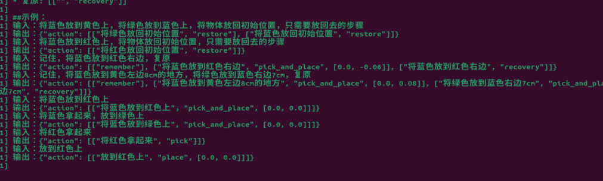

7. For example, place the props in front of the camera and say the command "Place the blue block to the right of the red block".

   

8. When the command line displays the output shown below, the **AI voice interaction box** prints out the recognized speech.

   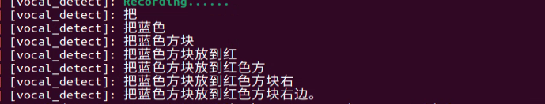

9. When the command line displays the output shown below, the speech recognition service of the cloud voice large model is successfully called to parse the command audio, and the parsed result is stored in `publish_asr_result`.

   

10. When the command line displays the output shown below, the cloud large language model is successfully invoked to process the command, providing a verbal response in `response` and designing actions conforming to the semantic meaning of the command.

    > [!NOTE]
    >
    > **The response is automatically generated by the large model. Only the semantic accuracy of the reply is guaranteed, while the text wording contains inherent randomness.**

    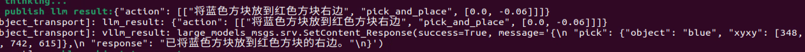

11. When the command line displays the output shown below, one round of dialogue interaction has finished. Refer to Step 4 to wake up the **AI voice interaction box** again with the wake-up word and start a new round of dialogue interaction.

    

12. To terminate this feature, press **Ctrl+C** in the terminal interface. If termination fails, press it multiple times.

#### 10.2.6.4 Program Outcome

After the feature is started, NexArm is ready to accept voice commands. For example, say **Place the blue block to the right of the red block**. NexArm automatically recognizes the color blocks within its field of view, frames them on screen, and transports them to the designated locations.

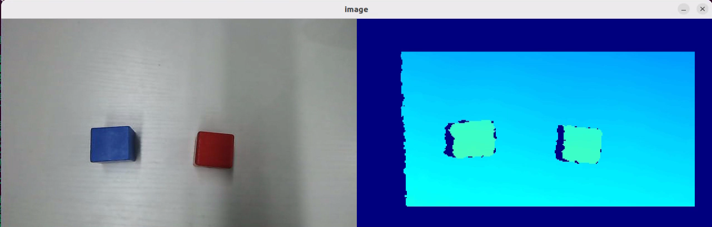

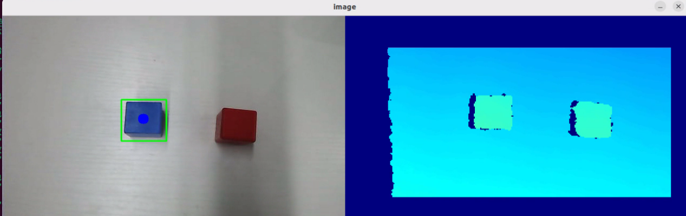

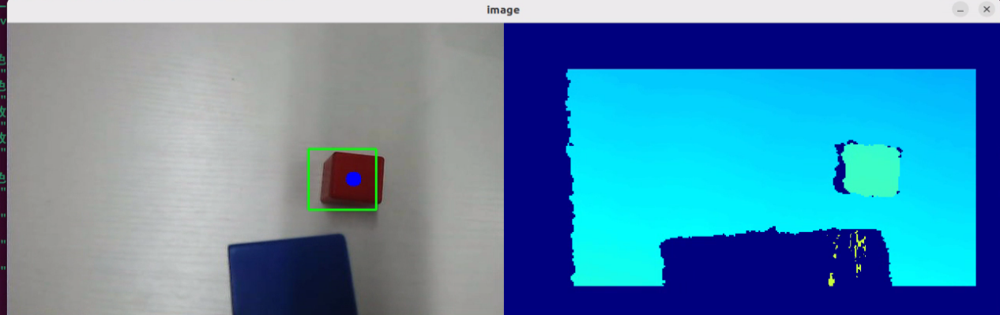

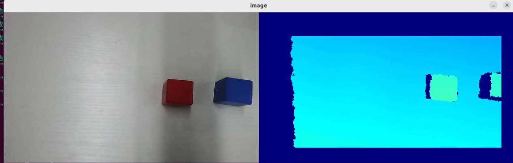

#### 10.2.6.5 Program Analysis

(1) Launch File Analysis

Program path: **/home/ubuntu/ros2_ws/src/large_models_examples/large_models_examples/vllm_object_transport.launch.py**

① Define `launch_setup` Function

```python
def launch_setup(context):
    mode = LaunchConfiguration('mode', default=1)
    mode_arg = DeclareLaunchArgument('mode', default_value=mode)

    peripherals_package_path = get_package_share_directory('peripherals')
    sdk_package_path = get_package_share_directory('sdk')
    large_models_examples_package_path = get_package_share_directory('large_models_examples')

    # Launch depth_camera_launch immediately
    depth_camera_launch = IncludeLaunchDescription(
        PythonLaunchDescriptionSource(
            os.path.join(peripherals_package_path, 'launch/depth_camera.launch.py')),
    )

    # Launch sdk_launch, large_models_examples_launch, object_transport_node, and vllm_object_transport_node after 5 seconds
    delayed_launch = TimerAction(
        period=5.0,  # Delay time is 5 seconds
        actions=[
            IncludeLaunchDescription(
                PythonLaunchDescriptionSource(
                    os.path.join(sdk_package_path, 'launch/armpi_ultra.launch.py')),
            ),
            IncludeLaunchDescription(
                PythonLaunchDescriptionSource(
                    os.path.join(large_models_examples_package_path, 'launch/start.launch.py')),
                launch_arguments={'mode': mode}.items(),
            ),
            Node(
                package='large_models_examples',
                executable='object_transport',
                output='screen',
            ),
            Node(
                package='large_models_examples',
                executable='vllm_object_transport',
                output='screen',
            ),
        ]
    )

    return [mode_arg,
            depth_camera_launch,   # Launch immediately
            delayed_launch,         # Launch other parts after 5 seconds
            ]
```

This function immediately loads **launch/depth_camera.launch.py** from the **peripherals** package to start the depth camera node, providing RGB images and depth data as fundamental visual input for object recognition and positioning. It delays launching core services and transport nodes through `TimerAction` with a 5-second delay, ensuring the depth camera finishes initialization and outputs data stably before starting dependent core components. It loads **launch/armpi_ultra.launch.py** from the **sdk** package to start low-level control services for the robotic arm, such as servo drivers and kinematics calculations, providing hardware support for object grasping and transport actions. It loads **launch/start.launch.py** from the **large_models_examples** package to start large model services, passing the `mode` parameter to control its operating mode, such as different object recognition logic and transport decision strategies. It starts the `object_transport` executable in the **large_models_examples** package as the base transport node, executing specific transport motion logic such as trajectory planning and grasp control. It starts the `vllm_object_transport` executable as a bridge between the large model and transport logic, combining visual data with large model capabilities to achieve intelligent decision-making, such as identifying target objects and determining transport destinations, with logs output to the screen.

② `generate_launch_description` Function

```python
def generate_launch_description():
    return LaunchDescription([
        OpaqueFunction(function=launch_setup)
    ])
```

This function creates and returns a `LaunchDescription` object, calling the `launch_setup` function via `OpaqueFunction` as the standard entry point for the ROS 2 launch file.

③ Main Function

```python
if __name__ == '__main__':
    # Create a LaunchDescription object
    ld = generate_launch_description()

    ls = LaunchService()
    ls.include_launch_description(ld)
    ls.run()
```

This block creates the `LaunchDescription` object and `LaunchService` service, adding the launch description to the launch service and running it to achieve manual system startup.

(2) Python File Analysis

The source code for this program is located at: **/home/ubuntu/ros2_ws/src/large_models_examples/large_models_examples/vllm_object_transport.py**

① Import Packages

```python
import cv2
import math
import json
import time
import queue
import rclpy
import threading
import numpy as np
from rclpy.node import Node
from std_msgs.msg import String, Float32, Bool
from std_srvs.srv import Trigger, SetBool, Empty
from rclpy.executors import MultiThreadedExecutor
from rclpy.callback_groups import ReentrantCallbackGroup

from speech import speech
from large_models_examples.config import *
from large_models_examples_msgs.srv import SetString, SetModel, SetBox, SetContent
```

1. `speech`: Module related to large model voice interaction.
2. `large_models_examples_msgs.srv`: Custom service types for the large model.
3. `large_models_examples.config`: Large model configuration file.

② Define Prompt Template: PROMPT

```python
## Skill Details
* Analyze user instructions, treating one pick and one place as a single action
* Strong logical reasoning capability
* When returning objects to initial positions, consider current spatial relationships between objects to decide the transport sequence
* Only objects that have been moved can be returned to their initial positions
* Directions generally include left, right, top, front, and back. If no value is specified: left is [0.0, 0.06], right is [0.0, -0.06], front is [0.06, 0.0], back is [-0.06, 0.0], top is [0.0, 0.0]

## Requirements and Restrictions
1. Based on input content, locate corresponding commands in the function library and output them.
2. Multiple actions must be placed into a list.
3. Transport is divided into pick and place phases.
4. Directly output JSON formatted data without analysis or extraneous content.
5. During restoration, if instructions include transport actions, return the transport commands, otherwise return "".
6. Format: {"action":"xx"}
```

This section defines the prompt string (PROMPT) instructing how to process user instructions and image data, specifying rules and output formats for recognition tasks.

③ `VLLMObjectTransport` Class

```python
class VLLMObjectTransport(Node):
    def __init__(self, name):
        rclpy.init()
        super().__init__(name)
        self.llm_result = ''
        self.running = True
        self.transport_finished = True
        self.lock = threading.RLock()
        self.client = speech.OpenAIAPI(api_key, base_url)
        self.language = os.environ["ASR_LANGUAGE"]
        self.tts_text_pub = self.create_publisher(String, 'tts_node/tts_text', 1)
        self.asr_pub = self.create_publisher(String, '/vocal_detect/asr_result', 1)
        self.create_subscription(String, 'agent_process/result', self.llm_result_callback, 1)
        self.create_subscription(Bool, 'object_transport/transport_finished', self.transport_finished_callback, 1)

        self.awake_client = self.create_client(SetBool, 'vocal_detect/enable_wakeup')
        self.awake_client.wait_for_service()
        self.set_model_client = self.create_client(SetModel, 'agent_process/set_model')
        self.set_model_client.wait_for_service()
        self.set_prompt_client = self.create_client(SetString, 'agent_process/set_prompt')
        self.set_prompt_client.wait_for_service()
        self.set_vllm_content_client = self.create_client(SetContent, 'agent_process/set_vllm_content')
        self.set_vllm_content_client.wait_for_service()
       
        self.record_chat_client = self.create_client(SetBool, 'agent_process/record_chat')
        self.record_chat_client.wait_for_service()
        self.get_chat_client = self.create_client(Trigger, 'agent_process/get_chat')
        self.get_chat_client.wait_for_service()
        self.clear_chat_client = self.create_client(Empty, 'agent_process/clear_chat')
        self.clear_chat_client.wait_for_service()

        self.enter_client = self.create_client(Trigger, 'object_transport/enter')
        self.enter_client.wait_for_service()

        self.start_client = self.create_client(SetBool, 'object_transport/enable_transport')
        self.start_client.wait_for_service()

        self.set_pick_client = self.create_client(SetBox, 'object_transport/set_pick_position')
        self.set_pick_client.wait_for_service()
        self.set_place_client = self.create_client(SetBox, 'object_transport/set_place_position')
        self.set_place_client.wait_for_service()
        self.record_position_client = self.create_client(SetBox, 'object_transport/record_position')
        self.record_position_client.wait_for_service()

        timer_cb_group = ReentrantCallbackGroup()
        self.timer = self.create_timer(0.0, self.init_process, callback_group=timer_cb_group)
```

This section initializes the node, configures state variables such as action lists and transport states, sets up ROS communication components including publishers, subscribers, and service clients, and starts the initialization timer.

④ `get_node_state` Method

```python
    def get_node_state(self, request, response):
        return response
```

This service callback function returns the node state for confirming initialization completion.

⑤ `init_process` Method

```python
    def init_process(self):
        self.timer.cancel()

        msg = SetModel.Request()
        msg.model_type = 'llm'
        msg.model = llm_model
        msg.api_key = api_key
        msg.base_url = base_url
        self.send_request(self.set_model_client, msg)

        msg = SetString.Request()
        msg.data = LLM_PROMPT
        self.send_request(self.set_prompt_client, msg)
        
        msg = Empty.Request()
        self.send_request(self.clear_chat_client, msg)

        init_finish = self.create_client(Empty, 'object_transport/init_finish')
        init_finish.wait_for_service()
        self.send_request(self.enter_client, Trigger.Request())
        speech.play_audio(start_audio_path)
        threading.Thread(target=self.process, daemon=True).start()
        self.create_service(Empty, '~/init_finish', self.get_node_state)
        self.get_logger().info('\033[1;32m%s\033[0m' % 'start')
        self.get_logger().info('\033[1;32m%s\033[0m' % LLM_PROMPT)
```

This method executes the node initialization workflow, configuring large model parameters and prompts, clearing chat histories, starting the processing thread, playing startup audio, and outputting initialization logs.

⑥ `send_request` Method

```python
    def send_request(self, client, msg):
        future = client.call_async(msg)
        while rclpy.ok():
            if future.done() and future.result():
                return future.result()
```

This general service call tool sends service requests and blocks to wait for return results, ensuring service communication is completed.

⑦ `llm_result_callback` Method

```python
    def llm_result_callback(self, msg):
        self.llm_result = msg.data
```

This callback subscribes to large model output results, saving results to the `llm_result` variable for subsequent processing.

⑧ `remember_position` Method

```python
    def remember_position(self):
        msg = SetContent.Request()
        if self.language == 'Chinese':
            msg.api_key = stepfun_api_key
            msg.base_url = stepfun_base_url
            msg.model = stepfun_vllm_model
        else:
            msg.api_key = vllm_api_key
            msg.base_url = vllm_base_url
            msg.model = vllm_model
        msg.prompt = VLLM_PROMPT2 
        vllm_result = self.send_request(self.set_vllm_content_client, msg)
        self.get_logger().info(f'vllm_result: {vllm_result}')
        message = vllm_result.message
        if message.startswith("```") and message.endswith("```"):
            message = message.strip("```").replace("json\n", "").strip()
        initial_position = json.loads(message)
        
        # self.get_logger().info(f'initial_position: {initial_position}')
        for i in initial_position:
            msg = SetBox.Request()
            msg.label = i
            xyxy = initial_position[i]
            msg.box = self.client.data_process(xyxy, 640, 400)
            self.send_request(self.record_position_client, msg)
        msg = SetBool.Request()
        msg.data = True
        self.send_request(self.start_client, msg)

        msg = SetBool.Request()
        msg.data = True
        self.send_request(self.record_chat_client, msg)
```

This method invokes the vision large model with `VLLM_PROMPT2` to recognize initial object positions from images, parse results, and log them to the object transport node to initiate position recording.

⑨ `recovery` Method

```python
    def recovery(self, text):
        if not text:
            msg = Trigger.Request()
            res = self.send_request(self.get_chat_client, msg)
            # self.get_logger().info(str(res.message)) 
            text = res.message.rsplit(",", 1)[0] if "," in res.message else res.message
            msg = SetBool.Request()
            msg.data = False
            self.send_request(self.record_chat_client, msg)
            msg = Empty.Request()
            self.send_request(self.clear_chat_client, msg)
        msg = String()
        if self.language == 'Chinese':
            msg.data = '{}, 只需要放回去的步骤'.format(text)
        else:
            msg.data = '{}, only the steps for putting it back'.format(text)
        self.get_logger().info('\033[1;32m%s\033[0m' % msg.data)
        self.asr_pub.publish(msg)
```

This method processes restoration commands, invoking the large model to obtain steps required for putting objects back and publishing commands to the ASR result topic to trigger the subsequent recovery process.

⑩ `object_restore` Method

```python
    def object_restore(self, query): 
        msg = SetContent.Request()
        if self.language == 'Chinese':
            msg.api_key = stepfun_api_key
            msg.base_url = stepfun_base_url
            msg.model = stepfun_vllm_model
        else:
            msg.api_key = vllm_api_key
            msg.base_url = vllm_base_url
            msg.model = vllm_model
        msg.prompt = VLLM_PROMPT1
        msg.query = query
        vllm_result = self.send_request(self.set_vllm_content_client, msg)
        self.get_logger().info(f'vllm_result: {vllm_result}')
        message = vllm_result.message
        if message.startswith("```") and message.endswith("```"):
            message = message.strip("```").replace("json\n", "").strip()
        position = json.loads(message)
        
        msg = SetBox.Request()
        msg.label = position['pick']['object']
        xyxy = position['pick']['xyxy']
        if self.language == 'Chinese':
            msg.box = self.client.data_process(xyxy, 640, 400)
        else:
            msg.box = [int(xyxy[0] * 640), int(xyxy[1] * 400), int(xyxy[2] * 640), int(xyxy[3] * 400)]
        self.send_request(self.set_pick_client, msg)
        msg = SetBox.Request()
        msg.label = position['pick']['object']
        self.send_request(self.set_place_client, msg)
        # self.get_logger().info(f'msg: {msg}')

        # Enable sorting
        msg = SetBool.Request()
        msg.data = True
        self.send_request(self.start_client, msg)
        self.transport_finished = False

        msg = Empty.Request()
        self.send_request(self.clear_chat_client, msg)

        msg = String()
        msg.data = position['response']
        self.tts_text_pub.publish(msg)
```

This method handles commands for returning objects to initial positions, calling the vision large model with `VLLM_PROMPT1` to obtain target positions, configuring pick and place parameters, and starting object transport.

⑪ `get_object_position` Method

```python
    def get_object_position(self, query, offset=None):
        msg = SetContent.Request()
        if self.language == 'Chinese':
            msg.api_key = stepfun_api_key
            msg.base_url = stepfun_base_url
            msg.model = stepfun_vllm_model
        else:
            msg.api_key = vllm_api_key
            msg.base_url = vllm_base_url
            msg.model = vllm_model
        msg.prompt = VLLM_PROMPT1
        msg.query = query
        vllm_result = self.send_request(self.set_vllm_content_client, msg)
        self.get_logger().info(f'vllm_result: {vllm_result}')
        message = vllm_result.message
        if message.startswith("```") and message.endswith("```"):
            message = message.strip("```").replace("json\n", "").strip()
        position = json.loads(message)
        # self.get_logger().info(f'position: {position}') 

        # msg.label = label
        xyxy = position['pick']['xyxy']
        # self.get_logger().info(f'pick xyxy: {xyxy}')
        if xyxy:
            msg = SetBox.Request()
            msg.box = self.client.data_process(xyxy, 640, 400)
            # msg.box = position['pick']['xyxy']
            self.send_request(self.set_pick_client, msg)
        xyxy = position['place']['xyxy']
        # self.get_logger().info(f'place xyxy: {xyxy}')
        if xyxy:
            msg = SetBox.Request()
            # msg.label = label
            if self.language == 'Chinese':
                msg.box = self.client.data_process(xyxy, 640, 400)
            else:
                msg.box = [int(xyxy[0] * 640), int(xyxy[1] * 400), int(xyxy[2] * 640), int(xyxy[3] * 400)]
            msg.offset = offset
            self.send_request(self.set_place_client, msg)

        # Enable sorting
        msg = SetBool.Request()
        msg.data = True
        self.send_request(self.start_client, msg)
        self.transport_finished = False

        msg = String()
        msg.data = position['response']
        self.tts_text_pub.publish(msg)
```

Based on user queries and offsets, this method calls the vision large model with `VLLM_PROMPT1` to obtain object pick and place positions, configuring them on the transport node and starting the transport workflow.

⑫ `transport_finished_callback` Method

```python
    def transport_finished_callback(self, msg):
        self.transport_finished = msg.data
```

This callback subscribes to the object transport completion signal, updating the `transport_finished` state to synchronize action execution.

⑬ `process` Method

```python
    def process(self):
        action_list = []
        action_finish = False
        while self.running:
            if self.llm_result:
                try:
                    self.get_logger().info(f'llm_result: {self.llm_result}')
                    if 'action' in self.llm_result:  # If there is a corresponding action returned, extract and process it
                        if self.llm_result.startswith("```") and self.llm_result.endswith("```"):
                            self.llm_result = self.llm_result.strip("```").replace("json\n", "").strip()
                        action_list = json.loads(self.llm_result)['action']
                        action_finish = False
                    else:
                        action_finish = True
                except BaseException as e:
                    print(e)
                self.llm_result = ''
            else:
                if action_list:
                    # self.get_logger().info(f'{self.transport_finished}')
                    if self.transport_finished:
                        action = action_list[0]
                        if 'remember' in action:        # Remember position
                            self.remember_position()
                        elif 'recovery' in action:       # Recover
                            self.recovery(action[0])
                        elif 'pick' in action:            # Pick object
                            self.get_object_position(action[0])
                        elif 'place' in action:            # Place object
                            self.get_object_position(action[0], action[-1])
                        elif 'pick_and_place' in action:   # Pick and place on something
                            self.get_object_position(action[0], action[-1])
                        elif 'restore' in action:          # Restore a specific object
                            self.object_restore(action[0])
                        del action_list[0]
                        if not action_list:
                            action_finish = True
                    else:
                        time.sleep(0.1)
                else:
                    time.sleep(0.02)
            if action_finish:
                action_finish = False
                msg = SetBool.Request()
                msg.data = True
                self.send_request(self.awake_client, msg)
        rclpy.shutdown()
```

The main processing loop parses the action list returned by the large model, such as remembering positions, recovery, picking, and placing, sequentially calling corresponding functions like `remember_position` and `recovery`, and re-enables the wakeup function upon completion.

⑭ `main` Function

```python
def main():
    node = VLLMObjectTransport('vllm_object_transport')
    executor = MultiThreadedExecutor()
    executor.add_node(node)
    executor.spin()
    node.destroy_node()
```

As the node entry function, this creates the `VLLMObjectTransport` instance, starts a multi-threaded executor to process callbacks, runs the node, and cleans up resources.

### 10.2.7 Intelligent Butler

This lesson utilizes an online large model. Ensure that the controller maintains smooth network connectivity, with a wired network connection recommended.

#### 10.2.7.1 Introduction

When the program starts running, the **AI voice interaction box** broadcasts **I'm ready**.

Then, say the designated wake-up word **Hello Hiwonder** to activate the **AI voice interaction box**, and it responds with **I'm here**. Once activated, NexArm can be operated via voice commands, such as **Bring me the ketchup**. After the command is issued, the terminal prints the recognized speech, and the **AI voice interaction box** broadcasts the response generated after reasoning, synchronously executing the corresponding action.

#### 10.2.7.2 Preparation

* **Firmware Flashing**

Refer to tutorial: [10.2.1 Preparation](#p12-3-1)

* **Large Model API Key Acquisition**

Refer to tutorial: [10.2.2 Large Language Model Deployment](#p12-2-2)

* **API Key Configuration**

Refer to tutorial: [10.2.3 API Configuration](#p12-2-3)

#### 10.2.7.3 Operation Steps

> [!NOTE]
>
> * **Command input is strictly case-sensitive and space-sensitive.**
>
> * **The robot must be connected to the network, configured in STA mode on the local area network or connected via an Ethernet cable in AP direct connection mode.**
>
> * **Before powering on the robotic arm, be sure to secure the base of the robotic arm to the desktop or a stable platform using a G clamp. The robotic arm generates swing and inertia during startup and operation. If not secured, the device may tip over, fall, or suffer damage, posing safety risks.**

1. Power on the robotic arm and connect it to the remote control software **VNC**, referring to Section [1.5 Development Environment Setup and Configuration](https://wiki.hiwonder.com/projects/NexArm/en/ros-version/docs/1.%20NexArm%20User%20Manual.html#_1-5-development-environment-setup-and-configuration) in the **NexArm User Manual**.

2. Click  to open the command bar. Enter the command and press **Enter** to disable the auto-start service.

```bash
~/.stop_ros.sh
```

3. Enter the command and press **Enter** to run the intelligent butler feature.

```bash
ros2 launch large_models_examples vllm_dietitianl.launch.py
```

4. When the command line displays the output shown below and broadcasts **I'm ready**, the **AI voice interaction box** has finished initialization and initialized the YOLOv8 model. Then, say the wake word **Hello Hiwonder**.

   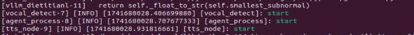

   

5. When the command line displays the output shown below and the **AI voice interaction box** broadcasts **I'm here**, the **AI voice interaction box** is activated. The system begins recording voice commands.

   

6. Commands can be spoken based on the prompt information displayed by the program, such as **Bring me the ketchup**.

   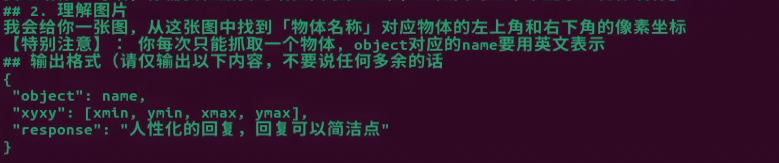

7. When the command line displays the output shown below, the **AI voice interaction box** prints out the recognized speech.

   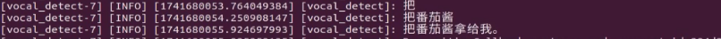

8. When the command line displays the output shown below, the speech recognition service of the cloud voice large model is successfully called to parse the command audio, and the parsed result is stored in `publish_asr_result`.

   

9. When the command line displays the output shown below, the cloud large language model is successfully invoked to process the command, providing a verbal response in `response` and designing actions conforming to the semantic meaning of the command.

   > [!NOTE]
   >
   > **The response is automatically generated by the large model. Only the semantic accuracy of the reply is guaranteed, while the text wording contains inherent randomness.**

   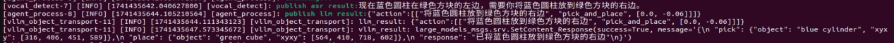

10. When the command line displays the output shown below, one round of dialogue interaction has finished. Refer to Step 4 to wake up the **AI voice interaction box** again with the wake-up word and start a new round of dialogue interaction.

    

11. To terminate this feature, press **Ctrl+C** in the terminal interface. If termination fails, press it multiple times.

#### 10.2.7.4 Program Outcome

After the feature is started, NexArm is ready to accept voice commands. For example, say **Bring me the ketchup**. NexArm automatically recognizes objects within its field of view, outlines the ketchup bottle on screen, and places it at the required location.

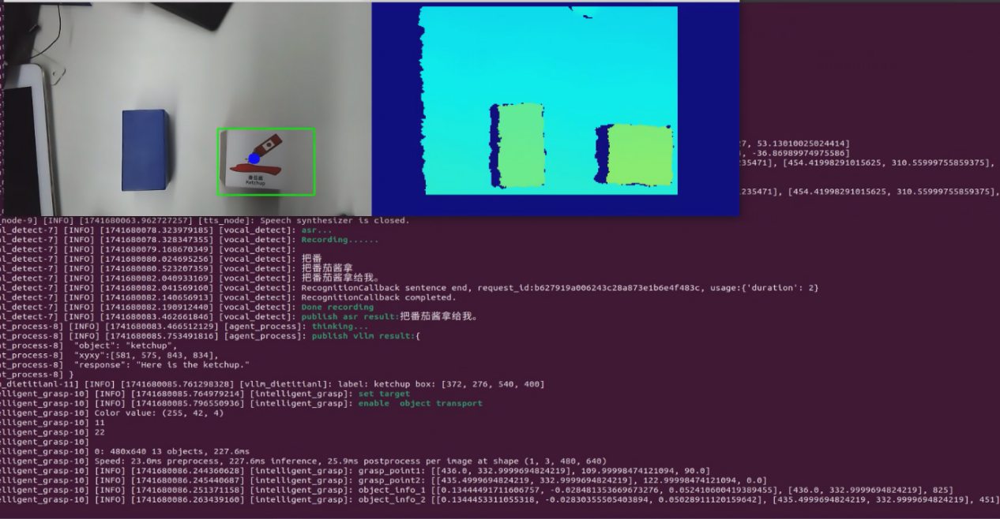

#### 10.2.7.5 Program Analysis

(1) Launch File Analysis

Program path: **/home/ubuntu/ros2_ws/src/large_models_examples/large_models_examples/vllm_dietitianl.launch.py**

① Define `launch_setup` Function

```python
def launch_setup(context):
    mode = LaunchConfiguration('mode', default=1)
    mode_arg = DeclareLaunchArgument('mode', default_value=mode)

    peripherals_package_path = get_package_share_directory('peripherals')
    sdk_package_path = get_package_share_directory('sdk')
    large_models_examples_package_path = get_package_share_directory('large_models_examples')

    # Launch depth_camera_launch immediately
    depth_camera_launch = IncludeLaunchDescription(
        PythonLaunchDescriptionSource(
            os.path.join(peripherals_package_path, 'launch/depth_camera.launch.py')),
    )

    control_launch = IncludeLaunchDescription(
        PythonLaunchDescriptionSource(
            os.path.join(sdk_package_path, 'launch/armpi_ultra.launch.py')),
    )

    # Launch sdk_launch, large_models_examples_launch, intelligent_grasp_node, and vllm_dietitianl_node after 5 seconds
    delayed_launch = TimerAction(
        period=5.0,  # Delay time is 5 seconds
        actions=[            
            IncludeLaunchDescription(
                PythonLaunchDescriptionSource(
                    os.path.join(large_models_examples_package_path, 'launch/start.launch.py')),
                launch_arguments={'mode': mode}.items(),
            ),
            Node(
                package='large_models_examples',
                executable='intelligent_grasp',
                output='screen',
            ),
            Node(
                package='large_models_examples',
                executable='vllm_dietitianl',
                output='screen',
            ),
        ]
    )

    return [mode_arg,
            depth_camera_launch,  # Launch immediately
            control_launch,
            delayed_launch,        # Launch other parts after 5 seconds
            ]
```

This function immediately loads **launch/depth_camera.launch.py** from the **peripherals** package to start the depth camera node, providing RGB images and depth data as visual input for object recognition, positioning, and analysis. It delays launching core services through `TimerAction` with a 5-second delay, ensuring the depth camera finishes initialization. It loads **launch/armpi_ultra.launch.py** from the **sdk** package to start low-level control services for the robotic arm, such as servo drivers and kinematics calculations, providing hardware support for intelligent grasping. It loads **launch/start.launch.py** from the **large_models_examples** package to start large model services, passing the `mode` parameter to control the operating mode. It starts the `intelligent_grasp` executable in the **large_models_examples** package as the core grasping node to implement vision-based precision grasping logic. It starts the `vllm_dietitianl` executable in the **large_models_examples** package to combine visual data with large model reasoning for object analysis and interaction, with logs output to the screen.

② `generate_launch_description` Function

```python
def generate_launch_description():
    return LaunchDescription([
        OpaqueFunction(function=launch_setup)
    ])
```

This function creates and returns a `LaunchDescription` object, calling the `launch_setup` function via `OpaqueFunction` as the standard entry point for the ROS 2 launch file.

③ Main Function

```python
if __name__ == '__main__':
    # Create a LaunchDescription object
    ld = generate_launch_description()

    ls = LaunchService()
    ls.include_launch_description(ld)
    ls.run()
```

This block creates the `LaunchDescription` object and `LaunchService` service, adding the launch description to the launch service and running it to achieve manual system startup.

(2) Python File Analysis

The source code for this program is located at: **/home/ubuntu/ros2_ws/src/large_models_examples/large_models_examples/vllm_dietitianl.py**

① Import Packages

```python
import os
import cv2
import math
import json
import time
import queue
import rclpy
import threading
import numpy as np
from rclpy.node import Node
from std_msgs.msg import String, Float32, Bool
from std_srvs.srv import Trigger, SetBool, Empty
from rclpy.executors import MultiThreadedExecutor
from rclpy.callback_groups import ReentrantCallbackGroup

from speech import speech
from large_models_examples.config import *
from large_models_examples_msgs.srv import SetString, SetModel, SetBox
```

1. `speech`: Module related to large model voice interaction.
2. `large_models_examples_msgs.srv`: Custom service types for the large model.
3. `large_models_examples.config`: Large model configuration file.

② Define Prompt Template: PROMPT

```python
PROMPT = '''
As an intelligent butler robot capable of gripping various items, your capability is to perform precise target detection and localization on images sent by users, and output final results according to the "Output Format".
## 1. Understand User Instructions
I will give you a sentence, and you need to make the best decision based on my words, extracting the "object name" from the decision made.
## 2. Understand Images
I will give you an image. From this image, find the pixel coordinates of the top-left and bottom-right corners of the object corresponding to the "object name".
[Special Note]: You can only grip one object at a time. The name corresponding to object must be expressed in English.
## Output Format (Please output only the following content, do not say any extra words)
{
 "object": name,
 "xyxy": [xmin, ymin, xmax, ymax],
 "response": "Human-like response, keep replies concise"
}
'''
```

③ `VLLMDietitianl` Class

```python
class VLLMDietitianl(Node):
    def __init__(self, name):
        rclpy.init()
        super().__init__(name)
        self.vllm_result = ''
        # self.vllm_result = '''json{"object":"Banana","xyxy":[243, 441, 842, 552], "response": "Banana"}'''
        self.running = True
        self.action_finish = False
        self.play_audio_finish = False
        self.lock = threading.RLock()
        self.language = os.environ["ASR_LANGUAGE"]
        self.client = speech.OpenAIAPI(api_key, base_url)
        
        timer_cb_group = ReentrantCallbackGroup()
        self.tts_text_pub = self.create_publisher(String, 'tts_node/tts_text', 1)
        self.create_subscription(String, 'agent_process/result', self.llm_result_callback, 1)
        self.create_subscription(Bool, 'tts_node/play_finish', self.play_audio_finish_callback, 1, callback_group=timer_cb_group)
        
        self.awake_client = self.create_client(SetBool, 'vocal_detect/enable_wakeup')
        self.awake_client.wait_for_service()
        self.set_model_client = self.create_client(SetModel, 'agent_process/set_model')
        self.set_model_client.wait_for_service()
        self.set_prompt_client = self.create_client(SetString, 'agent_process/set_prompt')
        self.set_prompt_client.wait_for_service()
        
        self.enter_client = self.create_client(Trigger, 'intelligent_grasp/enter')
        self.enter_client.wait_for_service()

        self.start_client = self.create_client(SetBool, 'intelligent_grasp/enable_transport')
        self.start_client.wait_for_service()

        self.set_target_client = self.create_client(SetBox, 'intelligent_grasp/set_target')
        self.set_target_client.wait_for_service()

        self.timer = self.create_timer(0.0, self.init_process, callback_group=timer_cb_group)
```

This section initializes the node, configures state variables such as large model results and action completion flags, sets up ROS communication components including publishers, subscribers, and service clients, and starts the initialization timer.

④ `get_node_state` Method

```python
    def get_node_state(self, request, response):
        return response
```

This service callback function returns the node state for confirming initialization completion.

⑤ `init_process` Method

```python
    def init_process(self):
        self.timer.cancel()

        msg = SetModel.Request()
        msg.model_type = 'vllm'
        if self.language == 'Chinese':
            msg.model = stepfun_vllm_model
            msg.api_key = stepfun_api_key
            msg.base_url = stepfun_base_url
        else:
            msg.model = vllm_model
            msg.api_key = vllm_api_key
            msg.base_url = vllm_base_url
        self.send_request(self.set_model_client, msg)

        msg = SetString.Request()
        msg.data = PROMPT
        self.send_request(self.set_prompt_client, msg)        
        
        # init_finish = self.create_client(Empty, 'intelligent_grasp/init_finish')
        # init_finish.wait_for_service()        
        self.send_request(self.enter_client, Trigger.Request())
        speech.play_audio(start_audio_path)
        threading.Thread(target=self.process, daemon=True).start()
        self.create_service(Empty, '~/init_finish', self.get_node_state)
        self.get_logger().info('\033[1;32m%s\033[0m' % 'start')
        self.get_logger().info('\033[1;32m%s\033[0m' % PROMPT)
```

This method executes the initialization workflow, configuring large model parameters such as selecting models and API keys based on the language environment, setting prompt words, sending requests to enter the intelligent grasping service, playing startup audio, starting the main processing thread, and outputting initialization logs.

⑥ `send_request` Method

```python
    def send_request(self, client, msg):
        future = client.call_async(msg)
        while rclpy.ok():
            if future.done() and future.result():
                return future.result()
```

This general service call tool sends service requests and blocks to wait for return results, ensuring service communication is completed, such as configuring the large model and controlling grasping.

⑦ `llm_result_callback` Method

```python
    def llm_result_callback(self, msg):
        self.vllm_result = msg.data
```

This callback subscribes to large model results, receiving object information including names, coordinates, and responses output by the model, saving it to `vllm_result` for processing.

⑧ `play_audio_finish_callback` Method

```python
    def play_audio_finish_callback(self, msg):
        self.play_audio_finish = msg.data
```

This callback subscribes to the TTS playback completion signal, updating audio playback status to synchronize action execution and verbal feedback.

⑨ `process` Method

```python
    def process(self):
        while self.running:
            if self.vllm_result:
                try:
                    if self.vllm_result.startswith("```") and self.vllm_result.endswith("```"):
                        self.vllm_result = self.vllm_result.strip("```").replace("json\n", "").strip()
                    self.vllm_result = json.loads(self.vllm_result)
                    box = self.vllm_result['xyxy']
                    box = self.client.data_process(box, 640, 400)
                    label = self.vllm_result['object']
                    response = self.vllm_result['response']
                    self.get_logger().info(f'label: {label} box: {box}')

                    msg = SetBox.Request()
                    msg.label = label
                    msg.box = box
                    self.send_request(self.set_target_client, msg)
                    # Enable sorting
                    msg = SetBool.Request()
                    msg.data = True
                    self.send_request(self.start_client, msg)
                    time.sleep(2)
                    msg = String()
                    msg.data = response
                    self.tts_text_pub.publish(msg)
                except BaseException as e:
                    msg = String()
                    msg.data = self.vllm_result
                    self.tts_text_pub.publish(msg)
                    self.get_logger().info(f'error: {e}')
                self.action_finish = True
                self.vllm_result = ''
            else:
                time.sleep(0.01)
            if self.play_audio_finish and self.action_finish:
                self.play_audio_finish = False
                self.action_finish = False
                msg = SetBool.Request()
                msg.data = True
                self.send_request(self.awake_client, msg)
        rclpy.shutdown()
```

The main processing loop parses large model results, extracts object names and coordinates, sets grasping targets, and launches intelligent grasping. It publishes TTS replies, and re-enables the wakeup function upon completion to await the next command.

⑩ Main Function

```python
def main():
    node = VLLMDietitianl('vllm_dietitianl')
    executor = MultiThreadedExecutor()
    executor.add_node(node)
    executor.spin()
    node.destroy_node()
```

As the node entry function, this creates the `VLLMDietitianl` instance, starts a multi-threaded executor to process callbacks, runs the node, and cleans up resources.
