# 11. OpenClaw Practical Tutorial

<p id="p11-1"></p>

> [!NOTE]
>
> **The robot comes pre-configured with OpenClaw and related function packages from the factory. Follow 'Section 11.1 Preparation' to import and compile them for initial setup. If errors or incompatibility issues arise during subsequent feature operations, refer to 'Section 11.1 Preparation' to re-import the provided backup resource files and skills into the designated directories and recompile them. Proceed with the tutorial operations once compilation succeeds.**

## 11.1 Preparation

Prior to running feature programs, the OpenClaw resource files must be moved into the corresponding directory.

1. Connect to the robot remotely using NoMachine to access the system desktop.

2. Drag **openclaw_resource.zip** from [OpenClaw Resource Folder](https://drive.google.com/drive/folders/1Q-gB8Djl2TiUx7MrT8ogw9tLGD_e6IVd?usp=sharing) onto the desktop.

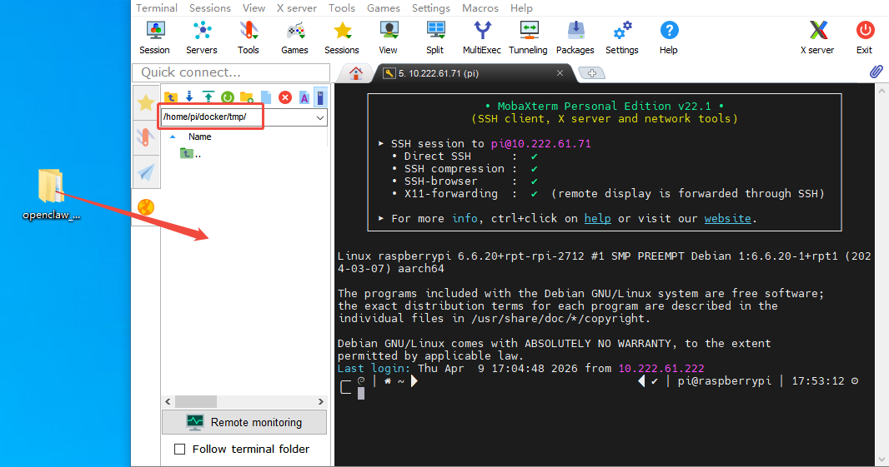

3. Click the command-line terminal icon  on the left side of the system interface to launch the terminal.

4. Enter the command to extract the archive to the corresponding path:

```bash
unzip ~/Desktop/openclaw_resource.zip -d .
```

5. Enter the command to navigate into the folder:

```bash
cd openclaw_resource
```

6. Enter the command to execute the deployment script:

```bash
zsh deploy.sh
```

7. Enter **y** continuously for subsequent prompts to proceed with the configuration.

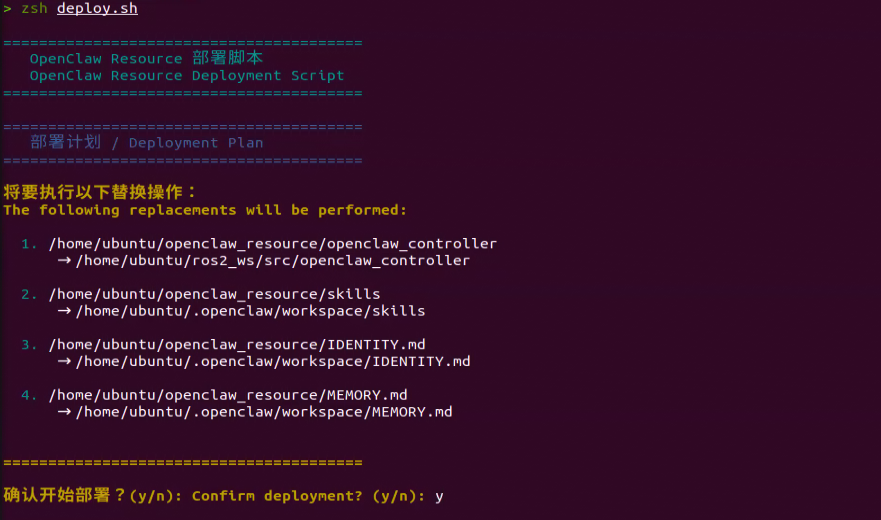

8. After executing the script, previous backups of **IDENTITY.md**, **MEMORY.md**, and **skills** are preserved in the **backup.20260408_111805** folder, which can be viewed with the `ls` command.

9. Enter the command in the terminal to navigate to the workspace and compile the **openclaw_controller** package:

```bash
cd ~/ros2_ws/ && colcon build --event-handlers  console_direct+  --cmake-args  -DCMAKE_BUILD_TYPE=Release --symlink-install --packages-select openclaw_controller
```

10. After compilation completes, enter the command to refresh environment variables:

```bash
source ~/.zshrc
```

<p id="p11-2"></p>

## 11.2 Large Model API Key Acquisition and Configuration

When deploying OpenClaw on the robot, the agent model within the Agent framework must first be configured. This procedure requires obtaining a large language model API key and entering it into the corresponding configuration file.

OpenClaw natively supports multiple large models, including DeepSeek, MiniMax, OpenAI, Qwen, and Google. This guide demonstrates configuration using OpenAI as the primary example. If selecting an alternative model, search online to obtain the corresponding API key and populate it into the configuration file.

### 11.2.1 OpenAI Large Model API Key Acquisition

> [!NOTE]
>
> **This section covers registering on the official OpenAI website and obtaining a large model API key.**

1. Copy the URL: [https://platform.openai.com/docs/overview](https://platform.openai.com/docs/overview), open the OpenAI webpage, and click **Sign up** in the upper-right corner to open the registration page.

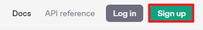

2. Follow the on-screen prompts to register and log in using a Google, Microsoft, or Apple account.


3. Click the settings button, select **Billing**, and click **Payment methods** to link a payment method. Add funds to purchase tokens.


4. After completing the setup, click **API keys**, then click **Create new secret key**. Complete the form according to the prompts and save the generated key securely for subsequent use.

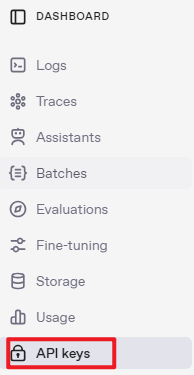


5. This completes the key generation and account setup for the large model. This API key will be utilized in subsequent lessons.

### 11.2.2 API Key Configuration

1. The robot must maintain network connectivity, configured either in STA local area network mode or in AP direct connection mode with an Ethernet cable attached.

2. Connect to the robot using the NoMachine remote desktop tool to access the system interface, then click the terminal icon  on the left taskbar to open a terminal window.


3. Enter the command in the terminal to configure OpenClaw:

```bash
openclaw config
```

4. Select **Local (this machine)** and press **Enter**.


5. Select **Model** to configure the model settings and press **Enter**.

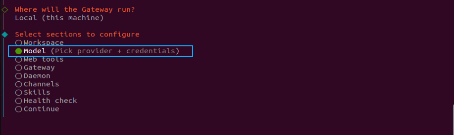

6. Select **OpenAI** and press **Enter**.

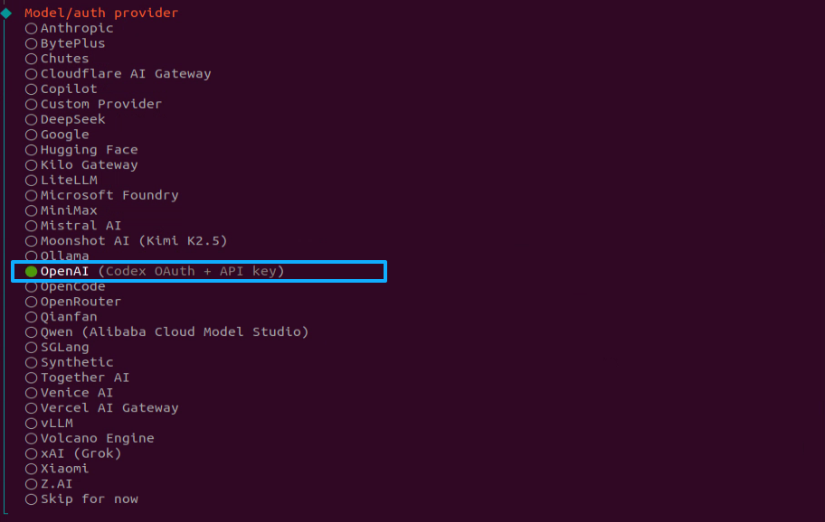

7. Select **OpenAI API key** and press **Enter**.


8. Paste the copied API key here.


9. Select **openai/gpt-5.4** or another appropriate model and press **Enter**.

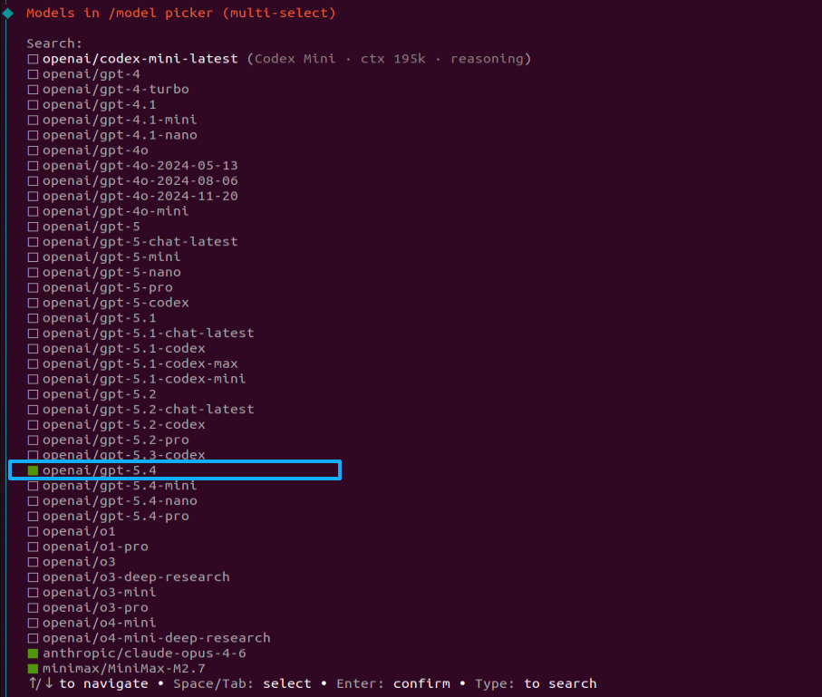

10. The model configuration is now complete.


<p id="p11-3"></p>

## 11.3 Telegram Application Configuration

### 11.3.1 Configuring Telegram

> [!NOTE]
>
> * **Operations can be performed using either the Telegram app or the web version, with the web version demonstrated in this tutorial.**
>
> * **Ensure an active, accessible Telegram account is ready.**

Telegram Web URL: [https://web.telegram.org/k/](https://web.telegram.org/k/)

Step 1: Log in to Telegram using the app QR code scanner or by entering the phone number and SMS verification code.


Step 2: Search for **BotFather** in the top-left search bar of Telegram, then click the officially verified account with the blue checkmark badge to start a chat.

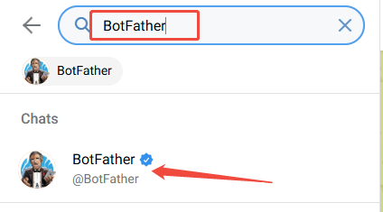

Step 3: Enter and send **/newbot** in the chat window to create a bot and obtain the Token. Note that the bot username must end with **_bot**.

> [!NOTE]
>
> **Once created, a Token will be provided. Store it securely without public exposure, as it is required for subsequent OpenClaw configuration.**


### 11.3.2 Connecting OpenClaw to Telegram Plugin

Once Telegram preparation is complete, return to the system environment to configure OpenClaw.

Step 1: Modify the OpenClaw runtime configuration to enable the Telegram plugin:

```bash
openclaw config set channels.telegram.enabled true
```


Step 2: Write the Telegram bot Token into the OpenClaw configuration:

```powershell
openclaw config set channels.telegram.botToken "BOT_TOKEN"
```


Step 3: Start the OpenClaw gateway service:

```bash
openclaw gateway
```


Step 4: In the BotFather chat window, click the indicated link to open the newly created bot chat, then click **START**.

> [!NOTE]
>
> **The `openclaw gateway` command must be launched in the terminal before clicking 'START` in Telegram. Otherwise, no pairing code will be generated.**


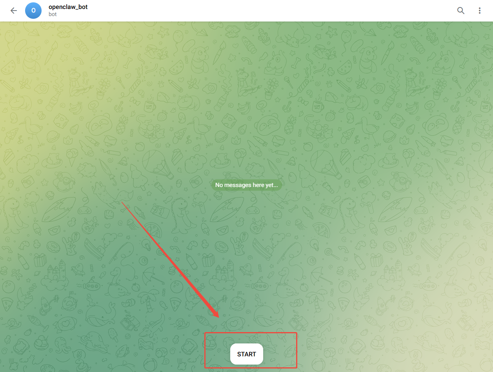

Step 5: During the initial conversation, the Telegram bot sends a pairing code. Execute the command below in the terminal to complete the pairing.


Step 6: Open a new terminal window and execute the following command. Note that `<code>` in the command must be replaced with the **pairing code** received in Telegram, without typing the `<>` characters:

```bash
openclaw pairing approve telegram <code>
```


Step 7: Once the command executes successfully, initiate a conversation with the bot connected to OpenClaw in Telegram. If the Telegram bot responds intelligently, OpenClaw integration with Telegram is confirmed. Send a minimal test message, such as **hello**, to verify.


The integration and deployment of **OpenClaw** with Telegram are now complete.

<p id="p11-4"></p>

## 11.4 OpenClaw Basic Applications

### 11.4.2 OpenClaw Camera Feed Recognition

Once the program starts, entering natural language text prompts OpenClaw to analyze the real-time camera feed and save the captured image locally. Example prompts include **Take a photo**, **Take a look**, or **Describe what is in view**. Through OpenClaw skills, incoming tasks are matched with registered skill descriptions, followed by subscribing to the ROS 2 camera image topic. Upon executing the task, OpenClaw invokes the configured large model via Agent to generate descriptive text and deliver a response.

#### 11.4.2.1 Preparation

* **Preparation**

Refer to the [1. Tutorials / 10. Large AI Model Courses / 10.1.3 API Configuration](https://wiki.hiwonder.com/projects/NexArm/en/ros-version/docs/10.%20Large%20AI%20Model%20Courses.html#_10-1-3-api-configuration) tutorial to configure the API key.

Reference Tutorial: [11.1 Preparation](#p11-1)

* **Configure Large Model API Key**

Reference Tutorial: [11.2 Large Model API Key Acquisition and Configuration](#p11-2)

* **Configure Telegram**

Reference Tutorial: [11.3 Telegram Application Configuration](#p11-3)

#### 11.4.2.2 Feature Steps

> [!NOTE]
>
> * **Command input is strictly case-sensitive and space-sensitive.**
>
> * **The robot must maintain network connectivity, configured either in STA local area network mode or in AP direct connection mode with an Ethernet cable attached.**
>
> * **Before operating the robotic arm, firmly secure the robotic arm base to the tabletop or a stable platform using a G clamp. Operating the arm induces oscillation and inertial forces. Operating without proper clamping can cause the device to tip over, fall, or sustain damage, posing safety hazards.**

1. Click the terminal icon  on the left side of the system interface to open the command line.

2. Enter the command to stop the app auto-start service:

```bash
~/.stop_ros.sh
```

3. Enter the command and press **Enter** to enable robot hardware control, which also initializes the camera feed:

```bash
ros2 launch openclaw_controller openclaw_object_transport.launch.py
```

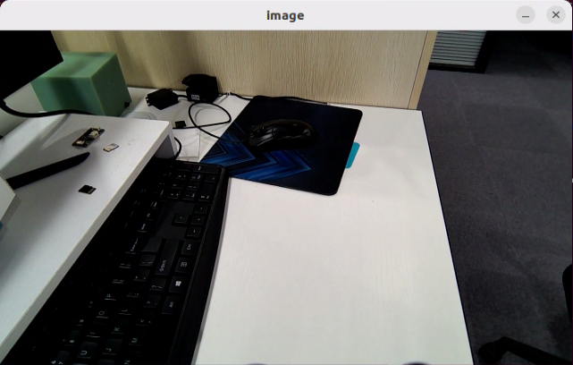

4. Open a new terminal, enter the command, and press **Enter** to launch the OpenClaw service. Skip this step if the service is already running:

```bash
openclaw gateway run
```

5. Open another new terminal, enter the command, and press **Enter** to open the TUI window for dispatching commands:

```bash
openclaw tui
```

6. In the TUI window or the Telegram app chat interface, enter the command: **Take a photo, describe what is visible, summarize it, and report where it is saved**, then press **Enter** to initiate visual recognition.


7. After a brief wait, OpenClaw delivers a text description of the current visual scene, saves the image, and displays the file storage path.

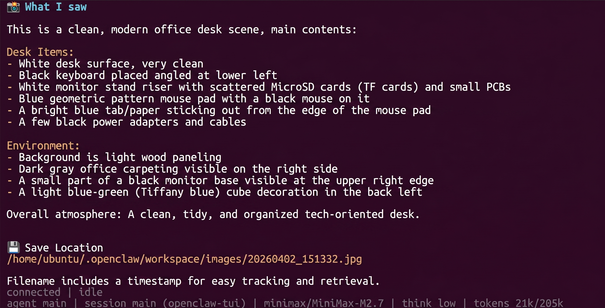

> [!NOTE]
>
> **The response is automatically generated by the large language model. Semantic accuracy is maintained, while the specific phrasing and wording exhibit natural variability.**

8. Once the output illustrated above appears in the TUI window, the current conversational turn is complete. Subsequent control instructions can be entered to initiate the next interaction.

9. To explore other basic applications, continue entering commands as described in the corresponding tutorials. To switch to integrated applications, navigate to the final terminal window opened in Step 5 and press **Ctrl+C** to terminate robot hardware control. If termination does not occur immediately, press the shortcut repeatedly. If the process remains unresponsive, open a new terminal and run the cleanup script to terminate all ROS nodes:

```bash
~/.stop_ros.sh
```

10. To completely shut down the OpenClaw feature, press **Ctrl+C** in each open terminal window.

#### 11.4.2.3 Program Outcome

Once the feature is running, custom text instructions can be sent via the TUI window or the Telegram app chat, prompting OpenClaw to return a detailed textual analysis of the real-time camera scene.

> [!NOTE]
>
> **Actual performance varies depending on the selected large model, including command execution latency, response time, and the alignment between the generated output and the prompt.**

### 11.5.2 OpenClaw + Smart Home Assistant

Once the program starts, custom text commands can be entered to command the robot to perform sorting and handling tasks, such as **Sort the items into the storage boxes of matching colors**. Through OpenClaw skills, incoming tasks are matched with skill descriptions, followed by publishing ROS 2 messages or service requests to command robotic arm gripping. Upon completing the task, OpenClaw invokes the configured large model via Agent to generate descriptive text and return a response.

#### 11.5.2.1 Preparation

* **Preparation**

Refer to the [1. Tutorials / 10. Large AI Model Courses / 10.1.3 API Configuration](https://wiki.hiwonder.com/projects/NexArm/en/ros-version/docs/10.%20Large%20AI%20Model%20Courses.html#_10-1-3-api-configuration) tutorial to configure the API key.

Reference Tutorial: [11.1 Preparation](#p11-1)

* **Configure Large Model API Key**

Reference Tutorial: [11.2 Large Model API Key Acquisition and Configuration](#p11-2)

* **Configure Telegram**

Reference Tutorial: [11.3 Telegram Application Configuration](#p11-3)

<p id="p11-5-2-2"></p>

#### 11.5.2.2 Feature Steps

> [!NOTE]
>
> * **Command input is strictly case-sensitive and space-sensitive.**
>
> * **The robot must maintain network connectivity, configured either in STA local area network mode or in AP direct connection mode with an Ethernet cable attached.**
>
> * **Before operating the robotic arm, firmly secure the robotic arm base to the tabletop or a stable platform using a G clamp. Operating the arm induces oscillation and inertial forces. Operating without proper clamping can cause the device to tip over, fall, or sustain damage, posing safety hazards.**

1. Click the terminal icon  on the left side of the system interface to open the command line.

2. Enter the command to stop the app auto-start service:

```bash
~/.stop_ros.sh
```

3. Enter the command and press **Enter** to start robot hardware control:

```bash
ros2 launch openclaw_controller openclaw_object_transport.launch.py
```

4. Open a new terminal, enter the command, and press **Enter** to start the OpenClaw service. Skip this step if the service is already running:

```bash
openclaw gateway run
```

5. Open another new terminal, enter the command, and press **Enter** to open the TUI window for sending commands:

```bash
openclaw tui
```

6. In the TUI window or the Telegram app chat interface, enter the command: **Sort the items into the storage boxes of matching colors**, then press **Enter** to execute automated handling.

7. After waiting for a moment, the robotic arm grips the blocks and places them into the designated locations, followed by generating a confirmation text response in the TUI window.

> [!NOTE]
>
> **The response is automatically generated by the large language model. Semantic accuracy is maintained, while the specific phrasing and wording exhibit natural variability.**

8. When the output shown above appears in the TUI window, the current conversational turn is complete. Subsequent control instructions can be entered to initiate the next interaction.

9. To explore other basic applications, continue entering commands as described in the corresponding tutorials. To switch to integrated applications, navigate to the final terminal window opened in Step 5 and press **Ctrl+C** to terminate robot hardware control. If termination does not occur immediately, press the shortcut repeatedly. If the process remains unresponsive, open a new terminal and run the cleanup script to terminate all ROS nodes:

```bash
~/.stop_ros.sh
```

10. To completely shut down the OpenClaw feature, press **Ctrl+C** in each open terminal window.

#### 11.5.2.3 Program Outcome

Once the feature is running, custom text instructions can be sent via the TUI window or the Telegram app chat, directing the robot to perform object placement.

