# 12. NexArm + Basic Sorting Sandbox

[TOC]

The **NexArm Basic Sorting Sandbox Kit** is an intelligent robotic arm sorting kit designed for introductory robot vision sorting and fundamental ROS development. It is equipped with the NexArm robotic arm, a 3D depth camera, a metal baseplate for the basic sorting sandbox scene, a scene recognition area panel measuring 176 × 160 mm, a 7-inch touch screen, color blocks, wooden blocks, waste/tag cards, and other modules, with an optional WonderEcho Pro AI voice interaction box. This kit supports various applications, including color threshold adjustment, camera calibration, pixel positioning, depth positioning, color block recognition, robotic arm grasping, and color-based sorting. It serves as an ideal baseline learning environment for robotic arm vision recognition and ROS sorting workflows.

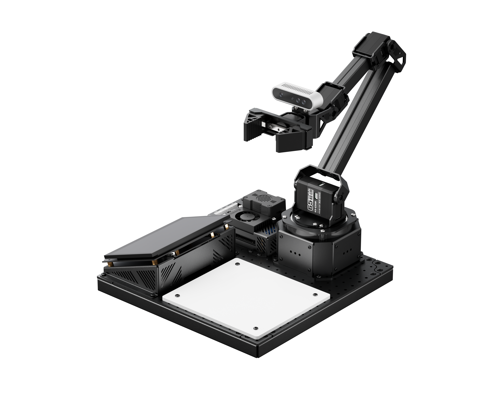

* **Product List**

| No. | Item | Image | Qty. | No. | Item | Image | Qty. |
| :--: | :--: | :--: | :--: | :--: | :--: | :--: | :--: |
| 1 | NexArm robotic arm |  | 1 | 2 | 3D depth camera + mounting bracket |  | 1 |
| 3 | 12 V 5 A power adapter (DC 5.5 × 2.5 mm) |  | 1 | 4 | PS3 wireless controller |  | 1 |
| 5 | Card reader |  | 1 | 6 | Color cubes (30 × 30 mm) |  | 4 |
| 7 | Wooden cubes (40 × 40 mm) |  | 4 | 8 | Waste + tag cards (40 × 40 mm) |  | 1 |
| 9 | Paper map (430 × 380 mm) |  | 1 | 10 | Module cables + servo cables (200 mm) |  | 4 |
| 11 | Type-C data cable (1000 mm) |  | 1 | 12 | Cylindrical block (Φ 30 × 45 mm) + rectangular block (30 × 30 × 60 mm) |  | 1 |
| 13 | Screw accessory pack | 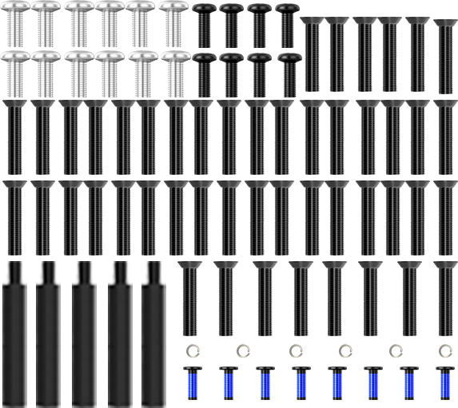 | Several | 14 | G clamp |  | 2 |
| 15 | Metal baseplate for basic sorting sandbox scene | 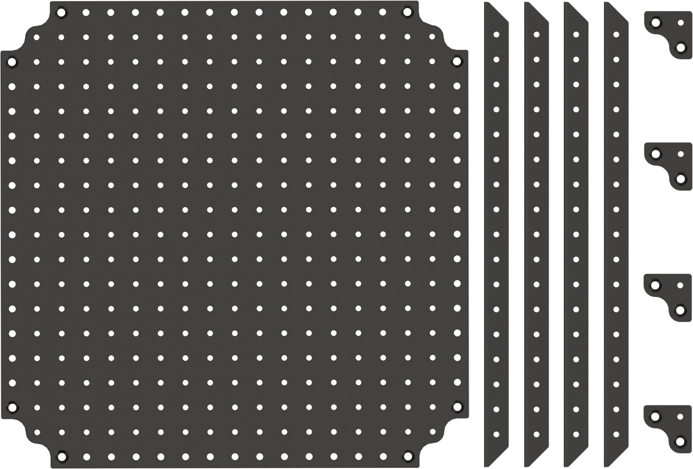 | 1 | 16 | Scene recognition area panel (176 × 160 mm) |  | 1 |
| 17 | 7-inch touch screen + bracket |  | 1 | 18 | HD cable + data cable (350 mm + 400 mm) |  | 1 |
| 19 | WonderEcho Pro AI voice interaction box (optional) |  | 1 |  |  |  |  |

<p id ="anther12.1"></p>

## 12.1 Basic Sorting Sandbox Installation

The following are schematic diagrams illustrating the installation steps for the basic sorting sandbox:

### 12.1.1 Installing the Scene Baseplate Sandbox

1. First, arrange the **4 scene baseplate support frames** into a square. Next, place **4 baseplate L-shaped brackets** at the four corners, and secure them with **eight KM4 × 10 screws**.

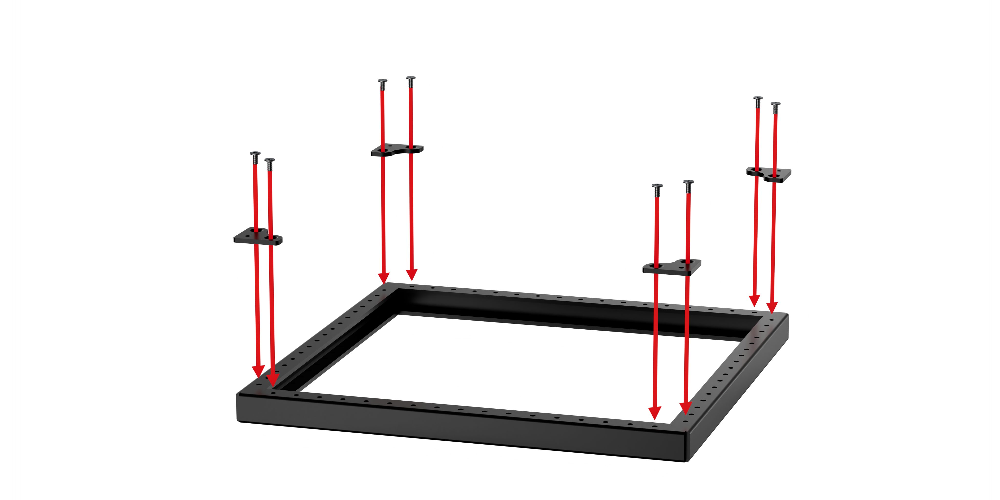

2. Secure the scene baseplate onto the baseplate support frames with **eight KM4 × 10 screws**.

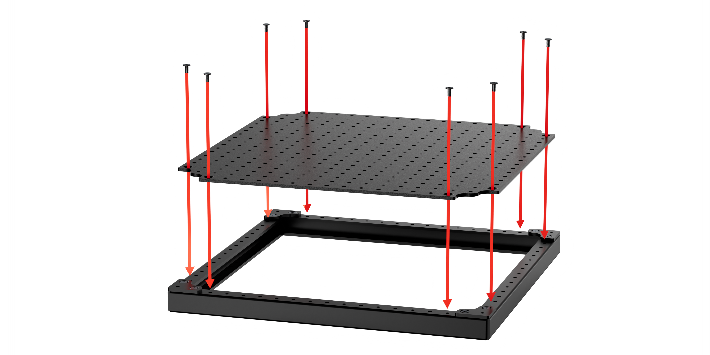

3. The assembled bottom sandbox structure is shown in the figure below:

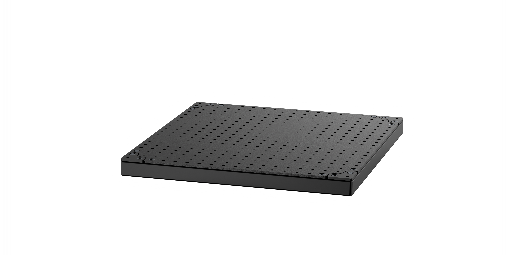

### 12.1.2 Installing the Scene Recognition Area Panel and Controller

1. Secure the scene recognition area panel onto the sandbox with **four KM4 × 10 screws**.

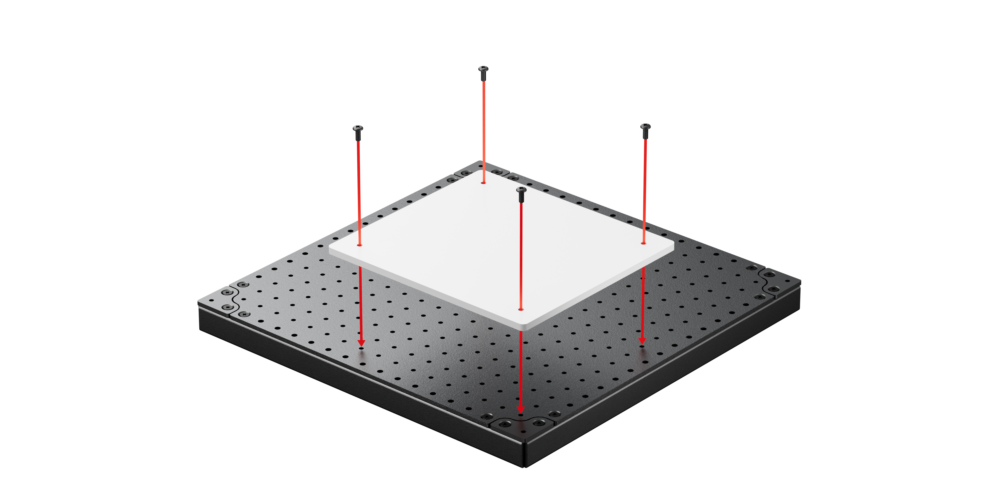

2. Secure the controller onto the sandbox at the indicated position with **eight KM4 × 10 screws**.

> [!NOTE]
>
> **The standard kit of the basic sorting sandbox does not include the AI voice interaction box.**

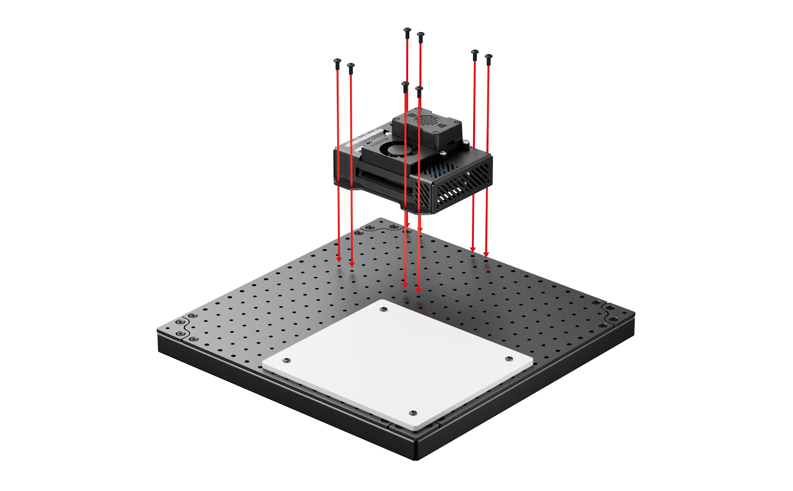

### 12.1.3 Installing the Display Screen and Robotic Arm

1. Install the 7-inch display screen onto the sandbox with **four KM4 × 10 screws**.

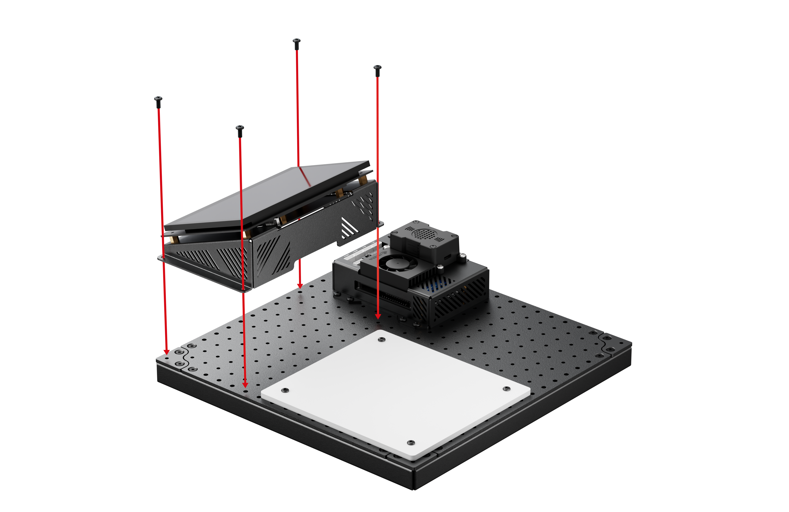

2. Install the robotic arm onto the sandbox with **four KM4 × 10 screws**.

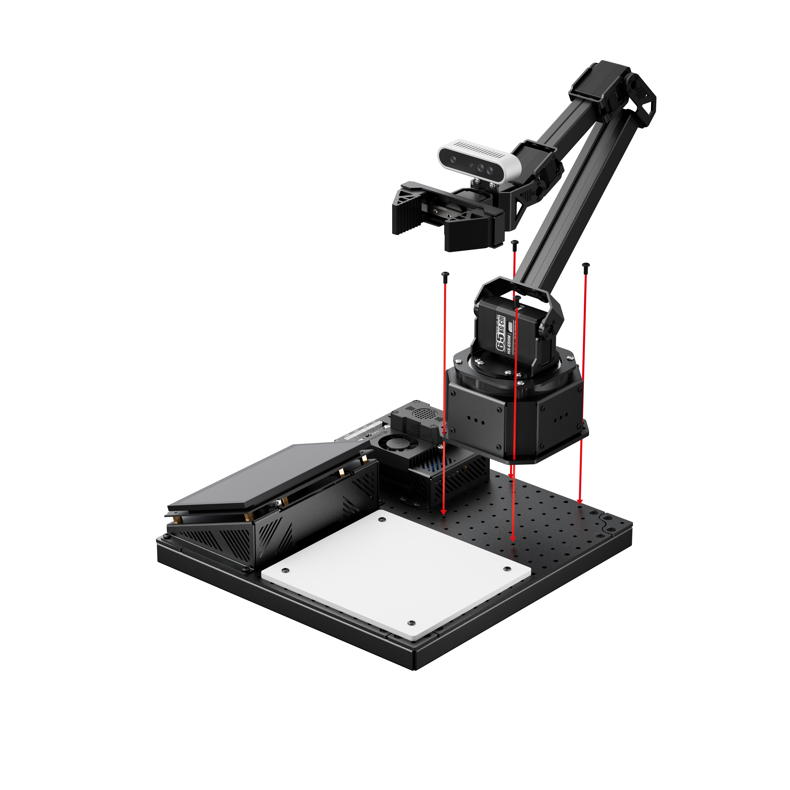

3. The fully assembled device is shown in the figure below:


<p id ="anther12.2"></p>

## 12.2 Wiring Instructions

### 12.2.1 Robotic Arm Wiring Instructions


### 12.2.2 Raspberry Pi 5 Controller

The figure below shows the interface numbering on the Raspberry Pi controller for connecting each module. Connect the cables according to the table below.


Sequence number **1** in the above figure connects to the **power cable**.


| No. | Connected Module |
| :--- | :--- |
| **1** | Depth camera |
| **2** | AI voice interaction box |
| **3** | ESP32 controller |
| **4** | Display screen |

### 12.2.3 Robot Startup Instructions

This section covers the power-on status of the robot and functional verification of each module. After completion, proceed to subsequent chapters to learn app control.

To connect to the robot via remote tools, explore additional robot applications, and inspect programs, refer to [1. Tutorials / 1. NexArm User Manual / 1.5 Development Environment Setup and Configuration](https://wiki.hiwonder.com/projects/NexArm/en/ros-version/docs/1.%20NexArm%20User%20Manual.html#_1-5-development-environment-setup-and-configuration).

> [!NOTE]
>
> **The robotic arm must be secured firmly before starting. Sandbox kits must ensure the base screws are tightened. The robotic arm generates swing and inertia during startup and operation. If unsecured, it may tip over, fall, or sustain damage, and may also pose safety risks.**

1. Connect the 12 V 5 A power adapter to the ESP32 controller. Following this order ensures proper operation of all robotic arm hardware.

   

2. Do not stack robotic arms to prevent locked-rotor states upon power-on, which can damage the servos.

3. Do not operate the robotic arm under heavy loads for extended periods, as this will also shorten servo service life or cause permanent damage.

4. Maintain a safe distance from the robot before starting to prevent injury caused by accidental contact after power-on.

5. Push the power switch to the **ON** position.


Wait approximately 1 minute. The robotic arm returns to its initial posture, and the **buzzer** emits a short beep, indicating that device startup is complete.

> [!NOTE]
>
> **If the buzzer does not emit a short beep, a hardware issue such as a buzzer malfunction may exist. This does not typically occur under normal usage. If this happens, contact customer support for assistance.**

<p id ="anther12.3"></p>

## 12.3 Color Threshold Adjustment

> [!NOTE]
>
> * **The example images in this section illustrate the non-sandbox map. The adjustment steps in the sandbox scene are identical and can be executed following this workflow.**
> * **The robotic arm must be secured firmly before starting. Sandbox kits must ensure the base screws are tightened. The robotic arm generates swing and inertia during startup and operation. If unsecured, it may tip over, fall, or sustain damage, and may also pose safety risks.**

1. Power on the robotic arm and connect it to the remote control software **VNC**. Refer to [1. Tutorials / 1. NexArm User Manual / 1.5 Development Environment Setup and Configuration](https://wiki.hiwonder.com/projects/NexArm/en/ros-version/docs/1.%20NexArm%20User%20Manual.html#_1-5-development-environment-setup-and-configuration).

2. If `~/.stop_ros.sh` was executed after startup to disable auto-start services, restart the app service. Enter the following command in the terminal and press **Enter**:

```bash
ros2 launch bringup bringup.launch.py
```

> [!NOTE]
>
> **If `~/.stop_ros.sh` was not executed after startup, restarting is not required. Proceed directly to subsequent operations.**

3. Enter the system desktop, click the  icon, and then click **Execute** to launch the LAB Tool interface.


* **LAB Tool Interface Description**

The LAB Tool interface is divided into two sections: the image display area and the recognition adjustment area.


> [!NOTE]
>
> **If the returned video feed fails to display, indicating a camera connection failure, check whether the camera connection cable is properly connected or reconnect it.**

1. Image display area: The left side displays the processed camera feed, and the right side displays the raw camera feed.

2. Recognition adjustment area: Used to adjust color thresholds. The function of each button is detailed in the table below:

| Icon | Description |
| :---: | :--- |
|  | Sliders L, A, and B adjust the values of L, A, and B components of the returned image respectively. The left slider represents the **min** value of each component, and the right slider represents the **max** value. |
|  | Select target color for threshold adjustment. |
|  | Delete currently selected color. |
|  | Add recognizable color. |
|  | Save color threshold adjustment results. |
|  | Switch between depth camera and monocular camera. |
|  | Close LAB Tool utility. |

* **Adjusting Color Thresholds**

1. Open the LAB Tool. In the color list of the recognition adjustment area, select the color requiring threshold adjustment, using red as an example here.


2. Set the **min** values of the L, A, and B components to **0**, and set the **max** values to **255**.


3. Place the colored object within the camera field of view. Refer to the LAB color space distribution diagram, and adjust the L, A, and B components toward the target color range.


Red is located near **+a**, so increase the A component by keeping its **max** value unchanged and increasing its **min** value until the colored object area in the left image display turns white while other areas turn black.


4. Adjust the remaining L and B components according to the operating environment. If the red color appears lighter, increase the **min** value of the L component. If it appears darker, decrease the **max** value of the L component. If the red color has a warmer tone, increase the **min** value of the B component. If it has a cooler tone, decrease the **max** value of the B component.


The table below provides parameter reference information for LAB threshold adjustment:

| Color Component | Value Range | Corresponding Color Interval |
| :---: | :---: | :---: |
| L | 0-255 | Black-White (-L to +L) |
| A | 0-255 | Green-Red (-a to +a) |
| B | 0-255 | Blue-Yellow (-b to +b) |

5. Click **Save** in the recognition adjustment area to save the color threshold adjustment parameters.


* **Adding New Recognizable Color**

In addition to the built-in recognizable colors, additional colors can be added. Taking yellow as an example, the specific operating steps are as follows:

1. Open the LAB Tool and click **Add**.


2. Enter the color name in the **name** field and click **OK**.


3. Select the newly added color from the color list.


4. Place the colored object within the camera field of view, and drag the L, A, and B component sliders to adjust thresholds until the colored object area in the left image display turns white while other areas turn black.


5. Click **Save** in the recognition adjustment area to save the color threshold adjustment parameters.


After completing color threshold adjustments, click **Quit** to exit the interface.

<p id ="anther12.4"></p>

## 12.4 Scene Type Selection

NexArm expansion scenes are classified into several types: Scene 0 for the non-sandbox scene, Scene 1 for the basic sorting sandbox scene, Scene 2 for the standard sorting sandbox scene, Scene 3 for the advanced sorting sandbox scene, Scene 4 for the sliding rail warehouse sandbox scene, Scene 5 for the dual-arm conveyor sandbox scene, NexArm_mecanum for the Mecanum-wheel chassis, and NexArm_Track for the tank chassis. After installation, switch the device version according to the installed accessories before normal operation.

> [!NOTE]
>
> **The robot factory default is the non-sandbox scene, which corresponds to Scene 0.**

The detailed steps are as follows:

1. Power on the robotic arm and connect it to the remote control software **VNC**. Refer to [1. Tutorials / 1. NexArm User Manual / 1.5 Development Environment Setup and Configuration](https://wiki.hiwonder.com/projects/NexArm/en/ros-version/docs/1.%20NexArm%20User%20Manual.html#_1-5-development-environment-setup-and-configuration).

2. Double-click to open the model configuration tool  on the desktop.

3. Switch the tab to English, and select the appropriate scene option based on the robotic arm version and accessory type:


Among them, Scene 0 represents the non-sandbox scene, Scene 1 represents the basic sorting sandbox scene, Scene 2 represents the standard sorting sandbox scene, Scene 3 represents the advanced sorting sandbox scene, Scene 4 represents the sliding rail warehouse sandbox scene, and Scene 5 represents the dual-arm conveyor sandbox scene.

4. Select **Scene 1**, representing the basic sorting sandbox scene.

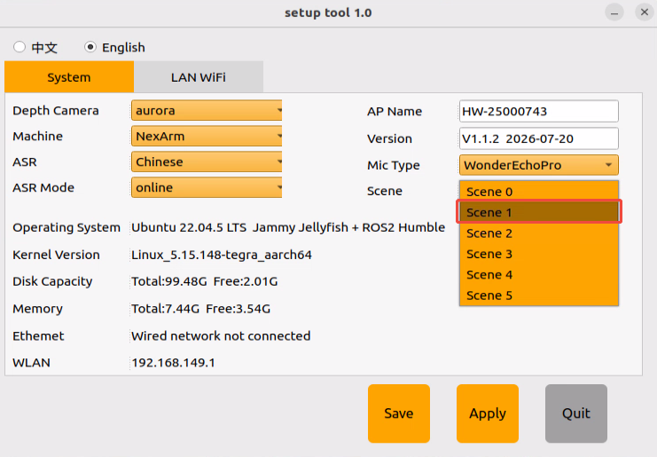

5. After selection, click **Save** to save the configuration.


6. Click **Apply** to reload the configuration.


Wait until the buzzer emits a beep, indicating that the reboot is finished and the configuration has taken effect.

<p id ="anther12.5"></p>

## 12.5 Position Calibration

### 12.5.1 Calibration PC Software Overview

> [!NOTE]
>
> * **The robotic arm has been calibrated before delivery. Due to differences in calibration environments and vibrations during transportation, picking errors may occur during operation, resulting in failures to pick wooden blocks accurately.**
> * **If such issues arise, refer to the following instructions to adjust the picking parameters of the robotic arm.**
> * **Ensure the robotic arm is firmly secured before starting it up. For sandbox kits, tighten the base screws. The robotic arm generates swing and inertia during startup and operation. If not secured, it may tip over, drop, or become damaged, potentially causing safety hazards.**
> * **The following describes the main interface functions of the calibration PC software.**

* **Preparation**

* **Sandbox Scene Assembly**

Refer to tutorial: [12.1 Basic Sorting Sandbox Assembly](#anther12.1).

* **Color Threshold Adjustment**

Refer to tutorial: [12.3 Color Threshold Adjustment](#anther12.3).

* **Select Corresponding Scene Type**

Refer to tutorial: [12.4 Scene Type Selection](#anther12.4).

* **Operation Steps**

1. Power on the robotic arm and connect it to the remote control software **VNC**. Refer to [1. Tutorials / 1. NexArm User Manual / 1.5 Development Environment Setup and Configuration](https://wiki.hiwonder.com/projects/NexArm/en/ros-version/docs/1.%20NexArm%20User%20Manual.html#_1-5-development-environment-setup-and-configuration).

2. Enter the system desktop, and click the  icon to enter the calibration interface.

3. If `~/.stop_ros.sh` was executed after startup to disable auto-start services, restart the app service. Enter the following command in the terminal and press **Enter**:

```bash
ros2 launch bringup bringup.launch.py
```

> [!NOTE]
>
> **If `~/.stop_ros.sh` was not executed after startup, restarting is not required. Proceed directly to subsequent operations.**

4. The calibration PC software includes four functions: camera calibration, pixel positioning, depth positioning, and kinematics calibration. These functions are used to optimize grasping performance in subsequent applications.

* **Function Overview**

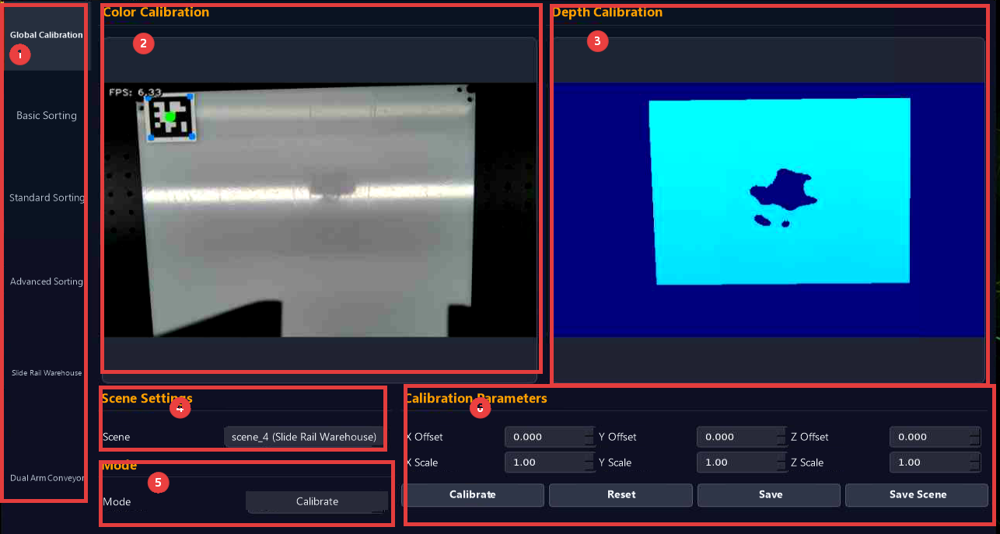

| No. | Area Name | Function and Purpose | Usage Method |
| :---: | :--- | :--- | :--- |
| 1 | Scene navigation bar | Used to switch configuration pages for different sandboxes or application scenes. The currently selected item is **Global Calibration**. | Click the corresponding scene based on the actual sandbox type used, such as basic sorting sandbox, standard sorting sandbox, or advanced sorting sandbox. |
| 2 | Color calibration area | Displays **RGB Camera View**, used to recognize calibration codes and generate sandbox workspace borders. Sandbox contours and corner points are displayed after calibration completes. | Select **Calibrate** in **Mode**, click the **Calibrate** button, and observe this area. If a yellow border and `Calibration finished!` appear, color calibration is complete. |
| 3 | Depth calibration area | Displays **Depth Camera View**, used to verify whether depth data covers the sandbox area and assist in depth positioning calibration. | Observe this area during **Calibration** or **Depth Positioning** to ensure the sandbox area appears complete without noticeable data loss in the depth map. |
| 4 | Scene configuration area | Used to select the current scene to be calibrated. Different scenes load different sandbox dimensions, calibration code positions, and initial robotic arm postures. | Click the **Scene** drop-down menu and select the actual scene currently in use, such as **scene_0 (non-sandbox scene)**. |
| 5 | Function selection area | Used to switch between operating modes, including calibration, pixel positioning, depth positioning, and kinematics calibration. | Click the **Mode** drop-down menu to choose the required function. Select **Calibrate** for global calibration. Select **Pixel Positioning**, **Depth Positioning**, or **Kinematics Calibration** to adjust corresponding compensation parameters. |
| 6 | Calibration parameter and operation area | Used to configure offset and scale parameters along the X, Y, and Z axes, as well as execute calibration, reset, and save operations. | Modify offset or scale values under the corresponding mode. Click **Calibrate** to begin global calibration, click **Reset** to restore default parameters, click **Save** to save calibration parameters, and click **Save Scene** to save current scene configurations. |

### 12.5.2 Camera Calibration

> [!NOTE]
>
> **The calibration option shown in the illustration is scene_3 for the advanced sorting sandbox. The equipment used in this tutorial is scene_1 for the basic sorting sandbox scene. The calibration operating steps are identical and can be executed following this workflow.**

1. In the **Scene** drop-down menu, select **scene_1** for the basic sorting sandbox scene.

2. Select **Calibrate** in **Mode**, and click the **Calibrate** button. A yellow bounding box will appear, indicating completion.


### 12.5.3 Pixel Positioning

> [!NOTE]
>
> **The calibration option shown in the illustration is scene_3 for the advanced sorting sandbox. The equipment used in this tutorial is scene_1 for the basic sorting sandbox scene. The calibration operating steps are identical and can be executed following this workflow.**

1. Select **Pixel Positioning** in **Mode**, and place the color block at the center position.

   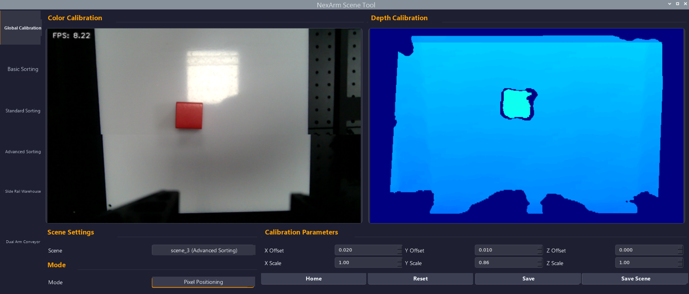

2. Click the color block in the color calibration area with the mouse. The robotic arm automatically samples the color, recognizes the target, and executes only the grasping motion. Adjust the positioning offsets for X, Y, and Z based on the grasping results. Note that **Save** must be clicked after modifying values for changes to take effect.

   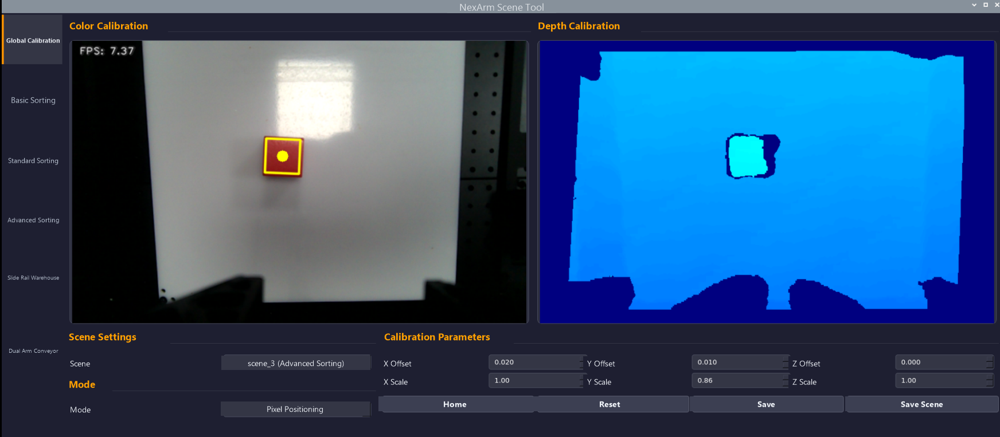

   As shown in the figure above, adjusting the X-axis value moves the robotic arm forward or backward. For example, setting X to a positive value moves the arm forward.
   Adjusting the Y-axis value moves the robotic arm left or right. For example, setting Y to a positive value moves the arm to the left.
   Adjusting the Z-axis value moves the robotic arm up or down. For example, setting Z to a positive value moves the arm upward.

   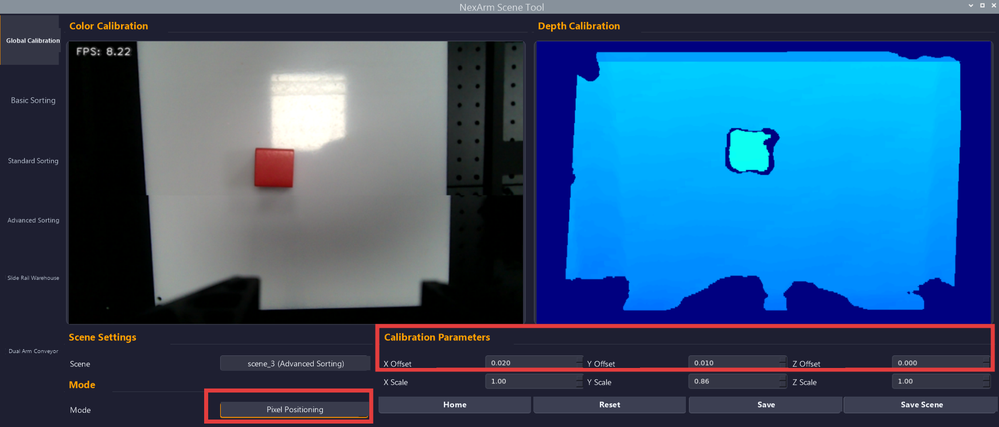

3. After adjusting the parameters, click **Save** first to save and apply the configured data to the robotic arm grasping program. Next, click **Home** to return to the robotic arm recognition and grasping state. Finally, click the color block again with the mouse. The robotic arm automatically samples the color, identifies the position, and performs grasping.

   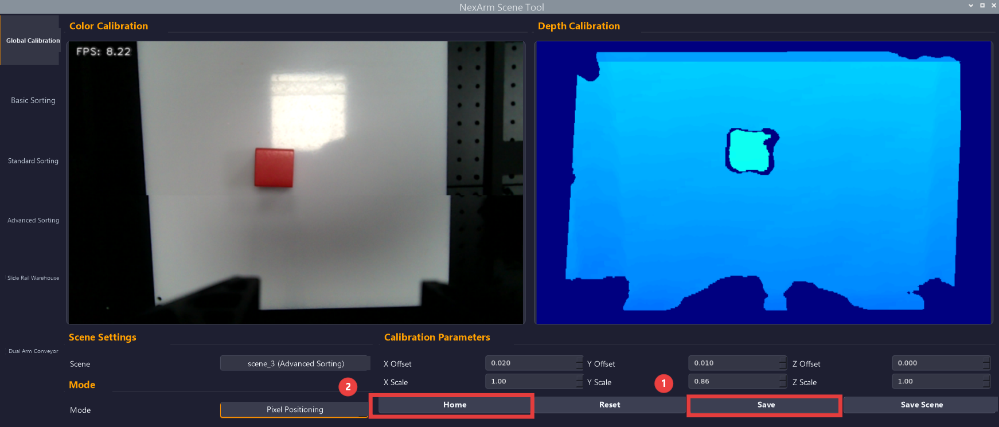

4. Once the color block can be successfully grasped at the center position, place the wooden block within the bounding box on the map. Click the color block with the mouse, and adjust the positioning Y **Scale** according to the grasping performance of the mechanical gripper. This parameter adjusts the gripper opening size along the Y-axis. Once the center block offset is properly calibrated, only the scale needs adjustment. Ensure that all four corners of the bounding box can be grasped normally.

   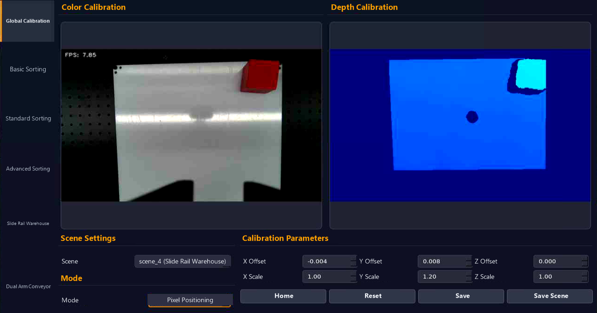

### 12.5.4 Depth Positioning

> [!NOTE]
>
> **The calibration option shown in the illustration is scene_3 for the advanced sorting sandbox. The equipment used in this tutorial is scene_1 for the basic sorting sandbox scene. The calibration operating steps are identical and can be executed following this workflow.**

1. Select **Depth Positioning** in the PC software, and place the color block at the center position.

   

2. Click the color block in the **depth point cloud image** with the mouse. The robotic arm automatically acquires the depth value, recognizes the target, and executes only the grasping motion. Adjust the positioning offsets for X, Y, and Z based on the grasping results. Note that **Save** must be clicked after modifying values for changes to take effect.

   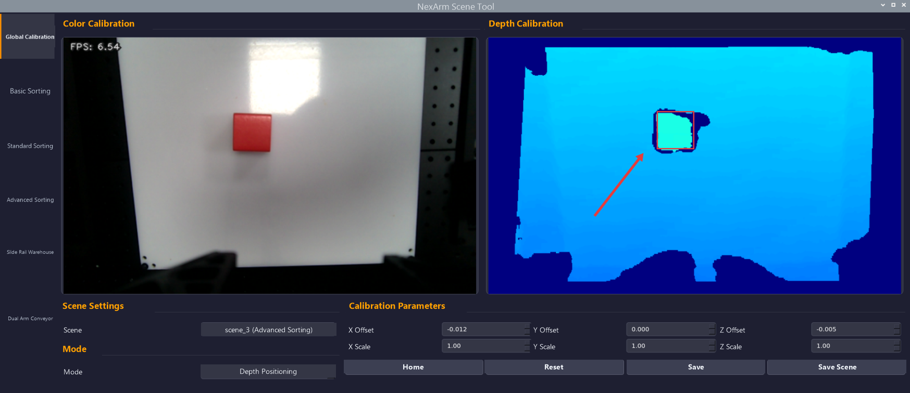

   As shown in the figure below, adjusting the X-axis value moves the robotic arm forward or backward. For example, setting X to a positive value moves the arm forward.
   Adjusting the Y-axis value moves the robotic arm left or right. For example, setting Y to a positive value moves the arm to the left.
   Adjusting the Z-axis value moves the robotic arm up or down. For example, setting Z to a positive value moves the arm upward.

   

3. After adjusting the values, click **Save** first to save and apply the configured data to the robotic arm grasping program. Next, click **Home** to return to the robotic arm recognition and grasping state. Finally, click the color block in the depth point cloud image again with the mouse. The robotic arm automatically acquires depth information, recognizes the color block position, and executes grasping.

   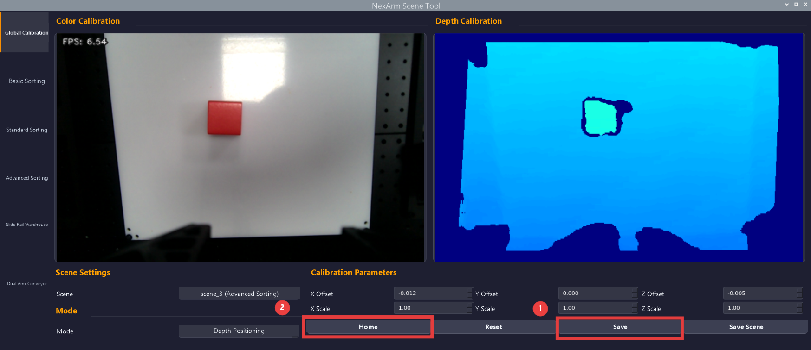

4. Once the color block can be grasped properly at the center position, place the color block at the four corner positions of the depth point cloud image. Click the color block with the mouse and adjust the positioning Y **Scale** based on the grasping performance of the mechanical gripper. This parameter adjusts the gripper opening size along the Y-axis. Once the center color block offset is properly calibrated, only the scale needs adjustment. Ensure that objects at all four corner positions can be grasped properly.

   

## 12.6 Comprehensive Application of Basic Sorting Sandbox

### 12.6.1 Application Overview

This section uses the camera to recognize target-colored blocks via OpenCV algorithms and compute the center position of each block. Subsequently, an inverse kinematics algorithm is invoked to calculate the pulse widths for the robotic arm servos, driving the robotic arm to grasp the target block. Finally, the mechanism moves according to the placement location of the target block and executes the placement action, completing the color block sorting workflow.

### 12.6.2 Preparations

* **Installing Sandbox Scene**

Refer to tutorial: [12.1 Basic Sorting Sandbox Installation](#anther12.1)

* **Adjusting Color Thresholds**

Refer to tutorial: [12.3 Color Threshold Adjustment](#anther12.3)

* **Selecting Corresponding Scene Type**

Refer to tutorial: [12.4 Scene Type Selection](#anther12.4)

* **Grasping Position Calibration**

Refer to tutorial: [12.5 Position Calibration](#anther12.5)

### 12.6.3 Application Steps

> [!NOTE]
>
> * **Command inputs are case-sensitive. Press the Tab key on the keyboard for keyword auto-completion.**
> * **The robotic arm must be secured firmly before starting. Sandbox kits must ensure that the base screws are tightened. The robotic arm generates swing and inertia during startup and operation. If unsecured, it may tip over, fall, or sustain damage, and may also pose safety risks.**

1. Power on the robotic arm and connect it to the remote control software **VNC**. Refer to [1. Tutorials / 1. NexArm User Manual / 1.5 Development Environment Setup and Configuration](https://wiki.hiwonder.com/projects/NexArm/en/ros-version/docs/1.%20NexArm%20User%20Manual.html#_1-5-development-environment-setup-and-configuration).

2. If `~/.stop_ros.sh` was executed after startup to disable auto-start services, restart the app service. Enter the following command in the terminal and press **Enter**:

```bash
ros2 launch bringup bringup.launch.py
```

> [!NOTE]
>
> **If `~/.stop_ros.sh` was not executed after startup, restarting is not required. Proceed directly to subsequent operations.**

3. Enter the system desktop, click , and click **Execute** in the pop-up window.

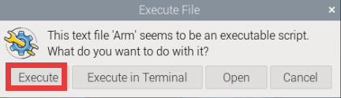

4. Enter the scene tool interface.


5. In the **Scene Navigation Bar** on the left, select **Basic Sorting**.

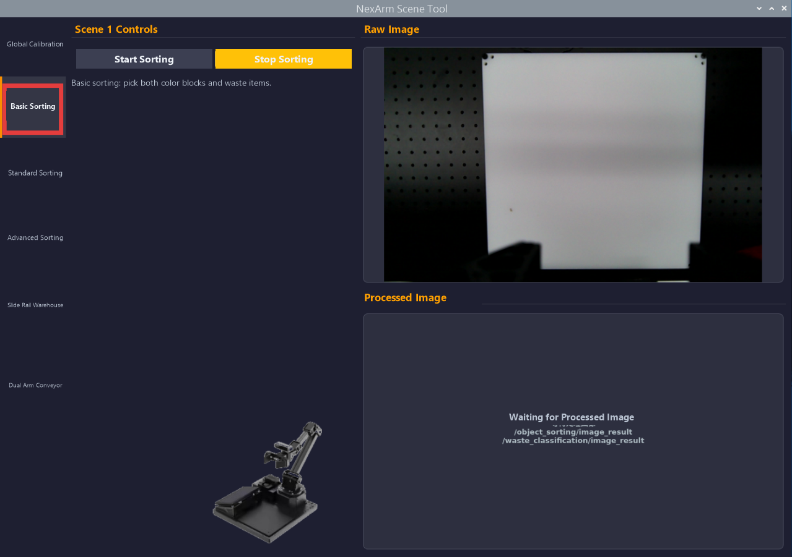

6. Click **Start Sorting**.

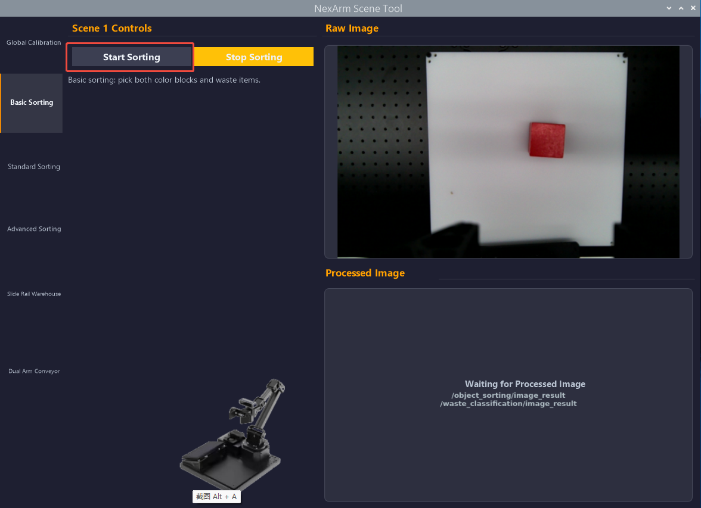

7. The start result will be displayed below.

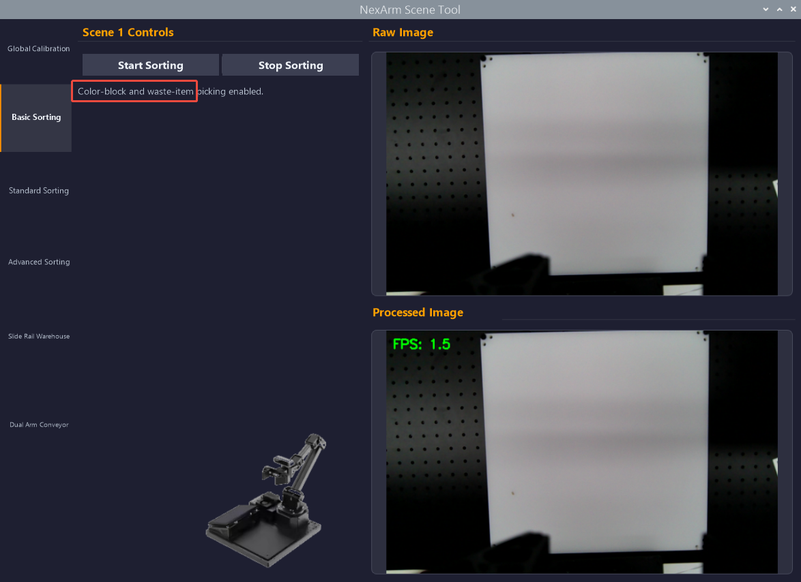

8. The current result image displays the image frame rate and recognition results, and grasps the color block to the corresponding position.

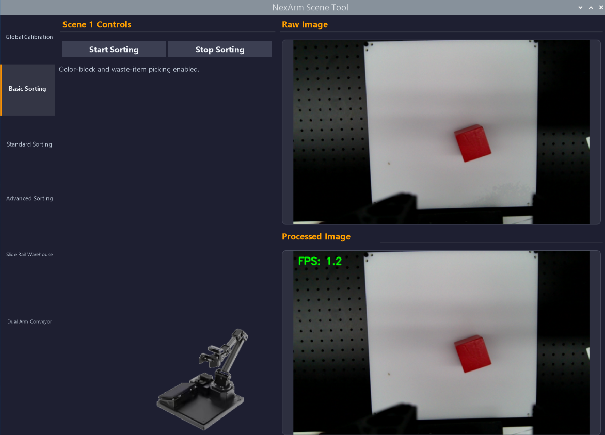

9. To stop this application, click **Stop Sorting** on this interface.

10. To exit the scene application, click the **×** icon in the upper-right corner.

### 12.6.4 Program Outcome

After starting the application, place the target color blocks within the visual recognition area of the robotic arm. The robotic arm will sequentially grasp each color block and place it into the position corresponding to its color.

### 12.6.5 Modifying Placement Points

1. Click the command-line terminal icon  on the left side of the system desktop to open the terminal.

2. Enter the following command to navigate to the target directory:

```bash
cd ~/ros2_ws/src/app/config/plays
```

3. Enter the command to edit the YAML file:

```bash
gedit scene1_calibration.yaml
```

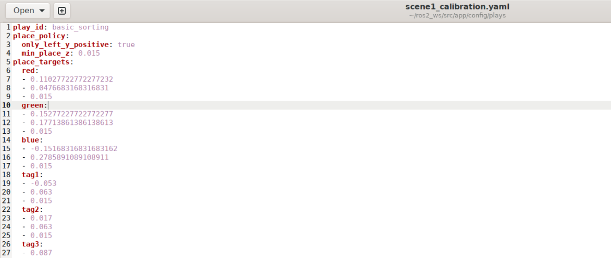

* **Scene 1 Placement Parameter Description**

These represent `place_targets` in the robotic arm program, which correspond to spatial coordinate points for different targets. The three values following each target typically represent:

```yaml
[x, y, z]
```

The unit is **meters**, representing the position coordinates to which the robotic arm end-effector moves.

| Target Name | Description |
| :--- | :--- |
| `red` | Placement position for red color blocks |
| `green` | Placement position for green color blocks |
| `blue` | Placement position for blue color blocks |
| `tag1` | Position corresponding to Tag 1 |
| `tag2` | Position corresponding to Tag 2 |
| `tag3` | Position corresponding to Tag 3 |
| `residual_waste` | Placement position for residual/other waste |
| `food_waste` | Placement position for food/kitchen waste |
| `hazardous_waste` | Placement position for hazardous waste |
| `recyclable_waste` | Placement position for recyclable waste |
| `center` | Scene center point, typically used for positioning, calibration, or as a reference point |
| `left_top` | Reference point at top-left corner of scene |
| `right_top` | Reference point at top-right corner of scene |
| `left_bottom` | Reference point at bottom-left corner of scene |
| `right_bottom` | Reference point at bottom-right corner of scene |
| `tag_stackup` | Placement position for tag stacking, typically used for centralized placement after tag sorting |

For example:

```yaml
red:
- -0.04
- 0.23
- 0.08
```

This indicates that the red block is placed at coordinates `x=-0.04, y=0.23, z=0.08`. The actual orientation, such as whether positive `y` indicates left or right, is defined by the coordinate system in the robotic arm program.

### 12.6.6 Program Analysis

* **Launch File Analysis**

The basic sorting sandbox corresponds to Scene 1, which primarily includes two program entry points: color block sorting and waste classification.

The color block sorting launch file is located at: **~/ros2_ws/src/app/launch/object_sorting.launch.py**

```python
object_sorting_node = Node(
    package='app',
    executable='object_sorting',
    output='screen',
    parameters=[{
        'start': start,
        'display': display,
        'broadcast': broadcast,
        'use_scene_pose': use_scene_pose,
        'play_config_path': play_config_path,
    }]
)
```

This launch file starts the `object_sorting` executable in the **app** package, located at **~/ros2_ws/src/app/app/object_sorting.py**. The program recognizes color blocks, calculates grasp coordinates, and then retrieves placement coordinates according to `place_targets` in the current scene configuration.

The waste classification launch file is located at: **~/ros2_ws/src/app/launch/waste_classification.launch.py**

```python
model_name = LaunchConfiguration('model_name', default='best_garbage_26').perform(context)

if 'garbage' in model_name:
    model_classes_names = garbage_names
    model_detect_method = 'obb'

yolo_node = Node(
    package='example',
    executable='yolo_node',
    parameters=[{
        'classes': model_classes_names,
        'model': model_name,
        'engine': model_name,
        'task': model_detect_method,
    }]
)

waste_classification_node = Node(
    package='app',
    executable='waste_classification',
    parameters=[{
        'start': False,
        'display': False,
        'app': True,
        'use_scene_pose': use_scene_pose,
        'play_config_path': play_config_path,
    }],
)
```

This launch file starts both `yolo_node` and `waste_classification`. The `yolo_node` is responsible for recognizing waste models, while **waste_classification.py** converts the recognition results into waste categories and controls robotic arm grasping and placement. Although `model_name` defaults to `best_garbage_26` in the launch file, Scene 1 specifies the waste classification model parameter as `best_garbage_11` in the scene registry.

* **Scene Configuration Binding**

The configuration binding for Scene 1 is located at: **~/ros2_ws/src/app/app/scene_play_registry.py**

```python
SCENE1_ID: {
    "play_id": "basic_sorting",
    "package": "app",
    "launch": "object_sorting.launch.py",
    "launches": [
        {"package": "app", "launch": "object_sorting.launch.py"},
        {
            "package": "app",
            "launch": "waste_classification.launch.py",
            "arguments": {"model_name": "best_garbage_11"},
        },
    ],
    "play_config_package": "app",
    "play_config": "scene1_calibration.yaml",
},
```

This configuration indicates that when the system is set to `scene_1`, it uses **scene1_calibration.yaml** as the application configuration file. The fields allowed to be merged into the scene configuration for Scene 1 are as follows:

```python
SCENE1_ID: ("place_policy", "place_targets", "place_pitch", "place_roll")
```

Therefore, when modifying placement positions for the basic sorting sandbox, primarily modify `place_targets` in **scene1_calibration.yaml**. To adjust placement posture, add or modify `place_pitch` and `place_roll`.

* **scene1_calibration.yaml File Analysis**

The configuration file is located at: **~/ros2_ws/src/app/config/plays/scene1_calibration.yaml**

```yaml
play_id: calibration
place_policy:
  only_left_y_positive: true
  min_place_z: 0.015
place_targets:
  red:
  - 0.11027722772277232
  - 0.0476683168316831
  - 0.015
  green:
  - 0.15277227722772277
  - 0.17713861386138613
  - 0.015
  blue:
  - -0.15168316831683162
  - 0.2785891089108911
  - 0.015
```

The coordinate format for each target under `place_targets` is `[x, y, z]`, in meters. For example:

```yaml
red:
- 0.11027722772277232
- 0.0476683168316831
- 0.015
```

This indicates that the red color block is placed at `x = 0.1103 m, y = 0.0477 m, z = 0.015 m`, which is approximately `x = 110.3 mm, y = 47.7 mm, z = 15 mm`.

The `place_policy` section restricts placement coordinates:

```python
if bool(policy.get('only_left_y_positive', False)) and pos[1] < 0.0:
    pos[1] = abs(pos[1])

min_place_z = float(policy.get('min_place_z', DEFAULT_PLACE_POLICY['min_place_z']))
if pos[2] < min_place_z:
    pos[2] = min_place_z
```

In the current configuration, `only_left_y_positive: true` specifies that if the `y` coordinate of a placement point is negative, the program automatically converts it to a positive value. Furthermore, `min_place_z: 0.015` specifies that the minimum placement height will not be lower than 0.015 m. Therefore, if the `z` coordinate of a specific target is set lower than 0.015, actual execution is still clamped to 0.015.

Common targets currently used in Scene 1 include:

| Target Name | Description |
| :--- | :--- |
| `red` | Placement position for red color blocks |
| `green` | Placement position for green color blocks |
| `blue` | Placement position for blue color blocks |
| `residual_waste` | Placement position for residual/other waste |
| `food_waste` | Placement position for food/kitchen waste |
| `hazardous_waste` | Placement position for hazardous waste |
| `recyclable_waste` | Placement position for recyclable waste |
| `tag1`, `tag2`, `tag3` | Tag-related reference positions |
| `center`, `left_top`, `right_top`, `left_bottom`, `right_bottom` | Scene reference points |

Note that **object_sorting.py** contains default placement coordinates for `yellow`, but `yellow` is not explicitly defined in the current **scene1_calibration.yaml**. If yellow block placement also requires adjustment in the basic sorting sandbox, add the `yellow` coordinates under `place_targets`.

* **object_sorting.py Execution Workflow**

The Python file is located at: **~/ros2_ws/src/app/app/object_sorting.py**

During color block sorting, the program first recognizes target color blocks, and then executes grasping and placement within the `transport_thread()` thread. The core workflow is as follows:

1. Obtain grasp coordinates, rotation angles, and target colors from visual recognition results.
2. Apply robotic arm calibration corrections to the grasp coordinates using `calibrated_pose.apply_axis_calibration()`.
3. Call `pick_and_place.pick()` to grasp the color block.
4. Call `resolve_place_position()` to retrieve placement coordinates according to the target color.
5. Parse `place_pitch` and `place_roll`, and apply kinematic calibration to correct placement coordinates.
6. Call `pick_and_place.place()` to complete placement.

The key function for acquiring placement coordinates is as follows:

```python
def resolve_place_position(self, target_key):
    scene_name, scene_cfg = self._load_active_scene_config()

    place_targets = scene_cfg.get('place_targets', {}) if isinstance(scene_cfg.get('place_targets'), dict) else {}
    raw = place_targets.get(target_key, self.place_position.get(target_key, DEFAULT_SCENE_PLACE_TARGETS.get(target_key)))
    if raw is None:
        return None

    pos = [float(raw[0]), float(raw[1]), float(raw[2])]

    policy = DEFAULT_PLACE_POLICY.copy()
    if isinstance(scene_cfg.get('place_policy'), dict):
        policy.update(scene_cfg['place_policy'])
    if bool(policy.get('only_left_y_positive', False)) and pos[1] < 0.0:
        pos[1] = abs(pos[1])
    min_place_z = float(policy.get('min_place_z', DEFAULT_PLACE_POLICY['min_place_z']))
    if pos[2] < min_place_z:
        pos[2] = min_place_z

    return scene_play_registry.apply_global_place_offset(pos, self.scene_config_path)
```

In Scene 1, actual placement coordinates for red, green, and blue color blocks are preferentially retrieved from `place_targets` in **scene1_calibration.yaml**. If the target is not defined in the YAML file, default coordinates configured in the program are used.

The code related to placement actions is as follows:

```python
position = self.resolve_place_position(target[0])
cfg_roll = self.resolve_place_roll(target[0])
yaw = float(cfg_roll) if cfg_roll is not None else self.calculate_place_grasp_yaw(position, 0)
place_pitch = self.resolve_place_pitch(target[0], 80.0)

finish = pick_and_place.place(position, place_pitch, yaw, 200, self.arm_pub, **place_kwargs)
```

Therefore, if color block placement is inaccurate, modify `place_targets.red`, `place_targets.green`, and `place_targets.blue` first. If the placement angle is inappropriate, add or modify `place_pitch` and `place_roll`.

* **waste_classification.py Execution Workflow**

The Python file is located at: **~/ros2_ws/src/app/app/waste_classification.py**

The waste classification program maps specific item names recognized by YOLO to waste categories:

```python
WASTE_CLASSES = {
    'food_waste': ('BananaPeel', 'BrokenBones', 'Ketchup'),
    'hazardous_waste': ('Marker', 'OralLiquidBottle', 'StorageBattery'),
    'recyclable_waste': ('PlasticBottle', 'Toothbrush', 'Umbrella'),
    'residual_waste': ('Plate', 'CigaretteEnd', 'DisposableChopsticks'),
}
```

For example, when `PlasticBottle` is recognized, it is classified as `recyclable_waste`, and placement coordinates are then retrieved from `place_targets.recyclable_waste` in **scene1_calibration.yaml**.

The placement coordinate parsing function for waste classification is similar to that of color block sorting:

```python
def resolve_place_position(self, target_key):
    scene_name, scene_cfg = self._load_active_scene_config()

    place_targets = scene_cfg.get('place_targets', {}) if isinstance(scene_cfg.get('place_targets'), dict) else {}
    raw = place_targets.get(target_key, self.place_position.get(target_key))
    if raw is None:
        return None

    pos = [float(raw[0]), float(raw[1]), float(raw[2])]
    return scene_play_registry.apply_global_place_offset(pos, self.scene_config_path)
```

Scene 1 also includes two dedicated action functions for waste classification. During grasping, `scene1_pick_hold_yaw()` is invoked to maintain the current gripper angle after grasping:

```python
if scene_name == scene_play_registry.SCENE1_ID:
    finish = self.scene1_pick_hold_yaw(position, yaw, target)
else:
    finish = pick_and_place.pick(position, 90, yaw, 470, 0.02, self.arm_pub, None,
                                 claw_grab_angle=-45.0)
```

During placement, `scene1_direct_place()` is invoked:

```python
if scene_name == scene_play_registry.SCENE1_ID:
    finish = self.scene1_direct_place(place_pos, place_pitch, yaw, target)
else:
    finish = pick_and_place.place(place_pos, place_pitch, yaw, 200, self.arm_pub, None,
                                  claw_hold_angle=-45.0)
```

`scene1_direct_place()` converts coordinates in meters from the YAML file into millimeters before publishing the robotic arm posture:

```python
x_mm = float(position[0]) * 1000.0
y_mm = float(position[1]) * 1000.0
z_mm = float(position[2]) * 1000.0
pitch_deg = -abs(float(pitch))
roll_deg = float(roll)

self.publish_arm(x_mm, y_mm, z_mm, pitch_deg, roll_deg, claw_hold, 800)
self.publish_arm(x_mm, y_mm, z_mm, pitch_deg, roll_deg, pick_and_place.CLAW_OPEN, 300)
self.publish_arm(x_mm, y_mm, z_mm + 30.0, pitch_deg, roll_deg, pick_and_place.CLAW_OPEN, 500)
```

Therefore, when waste classification placement is inaccurate, modify the `[x, y, z]` coordinates corresponding to `residual_waste`, `food_waste`, `hazardous_waste`, and `recyclable_waste` in **scene1_calibration.yaml**.

* **Placement Parameter Modification Recommendations**

| Symptom to Adjust | Preferred Configuration to Modify |
| :--- | :--- |
| Inaccurate placement for red, green, or blue color blocks | `place_targets.red`, `place_targets.green`, `place_targets.blue` in **scene1_calibration.yaml** |
| Inaccurate placement for yellow color blocks | Add or modify `yellow` under `place_targets` |
| Inaccurate placement for specific waste categories | `place_targets.residual_waste`, `place_targets.food_waste`, `place_targets.hazardous_waste`, `place_targets.recyclable_waste` |
| Placement position along left-right axis not as expected | Check `place_policy.only_left_y_positive`. When set to `true`, negative `y` automatically converts to positive `y` |
| Placement height too high or too low | Modify the third coordinate value `z` for the target, noting the minimum height limit enforced by `min_place_z` |
| Gripper angle unsuitable during placement | Add or modify `place_pitch` and `place_roll` |
| Global offset across all targets | Check camera/robotic arm calibration first, along with `kinematics.offset` and `kinematics.scale` |

In summary, the core configuration for the Scene 1 basic sorting sandbox resides in `place_targets` within **scene1_calibration.yaml**. The program automatically selects corresponding coordinates based on the currently recognized target name to execute placement.
