# 17. NexArm + Tank Chassis Course

## 17.1 Preparation

### 17.1.1 Chassis Installation

For detailed mechanical installation of the robotic arm and chassis, refer to [17. NexArm + Tank Chassis Course/NexArm Suspension Tank Chassis Installation Tutorial](https://drive.google.com/drive/folders/1fiCKJI5ivUjjDYEYJqkWwr8Wl74ThTUg?usp=sharing).

### 17.1.2 Wiring Instructions

For detailed wiring instructions and hardware connections of the robotic arm and chassis, refer to [17. NexArm + Tank Chassis Course/NexArm Tank Chassis Wiring Tutorial](https://drive.google.com/drive/folders/1fiCKJI5ivUjjDYEYJqkWwr8Wl74ThTUg?usp=sharing).

## 17.2 Machine Type Selection

The NexArm chassis expansion accessories are categorized into two types: a Mecanum-wheel chassis and a tank chassis. After installation, the equipment version must be switched according to the corresponding accessory before normal operation.

> [!NOTE]
>
> **Failure to switch or selecting an incorrect version may cause motors to operate unpredictably, resulting in application failures or equipment damage.**

The detailed procedure is as follows:

1. Power on the robotic arm and connect it to the remote desktop software **VNC**. For details on remote desktop tool installation and connection, refer to [1. Tutorials/1. NexArm User Manual/1.5 Development Environment Setup and Configuration](https://wiki.hiwonder.com/projects/NexArm/en/ros-version/docs/1.%20NexArm%20User%20Manual.html#_1-5-development-environment-setup-and-configuration).

2. Double-click the model configuration tool icon 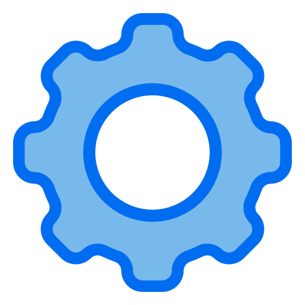 on the desktop to open the utility.

3. Select the appropriate options according to the robotic arm version, camera version, and accessory type:

   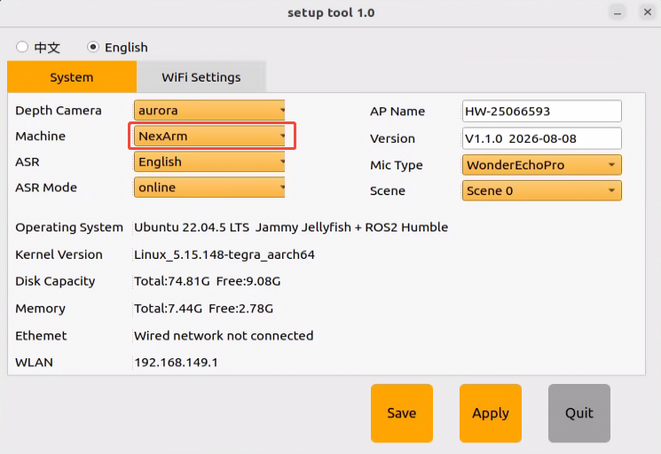

   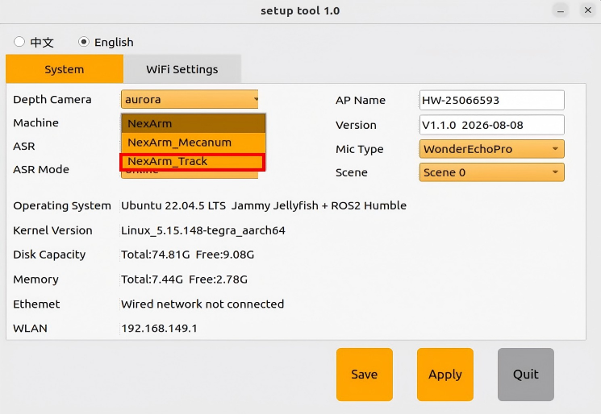

   Among the options, **NexArm_Mecanum** represents the Mecanum-wheel chassis, and **NexArm_Track** represents the tank chassis.

4. After selection, click **Save** to save the configuration.

   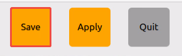

5. Click **Apply** to reload the configuration.

   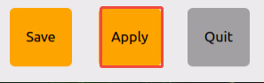

   Wait for the buzzer to emit a single beep, indicating that the reboot is complete and the configuration has taken effect.

## 17.3 App Control

### 17.3.1 App Installation

Scan the QR code below to download the app.

> [!NOTE]
>
> * **Grant all requested permissions to the app to ensure proper functionality.**
>
> * **Enable GPS positioning and Wi-Fi on the phone before opening the app.**


### 17.3.2 Connection Mode Introduction

The robot supports two network modes:

* **AP Direct Connection Mode**: The development board enables a Wi-Fi hotspot for direct phone connection, but does not route to external networks.

* **STA LAN Mode**: The development board actively connects to a specified Wi-Fi hotspot or router, enabling access to external networks.

The robot defaults to AP direct connection mode upon booting. Application functions remain consistent regardless of whether AP direct connection mode or STA LAN mode is selected.

> [!NOTE]
>
> **It is recommended to first master the configuration method for direct connection mode to test corresponding features. LAN mode can be reviewed as needed.**

* **Direct Connection Mode - Required**

**Requires iOS 11.0 or later and Android 5.0 or later.**

Special attention is required for Android devices. Be sure to grant all permissions to the app in the phone settings to prevent functionality issues.

Connecting NexArm to an Android device is used as an example here. This procedure applies equally to iOS devices.

1. Open the **WonderROS** app and tap **NexArm**.


2. Tap the **+** button at the bottom right of the interface and select **Direct Connection Mode**.


3. Tap **Go to connect device hotspots** to enter system settings and connect to the hotspot generated by the robot.


4. The hotspot name starts with **HW**, and the hotspot password is **hiwonder**.


> [!NOTE]
>
> **On iOS devices, wait for the phone status bar to display the Wi-Fi icon**  **before returning to the app, otherwise the device might not be discovered. If the device cannot be found, tap the refresh icon**  **at the top right of the app interface.**

5. Return to the app and tap the corresponding robot icon to enter the mode selection interface.


> [!NOTE]
>
> **If a prompt dialog box stating "Network unavailable, continue connecting?" appears, simply tap the button to stay connected.**

6. After tapping the robot icon, the mode selection interface appears as shown below:


* **LAN Mode - Optional**

1. Connect the phone to a 5 GHz Wi-Fi network. Connecting to the "RobotTest" Wi-Fi network is used as an example here. For dual-band routers configured with separated bands, Wi-Fi names are distinguished by default, where "Hiwonder" represents 2.4 GHz and "5G" represents 5 GHz.

   

2. Open the **WonderROS** app and tap **NexArm**.

   

3. Tap the **+** button at the lower right corner and select **LAN Mode**.

   

4. Enter the password for the connected Wi-Fi network upon prompt. Verify that the password is entered correctly, as an incorrect entry causes connection failure. After entering the password, tap **OK**.

   

5. Tap **Go to connect device hotspots**.

   

6. The phone automatically switches to the Wi-Fi settings page. Locate the hotspot beginning with **HW**, enter the password **hiwonder**, and tap the back button upon completion.

   

7. The app starts establishing the connection.

   

> [!NOTE]
>
> **After enabling LAN mode, the robot ceases to generate Wi-Fi signals starting with HW. Maintain the phone connection on the identical Wi-Fi network to discover and display the robot icon and name in the app.**

8. After a short wait, the main interface displays the corresponding robot icon and name.

   

9. Press and hold the robot icon in the app to inspect the assigned IP address and device ID.

   

10. This IP address can be utilized in remote desktop tools to establish a connection. For specific instructions, refer to [1. Tutorials/1. NexArm User Manual/1.5 Development Environment Setup and Configuration](https://wiki.hiwonder.com/projects/NexArm/en/ros-version/docs/1.%20NexArm%20User%20Manual.html#_1-5-development-environment-setup-and-configuration).

11. To switch from LAN mode back to direct connection mode, press and hold the **KEY1** button on the expansion board until the blue LED flashes, indicating completion.

### 17.3.3 App Remote Control

Tap **Robot Control** to enter the control interface.

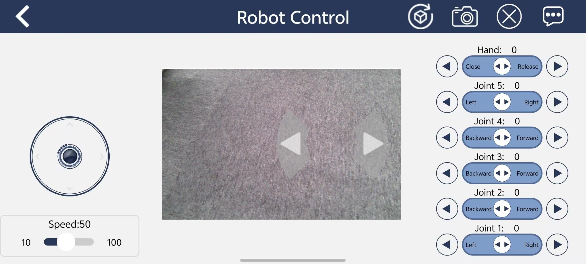

| Feature | Icon | Function Description |
| :--- | :---: | :--- |
| Video feedback screen | 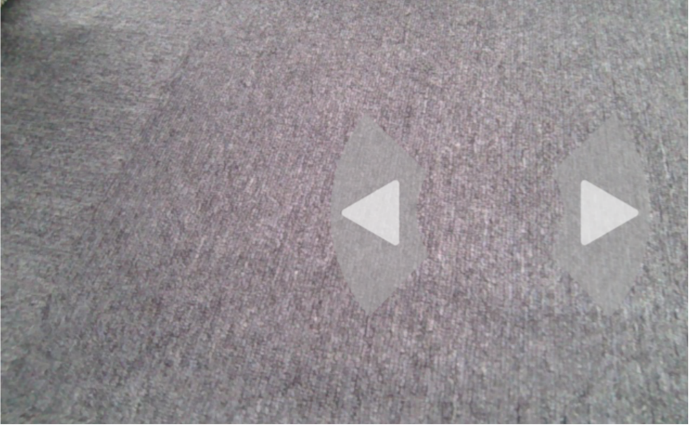 | Controls pan-tilt rotation to the right, gripper rotation to the right, pan-tilt rotation to the left, and gripper rotation to the left. |
| Chassis control | 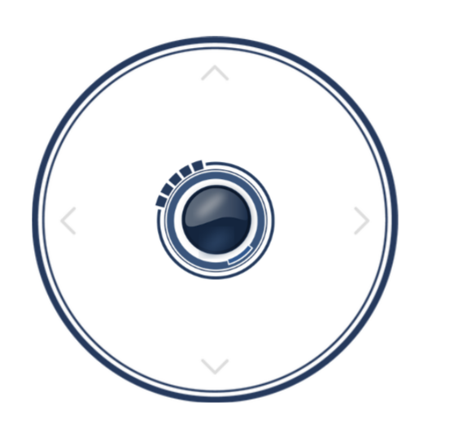 | Controls chassis forward, backward, left translation, and right translation movement. |
| Speed adjustment slider | 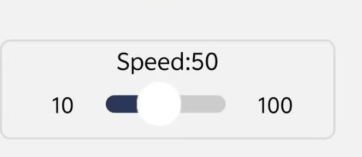 | Adjusts chassis travel speed. |
| Steering control | 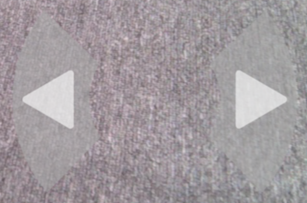 | Controls chassis turning left and right. |
| Reset button |  | Controls the robotic arm to return to the initial posture. |
| Robotic arm control | 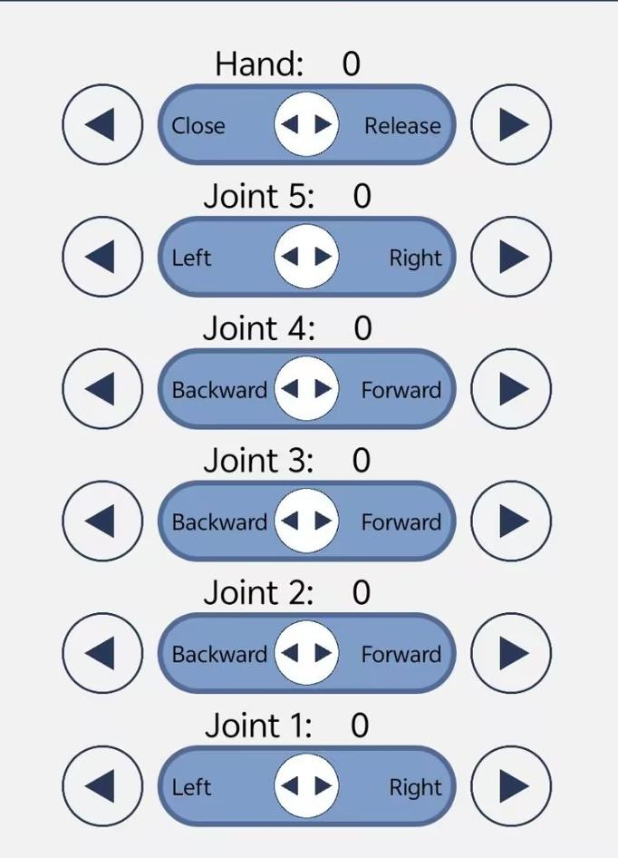 | Individually controls rotation of each corresponding servo on the robotic arm. |

## 17.4 Wireless Controller Remote Control

### 17.4.1 PS3 Wireless Controller Introduction

This project includes a **PS3 protocol-compatible wireless controller**. Held with both hands, it features a D-pad on the left, four face buttons, **△**, **○**, **×**, and **□**, on the right, **Select** and **Start** buttons in the center, and a **PS** button on the front face. It includes shoulder buttons, **L1**/**L2** and **R1**/**R2**, on both sides, along with two pressable analog joysticks, **L3**/**R3**. The controller communicates with the mainboard via Bluetooth, featuring a built-in battery, USB charging port, and player LED indicators. It is utilized to adjust robotic arm poses and individual servos in coordinate or single-servo modes, and to control chassis forward motion, lateral translation, and rotation.

### 17.4.2 Device Connection


### 17.4.3 Controller Connection Procedure

1. Check the Bluetooth pairing MAC address on the back of the controller.


2. Connect NexArm to the PC software. For detailed connection and operation of the PC software, refer to [1. Tutorials/1. NexArm User Manual/1.7 PC Software Control](https://wiki.hiwonder.com/projects/NexArm/en/ros-version/docs/1.%20NexArm%20User%20Manual.html#_1-7-pc-software-control). Click **Peripheral & Chassis**, and enter the Bluetooth MAC address of the controller into **PS3 MAC**.


3. The display screen shows the posture information of NexArm.


4. Press the **key2** button. The display screen prompts **Switch to BLE Press again to confirm switch**.


5. Press the **key2** button again to initiate switching. Once switched successfully, the screen reboots into app Bluetooth control mode, allowing control through the phone app.


6. Press the **key2** button again. The display screen prompts **Switch to PS3 Press again to confirm switch**.


7. Press the **key2** button once more to confirm. After switching successfully, the screen reboots. Maintain NexArm in this state.


8. Press and hold the **PS** button on the controller until the four LED indicators start flashing.


9. After flashing for 2 to 4 s, LED indicators 2, 3, and 4 stop flashing, and LED indicator 1 remains steadily lit. This indicates that the controller is connected successfully. Operate NexArm according to the key mappings in the next section.


### 17.4.4 Wireless Controller Key Descriptions

* **Single Servo Mode Key Descriptions**

The table below lists the key functions in single servo mode:

| Key | Function with Robotic Arm in First-Person View |
| :---: | :--- |
| START | Resets the robotic arm. |
| SELECT + START | Switches control mode between single servo and coordinate modes. |
| UP / ↑ | Raises servo 5. |
| DOWN / ↓ | Lowers servo 5. |
| LEFT / ← | Rotates servo 6 to the left. |
| RIGHT / → | Rotates servo 6 to the right. |
| Y | Lowers servo 4. |
| A | Raises servo 4. |
| B | Rotates servo 2 to the right, turning the gripper right. |
| X | Rotates servo 2 to the left, turning the gripper left. |
| L1 | Opens the gripper with servo 1. |
| L2 | Closes the gripper with servo 1. |
| R1 | Raises servo 3. |
| R2 | Lowers servo 3. |

* **Coordinate Mode Key Descriptions**

The table below lists the key functions in coordinate mode:

| Key | Function with Robotic Arm in First-Person View |
| :---: | :--- |
| START | Resets the robotic arm. |
| SELECT + START | Switches control mode between single servo and coordinate modes. |
| UP / ↑ | Moves the robotic arm along positive X-axis toward the front. |
| DOWN / ↓ | Moves the robotic arm along negative X-axis toward the rear. |
| LEFT / ← | Moves the robotic arm along positive Y-axis toward the left. |
| RIGHT / → | Moves the robotic arm along negative Y-axis toward the right. |
| Y | Closes the gripper with servo 1. |
| A | Opens the gripper with servo 1. |
| B | Rotates servo 5 to the right, turning the gripper right. |
| X | Rotates servo 5 to the left, turning the gripper left. |
| L1 | Moves the robotic arm along positive Z-axis upward. |
| L2 | Moves the robotic arm along negative Z-axis downward. |
| R1 | Increases the yaw angle relative to the horizontal baseline. |
| R2 | Decreases the yaw angle relative to the horizontal baseline. |

<p id="p17-5"></p>

## 17.5 Target Tracking

When the camera recognizes the target color block, the chassis of the robotic arm moves to track the position of the color block.

### 17.5.1 Implementation Workflow

First, subscribe to the topic messages published by the color recognition node to obtain recognized color information.

Next, select the target color. After matching the target color, obtain the center coordinates of the target in the image.

Finally, determine the object distance based on the relative position of the center coordinates in the camera frame, and publish motion control topic messages to drive chassis movement.

### 17.5.2 Application Operating Steps

1. Power on the robotic arm and connect it to the remote desktop software **VNC**. For details on remote desktop tool installation and connection, refer to [1. Tutorials/1. NexArm User Manual/1.5 Development Environment Setup and Configuration](https://wiki.hiwonder.com/projects/NexArm/en/ros-version/docs/1.%20NexArm%20User%20Manual.html#_1-5-development-environment-setup-and-configuration).

2. Click the icon  to open the command-line terminal.

3. Enter the command and press **Enter** to disable the auto-start service:

   ```bash
   ~/.stop_ros.sh
   ```

4. Enter the command to start the application program:

   ```bash
   ros2 launch example object_tracking_node.launch.py
   ```

5. Once the application starts, the terminal prints the prompt information shown below, and the camera video feedback window pops up automatically:

   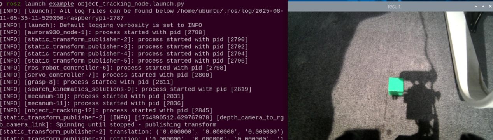

6. Click the target object to track in the video feed using the mouse. The program automatically detects the color threshold and configures it as the target object:

   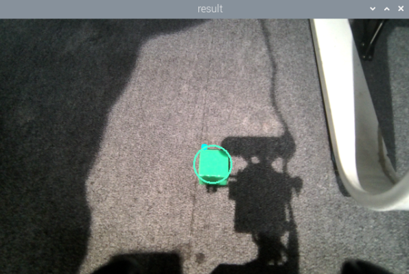

7. After selection, open a new terminal , and enter the following command to start tracking:

   ```bash
   ros2 service call /object_tracking/set_running std_srvs/srv/SetBool "{data: true}"
   ```

8. Enter the following command in the terminal to stop tracking:

   ```bash
   ros2 service call /object_tracking/set_running std_srvs/srv/SetBool "{data: false}"
   ```

9. To terminate this application, press **Ctrl+C** in the terminal. If termination fails, repeat the keystroke.

10. To restore app services for subsequent app features, enter the following command, press **Enter**, and wait for the robotic arm to return to its initial posture and the buzzer to emit a beep:

    ```bash
    ros2 launch bringup bringup.launch.py
    ```

### 17.5.3 Program Outcome

After starting the application, place a red block within the field of view of the robotic arm camera. The video feedback window identifies the detected target color, and the robotic arm chassis continuously tracks and follows the target block.

### 17.5.4 Program Analysis

* **Launch File Analysis**

The launch file is located at:

**/home/ubuntu/ros2_ws/src/example/example/chassis/object_tracking_node.launch.py**

(1) `launch_setup` Function

```python
def launch_setup(context):
    compiled = os.environ.get('need_compile', 'False')
    if compiled == 'True':
        sdk_package_path = get_package_share_directory('sdk')
        chassis_package_path = get_package_share_directory('controller')
        peripherals_package_path = get_package_share_directory('peripherals')
    else:
        sdk_package_path = '/home/ubuntu/ros2_ws/src/driver/sdk'
        chassis_package_path = '/home/ubuntu/ros2_ws/src/driver/controller'
        peripherals_package_path = '/home/ubuntu/ros2_ws/src/peripherals'


    object_tracking_node = GroupAction([
        IncludeLaunchDescription(
            PythonLaunchDescriptionSource(
                os.path.join(peripherals_package_path, 'launch/depth_camera.launch.py')),
            ),

        IncludeLaunchDescription(
            PythonLaunchDescriptionSource(
                os.path.join(sdk_package_path, 'launch/nexarm.launch.py')),
            ),

        Node(
            package='example',
            executable='object_tracking',
            output='screen',
            ),
    ])

    return [
            object_tracking_node,
            ]
```

This function loads **launch/depth_camera.launch.py** from the **peripherals** package to launch the depth camera node, providing RGB images and depth data. It also loads **launch/nexarm.launch.py** from the **sdk** package to start the low-level control and chassis interface for NexArm. Finally, it executes the **object_tracking** node from the **example** package, which subscribes to camera images and publishes chassis velocity and arm pose commands required for target tracking.

(2) `generate_launch_description` Function

```python
def generate_launch_description():
    return LaunchDescription([
        OpaqueFunction(function = launch_setup)
    ])
```

This function creates and returns a `LaunchDescription` object, invoking `launch_setup` via `OpaqueFunction` as the standard entry point for ROS 2 launch files.

(3) Main Function

```python
if __name__ == '__main__':
    # Create a LaunchDescription object
    ld = generate_launch_description()

    ls = LaunchService()
    ls.include_launch_description(ld)
    ls.run()
```

This block instantiates `LaunchDescription` and `LaunchService`, adds the launch description to the service, and executes it to support manual startup of the entire system.

* **Python File Analysis**

The Python file is located at:

**/home/ubuntu/ros2_ws/src/example/example/chassis/object_tracking.py**

(1) Importing Packages

```python
import os
import cv2
import math
import time
import queue
import rclpy
import threading
import numpy as np
import sdk.pid as pid
import sdk.misc as misc
import sdk.common as common
from rclpy.node import Node
from cv_bridge import CvBridge
from sensor_msgs.msg import Image
from app.common import ColorPicker
from std_srvs.srv import SetBool, Trigger
from geometry_msgs.msg import Twist
from geometry_msgs.msg import Point
from interfaces.srv import SetPoint, SetFloat64
from ros_robot_controller_msgs.msg import ArmCoords
from example.scene_pose import load_scene_home_pose
from rclpy.callback_groups import ReentrantCallbackGroup
```

1. **sdk.pid**: A custom PID controller module used to implement feedback control for target distance and horizontal deviation.

2. **sdk.misc**: A custom utility module providing miscellaneous helper functions.

3. **sdk.common**: A custom module providing common utility functions and constants.

4. **app.common.ColorPicker**: Extracts target colors based on mouse clicks or service requests.

5. **ros_robot_controller_msgs.msg.ArmCoords**: Used to publish Cartesian coordinates and posture for the NexArm robotic arm.

6. **example.scene_pose.load_scene_home_pose**: Reads the initial home pose of the robotic arm for the current scene.

(2) `ObjectTracker` Class Initialization

```python
class ObjectTracker:
    def __init__(self, color, node):
        self.node = node
        self.chassis_type = os.environ.get('CHASSIS_TYPE', 'Mecanum')
        self.camera_type = os.environ.get('CAMERA_TYPE', 'astra')
        self.pid_yaw = pid.PID(5.0, 0.0, 0.005)  
        self.pid_dist = pid.PID(2.0, 0.0, 0.005)

        self.last_color_circle = None
        self.lost_target_count = 0
        self.target_lab, self.target_rgb = color
        self.weight_sum = 1.0
        self.x_stop = 320
        if self.camera_type == 'aurora':
            self.y_stop = 200
            self.pro_size = (640, 400)
        else:
            self.y_stop = 240
            self.pro_size = (640, 480)
```

This constructor configures the PID controllers where `pid_yaw` controls steering and `pid_dist` controls forward and backward movement, with parameters set to `(5.0, 0.0, 0.005)` and `(2.0, 0.0, 0.005)` respectively. It defines the target stopping coordinates where `x_stop` is set to 320 and `y_stop` is adjusted based on the camera model, defining the position where the target should remain centered. It also stores the LAB and RGB values of the target color, utilizing the LAB color space for robust color threshold segmentation.

(3) `__call__` Method

```python
class ObjectTracker:
    def __init__(self, color, node):
        self.node = node
        self.chassis_type = os.environ.get('CHASSIS_TYPE', 'Mecanum')
        self.camera_type = os.environ.get('CAMERA_TYPE', 'astra')
        self.pid_yaw = pid.PID(5.0, 0.0, 0.005)  
        self.pid_dist = pid.PID(2.0, 0.0, 0.005)

        self.last_color_circle = None
        self.lost_target_count = 0
        self.target_lab, self.target_rgb = color
        self.weight_sum = 1.0
        self.x_stop = 320
        if self.camera_type == 'aurora':
            self.y_stop = 200
            self.pro_size = (640, 400)
        else:
            self.y_stop = 240
            self.pro_size = (640, 480)

    def __call__(self, image, result_image, threshold):
        twist_msg = Twist()
        
        h, w = image.shape[:2]
        image_resized = cv2.resize(image, self.pro_size)
        image_lab = cv2.cvtColor(image_resized, cv2.COLOR_RGB2LAB)
        image_blur = cv2.GaussianBlur(image_lab, (5, 5), 5)

        min_color = [int(self.target_lab[0] - 50 * threshold * 2),
                     int(self.target_lab[1] - 50 * threshold),
                     int(self.target_lab[2] - 50 * threshold)]
        max_color = [int(self.target_lab[0] + 50 * threshold * 2),
                     int(self.target_lab[1] + 50 * threshold),
                     int(self.target_lab[2] + 50 * threshold)]
        
        mask = cv2.inRange(image_blur, tuple(min_color), tuple(max_color))
        eroded = cv2.erode(mask, cv2.getStructuringElement(cv2.MORPH_RECT, (3, 3)))
        dilated = cv2.dilate(eroded, cv2.getStructuringElement(cv2.MORPH_RECT, (3, 3)))
        contours = cv2.findContours(dilated, cv2.RETR_EXTERNAL, cv2.CHAIN_APPROX_NONE)[-2]
        contour_area = map(lambda c: (c, math.fabs(cv2.contourArea(c))), contours)
        contour_area = list(filter(lambda c: c[1] > 40, contour_area))
        
        circle = None
        if len(contour_area) > 0:
            if self.last_color_circle is None:
                contour, area = max(contour_area, key=lambda c_a: c_a[1])
                circle = cv2.minEnclosingCircle(contour)
            else:
                (last_x, last_y), last_r = self.last_color_circle
                circles = map(lambda c: cv2.minEnclosingCircle(c[0]), contour_area)
                circle_dist = list(map(lambda c: (c, math.sqrt(((c[0][0] - last_x) ** 2) + ((c[0][1] - last_y) ** 2))), circles))
                circle, dist = min(circle_dist, key=lambda c: c[1])
                if dist > 150:
                    contour, area = max(contour_area, key=lambda c_a: c_a[1])
                    circle = cv2.minEnclosingCircle(contour)

        if circle is not None:
            self.lost_target_count = 0
            (x, y), r = circle
            x = x / self.pro_size[0] * w
            y = y / self.pro_size[1] * h
            r = r / self.pro_size[0] * w
            self.last_color_circle = circle

            cv2.circle(result_image, (self.x_stop, self.y_stop), 5, (0, 255, 255), -1)
            cv2.circle(result_image, (int(x), int(y)), int(r), (self.target_rgb[0], self.target_rgb[1], self.target_rgb[2]), 2)
            
            if abs(y - self.y_stop) > 20:
                self.pid_dist.update(y - self.y_stop)
                self.node.get_logger().info(f'pid_dist.output: {self.pid_dist.output}')
                twist_msg.linear.x = misc.map(common.set_range(self.pid_dist.output, -6.0, 6.0), -6.0, 6.0, -6.0, 6.0)
            else:
                self.pid_dist.clear()

            if abs(x - self.x_stop) > 20:
                self.pid_yaw.update(x - self.x_stop)
                self.node.get_logger().info(f'pid_yaw.output: {self.pid_yaw.output}')
                twist_msg.angular.z = misc.map(common.set_range(self.pid_yaw.output, -6.0, 6.0), -6.0, 6.0, -6.0, 6.0)
            else:
                self.pid_yaw.clear()
        else:
            self.lost_target_count += 1
            if self.lost_target_count > 10:
                self.last_color_circle = None

        return result_image, twist_msg
```

This method scales the input image to the target processing size, converts it to the LAB color space, and reduces noise via Gaussian blur. Based on the target color LAB values, it establishes threshold ranges, creates a mask via `cv2.inRange`, and removes interference through `erode` and `dilate` operations. Target contour extraction: extracts contours from the mask, filters out excessively small contours to eliminate noise, and selects the largest contour or the contour closest to the position in the previous frame as the target. It calculates the minimum enclosing circle of the target, retrieves center coordinates `x` and `y` along with radius `r`, and maps them back to the original image dimensions. If the deviation between the target center and the stop point in `x` exceeds 20 pixels, `pid_yaw` calculates the rotational speed `twist_msg.angular.z` to steer the chassis. If the `y` deviation exceeds 20 pixels, `pid_dist` calculates the forward and backward speed `twist_msg.linear.x` to move the chassis closer to or farther from the target. Target loss handling: when no target is detected for 10 consecutive frames, the tracking state is reset with `last_color_circle = None`.

(4) `ObjectTrackingNode` Class Initialization

```python
class OjbectTrackingNode(Node):
    def __init__(self, name):
        super().__init__(name, allow_undeclared_parameters=True, automatically_declare_parameters_from_overrides=True)
        self.name = name
        self.set_callback = False
        self.color_picker = None
        self.tracker = None
        self.is_running = False
        self.threshold = 0.5
        self.lock = threading.RLock()
        self.image_height = None
        self.image_width = None
        self.bridge = CvBridge()
        self.image_queue = queue.Queue(2)
        
        self.arm_pub = self.create_publisher(ArmCoords, 'ros_robot_controller/arm/set_coords', 5)
        self.mecanum_pub = self.create_publisher(Twist, 'ros_robot_controller/cmd_vel', 5)
        self.image_sub = self.create_subscription(Image, '/depth_cam/rgb/image_raw', self.image_callback, 1)

        self.set_running_srv = self.create_service(SetBool, '~/set_running', self.set_running_srv_callback)
        self.set_target_srv = self.create_service(SetPoint, '~/set_target_color', self.set_target_color_srv_callback)
        
        self.timer_cb_group = ReentrantCallbackGroup()
        self.timer = self.create_timer(0.1, self.init_process, callback_group=self.timer_cb_group)
```

This node subscribes to camera raw images on `/depth_cam/rgb/image_raw`, while advertising chassis velocity commands on `ros_robot_controller/cmd_vel` and arm posture coordinates on `ros_robot_controller/arm/set_coords`. It provides the `~/set_running` service to start or stop tracking, and `~/set_target_color` to assign target colors via pixel coordinates.

(5) `publish_arm` Method

```python
    def publish_arm(self, x, y, z, pitch, roll, claw, time_ms):
        msg = ArmCoords()
        msg.x = float(x); msg.y = float(y); msg.z = float(z)
        msg.pitch = float(pitch); msg.roll = float(roll); msg.claw = float(claw)
        msg.time_ms = int(time_ms)
        self.arm_pub.publish(msg)
```

This method populates an `ArmCoords` message with target coordinates, pitch angle, roll angle, claw angle, and transition duration, then publishes it to `ros_robot_controller/arm/set_coords`.

(6) `init_process` Method

```python
    def init_process(self):
        self.timer.cancel()
        home = load_scene_home_pose()
        self.publish_arm(home['x'], home['y'], home['z'], home['pitch'], home['roll'], home['claw'], 1000)
        time.sleep(1.0)
        threading.Thread(target=self.main_loop, daemon=True).start()
```

This initialization callback cancels the startup timer, loads the default initial pose for the current scene, publishes arm coordinates to achieve an optimal camera perspective, and starts the `main_loop` execution thread.

(7) `main_loop` Method

```python
    def main_loop(self):
        cv2.namedWindow("result", cv2.WINDOW_AUTOSIZE)
        while rclpy.ok():
            try:
                image = self.image_queue.get(block=True, timeout=1.0)
            except queue.Empty:
                continue

            result = cv2.cvtColor(image, cv2.COLOR_RGB2BGR)
            cv2.imshow("result", result)
            if not self.set_callback:
                self.set_callback = True
                cv2.setMouseCallback("result", self.mouse_callback)
            
            key = cv2.waitKey(1)
            if key == 27:
                break
        
        self.mecanum_pub.publish(Twist())
        cv2.destroyAllWindows()
```

This loop creates a display window named "result", retrieves processed frames from the image queue, and displays them. It registers `mouse_callback` to enable interactive color selection by mouse clicks. It also listens for keyboard events, terminating the loop and issuing zero velocity to halt the chassis when the **Esc** key is pressed.

(8) `mouse_callback` Method

```python
    def mouse_callback(self, event, x, y, flags, param):
        if event == cv2.EVENT_LBUTTONDOWN:
            with self.lock:
                if self.image_width is not None and self.image_height is not None:
                    # [Modification 2]: Create a Point object and fill it with normalized coordinates
                    click_point = Point()
                    click_point.x = float(x) / self.image_width
                    click_point.y = float(y) / self.image_height
                    
                    self.tracker = None
                    # [Modification 3]: Pass the Point object to the ColorPicker
                    self.color_picker = ColorPicker(click_point, 10)
                    self.get_logger().info(f'Start picking color at normalized coords: ({click_point.x:.2f}, {click_point.y:.2f})')
```

Upon detecting a left mouse click, this method normalizes the click position to a 0 to 1 range and initializes a `ColorPicker` instance to sample color values from the selected pixel coordinates.

(9) `set_target_color_srv_callback` Method

```python
    def set_target_color_srv_callback(self, request, response):
        self.get_logger().info('Setting target color via service')
        with self.lock:
            self.tracker = None
            self.color_picker = ColorPicker(request.data, 10)
            response.success = True
            response.message = f"Set target color at normalized coords: ({request.data.x:.2f}, {request.data.y:.2f})"
        return response
```

This service callback receives normalized target coordinates via `SetPoint`, configures target colors for tracking, and returns a response confirming completion.

(10) `set_running_srv_callback` Method

```python
    def set_running_srv_callback(self, request, response):
        with self.lock:
            self.is_running = request.data
            if self.is_running:
                self.get_logger().info('Start running')
            else:
                self.mecanum_pub.publish(Twist())
                self.get_logger().info('Stop running')
        response.success = True
        response.message = "set_running"
        return response
```

This service callback toggles the `is_running` flag via `SetBool`. When set to false, it publishes an empty `Twist` message to bring the chassis to an immediate stop.

(11) `image_callback` Method

```python
    def image_callback(self, ros_image):
        cv_image = self.bridge.imgmsg_to_cv2(ros_image, "rgb8")
        result_image = np.copy(cv_image)
        
        with self.lock:
            if self.image_width is None or self.image_height is None:
                self.image_height, self.image_width = cv_image.shape[:2]
            
            if self.color_picker is not None:
                target_color, result_image = self.color_picker(cv_image, result_image)
                if target_color is not None:
                    self.tracker = ObjectTracker(target_color, self)
                    self.color_picker = None
                    self.get_logger().info(f'Color picked. Start tracking.')
            elif self.tracker is not None:
                try:
                    result_image, twist_to_publish = self.tracker(cv_image, result_image, self.threshold)
                    if self.is_running:
                        self.mecanum_pub.publish(twist_to_publish)
                    else:
                        if self.tracker is not None: # Check if the tracker exists
                            self.mecanum_pub.publish(Twist()) 
                            self.tracker.pid_dist.clear()
                            self.tracker.pid_yaw.clear()
                except Exception as e:
                    self.get_logger().error(f'Error in tracker: {str(e)}')
        
        if self.image_queue.full():
            self.image_queue.get_nowait()
        self.image_queue.put(result_image)
```

This callback converts ROS image messages to OpenCV format with RGB encoding, cloning frames for rendering. When color picking is active, it extracts target values through `ColorPicker`. Once a color is acquired, it instantiates `ObjectTracker` and publishes velocity commands when `is_running` is active. If tracking is paused, it publishes zero velocity commands and resets PID integral terms.

(12) Main Function

```python
def main(args=None):
    rclpy.init(args=args)
    node = OjbectTrackingNode('object_tracking')
    try:
        rclpy.spin(node)
    except KeyboardInterrupt:
        pass
    finally:
        node.mecanum_pub.publish(Twist())
        node.destroy_node()
        rclpy.shutdown()
```

Initialize and run the `ObjectTrackingNode` node.

<p id="p17-6"></p>

## 17.6 Line Following

When the camera detects a line of the designated target color, the chassis of the robotic arm moves forward along the line trajectory.

### 17.6.1 Implementation Workflow

First, subscribe to the topic messages published by the color recognition node to obtain recognized color information.

Next, select the target line color. After matching the target color, define three Regions of Interest to evaluate line orientation and heading.

Finally, publish motion control topic messages based on the detected line heading to guide the chassis along the path.

### 17.6.2 Application Operating Steps

1. Power on the robotic arm and connect it to the remote desktop software **VNC**. For details on remote desktop tool installation and connection, refer to [1. Tutorials/1. NexArm User Manual/1.5 Development Environment Setup and Configuration](https://wiki.hiwonder.com/projects/NexArm/en/ros-version/docs/1.%20NexArm%20User%20Manual.html#_1-5-development-environment-setup-and-configuration).

2. Click the icon  to open the command-line terminal.

3. Enter the command and press **Enter** to disable the auto-start service:

   ```bash
   ~/.stop_ros.sh
   ```

4. Enter the command to start the application program:

   ```bash
   ros2 launch example line_tracking.launch.py
   ```

5. Once the application starts, the terminal prints prompt information, and the camera video feedback window opens automatically:

   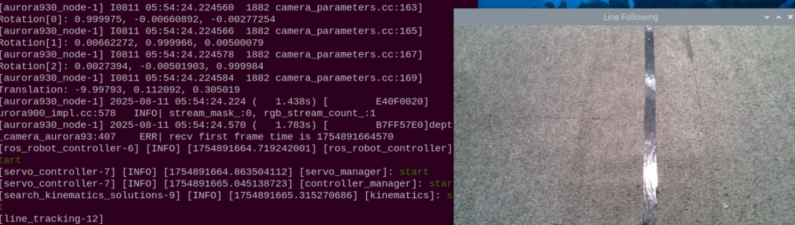

6. Click the line to follow in the camera view using the mouse. The program automatically evaluates color thresholds and designates it as the target trajectory:

   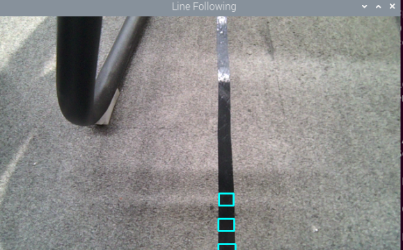

7. After selection, open a new terminal , and enter the following command to initiate line following:

   ```bash
   ros2 service call /line_following/set_running std_srvs/srv/SetBool "{data: true}"
   ```

8. Enter the following command in the terminal to halt line following:

   ```bash
   ros2 service call /line_following/set_running std_srvs/srv/SetBool "{data: false}"
   ```

9. To terminate this application, press **Ctrl+C** in the terminal window. If the process does not terminate immediately, repeat the keystroke.

10. To restore app services for subsequent app features, enter the following command, press **Enter**, and wait for the robotic arm to return to its initial posture and the buzzer to emit a beep:

    ```bash
    ros2 launch bringup bringup.launch.py
    ```

### 17.6.3 Program Outcome

After launching the application, place the robotic arm behind the target path line. Once line following is initiated, the chassis navigates forward while keeping the trajectory centered in its field of view.

### 17.6.4 Program Analysis

* **Launch File Analysis**

The launch file is located at:

**/home/ubuntu/ros2_ws/src/example/example/chassis/line_tracking.launch.py**

(1) `launch_setup` Function

```python
def launch_setup(context):
    compiled = os.environ.get('need_compile', 'False')
    if compiled == 'True':
        sdk_package_path = get_package_share_directory('sdk')
        chassis_package_path = get_package_share_directory('controller')
        peripherals_package_path = get_package_share_directory('peripherals')
    else:
        sdk_package_path = '/home/ubuntu/ros2_ws/src/driver/sdk'
        chassis_package_path = '/home/ubuntu/ros2_ws/src/driver/controller'
        peripherals_package_path = '/home/ubuntu/ros2_ws/src/peripherals'


    object_tracking_node = GroupAction([
        IncludeLaunchDescription(
            PythonLaunchDescriptionSource(
                os.path.join(peripherals_package_path, 'launch/depth_camera.launch.py')),
            ),

        IncludeLaunchDescription(
            PythonLaunchDescriptionSource(
                os.path.join(sdk_package_path, 'launch/nexarm.launch.py')),
            ),

        Node(
            package='example',
            executable='line_tracking',
            output='screen',
            ),
    ])

    return [
            object_tracking_node,
            ]
```

This function loads **launch/depth_camera.launch.py** from the **peripherals** package to start the depth camera node, providing RGB images and depth data. It loads **launch/nexarm.launch.py** from the **sdk** package to enable low-level control and chassis communications. It then executes the **line_tracking** node from the **example** package to subscribe to camera frames, recognize selected colors, and publish chassis velocity commands for line tracking.

(2) `generate_launch_description` Function

```python
def generate_launch_description():
    return LaunchDescription([
        OpaqueFunction(function = launch_setup)
    ])
```

This function creates and returns a `LaunchDescription` object, invoking `launch_setup` via `OpaqueFunction` as the standard entry point for ROS 2 launch files.

(3) Main Function

```python
if __name__ == '__main__':
    # Create a LaunchDescription object
    ld = generate_launch_description()

    ls = LaunchService()
    ls.include_launch_description(ld)
    ls.run()
```

This block instantiates `LaunchDescription` and `LaunchService`, adds the launch description to the service, and executes it to support manual execution of the launch system.

* **Python File Analysis**

The Python file is located at:

**/home/ubuntu/ros2_ws/src/example/example/chassis/line_tracking.py**

(1) Importing Packages

```python
import os
import cv2
import math
import time
import rclpy
import queue
import threading
import numpy as np

import sdk.pid as pid
import sdk.misc as misc
import sdk.common as common

from rclpy.node import Node
from cv_bridge import CvBridge
from sensor_msgs.msg import Image
from geometry_msgs.msg import Twist, Point
from std_srvs.srv import SetBool
from interfaces.srv import SetPoint
from app.common import ColorPicker  
```

1. **sdk.pid**: A custom module implementing PID feedback control algorithms.

2. **sdk.misc**: A custom utility module providing miscellaneous helper functions.

3. **sdk.common**: A collection of common utility functions supporting reusable logic.

4. **app.common.ColorPicker**: Samples and extracts target colors from mouse clicks or service requests.

(2) `LineFollower` Class Initialization

```python
class LineFollower:
    def __init__(self, color, node, threshold=0.3):
        self.node = node
        self.chassis_type = os.environ.get('CHASSIS_TYPE', 'Mecanum')
        self.camera_type = os.environ.get('CAMERA_TYPE', 'astra')
        self.pid_yaw = pid.PID(2.0, 0.0, 0.005)   
        self.pid_dist = pid.PID(2.0, 0.0, 0.005)


        self.last_color_circle = None
        self.lost_target_count = 0

        self.target_lab, self.target_rgb = color
        self.weight_sum = 1.0
        self.threshold = threshold

        self.x_stop = 320
        if self.camera_type == 'aurora':
            self.y_stop = 200
            self.pro_size = (640, 400)
        else:
            self.y_stop = 240
            self.pro_size = (640, 480)

        self.rois = [
            (0.9, 0.95, 0.0, 1.0, 0.7),
            (0.8, 0.85, 0.0, 1.0, 0.2),
            (0.7, 0.75, 0.0, 1.0, 0.1),
        ]
        self.weight_sum = sum([r[4] for r in self.rois])
```

This constructor configures PID controllers where `pid_yaw` controls angular steering with proportional gain kp set to 0.5, while `pid_dist` is reserved for linear regulation. It stores target LAB values as `target_lab` and RGB values as `target_rgb`, utilizing LAB color space for consistent segmentation. It sets three stacked Regions of Interest across the lower portion of the image with decreasing weights of 0.7, 0.2, and 0.1 to focus on path segments ahead while filtering background noise. It adjusts image processing dimensions and reference points according to camera hardware configurations.

(3) `get_area_max_contour` Method

```python
    def get_area_max_contour(self, contours, threshold=30):
        contour_area = [(c, abs(cv2.contourArea(c))) for c in contours]
        filtered = [c for c in contour_area if c[1] > threshold]
        if not filtered:
            return None
        return max(filtered, key=lambda x: x[1])
```

This helper method filters out contours smaller than the threshold and returns the contour with the largest area.

(4) `__call__` Method

```python
    def __call__(self, image, result_image, threshold):
        h, w = image.shape[:2]
        centroid_sum = 0.0

        # Color threshold
        min_color = np.array([
            max(0, int(self.target_lab[0] - 50 * threshold * 2)),
            max(0, int(self.target_lab[1] - 50 * threshold)),
            max(0, int(self.target_lab[2] - 50 * threshold))
        ], dtype=np.uint8)

        max_color = np.array([
            min(255, int(self.target_lab[0] + 50 * threshold * 2)),
            min(255, int(self.target_lab[1] + 50 * threshold)),
            min(255, int(self.target_lab[2] + 50 * threshold))
        ], dtype=np.uint8)

        for roi in self.rois:
            top = int(h * roi[0])
            bottom = int(h * roi[1])
            left = int(w * roi[2])
            right = int(w * roi[3])

            roi_img = image[top:bottom, left:right]
            lab_roi = cv2.cvtColor(roi_img, cv2.COLOR_RGB2LAB)
            blur_roi = cv2.GaussianBlur(lab_roi, (3, 3), 3)

            mask = cv2.inRange(blur_roi, min_color, max_color)
            mask = cv2.erode(mask, cv2.getStructuringElement(cv2.MORPH_RECT, (3, 3)))
            mask = cv2.dilate(mask, cv2.getStructuringElement(cv2.MORPH_RECT, (3, 3)))

            contours, _ = cv2.findContours(mask, cv2.RETR_EXTERNAL, cv2.CHAIN_APPROX_TC89_L1)
            max_contour_area = self.get_area_max_contour(contours, threshold=30)

            if max_contour_area is not None:
                contour, area = max_contour_area
                rect = cv2.minAreaRect(contour)
                box = cv2.boxPoints(rect)
                box = np.int0(box)
                box[:, 1] += top  # Adjust back to the original image coordinates
                box[:, 0] += left

                cv2.drawContours(result_image, [box], 0, (0, 255, 255), 2)

                pt1 = box[0]
                pt3 = box[2]
                center_x = (pt1[0] + pt3[0]) / 2
                center_y = (pt1[1] + pt3[1]) / 2
                cv2.circle(result_image, (int(center_x), int(center_y)), 5, (self.target_rgb[0], self.target_rgb[1], self.target_rgb[2]), -1)

                centroid_sum += center_x * roi[4]

        if centroid_sum == 0:
            # Line not detected
            self.lost_target_count += 1
            if self.lost_target_count > 50:
                self.node.get_logger().warn("Line lost for too long.")
            return result_image, None

        self.lost_target_count = 0

        center_pos = centroid_sum / self.weight_sum
        deflection_angle = -math.atan((center_pos - w / 2) / (h / 2))

        return result_image, deflection_angle
```

Based on the LAB values of the target color and the threshold `threshold`, the algorithm generates the minimum and maximum color ranges `min_color` and `max_color` to ensure that only lines of the target color are detected. Each ROI region is processed individually through image cropping, conversion to LAB space, Gaussian blurring, and threshold masking, followed by noise removal via `erode` and `dilate` operations. Contour extraction and center calculation: extract contours from the mask, filter out contours with sufficient area to eliminate noise, calculate the minimum bounding rectangle for each contour, obtain center coordinates `center_x` and `center_y`, and map them back to the original image coordinates. The center coordinates of the three ROIs are summed according to their weights to obtain the overall center position `center_pos`. The deflection angle `deflection_angle` is calculated based on the deviation between the center and the image centerline, reflecting the offset direction of the track line. When no line is detected for 50 consecutive frames, a warning is output and chassis motion is stopped.

(5) `LineFollowingNode` Class Initialization

```python
class LineFollowingNode(Node):
    def __init__(self, name):
        super().__init__(name)
        self.name = name
        self.set_callback = False
        self.is_running = False
        self.color_picker = None
        self.follower = None
        self.threshold = 0.5
        self.lock = threading.RLock()
        self.image_height = None
        self.image_width = None
        self.image_queue = queue.Queue(2)

        self.bridge = CvBridge()

        self.mecanum_pub = self.create_publisher(Twist, 'ros_robot_controller/cmd_vel', 1)
        self.image_sub = self.create_subscription(Image, '/depth_cam/rgb/image_raw', self.image_callback, 1)

        self.create_service(SetBool, '~/set_running', self.set_running_srv_callback)
        self.create_service(SetPoint, '~/set_target_color', self.set_target_color_srv_callback)

        threading.Thread(target=self.visualization_loop, daemon=True).start()
```

This node subscribes to camera raw images on `/depth_cam/rgb/image_raw`, publishes chassis velocity commands on `ros_robot_controller/cmd_vel`, and exposes the `~/set_running` and `~/set_target_color` services. It also launches a separate visualization thread to render tracking overlays.

(6) `visualization_loop` Method

```python
    def visualization_loop(self):
        cv2.namedWindow("Line Following", cv2.WINDOW_AUTOSIZE)
        while rclpy.ok():
            try:
                img = self.image_queue.get(timeout=1)
            except queue.Empty:
                continue
            bgr = cv2.cvtColor(img, cv2.COLOR_RGB2BGR)
            cv2.imshow("Line Following", bgr)
            if not self.set_callback:
                self.set_callback = True
                cv2.setMouseCallback("Line Following", self.mouse_callback)
            if cv2.waitKey(1) == 27:
                break
        cv2.destroyAllWindows()
```

This method maintains a window named "Line Following", continuously rendering frames from the image queue and binding mouse input handlers.

(7) `mouse_callback` Method

```python
    def mouse_callback(self, event, x, y, flags, param):
        if event == cv2.EVENT_LBUTTONDOWN and self.image_width and self.image_height:
            with self.lock:
                norm_x = x / self.image_width
                norm_y = y / self.image_height
                self.color_picker = ColorPicker(Point(x=norm_x, y=norm_y), 20)
                self.follower = None
                self.get_logger().info(f"Picked color point norm coords: ({norm_x:.3f}, {norm_y:.3f})")
```

Upon a left mouse click, this method normalizes image pixel coordinates to a range of 0 to 1 and instantiates `ColorPicker` to sample path colors at the selected coordinates.

(8) `set_target_color_srv_callback` and `set_running_srv_callback` Methods

```python
    def set_target_color_srv_callback(self, request, response):
        with self.lock:
            self.color_picker = ColorPicker(request.data, 20)
            self.follower = None
            response.success = True
            response.message = "Color picker initialized."
        return response

    def set_running_srv_callback(self, request, response):
        with self.lock:
            self.is_running = request.data
            if not self.is_running:
                self.mecanum_pub.publish(Twist())  # Stop the chassis
            response.success = True
            response.message = f"Set running: {self.is_running}"
        return response
```

The `set_target_color_srv_callback` method initializes `ColorPicker` with received coordinates to sample line colors. The `set_running_srv_callback` method toggles the `is_running` flag, commanding the chassis to stop immediately when tracking is deactivated.

(9) `image_callback` Method

```python
    def image_callback(self, ros_img):
        cv_image = self.bridge.imgmsg_to_cv2(ros_img, "rgb8")
        self.image_height, self.image_width = cv_image.shape[:2]
        result_image = cv_image.copy()

        with self.lock:
            if self.color_picker:
                try:
                    target_color, result_image = self.color_picker(cv_image, result_image)
                    if target_color:
                        self.follower = LineFollower(target_color, self)
                        self.color_picker = None
                        self.get_logger().info(f"Color picked LAB: {target_color[0]}")
                except Exception as e:
                    self.get_logger().error(f"ColorPicker error: {e}")

            elif self.follower:
                try:
                    result_image, deflect_angle = self.follower(cv_image, result_image, self.threshold)
                    twist = Twist()
                    twist.linear.x = 5.0
                    if deflect_angle is not None and self.is_running:
                        # PID control for angular velocity
                        self.follower.pid_yaw.update(deflect_angle)
                        angular_speed = misc.map(common.set_range(self.follower.pid_yaw.output, -6, 6), -6, 6, -10.0, 10.0)
                        twist.angular.z = angular_speed
                        self.mecanum_pub.publish(twist)
                    else:
                        # No line detected, stop, or not running
                        self.follower.pid_yaw.clear()
                        self.mecanum_pub.publish(Twist())
                except Exception as e:
                    self.get_logger().error(f"Follower error: {e}")

        if self.image_queue.full():
            self.image_queue.get()
        self.image_queue.put(result_image)
```

This method converts incoming ROS image messages to OpenCV format with RGB encoding, copying frames for processing. If color calibration is pending, it samples colors through `ColorPicker` and instantiates `LineFollower`. Once initialized, it computes path deviations and applies PID control to calculate angular steering speeds while maintaining forward velocity. When deviation calculation fails or tracking is stopped, it publishes zero velocity commands and clears controller states.

(10) Main Function

```python
def main(args=None):
    rclpy.init(args=args)
    node = LineFollowingNode("line_following")
    try:
        rclpy.spin(node)
    except KeyboardInterrupt:
        pass
    finally:
        node.mecanum_pub.publish(Twist())
        node.destroy_node()
        rclpy.shutdown()
```

This entry point function handles ROS 2 initialization, node lifecycle execution, and clean shutdown handling upon process termination.
