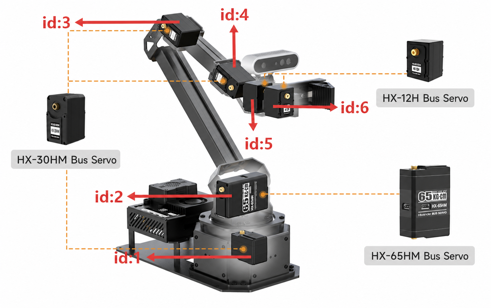
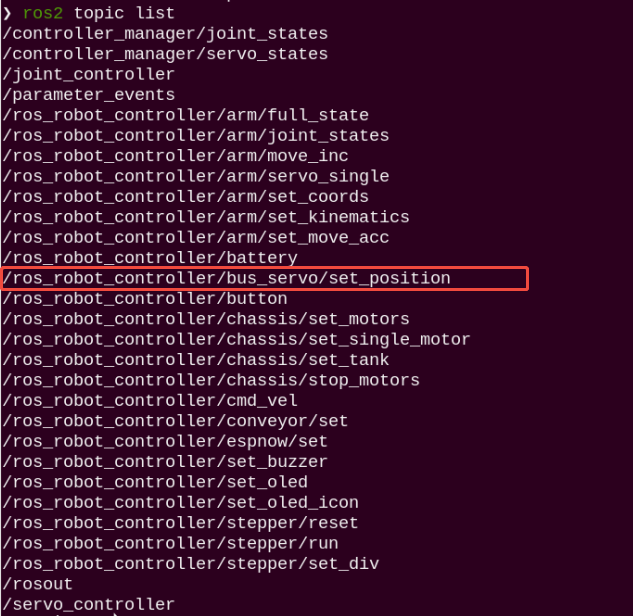
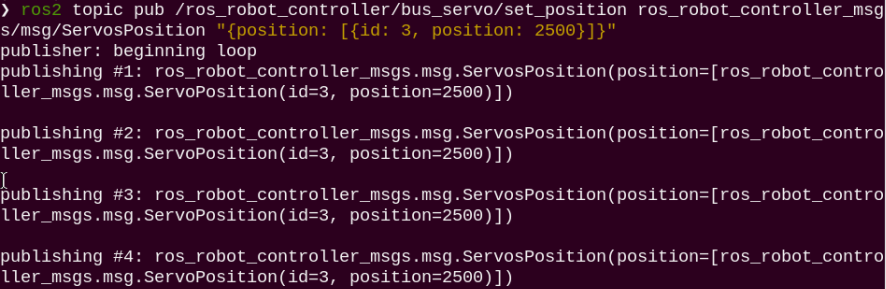
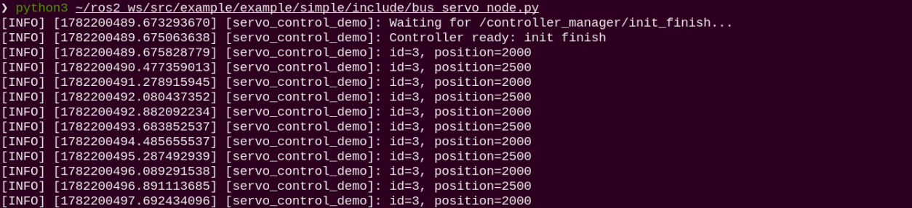
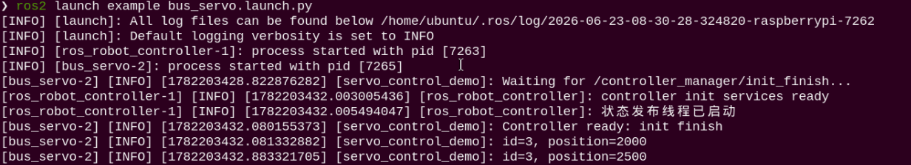
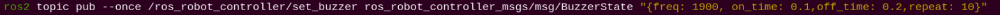
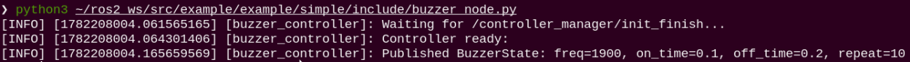
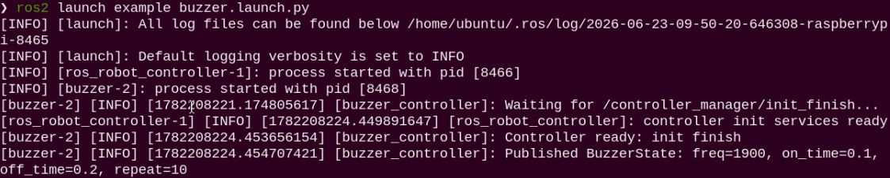

# 2. Basic Robotic Arm Control

Robotic arms are automated mechanical devices widely applied in the field of mechanical technology. They can be found in industrial manufacturing, medical treatment, entertainment services, military, semiconductor manufacturing, space exploration, and other fields.

Although structural forms vary, all robotic arms share a common characteristic: the ability to accept commands and accurately position to a specific point in three-dimensional or two-dimensional space for operation. Robotic arms equipped with vision systems feature even more complete functionality on this basis. This document uses NexArm as an example to explain the basic structure and motion control of this robotic arm. Control methods for other versions of robotic arms remain identical.

## 2.1 Servo Control Node

The robotic arm is equipped with six servos controlled via serial communication with the ESP32 controller. To enable convenient and standardized servo control, a ROS 2 node is set up as the control interface for each servo.



### 2.1.1 Introduction to Servo Control Node

* **Preparation**

> [!NOTE]
>
> **Before starting the robotic arm, be sure to fix the base of the robotic arm to the desktop or a stable platform using a G clamp. Swinging and inertia will occur when the robotic arm starts up and runs. Failure to fix the base may cause the equipment to tip over, fall, or get damaged, potentially posing safety risks.**

* **Start the Servo Control Node**

1. Power on the robotic arm and connect it to the remote control software **VNC**. Refer to [1. Tutorials / 1. NexArm User Manual / 1.5 Development Environment Setup and Configuration](https://drive.google.com/drive/folders/1E_TRpBIkzi_glH7KCmwj_b4I6jDOFO-Z?usp=sharing).
2. Click the command terminal icon  on the system interface to open the command line terminal. Enter the command to disable the app auto-start service.

```
~/.stop_ros.sh
```

3. Enter the command to launch the robotic arm SDK file.

```
ros2 launch sdk nexarm.launch.py
```

4. Open a new command line terminal and enter the command to view the topics after the robotic arm node starts. The topic `bus_servo/set_position` is used to control servo motion.

```
ros2 topic list
```



### 2.1.2 Servo Control via Topics

> [!NOTE]
>
> **This section introduces three usage methods for NexArm servo control: control via topic, control via Python file, and control via launch file. Although their usage forms differ, the essence of all three is to achieve robotic arm motion by publishing messages to the servo control topic.**

**(1) Direct Control via Topic**

1. Power on the robotic arm and connect it to the remote control software **VNC**. Refer to [1. Tutorials / 1. NexArm User Manual / 1.5 Development Environment Setup and Configuration](https://drive.google.com/drive/folders/1E_TRpBIkzi_glH7KCmwj_b4I6jDOFO-Z?usp=sharing).
2. Click the command terminal icon  on the system interface to open the command line terminal. Enter the command to disable the app auto-start service.

```shell
~/.stop_ros.sh
```

3. Then enter the command to launch the robotic arm SDK file.

```shell
ros2 launch sdk nexarm.launch.py
```

4. Open a new command line terminal and enter the command.

```shell
ros2 topic pub /ros_robot_controller/bus_servo/set_position ros_robot_controller_msgs/msg/ServosPosition "{position: [{id: 3, position: 2500}]}"
```


Two settable parameters can be obtained:

- `id`: Servo ID, used to specify which servo to control, where the servo ID ranges from `1` to `6`.
- `position`: Servo target position value, used to specify which position the servo rotates to. In this project, the range is generally understood as `0` to `4096`, and around `2048` is usually the middle position.

The command here sets parameters as:

- `id: 3`, indicating control of Servo `3`
- `position`: `2500`, indicating rotating Servo `3` to target position `2500`

5. After the program starts, Servo 3 of the robotic arm can be seen rotating to target position 2500, and the servo topic information is printed in the terminal.



6. To stop the program, press **Ctrl+C** in each terminal interface. If program termination fails, press it repeatedly.

**(2) Servo Control via Python File**

1. Click the command terminal icon  on the system interface to open the command line terminal. Enter the command to disable the app auto-start service.

```shell
~/.stop_ros.sh
```

2. Then enter the command to launch the robotic arm SDK file.

```shell
ros2 launch sdk nexarm.launch.py
```

3. Open a new command line terminal and enter the command. Servo 3 of the robotic arm can be seen rotating back and forth between position values 2000 and 2500, and the servo topic information is printed in the terminal.

```shell
python3 ~/ros2_ws/src/example/example/simple/include/bus_servo_node.py
```



4. To stop the program, press **Ctrl+C** in each terminal interface. If program termination fails, press it repeatedly.

**(3) Servo Control via Launch File**

1. Click the command terminal icon  on the system interface to open the command line terminal. Enter the command to disable the app auto-start service.

```shell
~/.stop_ros.sh
```

2. Then enter the command to enable servo control, calling the **bus_servo_node.py** file in the launch file.

```shell
ros2 launch example bus_servo.launch.py
```

3. After the program starts, Servo 3 of the robotic arm can be seen rotating back and forth between position values 2000 and 2500, and the servo topic information is printed in the terminal.



4. To stop the program, press **Ctrl+C** in each terminal interface. If program termination fails, press it repeatedly.

### 2.1.3 Program Analysis

* **Launch File Analysis**

The launch file is located at:

**/home/ubuntu/ros2_ws/src/example/example/simple/bus_servo.launch.py**

(1) `generate_launch_description` Function

```py
def generate_launch_description():
    compiled = os.environ['need_compile']
    
    if compiled == 'True':
        robot_controller_package_path = get_package_share_directory('ros_robot_controller')
    else:
        robot_controller_package_path = '/home/ubuntu/ros2_ws/src/driver/ros_robot_controller'


    robot_controller_launch = IncludeLaunchDescription(
        PythonLaunchDescriptionSource([os.path.join(robot_controller_package_path, 'launch/ros_robot_controller.launch.py')
        ]),
    )

    
    bus_servo_node = Node(
        package='example',
        executable='bus_servo',
        output='screen',
            )

    return LaunchDescription([
        robot_controller_launch,
        bus_servo_node
    ])
```

This function is used to generate ROS 2 launch descriptions. The program first reads the environment variable `need_compile`. If set to `True`, `ros_robot_controller` is retrieved from the package installation path. Otherwise, the source code directory **/home/ubuntu/ros2_ws/src/driver/ros_robot_controller** is used.

Then, **ros_robot_controller.launch.py** is included via `IncludeLaunchDescription` to start the underlying robot controller node. Next, the `bus_servo_node` node is defined to execute the `bus_servo` executable in the `example` package, which is the servo control example program.

(2) Main Program

```py
if __name__ == '__main__':
    # Create a LaunchDescription object
    ld = generate_launch_description()

    ls = LaunchService()
    ls.include_launch_description(ld)
    ls.run()
```

The main program creates a `LaunchDescription` object and launches the entire launch description via `LaunchService`, thereby starting both the underlying controller and the servo control example node simultaneously.

* **Python File Analysis**

The Python file is located at: **/home/ubuntu/ros2_ws/src/example/example/simple/include/bus_servo_node.py**

(1) Package Import

```py
import time
import rclpy
from rclpy.node import Node
from std_srvs.srv import Trigger
from ros_robot_controller_msgs.msg import ServoPosition, ServosPosition
```

`rclpy` is used to write ROS 2 Python nodes. `Trigger` is used to wait for the controller initialization completion service. `ServoPosition` and `ServosPosition` are servo control message types, where `ServoPosition` represents the ID and target position of a single servo, and `ServosPosition` represents a list composed of multiple servo positions.

(2) `ServoController` Class

```py
class ServoController(Node):
    def __init__(self):
        super().__init__('servo_control_demo')
        self.pub = self.create_publisher(
            ServosPosition,
            '/ros_robot_controller/bus_servo/set_position',
            1
        )
        self.ready_client = self.create_client(
            Trigger,
            '/controller_manager/init_finish'
        )
```

This class inherits from the ROS 2 `Node` class, with the node name `servo_control_demo`.

The program creates a publisher `self.pub` to publish servo target position messages to the `/ros_robot_controller/bus_servo/set_position` topic. After subscribing to this topic, the underlying controller sends the target positions down to the serial bus servos with matching IDs.

At the same time, the program creates a service client for `/controller_manager/init_finish` to wait for controller initialization to complete, avoiding premature transmission of servo control messages when the underlying controller is not ready.

3. Wait for Controller Initialization

```py
def wait_for_controller(self, ready_timeout_sec=30.0, discovery_timeout_sec=3.0):
    self.get_logger().info('Waiting for /controller_manager/init_finish...')
    if self.ready_client.wait_for_service(timeout_sec=ready_timeout_sec):
        future = self.ready_client.call_async(Trigger.Request())
        rclpy.spin_until_future_complete(self, future, timeout_sec=5.0)
        if future.done() and future.result() is not None:
            self.get_logger().info(f'Controller ready: {future.result().message}')
        else:
            self.get_logger().warning('Timed out waiting for controller ready response')
    else:
        self.get_logger().warning('Controller ready service not available; publishing may race startup')

    deadline = time.monotonic() + discovery_timeout_sec
    while rclpy.ok() and self.pub.get_subscription_count() == 0 and time.monotonic() < deadline:
        rclpy.spin_once(self, timeout_sec=0.1)
    if self.pub.get_subscription_count() == 0:
        self.get_logger().warning(
            'No subscriber on /ros_robot_controller/bus_servo/set_position yet. Publishing anyway'
        )
```

This function first waits for the `/controller_manager/init_finish` service to start and calls this service to confirm that controller initialization has completed.

Subsequently, the program briefly waits for subscriber presence on the servo control topic. If no subscriber is detected within the specified duration, a warning is printed while message publishing continues.

(4) `set_servo_position` Function

```
def set_servo_position(self, positions):
    msg = ServosPosition()
    position_list = []
    for i in positions:
        position = ServoPosition()
        position.id = i[0]
        position.position = int(i[1])
        position_list.append(position)
    msg.position = position_list
    self.pub.publish(msg)
    for pos in position_list:
        self.get_logger().info(f'id={pos.id}, position={pos.position}')
```

This function is used to publish target servo positions.

The parameter `positions` is a list of tuples in the format: `((servo ID, target position),)`

For example: `((3, 2000),)` indicates controlling Servo ID `3` to move to position `2000`.

The program iterates through `positions`, constructs a `ServoPosition` message for each servo, sets the servo ID and target position, places all servo positions into the `position` field of the `ServosPosition` message, and finally publishes it to the topic `/ros_robot_controller/bus_servo/set_position`.

Note: The `ros_robot_controller_msgs/msg/ServosPosition` message used in the current source code contains only the `position` field and no `duration` field, so motion duration is not set here.

(5) `main` Function

```py
def main(args=None):
    rclpy.init(args=args)
    controller = ServoController()
    controller.wait_for_controller()

    try:
        while rclpy.ok():
            controller.set_servo_position(((3, 2000),))  # Set servo ID 3 to position 2000
            time.sleep(0.8)
            controller.set_servo_position(((3, 2500),))  # Set servo ID 3 to position 2500
            time.sleep(0.8)
    except KeyboardInterrupt:
        pass
    finally:
        controller.destroy_node()
        rclpy.shutdown()
```

The main function first initializes ROS 2, creates a `ServoController` node object, and calls `wait_for_controller()` to wait for underlying controller initialization completion.

Upon entering the loop, the program repeatedly controls Servo ID `3` to alternate between position `2000` and position `2500` at `0.8`-second intervals. Pressing **Ctrl+C** terminates the program, destroys the node, and shuts down ROS 2.


## 2.2 Buzzer Control Node

An onboard buzzer is equipped on the ESP32 controller. Communication between the Controller and the ESP32 microcontroller is conducted via serial communication to control the buzzer. To control the buzzer more conveniently and standardizedly, a ROS node needs to be set up as the buzzer interface.

### 2.2.1 Introduction to Buzzer Control Node

> [!NOTE]
>
> **Before starting the robotic arm, be sure to fix the base of the robotic arm to the desktop or a stable platform using a G clamp. Swinging and inertia will occur when the robotic arm starts up and runs. Failure to fix the base may cause the equipment to tip over, fall, or get damaged, potentially posing safety risks.**

* **Start the Buzzer Control Node**

1. Power on the robotic arm and connect it to the remote control software **VNC**. Refer to [1. Tutorials / 1. NexArm User Manual / 1.5 Development Environment Setup and Configuration](https://drive.google.com/drive/folders/1E_TRpBIkzi_glH7KCmwj_b4I6jDOFO-Z?usp=sharing).
2. Click the command terminal icon  on the system interface to open the command line terminal. Enter the command to disable the app auto-start service.

```
~/.stop_ros.sh
```

3. Enter the command to launch the robotic arm SDK file.

```shell
ros2 launch sdk nexarm.launch.py
```

4. Open a new command line terminal and enter the command to view topics after the robotic arm node starts.

```
ros2 topic list
```


| **Topic** | **Function Description** |
| :---: | :---: |
| `/ros_robot_controller/set_buzzer` | Control buzzer state |

### 2.2.2 Buzzer Control via Topics

> [!NOTE]
>
> **This section introduces three usage methods for NexArm buzzer control: control via topic, control via Python file, and control via launch file. Although their usage forms differ, the essence of all three is to control buzzer sounding by publishing messages to the buzzer control topic.**

**(1) Direct Control via Topic**

1. Power on the robotic arm and connect it to the remote control software **VNC**. Refer to [1. Tutorials / 1. NexArm User Manual / 1.5 Development Environment Setup and Configuration](https://drive.google.com/drive/folders/1E_TRpBIkzi_glH7KCmwj_b4I6jDOFO-Z?usp=sharing).
2. Click the command terminal icon  on the system interface to open the command line terminal. Enter the command to disable the app auto-start service.

```
~/.stop_ros.sh
```

3. Enter the command to launch the robotic arm SDK file.

```
ros2 launch sdk nexarm.launch.py
```

4. Open a new command line terminal and enter the command.

```
ros2 topic pub --once /ros_robot_controller/set_buzzer ros_robot_controller_msgs/msg/BuzzerState "{freq: 1900, on_time: 0.1,off_time: 0.2,repeat: 10}"
```



Four configurable parameters can be obtained:

* `freq`: Frequency of the buzzer, ranging from 2 to 4 kHz, where higher frequencies produce higher tones.
* `on_time`: Duration for which the buzzer sounds, in seconds.
* `off_time`: Duration for which the buzzer stops sounding, in seconds.
* `repeat`: Number of repetitions for buzzer sounding and stopping.

5. After starting the program, the buzzer can be heard sounding at 1900 Hz for 0.1 seconds, stopping for 0.2 seconds, repeating 10 times, with topic information printed in the terminal.

6. To stop the program, press **Ctrl+C** in each terminal interface. If program termination fails, press it repeatedly.

**(2) Buzzer Control via Python File**

1. Click the command terminal icon  on the system interface to open the command line terminal. Enter the command to disable the app auto-start service.

```shell
~/.stop_ros.sh
```

2. Then enter the command to launch the robotic arm SDK file.

```shell
ros2 launch sdk nexarm.launch.py
```

3. Open a new command line terminal and enter the command to start the program. The buzzer can be heard beeping ten times before stopping, with buzzer parameter information printed in the terminal.

```
python3 ~/ros2_ws/src/example/example/simple/include/buzzer_node.py
```



4. To stop the program, press **Ctrl+C** in each terminal interface. If program termination fails, press it repeatedly.

**(3) Buzzer Control via Launch File**

1. Click the command terminal icon  on the system interface to open the command line terminal. Enter the command to disable the app auto-start service.

```shell
~/.stop_ros.sh
```

2. Then enter the command to enable buzzer control, calling the **buzzer_node.py** file in the launch file.

```
ros2 launch example buzzer.launch.py
```



4. After starting the program, the onboard buzzer on the ESP32 controller can be heard beeping ten times before stopping, with buzzer parameter information printed in the terminal.

5. To stop the program, press **Ctrl+C**. If program termination fails, press it repeatedly.

### 2.2.3 Program Analysis

* **Launch File Analysis**

The launch file is located at: **/home/ubuntu/ros2_ws/src/example/example/simple/buzzer.launch.py**

(1) `generate_launch_description` Function

```py
def generate_launch_description():
    compiled = os.environ['need_compile']

    if compiled == 'True':
        robot_controller_package_path = get_package_share_directory('ros_robot_controller')
    else:
        robot_controller_package_path = '/home/ubuntu/ros2_ws/src/driver/ros_robot_controller'


    robot_controller_launch = IncludeLaunchDescription(
        PythonLaunchDescriptionSource([os.path.join(robot_controller_package_path, 'launch/ros_robot_controller.launch.py')
        ]),
    )

    buzzer_node = Node(
        package='example',
        executable='buzzer',
        output='screen',
            )

    return LaunchDescription([
        robot_controller_launch,
        buzzer_node
    ])
```

Includes the launch file **launch/ros_robot_controller.launch.py** in the `ros_robot_controller` package to start robot controller-related nodes for underlying hardware control support. Defines the `buzzer_node` node to execute the `buzzer` executable in the `example` package, logging to the screen to control buzzer operation.

(2) Main Function:

```py
if __name__ == '__main__':
    # Create a LaunchDescription object
    ld = generate_launch_description()

    ls = LaunchService()
    ls.include_launch_description(ld)
    ls.run()
```

Creates a `LaunchDescription` object and a `LaunchService` service, adds the launch description to the launch service, and runs it to start the entire system.

* **Python File Analysis**

The Python file is located at: **/home/ubuntu/ros2_ws/src/example/example/simple/include/buzzer_node.py**

(1) Package Import

```py
import time
import rclpy
from rclpy.node import Node
from std_srvs.srv import Trigger
from ros_robot_controller_msgs.msg import BuzzerState
```

`BuzzerState`: Custom message type used to set the buzzer state.

(2) `BuzzerController` Class

```py
class BuzzerController(Node):
    def __init__(self):
        super().__init__('buzzer_controller')
        self.pub = self.create_publisher(BuzzerState, '/ros_robot_controller/set_buzzer', 1)

        # Wait for controller underlying service startup
        self.client = self.create_client(Trigger, '/ros_robot_controller/init_finish')
        self.client.wait_for_service()

    def set_buzzer(self, freq, on_time, off_time, repeat):
        msg = BuzzerState()
        msg.freq = freq
        msg.on_time = on_time
        msg.off_time = off_time
        msg.repeat = repeat
        
        # Publish message
        self.pub.publish(msg)
        self.get_logger().info(f'Published BuzzerState: freq={msg.freq}, on_time={msg.on_time}, off_time={msg.off_time}, repeat={msg.repeat}')
```

Initializes the ROS node named `buzzer_controller`, creates the buzzer state publisher on topic `/ros_robot_controller/set_buzzer`, and waits for the robot controller initialization completion service `/ros_robot_controller/init_finish` to start to ensure underlying control readiness.

(3) `set_buzzer` Function

```py
    def set_buzzer(self, freq, on_time, off_time, repeat):
        msg = BuzzerState()
        msg.freq = freq
        msg.on_time = on_time
        msg.off_time = off_time
        msg.repeat = repeat
        
        # Publish message
        self.pub.publish(msg)
        self.get_logger().info(f'Published BuzzerState: freq={msg.freq}, on_time={msg.on_time}, off_time={msg.off_time}, repeat={msg.repeat}')
```

Constructs a `BuzzerState` message, sets the frequency `freq`, sounding time `on_time`, stopping time `off_time`, and repeat count `repeat` of the buzzer, publishes the message to the buzzer control topic, and prints logs displaying the buzzer control parameters.

(4) `main` Function

```py
def main(args=None):
    rclpy.init(args=args)
    controller = BuzzerController()

    # Send buzzer state
    controller.set_buzzer(freq=1500, on_time=0.1, off_time=0.5, repeat=10)
    time.sleep(5)
    controller.destroy_node()  # Destroy node
    rclpy.shutdown()  # Shutdown ROS 2
```

Initializes ROS 2 and creates a `BuzzerController` node instance. Calls the `set_buzzer` method to control the buzzer to operate repeatedly for 10 cycles with a frequency of 1500 Hz, sounding for 0.1 seconds and stopping for 0.5 seconds per cycle. Waits for 5 seconds to ensure the buzzer completes the specified action, cleans up the node, and shuts down ROS 2.
