# 3. Advanced Robotic Arm Control

## 3.1 Homogeneous Coordinate Transformation

### 3.1.1 Introduction to Homogeneous Coordinates

Homogeneous coordinate transformation is a mathematical tool widely applied in fields such as computer graphics, robotics, and computer vision to describe transformation relationships between coordinate systems. Its main purpose is to simplify complex geometric transformations such as translation, rotation, scaling, and projection, allowing them to be represented and calculated in a more concise manner.

In a two-dimensional plane, a pair of coordinate values (x, y) is used to represent the exact location of a point within the plane. Assuming the coordinates of the point before transformation are (x, y) and the coordinates after transformation are (x\*, y\*), this transformation process can be written in matrix form as follows:
$$
[x^*, y^*] = [x, y]\cdot M
$$

$$
\begin{cases}
x^* = a_1x + b_1y + c_1 \\
y^* = a_2x + b_2y + c_2
\end{cases}
$$

$$
[x^*, y^*] =
[x\ y\ 1]
\begin{bmatrix}
a_1 & a_2 \\
b_1 & b_2 \\
c_1 & c_2
\end{bmatrix}
$$

This method of using a three-dimensional vector to represent a two-dimensional vector, or generally speaking, using an n+1-dimensional vector to represent an `n`-dimensional vector, is called homogeneous coordinate representation.


### 3.1.2 Functions of Homogeneous Coordinates

By adopting homogeneous coordinate representation, two-dimensional linear transformations can be uniformly expressed in the normalized form shown below:
$$
[x^*\ y^*\ 1] =
[x\ y\ 1]
\begin{bmatrix}
a_1 & a_2 & 0 \\
b_1 & b_2 & 0 \\
c_1 & c_2 & 1
\end{bmatrix}
$$
For a graphic object, a vertex list can be used to describe the geometric relations of the object, and an edge list can be used to describe the topological relations. Therefore, transformation of graphic objects ultimately converts into changing the vertex list of the object.

### 3.1.3 Transformations

* **Translation Transformation**

Translation refers to the repositioning process of moving point P along a straight line path from one coordinate position to another coordinate position.
$$
\begin{cases}
x^* = x + T_x \\
y^* = y + T_y
\end{cases}
$$
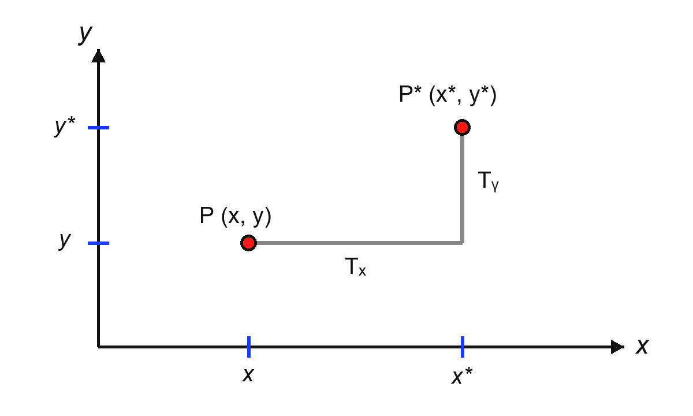

 The calculation form in homogeneous coordinates is as follows:

Translation is a rigid body transformation that moves objects without producing deformation, meaning that every point on the object moves by the same amount of coordinates.

* **Scaling Transformation**

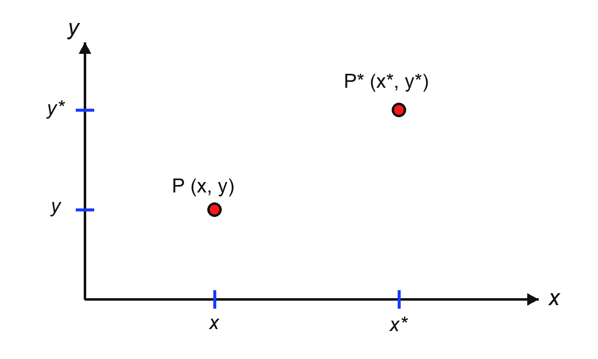

The calculation form in homogeneous coordinates is as follows:
$$
[x^*\ y^*\ 1] =
[x\ y\ 1]
\begin{bmatrix}
S_x & 0 & 0 \\
0 & S_y & 0 \\
0 & 0 & 1
\end{bmatrix}
=
[S_xx\quad S_yy\quad 1]
$$
Scaling factors `Sx` and `Sy` can be assigned any positive real numbers. Values less than 1 reduce object dimensions. Values greater than 1 enlarge the object. When both are specified as 1, object dimensions remain unchanged.

1. Uniform Scaling with Sx = Sy

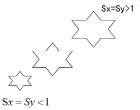

2. Non-Uniform Scaling with Sx <> Sy

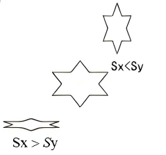

When Sx = Sy, scaling transformation becomes overall scaling, calculated using the following matrix:
$$
[x^*\ y^*\ 1] =
[x\ y\ 1]
\begin{bmatrix}
1 & 0 & 0 \\
0 & 1 & 0 \\
0 & 0 & S
\end{bmatrix}
=
[x\ y\ S]
=
\left[\frac{x}{S}\quad \frac{y}{S}\quad 1\right]
$$

* **Symmetry Transformation**

Symmetry transformation is also referred to as reflection transformation or mirror transformation. The transformed graphic object is the mirror image of the original graphic object relative to a certain axis or origin.

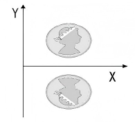


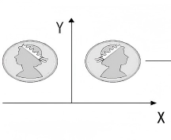

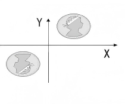

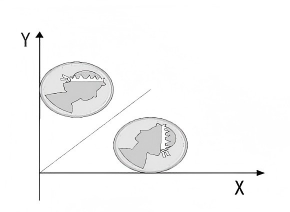

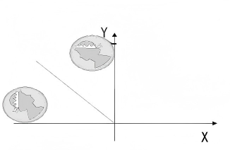


 **Symmetry Relative to X-Axis**

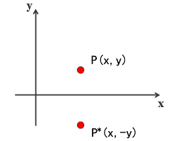

**Symmetry Relative to Y-Axis**

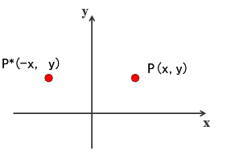

* **Rotation Transformation**


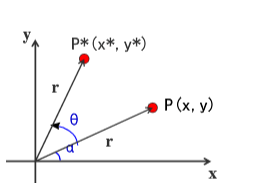


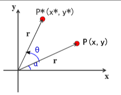


## 3.2 Introduction to Forward Kinematics

Forward kinematics describes how the end-effector pose is determined when joint angles are known. In robotic arm control, it is primarily used for current position recovery, attitude verification, and target error analysis. For the main chain of this robotic arm, the core of forward kinematics is to first solve the horizontal reach and vertical height within the side-view working plane, and then map them back to three-dimensional space via the base rotation angle.

### 3.2.1 Model Definition

All derivations of forward kinematics are established on a unified geometric model and angle reference system. Without clearly defining link lengths, offset directions, and angle reference edges beforehand, subsequent component decomposition, vector superposition, and pose simultaneous equations lose a unified standard. Link parameters are defined as follows:

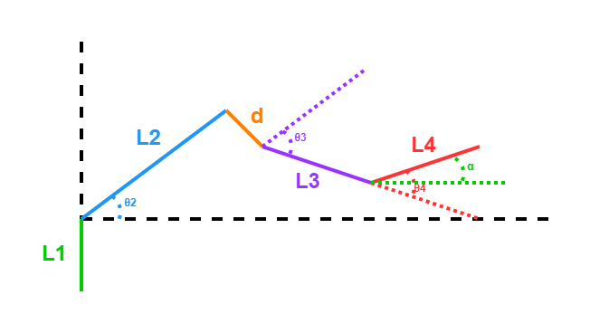

- L1: Vertical height from base to shoulder joint
- L2: Main length of second link
- d: Structural offset at end of second link
- L3: Third link length
- L4: End link length

Geometrically, this main chain can be described as follows: between the base and shoulder joint is a vertical support L1, followed by a structure composed of main link L2 and end offset d. The offset endpoint connects to third link L3, and finally connects to end link L4. Therefore, this mechanical structure is not an ideal standard three-link mechanism, but a serial mechanism with structural offset.

Regarding angle definitions, θ2 represents the angle of L2 relative to the horizontal reference line. θ3 represents the angle from a reference line parallel to L2 at the offset endpoint to L3. θ4 represents the angle from the extended direction of L3 to L4. And α represents the absolute orientation angle of end link L4 relative to the horizontal reference line.

From this, the directional relationships of each link are obtained as follows:
$$
\mathrm{dir}(L_2)=\theta_2
$$

$$
\mathrm{dir}(L_3)=\theta_2+\theta_3
$$

$$
\mathrm{dir}(L_4)=\theta_2+\theta_3+\theta_4=\alpha
$$

Special attention should be given to the fact that θ3 is a local angle, or relative angle, rather than the absolute orientation angle of the third link relative to the horizontal reference line. Its absolute direction must be obtained through step-by-step accumulation.

### 3.2.2 Pose Relationship

In the main chain, the end-effector pose is not determined by a single joint alone, but is the result of joint action among shoulder, elbow, and wrist joints. Writing out pose relationships first allows distinguishing which angles handle position solving versus pose compensation. When end-effector pose α is known, θ4 is no longer an independent variable, but is jointly determined by θ2 and θ3.

The end-effector pose satisfies:

$$
\alpha = \theta_2 + \theta_3 + \theta_4
$$

Simultaneously solving yields the wrist compensation angle:

$$
\theta_4 = \alpha - \theta_2 - \theta_3
$$

### 3.2.3 Vector Decomposition in Working Plane

Robotic arm end-effector position is essentially the superposition result of multiple link displacements. To write this superposition process into computable formulas, each link segment must first be decomposed onto horizontal and vertical axes according to its absolute orientation angle.

Within the working plane, the end-effector position can be viewed as the algebraic sum of several vectors. Each link is decomposed onto horizontal and vertical axes based on its absolute orientation angle, followed by item-by-item superposition.

Main direction vector of second link:

$$
\mathbf{p}_2 =
\begin{bmatrix}
L_2\cos\theta_2 \\
L_2\sin\theta_2
\end{bmatrix}
$$

Offset term vector:

$$
\mathbf{p}_{off} =
\begin{bmatrix}
d\sin\theta_2 \\
-d\cos\theta_2
\end{bmatrix}
$$

Third link vector:

$$
\mathbf{p}_3 =
\begin{bmatrix}
L_3\cos(\theta_2+\theta_3) \\
L_3\sin(\theta_2+\theta_3)
\end{bmatrix}
$$

Fourth link vector:

$$
\mathbf{p}_4 =
\begin{bmatrix}
L_4\cos(\theta_2+\theta_3+\theta_4) \\
L_4\sin(\theta_2+\theta_3+\theta_4)
\end{bmatrix}
$$

Among them, the third link and fourth link use absolute orientation angles, resulting in θ2+θ3 and θ2+θ3+θ4 respectively.

### 3.2.4 Total Displacement in Working Plane

Listing vectors of each link individually only explains local geometric relations. Only by adding all items together can the overall position expression of the end-effector in the working plane be obtained, which is the displacement result truly required by forward kinematics.

Let the horizontal reach in the side-view plane be **length** and the vertical height be **height**, then

$$
\mathbf{p}_{plane} =
\begin{bmatrix}
0 \\
L_1
\end{bmatrix}
+
\mathbf{p}_2
+
\mathbf{p}_{off}
+
\mathbf{p}_3
+
\mathbf{p}_4
$$

Simplifying yields:

$$
length =
L_2\cos\theta_2 +
d\sin\theta_2 +
L_3\cos(\theta_2+\theta_3) +
L_4\cos(\theta_2+\theta_3+\theta_4)
$$

$$
height =
L_1 +
L_2\sin\theta_2 -
d\cos\theta_2 +
L_3\sin(\theta_2+\theta_3) +
L_4\sin(\theta_2+\theta_3+\theta_4)
$$

The formulas provide the position solution in the side-view working plane. As observed, offset d appears only in the second-stage structure, but affects both horizontal and vertical components simultaneously.

### 3.2.5 Spatial Mapping

The preceding derivations are based on the side-view working plane, whereas the robotic arm actually operates in three-dimensional space. To obtain true spatial coordinates of the end-effector, results in the working plane must be mapped into the three-dimensional coordinate system.

Specifically, the horizontal reach in the working plane is projected into the spatial coordinate system via base rotation angle θ1, obtaining positions in x and y directions. The height component in the plane corresponds directly to the z direction in spatial coordinates. Spatial coordinates are expressed as:
$$
x = length \cos(-\theta_1)
$$

$$
y = length \sin(-\theta_1)
$$

$$
z = height
$$

Therefore, forward kinematics of the robotic arm can be divided into two steps: first solve horizontal reach and height of the end-effector in the two-dimensional working plane, and then complete three-dimensional spatial mapping via base rotation angle. Forward kinematics ultimately establishes the following mapping relationship:

$$
(\theta_1,\theta_2,\theta_3,\theta_4)
\rightarrow
(x,y,z,\alpha)
$$


## 3.3 Introduction to Inverse Kinematics

The goal of inverse kinematics is to solve joint angles backwards from end-effector pose, which means solving the rotation angle required for each joint given known coordinates of the end-effector:

$$
(x,y,z,\alpha)
\rightarrow
(\theta_1,\theta_2,\theta_3,\theta_4)
$$

Compared with forward kinematics, it does not stack forward step by step, but restores geometric relationships of each stage backwards from the end target, thus relying more on auxiliary construction and simultaneous angle equations. Difficulties of inverse kinematics stem mainly from three aspects:

- End targets are spatial coordinates while joint variables are angles, belonging to different description spaces.
- End pose α simultaneously constrains θ2, θ3, and θ4.
- Structural offset d exists in the second-stage structure, causing the actual mechanical structure to differ from a standard two-link mechanism.

Therefore, inverse kinematics cannot solve all joint angles directly at once, but must undergo spatial dimensionality reduction, wrist point push-back, equivalent link construction, triangle constraints, and angle recovery to gradually transform spatial targets into real joint solutions.

### 3.3.1 Spatial Dimensionality Reduction

Base rotation and main chain extension belong to two different types of motion geometrically. Without decoupling the three-dimensional problem first, base orientation and planar link relationships will be coupled together, making it difficult to directly apply planar geometry tools later.

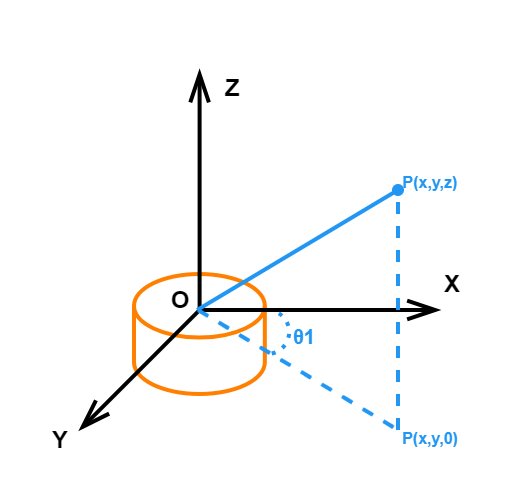

Inverse solving first compresses the target point onto the working plane. Let the projection radius of target point in horizontal plane be:

$$
length = \sqrt{x^2 + y^2}
$$

Then base angle is:

$$
\theta_1 = -\operatorname{atan2}(y, x)
$$

Thus, the three-dimensional problem is decomposed into base rotation angle θ1 and remaining three angles in the side-view working plane.

Performing spatial dimensionality reduction first is necessary because base rotation only affects target point orientation in the horizontal plane without altering length relationships of the main chain in the side-view plane. Solving θ1 separately compresses remaining computations into a two-dimensional planar geometry problem.

- Decouple three-dimensional problem into two parts: planar orientation plus planar links
- Allow direct use of wrist point push-back, law of cosines, and inverse trigonometric functions subsequently
- Avoid handling base rotation and main chain extension simultaneously in three-dimensional space

### 3.3.2 Wrist Point Push-Back

When end-effector pose α is known, direction of fourth link L4 is fixed. Separating L4 from the overall system first converts target arrival of end point into target arrival of wrist point, reducing one link directly participating in geometric solving. Since end pose α is known, direction of fourth link L4 is also determined, allowing end point to be pushed back along the opposite direction of L4 to obtain wrist point (a, b):

$$
a = length - L_4\cos\alpha
$$

$$
b = z - L_1 - L_4\sin\alpha
$$

Thus, the main inverse kinematics problem shifts from end point target arrival to delivering wrist point to target position via the front-stage main chain composed of L2, offset d, and L3.

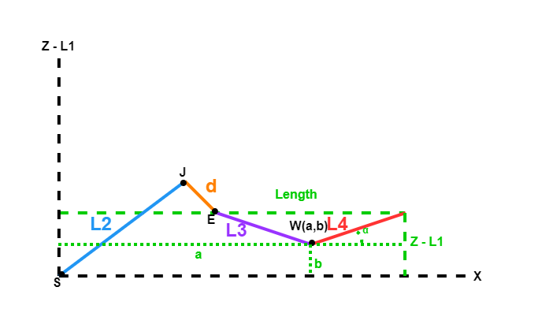

### 3.3.3 Equivalent Link

Between shoulder joint and wrist point is not a standard single second link, but a real mechanical structure combined from main length L2, structural offset d, and third link L3. Without performing equivalent transformation first, standard two-dimensional two-link solving methods cannot be applied directly. Because structural offset d exists in the second stage, the actual mechanical structure between shoulder joint and wrist point is not a standard two-link mechanism, requiring equivalent processing first. Let equivalent second link length be L2' and correction angle be δ, making the actual mechanical structure between shoulder joint and wrist point as follows:

$$
S \rightarrow J \rightarrow E \rightarrow W
$$

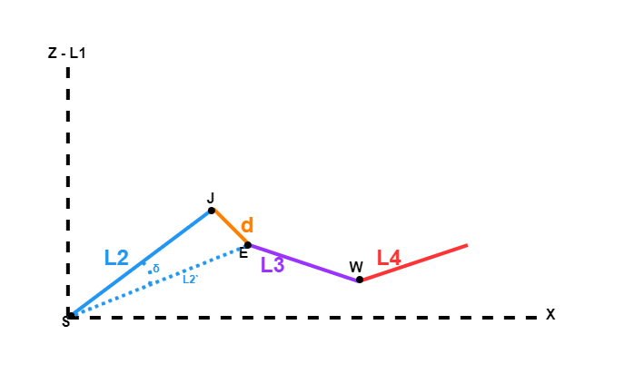

Where:

- S -> J corresponds to main length L2
- J -> E corresponds to structural offset d
- E -> W corresponds to third link L3

Due to the extra offset segment d in between, this mechanical structure cannot be treated directly as a standard two-link mechanism from shoulder joint to elbow joint to wrist point.

$$
L_2' = \sqrt{L_2^2 + d^2}
$$

$$
\delta = \arctan\left(\frac{d}{L_2}\right)
$$

After this step, the complex mechanical structure from shoulder joint to offset endpoint can be expressed with equivalent link `L2'` and correction angle `δ`, subsequently forming a standard two-dimensional two-link triangle with third link L3.

### 3.3.4 Triangle Constraint

As long as mechanical structure is equivalenced into L2' and L3, inverse kinematics can be transformed into a standard triangle problem. Only after establishing this triangle do the law of cosines and inverse trigonometric functions have clear geometric objects. Let distance from shoulder joint to wrist point be:

$$
D = \sqrt{a^2 + b^2}
$$

This yields a standard triangle with side lengths L2', L3, and D. All subsequent angle recoveries are established upon this triangle. Let equivalent elbow angle be γ, then by law of cosines:

$$
\cos\gamma =
\frac{L_2'^2 + L_3^2 - D^2}{2L_2'L_3}
$$

$$
\gamma =
\arccos\left(
\frac{L_2'^2 + L_3^2 - D^2}{2L_2'L_3}
\right)
$$

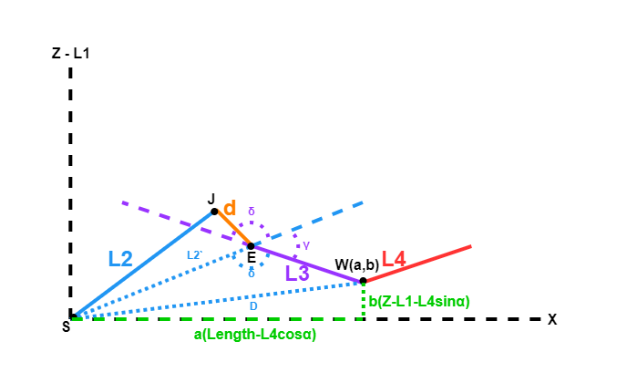

The angle γ obtained here is the elbow geometric angle in the equivalent mechanism, not the final real elbow joint angle. The equivalent mechanism refers to the simplified solution model composed of L2' and L3. It is used solely to establish triangle constraints for convenient application of law of cosines, without representing physical existence of an L2' link in the robotic arm.

### 3.3.5 Angle Recovery

Since β, φ, γ, and δ obtained through triangle constraints remain auxiliary geometric quantities describing direction relationships in the equivalent model rather than final real joint angles required by servos, these intermediate variables must be remapped back to θ2, θ3, and θ4.

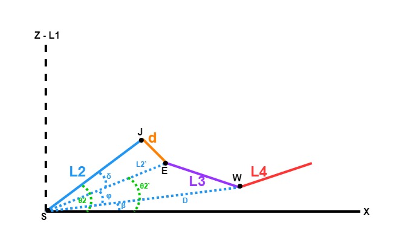

Let orientation angle from shoulder joint pointing to wrist point be:

$$
\beta = \operatorname{atan2}(b, a)
$$

Auxiliary angle be:

$$
\phi = \arccos\left(
\frac{L_2'^2 + D^2 - L_3^2}{2L_2'D}
\right)
$$

Then absolute orientation angle of equivalent second link is:

$$
\theta_2' = \beta + \phi
$$

Simultaneously combining correction angle relationship:

$$
\theta_2 = \theta_2' + \delta
$$

Yielding:

$$
\theta_2 = \beta + \phi + \delta
$$


Absolute direction of third link can be written as:
$$
\theta_2 + \theta_3
$$

Or as:

$$
\theta_2' + \gamma
$$

Simultaneously equating:

$$
\theta_2 + \theta_3 = \theta_2' + \gamma
$$

And:

$$
\theta_2 = \theta_2' + \delta
$$

Simplifying yields:

$$
\theta_3 = \gamma - \delta
$$

Up to this point, β, φ, γ, and δ remain auxiliary geometric quantities in the equivalent triangle, not actual joint angles needed by the controller. Therefore, angle recovery must be performed to remap angle relationships in the equivalent model back to θ2, θ3, and θ4 in the real mechanical structure.

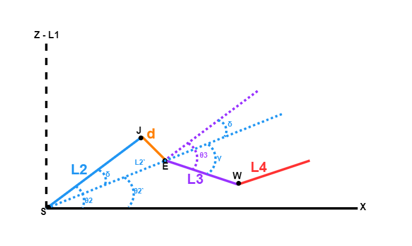

Finally, from pose constraint:

$$
\alpha = \theta_2 + \theta_3 + \theta_4
$$

Simultaneously solving yields:

$$
\theta_4 = \alpha - \theta_2 - \theta_3
$$

Angle recovery is required because the law of cosines directly provides only equivalent geometric relationships, whereas real robotic arm structures also involve offset correction angle δ and end-effector pose constraint α = θ2 + θ3 + θ4. Only by simultaneously equating these constraints again can executable inverse kinematics solutions be formed from geometric angles in equivalent triangles into joint angles in real mechanical structures.


## 3.4 Forward Kinematics Analysis

### 3.4.1 Forward Kinematics Introduction

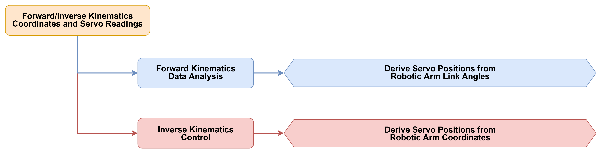

* **Forward Kinematics Overview**

Forward kinematics refers to the process of deriving end-effector motion from robot joint motions, calculating position and pose information of the end-effector from robot joint coordinates.

Forward kinematics is easier to comprehend and implement because it calculates end-effector position and pose directly from joint motions. In robot control, forward kinematics is widely applied in trajectory planning, simulation, and visualization.

* **Basic Principles of Forward Kinematics**

Forward kinematics of a robotic arm is typically expressed in the following function form:


It demonstrates that end-effector pose is a function based on joint coordinates. When homogeneous transformations are used, its expression is given by the simple product of single-link transformation matrices in equation 2. For N robotic arms:


For any robotic arm, forward kinematics solutions can be calculated regardless of joint numbers and arrangements. Practically useful task space for robotic arms is three-dimensional. Controlling robotic arm motion requires supplying each joint with a specific voltage control signal to rotate them by specific angles and achieve desired pose states. For a 6-axis robotic arm, the total matrix transformation is typically written as T6.

### 3.4.2 NexArm Forward Kinematics Analysis

Homogeneous transformation matrix form:

$$
{}^{i-1}_{i}T=
\begin{bmatrix}
\cos\theta_i & -\sin\theta_i & 0 & a_{i-1} \\
\sin\theta_i\cos\alpha_{i-1} & \cos\theta_i\cos\alpha_{i-1} & -\sin\alpha_{i-1} & -\sin\alpha_{i-1}d_i \\
\sin\theta_i\sin\alpha_{i-1} & \cos\theta_i\sin\alpha_{i-1} & \cos\alpha_{i-1} & \cos\alpha_{i-1}d_i \\
0 & 0 & 0 & 1
\end{bmatrix}
$$

Homogeneous transformation matrix for each individual joint of NexArm:

$$
T_{0}^{1}=
\begin{bmatrix}
\cos\theta_1 & -\sin\theta_1 & 0 & 0 \\
\sin\theta_1 & \cos\theta_1 & 0 & 0 \\
0 & 0 & 1 & 0 \\
0 & 0 & 0 & 1
\end{bmatrix}
$$

$$
T_{1}^{2}=
\begin{bmatrix}
\cos\theta_2 & -\sin\theta_2 & 0 & 0 \\
0 & 0 & 1 & 0 \\
-\sin\theta_2 & -\cos\theta_2 & 0 & 0 \\
0 & 0 & 0 & 1
\end{bmatrix}
$$

$$
T_{2}^{3}=
\begin{bmatrix}
\cos\theta_3 & -\sin\theta_3 & 0 & a_2 \\
\sin\theta_3 & \cos\theta_3 & 0 & 0 \\
0 & 0 & 1 & 0 \\
0 & 0 & 0 & 1
\end{bmatrix}
$$

$$
T_{3}^{4}=
\begin{bmatrix}
\cos\theta_4 & -\sin\theta_4 & 0 & a_3 \\
\sin\theta_4 & \cos\theta_4 & 0 & 0 \\
0 & 0 & 1 & 0 \\
0 & 0 & 0 & 1
\end{bmatrix}
$$

$$
T_{4}^{5}=
\begin{bmatrix}
\cos\theta_5 & -\sin\theta_5 & 0 & 0 \\
0 & 0 & 1 & 0 \\
-\sin\theta_5 & -\cos\theta_5 & 0 & 0 \\
0 & 0 & 0 & 1
\end{bmatrix}
$$

Multiplying homogeneous coordinates of single joints yields the forward kinematics formula of NexArm:

$$
T_{0}^{5}=T_{0}^{1}T_{1}^{2}T_{2}^{3}T_{3}^{4}T_{4}^{5}
$$

Since Servos 5, 4, and 3 on the robotic arm all rotate horizontally, simplification can be performed via product-to-sum formulas:

$$
\theta_2+\theta_3+\theta_4=0
$$

$$
\cos(\theta_2+\theta_3+\theta_4)=1
$$

$$
\sin(\theta_2+\theta_3+\theta_4)=0
$$

According to geometric relationships between robotic arm joints:

$$
T_{1}^{4}=
\begin{bmatrix}
1 & 0 & 0 & a_2\cos\theta_2+a_3\cos(\theta_2+\theta_3) \\
0 & 0 & 1 & 0 \\
0 & -1 & 0 & -a_2\sin\theta_2-a_3\sin(\theta_2+\theta_3) \\
0 & 0 & 0 & 1
\end{bmatrix}
$$

Robotic arm kinematics formula is obtained as follows:

$$
T_{0}^{5}=
\begin{bmatrix}
\cos\theta_1\cos\theta_5-\sin\theta_1\sin\theta_5 & -\cos\theta_1\sin\theta_5-\sin\theta_1\cos\theta_5 & 0 & \cos\theta_1\left(a_2\cos\theta_2+a_3\cos(\theta_2+\theta_3)\right) \\
\sin\theta_1\cos\theta_5+\cos\theta_1\sin\theta_5 & -\sin\theta_1\sin\theta_5+\cos\theta_1\cos\theta_5 & 1 & \sin\theta_1\left(a_2\cos\theta_2+a_3\cos(\theta_2+\theta_3)\right) \\
0 & 0 & -1 & -a_2\sin\theta_2-a_3\sin(\theta_2+\theta_3) \\
0 & 0 & 0 & 1
\end{bmatrix}
$$

### 3.4.3 Introduction to Forward Kinematics Services

> [!NOTE]
>
> **Before starting the robotic arm, be sure to fix the base of the robotic arm to the desktop or a stable platform using a G clamp. Swinging and inertia will occur when the robotic arm starts up and runs. Failure to fix the base may cause the equipment to tip over, fall, or get damaged, potentially posing safety risks.**


* **View Kinematics Services**

1. Power on the robotic arm and connect it to the remote control software **VNC**. Refer to [1. Tutorials / 1. NexArm User Manual / 1.5 Development Environment Setup and Configuration](https://drive.google.com/drive/folders/1E_TRpBIkzi_glH7KCmwj_b4I6jDOFO-Z?usp=sharing).

2. Click the command terminal icon  on the system interface to open the command line terminal. Enter the command to disable the app auto-start service.

```
~/.stop_ros.sh
```

3. Then enter the command to launch the robotic arm SDK file.

```
ros2 launch sdk nexarm.launch.py
```

4. Open a new command line terminal and enter the command to view kinematics services of the robotic arm.

```
ros2 service list
```

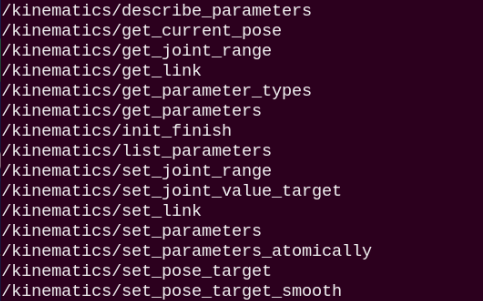

| **Service** | **Function Description** |
|:--:|:--:|
| `/kinematics/describe_parameters` | Describe parameters |
| `/kinematics/get_current_pose` | Get current robot pose information |
| `/kinematics/get_joint_range` | Get motion range of each robot joint |
| `/kinematics/get_link` | Get robot joint link information |
| `/kinematics/get_parameter_types` | Get parameter types |
| `/kinematics/get_parameters` | Get parameters |
| `/kinematics/init_finish` | Initialization complete |
| `/kinematics/list_parameters` | List parameters |
| `/kinematics/set_joint_range` | Set motion range of robot joints |
| `/kinematics/set_joint_value_target` | Set target joint angle values of robot for pose control |
| `/kinematics/set_link` | Set robot joint link information |
| `/kinematics/set_parameters` | Set parameters |
| `/kinematics/set_parameters_atomically` | Atomically set parameters |
| `/kinematics/set_pose_target` | Set target pose of robot end-effector |
| `/kinematics/set_pose_target_smooth` | Smoothly set target pose of robot end-effector |

### 3.4.4 Servo Control via Services

> [!NOTE]
>
> * **Before starting the robotic arm, be sure to fix the base of the robotic arm to the desktop or a stable platform using a G clamp. Swinging and inertia will occur when the robotic arm starts up and runs. Failure to fix the base may cause the equipment to tip over, fall, or get damaged, potentially posing safety risks.**
>
> * **This section introduces two usage methods for NexArm forward kinematics services: service calls and running examples via launch files. The essence of both is to calculate coordinates and pose of the robotic arm end-effector based on joint angles and output results in the terminal.**

**(1) Control via Service Calls**

1. Click the command terminal icon  on the system interface to open the command line terminal. Enter the command to disable the app auto-start service.

```
~/.stop_ros.sh
```

2. Then enter the command to launch the robotic arm SDK file.

```
ros2 launch sdk nexarm.launch.py
```

3. Open a new command line terminal and enter the command.

```sh
ros2 service call /ros_robot_controller/arm/get_fk ros_robot_controller_msgs/srv/GetArmFK "{claw: 0.0, j1: 0.0, j2: 0.0, j3: 0.0, j4: 0.0, roll: 0.0}"
```

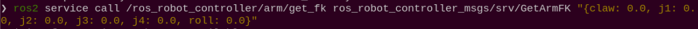

Six configurable request parameters can be obtained:

- `j1`: Base rotation angle in degrees.
- `j2`: Robotic arm Joint 2 angle in degrees.
- `j3`: Robotic arm Joint 3 angle in degrees.
- `j4`: Robotic arm Joint 4 angle in degrees.
- `roll`: End-effector rotation angle in degrees.
- `claw`: Gripper angle in degrees.

All parameters in this command are `0.0`, representing computation of spatial position and pose corresponding to the end-effector when `j1`, `j2`, `j3`, `j4`, `roll`, and `claw` of the robotic arm are all `0` degrees.

2. Robotic arm pose information can be obtained: when all joint angles of the robotic arm are set to 0.0 degrees, the forward kinematics service calculates the end-effector position as (500.0, 0.0, 73.0) mm, end-effector posture as `pitch = 0.0` degrees and `roll = 0.0` degrees, and gripper angle as 0.0 degrees.

> [!NOTE]
>
> **Service calls here only display pose information without moving the robotic arm.**

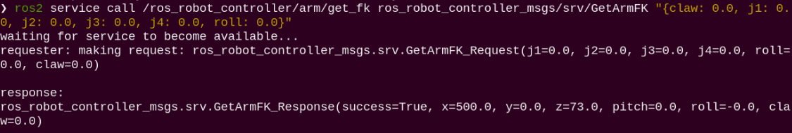

3. To stop the program, press **Ctrl+C**. If program termination fails, press it repeatedly.

**(2) Control via Launch File**

1. Click the command terminal icon  on the system interface to open the command line terminal. Enter the command to disable the app auto-start service.


```
~/.stop_ros.sh
```

2. Then enter the command to start the forward kinematics service call program. Related information can be viewed in the terminal.

```
ros2 launch example fk.launch.py
```

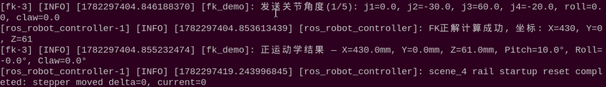

> [!NOTE]
>
> **Service calls here only display pose information without moving the robotic arm.**

3. To stop the program, press **Ctrl+C**. If program termination fails, press it repeatedly.

### 3.4.5 Program Analysis

* **Launch File Analysis**

The launch file is located at:

**/home/ubuntu/ros2_ws/src/example/example/simple/fk.launch.py**

(1) `generate_launch_description` Function

```py
def generate_launch_description():
    compiled = os.environ.get('need_compile', 'False')
    
    if compiled == 'True':
        sdk_package_path = get_package_share_directory('sdk')
    else:
        sdk_package_path = '/home/ubuntu/ros2_ws/src/driver/sdk'

    sdk_launch = IncludeLaunchDescription(
        PythonLaunchDescriptionSource([
            os.path.join(sdk_package_path, 'launch/nexarm.launch.py')
        ]),
    )
    
    fk_node = Node(
        package='example',
        executable='fk',
        output='screen',
    )

    return LaunchDescription([
        sdk_launch,
        fk_node
    ])
```

Includes launch file **launch/nexarm.launch.py** in package `sdk` to start underlying robotic arm control nodes. Defines node `fk_node` to run executable `fk` in package **example** to demonstrate forward kinematics service calls.

(2) Main Program

```py
if __name__ == '__main__':
    
    ld = generate_launch_description()

    ls = LaunchService()
    ls.include_launch_description(ld)
    ls.run()
```

Creates a `LaunchDescription` object and a `LaunchService` service, adds launch description to launch service, and runs it to start the entire system.

* **Python File Analysis**

The Python file is located at: **/home/ubuntu/ros2_ws/src/example/example/simple/include/fk.py**

(1) Package Import

```py
import rclpy
from rclpy.node import Node
from ros_robot_controller_msgs.srv import GetArmFK
```

`rclpy` is used to create ROS 2 Python nodes. `Node` is the ROS 2 node base class. `GetArmFK` is the forward kinematics service type used to calculate robotic arm end-effector coordinates and pose from joint angles.

2. Initialize Node

```py
class FkDemo(Node):
    def __init__(self):
        super().__init__('fk_demo')
        self.fk_client = self.create_client(GetArmFK, '/ros_robot_controller/arm/get_fk')
        self.fk_client.wait_for_service()
        self.max_attempts = 5
        self.attempt = 0
        self.retry_timer = None
        self.timer = self.create_timer(8.0, self.run_demo)
```

Initializes ROS node named `fk_demo`. Creates service client `/ros_robot_controller/arm/get_fk` to call forward kinematics calculation services provided by the underlying controller. The program waits for service startup completion and sets maximum retry attempts to `5`. A timer delays triggering forward kinematics examples to avoid executing before the controller is fully ready.

3. Send Forward Kinematics Request

```py
def send_fk_request(self):
    self.attempt += 1
    req = GetArmFK.Request()
    req.j1 = 0.0
    req.j2 = -30.0
    req.j3 = 60.0
    req.j4 = -20.0
    req.roll = 0.0
    req.claw = 0.0

    future = self.fk_client.call_async(req)
    future.add_done_callback(self.fk_result_callback)
```

Constructs a forward kinematics service request and sets robotic arm joint angles and end parameters. `j1` to `j4` represent main joint angles of the robotic arm, `roll` represents end rotation angle, and `claw` represents gripper angle, all in degrees. Subsequently calls the forward kinematics service asynchronously.

4. Process Forward Kinematics Results

```py
def fk_result_callback(self, future):
    res = future.result()
    if res.success:
        self.get_logger().info(
            f'Forward kinematics result — X={res.x:.1f}mm, Y={res.y:.1f}mm, Z={res.z:.1f}mm, '
            f'Pitch={res.pitch:.1f}°, Roll={res.roll:.1f}°, Claw={res.claw:.1f}°'
        )
    elif self.attempt < self.max_attempts:
        self.get_logger().warn('Forward kinematics calculation failed, waiting for controller parameters to retry')
        self.retry_timer = self.create_timer(2.0, self.retry_fk_request)
    else:
        self.get_logger().error('Forward kinematics calculation failed')
```

Upon successful service response, terminal outputs `X`, `Y`, and `Z` coordinates of robotic arm end-effector alongside `Pitch`, `Roll`, and `Claw` pose information. If computation fails, the program retries up to `5` times.

(5) Main Function

```py
def main(args=None):
    rclpy.init(args=args)
    node = FkDemo()
    rclpy.spin(node)
    node.destroy_node()
    rclpy.shutdown()
```

Creates node `FkDemo` and maintains node execution via `rclpy.spin`.

## 3.5 Inverse Kinematics Analysis

### 3.5.1 Introduction to Inverse Kinematics


* **Inverse Kinematics Overview**

Inverse kinematics is the process of determining parameters of movable joint objects required to achieve a desired posture.

Inverse kinematics solving for robotic arms forms an important foundation for trajectory planning and control. Whether inverse kinematics resolution is fast and accurate directly impacts precision of trajectory planning and control. Therefore, designing a fast and accurate inverse kinematics solution method for 6DOF robotic arms is of high significance.

* **Analysis of Inverse Kinematics**

For robotic arms, inverse kinematics means finding rotation angles of each joint after position and orientation of the end-effector are given. Three-dimensional motion of robotic arms is relatively complex. To simplify the model, removing rotation joints of the lower pan-tilt allows kinematics analysis within a two-dimensional plane.

Performing inverse kinematics analysis generally requires large amounts of matrix operations, presenting complex processes and heavy computations. To better suit practical needs, geometric methods are utilized to analyze robotic arms.


Simplifying the robotic arm model by removing the base pan-tilt and end-effector yields the main body of the robotic arm. As shown above, coordinates (x, y) of endpoint P on the robotic arm are composed of three parts: x1 + x2 + x3 and y1 + y2 + y3.

Angles θ1, θ2, and θ3 in the figure are servo angles to be solved, and α is the angle of gripper relative to the horizontal plane. From the figure, pitch angle α of the gripper equals θ1 + θ2 + θ3, based on which equations can be listed as follows:

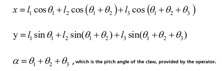

Where x and y are specified, while l1, l2, and l3 are inherent mechanical structure properties of the robotic arm.

Angles of three servos can be solved, after which controlling servos based on angles achieves coordinate position control.

### 3.5.2 NexArm Inverse Kinematics Analysis

Define point W as the starting point of third link, which is the position of Joint 2. Since length of third link is l3 and orientation angle is α:

$$
x_w = x - l_3\cos\alpha,\qquad y_w = y - l_3\sin\alpha
$$

Coordinates of point W are determined by the first two links:

$$
x_w = l_1\cos\theta_1 + l_2\cos(\theta_1+\theta_2)
$$

$$
y_w = l_1\sin\theta_1 + l_2\sin(\theta_1+\theta_2)
$$

Yielding:

$$
d=\sqrt{x_w^2+y_w^2}
$$

$$
\cos\theta_2=\frac{d^2-l_1^2-l_2^2}{2l_1l_2}
$$

$$
\theta_2=\pm\arccos\left(\frac{d^2-l_1^2-l_2^2}{2l_1l_2}\right)
$$

Define φ as orientation angle of point W:

$$
\phi=\operatorname{atan2}(y_w,x_w)
$$

$$
\beta=\operatorname{atan2}(l_2\sin\theta_2,l_1+l_2\cos\theta_2)
$$

Yielding:

$$
\theta_1=\phi-\beta
$$

$$
\theta_3=\alpha-\theta_1-\theta_2
$$

### 3.5.3 Introduction to Inverse Kinematics Services
> [!NOTE]
>
> **Before starting the robotic arm, be sure to fix the base of the robotic arm to the desktop or a stable platform using a G clamp. Swinging and inertia will occur when the robotic arm starts up and runs. Failure to fix the base may cause the equipment to tip over, fall, or get damaged, potentially posing safety risks.**

* **View Kinematics Services**

1. Power on the robotic arm and connect it to the remote control software **VNC**. Refer to [1. Tutorials / 1. NexArm User Manual / 1.5 Development Environment Setup and Configuration](https://drive.google.com/drive/folders/1E_TRpBIkzi_glH7KCmwj_b4I6jDOFO-Z?usp=sharing).

2. Click the command terminal icon  on the system interface to open the command line terminal. Enter the command to disable the app auto-start service.

```
~/.stop_ros.sh
```

3. Enter the command to launch the robotic arm SDK file.

```
ros2 launch sdk nexarm.launch.py
```

4. Open a new command line terminal  and enter the command to view kinematics services of the robotic arm.

```
ros2 service list
```


| **Service** | **Function Description** |
|:--:|:--:|
| `/kinematics/describe_parameters` | Describe parameters |
| `/kinematics/get_current_pose` | Get current robot pose information |
| `/kinematics/get_joint_range` | Get motion range of each robot joint |
| `/kinematics/get_link` | Get robot joint link information |
| `/kinematics/get_parameter_types` | Get parameter types |
| `/kinematics/get_parameters` | Get parameters |
| `/kinematics/init_finish` | Initialization complete |
| `/kinematics/list_parameters` | List parameters |
| `/kinematics/set_joint_range` | Set motion range of robot joints |
| `/kinematics/set_joint_value_target` | Set target joint angle values of robot for pose control |
| `/kinematics/set_link` | Set robot joint link information |
| `/kinematics/set_parameters` | Set parameters |
| `/kinematics/set_parameters_atomically` | Atomically set parameters |
| `/kinematics/set_pose_target` | Set target pose of robot end-effector |
| `/kinematics/set_pose_target_smooth` | Smoothly set target pose of robot end-effector |

### 3.5.4 Servo Control via Services

> [!NOTE]
>
> * **Before starting the robotic arm, be sure to fix the base of the robotic arm to the desktop or a stable platform using a G clamp. Swinging and inertia will occur when the robotic arm starts up and runs. Failure to fix the base may cause the equipment to tip over, fall, or get damaged, potentially posing safety risks.**
>
> * **This section introduces two usage methods for NexArm inverse kinematics services: service calls and running examples via launch files. The essence of both is to solve joint or servo parameters backwards based on end target coordinates and pose and output results in the terminal.**


* **Control via Service Calls**

1. Click the command terminal icon  on the system interface to open the command line terminal. Enter the command to disable the app auto-start service.


```
~/.stop_ros.sh
```

2. Then enter the command to launch the robotic arm SDK file.

```
ros2 launch sdk nexarm.launch.py
```

3. Open a new command line terminal and enter the command.

```
ros2 service call /ros_robot_controller/arm/get_ik ros_robot_controller_msgs/srv/GetArmIK "{x: 200.0, y: 0.0, z: 200.0, roll: 0.0, pitch: 0.0, claw: 0.0}"
```

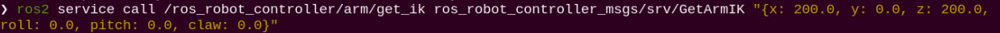

Six parameters can be configured:

- `x`: X-axis coordinate of end target point in `mm`
- `y`: Y-axis coordinate of end target point in `mm`
- `z`: Z-axis coordinate of end target point in `mm`
- `pitch`: End pitch angle in degrees
- `roll`: End rotation angle in degrees
- `claw`: Gripper angle in degrees

This result indicates: when robotic arm end target pose is set to `x = 200.0 mm`, `y = 0.0 mm`, `z = 200.0 mm`, `pitch = 0.0` degrees, `roll = 0.0` degrees, and `claw = 0.0` degrees, the inverse kinematics service successfully calculates corresponding servo pulse width values as `[2048, 2088, 1198, 1238, 2048, 2048]`.

Input coordinates and pose intended for the robotic arm end-effector to reach, and the system solves backwards which position each servo should be set to.

> [!NOTE]
>
> **If the target position and angle set cannot be reached by the robotic arm, the terminal will not display corresponding servo information. Service calls here only display pose information without moving the robotic arm.**

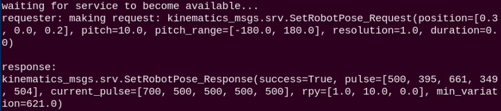

* **Control via Launch File**

1. Click the command terminal icon  on the system interface to open the command line terminal. Enter the command to disable the app auto-start service.

```
~/.stop_ros.sh
```

2. Then enter the command to start the inverse kinematics service call program. Related information can be viewed in the terminal.

```
ros2 launch example ik.launch.py
```

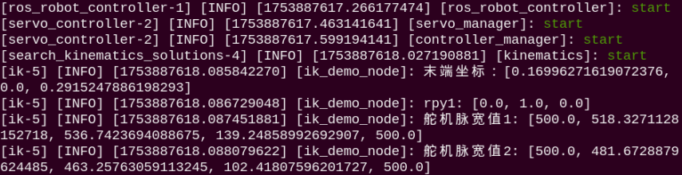

### 3.5.5 Program Analysis

* **Launch File Analysis**

The launch file is located at:

**/home/ubuntu/ros2_ws/src/example/example/simple/ik.launch.py**

(1) `generate_launch_description` Function

```py
def generate_launch_description():
    compiled = os.environ.get('need_compile', 'False')

    if compiled == 'True':
        sdk_package_path = get_package_share_directory('sdk')
    else:
        sdk_package_path = '/home/ubuntu/ros2_ws/src/driver/sdk'

    sdk_launch = IncludeLaunchDescription(
        PythonLaunchDescriptionSource([
            os.path.join(sdk_package_path, 'launch/nexarm.launch.py')
        ]),
    )

    ik_node = Node(
        package='example',
        executable='ik',
        output='screen',
    )

    return LaunchDescription([
        sdk_launch,
        ik_node
    ])
```

Includes launch file **launch/nexarm.launch.py** in package `sdk` to start underlying robotic arm control nodes. Defines node `ik_node` to execute executable `ik` in package **example** to demonstrate inverse kinematics service calls.

* **Python File Analysis**

The Python file is located at: **/home/ubuntu/ros2_ws/src/example/example/simple/include/ik.py**

(1) Package Import

```py
import rclpy
from rclpy.node import Node
from std_srvs.srv import Trigger
from ros_robot_controller_msgs.srv import GetArmIK
```

`GetArmIK` is the inverse kinematics service type used to calculate corresponding servo control parameters backwards based on robotic arm end target coordinates and pose.

2. Initialize Node

```py
class IkDemo(Node):
    def __init__(self):
        super().__init__('ik_demo')
        self.ik_client = self.create_client(GetArmIK, '/ros_robot_controller/arm/get_ik')
        self.ik_client.wait_for_service()
        self.max_attempts = 5
        self.attempt = 0
        self.retry_timer = None
        self.timer = self.create_timer(8.0, self.run_demo)
```

Initializes ROS node named `ik_demo`. Creates service client `/ros_robot_controller/arm/get_ik` to call inverse kinematics computation services provided by the underlying controller. After waiting for service startup completion, the program triggers example requests via a timer.

3. Send Inverse Kinematics Request

```py
def send_ik_request(self):
    self.attempt += 1
    req = GetArmIK.Request()
    req.x = 200.0
    req.y = 0.0
    req.z = 100.0
    req.pitch = -90.0
    req.roll = 0.0
    req.claw = 0.0

    future = self.ik_client.call_async(req)
    future.add_done_callback(self.ik_result_callback)
```

Constructs an inverse kinematics service request and sets robotic arm end target coordinates and pose. `x`, `y`, and `z` represent end target coordinates in `mm`. `pitch` represents end pitch angle, `roll` represents end rotation angle, and `claw` represents gripper angle, all in degrees.

4. Process Inverse Kinematics Results

```py
def ik_result_callback(self, future):
    res = future.result()
    if res.success:
        self.get_logger().info(f'Inverse kinematics result — servo pulse widths: {list(res.servos)}')
    elif self.attempt < self.max_attempts:
        self.get_logger().warn('Inverse kinematics calculation failed, waiting for controller parameters to retry')
        self.retry_timer = self.create_timer(2.0, self.retry_ik_request)
    else:
        self.get_logger().error('Inverse kinematics calculation failed (target position out of workspace)')
```

Upon successful service response, terminal outputs array of servo pulse widths calculated by inverse kinematics. If target position exceeds achievable range of the robotic arm or underlying kinematics parameters are not yet ready, the program prompts computation failure and automatically retries within allowed attempts.

(5) Main Function

Main function starts node.

```py
def main(args=None):
    rclpy.init(args=args)
    node = IkDemo()
    rclpy.spin(node)
    node.destroy_node()
    rclpy.shutdown()
```

Initializes ROS 2, creates node `IkDemo`, and maintains node execution via `rclpy.spin`. Node is destroyed and ROS 2 is shut down upon program termination.
