# 4. OpenCV Vision Courses

<p id ="p6-1"></p>

## 4.1 Positioning and Gripping

### 4.1.1 Camera Invocation

In the robotic arm, the camera acts as its **eyes**. When performing gripping tasks, the wooden blocks must first be seen through the camera before further calculations can be made to achieve gripping and placing by the robotic arm.

* **Start the Camera Control Node**

> [!NOTE]
>
> * **Command input must be strictly case-sensitive. The Tab key can be pressed to autocomplete keywords.**
>
> * **Before starting the robotic arm, ensure the base of the robotic arm is secured to the desktop or a stable platform using a G clamp. The robotic arm will generate swing and inertia during operation. If not secured, this may cause the device to tip over, fall, or get damaged, and may also pose a safety risk.**
>
> * **This application must be run in conjunction with the robotic arm map. Please lay the map flat within the working range of the robotic arm and place it in the direction indicated in the tutorial, ensuring that the map markers, color areas, and classification areas are not obstructed or misaligned.**

1. Start the robotic arm and connect it to the remote control software **VNC**. For instructions on how to connect to the remote desktop, refer to [1. Tutorials / 1. NexArm User Manual / 1.5 Development Environment Setup and Configuration](https://wiki.hiwonder.com/projects/NexArm/en/ros-version/docs/1.%20NexArm%20User%20Manual.html#_1-5-development-environment-setup-and-configuration).

2. Click the command line terminal  on the system interface to open the command bar. Enter the command to stop the app auto-start service.

```
~/.stop_ros.sh
```

3. Enter the command to start the camera file.

```
ros2 launch example camera_topic_invoke.launch.py
```

4. If it is necessary to close this application, press **Ctrl+C** in the terminal interface. If it fails to close, press it multiple times.


* **Program Outcome**

At this time, the return image of the camera can be seen.

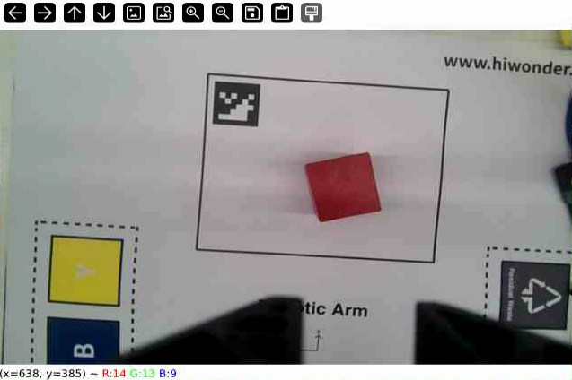

* **Program Analysis**

(1) Launch File Analysis

The launch startup file path is located at: **/home/ubuntu/ros2_ws/src/example/example/opencv/camera_topic_invoke.launch.py**

① `launch_setup` function

```py
def launch_setup(context):
    compiled = os.environ['need_compile']
    camera_type = os.environ['CAMERA_TYPE']
    if compiled == 'True':
        peripherals_package_path = get_package_share_directory('peripherals')
        example_package_path = get_package_share_directory('example')
    else:
        peripherals_package_path = '/home/ubuntu/ros2_ws/src/peripherals'
        example_package_path = '/home/ubuntu/ros2_ws/src/example'
    depth_camera_launch = IncludelaunchDescription(
        PythonlaunchDescriptionSource(
            os.path.join(peripherals_package_path, 'launch/depth_camera.launch.py')),
    )        

    color_detect_node = Node(
        package='example',
        executable='camera_topic_invoke',
        output='screen',        
    )

    return [depth_camera_launch,
            color_detect_node,
            ]
```

Start the camera launch file, which is used to start the depth camera related nodes. Define the `color_detect_node` node and start the `camera_topic_invoke` executable file in the **example** package.

② `generate_launch_description` function

```py
def generate_launch_description():
    return launchDescription([
        OpaqueFunction(function = launch_setup)
    ])
```

Create and return a `launchDescription` object. This object defines all nodes and configurations in the startup process.

③ Main program

```py
if __name__ == '__main__':
    # Create a launchDescription object
    ld = generate_launch_description()

    ls = launchService()
    ls.include_launch_description(ld)
    ls.run()
```

Create a `launchDescription` object and a `launchService` service, add the startup description to the startup service and `run` it to realize the function of starting the entire system.

(2) Python File Analysis

The source file is located at: **/home/ubuntu/ros2_ws/src/example/example/opencv/include/camera_topic_invoke.py**

① `Camera` class

**Initialization function**

```py
    def __init__(self, name):
        rclpy.init()
        super().__init__(name)
        self.name = name
        self.image = None
        self.running = True
        self.image_sub = None

        self.image_queue = queue.Queue(maxsize=2)
        
        # Create a CvBridge object for conversion between ROS Image messages and OpenCV images
        self.bridge = CvBridge()

        # Register Ctrl+C interrupt signal handler
        signal.signal(signal.SIGINT, self.shutdown)

        # Image subscriber
        self.image_sub = self.create_subscription(Image, '/depth_cam/rgb/image_raw', self.image_callback, 1)
        
        threading.Thread(target=self.image_processing, daemon=True).start()
```

Initialize the ROS node, create an image queue and a `CvBridge` object for converting ROS image and OpenCV image formats, register an interrupt signal handler, subscribe to the `/depth_cam/rgb/image_raw` image topic, and start the image processing thread.

② `image_processing` function

```py
    def image_processing(self):
        while self.running:
            self.image = self.image_queue.get()
            if self.running and self.image is not None:
            #Display image
                cv2.imshow('image', self.image)
                cv2.waitKey(1)
```

This function continuously gets image data from the `self.image_queue` queue. The queue size is limited to 2. When the queue is full, the oldest image will be discarded. Use OpenCV's `cv2.imshow()` to display the image.

③ `shutdown` function

```py
    def shutdown(self, signum, frame):
        self.get_logger().info("Shutting down...")
        self.running = False
        rclpy.shutdown()
```

Respond to the **Ctrl+C** interrupt signal, set the running flag to `False` and close ROS.

④ `image_callback` function

```py
    # Process ROS Image message and convert to OpenCV format
    def image_callback(self, ros_image):
        try:
            # Convert ROS Image message to OpenCV image
            self.image = self.bridge.imgmsg_to_cv2(ros_image, "bgr8")

            if self.image_queue.full():
            # If queue is full, discard oldest image
                self.image_queue.get()
        # Put image into queue
            self.image_queue.put(self.image)

            # if self.running and self.image is not None:
                # Display image
                # cv2.imshow('image', self.image)
                # cv2.waitKey(1)
        except Exception as e:
            self.get_logger().error(f"Error converting image: {e}")
```

Image topic callback function. Convert the received ROS image message to OpenCV format and cache it through a queue discarding old images when full for subsequent processing and display.

⑤ `main` function

```py
def main():
    camera_node = Camera('camera_topic_invoke')
    rclpy.spin(camera_node)
    camera_node.destroy_node()
    rclpy.shutdown()
```

Create a `Camera` node instance, start the spin loop of the ROS node processing callbacks, destroy the node and close ROS when the program ends.

* **Intrinsic Parameter Calibration**

Since the camera lens itself is convex and concave, the obtained image will also be affected, resulting in distortion. `Camera` intrinsic, extrinsic, and distortion parameters can be obtained through camera calibration. After obtaining these parameters, the distorted image will be corrected, and a 3D scene can also be reconstructed through these parameters.

The Orbbec depth camera has been calibrated at the factory, so manual calibration is not required. To learn about the image calibration of the Orbbec depth camera, go to **5. `Camera` Basics Course** to view.

### 4.1.2 Color Space

The color space used by the robotic arm is the RGB color space. The introduction to the color space is shown below.

* **Color Space Introduction**

In the image information seen, each frame is actually composed of pixel points arranged by three color components: B, G, and R.

The color model, also known as color space, is a mathematical model that uses a set of numerical values to describe colors.

RGB image is a relatively common type of color space. In addition, there are some other color spaces. Commonly seen ones include GRAY color space grayscale image, Lab color space, XYZ color space, YCrCb color space, HSV color space, HLS color space, CIEL\*a\*b\* color space, CIEL\*u\*v\* color space, Bayer color space, etc.

Each color space has its own field of expertise in handling problems. Therefore, to process a specific problem more conveniently, color space type conversion is required.

**Color space type conversion refers to converting an image from one color space to another color space.** For example, when using OpenCV to process images, conversions between RGB color space and Lab color space might occur. When performing image feature extraction and distance calculation, the image is often first processed from RGB color space to grayscale color space. In some applications, it may be necessary to convert images in color space into binary images.

* **Common Color Space Types Learning**

(1) RGB Color Space

The RGB color space has the following properties:

1. It is an additive color space, where colors are obtained by linear combination of red R, green G, and blue B.

2. Object lighting will affect the values of each channel in this color space, and the three color channels are correlated. The above image can be split into R, G, and B components and observed to gain a deeper understanding of the color space.

From the figure below, it can be seen that by looking at the blue channel, the blue and white parts of the Rubik's cube in the second image under indoor lighting conditions look similar, but the first image has obvious differences. This non-uniformity makes color-based segmentation in this color space very difficult. In addition, there is an overall difference between the values of the two images. Therefore, the RGB color space has problems with uneven distribution of color values and mixing of chromaticity and brightness.

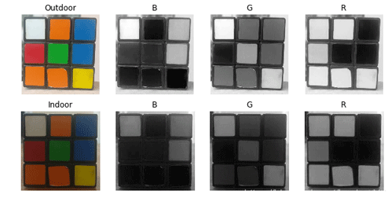

(2) Lab Color Space

Similar to the RGB space, Lab also has three image channels.

L: Lightness channel, representing brightness.

a: Color channel a, representing the color from green to magenta.

b: Color channel b, representing the color from blue to yellow.


The Lab color space is completely different from the RGB color space. In the RGB color space, color information is divided into three channels, but the same three channels also contain brightness information. On the other hand, in the Lab color space, the L channel is independent of color information and contains only brightness information. The other two channels encode colors.

L component: Represents pixel brightness. A larger L value indicates higher brightness.

a component: Represents the range from red to green.

b component: Represents the range from yellow to blue.

In OpenCV, the numerical range of R, G, and B in the RGB color space is `[0-255]`. The numerical range of L in the Lab color space is `[0-100]`. An L of 0 represents black, and 100 represents white. The numerical range of a and b is `[-128,127]`. When both a and b are 0, they represent gray.

To further assist in understanding the corresponding relationship between RGB and Lab, Photoshop software is used as an example to illustrate:

1. Use the Eyedropper Tool in Photoshop software to select the color to be picked.

2. Click the Color Picker at the bottom left to see the corresponding relationship between Lab and RGB as shown in the figure below:

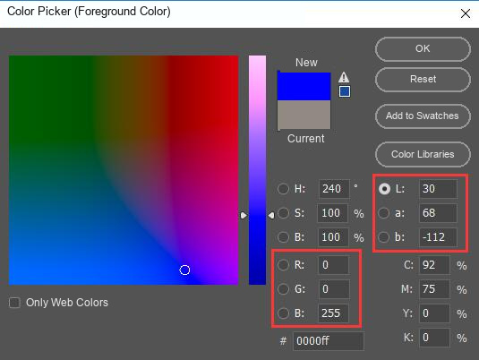

The Lab color space also has the following characteristics:

1. Perceptually uniform color space that approximates how colors are perceived.

2. Device-independent capture or display.

3. Widely used in Adobe Photoshop.

4. Related to the RGB color space through complex transformation equations. The result of reading an image in OpenCV and converting it to a Lab space image is shown in the figure below:


(3) YCrCb Color Space

The Human Visual System HVS is less sensitive to color than to brightness. In the traditional RGB color space, the three primary colors of RGB have equal importance, but brightness information is ignored.

In the YCrCb color space, Y represents the brightness of the light source, and chromaticity information is stored in Cr and Cb, where Cr represents the red component information and Cb represents the blue component information. Brightness gives information on how bright or dark the color is, which can be calculated by the weighted sum of intensity components in illumination. In an RGB light source, the green component has the largest impact, and the blue component has the smallest impact.


For illuminance changes, a similar observation can be made for LAB regarding intensity and color components. Compared with LAB, the perceived difference between red and orange in outdoor images is smaller, and white has changed in all 3 components.

(4) HSV Color Space

The HSV color space is a visual perception-oriented color model with the following three components:

H hue, S saturation, V value brightness.

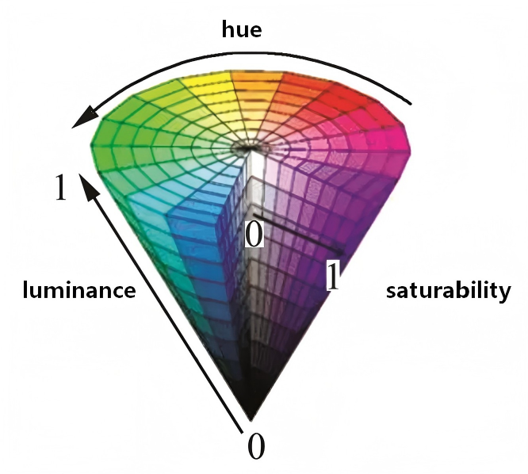

Hue: Hue is related to the `main` wavelength of light in the mixed spectrum. For example, red, orange, yellow, green, cyan, blue, and purple represent different hues respectively. If considered from the perspective of wavelength, lights of different wavelengths appear as different colors, which actually reflect the difference in hue.

Saturation: Refers to the relative purity, or the amount of white light mixed into a color. Pure spectral colors are fully saturated, while chromatic colors like deep red red plus white and pale purple purple plus white are undersaturated. Saturation is inversely proportional to the amount of white light added.

Brightness: Reflects the level of light and dark perceived by the human eye. This indicator is related to the reflectivity of an object. For a color, adding more white will increase its brightness, while adding more black will decrease its brightness.

The biggest feature of HSV is that it uses only one channel to describe color H, which makes specifying colors very intuitive. However, the HSV color depends on the device.

From the figure below it can be seen:


The H component is very similar in the two images, indicating that the color information is intact even under lighting changes.

The S component in the two images is also very similar. The V component represents brightness, so it changes due to lighting changes.

There is a huge difference between the values of the red outdoor and indoor images. This is because the H value uses angles to indicate red as the starting angle. Therefore, it may take values between angles `[300,360]` and `[0,60]`.

(5) Gray Color Space

The GRAY color space usually refers to grayscale images. A grayscale image is a monochrome image where each pixel ranges from black to white and is processed into 256 grayscale levels.

These 256 grayscale levels are respectively represented by numbers in the interval `[0,255]`, where 0 represents pure black, 255 represents white, and the numbers between 0 and 255 represent dark gray or light gray of different brightness i.e. Color depth.

### 4.1.3 Color Thresholding

* **Experiment Description**

By subscribing to camera image data, the obtained image is converted to the LAB color space. Then, color recognition can be performed through a specific color threshold. After matching the converted image with the color threshold, a binarized image is output. The color block corresponding to the color will appear white in the returned image, and other colors will appear black.

* **Operation Steps**

> [!NOTE]
>
> * **Command input must be strictly case-sensitive. The Tab key can be pressed to autocomplete keywords.**
>
> * **Before starting the robotic arm, ensure the base of the robotic arm is secured to the desktop or a stable platform using a G clamp. The robotic arm will generate swing and inertia during operation. If not secured, this may cause the device to tip over, fall, or get damaged, and may also pose a safety risk.**

1. Start the robotic arm and connect it to the remote control software **VNC**. For instructions on how to connect to the remote desktop, refer to [1. Tutorials / 1. NexArm User Manual / 1.5 Development Environment Setup and Configuration](https://wiki.hiwonder.com/projects/NexArm/en/ros-version/docs/1.%20NexArm%20User%20Manual.html#_1-5-development-environment-setup-and-configuration).

2. Click the command line terminal  on the system interface to open the command bar. Enter the command to stop the app auto-start service.

```
~/.stop_ros.sh
```

3. Enter the command to `run` the application and press **Enter**.

```
ros2 launch example color_threshold.launch.py
```

4. To close this application, press **Ctrl+C** in the terminal interface. If it fails to close, try repeatedly.

* **Program Outcome**

In the screen:

① `lab_image` LAB image converted from `RGB`

② `bgr_image` `BGR` color space image

③ `result_image` binarized image obtained after color threshold filtering.

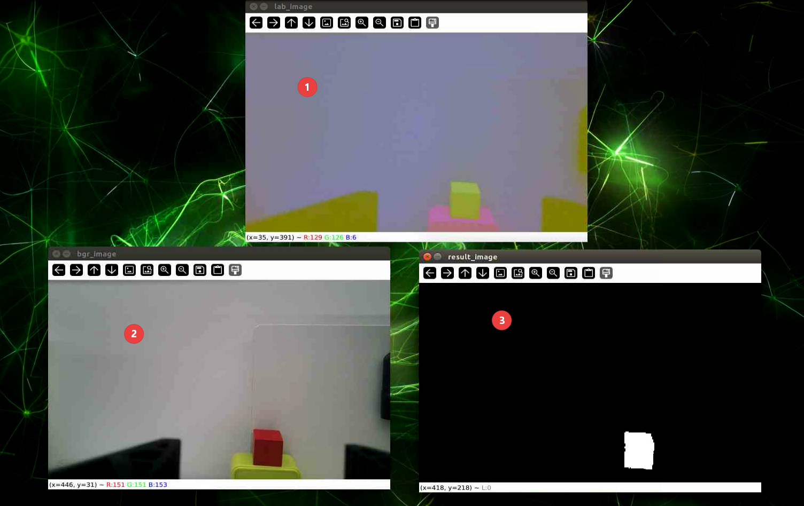

* **Program Analysis**

(1) Launch File Analysis

The launch startup file path is located at: **/home/ubuntu/ros2_ws/src/example/example/opencv/color_threshold.launch.py**

① `launch_setup` function

```py
def launch_setup(context):
    compiled = os.environ['need_compile']
    if compiled == 'True':
        peripherals_package_path = get_package_share_directory('peripherals')
        example_package_path = get_package_share_directory('example')
    else:
        peripherals_package_path = '/home/ubuntu/ros2_ws/src/peripherals'
        example_package_path = '/home/ubuntu/ros2_ws/src/example'
    depth_camera_launch = IncludelaunchDescription(
        PythonlaunchDescriptionSource(
            os.path.join(peripherals_package_path, 'launch/depth_camera.launch.py')),
    )

    color_threshold_node = Node(
        package='example',
        executable='color_threshold',
        output='screen',
    )

    return [depth_camera_launch,
            color_threshold_node,
            ]
```

Start the camera launch file, which is used to start the depth camera related nodes. Define the `color_threshold_node` node and start the `color_threshold` executable file in the **example** package.

② `generate_launch_description` function

```py
def generate_launch_description():
    return launchDescription([
        OpaqueFunction(function = launch_setup)
    ])
```

Create and return a `launchDescription` object. This object defines all nodes and configurations in the startup process.

③ Main program

```py
if __name__ == '__main__':
    # Create a launchDescription object
    ld = generate_launch_description()

    ls = launchService()
    ls.include_launch_description(ld)
    ls.run()
```

Create a `launchDescription` object and a `launchService` service, add the startup description to the startup service and `run` it to realize the function of starting the entire system.

(2) Python File Analysis

The source file is located at: **/home/ubuntu/ros2_ws/src/example/example/opencv/include/color_threshold.py**

① Imported Packages and Modules

```py
import cv2
import yaml
import rclpy
import queue
import threading
import numpy as np
from rclpy.node import Node
import sdk.common as common
from cv_bridge import CvBridge
from sensor_msgs.msg import Image
```

**common**: Custom module, used to provide some common functions, such as plane transformation, coordinate system conversion, etc., which is a module under the **/sdk/common** path.

② `Camera` class

**`__init__` method**

```py
class Camera(Node):
    def __init__(self, name):
        rclpy.init()
        super().__init__(name)
        self.name = name
        self.image = None
        self.running = True
        self.image_sub = None
        self.thread_started = False

        self.image_queue = queue.Queue(maxsize=2)
        self.data = common.get_yaml_data("/home/ubuntu/ros2_ws/src/app/config/lab_config.yaml")
        self.lab_data = self.data['/**']['ros__parameters']
        # Create a CvBridge object for conversion between ROS Image messages and OpenCV images
        self.bridge = CvBridge()
        self.target_color = "red"  # Set target color

        # Image subscriber
        self.image_sub = self.create_subscription(Image, '/depth_cam/rgb/image_raw', self.image_callback, 1)
```

Initialize the ROS node, create an image queue and a `CvBridge` object for converting ROS image and OpenCV image formats, load the LAB color space threshold configuration file, set the target detection color to red, subscribe to the `/depth_cam/rgb/image_raw` image topic, and mark the image processing thread as unstarted.

③ `image_callback` method

```py
    # Process ROS Image message and convert to OpenCV format
    def image_callback(self, ros_image):
        # Convert ROS Image message to OpenCV image
        bgr_image = self.bridge.imgmsg_to_cv2(ros_image, "bgr8")
        if self.image_queue.full():
            # If queue is full, discard oldest image
            try:
                self.image_queue.get_nowait() # Use get_nowait to avoid blocking
            except queue.Empty:
                pass # If queue is empty when checked, ignore exception
        # Put image into queue
        try:
            self.image_queue.put_nowait(bgr_image)  # Use put_nowait to avoid blocking
        except queue.Full:
            pass # If queue is full when checked, ignore exception
        if not self.thread_started:
            # Start thread only on first call
            threading.Thread(target=self.image_process, daemon=True).start()
            self.thread_started = True
```

Image topic callback function. Convert the received ROS image message to an OpenCV BGR format image, cache it through a queue non-blocking discard of old images when full, and start the image processing thread on the first call.

④ `image_process` method

```py
    def image_process(self):
        while self.running:
            try:
                bgr_image = self.image_queue.get(block=True, timeout=1) # Use try-except when calling get
            except queue.Empty:
                #print(self.get_name(), "image queue is empty!")
                continue 

            # Convert image color space to LAB
            lab_image = cv2.cvtColor(bgr_image, cv2.COLOR_BGR2LAB)

            # Set color threshold and binarize, default is red
            result_image = cv2.inRange(lab_image, np.array(self.lab_data['color_range_list'][self.target_color]['min']), np.array(self.lab_data['color_range_list'][self.target_color]['max']))

            # Publish processed image
            try:
                cv2.imshow('bgr_image', bgr_image)
                cv2.imshow('lab_image', lab_image)
                cv2.imshow('result_image', result_image)
                cv2.waitKey(1)
            except Exception as e:
                self.get_logger().warn(f"Image display error: {e}")
                continue
        print("image_process thread end")
```

Thread function. Loop to get images from the queue, convert BGR images to the LAB color space, perform binarization processing according to the threshold of the target color in the configuration file, and display the original image, LAB image, and threshold processing result image through OpenCV.

⑤ `main` function

```py
def main():
    camera_node = Camera('color_threshold')
    rclpy.spin(camera_node)
    camera_node.destroy_node()
    rclpy.shutdown()
```

Create a `Camera` node instance named `color_threshold`, start the spin loop of the ROS node processing callbacks, destroy the node and close ROS when the program ends.

### 4.1.4 Color Space Conversion

* **Experiment Description**

By subscribing to camera images, convert the color space of the obtained images and view images in different color spaces through the return screen.

* **Operation Steps**

> [!NOTE]
>
> * **Command input must be strictly case-sensitive. The Tab key can be pressed to autocomplete keywords.**
>
> * **Before starting the robotic arm, ensure the base of the robotic arm is secured to the desktop or a stable platform using a G clamp. The robotic arm will generate swing and inertia during operation. If not secured, this may cause the device to tip over, fall, or get damaged, and may also pose a safety risk.**

1. Start the robotic arm and connect it to the remote control software **VNC**. For instructions on how to connect to the remote desktop, refer to [1. Tutorials / 1. NexArm User Manual / 1.5 Development Environment Setup and Configuration](https://wiki.hiwonder.com/projects/NexArm/en/ros-version/docs/1.%20NexArm%20User%20Manual.html#_1-5-development-environment-setup-and-configuration).

2. Click the command line terminal  on the system interface to open the command bar. Enter the command to stop the app auto-start service.

```
~/.stop_ros.sh
```

3. Enter the command to `run` the application and press **Enter**.

```
ros2 launch example color_space.launch.py
```

4. To close this application, press **Ctrl+C** in the terminal interface. If it fails to close, try repeatedly.


* **Program Outcome**

In the screen:

① `lab_image` image converted from `RGB` to LAB color space

② `rgb_image` camera raw image

③ `bgr_image` `BGR` image converted from `RGB`.

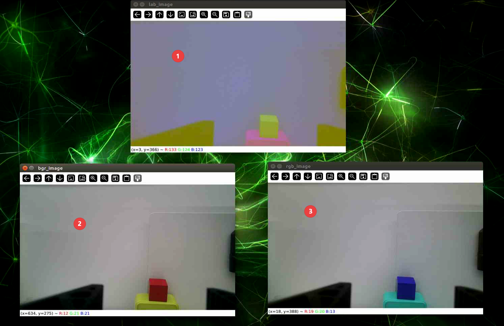

* **Program Analysis**

(1) Launch File Analysis

The launch startup file path is located at: **/home/ubuntu/ros2_ws/src/example/example/opencv/color_space.launch.py**

① `launch_setup` function

```py
def launch_setup(context):
    compiled = os.environ['need_compile']
    if compiled == 'True':
        peripherals_package_path = get_package_share_directory('peripherals')
        example_package_path = get_package_share_directory('example')
    else:
        peripherals_package_path = '/home/ubuntu/ros2_ws/src/peripherals'
        example_package_path = '/home/ubuntu/ros2_ws/src/example'
    depth_camera_launch = IncludelaunchDescription(
        PythonlaunchDescriptionSource(
            os.path.join(peripherals_package_path, 'launch/depth_camera.launch.py')),
    )

    color_space_node = Node(
        package='example',
        executable='color_space',
        output='screen',
    )

    return [depth_camera_launch,
            color_space_node,
            ]
```

Include the **depth_camera.launch.py** startup file in the **peripherals** package to start the depth camera related nodes. Define the `color_space_node` node and start the `color_space` executable file in the **example** package.

② `generate_launch_description` function

```py
def generate_launch_description():
    return launchDescription([
        OpaqueFunction(function = launch_setup)
    ])
```

Create and return a `launchDescription` object, and call the `launch_setup` function through `OpaqueFunction` as the standard entry for the ROS 2 startup file.

③ Main program

```py
if __name__ == '__main__':
    # Create a launchDescription object
    ld = generate_launch_description()

    ls = launchService()
    ls.include_launch_description(ld)
    ls.run()
```

Create a `launchDescription` object and a `launchService` service, add the startup description to the startup service and `run` it to realize the function of starting the entire system.

(2) Python File Analysis

The source file is located at: **/home/ubuntu/ros2_ws/src/example/example/opencv/include/color_space.py**

① `Camera` class

```py
class Camera(Node):
    def __init__(self, name):
        rclpy.init()
        super().__init__(name)
        self.name = name
        self.image = None
        self.running = True
        self.image_sub = None

        
        # Create a CvBridge object for conversion between ROS Image messages and OpenCV images
        self.bridge = CvBridge()

    
        # Image subscriber
        self.image_sub = self.create_subscription(Image, '/depth_cam/rgb/image_raw', self.image_callback, 1)
```

Initialize the ROS node, create a `CvBridge` object for converting ROS image and OpenCV image formats, create an image subscriber to receive image messages under the `/depth_cam/rgb/image_raw` topic, and specify the callback function as `image_callback`.

② `shutdown` method

```py
    def shutdown(self, signum, frame):
        self.get_logger().info("Shutting down...")
        self.running = False
        rclpy.shutdown()
```

Respond to interrupt signals, output `shutdown` information, set the running flag to `False`, and shut down ROS.

③ `image_callback` method

```py
    # Process ROS Image message and convert to OpenCV format
    def image_callback(self, ros_image):
        try:
            # Convert ROS Image message to OpenCV image
            self.rgb_image = self.bridge.imgmsg_to_cv2(ros_image, "rgb8")

            self.bgr_image = cv2.cvtColor(self.rgb_image, cv2.COLOR_RGB2BGR)

            # Convert image color space to LAB
            self.lab_image = cv2.cvtColor(self.rgb_image, cv2.COLOR_RGB2LAB)
            
            if self.running  and self.bgr_image is not None and self.lab_image is not None:
                # Display image
                cv2.imshow('rgb_image', self.rgb_image)
                cv2.imshow('bgr_image', self.bgr_image)
                cv2.imshow('lab_image', self.lab_image)
                cv2.waitKey(1)
        except Exception as e:
            self.get_logger().error(f"Error converting image: {e}")
```

Image topic callback function. Convert the received ROS Image message to an OpenCV RGB format image, then convert it to BGR format and LAB color space format respectively. When the running state is normal and the image is valid, display the three formats of RGB, BGR, and LAB images through OpenCV.

④ Program entry

```py
def main():
    camera_node = Camera('color_space')
    rclpy.spin(camera_node)
    camera_node.destroy_node()
    rclpy.shutdown()
```

Create a `Camera` node instance named `color_space`, start the spin loop of the ROS node processing callbacks, destroy the node and close ROS when the program ends.

### 4.1.5 Color Recognition

* **Experiment Description**

By subscribing to camera image data, convert the obtained image to the LAB color space. Then color recognition can be performed through specific color thresholds. After matching the converted image with the color thresholds, the required color is recognized, and the recognized color is printed in the terminal. Then BGR images and binarized images are output.

* **Operation Steps**

> [!NOTE]
>
> * **Command input must be strictly case-sensitive. The Tab key can be pressed to autocomplete keywords.**
>
> * **Before starting the robotic arm, ensure the base of the robotic arm is secured to the desktop or a stable platform using a G clamp. The robotic arm will generate swing and inertia during operation. If not secured, this may cause the device to tip over, fall, or get damaged, and may also pose a safety risk.**

1. Start the robotic arm and connect it to the remote control software **VNC**. For instructions on how to connect to the remote desktop, refer to [1. Tutorials / 1. NexArm User Manual / 1.5 Development Environment Setup and Configuration](https://wiki.hiwonder.com/projects/NexArm/en/ros-version/docs/1.%20NexArm%20User%20Manual.html#_1-5-development-environment-setup-and-configuration).

2. Click the command line terminal  on the system interface to open the command bar. Enter the command to stop the app auto-start service.

```
~/.stop_ros.sh
```

3. Enter the command to `run` the application and press **Enter**.

```
ros2 launch example color_recognition.launch.py
```

4. To close this application, press **Ctrl+C** in the terminal interface. If it fails to close, try repeatedly.


* **Program Outcome**

In the screen:

① `BGR` image in `BGR` color space

② `result_image` binarized image obtained from the color recognition result.

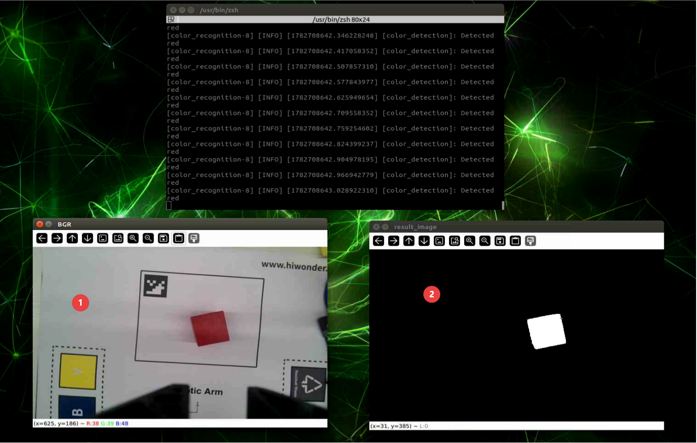

* **Program Analysis**

(1) Launch File Analysis

The launch startup file path is located at: **/home/ubuntu/ros2_ws/src/example/example/opencv/color_recognition.launch.py**

① `launch_setup` function

```py
def launch_setup(context):
    compiled = os.environ['need_compile']
    enable_display = launchConfiguration('enable_display', default='true')
    enable_display_arg = DeclarelaunchArgument('enable_display', default_value=enable_display)
    if compiled == 'True':
        peripherals_package_path = get_package_share_directory('peripherals')
        example_package_path = get_package_share_directory('example')
        sdk_package_path = get_package_share_directory('sdk')
    else:
        peripherals_package_path = '/home/ubuntu/ros2_ws/src/peripherals'
        example_package_path = '/home/ubuntu/ros2_ws/src/example'
        sdk_package_path = '/home/ubuntu/ros2_ws/src/driver/sdk'
    depth_camera_launch = IncludelaunchDescription(
        PythonlaunchDescriptionSource(
            os.path.join(peripherals_package_path, 'launch/depth_camera.launch.py')),
    )
    sdk_launch = IncludelaunchDescription(
        PythonlaunchDescriptionSource(
            os.path.join(sdk_package_path, 'launch/armpi_ultra.launch.py')),
    )
    color_detect_node = Node(
        package='example',
        executable='color_recognition',
        output='screen',
        parameters=[{'enable_display': enable_display}]
    )

    return [
            sdk_launch,
            depth_camera_launch,
            enable_display_arg,
            color_detect_node,
            ]
```

Includes the **depth_camera.launch.py** launch file, starts depth camera related nodes,  from the **peripherals** package and the **armpi_ultra.launch.py** launch file, starts sdk related nodes,  from the **sdk** package. Defines the `color_detect_node` node to launch the `color_recognition` executable from the **example** package.

② `generate_launch_description` function:

```py
def generate_launch_description():
    return launchDescription([
        OpaqueFunction(function = launch_setup)
    ])
```

Creates and returns a `launchDescription` object, calling the `launch_setup` function via `OpaqueFunction` as the standard entry point for ROS 2 launch files.

③ Main function:

```py
if __name__ == '__main__':
    # Create a launchDescription object
    ld = generate_launch_description()

    ls = launchService()
    ls.include_launch_description(ld)
    ls.run()
```

Creates a `launchDescription` object and a `launchService`, adds the launch description to the launch service and runs it, achieving the functionality of starting the entire system.

(2) Python File Analysis

The source file is located at: **/home/ubuntu/ros2_ws/src/example/example/opencv/include/color_recognition.py**

① Importing packages

```py
import cv2
import time
import math
import rclpy
import numpy as np
import sdk.common as common
from rclpy.node import Node
from cv_bridge import CvBridge
from std_srvs.srv import Trigger
from sensor_msgs.msg import Image
from servo_controller_msgs.msg import ServosPosition
from servo_controller.bus_servo_control import set_servo_position
```

**common**: Custom module used to provide commonly used functions such as plane transformation, coordinate system conversion, etc., imported from the **/sdk/common** path.

**cv_bridge**: Used to convert between ROS image messages, `sensor_msgs/Image`,  and OpenCV images.

**servo_controller_msgs.msg.ServosPosition**: Message type used to control the robotic arm's servos. `ServosPosition` represents the positions of multiple servos.

**servo_controller.bus_servo_control**: Custom module used to control the robotic arm's servos, providing the function to control servo positions.

② `ColorDetection` class

**Initialization function of the `color_detection` class**

```py
class ColorDetection(Node):
    def __init__(self, name):
        super().__init__(name, allow_undeclared_parameters=True, automatically_declare_parameters_from_overrides=True)
        self.rgb_image = None
        self.bgr_image = None
        self.result_image = None
        self.bridge = CvBridge()  # Used for conversion between ROS Image messages and OpenCV images

        self.display = self.get_parameter('enable_display').value
        self.data = common.get_yaml_data("/home/ubuntu/ros2_ws/src/app/config/lab_config.yaml")  
        self.lab_data = self.data['/**']['ros__parameters'] 
        self.joints_pub = self.create_publisher(ServosPosition, 'servo_controller', 1)

        #Wait for service to start
        self.client = self.create_client(Trigger, '/controller_manager/init_finish')
        self.client.wait_for_service()
        joint_angle = [500, 600, 825, 110, 500, 210]
        
        set_servo_position(self.joints_pub, 1, ((5, joint_angle[1]), (4, joint_angle[2]), (3, joint_angle[3]), (2, joint_angle[4]), (1, joint_angle[5])))

        time.sleep(1)

        set_servo_position(self.joints_pub, 1, ((6, joint_angle[0]), ))
        time.sleep(1)

        # Subscribe to image topic
        self.image_sub = self.create_subscription(Image, '/depth_cam/rgb/image_raw', self.image_callback, 1)

        #Publish color recognition processed image
        self.image_pub = self.create_publisher(Image, '/color_detection/result_image', 1)
```

Initializes the ROS node, allowing undeclared parameters and automatically declaring parameters from overrides. Creates a `CvBridge` object for format conversion. Gets the value of the `enable_display` parameter and loads the LAB color space configuration file. Creates a publisher to publish servo position messages and a client to wait for the `/controller_manager/init_finish` service to start. Sets the initial joint angles and controls the servos using the `set_servo_position` function. Subscribes to the `/depth_cam/rgb/image_raw` image topic, specifying `image_callback` as the callback function. Creates a publisher to output the color recognition processed result image to the `/color_detection/result_image` topic.

③ Image callback processing function

```py
    # Process ROS Image message and convert to OpenCV image
    def image_callback(self, ros_image):
        try:
            
            # Convert ROS Image message to OpenCV image
            self.rgb_image = self.bridge.imgmsg_to_cv2(ros_image, "rgb8")
            # Convert image color space to LAB
            self.lab_image = cv2.cvtColor(self.rgb_image, cv2.COLOR_RGB2LAB)
            # RGB to BGR
            self.bgr_image = cv2.cvtColor(self.rgb_image, cv2.COLOR_RGB2BGR)


            # Start color detection
            self.color_detection("red",self.bgr_image)

            # Display original image and detection results
            if  self.result_image is not None:
                cv2.imshow('BGR', self.bgr_image)
                cv2.imshow('result_image', self.result_image)
                cv2.waitKey(1)

        except Exception as e:
            self.get_logger().error('Failed to convert image: {}'.format(e))
```

Image topic callback function that converts ROS Image messages to OpenCV RGB format images, then converts them to LAB and BGR formats. Calls the `color_detection` method to detect red. If display is enabled and the result image is valid, uses OpenCV to display the original BGR image and the detection result image.

④ Erosion and dilation

```py
    # Erosion and dilation operations
    def erode_and_dilate(self, binary, kernel=3):
        element = cv2.getStructuringElement(cv2.MORPH_RECT, (kernel, kernel))
        eroded = cv2.erode(binary, element)  # Erosion
        dilated = cv2.dilate(eroded, element)  # Dilation
        return dilated
```

Performs erosion and dilation operations on the binarized image using rectangular structuring elements to reduce noise and enhance target contours.

⑤ Color recognition

```py
    # Color recognition function
    def color_detection(self, color, bgr_image):
        self.result_image = cv2.GaussianBlur(bgr_image, (3, 3), 3)
        self.result_image = cv2.cvtColor(self.result_image, cv2.COLOR_BGR2LAB)
        # Set color threshold and generate binary image
        self.result_image = cv2.inRange(self.result_image,
                                      np.array(self.lab_data['color_range_list'][color]['min']),
                                      np.array(self.lab_data['color_range_list'][color]['max']))
        self.result_image = self.erode_and_dilate(self.result_image)

        # Find all contours
        contours = cv2.findContours(self.result_image, cv2.RETR_EXTERNAL, cv2.CHAIN_APPROX_NONE)[-2]
        if contours:
            c = max(contours, key=cv2.contourArea)
            area = math.fabs(cv2.contourArea(c))
            if area >= 2000:
                if self.display:
                    self.get_logger().info(f"Detected {color}")
        
        # Convert binary image to BGR format for publishing
        # result_image = cv2.cvtColor(self.result_image, cv2.COLOR_GRAY2BGR)

        # Publish color BGR image
        self.image_pub.publish(self.bridge.cv2_to_imgmsg(self.result_image, "mono8"))
```

Performs Gaussian blurring and LAB color space conversion on the input image, generates a binarized image based on the threshold of the target color, red,  in the configuration file, and finds contours after erosion and dilation processing. Filters out the maximum contour with an area not less than 2000, outputs the detected target color information if display is enabled. Converts the processed binarized image to a single-channel format and publishes it.

⑥ Main function

```py
def main():
    rclpy.init()
    node = ColorDetection('color_detection')
    rclpy.spin(node)
    node.destroy_node()
    rclpy.shutdown()
```

Initializes ROS, creates a `ColorDetection` node instance named `color_detection`, starts the node's spin loop, and destroys the node and shuts down ROS when the program ends.

### 4.1.6 Pixel Coordinate Calculation

* **Experiment Description**

When the robotic arm recognizes a color block from the returned footage, it can obtain the coordinate position of the center point of the color block in the returned footage. By using the center point coordinates, the corresponding pixel coordinates can be calculated, facilitating the subsequent positioning of the object.

* **Operation Steps**

> [!NOTE]
>
> * **Command input must be strictly case-sensitive. The Tab key can be pressed to autocomplete keywords.**
>
> * **Before starting the robotic arm, ensure the base of the robotic arm is secured to the desktop or a stable platform using a G clamp. The robotic arm will generate swing and inertia during operation. If not secured, this may cause the device to tip over, fall, or get damaged, and may also pose a safety risk.**

1. Start the robotic arm and connect it to the remote control software **VNC**. For how to connect to the remote desktop, please refer to [1. Tutorials / 1. NexArm User Manual / 1.5 Development Environment Setup and Configuration](https://wiki.hiwonder.com/projects/NexArm/en/ros-version/docs/1.%20NexArm%20User%20Manual.html#_1-5-development-environment-setup-and-configuration).

2. Click the command line terminal  on the system interface to start the command bar. Enter the command to close the app's auto-start service.

```
~/.stop_ros.sh
```

3. Enter the command to `run` the application and press **Enter**.

```
ros2 launch example pixel_coordinate_calculation.launch.py
```

4. To close this application, press **Ctrl+C** in the terminal interface. If it fails to close, please try repeatedly.

* **Program Outcome**

As shown below:

① The terminal outputs pixel coordinates, where x represents horizontal coordinate and y represents vertical coordinate.

② The window named `RGB` is the depth camera feed converted from `RGB` to `BGR` image.

③ The window named `result_image` is the binarized black-and-white image displayed through the `color_detection` function.

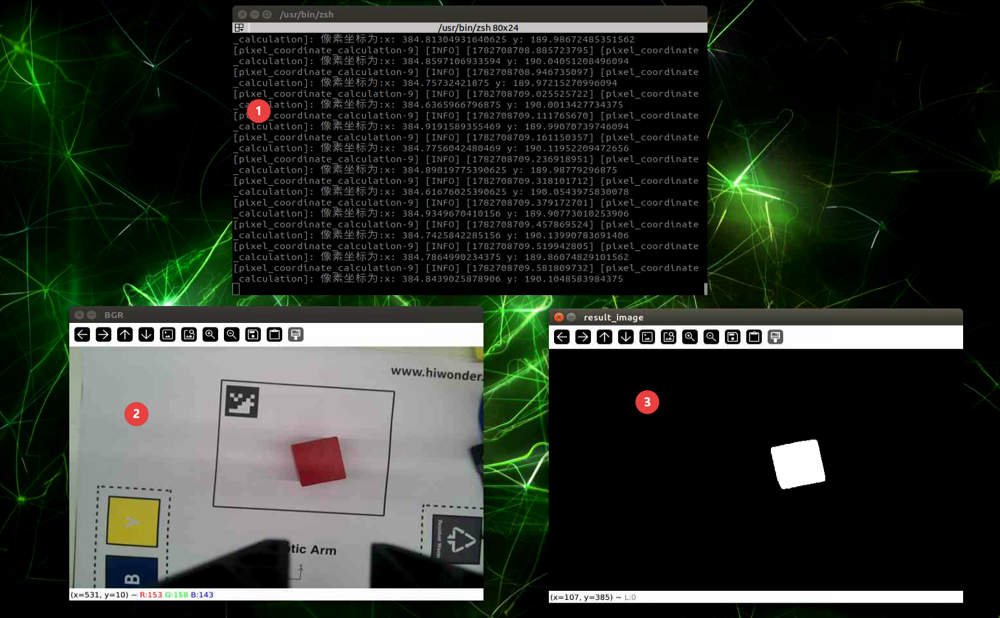

* **Program Analysis**

(1) Launch File Analysis

The launch startup file path is located at: **/home/ubuntu/ros2_ws/src/example/example/opencv/pixel_coordinate_calculation.launch.py**

① `launch_setup` function

```py
def launch_setup(context):
    compiled = os.environ['need_compile']
    enable_display = launchConfiguration('enable_display', default='false')
    enable_display_arg = DeclarelaunchArgument('enable_display', default_value=enable_display)

    if compiled == 'True':
        example_package_path = get_package_share_directory('example')
    else:
        example_package_path = '/home/ubuntu/ros2_ws/src/example'

    color_recognition_launch = IncludelaunchDescription(
        PythonlaunchDescriptionSource(
            os.path.join(example_package_path, 'example/opencv/color_recognition.launch.py')),
        launch_arguments={
            'enable_display': enable_display
        }.items()
    )

    pixel_coordinate_calculation_node = Node(
        package='example',
        executable='pixel_coordinate_calculation',
        output='screen',
    )

    return [
            color_recognition_launch,
            pixel_coordinate_calculation_node,
            ]
```

Includes the **color_recognition.launch.py** launch file from the **example** package to start color recognition related nodes. Defines the `pixel_coordinate_calculation_node` node to launch the `pixel_coordinate_calculation` executable from the **example** package.

② `generate_launch_description` function

```py
def generate_launch_description():
    return launchDescription([
        OpaqueFunction(function = launch_setup)
    ])
```

Creates and returns a `launchDescription` object, calling the `launch_setup` function via `OpaqueFunction` as the standard entry point for ROS 2 launch files.

③ Main function

```py
if __name__ == '__main__':
    # Create a launchDescription object
    ld = generate_launch_description()

    ls = launchService()
    ls.include_launch_description(ld)
    ls.run()
```

Creates a `launchDescription` object and a `launchService`, adds the launch description to the launch service and runs it, achieving the functionality of starting the entire system.

(2) Python File Analysis

The source file is located at: **/home/ubuntu/ros2_ws/src/example/example/opencv/include/pixel_coordinate_calculation.py**

① `PixelCoordinateCalculation` class

**Initialization function:**

```py
    def __init__(self, name):
        rclpy.init()
        super().__init__(name, allow_undeclared_parameters=True, automatically_declare_parameters_from_overrides=True)
        self.bridge = CvBridge()  # Used for conversion between ROS Image messages and OpenCV images
        # Subscribe to image topic
        self.image_sub = self.create_subscription(Image, '/color_detection/result_image', self.image_callback, 1)
```

Initializes the ROS node, allowing undeclared parameters and automatically declaring parameters from overrides. Creates a `CvBridge` object for format conversion. Subscribes to the `/color_detection/result_image` image topic, specifying `image_callback` as the callback function.

**`image_callback` function:**

```py
    # Process ROS node data
    def image_callback(self, result_image):
        try:
            
            # Convert ROS Image message to OpenCV image
            result_image = self.bridge.imgmsg_to_cv2(result_image, "mono8")

            # Convert grayscale image to BGR image
            # result_image = cv2.cvtColor(bgr_image, cv2.COLOR_BGR2GRAY)

           
            if result_image is not None :
                # Calculate recognized contours
                contours = cv2.findContours(result_image, cv2.RETR_EXTERNAL,cv2.CHAIN_APPROX_NONE)[-2]  # Find all contours

                if contours :

                    # Find largest contour
                    c = max(contours, key = cv2.contourArea)
                    # Determine whether to proceed based on contour size
                    rect = cv2.minAreaRect(c)  # Get minimum bounding rectangle
                    corners = np.intp(cv2.boxPoints(rect))  # Get minimum bounding rectangle
                    x, y = rect[0][0],rect[0][1]
                    # Print pixel coordinates
                    self.get_logger().info(f"Pixel coordinates: x: {x} y: {y}")
                    
                else:
                    self.get_logger().info("Please place the target color block within camera recognition range")

        except Exception as e:
            print(e)
```

Image topic callback function, converts ROS Image messages to OpenCV single-channel, `mono8`,  images. Extracts contours from the image, finds the maximum contour if contours exist, gets its center point coordinates, pixel coordinates,  through the minimum bounding rectangle, and prints them. Outputs prompt information if no contours are detected. Prints the exception content if an exception occurs during the process.

② `main` function

```py
def main():
    node = PixelCoordinateCalculation('pixel_coordinate_calculation')
    rclpy.spin(node)
    camera_node.destroy_node()
    
    rclpy.shutdown()
```

Creates a `PixelCoordinateCalculation` node instance named "pixel_coordinate_calculation", starts the node's spin loop, and destroys the node and shuts down ROS when the program ends.

### 4.1.7 Object Attitude Calculation

* **Experiment Description**

When a color block is recognized from the returned screen, the coordinate position of the center point of the color block on the screen can be obtained. The attitude of the obtained image can be calculated and printed in the terminal, which can be used for subsequent servo control on the robotic arm, thereby adjusting the gripping angle of the mechanical claw.

Pose represents position and orientation. Any rigid body in a spatial coordinate system (OXYZ)  can use position and attitude to accurately and uniquely represent its positional state.

Position represents the coordinate location of an object in three-dimensional space, usually represented by three coordinate values, x, y, z. These coordinate values can be relative to a reference point or coordinate system, or relative to the position of other objects.

Orientation represents the direction or facing of an object in three-dimensional space, usually described using rotation matrices, Euler angles, quaternions, or other representation methods. The attitude describes the rotational relationship of the object relative to a reference direction or coordinate system, which can be used to represent the object's orientation, angle, or rotation.

* **Operation Steps**

> [!NOTE]
>
> * **Command input must be strictly case-sensitive. The Tab key can be pressed to autocomplete keywords.**
>
> * **Before starting the robotic arm, ensure the base of the robotic arm is secured to the desktop or a stable platform using a G clamp. The robotic arm will generate swing and inertia during operation. If not secured, this may cause the device to tip over, fall, or get damaged, and may also pose a safety risk.**

1. Start the robotic arm and connect it to the remote control software **VNC**. For how to connect to the remote desktop, please refer to [1. Tutorials / 1. NexArm User Manual / 1.5 Development Environment Setup and Configuration](https://wiki.hiwonder.com/projects/NexArm/en/ros-version/docs/1.%20NexArm%20User%20Manual.html#_1-5-development-environment-setup-and-configuration).

2. Click the command line terminal  on the system interface to start the command bar. Enter the command to close the app's auto-start service.

```
~/.stop_ros.sh
```

3. Enter the command to `run` the application and press **Enter**.

```
ros2 launch example object_attitude_calculation.launch.py
```

4. To close this application, press **Ctrl+C** in the terminal interface. If it fails to close, please try repeatedly.

* **Program Outcome**

As shown below, in the screenshot:

① The terminal outputs information for pose yaw, corresponding to the gripping angle of the robotic arm gripper.

② The window named `BGR` is the depth camera feed converted from `RGB` to `BGR` image.

③ The window named `result_image` is the binarized black-and-white image displayed through the `color_detection` function.

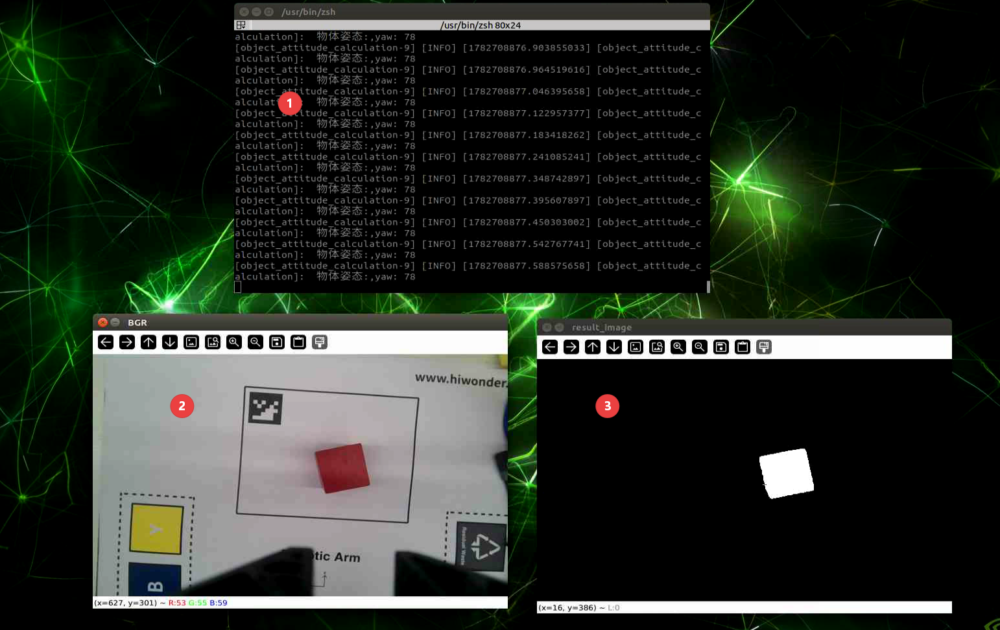

* **Program Analysis**

(1) Launch File Analysis

The launch startup file path is located at: **/home/ubuntu/ros2_ws/src/example/example/opencv/object_attitude_calculation.launch.py**

① `launch_setup` function

```py
def launch_setup(context):
    compiled = os.environ['need_compile']
    enable_display = launchConfiguration('enable_display', default='false')
    enable_display_arg = DeclarelaunchArgument('enable_display', default_value=enable_display)
    if compiled == 'True':
        example_package_path = get_package_share_directory('example')
    else:
        example_package_path = '/home/ubuntu/ros2_ws/src/example'
    
    color_recognition_launch = IncludelaunchDescription(
        PythonlaunchDescriptionSource(
            os.path.join(example_package_path, 'example/opencv/color_recognition.launch.py')),
        launch_arguments={
            'enable_display': enable_display
        }.items()
    )

    object_attitude_calculation_node = Node(
        package='example',
        executable='object_attitude_calculation',
        output='screen',
    )

    return [
            color_recognition_launch,
            object_attitude_calculation_node,
            ]
```

Includes the **color_recognition.launch.py** launch file from the **example** package to start color recognition related nodes. Defines the `object_attitude_calculation_node` node to launch the `object_attitude_calculation` executable from the **example** package.

② `generate_launch_description` function

```py
def generate_launch_description():
    return launchDescription([
        OpaqueFunction(function = launch_setup)
    ])
```

Creates and returns a `launchDescription` object, calling the `launch_setup` function via `OpaqueFunction` as the standard entry point for ROS 2 launch files.

③ Main function

```py
if __name__ == '__main__':
    # Create a launchDescription object
    ld = generate_launch_description()

    ls = launchService()
    ls.include_launch_description(ld)
    ls.run()
```

Creates a `launchDescription` object and a `launchService`, adds the launch description to the launch service and runs it, achieving the functionality of starting the entire system.

(2) Python File Analysis

During the process of object attitude calculation, it is necessary to acquire the `main` features of the target color. Therefore, the already written library `color_detection_base` is called to obtain a specific binarized image of the target color object for subsequent color object positioning.

The source file is located at: **/home/ubuntu/ros2_ws/src/example/example/opencv/include/object_attitude_calculation.py**

① `ObjectAttitudeCalculation` class constructor function

```py
class ObjectAttitudeCalculation(Node):
    def __init__(self, name):
        rclpy.init()
        super().__init__(name, allow_undeclared_parameters=True, automatically_declare_parameters_from_overrides=True)
        self.bridge = CvBridge()  # Used for conversion between ROS Image messages and OpenCV images
        # Subscribe to image topic
        self.image_sub = self.create_subscription(Image, '/color_detection/result_image', self.image_callback, 1)
```

Initializes the ROS node, allowing undeclared parameters and automatically declaring parameters from overrides. Creates a `CvBridge` object for format conversion. Subscribes to the `/color_detection/result_image` image topic, specifying `image_callback` as the callback function.

② `image_callback` callback function

```py
    # Process ROS node data
    def image_callback(self, result_image):
        try:
            
            # Convert ROS Image message to OpenCV image
            result_image = self.bridge.imgmsg_to_cv2(result_image, "mono8")

            # Convert grayscale image to BGR image
            # result_image = cv2.cvtColor(bgr_image, cv2.COLOR_BGR2GRAY)

            
            if result_image is not None :
                # Calculate recognized contours
                contours = cv2.findContours(result_image, cv2.RETR_EXTERNAL,cv2.CHAIN_APPROX_NONE)[-2]  # Find all contours

                if contours :

                    # Find largest contour
                    c = max(contours, key = cv2.contourArea)
                    # Determine whether to proceed based on contour size
                    rect = cv2.minAreaRect(c)  # Get minimum bounding rectangle
                    yaw = int(round(rect[2]))  # Rectangle angle
                    # Print object attitude
                    self.get_logger().info(f"Object attitude: yaw: {yaw}")
                    
                else:
                    self.get_logger().info("Please place the target color block within camera recognition range")

        except Exception as e:
            print(e)
```

Image topic callback function, converts ROS Image messages to OpenCV single-channel, `mono8`,  images. Extracts contours from the image, finds the maximum contour if contours exist, gets its rotation angle, yaw, as the object attitude,  through the minimum bounding rectangle and prints it. Outputs prompt information if no contours are detected. Prints the exception content if an exception occurs during the process.

③ `main` function

```py
def main():
    node = ObjectAttitudeCalculation('object_attitude_calculation')
    rclpy.spin(node)
    camera_node.destroy_node()
    
    rclpy.shutdown()
```

Creates an `ObjectAttitudeCalculation` node instance named "object_attitude_calculation", starts the node's spin loop, and destroys the node and shuts down ROS when the program ends.

### 4.1.8 Perspective Transformation

* **Introduction to Perspective Transformation**

Perspective transformation refers to using the condition of the perspective center, image point, and target point being collinear to project a picture onto a new viewing plane. The purpose of perspective transformation is to transform straight objects in reality, which may appear as slanted lines in pictures, into straight lines through perspective transformation.

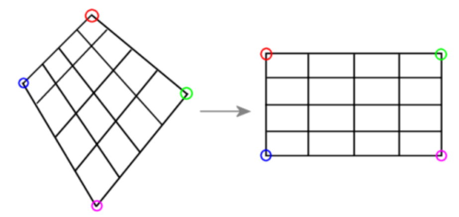

* **Role of Perspective Transformation**

Perspective transformation is commonly used, for example, in visual navigation research for mobile robots. Due to the tilt angle between the camera and the ground, instead of facing vertically down, it is sometimes desired to correct the image into the form of orthographic projection, which requires the use of perspective transformation.

* **Principle of Perspective Transformation**

The process of transforming 3D objects or targets in a spatial coordinate system into a 2D image representation is called projection transformation. Perspective transformation is an operation that changes the size and shape of an object. A planar shape can produce a stereoscopic effect after perspective transformation. Taking a rectangle as an example, shear transformation only moves two vertices on the same side, moving them in the same direction while keeping the two vertices on the opposite side fixed. However, perspective transformation may move all vertices of the rectangle, and two vertices on the same side move in opposite directions. Simply put, perspective transformation is the process of **2D image -> 3D image -> 2D image**.

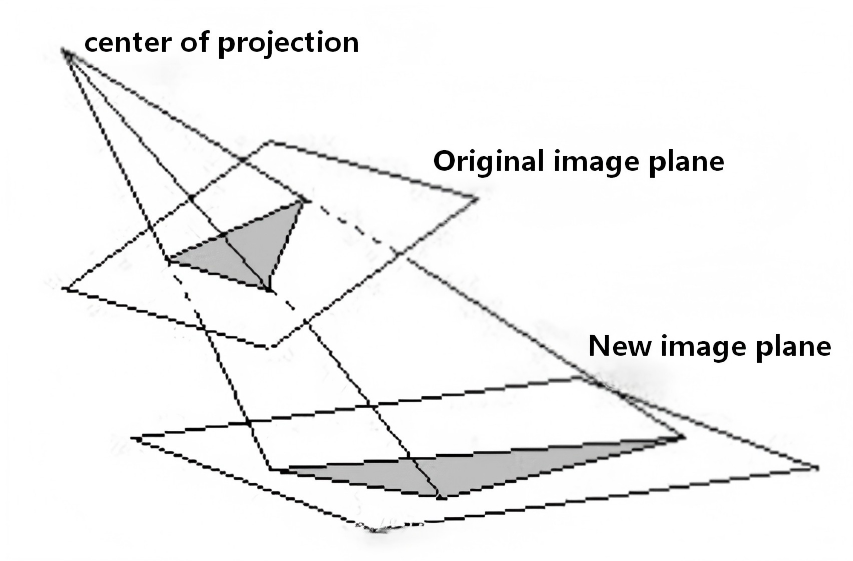

According to the schematic diagram of perspective transformation, the following formulas can be established:

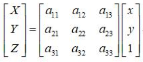

(X, Y, Z) is the coordinate point of the original image plane, and the corresponding coordinate point of the transformed image plane is (x, y). Since processing a 2D image, Z=1 can be set, and dividing the transformed image coordinates by Z reduces the image from 3D to 2D, obtaining the following equations:


Generally, setting a33=1 conveniently yields X', Y', making the denominator on the left side of equation (3) equal to 1. Expanding the above formula yields the case for a single point:

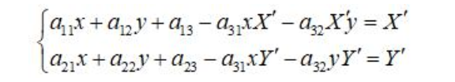

There are 8 unknowns in equation (3). To solve for these unknowns, eight sets of equations need to be listed by manually selecting four points on the source image and the target image respectively. Select four coordinate points on the source image: A((x0, y0), (x1, y1), (x2, y2), (x3, y3)). Select four coordinate points on the target image: B((X'0, Y'0), (X'1, Y'1), (X'2, Y'2), (X'3, Y'3)).

Substituting into equation (3) yields equation (4) as follows:


### 4.1.9 Coordinate System Transformation

* **Experiment Description**

When the system recognize a color block from the returned screen, can get the coordinate position of the center point of the color block on the returned screen. the system need to convert the obtained pixel coordinate position into the actual coordinate position of the color block.

* **Operation Steps**

> [!NOTE]
>
> * **Command input must be strictly case-sensitive. The Tab key can be pressed to autocomplete keywords.**
>
> * **Before starting the robotic arm, ensure the base of the robotic arm is secured to the desktop or a stable platform using a G clamp. The robotic arm will generate swing and inertia during operation. If not secured, this may cause the device to tip over, fall, or get damaged, and may also pose a safety risk.**

1. Start the robotic arm and connect it to the remote control software **VNC**. For how to connect to the remote desktop, please refer to [1. Tutorials / 1. NexArm User Manual / 1.5 Development Environment Setup and Configuration](https://wiki.hiwonder.com/projects/NexArm/en/ros-version/docs/1.%20NexArm%20User%20Manual.html#_1-5-development-environment-setup-and-configuration).

2. Click the command line terminal  on the system interface to start the command bar. Enter the command to close the app's auto-start service.

```
~/.stop_ros.sh
```

3. Enter the command to `run` the application and press **Enter**.

```
ros2 launch example coordinate_system_transformation.launch.py
```

4. To close this application, press **Ctrl+C** in the terminal interface. If it fails to close, please try repeatedly.

* **Program Outcome**

In the picture, ① on the left is BGR, the BGR image converted from RGB, ② on the right is `color_detection`, the image processed by color recognition, and the terminal prints the pixel center coordinates of the color block and the actual coordinates after the conversion.

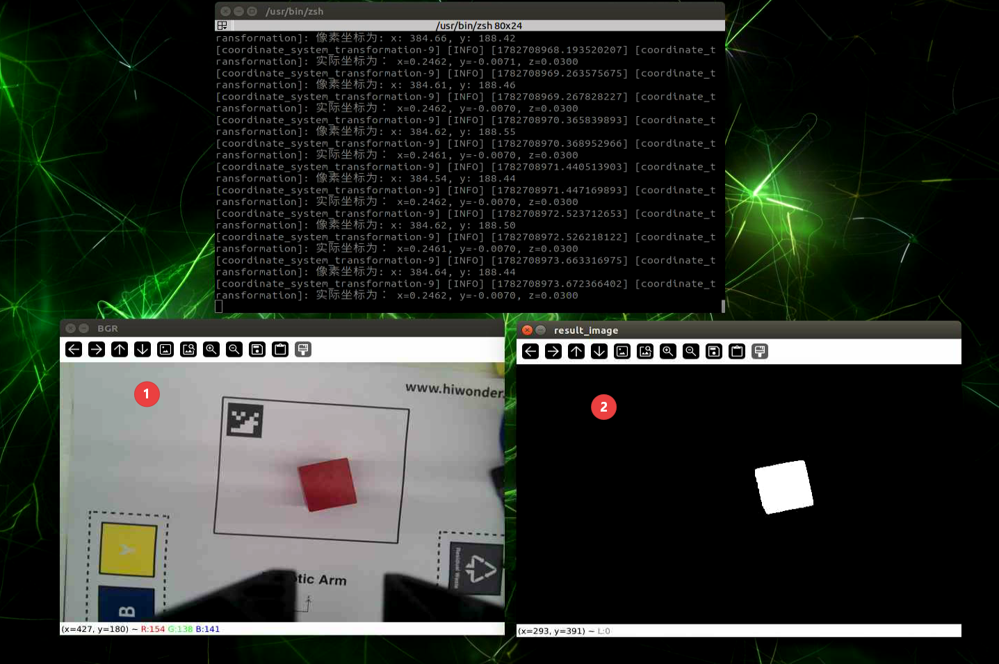

* **Program Analysis**

(1) Launch File Analysis

The launch startup file path is located at: **/home/ubuntu/ros2_ws/src/example/example/opencv/coordinate_system_transformation.launch.py**

① `launch_setup` function

```py
def launch_setup(context):
    compiled = os.environ['need_compile']
    enable_display = launchConfiguration('enable_display', default='false')
    enable_display_arg = DeclarelaunchArgument('enable_display', default_value=enable_display)
    if compiled == 'True':
        example_package_path = get_package_share_directory('example')
    else:
        example_package_path = '/home/ubuntu/ros2_ws/src/example'
    
    color_recognition_launch = IncludelaunchDescription(
        PythonlaunchDescriptionSource(
            os.path.join(example_package_path, 'example/opencv/color_recognition.launch.py')),
        launch_arguments={
            'enable_display': enable_display
        }.items()
    )
    coordinate_system_transformation_node = Node(
        package='example',
        executable='coordinate_system_transformation',
        output='screen',
    )

    return [color_recognition_launch,
            coordinate_system_transformation_node,
            ]
```

Includes the **color_recognition.launch.py** launch file from the **example** package to start color recognition related nodes. Defines the `coordinate_system_transformation_node` node to launch the `coordinate_system_transformation` executable from the **example** package.

② `generate_launch_description` function

```py
def generate_launch_description():
    return launchDescription([
        OpaqueFunction(function = launch_setup)
    ])
```

Creates and returns a `launchDescription` object, calling the `launch_setup` function via `OpaqueFunction` as the standard entry point for ROS 2 launch files.

③ Main function

```py
if __name__ == '__main__':
    # Create a launchDescription object
    ld = generate_launch_description()

    ls = launchService()
    ls.include_launch_description(ld)
    ls.run()
```

Creates a `launchDescription` object and a `launchService`, adds the launch description to the launch service and runs it, achieving the functionality of starting the entire system.

(2) Python File Analysis

The source file is located at: **/home/ubuntu/ros2_ws/src/example/example/opencv/include/coordinate_system_transformation.py**

① Import packages

Import required modules using import statements.

```py
import os
import cv2
import yaml
import time
import rclpy
import numpy as np
from sdk import common
from rclpy.node import Node
from cv_bridge import CvBridge
from sensor_msgs.msg import Image as RosImage, CameraInfo
```

**common**: Custom module, used to provide commonly used functions such as plane transformation, coordinate system conversion, etc., module imported from the **/sdk/common** path.

② `CoordinateTransformation` class initialization function

```py
    def __init__(self, name):
        rclpy.init()
        super().__init__(
            name,
            allow_undeclared_parameters=True,
            automatically_declare_parameters_from_overrides=True
        )
        self.bridge = CvBridge()  # Bridge for ROS Image and OpenCV image conversion
        self.K = None  # Camera intrinsic matrix
        self.white_area_center = None  # White area center point (world coordinate system)
        self.camera_type = os.environ.get('CAMERA_TYPE', '')  # Read CAMERA_TYPE environment variable, empty string if none
        self.config_file = 'transform.yaml'  # Pose calculation configuration file name
        self.calibration_file = 'calibration.yaml'  # Calibration file name
        self.config_path = "/home/ubuntu/ros2_ws/src/app/config/"  # Configuration file directory

        # Subscribe to image result topic and camera info topic
        self.image_sub = self.create_subscription(RosImage, '/color_detection/result_image', self.image_callback, 1)
        self.camera_info_sub = self.create_subscription(CameraInfo, '/depth_cam/rgb/camera_info', self.camera_info_callback, 1)
```

Initializes the ROS node, allowing undeclared parameters and automatically declaring parameters from overrides. Creates a `CvBridge` object for format conversion. Initializes variables such as camera intrinsic matrix and white area center coordinates. Gets the camera type from environment variables, sets the configuration file path and name. Subscribes to the `/color_detection/result_image` image topic and `/depth_cam/rgb/camera_info` camera information topic, specifying `image_callback` and `camera_info_callback` as callback functions respectively.

③ `get_yaml` function

```py
    def get_yaml(self):
        """Read configuration file to obtain extrinsic parameters and white center coordinates"""
        with open(os.path.join(self.config_path, self.config_file), 'r') as f:
            config = yaml.safe_load(f)
            extristric = np.array(config['extristric'])
            corners = np.array(config['corners']).reshape(-1, 3)  # Corner points, currently unused
            self.white_area_center = np.array(config['white_area_pose_world'])

        tvec = extristric[:1]  # First row translation vector
        rmat = extristric[1:]  # Remaining three rows rotation matrix

        # Call extrinsic plane shift function, requires np.matrix type
        tvec, rmat = common.extristric_plane_shift(
            np.matrix(tvec).reshape((3, 1)),
            np.matrix(rmat),
            0.03
        )

        self.extristric = tvec, rmat
```

Loads the transformation configuration file, parses out the extrinsic parameters, translation vector and rotation matrix, corner coordinates, and white area world coordinates. Performs planar offset processing on the translation vector and rotation matrix, and stores the extrinsic parameters.

④ `camera_info_callback` function

```py
    def camera_info_callback(self, msg):
        """Convert camera intrinsic info to 3x3 matrix upon reception"""
        # Use np.matrix here to ensure no .I error when calling common
        self.K = np.matrix(msg.k).reshape(3, 3)
```

`Camera` information callback function obtains the camera intrinsic matrix from the message and converts it into a NumPy matrix format.

⑤ `image_callback` function

```py
    def image_callback(self, result_image):
        """Recognize target and compute actual position upon receiving image message"""
        try:
            cv_image = self.bridge.imgmsg_to_cv2(result_image, "mono8")  # Convert to grayscale image

            if cv_image is not None:
                contours = cv2.findContours(cv_image, cv2.RETR_EXTERNAL, cv2.CHAIN_APPROX_NONE)[-2]

                if contours:
                    # Find largest contour
                    c = max(contours, key=cv2.contourArea)
                    rect = cv2.minAreaRect(c)
                    corners = np.int0(cv2.boxPoints(rect))
                    x, y = rect[0][0], rect[0][1]

                    if self.camera_type == 'usb_cam':
                        # USB cam calibration logic can be added here, currently left blank to avoid errors
                        pass

                    # Read extrinsic configuration
                    self.get_yaml()

                    # Construct projection matrix, convert to np.matrix
                    projection_matrix = np.row_stack((
                        np.column_stack((self.extristric[1], self.extristric[0])),
                        np.array([[0, 0, 0, 1]])
                    ))
                    projection_matrix = np.matrix(projection_matrix)

                    # Convert pixel coordinates to world coordinate system with np.matrix parameter
                    world_pose = common.pixels_to_world([[x, y]], self.K, projection_matrix)[0]

                    # Adjust coordinate system
                    world_pose[0] = -world_pose[0]
                    world_pose[1] = -world_pose[1]

                    # Add white area center coordinates to calculate real coordinates
                    position = self.white_area_center[:3, 3] + world_pose
                    position[2] = 0.03  # Fixed height

                    # Read calibration parameters for scale and offset
                    config_data = common.get_yaml_data(os.path.join(self.config_path, self.calibration_file))
                    offset = tuple(config_data['pixel']['offset'])
                    scale = tuple(config_data['pixel']['scale'])
                    for i in range(3):
                        position[i] = position[i] * scale[i] + offset[i]

                    # Print pixel and actual coordinates
                    self.get_logger().info(f"Pixel coordinates: x: {x:.2f}, y: {y:.2f}")
                    self.get_logger().info(f"Actual coordinates: x={position[0]:.4f}, y={position[1]:.4f}, z={position[2]:.4f}")
                    time.sleep(1)
                else:
                    self.get_logger().info("No recognized color detected. Please place color block within field of view.")
```

Image topic callback function, converting ROS Image messages to OpenCV single-channel `mono8` images. Extracts contours from the image, finds the largest contour if contours exist, and gets its center pixel coordinates through the minimum bounding rectangle. For the USB camera, applies distortion correction to pixel coordinates. Calls the `get_yaml` method to get configuration parameters, constructs the projection matrix, converts pixel coordinates to world coordinates, and makes coordinate adjustments. Loads the calibration file, applies scaling and offset parameters to get the final actual coordinates. Prints pixel coordinates and actual coordinates, or prints prompt information if no contour is detected. Prints exception content if an exception occurs during the process.

⑥ `main` function

```py
def main():
    node = CoordinateTransformation('coordinate_transformation')
    try:
        rclpy.spin(node)
    except KeyboardInterrupt:
        pass
    finally:
        node.destroy_node()
        rclpy.shutdown()
```

Creates an instance of the `CoordinateTransformation` node named `coordinate_transformation`, starts the node's spin loop, and destroys the node and shuts down ROS when the program ends.

### 4.1.10 Trajectory Planning

* **Experiment Description**

When wanting the robotic arm to grab objects according to requirements, object coordinates are utilized. Based on these coordinates, servos on the robotic arm rotate to the corresponding angles to grip the object.

1. The pan-tilt base of the robotic arm rotates to the target direction.
2. The robotic arm moves above the target position.
3. The end-effector on the robotic arm is controlled to approach the target object.

* **Operation Steps**

> [!NOTE]
>
> * **Command input must be strictly case-sensitive. The Tab key can be pressed to autocomplete keywords.**
>
> * **Before starting the robotic arm, ensure the base of the robotic arm is secured to the desktop or a stable platform using a G clamp. The robotic arm will generate swing and inertia during operation. If not secured, this may cause the device to tip over, fall, or get damaged, and may also pose a safety risk.**

1. Start the robotic arm and connect it to the remote control software **VNC**. For instructions on how to connect to the remote desktop, refer to [1. Tutorials / 1. NexArm User Manual / 1.5 Development Environment Setup and Configuration](https://wiki.hiwonder.com/projects/NexArm/en/ros-version/docs/1.%20NexArm%20User%20Manual.html#_1-5-development-environment-setup-and-configuration).

2. Click the command line terminal  on the system interface to open the command bar. Enter the command to stop the app auto-start service.

```
~/.stop_ros.sh
```

3. Enter the command to start the trajectory planning feature.

```
ros2 launch example path_planning.launch.py
```

4. To close this application, press **Ctrl+C** in the terminal interface. If closing fails, please try repeatedly.

* **Program Outcome**

The pan-tilt base at the bottom of the robotic arm will first rotate toward the target position, then the robotic arm moves above the target position, descends to the target position, and finally returns to the initial pose.

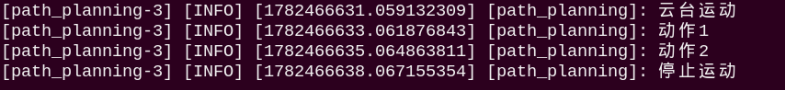

* **Modifying the Robotic Arm Gripping Position**

The source file is located at: **/home/ubuntu/ros2_ws/src/example/example/opencv/include/path_planning.py**

To modify the gripping position of the robotic arm, adjust the parameters within `self.move_0` and `self.move_1`. The parameters in parentheses, from left to right, represent the target coordinates x, y, and z in meters, as well as the gripper angle when gripping the block, with a value range of [-90°, 90°].

After specifying the gripping position, the robotic arm calculates whether it can reach that position. If reachable, it moves to the target position. If unreachable, the robotic arm will not execute movement.

```py
            # Run path planning program
            self.get_logger().info("Pan-tilt movement")
            self.move_0(0.2, -0.1, 0.05, 90)
            time.sleep(2)
            self.get_logger().info("Action 1")
            self.move_1(0.2,  -0.05, 0.07, 90)
            time.sleep(2)
            self.get_logger().info("Action 2")
            self.move_1(0.2,  -0.05, 0.005, 90)
            time.sleep(3)
            self.start = False  # Stop loop
            self.get_logger().info("Stop movement")
```

* **Program Analysis**

(1) Launch File Analysis

The launch startup file path is located at: **/home/ubuntu/ros2_ws/src/example/example/opencv/path_planning.launch.py**

① `launch_setup` function

```py
def launch_setup(context):
    compiled = os.environ['need_compile']
    enable_display = launchConfiguration('enable_display', default='false')
    enable_display_arg = DeclarelaunchArgument('enable_display', default_value=enable_display)
    if compiled == 'True':
        sdk_package_path = get_package_share_directory('sdk')
        example_package_path = get_package_share_directory('example')
    else:
        sdk_package_path = '/home/ubuntu/ros2_ws/src/driver/sdk'
        example_package_path = '/home/ubuntu/ros2_ws/src/example'
    
    sdk_launch = IncludelaunchDescription(
        PythonlaunchDescriptionSource(
            os.path.join(sdk_package_path, 'launch/armpi_ultra.launch.py')),
    )

    path_planning_node = Node(
        package='example',
        executable='path_planning',
        output='screen',
    )

    return [
            sdk_launch,
            path_planning_node,
            ]
```

Includes the **armpi_ultra.launch.py** launch file in the **sdk** package to start sdk related nodes. Defines the `path_planning_node` node to start the `path_planning` executable in the **example** package.

② `generate_launch_description` function

```py
def generate_launch_description():
    return launchDescription([
        OpaqueFunction(function = launch_setup)
    ])
```

Creates and returns a `launchDescription` object, calling the `launch_setup` function via `OpaqueFunction` as the standard entry point for ROS 2 launch files.

③ Main function

```py
if __name__ == '__main__':
    # Create a launchDescription object
    ld = generate_launch_description()

    ls = launchService()
    ls.include_launch_description(ld)
    ls.run()
```

Creates a `launchDescription` object and `launchService`, adds the launch description to the launch service and executes it, achieving system startup functionality.

(2) Python File Analysis

The source file is located at: **/home/ubuntu/ros2_ws/src/example/example/opencv/include/path_planning.py**

① Import packages

```py
import time
import os
import math
import rclpy
from rclpy.node import Node
from rclpy.executors import MultiThreadedExecutor
import numpy as np
from math import radians
from std_srvs.srv import Trigger
from ros_robot_controller_msgs.msg import BuzzerState
from servo_controller import bus_servo_control
from servo_controller_msgs.msg import ServosPosition, ServoPosition
from kinematics_msgs.srv import SetRobotPose, SetJointValue
from kinematics.kinematics_control import set_pose_target
```

**ros_robot_controller_msgs.msg.BuzzerState**: Custom message type, used to control or monitor buzzer status.

**servo_controller_msgs.msg.ServosPosition, ServoPosition**: Message types used to control robotic arm servos. `ServosPosition` represents the positions of multiple servos, and `ServoPosition` represents the status of a single servo.

**kinematics_msgs.srv.SetRobotPose, SetJointValue**: Robot kinematics related services.

**SetRobotPose**: Sets the overall position and posture of the robot.

**SetJointValue**: Sets the positions of each joint of the robot such as the robotic arm.

**servo_controller.bus_servo_control**: Custom module used to control robotic arm servos, providing the function of controlling servo positions.

**kinematics.kinematics_control**: Custom module responsible for calculating robot kinematics, where the `set_pose_target()` function is used to set the robot target position.

② `PathPlanning` class initialization function

```py
class PathPlanning(Node):
    def __init__(self, name):
        rclpy.init()
        super().__init__(name)
        
        self.start = True
        self.servos_list = [500, 600, 825, 110, 500, 210]

        self.servos_pub = self.create_publisher(ServosPosition, 'servo_controller', 1)# Servo control

        #Wait for service to start
        self.client = self.create_client(Trigger, '/controller_manager/init_finish')
        self.client.wait_for_service()
        self.client = self.create_client(Trigger, '/kinematics/init_finish')
        self.client.wait_for_service()
        self.kinematics_client = self.create_client(SetRobotPose, '/kinematics/set_pose_target')
        self.kinematics_client.wait_for_service()

        bus_servo_control.set_servo_position(self.servos_pub, 1.0, ((6, self.servos_list[0]), (5, self.servos_list[1]), (4, self.servos_list[2]), (3, self.servos_list[3]), (2, self.servos_list[4]), (1, self.servos_list[5])))  # Set robotic arm initial position
        self.run()
```

Initializes the ROS node, setting the initial servo angle list of the robotic arm. Creates a publisher to publish servo position messages. Waits for `/controller_manager/init_finish` and `/kinematics/init_finish` services to start, and obtains the kinematics service client. Sets the robotic arm servos to initial positions, and calls the `run` method to start the path planning process.

③ `send_request` method

```py
    def send_request(self, client, msg):
        future = client.call_async(msg)
        while rclpy.ok():
            if future.done():
                try:
                    response = future.result()
                    return response
                except Exception as e:
                    self.get_logger().error('Service call failed: {}'.format(e))
                    return None
            rclpy.spin_once(self)  # Allow node to process callback functions
```

Sends requests to the service client, asynchronously waiting for service responses. Returns the response if completed, outputs error logs when exceptions occur, and allows the node to process callbacks during the process.

④ `move_0` and `move_1` methods

```py
    def move_0(self, x, y, z, pitch, t=1000):
        # Check whether robotic arm motion to target coordinates can be planned
        msg = set_pose_target([x, y, z], pitch, [-90.0, 90.0], 1.0)
        res = self.send_request(self.kinematics_client, msg)

        if res.pulse:# Reachable
            servo_data = res.pulse
            self.get_logger().info(f"Servo angle: {list(res.pulse)}")

            # Drive servo
            bus_servo_control.set_servo_position(self.servos_pub, 1.0, ((1, servo_data[0]),))
            time.sleep(1.2)

        else:
            self.start = False
            self.get_logger().info("Cannot move to this position")

    def move_1(self, x, y, z, pitch, t=1000):
        # Check whether robotic arm motion to target coordinates can be planned
        msg = set_pose_target([x, y, z], pitch, [-90.0, 90.0], 1.0)
        res = self.send_request(self.kinematics_client, msg)
        if res.pulse: # Reachable
            servo_data = res.pulse  
            self.get_logger().info(f"Servo angle: {list(res.pulse)}")
          
            # Drive servo
            bus_servo_control.set_servo_position(self.servos_pub, 1.0, ((6, servo_data[0]), (5, servo_data[1]), (4, servo_data[2]), (3, servo_data[3]), (2, servo_data[4])))

        else:
            self.start = False
            self.get_logger().info("Cannot move to this position")
```

`move_0` method: Based on given coordinates (x, y, z) and pitch angle, plans robotic arm motion via kinematics services. If the target position is reachable, gets servo angles and drives the corresponding servos to move, waiting for motion completion. If unreachable, it sets the startup flag to False and outputs prompt information.

`move_1` method: Similar to `move_0`, plans robotic arm motion based on given coordinates and pitch angle. If reachable, gets multiple servo angles and drives corresponding servos. If unreachable, it sets the startup flag to False and outputs prompt information.

⑤ `run` method

```py
    def run(self):
        while self.start:
            # Run path planning program
            self.get_logger().info("Pan-tilt movement")
            self.move_0(0.2, -0.1, 0.05, 90)
            time.sleep(2)
            self.get_logger().info("Action 1")
            self.move_1(0.2,  -0.05, 0.07, 90)
            time.sleep(2)
            self.get_logger().info("Action 2")
            self.move_1(0.2,  -0.05, 0.005, 90)
            time.sleep(3)
            self.start = False  # Stop loop
            self.get_logger().info("Stop movement")

        bus_servo_control.set_servo_position(self.servos_pub, 1.0, ((6, self.servos_list[0]), (5, self.servos_list[1]), (4, self.servos_list[2]), (3, self.servos_list[3]), (2, self.servos_list[4]), (1, self.servos_list[5])))  # Set robotic arm initial position
        time.sleep(1)
```

Executes the trajectory planning sequence in a loop when the startup flag is True, sequentially performing pan-tilt movement, action 1, and action 2. Waits for specified time after each action, sets the startup flag to False and outputs stop information upon completion, and finally resets robotic arm servos to initial positions.

⑥ `main` function

```py
def main():
    node = PathPlanning('path_planning')
    rclpy.spin(node)
    node.destroy_node()
    rclpy.shutdown()
```

Creates an instance of the `PathPlanning` node named `path_planning`, starts the node's spin loop, and destroys the node and shuts down ROS when the program ends.

### 4.1.11 Positioning and Grasping

* **Experiment Description**

The robotic arm can calculate the center point coordinates of the corresponding object based on the recognized object, and use inverse kinematics to grip the object. Here a red wooden block is taken as an example.

* **Operation Steps**

> [!NOTE]
>
> * **Command input must be strictly case-sensitive. The Tab key can be pressed to autocomplete keywords.**
>
> * **Before starting the robotic arm, ensure the base of the robotic arm is secured to the desktop or a stable platform using a G clamp. The robotic arm will generate swing and inertia during operation. If not secured, this may cause the device to tip over, fall, or get damaged, and may also pose a safety risk.**

1. Please refer to [1. Tutorials / 1. NexArm User Manual / 1.9 Object Grasping Adjustment](https://wiki.hiwonder.com/projects/NexArm/en/ros-version/docs/1.%20NexArm%20User%20Manual.html#_1-9-object-grasping-adjustment) to place the robotic arm correctly on the map and perform position calibration for the robotic arm. If calibration is not performed, it may affect the gripping of color blocks.

2. Start the robotic arm and connect it to the remote control software **VNC**. For instructions on how to connect to the remote desktop, refer to [1. Tutorials / 1. NexArm User Manual / 1.5 Development Environment Setup and Configuration](https://wiki.hiwonder.com/projects/NexArm/en/ros-version/docs/1.%20NexArm%20User%20Manual.html#_1-5-development-environment-setup-and-configuration).

3. Click the command-line terminal  on the system interface to open the command bar. Enter the command to stop the app auto-start service.

```
~/.stop_ros.sh
```

4. Enter the command to start the positioning and grasping feature.

```
ros2 launch example positioning_clamp.launch.py
```

5. To close this application, press **Ctrl+C** in the terminal interface. If closing fails, please try repeatedly.

* **Program Outcome**

It can be seen that the robotic arm will recognize and calculate the coordinate position of the color block, and grasp the color block. The terminal will print the pixel coordinates and actual coordinates of the color block. The default is red recognition. If color recognition is inaccurate, refer to [1. Tutorials / 1. NexArm User Manual / 1.6 Color Threshold Adjustment](https://wiki.hiwonder.com/projects/NexArm/en/ros-version/docs/1.%20NexArm%20User%20Manual.html#_1-6-color-threshold-adjustment) for adjustment.

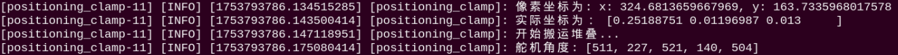

* **Program Analysis**

(1) Launch File Analysis

The launch startup file path is located at: **/home/ubuntu/ros2_ws/src/example/example/opencv/positioning_clamp.launch.py**

① `launch_setup` function

```py
def launch_setup(context):
    compiled = os.environ['need_compile']
    enable_display = launchConfiguration('enable_display', default='false')
    enable_display_arg = DeclarelaunchArgument('enable_display', default_value=enable_display)
    if compiled == 'True':
        example_package_path = get_package_share_directory('example')
    else:
        example_package_path = '/home/ubuntu/ros2_ws/src/example'
        
    
    color_recognition_launch = IncludelaunchDescription(
        PythonlaunchDescriptionSource(
            os.path.join(example_package_path, 'example/opencv/color_recognition.launch.py')),
        launch_arguments={
            'enable_display': enable_display
        }.items()
    )

    positioning_clamp_node = Node(
        package='example',
        executable='positioning_clamp',
        output='screen',
    )

    return [
            color_recognition_launch,
            positioning_clamp_node,
            ]

def generate_launch_description():
    return launchDescription([
        OpaqueFunction(function = launch_setup)
    ])
```

Includes the **color_recognition.launch.py** launch file in the **example** package to start color recognition related nodes. Defines the `positioning_clamp_node` node to start the `positioning_clamp` executable in the **example** package.

② `generate_launch_description` function

```py
def generate_launch_description():
    return launchDescription([
        OpaqueFunction(function = launch_setup)
    ])
```

Creates and returns a `launchDescription` object, calling the `launch_setup` function via `OpaqueFunction` as the standard entry point for ROS 2 launch files.

③ Main function

```py
if __name__ == '__main__':
    # Create a launchDescription object
    ld = generate_launch_description()

    ls = launchService()
    ls.include_launch_description(ld)
    ls.run()
```

Creates a `launchDescription` object and `launchService`, adds the launch description to the launch service and executes it, achieving system startup functionality.

(2) Python File Analysis

The source file is located at: **/home/ubuntu/ros2_ws/src/example/example/opencv/include/positioning_clamp.py**

① Import packages

Imports required modules via import statements.

```py
import os
import cv2
import yaml
import time
import math
import rclpy
import threading
import numpy as np
from sdk import common
from math import radians
from rclpy.node import Node
from cv_bridge import CvBridge
from std_srvs.srv import Trigger
from servo_controller import bus_servo_control
from rclpy.executors import MultiThreadedExecutor
from ros_robot_controller_msgs.msg import BuzzerState
from sensor_msgs.msg import Image as RosImage, CameraInfo
from kinematics.kinematics_control import set_pose_target
from kinematics_msgs.srv import SetRobotPose, SetJointValue
from servo_controller_msgs.msg import ServosPosition, ServoPosition
```

**bus_servo_control**: Tool library used to control servo motion.

**MultiThreadedExecutor**: ROS 2 multi-threaded executor, used to concurrently execute multiple tasks.

**BuzzerState**: ROS message type, used to represent buzzer status.

**set_pose_target**: Control function used to set the target pose of the robotic arm.

**SetRobotPose, SetJointValue**: ROS service types, used to set the pose and joint angles of the robotic arm respectively.

**ServosPosition, ServoPosition**: ROS message types, used to publish the target positions and states of servos.

② `PositioningClamp` initialization

```py
class PositioningClamp(Node):
    def __init__(self, name):
        rclpy.init()
        super().__init__(name, allow_undeclared_parameters=True, automatically_declare_parameters_from_overrides=True)
        self.bridge = CvBridge()  # Used for the conversion between ROS Image messages and OpenCV images. Used for conversion between ROS Image messages and OpenCV images
        self.K = None
        self.count = 0
        self.pick_pitch = 80
        self.result_image = None
        self.camera_type = os.environ['CAMERA_TYPE']
        self.config_file = 'transform.yaml'
        self.calibration_file = 'calibration.yaml'
        self.config_path = "/home/ubuntu/ros2_ws/src/app/config/"

        self.previous_pose = None  # Previous detected position.
        self.start = True

        self.servos_pub = self.create_publisher(ServosPosition, 'servo_controller', 1)# Servo control Servo control

        # Subscribe to image topic. Subscribe to image topic
        self.image_sub = self.create_subscription(RosImage, '/color_detection/result_image', self.image_callback, 1)
        self.camera_info_sub = self.create_subscription(CameraInfo, '/depth_cam/rgb/camera_info', self.camera_info_callback, 1)


        # Wait for the service to start. Wait for service to start
        self.client = self.create_client(Trigger, '/controller_manager/init_finish')
        self.client.wait_for_service()
        self.client = self.create_client(Trigger, '/kinematics/init_finish')
        self.client.wait_for_service()
        self.kinematics_client = self.create_client(SetRobotPose, '/kinematics/set_pose_target')
        self.kinematics_client.wait_for_service()

        threading.Thread(target=self.run, daemon=True).start()
```

Initializes the ROS node, allowing undeclared parameters and automatically declaring parameters from overrides. Creates a `CvBridge` object for format conversion. Initializes the camera intrinsic matrix, counter variable, target pitch angle, image storage variables, etc. Obtains camera type from environment variables, and sets configuration file path and name. Creates publishers to publish servo position messages. Subscribes to the `/color_detection/result_image` image topic and `/depth_cam/rgb/camera_info` camera info topic, specifying `image_callback` and `camera_info_callback` as callbacks respectively. Waits for `/controller_manager/init_finish` and `/kinematics/init_finish` services to start, and obtains the kinematics service client. Starts a thread to execute the `run` method.

③ `get_yaml` function

```py
    def get_yaml(self):
        with open(self.config_path + self.config_file, 'r') as f:
            config = yaml.safe_load(f)

            # Convert to numpy array. Convert to numpy array
            extristric = np.array(config['extristric'])
            corners = np.array(config['corners']).reshape(-1, 3)
            self.white_area_center = np.array(config['white_area_pose_world'])

        tvec = extristric[:1]  # Take the first row. Take first row
        rmat = extristric[1:]  # Take the last three rows. Take last three rows

        tvec, rmat = common.extristric_plane_shift(np.array(tvec).reshape((3, 1)), np.array(rmat), 0.03)
        self.extristric = tvec, rmat
```

Loads the transformation configuration file, parses out extrinsic parameters including translation vector and rotation matrix, corner coordinates, and white area world coordinates. Performs planar offset processing on translation vector and rotation matrix, and stores extrinsic parameters.

④ `camera_info_callback` function

```py
    def camera_info_callback(self, msg):
        self.K = np.matrix(msg.k).reshape(1, -1, 3)
```

Camera info callback function that obtains camera intrinsic matrix from the message and converts it into NumPy matrix format.

⑤ `image_callback` function

```py
    # Process ROS node data. Process ROS node data
    def image_callback(self, result_image):
        # Convert ROS Image message to OpenCV image. Convert ROS Image message to OpenCV image
        self.result_image = self.bridge.imgmsg_to_cv2(result_image, "mono8")
```

Image topic callback function that converts ROS Image messages into OpenCV single-channel `mono8` images and stores them.

⑥ `send_request` function

```py
    def send_request(self, client, msg):
        future = client.call_async(msg)
        while rclpy.ok():
            if future.done() and future.result():
                return future.result()
```

Sends asynchronous requests to service clients and waits for response completion in a loop. Returns the result if successful, ensuring the node can process callbacks while waiting.

⑦ `start_sorting` function

```py
    def start_sorting(self, pose_t, pose_R):
        self.get_logger().info("Start transporting and stacking...")
        msg = set_pose_target(pose_t, self.pick_pitch,  [-90.0, 90.0], 1.0)
        res = self.send_request(self.kinematics_client, msg)
        if res.pulse:  # Reachable
            servo_data = res.pulse
            self.get_logger().info(f"Servo angle: {list(res.pulse)}")

            # Drive servo
            bus_servo_control.set_servo_position(self.servos_pub, 1.0, ((6, servo_data[0]), (5, servo_data[1]), (4, servo_data[2]), (3, servo_data[3]), (2, servo_data[4])))
            time.sleep(2)

            bus_servo_control.set_servo_position(self.servos_pub, 1.0, ((1, 550),))
            time.sleep(2)

            bus_servo_control.set_servo_position(self.servos_pub, 1.0, ((6, 500), (5, 600), (4, 800), (3, 100), (2, 500), (1, 210)))  # Set robotic arm initial position
            time.sleep(2)

        else:
            self.start = False
            self.get_logger().info("Cannot move to this position")
```

Receives target position and pose, planning the robotic arm motion path via kinematics services. If the target position is reachable, gets servo angles and drives corresponding servos to move to the target position, controls the gripper to close, and resets the robotic arm to initial positions. If unreachable, it sets the startup flag to False and outputs prompt information.

⑧ `run` function

```py
    def run(self):
        while True:
            try:
                if self.result_image is not None :
                    # Calculate the detected contours. Calculate recognized contours
                    contours = cv2.findContours(self.result_image, cv2.RETR_EXTERNAL,cv2.CHAIN_APPROX_NONE)[-2]  # Find all contours. Find all contours

                    if contours :
                        # Find the largest contour. Find largest contour
                        c = max(contours, key = cv2.contourArea)
                        # Decide whether to proceed based on contour size. Determine whether to proceed based on contour size
                        rect = cv2.minAreaRect(c)  # Get the minimum bounding rectangle. Get minimum bounding rectangle
                        corners = np.intp(cv2.boxPoints(rect))  # Get the four corner points of the minimum bounding rectangle. Get minimum bounding rectangle
                        x, y, yaw = rect[0][0],rect[0][1],rect[2]
                        if self.camera_type == 'USB_CAM':
                            x, y = distortion_inverse_map.undistorted_to_distorted_pixel(target[2][0], target[2][1], self.intrinsic, self.distortion)

                        self.get_yaml()
                        projection_matrix = np.row_stack((np.column_stack((self.extristric[1],self.extristric[0])), np.array([[0, 0, 0, 1]])))
                        world_pose = common.pixels_to_world([[x,y]], self.K, projection_matrix)[0]
                        world_pose[0] = -world_pose[0]
                        world_pose[1] = -world_pose[1]
                        position = self.white_area_center[:3, 3] + world_pose
                        world_pose[2] = 0.03
                        config_data = common.get_yaml_data(os.path.join(self.config_path, self.calibration_file))
                        offset = tuple(config_data['pixel']['offset'])
                        scale = tuple(config_data['pixel']['scale'])
                        for i in range(3):
                            position[i] = position[i] * scale[i]
                            position[i] = position[i] + offset[i]
                        position[2] = 0.015
                          # If previous_pose is None, it means this is the first calculation. previous_poseNone，
                        if self.previous_pose is None:
                            self.previous_pose = position
                            continue

                        # Calculate the difference between the current position and the previous position.
                        position_difference = np.linalg.norm(np.array(position) - np.array(self.previous_pose))

                        # Check whether the position change is small enough.
                        if position_difference < 0.01:  # The threshold can be adjusted as needed.
                            self.count += 1  # If the position change is small, increment the counter. ，+1

                        else:
                            self.count = 0  # If the position change is large, reset the counter. ，
                            self.previous_pose = position
                        
                        if self.count >= 60:  # If the counter reaches the threshold, consider the position stable. ，
                            config_data = common.get_yaml_data(os.path.join(self.config_path, self.calibration_file))
                            offset = tuple(config_data['kinematics']['offset'])
                            scale = tuple(config_data['kinematics']['scale'])
                            for i in range(3):
                                position[i] = position[i] * scale[i]
                                position[i] = position[i] + offset[i]
                            # Print pixel coordinates and real-world coordinates. Print pixel coordinates
                            self.get_logger().info(f"Pixel coordinates: x: {x}, y: {y}")
                            self.get_logger().info(f"Actual coordinates: {position}")
                            self.start_sorting(position,yaw)
                            self.count = 0
                            break
```

Thread function that processes image data in a loop. If the image is valid, extracts contours and finds the largest contour, obtaining the target center point pixel coordinates and rotation angle via minimum bounding rectangle. Applies distortion correction for USB cameras. Calls the `get_yaml` method to get configuration parameters, constructs the projection matrix to convert pixel coordinates into world coordinates, applies scaling and offset parameters to obtain actual coordinates. Determines stability by comparing current position with the previous position. When position change is less than the threshold for 60 consecutive frames, it judges the position as stable, calls the `start_sorting` method to execute gripping, resets the counter, and exits the loop. Outputs prompt information if no contour is detected, and outputs error logs when exceptions occur.

⑨ `main` function

```py
def main():
    node = PositioningClamp('positioning_clamp')
    executor = MultiThreadedExecutor()
    executor.add_node(node)
    executor.spin()
    node.destroy_node()
```

Creates an instance of the `PositioningClamp` node named `positioning_clamp`, adds the node using a multi-threaded executor, and starts the spin loop. Destroys the node when the program ends.

### 4.1.12 Color Sorting

* **Experiment Description**

The robotic arm can recognize red, green, and blue blocks within the visual area, calculate their spatial coordinates, and sort them into their respective target positions.

* **Operation Steps**

> [!NOTE]
>
> * **Command input must be strictly case-sensitive. The Tab key can be pressed to autocomplete keywords.**
>
> * **Before starting the robotic arm, ensure the base of the robotic arm is secured to the desktop or a stable platform using a G clamp. The robotic arm will generate swing and inertia during operation. If not secured, this may cause the device to tip over, fall, or get damaged, and may also pose a safety risk.**

1. Please refer to [1. Tutorials / 1. NexArm User Manual / 1.9 Object Grasping Adjustment](https://wiki.hiwonder.com/projects/NexArm/en/ros-version/docs/1.%20NexArm%20User%20Manual.html#_1-9-object-grasping-adjustment) to place the robotic arm correctly on the map and perform position calibration for the robotic arm. If calibration is not performed, it may affect the gripping of color blocks.

2. Start the robotic arm and connect it to the remote control software **VNC**. For instructions on how to connect to the remote desktop, refer to [1. Tutorials / 1. NexArm User Manual / 1.5 Development Environment Setup and Configuration](https://wiki.hiwonder.com/projects/NexArm/en/ros-version/docs/1.%20NexArm%20User%20Manual.html#_1-5-development-environment-setup-and-configuration).

3. Click the command line terminal  on the system interface to open the command bar. Enter the command to stop the app auto-start service.

```
~/.stop_ros.sh
```

4. Enter the command and press **Enter**.

```
ros2 launch example color_sorting_node.launch.py
```

5. After the application starts successfully, the following prompt message is printed in the terminal, and the camera feed pops up automatically:

   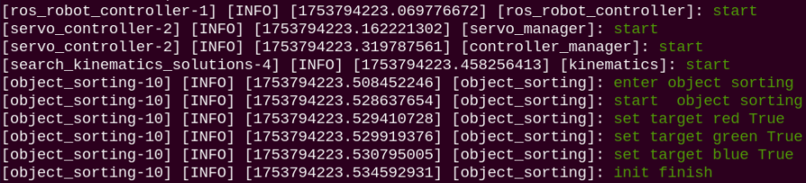

6. To close this application, press **Ctrl+C** in the terminal interface. If closing fails, please try repeatedly.

* **Program Outcome**

After starting the application, place red, green, and blue blocks into the recognition area of the robotic arm. When the robotic arm recognizes a target block, it will grip it and place it into the corresponding position in the sorting area. If color recognition is inaccurate, refer to [1. Tutorials / 1. NexArm User Manual / 1.6 Color Threshold Adjustment](https://wiki.hiwonder.com/projects/NexArm/en/ros-version/docs/1.%20NexArm%20User%20Manual.html#_1-6-color-threshold-adjustment) for adjustment.

* **Program Analysis**

(1) Launch File Analysis

The launch startup file path is located at: **/home/ubuntu/ros2_ws/src/example/example/opencv/color_sorting_node.launch.py**

① `launch_setup` function

```py
def launch_setup(context):
    compiled = os.environ['need_compile']
    start = launchConfiguration('start', default='true')
    start_arg = DeclarelaunchArgument('start', default_value=start)
    display = launchConfiguration('display', default='true')
    display_arg = DeclarelaunchArgument('display', default_value=display)
    broadcast = launchConfiguration('broadcast', default='false')
    broadcast_arg = DeclarelaunchArgument('broadcast', default_value=broadcast)

    if compiled == 'True':
        sdk_package_path = get_package_share_directory('sdk')
        peripherals_package_path = get_package_share_directory('peripherals')
    else:
        sdk_package_path = '/home/ubuntu/ros2_ws/src/driver/sdk'
        peripherals_package_path = '/home/ubuntu/ros2_ws/src/peripherals'

    depth_camera_launch = IncludelaunchDescription(
        PythonlaunchDescriptionSource(
            os.path.join(peripherals_package_path, 'launch/depth_camera.launch.py')),
    )

    sdk_launch = IncludelaunchDescription(
        PythonlaunchDescriptionSource(
            os.path.join(sdk_package_path, 'launch/armpi_ultra.launch.py')),
    )

    color_sorting_node = Node(
        package='app',
        executable='object_sorting',
        output='screen',
        parameters=[{ 'start': start, 'display': display, 'broadcast': broadcast}]
    )

    return [start_arg,
            display_arg,
            broadcast_arg,
            sdk_launch,
            depth_camera_launch,
            color_sorting_node,
            ]
```

Based on environment variables, acquires package paths for **peripherals**, **sdk**, and **example**, and includes their launch files. Defines the `color_sorting_node` node with parameters.

(2) Python File Analysis

The source file is located at: **/home/ubuntu/ros2_ws/src/example/example/opencv/include/color_sorting_node.py**

① Import packages

```py
import os
import cv2
import yaml
import time
import math
import copy
import queue
import threading
import numpy as np

import rclpy
from rclpy.node import Node
from cv_bridge import CvBridge
from std_srvs.srv import Trigger, SetBool
from sensor_msgs.msg import Image, CameraInfo
from rclpy.executors import MultiThreadedExecutor
from rclpy.callback_groups import ReentrantCallbackGroup

from sdk import common, fps
from app.common import Heart
from dt_apriltags import Detector
from interfaces.srv import SetStringBool
from kinematics_msgs.srv import SetRobotPose, SetJointValue
from servo_controller_msgs.msg import ServosPosition
from servo_controller.bus_servo_control import set_servo_position
from kinematics.kinematics_control import set_pose_target, set_joint_value_target
from app.utils import calculate_grasp_yaw, position_change_detect, pick_and_place, image_process, distortion_inverse_map
```

* **rclpy.node.Node**: Node base class for ROS 2 nodes, providing node creation, publishing, subscribing, and service functionalities.
* **ros_robot_controller_msgs.msg.BuzzerState**: Buzzer message type for buzzer status control.
* **ros_robot_controller_msgs.msg.SetBusServoState**: Bus servo state message type.
* **ros_robot_controller_msgs.msg.ServosPosition**: Multi-servo position message type for robotic arm joint and gripper control.
* **sensor_msgs.msg.Image**: ROS standard image message type.
* **sensor_msgs.msg.CameraInfo**: ROS camera intrinsic information message type.
* **std_srvs.srv.Trigger**: ROS standard service Trigger type without parameters.
* **std_srvs.srv.SetBool**: ROS standard SetBool service type for setting boolean values.
* **std_srvs.srv.SetString**: ROS standard SetString service type for setting string parameters.
* **app.common.Heart**: Heartbeat management class for connection detection.
* **sdk.common.set_servo_position**: Utility function for controlling bus servo motion.
* **example.opencv.include.color_recognition**: Color recognition module.
* **example.opencv.include.apriltag_detect**: AprilTag detection module.
* **example.opencv.include.transform**: Spatial coordinate transformation module.

② `ObjectSortingNode` class

```py
    def __init__(self, name):
        rclpy.init()
        super().__init__(name, allow_undeclared_parameters=True, automatically_declare_parameters_from_overrides=True)
        # proto_path = '/home/ubuntu/ros2_ws/src/app/app/hed_model/deploy.prototxt'
        # model_path = '/home/ubuntu/ros2_ws/src/app/app/hed_model/hed_pretrained_bsds.caffemodel'
        # self.image_process = image_process.GetObjectSurface(proto_path, model_path)
        self.image_process = image_process.GetObjectSurface()
        self.at_detector = Detector(searchpath=['apriltags'],
               families='tag36h11',
               nthreads=4,
               quad_decimate=1.0,
               quad_sigma=0.0,
               refine_edges=1,
               decode_sharpening=0.25,
               debug=0)
        self.lock = threading.RLock()
        self.fps = fps.FPS()    # Frame rate counter
        self.bridge = CvBridge()  # Used for conversion between ROS Image messages and OpenCV images
        self.image_queue = queue.Queue(maxsize=2)
        self.config_file = 'transform.yaml'
        self.calibration_file = 'calibration.yaml'
        self.config_path = "/home/ubuntu/ros2_ws/src/app/config/"
        self.data = common.get_yaml_data(os.path.join(self.config_path, "lab_config.yaml"))  
        self.lab_data = self.data['/**']['ros__parameters']
        self.camera_type = os.environ['CAMERA_TYPE']
        
        self.tag_size = 0.025
        self.min_area = 500
        self.max_area = 7000
        self.target_labels = {
            "red": False,
            "green": False,
            "blue": False,
            "tag1": False,
            "tag2": False,
            "tag3": False,
        }
        self.running = True
        # Initialize basic parameters
        self._init_parameters()
        # sub
        self.joints_pub = self.create_publisher(ServosPosition, 'servo_controller', 1)
        self.result_publisher = self.create_publisher(Image, '~/image_result',  1)

        self.timer_cb_group = ReentrantCallbackGroup()
        # services and topics
        self.enter_srv = self.create_service(Trigger, '~/enter', self.enter_srv_callback)
        self.exit_srv = self.create_service(Trigger, '~/exit', self.exit_srv_callback)
        self.enable_sorting_srv = self.create_service(SetBool, '~/enable_sorting', self.enable_sorting_srv_callback)
        self.set_target_srv = self.create_service(SetStringBool, '~/set_target', self.set_target_srv_callback)
        self.kinematics_client = self.create_client(SetRobotPose, 'kinematics/set_pose_target')
        self.kinematics_client.wait_for_service()
        self.set_joint_value_target_client = self.create_client(SetJointValue, 'kinematics/set_joint_value_target', callback_group=self.timer_cb_group)
        self.set_joint_value_target_client.wait_for_service()
        self.timer = self.create_timer(0.0, self.init_process, callback_group=self.timer_cb_group)
```

Initializes the ROS node, allowing undeclared parameters and automatically declaring parameters from overrides. Creates the image processing object, AprilTag detector, thread lock, frame rate counter, and image queue. Sets configuration file paths, loads LAB color space configuration data, and obtains camera type from environment variables. Defines target placement dictionaries, initializes target label status, running flags, and other parameters. Creates publishers for servo positions and result images. Creates callback groups, defines services for entering, exiting, enabling sorting, and setting targets, as well as kinematics service clients, subscribes to camera info and image topics, and starts the initialization process timer to complete node initialization.

③ `get_node_state` method

```py
    def get_node_state(self, request, response):
        response.success = True
        return response
```

Sets the `success` field of the response to True, indicating that the service was successful. Returns the response object, completing service request processing.

④ `_init_parameters` method

```py
    def _init_parameters(self):
        self.heart = None
        self.endpoint = None
        self.target_miss_count = 0
        self.transport_info = None
        self.intrinsic = None
        self.distortion = None
        self.start_transport = False
        self.enable_sorting = False
        self.white_area_center = None
        self.enter = False
        self.roi = []
        self.count_move = 0
        self.count_still = 0
        self.target = None
        self.start_get_roi = False
        self.last_position = None
        self.last_object_info_list = None
        self.image_sub = None
        self.camera_info_sub = None
        self.data = common.get_yaml_data(os.path.join(self.config_path, "lab_config.yaml"))  
        self.lab_data = self.data['/**']['ros__parameters']
```

Initializes instance parameters including heartbeat, endpoint, target miss counter, transport info, camera intrinsic and distortion parameters, state flags, white area center coordinates, ROI boundaries, still counters, and target status.

⑤ `init_process` method

```py
    def init_process(self):
        self.timer.cancel()
        
        threading.Thread(target=self.main, daemon=True).start()
        threading.Thread(target=self.transport_thread, daemon=True).start()
        if self.get_parameter('start').value:
            self.enter_srv_callback(Trigger.Request(), Trigger.Response())
            req = SetBool.Request()
            req.data = True 
            res = SetBool.Response()
            self.enable_sorting_srv_callback(req, res)

        if not self.get_parameter('broadcast').value:
            target_list = ["red", "green", "blue"]
            req = SetStringBool.Request()
            req.data_bool = True
            for i in target_list:
                req.data_str = i
                res = SetBool.Response()
                self.set_target_srv_callback(req, res)
        self.create_service(Trigger, '~/init_finish', self.get_node_state)
        self.get_logger().info('\033[1;32m%s\033[0m' % 'init finish')
```

Cancels the initialization timer, starts the main logic thread and transport thread. If the startup parameter is true, triggers enter service and enable sorting service. Sets default status of target labels, creates the initialization finish service, and outputs the initialization finish log.

⑥ `go_home` method

```py
    def go_home(self, interrupt=True):
        if self.target is not None:
            if self.target[0] in ["bule", "tag1"]:
                t = 1.6
        elif self.target is not None:
            if self.target[0] in ["green", "tag2"]:
                t = 1.3
        elif self.target is not None:
            if self.target[0] in ["red", "tag3"]:
                t = 1.0
        else :
            t = 1.0
        if interrupt:
            set_servo_position(self.joints_pub, 0.5, ((1, 200), ))
            time.sleep(0.5)
        joint_angle = [500, 600, 825, 110, 500]

        set_servo_position(self.joints_pub, 1, ((5, joint_angle[1]), (4, joint_angle[2]), (3, joint_angle[3]), (2, 500)))
        time.sleep(1)

        set_servo_position(self.joints_pub, 1, ((6, joint_angle[0]), ))
        time.sleep(1)
```

Sets servo angles for all joints to move the robotic arm to the home position based on the target type, with a 1-second delay between arm motion and gripper opening.

⑦ `get_roi` method

```py
    def get_roi(self):
        with open(self.config_path + self.config_file, 'r') as f:
            config = yaml.safe_load(f)

            # Convert to numpy array
            extristric = np.array(config['extristric'])
            corners = np.array(config['corners']).reshape(-1, 3)
            self.white_area_center = np.array(config['white_area_pose_world'])
        while True:
            intrinsic = self.intrinsic
            distortion = self.distortion
            if intrinsic is not None and distortion is not None:
                break
            time.sleep(0.1)

        tvec = extristric[:1]  # Take first row
        rmat = extristric[1:]  # Take last three rows

        tvec, rmat = common.extristric_plane_shift(np.array(tvec).reshape((3, 1)), np.array(rmat), 0.03)
        self.extristric = tvec, rmat
        tvec, rmat = common.extristric_plane_shift(np.array(tvec).reshape((3, 1)), np.array(rmat), 0.04)
        imgpts, jac = cv2.projectPoints(corners[:-1], np.array(rmat), np.array(tvec), intrinsic, distortion)
        imgpts = np.int32(imgpts).reshape(-1, 2)

        # Crop ROI region
        x_min = min(imgpts, key=lambda p: p[0])[0] # Minimum value of X-axis
        x_max = max(imgpts, key=lambda p: p[0])[0] # Maximum value of X-axis
        y_min = min(imgpts, key=lambda p: p[1])[1] # Minimum value of Y-axis
        y_max = max(imgpts, key=lambda p: p[1])[1] # Maximum value of Y-axis
        roi = np.maximum(np.array([y_min, y_max, x_min, x_max]), 0)
            
        self.roi = roi
```

Loads conversion configuration files, parses extrinsic parameters and corner coordinates. Based on camera intrinsic and distortion parameters, projects world coordinate corners to the image plane, calculates and sets the Region of Interest, ROI.

⑧ `enter_srv_callback` method

```py
    def enter_srv_callback(self, request, response):
        self.get_logger().info('\033[1;32m%s\033[0m' % "enter object sorting")
        self._init_parameters()
        self.heart = Heart(self, '~/heartbeat', 5, lambda _: self.exit_srv_callback(request=Trigger.Request(), response=Trigger.Response()))  # Heartbeat package
        for k, v in self.target_labels.items():
            self.target_labels[k] = False
        self.image_sub = self.create_subscription(Image, '/depth_cam/rgb/image_raw', self.image_callback, 1)
        self.camera_info_sub = self.create_subscription(CameraInfo, '/depth_cam/rgb/camera_info', self.camera_info_callback, 1)
        self.start_get_roi = True
        joint_angle = [500, 600, 825, 110, 500]
        
        set_servo_position(self.joints_pub, 1, ((6, 500), (5, joint_angle[1]), (4, joint_angle[2]), (3, joint_angle[3]), (2, 500), (1, 200)))

        self.enter = True
        
        response.success = True
        response.message = "start"
        return response
```

Callback for entering sorting feature. Subscribes to camera image and camera info topics, creates heartbeat, resets robotic arm to initial pose, updates running status, and returns a success response.

⑨ `exit_srv_callback` method

```py
    def exit_srv_callback(self, request, response):
        if self.enter:
            self.get_logger().info('\033[1;32m%s\033[0m' % "exit  object sorting")
            if self.image_sub is not None:
                self.destroy_subscription(self.image_sub)
                self.image_sub = None
            if self.camera_info_sub is not None:
                self.destroy_subscription(self.camera_info_sub)
                self.camera_info_sub = None
            self.heart.destroy()
            self.enter = False
            self.start_transport = False
            pick_and_place.interrupt(True)
        
        response.success = True
        response.message = "start"
        return response
```

Callback for exiting sorting feature. Unsubscribes from camera topics, destroys heartbeat, opens gripper, resets running flags, and returns a success response.

⑩ `enable_sorting_srv_callback` method

```py
    def enable_sorting_srv_callback(self, request, response):
        if request.data:
            self.get_logger().info('\033[1;32m%s\033[0m' % 'start  object sorting')
            pick_and_place.interrupt(False)
            self.enable_sorting = True
        else:
            self.get_logger().info('\033[1;32m%s\033[0m' % 'stop  object sorting')
            pick_and_place.interrupt(True)
            self.enable_sorting = False
        
        response.success = True
        response.message = "start"
        return response
```

Callback for enabling sorting. Sets the sorting enable flag based on the request data, resets internal parameters, and returns a success response.

⑪ `set_target_srv_callback` method

```py
    def set_target_srv_callback(self, request, response):
        self.get_logger().info('\033[1;32mset target %s %s\033[0m' % (str(request.data_str), str(request.data_bool)))
        if request.data_str in self.target_labels:
            self.target_labels[request.data_str] = request.data_bool

        response.success = True
        response.message = "start"
        return response
```

Callback for setting sorting target. Updates target label status and sorting flags based on request parameters, and returns a success response.

⑫ `get_object_pixel_position` method

```py
    def get_object_pixel_position(self, bgr_image, roi):
        target_info = []
        draw_image = bgr_image.copy()
        roi_img = bgr_image[roi[0]:roi[1], roi[2]:roi[3]]
        roi_img = self.image_process.get_top_surface(roi_img)
        # cv2.imshow('roi_img', roi_img)
        image_lab = cv2.cvtColor(roi_img, cv2.COLOR_BGR2LAB)  # Convert to LAB space

        for i in ['red', 'green', 'blue']:
            index = 0
            mask = cv2.inRange(image_lab, tuple(self.lab_data['color_range_list'][i]['min']), tuple(self.lab_data['color_range_list'][i]['max']))  # Binarization
            # Smooth edges, remove small blocks, and merge adjacent blocks
            eroded = cv2.erode(mask, cv2.getStructuringElement(cv2.MORPH_RECT, (3, 3)))
            dilated = cv2.dilate(eroded, cv2.getStructuringElement(cv2.MORPH_RECT, (3, 3)))
            contours = cv2.findContours(dilated, cv2.RETR_EXTERNAL, cv2.CHAIN_APPROX_NONE)[-2]  # Find all contours(find all contours)
            contours_area = map(lambda c: (math.fabs(cv2.contourArea(c)), c), contours)  # Calculate contour area
            contours = map(lambda a_c: a_c[1], filter(lambda a: self.min_area <= a[0] <= self.max_area, contours_area))
            for c in contours:
                rect = cv2.minAreaRect(c)  # Get minimum bounding rectangle(obtain the minimum bounding rectangle)
                (center_x, center_y), _ = cv2.minEnclosingCircle(c)
                center_x, center_y = roi[2] + center_x, roi[0] + center_y
                # cv2.circle(draw_image, (int(center_x), int(center_y)), 8, (0, 0, 0), -1)
                corners = list(map(lambda p: (roi[2] + p[0], roi[0] + p[1]), cv2.boxPoints(rect)))  # Get minimum bounding rectangle, (obtain the four corner points of the minimum rectangle and convert to the coordinates of the original image
                cv2.drawContours(draw_image, [np.intp(corners)], -1, (0, 255, 255), 2, cv2.LINE_AA)  # Draw rectangle contour
                
                # cv2.line(draw_image, (int(center_x), 0), (int(center_x), 480), (255, 255, 0), 2, cv2.LINE_AA)
                index += 1  # Incremental numbering
                angle = int(round(rect[2]))  # Rectangle angle(rectangle angle)
                target_info.append([i, index, (int(center_x), int(center_y)), (int(rect[1][0]), int(rect[1][1])), angle])
        return draw_image, target_info
```

Detects target positions in the image using color recognition or AprilTag detection based on target types. Filters and sorts detected targets by distance, selects the closest target, and returns its pixel coordinates and bounding info.

⑬ `get_object_world_position` method

```py
    def get_object_world_position(self, position, intrinsic, extristric, white_area_center, height=0.03):
        projection_matrix = np.row_stack((np.column_stack((extristric[1], extristric[0])), np.array([[0, 0, 0, 1]])))
        world_pose = common.pixels_to_world([position], intrinsic, projection_matrix)[0]
        world_pose[0] = -world_pose[0]
        world_pose[1] = -world_pose[1]
        position = white_area_center[:3, 3] + world_pose
        position[2] = height
        
        config_data = common.get_yaml_data(os.path.join(self.config_path, self.calibration_file))
        offset = tuple(config_data['pixel']['offset'])
        scale = tuple(config_data['pixel']['scale'])
        for i in range(3):
            position[i] = position[i] * scale[i]
            position[i] = position[i] + offset[i]
        return position, projection_matrix
```

Transforms target pixel coordinates to world coordinates using camera intrinsic, extrinsic, and projection matrices. Adds white area center offset and applies calibration scaling to obtain precise spatial coordinates.

⑭ `calculate_pick_grasp_yaw` method

```py
    def calculate_pick_grasp_yaw(self, position, target, target_info, intrinsic, projection_matrix):
        yaw = math.degrees(math.atan2(position[1], position[0]))
        if position[0] < 0 and position[1] < 0:
            yaw = yaw + 180
        elif position[0] < 0 and position[1] > 0:
            yaw = yaw - 180
        # 0.09x0.015
        gripper_size = [common.calculate_pixel_length(0.09, intrinsic, projection_matrix),
                        common.calculate_pixel_length(0.015, intrinsic, projection_matrix)]

        return calculate_grasp_yaw.calculate_gripper_yaw_angle(target, target_info, gripper_size, yaw)
```

Calculates the pick yaw angle based on target coordinates, angle, and camera view angle for precise gripping.

⑮ `calculate_place_grasp_yaw` method

```py
    def calculate_place_grasp_yaw(self, position, angle=0):
        yaw = math.degrees(math.atan2(position[1], position[0]))
        if position[0] < 0 and position[1] < 0:
            yaw = yaw + 180
        elif position[0] < 0 and position[1] > 0:
            yaw = yaw - 180
        yaw1 = yaw + angle
        if yaw < 0:
            yaw2 = yaw1 + 90
        else:
            yaw2 = yaw1 - 90

        yaw = yaw2
        if abs(yaw1) < abs(yaw2):
            yaw = yaw1
        yaw = 500 + int(yaw / 240 * 1000)

        return yaw
```

Calculates the placement yaw angle based on destination coordinates and orientation.

⑯ `transport_thread` method

```py
    def transport_thread(self):
        while self.running:
            if self.start_transport:
                position, yaw, target = self.transport_info
                if position[0] > 0.22:
                    position[2] += 0.01
                config_data = common.get_yaml_data(os.path.join(self.config_path, self.calibration_file))
                offset = tuple(config_data['kinematics']['offset'])
                scale = tuple(config_data['kinematics']['scale'])
                for i in range(3):
                    position[i] = position[i] * scale[i]
                    position[i] = position[i] + offset[i]
                # self.get_logger().info(f'pick2:{position}')

                finish = pick_and_place.pick(position, 80, yaw, 540, 0.02, self.joints_pub, self.kinematics_client)
                if finish:
                    position = copy.deepcopy(self.place_position[target[0]])

                    yaw = self.calculate_place_grasp_yaw(position, 0)
                    config_data = common.get_yaml_data(os.path.join(self.config_path, self.calibration_file))
                    offset = tuple(config_data['kinematics']['offset'])
                    scale = tuple(config_data['kinematics']['scale'])
                    angle = math.degrees(math.atan2(position[1], position[0]))
                    if angle > 45:
                        # self.get_logger().info(f'1:{position}')
                        position = [position[0] * scale[1], position[1] * scale[0], position[2] * scale[2]]
                        position = [position[0] + offset[1], position[1] + offset[0], position[2] + offset[2]]
                    elif angle < -45:
                        # self.get_logger().info(f'2:{position}')
                        position = [position[0] * scale[1], position[1] * scale[0], position[2] * scale[2]]
                        position = [position[0] + offset[1], position[1] - offset[0], position[2] + offset[2]]
                    else:
                        # self.get_logger().info(f'3:{position}')
                        position = [position[0] * scale[0], position[1] * scale[1], position[2] * scale[2]]
                        position = [position[0] + offset[0], position[1] + offset[1], position[2] + offset[2]]

                    # self.get_logger().info(f'{position}')
                    finish = pick_and_place.place(position, 80, yaw, 200, self.joints_pub, self.kinematics_client)
                    if finish:
                        self.go_home(False)
                    else:
                        self.go_home(True)
                else:
                    self.go_home(True)
                self.target = None
                self.start_transport = False
            else:
                time.sleep(0.1)
```

Transport worker thread that continuously checks transport requests. When transport is triggered, calls kinematics services to execute pick-and-place trajectories, moving from pick position to corresponding sorting bin and returning home.

⑰ In-class `main` method

```py
    def main(self):
        while self.running:
            if self.enter:
                try:
                    bgr_image = self.image_queue.get(block=True, timeout=1)
                except queue.Empty:
                    continue
                
                if self.start_get_roi:
                    self.get_roi()
                    self.start_get_roi = False
                roi = self.roi.copy()
                intrinsic = self.intrinsic
                if len(roi) > 0 and self.enable_sorting and not self.start_transport:
                    display_image, target_info = self.get_object_pixel_position(bgr_image, roi)
                    
                    tags = self.at_detector.detect(cv2.cvtColor(bgr_image, cv2.COLOR_RGB2GRAY), True, (intrinsic[0,0], intrinsic[1,1], intrinsic[0,2], intrinsic[1,2]), self.tag_size)
                    if len(tags) > 0:
                        index = 0
                        for tag in tags:
                            if 'tag%d'%tag.tag_id in self.target_labels:
                                corners = tag.corners.astype(int)
                                cv2.drawContours(display_image, [corners], -1, (0, 255, 255), 2, cv2.LINE_AA)
                                rect = cv2.minAreaRect(np.array(tag.corners).astype(np.float32))
                                # rect contains (center, (width, height), angle)
                                (center, (width, height), angle) = rect
                                index += 1
                                target_info.append(['tag%d'%tag.tag_id, index, (int(center[0]), int(center[1])), (int(width), int(height)), angle])
                    if target_info:
                        if self.last_object_info_list:
                            # Reorder by comparing with previous object positions
                            target_info = position_change_detect.position_reorder(target_info, self.last_object_info_list, 20)
                    self.last_object_info_list = copy.deepcopy(target_info)
                    for target in target_info:
                        cv2.putText(display_image, '{}'.format(target[0]),(target[2][0] - 4 * len(target[0] + str(target[1])), target[2][1] + 5),
                                    cv2.FONT_HERSHEY_SIMPLEX, 0.6, (0, 255, 0), 2)
```

Main sorting logic thread. Acquires images from the queue, gets ROI, processes color recognition and AprilTag detection, verifies target stability across frames, calculates spatial coordinates and yaw angles, and triggers transport actions.

⑱ `camera_info_callback` method

```py
    def camera_info_callback(self, msg):
        self.intrinsic = np.matrix(msg.k).reshape(1, -1, 3)
        self.distortion = np.array(msg.d)
```

Camera info callback function. Stores the camera intrinsic matrix and distortion coefficients, and unsubscribes from the camera info topic after obtaining them.

⑲ `image_callback` method

```py
    def image_callback(self, ros_rgb_image):
        # Convert ROS image to OpenCV format
        cv_image = self.bridge.imgmsg_to_cv2(ros_rgb_image, "bgr8")
        bgr_image = np.array(cv_image, dtype=np.uint8)
        if self.image_queue.full():
            # If queue is full, discard oldest image
            self.image_queue.get()
        # Put image into queue
        self.image_queue.put((bgr_image))
```

Image subscription callback function. Converts ROS image messages to OpenCV BGR format images and stores them in the image queue.

⑳ Main function

```py
def main():
    node = ObjectSortingNode('object_sorting')
    executor = MultiThreadedExecutor()
    executor.add_node(node)
    try:
        executor.spin()
    except KeyboardInterrupt:
        node.running = False  # Stop thread flag
        executor.shutdown()
```

Creates and runs the `ObjectSortingNode` instance with a multi-threaded executor, handling clean shutdown upon exit.

### 4.1.13 Modifying the Default Recognized Color

Here the analysis is based on changing the default recognized color in positioning and grasping. Modifying default colors in other feature applications follows the same principle.

The source file is located at: **/home/ubuntu/ros2_ws/src/example/example/opencv/include/color_recognition.py**

When needing to change the recognized color of the robotic arm, change the parameter in the boxed code to **"blue"** or **"green"**.


<p id ="p6-2"></p>

## 4.2 Object Tracking

### 4.2.1 PID Principle

* **Introduction to the PID Algorithm**

The PID algorithm is one of the most widely used automatic controllers. In process control, control is performed according to the proportion (P), integral (I), and derivative (D) of the error. It features advantages such as simple principles, easy implementation, broad applicability, mutually independent control parameters, and relatively straightforward parameter selection.

Simplification:

$$
u(t)=K_p e(t)+K_i \int_0^t e(t)\,dt+K_d\frac{de(t)}{dt}
$$

Where: u(t) is the output of the PID controller.

Kp is the proportional coefficient.

Ti is the integral time constant:

$$
K_i=\frac{K_p}{T_i}
$$

Td is the derivative time constant:

$$
K_d=K_p \cdot T_d
$$

e(t) is the difference between the setpoint r(t) and the measured value (error).

* **PID Algorithm Principle**

A closed-loop control system is one where the output result of the controlled object is fed back to influence the output of the controller, forming one or more closed loops. Closed-loop control systems have positive feedback and negative feedback. Feedback signals opposite to the setpoint signal are called negative feedback, and those that are the same are called positive feedback. The control process of the PID algorithm can refer to the diagram below:

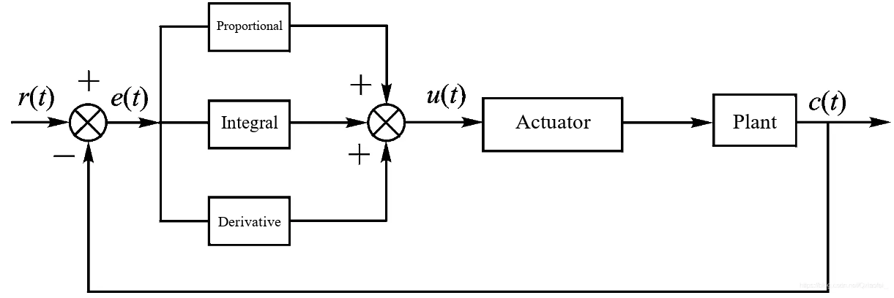

(1) Proportional

The error is the difference between the setpoint, configured threshold r(t), and the measured value of the output (c(t)). Adding a proportional element makes the system output proportional to the error, quickly reducing the error and achieving stability. When tending toward stability, the system still has steady-state error, and the steady-state error cannot be completely eliminated. The magnitude of proportional control depends on the size of Kp. The smaller the proportional coefficient Kp, the smaller the control effect, and the slower the system response. Conversely, the larger the proportional coefficient Kp, the stronger the control effect, and the faster the system response. However, an excessively large Kp will cause significant overshoot and oscillation in the system. The advantage of proportional control is fast response, while the disadvantage is the presence of steady-state error.

Explained with an example: There is a water bucket, but a hole leaks at the bottom of the bucket. A height of 1m still needs to be maintained. Currently there is 0.2m of water in the bucket, and 0.1m flows out every time water is added. We adopt P (proportional control). The current water volume is 0.2m, and the target water volume is 1m. Let Kp = 0.4. Then u = 0.4 * e, where e = previous water volume - current water volume.

The first time, the error is e(1) = 1 - 0.2 = 0.8m. Then the added water volume is Kp * 0.8 = 0.4 * 0.8 = 0.32m. Current water bucket water level: 0.2 + 0.32 - 0.1 = 0.42.

The second time, the error is e(2) = 1 - (0.2 + 0.32) = 0.48m. Then the added water volume is Kp * 0.48 = 0.192m. Current water bucket water level: 0.52 + 0.192 = 0.552.

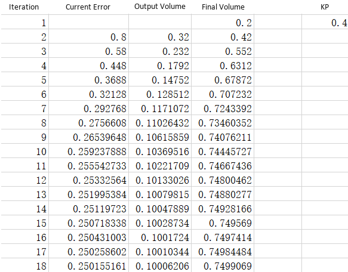

The water level eventually stabilizes at 0.75m, the error is 0.25m, the added water volume is 0.1, and the amount added each time exactly equals the leaked 0.1. The error here is the steady-state error.

Steady-state error is the difference from the target when the system reaches steady state.

(2) Integral

The role of the integral element is mainly used to eliminate steady-state error. Continuously accumulating the integral of the error over time makes the output result continuously change, reducing the error value. When the integration time is sufficient, steady-state error can be completely eliminated. The smaller Ti is, the stronger the integral effect is. Too strong an integral effect will cause system overshoot, or even oscillation. The advantage of the integral element is that it can completely eliminate steady-state error, while the disadvantage is reducing response speed and causing excessive overshoot.

In the above example, steady-state error exists after proportional control. To eliminate steady-state error, integral control is added. Let the integral constant Ki = 0.3.

The first time, the error is e(1) = 1 - 0.2 = 0.8m. Then the added water volume is Kp * 0.8 = 0.4 * 0.8 = 0.32m, and KI * e(1) = 0.3 * 0.8 = 0.24. Added water volume = 0.32 + 0.24 = 0.56. Current water bucket water level: 0.2 + 0.56 - 0.1 = 0.66.

The second time, the error is e(2) = 1 - 0.66 = 0.34m. Then the added water volume is Kp * 0.34 = 0.4 * 0.34 = 0.136m, and KI * (e(2) + e(1)) = 0.3 * (0.8 + 0.34) = 0.342. Added water volume = 0.136 + 0.342 = 0.478. Current water bucket water level: 0.66 + 0.478 - 0.1 = 1.038.

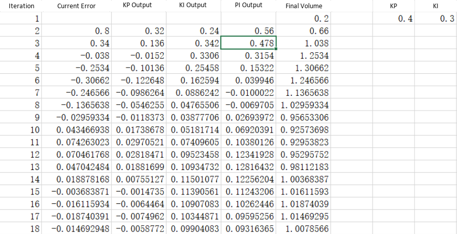

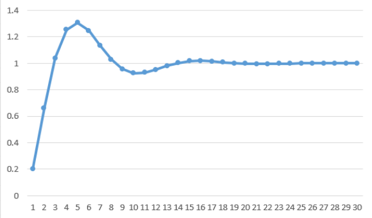

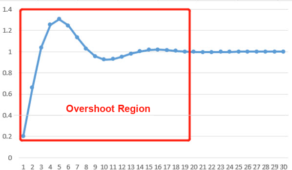

It can be found that after adding integral control, steady-state error is effectively eliminated, but overshoot occurs at the beginning.

(3) Derivative

Differentiating the error yields the slope of the error. The slope reflects the rate of change of the error signal. Therefore, the derivative element can adjust the error in advance, producing a control effect at the instant the error first appears or changes, avoiding excessive overshoot and reducing dynamic error and response time. The larger the derivative coefficient Td, the stronger the ability to suppress error changes. The advantage of the derivative element is suppressing overshoot and speeding up response speed, while the disadvantage is poor anti-interference capability. When interference signals are strong, adding the derivative element is not recommended.

In the above example, adding the integral element effectively eliminated steady-state error, but overshoot occurred. To weaken overshoot, derivative control is added. Let Kd = 0.3.

The first time, the error is e(1) = 1 - 0.2 = 0.8m. Then the added water volume is Kp * 0.8 = 0.4 * 0.8 = 0.32m, KI * e(1) = 0.3 * 0.8 = 0.24, and KD = 0 because the current water level difference is 0.8. Added water volume = 0.32 + 0.24 = 0.56. Current water bucket water level: 0.2 + 0.56 - 0.1 = 0.66.

The second time, the error is e(2) = 1 - 0.66 = 0.34m. Then the added water volume is Kp * 0.34 = 0.4 * 0.34 = 0.136m, KI * (e(2) + e(1)) = 0.3 * (0.8 + 0.34) = 0.342, and KD * (e(2) - e(1)) = 0.3 * (0.34 - 0.8) = -0.138. Added water volume = 0.136 + 0.342 - 0.138 = 0.34. Current water bucket water level: 0.66 + 0.478 - 0.1 = 0.9.

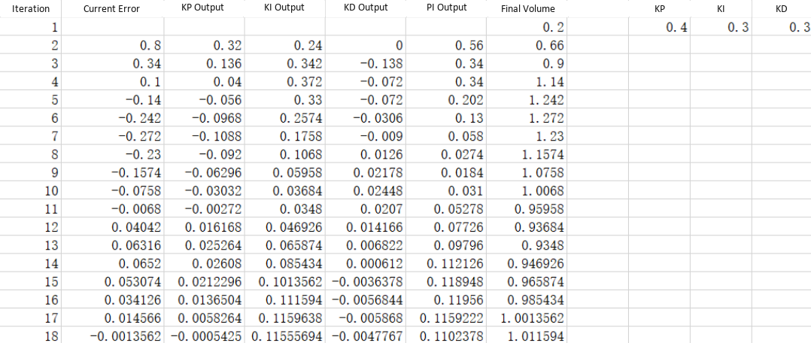


Compared with previous integral control, the overshoot portion is noticeably weakened.


### 4.2.2 Color Block Tracking

When the camera detects the target color block, which is red by default, the robotic arm moves following the movement of the color block.

* **Implementation Process**

First, subscribe to the topic message published by the color recognition node to obtain the recognized color information.

Next, after matching the target color, obtain the center position of the target image.

Finally, calculate the angles required to align the screen center with the target image center via inverse kinematics, publish the corresponding topic messages, and control the servos to rotate so that the robotic arm follows the target movement.

* **Feature Startup Steps**

> [!NOTE]
>
> * **Command inputs are strictly case-sensitive. The Tab key can be pressed to autocomplete keywords.**
>
> * **Before operating the robotic arm, secure the robotic arm base to a desktop or stable platform using a G-clamp. The robotic arm generates swing and inertia during operation. Operating without proper mounting may cause tipping, falling, hardware damage, or safety hazards.**

1. Power on the robotic arm and connect it to the remote control software **VNC**. For instructions on how to connect to the remote desktop, refer to [1. Tutorials / 1. NexArm User Manual / 1.5 Development Environment Setup and Configuration](https://wiki.hiwonder.com/projects/NexArm/en/ros-version/docs/1.%20NexArm%20User%20Manual.html#_1-5-development-environment-setup-and-configuration).

2. Click the terminal icon  on the system desktop to open the command line. Enter the command to disable the mobile app automatic startup service.

3. Enter the command and press **Enter** to disable the automatic startup service.

```
~/.stop_ros.sh
```

4. Enter the command to launch the feature program.

```
ros2 launch example color_track_node.launch.py
```

5. After the feature startup completes, the terminal prints the prompt information below, and the camera feed window pops up automatically.

   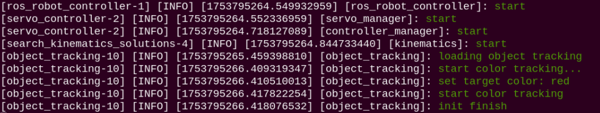

6. To terminate this feature, press **Ctrl+C** in the terminal window. If termination fails, attempt the command repeatedly.

* **Program Outcome**

After launching the feature, place a red block in front of the robotic arm camera. The camera feed highlights the detected target color, and the robotic arm continuously follows the movement of the target block.

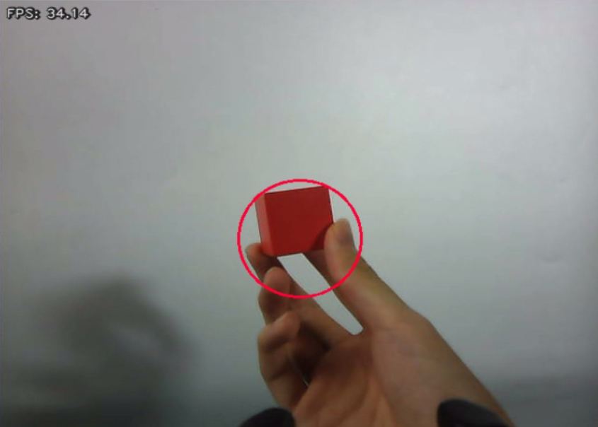

* **Program Analysis**

(1) Launch File Analysis

The launch file path is located at: **/home/ubuntu/ros2_ws/src/example/example/opencv/color_track_node.launch.py**

① `launch_setup` function

```py
def launch_setup(context):
    compiled = os.environ['need_compile']
    display = launchConfiguration('display', default='true')
    display_arg = DeclarelaunchArgument('display', default_value=display)
    start = launchConfiguration('start', default='true')
    start_arg = DeclarelaunchArgument('start', default_value=start)
    broadcast = launchConfiguration('broadcast', default='false')
    broadcast_arg = DeclarelaunchArgument('broadcast', default_value=broadcast)

    if compiled == 'True':
        sdk_package_path = get_package_share_directory('sdk')
        peripherals_package_path = get_package_share_directory('peripherals')
    else:
        sdk_package_path = '/home/ubuntu/ros2_ws/src/driver/sdk'
        peripherals_package_path = '/home/ubuntu/ros2_ws/src/peripherals'

    sdk_launch = IncludelaunchDescription(
        PythonlaunchDescriptionSource(
            os.path.join(sdk_package_path, 'launch/armpi_ultra.launch.py')),
    )

    depth_camera_launch = IncludelaunchDescription(
        PythonlaunchDescriptionSource(
            os.path.join(peripherals_package_path, 'launch/depth_camera.launch.py')),
    )

    color_track_node = Node(
        package='app',
        executable='object_tracking',
        output='screen',
        parameters=[{ 'start': start, 'display': display, 'broadcast': broadcast}]
    )

    return [start_arg,
            display_arg,
            broadcast_arg,
            sdk_launch,
            depth_camera_launch,
            color_track_node,
            ]
```

Include the **launch/armpi_ultra.launch.py** file from the **sdk** package to start SDK-related nodes and **launch/depth_camera.launch.py** from the **peripherals** package to start depth camera nodes. Define the `color_track_node` node to launch the `object_tracking` executable in the **app** package with parameters `start`, `display`, and `broadcast`.

② `generate_launch_description` function

```py
def generate_launch_description():
    return launchDescription([
        OpaqueFunction(function = launch_setup)
    ])
```

Create and return a `launchDescription` object using `OpaqueFunction` to call the `launch_setup` function as the standard ROS 2 launch entry point.

③ Main program

```py
if __name__ == '__main__':
    # Create a launchDescription object
    ld = generate_launch_description()

    ls = launchService()
    ls.include_launch_description(ld)
    ls.run()
```

Create `launchDescription` and `launchService` objects, append the launch description to the service, and execute it to start the full system.

(2) Python File Analysis

The Python file path is located at: **/home/ubuntu/ros2_ws/src/app/app/object_tracking.py**

① Import packages

```py
import os
import cv2
import time
import queue
import rclpy
import threading
import numpy as np
import sdk.fps as fps
from math import radians
from rclpy.node import Node
import sdk.common as common
from app.common import Heart
from cv_bridge import CvBridge
import app.face_tracker as face_tracker
import app.color_tracker as color_tracker
from std_srvs.srv import Trigger, SetBool
from kinematics_msgs.srv import SetRobotPose
from sensor_msgs.msg import Image , CameraInfo
from interfaces.srv import SetPoint, SetFloat64
from rclpy.executors import MultiThreadedExecutor
from servo_controller_msgs.msg import ServosPosition
from rclpy.callback_groups import ReentrantCallbackGroup
from kinematics.kinematics_control import set_pose_target
from servo_controller.bus_servo_control import set_servo_position
```

**from kinematics_msgs.srv import SetRobotPose**: Import the service type for setting robot pose.

**from kinematics.kinematics_control import set_pose_target**: Import the function for setting target pose.

**from interfaces.srv import SetPoint, SetFloat64**: Custom service types for setting point coordinates and floating-point values respectively.

**from servo_controller.bus_servo_control import set_servo_position**: Import the function for setting servo position.

**from servo_controller_msgs.msg import ServosPosition**: Import the message type for servo position control.

**from sensor_msgs.msg import Image, CameraInfo**: Standard message types for transmitting image data and camera calibration parameters.

**import sdk.common as common**: Utility functions and constants module.

**import app.common as app_common**: Common utilities and constants module.

**import app.face_tracker as face_tracker**: Module implementing face tracking functionality.

**import app.color_tracker as color_tracker**: Module implementing color tracking functionality.

② `ObjectTrackingNode` class initialization function

```py
class ObjectTrackingNode(Node):
    def __init__(self, name):
        rclpy.init()
        super().__init__(name, allow_undeclared_parameters=True, automatically_declare_parameters_from_overrides=True)
        self.last_time = 0
        self.current_time = 0
        self.name = name
        self.current_pose = None
        self.tracker = None
        self.enable_color_tracking = False
        self.enable_face_tracking = False
        self.fps = fps.FPS()
        self.bridge = CvBridge()
        self.lock = threading.RLock()
        self.image_queue = queue.Queue(maxsize=2)
        self.thread_started = True 
        self.thread = None
        self.image_sub = None
        self.x_init = 0.16
        self.joints_pub = self.create_publisher(ServosPosition, '/servo_controller', 1) # Servo control
        self.result_publisher = self.create_publisher(Image, '~/image_result',  1)
        self.enter_srv = self.create_service(Trigger, '~/enter', self.enter_srv_callback)
        self.exit_srv = self.create_service(Trigger, '~/exit', self.exit_srv_callback)
        self.client = self.create_client(Trigger, '/controller_manager/init_finish')
        self.client.wait_for_service()
        self.client = self.create_client(Trigger, '/kinematics/init_finish')
        self.client.wait_for_service()

        Heart(self, self.name + '/heartbeat', 5, lambda _: self.exit_srv_callback(request=Trigger.Request(), response=Trigger.Response()))  # Heartbeat package
        self.kinematics_client = self.create_client(SetRobotPose, '/kinematics/set_pose_target')
        self.kinematics_client.wait_for_service()
        self.enable_detect_srv = self.create_service(SetBool, '~/enable_color_tracking', self.enable_color_srv_callback)
        self.enable_transport_srv = self.create_service(SetBool, '~/enable_face_tracking', self.enable_face_srv_callback)
        self.set_target_color_srv = self.create_service(SetFloat64, '~/set_target_color', self.set_target_color_srv_callback)

        if self.get_parameter('start').value:
            threading.Thread(target=self.enter_srv_callback,args=(Trigger.Request(), Trigger.Response()), daemon=True).start()
            time.sleep(1.0)
            req = SetBool.Request()
            req.data = True 
            res = SetBool.Response()
            self.enable_color_srv_callback(req, res)

        if not self.get_parameter('broadcast').value: 
            req = SetFloat64.Request()
            req.data = 1.0 # Tracked color: 0.0 for none, 1.0 for red, 2.0 for green, 3.0 for blue
            res = SetFloat64.Response()
            self.set_target_color_srv_callback(req, res)
        self.create_service(Trigger, '~/init_finish', self.get_node_state)
        self.get_logger().info('\033[1;32m%s\033[0m' % 'init finish')
```

Initialize the ROS node to allow undeclared parameters and automatically declare parameters from overrides. Initialize the frame rate counter `fps`, the OpenCV conversion tool `CvBridge`, the image queue `image_queue`, and the thread lock `lock`. Create the servo control publisher `/servo_controller` and the tracking result image publisher `~/image_result`. Create services for entering/exiting tracking, enabling color/face tracking, and setting target colors. Wait for the robotic arm controller and kinematics services to start, then create the kinematics control client. If the startup parameter is `True`, enter tracking mode automatically and enable color tracking with red as the default. Create the initialization completion service and log successful initialization.

③ `get_node_state` function

```py
    def get_node_state(self, request, response):
        response.success = True
        return response
```

Respond to the node initialization finish service and return a success status.

④ `goback` function

```py
    def goback(self):
        set_servo_position(self.joints_pub, 1.5, ((1, 200), (2, 500), (3,300), (4, 915), (5,730), (6, 500)))
        time.sleep(1.5)
```

Reset the robotic arm servos to the initial position with designated servo angles and wait for movement completion.

⑤ `send_request` function

```py
    def send_request(self, client, msg):
        future = client.call_async(msg)
        while rclpy.ok():
            if future.done() and future.result():
                return future.result()
```

Send an asynchronous request to the service client and wait in a loop for response results to ensure processing.

⑥ `to_face_tracking_base` and `to_color_tracking_base` functions

```py
    def to_face_tracking_base(self):
        with self.lock:
            thread = threading.Thread(target=self.goback).start()
            if self.enable_color_tracking:
                self.enable_color_tracking = False
                self.tracker = None
            self.tracker = face_tracker.FaceTracker()
            self.enable_face_tracking = True
            self.thread = None
            self.get_logger().info('\033[1;32m%s\033[0m' % "start face tracking")

    def to_color_tracking_base(self):
        with self.lock:
            if self.enable_face_tracking:
                self.enable_face_tracking = False
                self.tracker = None
            self.enable_color_tracking = True
            self.thread = None
        self.get_logger().info('\033[1;32m%s\033[0m' % "start color tracking")
```

`to_face_tracking_base`: Switch to face tracking mode. `to_color_tracking_base`: Switch to color tracking mode.

⑦ `enable_color_srv_callback` and `enable_face_srv_callback` functions

```py
    def enable_color_srv_callback(self, request, response):
        
        with self.lock:
            if request.data:
                if self.thread is None:
                    self.get_logger().info('\033[1;32m%s\033[0m' % "start color tracking...")
                    self.thread = threading.Thread(target=self.to_color_tracking_base)
                    self.thread.start()
                    response.success = True
                    response.message = "enter"
                    return response
                else:
                    msg = "Enable Color Tracking, standard operation in progress, please try again later"
                    self.get_logger().info(msg)
                    response.success = True
                    response.message = "enter"
                    return response
            else:
                self.get_logger().info('\033[1;32m%s\033[0m' % "start color tracking...")
                if self.enable_color_tracking:
                    self.enable_color_tracking = False
                    self.tracker = None
                response.success = True
                response.message = "enter"
                return response

    def enable_face_srv_callback(self, request, response):
        with self.lock:
            if self.thread is None:
                if request.data:
                    self.get_logger().info('\033[1;32m%s\033[0m' % "start face tracking...")
                    self.thread = threading.Thread(target=self.to_face_tracking_base)
                    self.thread.start()
                else:
                    self.get_logger().info('\033[1;32m%s\033[0m' % "stop face tracking...")
                    if self.enable_face_tracking:
                        self.enable_face_tracking = False
                        self.tracker = None
                response.success = True
                response.message = "enter"
                return response
            else:
                msg = "Enable Face Tracking, standard operation in progress, please try again later"
                self.get_logger().info(msg)
                response.success = True
                response.message = "enter"
                return response
```

`enable_face_srv_callback`: Enable or disable face tracking. `enable_color_srv_callback`: Enable or disable color tracking.

⑧ `set_target_color_srv_callback` function

```py
    def set_target_color_srv_callback(self, request, response):
        with self.lock:
            if request.data != 0:
                colors = ["None","red", "green", "blue"]
                self.get_logger().info("\033[1;32mset target color: " + colors[int(request.data)] + "\033[0m")
                self.tracker = color_tracker.ColorTracker(colors[int(request.data)])
                if self.enable_face_tracking:
                    self.enable_face_tracking = False
                    self.tracker = None
            else:
                self.tracker = None
            response.success = True
            response.message = "enter"
            return response
```

Process target color configuration service requests. Initialize `ColorTracker` for the corresponding color based on the input value, where 1.0 represents red, 2.0 represents green, and 3.0 represents blue. Stop face tracking mode if active, then return a success response.

⑨ `enter_srv_callback` and `exit_srv_callback` functions

```py
    def enter_srv_callback(self, request, response):
        # Get and publish image topic
        self.get_logger().info('\033[1;32m%s\033[0m' % "loading object tracking")
        thread = threading.Thread(target=self.goback).start()
        self.image_sub = self.create_subscription(Image, '/depth_cam/rgb/image_raw', self.image_callback, 10)  # Subscribe to camera
        with self.lock:
            self.enable_face_tracking = False
            self.enable_color_tracking = False
        self.thread_started = False
        response.success = True
        response.message = "enter"
        return response

    def exit_srv_callback(self, request, response):
        self.get_logger().info('\033[1;32m%s\033[0m' % "exit object tracking")
        with self.lock:
            self.enable_face_tracking = False
            self.enable_color_tracking = False
            self.tracker = None
        try:
            if self.image_sub is not None:
                self.destroy_subscription(self.image_sub)
                self.image_sub = None
        except Exception as e:
            self.get_logger().error(str(e))

        response.success = True
        response.message = "exit"
        return response
```

`enter_srv_callback`: Start target tracking. `exit_srv_callback`: Stop target tracking.

⑩ `image_callback` function

```py
    def image_callback(self, ros_image):
        # Convert ROS image format to OpenCV format
        cv_image = self.bridge.imgmsg_to_cv2(ros_image, "rgb8")
        rgb_image = np.array(cv_image, dtype=np.uint8)
        with self.lock:
            if not self.thread_started:
                # Start thread only on first call
                threading.Thread(target=self.image_processing, args=(ros_image,), daemon=True).start()
                self.thread_started = True 

        if self.image_queue.full():
            # If queue is full, discard oldest image
            self.image_queue.get()
        # Put image into queue
        self.image_queue.put(rgb_image)
```

Image subscription callback function. Convert ROS image messages into OpenCV RGB images and store them in the image queue, discarding the oldest image when full. Launch the image processing thread upon initial invocation.

⑾ `image_processing` function

```py
    def image_processing(self, ros_image):
        while True:
            rgb_image = self.image_queue.get()
            result_image = np.copy(rgb_image)
            if self.thread is None and self.tracker is not None:
                if self.tracker.tracker_type == 'color' and self.enable_color_tracking:
                    result_image, p_y = self.tracker.proc(rgb_image, result_image)
                    if p_y is not None:
                        msg = set_pose_target([0.16, 0, p_y[0]], 0.0, [-180.0, 180.0], 1.0)
                        res = self.send_request(self.kinematics_client, msg)
                        if res.pulse:
                            servo_data = res.pulse
                            set_servo_position(self.joints_pub, 0.02, ( (3, servo_data[3]), (4, servo_data[2]), (5, servo_data[1]), (6, int(p_y[1])) ))
                elif self.tracker.tracker_type == 'face' and self.enable_face_tracking:
                    result_image, p_y = self.tracker.proc(rgb_image, result_image)
                    if p_y is not None:
                        set_servo_position(self.joints_pub, 0.02, ((6, p_y[1]), (3, p_y[0])))

            self.result_publisher.publish(self.bridge.cv2_to_imgmsg(result_image, "rgb8"))
            if result_image is not None and self.get_parameter('display').value:
                result_image = cv2.cvtColor(result_image, cv2.COLOR_BGR2RGB)
                cv2.imshow('result_image', result_image)
                key = cv2.waitKey(1)
```

Image processing thread function. Fetch and process images from the queue sequentially. In color tracking mode, call `ColorTracker` to process images, obtain target coordinates `p_y`, compute servo angles via the kinematics service, and command the servos to track the target. In face tracking mode, call `FaceTracker` to obtain face coordinates `p_y` and command servo motion directly to track the face. Publish tracking result images and render the video feed via OpenCV when the display parameter is enabled.

⑿ `main` function

```py
def main():
    node = ObjectTrackingNode('object_tracking')
    executor = MultiThreadedExecutor()
    executor.add_node(node)
    executor.spin()
    node.destroy_node()
```

Create an `ObjectTrackingNode` node instance named `object_tracking`, add the node to `MultiThreadedExecutor`, start the spin loop for concurrent callbacks, and destroy the node upon execution finish.

### 4.2.3 Tag Tracking

When the camera detects the target tag, which is ID 1 by default, the robotic arm moves following the movement of the tag.

* **Implementation Process**

First, subscribe to topic messages published by the tag tracking node to obtain recognized tag details.

Next, after matching the target tag, obtain the center position of the tag image.

Finally, calculate the angles required to align the screen center with the target image center via inverse kinematics, publish corresponding topic messages, and control servo rotations so that the robotic arm follows target movement.

* **Feature Startup Steps**

> [!NOTE]
>
> * **Command inputs are strictly case-sensitive. The Tab key can be pressed to autocomplete keywords.**
>
> * **Before operating the robotic arm, secure the robotic arm base to a desktop or stable platform using a G-clamp. The robotic arm generates swing and inertia during operation. Operating without proper mounting may cause tipping, falling, hardware damage, or safety hazards.**

1. Power on the robotic arm and connect it to the remote control software **VNC**. For instructions on how to connect to the remote desktop, refer to [1. Tutorials / 1. NexArm User Manual / 1.5 Development Environment Setup and Configuration](https://wiki.hiwonder.com/projects/NexArm/en/ros-version/docs/1.%20NexArm%20User%20Manual.html#_1-5-development-environment-setup-and-configuration).

2. Click the terminal icon  on the system desktop to open the command line. Enter the command to disable the mobile app automatic startup service. Enter the command and press **Enter** to disable the automatic startup service.

```
~/.stop_ros.sh
```

3. Enter the command to launch the feature program.

```
ros2 launch example tag_track_node.launch.py
```

4. After the feature startup completes, the terminal prints the prompt information below, and the camera feed window pops up automatically.

   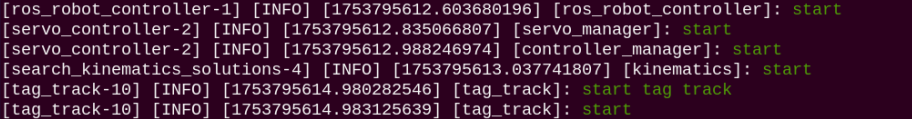

5. To terminate this feature, press **Ctrl+C** in the terminal window. If termination fails, attempt the command repeatedly.

* **Program Outcome**

After launching the feature, place the ID 1 tag in front of the robotic arm camera. The camera feed highlights the detected tag ID, and the robotic arm continuously follows the movement of the ID 1 tag.

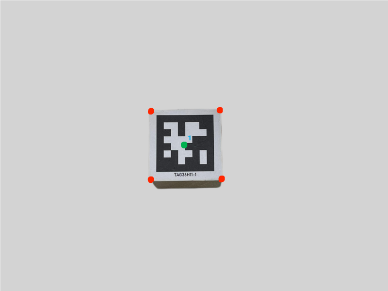

* **Program Analysis**

(1) Launch File Analysis

The launch file path is located at: **/home/ubuntu/ros2_ws/src/example/example/opencv/tag_track_node.launch.py**

① `launch_setup` function

```py
def launch_setup(context):
    compiled = os.environ['need_compile']
    start = launchConfiguration('start', default='true')
    start_arg = DeclarelaunchArgument('start', default_value=start)
    if compiled == 'True':
        sdk_package_path = get_package_share_directory('sdk')
        peripherals_package_path = get_package_share_directory('peripherals')
        example_package_path = get_package_share_directory('example')
    else:
        sdk_package_path = '/home/ubuntu/ros2_ws/src/driver/sdk'
        peripherals_package_path = '/home/ubuntu/ros2_ws/src/peripherals'
        example_package_path = '/home/ubuntu/ros2_ws/src/example'

    sdk_launch = IncludelaunchDescription(
        PythonlaunchDescriptionSource(
            os.path.join(sdk_package_path, 'launch/armpi_ultra.launch.py')),
    )

    
    depth_camera_launch = IncludelaunchDescription(
        PythonlaunchDescriptionSource(
            os.path.join(peripherals_package_path, 'launch/depth_camera.launch.py')),
    )

    tag_track_node = Node(
        package='example',
        executable='tag_track',
        output='screen',
        parameters=[{'start': start}]
    )

    return [start_arg,
            sdk_launch,
            depth_camera_launch,
            tag_track_node,
            ]
```

Include **launch/armpi_ultra.launch.py** from the **sdk** package to start SDK nodes such as robotic arm control and **launch/depth_camera.launch.py** from the **peripherals** package to start depth camera nodes. Define the `tag_track_node` node to launch the `tag_track` executable in the **example** package with parameter `start`.

② `generate_launch_description` function

```py
def generate_launch_description():
    return launchDescription([
        OpaqueFunction(function = launch_setup)
    ])
```

Create and return a `launchDescription` object using `OpaqueFunction` to invoke the `launch_setup` function as the standard ROS 2 launch entry point.

③ Main program

```py
if __name__ == '__main__':
    # Create a launchDescription object
    ld = generate_launch_description()

    ls = launchService()
    ls.include_launch_description(ld)
    ls.run()
```

Create `launchDescription` and `launchService` objects, append launch descriptions to the service, and execute it to start the system.

(2) Python File Analysis

The Python file path is located at: **/home/ubuntu/ros2_ws/src/example/example/opencv/include/tag_track_node.py**

① Import packages

Import required modules via `import` statements.

```py
import cv2
import time
import rclpy
import queue
import signal
import threading
import numpy as np
import sdk.pid as pid
import sdk.fps as fps
import sdk.common as common
from rclpy.node import Node
from cv_bridge import CvBridge
from kinematics import transform
from dt_apriltags import Detector
from std_srvs.srv import Trigger
from sensor_msgs.msg import Image 
from geometry_msgs.msg import Twist
from kinematics_msgs.srv import SetRobotPose
from rclpy.executors import MultiThreadedExecutor
from interfaces.msg import ColorsInfo, ColorDetect
from servo_controller_msgs.msg import ServosPosition
from rclpy.callback_groups import ReentrantCallbackGroup
from interfaces.srv import SetColorDetectParam, SetString
from kinematics.kinematics_control import set_pose_target
from servo_controller.bus_servo_control import set_servo_position
```

**import sdk.pid as pid**: Import the `pid` module from the **sdk** package and alias it as `pid`. This module implements PID control algorithms to regulate robot Y and Z-axis motion.

**import sdk.fps as fps**: Import the `fps` module from the **sdk** package and alias it as `fps`. This module performs frame rate calculation and display to monitor tag tracking performance.

**import sdk.common as common**: Import the `common` module from the **sdk** package and alias it as `common`. This module contains general utility functions such as tag drawing and data processing.

**from kinematics import transform**: Import `transform` from the **kinematics** package for robot kinematics transformations including coordinate conversions and rotation matrix operations.

**from dt_apriltags import Detector**: Import the `Detector` class from the **dt_apriltags** package to detect and decode AprilTag tags. Detector instances extract tag position details from images.

**from kinematics_msgs.srv import SetRobotPose**: Import `SetRobotPose` service type from `kinematics_msgs.srv` to configure target robot pose.

**from interfaces.msg import ColorsInfo, ColorDetect**: Import `ColorsInfo` and `ColorDetect` message types from `interfaces.msg`.

**from servo_controller_msgs.msg import ServosPosition**: Import `ServosPosition` message type from `servo_controller_msgs.msg` to control servo positions.

**from interfaces.srv import SetColorDetectParam, SetString**: Import `SetColorDetectParam` and `SetString` service types from `interfaces.srv`. `SetColorDetectParam` configures color detection parameters, while `SetString` handles string request transmission.

**from kinematics.kinematics_control import set_pose_target**: Import `set_pose_target` function from `kinematics.kinematics_control` to set robot target pose.

**from servo_controller.bus_servo_control import set_servo_position**: Import `set_servo_position` function from `servo_controller.bus_servo_control` to set servo positions.

② `TagTrackNode` class initialization function

```py
class TagTrackNode(Node):
    def __init__(self, name):
        rclpy.init()
        super().__init__(name, allow_undeclared_parameters=True, automatically_declare_parameters_from_overrides=True)
        self.z_dis = 0.23
        self.y_dis = 500
        self.x_init = 0.15
        self.bridge = CvBridge()  # Used for conversion between ROS Image messages and OpenCV images
        self.center = None
        self.running = True
        self.start = False
        self.name = name
        self.image_queue = queue.Queue(maxsize=2)
        self.pid_z = pid.PID(0.00008, 0.0, 0.0)
        self.pid_y = pid.PID(0.092, 0.00, 0.00000005)
        # self.pid_y = pid.PID(0.13, 0.0, 0.0001)
        self.tag_id = 1  # Set tracking tag


        self.fps = fps.FPS() # Frame rate counter
        self.at_detector = Detector(searchpath=['apriltags'], 
                                    families='tag36h11',
                                    nthreads=8,
                                    quad_decimate=2.0,
                                    quad_sigma=0.0,
                                    refine_edges=1,
                                    decode_sharpening=0.25,
                                    debug=0)


        self.joints_pub = self.create_publisher(ServosPosition, '/servo_controller', 1) # Servo control

        self.image_sub = self.create_subscription(Image, '/depth_cam/rgb/image_raw', self.image_callback, 1)  # Subscribe to camera

        timer_cb_group = ReentrantCallbackGroup()
        self.create_service(Trigger, '~/start', self.start_srv_callback) # Enter feature
        self.create_service(Trigger, '~/stop', self.stop_srv_callback, callback_group=timer_cb_group) # Exit feature
        self.client = self.create_client(Trigger, '/controller_manager/init_finish')
        self.client.wait_for_service()
        self.client = self.create_client(Trigger, '/kinematics/init_finish')
        self.client.wait_for_service()

        self.kinematics_client = self.create_client(SetRobotPose, '/kinematics/set_pose_target')
        self.kinematics_client.wait_for_service()

        self.timer = self.create_timer(0.0, self.init_process, callback_group=timer_cb_group)
```

Initialize the ROS node to allow undeclared parameters and automatically declare parameters from overrides. Set initial tracking parameters including `z_dis`, `y_dis`, and `x_init`, the image conversion tool `CvBridge`, the thread-safe queue `image_queue`, and PID controllers using `pid_z` for Z-axis control and `pid_y` for Y-axis control. Initialize the AprilTag detector `at_detector`, specifying the detection family `tag36h11`. Create the servo publisher `/servo_controller`, subscribe to the camera topic `/depth_cam/rgb/image_raw`, and configure services for starting/stopping tracking. Wait for the controller and kinematics initialization completion services, then create the kinematics control client and start the initialization timer.

③ `init_process` function

```py
    def init_process(self):
        self.timer.cancel()

        self.init_action()
        if self.get_parameter('start').value:
            self.start_srv_callback(Trigger.Request(), Trigger.Response())

        threading.Thread(target=self.main, daemon=True).start()
        self.create_service(Trigger, '~/init_finish', self.get_node_state)
        self.get_logger().info('\033[1;32m%s\033[0m' % 'start')
```

Cancel the initialization timer and execute home position reset actions. Trigger the start tracking service if startup parameter is `True`. Launch the main logic thread, create the initialization finish service, and log start messages.

④ `get_node_state` function

```py
    def get_node_state(self, request, response):
        response.success = True
        return response
```

Respond to node initialization finish service requests and return success.

⑤ `shutdown` function

```py
    def shutdown(self, signum, frame):
        self.running = False
```

Process program interruption signals, set running flag to `False`, and stop tracking.

⑥ `init_action` function

```py
    def init_action(self):
        msg = set_pose_target([self.x_init, 0.0, self.z_dis], 0.0, [-90.0, 90.0], 1.0)
        res = self.send_request(self.kinematics_client, msg)
        if res.pulse:
            servo_data = res.pulse
            set_servo_position(self.joints_pub, 1.5, ((1, 200), (2, 500), (3, servo_data[3]), (4, servo_data[2]), (5, servo_data[1]), (6, servo_data[0])))
            time.sleep(1.8)
```

Drive the robotic arm to initial pose, calculate target pose via kinematics service, command servos to target angles, and wait for completion.

⑦ `send_request` function

```py
    def send_request(self, client, msg):
        future = client.call_async(msg)
        while rclpy.ok():
            if future.done() and future.result():
                return future.result()
```

Send asynchronous requests to service client and wait in a loop for response results to ensure processing.

⑧ `start_srv_callback` and `stop_srv_callback` functions

```py
    def start_srv_callback(self, request, response):
        self.get_logger().info('\033[1;32m%s\033[0m' % "start tag track")
        self.start = True
        response.success = True
        response.message = "start"
        return response

    def stop_srv_callback(self, request, response):
        self.get_logger().info('\033[1;32m%s\033[0m' % "stop tag track")
        self.start = False
        res = self.send_request(ColorDetect.Request())
        if res.success:
            self.get_logger().info('\033[1;32m%s\033[0m' % 'set tag success')
        else:
            self.get_logger().info('\033[1;32m%s\033[0m' % 'set tag fail')
        response.success = True
        response.message = "stop"
        return response
```

`start_srv_callback`: Process start tracking service requests, set start flag to `True`, log messages, and return success. `stop_srv_callback`: Process stop tracking service requests, set start flag to `False`, reset tag states, and return success.

### 4.2.4 KCF Object Tracking

Select the target object via mouse bounding box using the KCF algorithm. When the camera detects the selected target object, the robotic arm moves following the movement of the object.

* **KCF Introduction**

Kernel Correlation Filter KCF is a kernel correlation filtering algorithm proposed by Joao F. Henriques, Rui Caseiro, Pedro Martins, and Jorge Batista in 2014.

KCF is a discriminative tracking method. Its mechanism collects positive and negative samples using circular matrices from the region surrounding the target, trains a target detector, tests whether predicted positions in subsequent frames contain the target, updates training sets based on new detection results, and updates the target detector accordingly.

* **Implementation Process**

First, subscribe to topic messages published by the KCF tracking node to obtain recognized KCF object details.

Next, check whether the **S** key on the keyboard is pressed.

When **S** is pressed, frame the region of interest ROI using the mouse.

Obtain the ROI region and calculate region center coordinates.

Finally, calculate angles required to align the screen center with target image center via inverse kinematics, publish corresponding topic messages, and control servo rotations so that the robotic arm follows target movement.

* **Feature Startup Steps**

> [!NOTE]
>
> * **Command inputs are strictly case-sensitive. The Tab key can be pressed to autocomplete keywords.**
>
> * **Before operating the robotic arm, secure the robotic arm base to a desktop or stable platform using a G-clamp. The robotic arm generates swing and inertia during operation. Operating without proper mounting may cause tipping, falling, hardware damage, or safety hazards.**

1. Power on the robotic arm and connect it to the remote control software **VNC**. For instructions on how to connect to the remote desktop, refer to [1. Tutorials / 1. NexArm User Manual / 1.5 Development Environment Setup and Configuration](https://wiki.hiwonder.com/projects/NexArm/en/ros-version/docs/1.%20NexArm%20User%20Manual.html#_1-5-development-environment-setup-and-configuration).

2. Click the terminal icon  on the system desktop to open the command line. Enter the command to disable the mobile app automatic startup service.

3. Enter the command and press **Enter** to disable the automatic startup service.

```
~/.stop_ros.sh
```

4. Enter the command to launch the feature program.

```
ros2 launch example kcf_track_node.launch.py
```

5. After the feature startup completes, the terminal prints the prompt information below, and the camera feed window pops up automatically.

   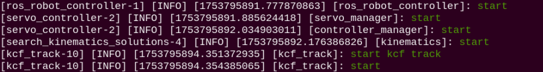

6. To terminate this feature, press **Ctrl+C** in the terminal window. If termination fails, attempt the command repeatedly.

* **Program Outcome**

After launching the feature, place the object to be tracked in front of the camera. Press **S** on the keyboard in the video feed window, frame the object using the left mouse button, and press **Enter**. The robotic arm continuously follows the movement of the selected object. Note that target movement speed should remain moderate. If object tracking drops, press **S** again to re-select the target.

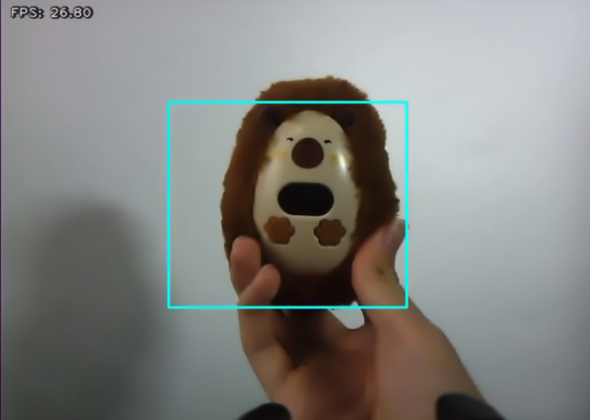

* **Program Analysis**

(1) Launch File Analysis

The launch file path is located at: **/home/ubuntu/ros2_ws/src/example/example/opencv/kcf_track_node.launch.py**

① `launch_setup` function

```py
def launch_setup(context):
    compiled = os.environ['need_compile']
    start = launchConfiguration('start', default='true')
    start_arg = DeclarelaunchArgument('start', default_value=start)
    if compiled == 'True':
        sdk_package_path = get_package_share_directory('sdk')
        peripherals_package_path = get_package_share_directory('peripherals')
        example_package_path = get_package_share_directory('example')
    else:
        sdk_package_path = '/home/ubuntu/ros2_ws/src/driver/sdk'
        peripherals_package_path = '/home/ubuntu/ros2_ws/src/peripherals'
        example_package_path = '/home/ubuntu/ros2_ws/src/example'

    sdk_launch = IncludelaunchDescription(
        PythonlaunchDescriptionSource(
            os.path.join(sdk_package_path, 'launch/armpi_ultra.launch.py')),
    )

    depth_camera_launch = IncludelaunchDescription(
        PythonlaunchDescriptionSource(
            os.path.join(peripherals_package_path, 'launch/depth_camera.launch.py')),
    )

    kcf_track_node = Node(
        package='example',
        executable='kcf_track',
        output='screen',
        parameters=[{'start': start}]
    )

    return [start_arg,
            sdk_launch,
            depth_camera_launch,
            kcf_track_node,
            ]
```

Include **launch/armpi_ultra.launch.py** from the **sdk** package to start SDK nodes such as robotic arm control and **launch/depth_camera.launch.py** from the **peripherals** package to start depth camera nodes. Define the `kcf_track_node` node to launch the `kcf_track` executable in the **example** package with parameter `start`.

② `generate_launch_description` function

```py
def generate_launch_description():
    return launchDescription([
        OpaqueFunction(function = launch_setup)
    ])
```

Create and return a `launchDescription` object using `OpaqueFunction` to call the `launch_setup` function as the standard ROS 2 launch entry point.

③ Main program

```py
if __name__ == '__main__':
    # Create a launchDescription object
    ld = generate_launch_description()

    ls = launchService()
    ls.include_launch_description(ld)
    ls.run()
```

Create `launchDescription` and `launchService` objects, append launch descriptions to the service, and run to launch the system.

(2) Python File Analysis

The Python file path is located at: **/home/ubuntu/ros2_ws/src/example/example/opencv/include/kcf_track_node.py**

① Import packages

```py
import cv2
import time
import rclpy
import queue
import signal
import threading
import numpy as np
import sdk.pid as pid
import sdk.fps as fps
import sdk.common as common
from rclpy.node import Node
from cv_bridge import CvBridge
from kinematics import transform
from dt_apriltags import Detector
from std_srvs.srv import Trigger
from sensor_msgs.msg import Image 
from geometry_msgs.msg import Twist
from kinematics_msgs.srv import SetRobotPose
from rclpy.executors import MultiThreadedExecutor
from interfaces.msg import ColorsInfo, ColorDetect
from servo_controller_msgs.msg import ServosPosition
from rclpy.callback_groups import ReentrantCallbackGroup
from interfaces.srv import SetColorDetectParam, SetString
from kinematics.kinematics_control import set_pose_target
from servo_controller.bus_servo_control import set_servo_position
```

**import sdk.pid as pid**: Import custom `pid` module for implementing PID controllers.

**import sdk.fps as fps**: Import custom `fps` module for frame rate computation and rendering.

**import sdk.common as common**: Import custom `common` module containing general utility functions.

**from kinematics import transform**: Import `kinematics` module for robot kinematic transformations.

**from dt_apriltags import Detector**: Import `dt_apriltags` library for AprilTag detection.

**from kinematics_msgs.srv import SetRobotPose**: Import `SetRobotPose` service type for robot pose configuration.

**from interfaces.msg import ColorsInfo, ColorDetect**: Import custom message types `ColorsInfo` and `ColorDetect` for color detection.

**from servo_controller_msgs.msg import ServosPosition**: Import custom `ServosPosition` message type for servo control.

**from interfaces.srv import SetColorDetectParam, SetString**: Import custom service types `SetColorDetectParam` and `SetString`.

**from kinematics.kinematics_control import set_pose_target**: Import `set_pose_target` function for robot target pose configuration.

**from servo_controller.bus_servo_control import set_servo_position**: Import `set_servo_position` function for servo position setting.

② `KcfTrackNode` class initialization function

```py
class KcfTrackNode(Node):
    def __init__(self, name):
        rclpy.init()
        super().__init__(name, allow_undeclared_parameters=True, automatically_declare_parameters_from_overrides=True)
        self.z_dis = 0.15
        self.y_dis = 500
        self.x_init = 0.16
        self.bridge = CvBridge()  # Used for conversion between ROS Image messages and OpenCV images
        self.center = None
        self.tracker = None
        self.enable_select = False
        self.running = True
        self.start = False
        self.name = name
        self.image_queue = queue.Queue(maxsize=2)
        self.pid_z = pid.PID(0.0001, 0.0, 0.0)
        self.pid_y = pid.PID(0.09, 0.0, 0.0)
        self.fps = fps.FPS() # Frame rate counter

        self.joints_pub = self.create_publisher(ServosPosition, '/servo_controller', 1) # Servo control

        self.image_sub = self.create_subscription(Image, '/depth_cam/rgb/image_raw', self.image_callback, 1)  # Subscribe to camera

        timer_cb_group = ReentrantCallbackGroup()
        self.create_service(Trigger, '~/start', self.start_srv_callback) # Enter feature
        self.create_service(Trigger, '~/stop', self.stop_srv_callback, callback_group=timer_cb_group) # Exit feature
        self.client = self.create_client(Trigger, '/controller_manager/init_finish')
        self.client.wait_for_service()
        self.client = self.create_client(Trigger, '/kinematics/init_finish')
        self.client.wait_for_service()

        self.kinematics_client = self.create_client(SetRobotPose, '/kinematics/set_pose_target')
        self.kinematics_client.wait_for_service()

        self.timer = self.create_timer(0.0, self.init_process, callback_group=timer_cb_group)
```

Initialize the ROS node to allow undeclared parameters and automatically declare parameters from overrides. Configure initial tracking distances including `z_dis`, `y_dis`, and `x_init`, the image conversion tool `CvBridge`, the thread-safe queue `image_queue`, and PID controllers using `pid_z` for the Z-axis and `pid_y` for the Y-axis. Initialize the frame rate counter `fps`. Create the servo publisher `/servo_controller`, subscribe to the camera topic `/depth_cam/rgb/image_raw`, and configure services for starting/stopping tracking. Wait for the controller manager and kinematics initialization completion services, create the kinematics control client, and start the initialization timer.

③ `init_process` function

```py
    def init_process(self):
        self.timer.cancel()

        self.init_action()
        if self.get_parameter('start').value:
            self.start_srv_callback(Trigger.Request(), Trigger.Response())

        threading.Thread(target=self.main, daemon=True).start()
        self.create_service(Trigger, '~/init_finish', self.get_node_state)
        self.get_logger().info('\033[1;32m%s\033[0m' % 'start')
```

Cancel the initialization timer and execute home position reset actions. Trigger the start tracking service if startup parameter is `True`. Launch the main logic thread, create initialization finish service, and log start messages.

④ `get_node_state` function

```py
    def get_node_state(self, request, response):
        response.success = True
        return response
```

Respond to node initialization finish service requests and return success.

⑤ `shutdown` function

```py
    def shutdown(self, signum, frame):
        self.running = False
```

Process program interruption signals, set running flag to `False`, and stop tracking.

⑥ `send_request` function

```py
    def send_request(self, client, msg):
        future = client.call_async(msg)
        while rclpy.ok():
            if future.done() and future.result():
                return future.result()
```

Send asynchronous requests to service client and wait in a loop for response results to ensure processing.

```py
    def start_srv_callback(self, request, response):
        self.get_logger().info('\033[1;32m%s\033[0m' % "start kcf track")
        self.start = True
        response.success = True
        response.message = "start"
        return response

    def stop_srv_callback(self, request, response):
        self.get_logger().info('\033[1;32m%s\033[0m' % "stop kcf track")
        self.start = False
        res = self.send_request(ColorDetect.Request())
        if res.success:
            self.get_logger().info('\033[1;32m%s\033[0m' % 'set kcf success')
        else:
            self.get_logger().info('\033[1;32m%s\033[0m' % 'set kcf fail')
        response.success = True
        response.message = "stop"
        return response
```

`start_srv_callback`: Process start tracking service requests, set the start flag to `True`, log messages, and return success. `stop_srv_callback`: Process stop-tracking service requests, set the start flag to `False`, reset KCF state, and return success.

⑦ `image_callback` function

```py
    def image_callback(self, ros_image):
        # Convert video feed to OpenCV format
        cv_image = self.bridge.imgmsg_to_cv2(ros_image, "bgr8")
        bgr_image = np.array(cv_image, dtype=np.uint8)

        if self.image_queue.full():
            # If queue is full, discard oldest image
            self.image_queue.get()
        # Put image into queue
        self.image_queue.put(bgr_image)
```

Image subscription callback function. Convert ROS image messages into OpenCV BGR format images and store them in the image queue, discarding the oldest image when full.

⑧ `main` method

```py
    def main(self):
        while self.running:
            rgb_image = self.image_queue.get()
            result_image = np.copy(rgb_image)
            factor = 4
            rgb_image = cv2.resize(rgb_image, (int(result_image.shape[1]/ factor), int(result_image.shape[0]/ factor)))

            if self.tracker is None:
                if self.enable_select:
                    roi = cv2.selectROI("result", result_image, False)
                    roi =  tuple(int(i / factor)for i in roi)
                    if roi:
                        param = cv2.TrackerKCF.Params()
                        param.detect_thresh = 0.2
                        self.tracker = cv2.TrackerKCF_create(param)
                        self.tracker.init(rgb_image, roi)
            else:
                status, box = self.tracker.update(rgb_image)
                if status:
                    p1 = int(box[0] * factor), int(box[1] * factor)
                    p2 = p1[0] + int(box[2] * factor), p1[1] + int(box[3] * factor)
                    cv2.rectangle(result_image, p1, p2, (255, 255, 0), 2)
                    center_x, center_y = (p1[0] + p2[0]) / 2, (p1[1] + p2[1]) / 2
           

                    t1 = time.time()
                    self.pid_y.SetPoint = result_image.shape[1]/2 
                    self.pid_y.update(center_x)
                    self.y_dis += self.pid_y.output
                    if self.y_dis < 200:
                        self.y_dis = 200
                    if self.y_dis > 800:
                        self.y_dis = 800

                    self.pid_z.SetPoint = result_image.shape[0]/2 
                    self.pid_z.update(center_y)
                    self.z_dis += self.pid_z.output
                    if self.z_dis > 0.25:
                        self.z_dis = 0.25
                    if self.z_dis < 0.16:
                        self.z_dis = 0.16
                    msg = set_pose_target([self.x_init, 0.0, self.z_dis], 0.0, [-180.0, 180.0], 1.0)
                    res = self.send_request(self.kinematics_client, msg)
                    t2 = time.time()
                    t = t2 - t1
                    if t < 0.02:
                        time.sleep(0.02 - t)
                    if res.pulse:
                        servo_data = res.pulse
                        set_servo_position(self.joints_pub, 0.02, ((1, 500), (2, 500), (3, servo_data[3]), (4, servo_data[2]), (5, servo_data[1]), (6, int(self.y_dis))))
                    else:
                        set_servo_position(self.joints_pub, 0.02, ((6, int(self.y_dis)), ))
                else:
                    time.sleep(0.01)
            
            self.fps.update()
            self.fps.show_fps(result_image)
            cv2.imshow("result", result_image)

            key = cv2.waitKey(1)
            if key == ord('s'): # Press 's' to start selecting tracking target
                self.get_logger().info("Press 's' in the video feed window to start selecting the target, then press Space to start tracking")
                self.tracker = None
                self.enable_select = True

        self.init_action()
        rclpy.shutdown()
```

Main logic thread function. Fetch images from the queue in a loop and downsample images to improve processing efficiency. If the tracker is uninitialized and target selection is allowed with `enable_select` set to `True`, manually select the region of interest ROI via the OpenCV window and initialize the KCF tracker. If the tracker is initialized, update the tracking state, obtain the target position, draw a bounding box around the target, and compute target center coordinates. Calculate Z-axis distance and Y-axis horizontal position adjustments via PID controllers, update the robotic arm target pose, and limit adjustments to prevent over-extension. Call the kinematics service to obtain servo angles, driving the robotic arm to track the target. Press the **S** key to re-select the target object. Render processing result images in real time while computing and displaying the FPS. Reset the robotic arm pose and shut down ROS when the program stops.

⑨ `main` function

```py
def main():
    node = KcfTrackNode('kcf_track')
    executor = MultiThreadedExecutor()
    executor.add_node(node)
    executor.spin()
    node.destroy_node()
```

Create a `KcfTrackNode` node instance named `kcf_track`, add the node to `MultiThreadedExecutor`, start the spin loop for concurrent callbacks, and destroy the node upon program termination.
