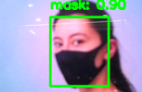
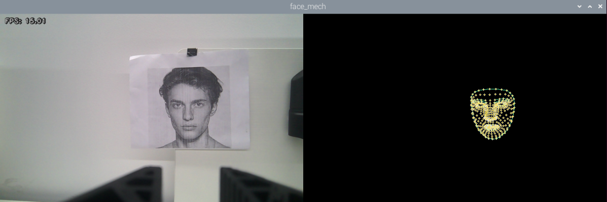
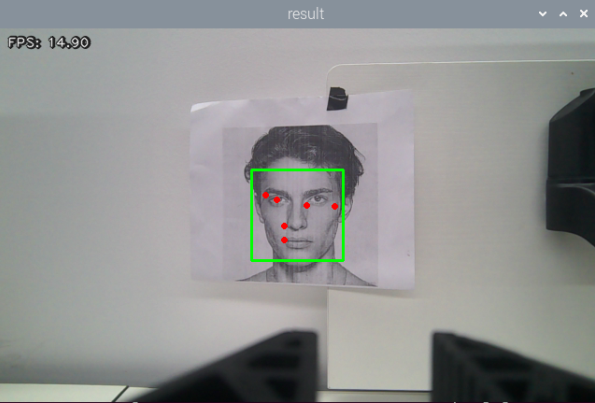
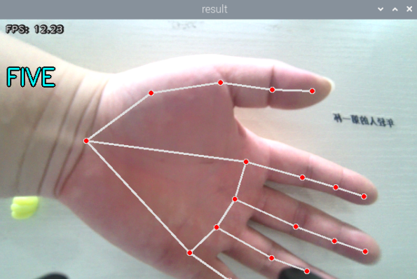
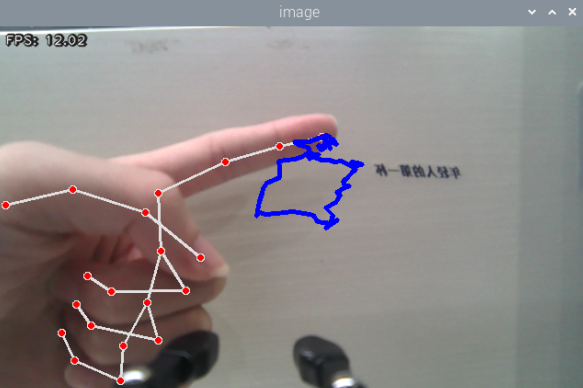
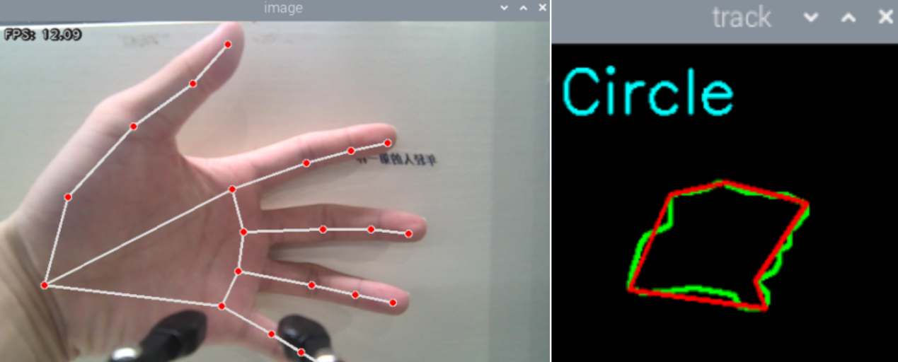
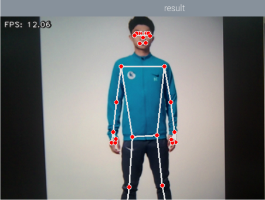
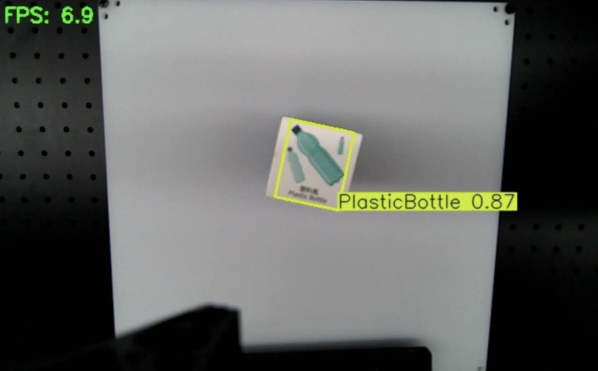

# 5. MediaPipe Human-Robot Interaction

## 5.1 MediaPipe: Introduction and Getting Started

### 5.1.1 MediaPipe Introduction

MediaPipe is an open-source framework for multimedia machine learning model applications. It runs cross-platform on mobile devices, workstations, and servers, supporting mobile GPU acceleration. MediaPipe supports inference engines for TensorFlow and TensorFlow Lite, enabling any TensorFlow or TensorFlow Lite model to be used within MediaPipe. On mobile and embedded platforms, MediaPipe also supports device GPU acceleration.


### 5.1.2 MediaPipe Pros and Cons

### 5.1.3 MediaPipe Workflow

The diagram below illustrates the workflow of MediaPipe. Solid lines represent parts where custom code needs to be written, while dashed lines represent pre-built components requiring no extra code. MediaPipe integrates AI models internally, allowing rapid construction of the framework required to realize specific features.


* **Dependencies**

MediaPipe relies on OpenCV for video processing and FFmpeg for audio processing. Additional dependencies include OpenGL, Metal, TensorFlow, and Eigen.

MediaPipe utilizes graphics rendering engines such as OpenGL and Metal to perform real-time image rendering and display, which is essential for visualizing processing results on screen.

TensorFlow is a deep learning framework used to train and deploy machine learning models. MediaPipe builds upon TensorFlow to support real-time inference of deep learning models, such as object detection and facial recognition.

Eigen is a C++ template library for linear algebra operations. MediaPipe uses Eigen for mathematical computations, particularly during machine learning model inference and data processing.

Prior to working with MediaPipe, a foundational understanding of OpenCV is recommended. Refer to [4. OpenCV Vision Courses](https://drive.google.com/drive/folders/1-j8WMqEF3bKWCauv8skETUpBY-bQZdOT?usp=sharing) for introductory details.

* **MediaPipe Solutions**

Solutions are open-source pre-built examples based on specific pre-trained TensorFlow or TensorFlow Lite models. MediaPipe Solutions are built on top of the framework. Currently, 16 Solutions are offered, including face detection, Face Mesh, iris tracking, hand tracking, pose estimation, and holistic tracking.

* **Advantages of MediaPipe**

(1) Supports multiple platforms and languages, such as iOS, Android, C++, Python, JavaScript, and Coral.

(2) Delivers high execution speed, with models capable of running in real time.

(3) Achieves high reusability for both models and code.

* **Disadvantages of MediaPipe**

(1) For mobile devices, MediaPipe is relatively heavy, requiring at least 10 MB of storage space.

(2) It depends heavily on TensorFlow, requiring substantial code modifications if switching to alternative machine learning frameworks.

(3) It employs static graphs, which enhance efficiency but make error detection more difficult.

### 5.1.4 MediaPipe Learning Resources

MediaPipe Official Site: [https://developers.google.com/mediapipe](https://developers.google.com/mediapipe)

MediaPipe Wiki: [http://i.bnu.edu.cn/wiki/index.php?title=Mediapipe](http://i.bnu.edu.cn/wiki/index.php?title=Mediapipe)

MediaPipe GitHub: [https://github.com/google/mediapipe](https://github.com/google/mediapipe)

dlib Official Site: [http://dlib.net/](http://dlib.net/)

dlib GitHub: [https://github.com/davisking/dlib](https://github.com/davisking/dlib)


## 5.2 Face Mask Recognition

### 5.2.1 Implementation Flow

First, the system initializes the node and robotic arm servos, and subscribes to the camera image topic.

Next, the system performs image processing and model recognition.

Finally, the system draws bounding boxes and category labels on the image based on the detection results.

### 5.2.2 Operation Steps

> [!NOTE]
>
> * **Command inputs are case-sensitive. Press the keyboard "Tab" key to complete keywords.**
>
> * **Before powering on the robotic arm, make sure to secure the arm base to the desktop or a stable platform using a G-clamp. The arm generates swing and inertia during operation, which could cause tipping, falling, or equipment damage if unsecured, presenting safety hazards.**

(1) Power on the robotic arm and connect it to the remote desktop software **VNC**. Refer to [1. Tutorials / 1. NexArm User Manual / 1.5 Development Environment Setup and Configuration](https://wiki.hiwonder.com/projects/NexArm/en/ros-version/docs/1.%20NexArm%20User%20Manual.html#_1-5-development-environment-setup-and-configuration).

(2) Click the desktop icon  to open a terminal. Enter the command to stop auto-start services and press **Enter**.

```
~/.stop_ros.sh
```

(3) Enter the command to launch face mask recognition and press **Enter**.

```
ros2 launch example mask_classification.launch.py
```

(4) To stop the program, press **Ctrl+C**. If termination fails, press the key combination multiple times.

### 5.2.3 Program Outcome

The robotic arm detects whether a human face is wearing a mask, displaying a bounding box around the face with the classification result.



### 5.2.4 Program Analysis

* **Launch File Analysis**

The launch file is located at: **/home/ubuntu/ros2_ws/src/example/example/yolo_detect/mask_classification.launch.py**

(1) `launch_setup` Function

```py
def launch_setup(context):
    compiled = os.environ['need_compile']
    if compiled == 'True':
        sdk_package_path = get_package_share_directory('sdk')
        peripherals_package_path = get_package_share_directory('peripherals')
        example_package_path = get_package_share_directory('example')
        app_package_path = get_package_share_directory('app')
    else:
        sdk_package_path = '/home/ubuntu/ros2_ws/src/driver/sdk'
        peripherals_package_path = '/home/ubuntu/ros2_ws/src/peripherals'
        example_package_path = '/home/ubuntu/ros2_ws/src/example'
        app_package_path = '/home/ubuntu/ros2_ws/src/app'

    depth_camera_launch = IncludelaunchDescription(
        PythonlaunchDescriptionSource(
            os.path.join(peripherals_package_path, 'launch/depth_camera.launch.py')),
    )
    sdk_launch = IncludelaunchDescription(
        PythonlaunchDescriptionSource(
            os.path.join(sdk_package_path, 'launch/armpi_ultra.launch.py')),
    )
    mask_classification_node = Node(
        package='example',
        executable='mask_classification',
        output='screen',
        parameters=[{'classes': ['no-mask', 'mask']},
                    { "device": "cpu", "model": "mask_classification_640_yolov11s.pt", 'conf': 0.8},]
    )


    return [
            depth_camera_launch,
            sdk_launch,
            mask_classification_node,
            ]
```

Includes the **launch/armpi_ultra.launch.py** launch file from the **sdk** package to start SDK-related nodes, such as low-level arm control services, and the **launch/depth_camera.launch.py** launch file from the **peripherals** package to start depth camera nodes, providing image input. Defines the `mask_classification_node` node to launch the `mask_classification` executable in the **example** package, outputting logs to the screen, with parameters configured for mask detection classes and confidence thresholds.

(2) `generate_launch_description` Function

```py
def generate_launch_description():
    return launchDescription([
        OpaqueFunction(function = launch_setup)
    ])
```

Creates and returns a `launchDescription` object, invoking the `launch_setup` function via `OpaqueFunction` as the standard entry point for ROS 2 launch files.

(3) Main Function

```py
if __name__ == '__main__':
    # Create a launchDescription object
    ld = generate_launch_description()

    ls = launchService()
    ls.include_launch_description(ld)
    ls.run()
```

Creates a `launchDescription` object and a `launchService` service, adding the launch description to the launch service and running it to manually launch the entire system.

* **Python File Analysis**

The Python file is located at: **/home/ubuntu/ros2_ws/src/example/example/yolo_detect/mask_yolo_node.py**

(1) Node Initialization

```py
class MaskYolov8Node(Node):
    def __init__(self, name):
        rclpy.init()
        super().__init__(name, allow_undeclared_parameters=True, automatically_declare_parameters_from_overrides=True)
        self.name = name
        self.running = True

        self.start_time = time.time()
        self.frame_count = 0
        self.start = True
        self.fps = fps.FPS()   # FPS calculator


        self.bridge = CvBridge()
        self.image_queue = queue.Queue(maxsize=2)

        signal.signal(signal.SIGINT, self.shutdown)
        
        self.joints_pub = self.create_publisher(ServosPosition, 'servo_controller', 1) # Servo control
        # Wait for service to start
        self.client = self.create_client(Trigger, 'controller_manager/init_finish')
        self.client.wait_for_service()
        set_servo_position(self.joints_pub, 1.5, ((1, 500), (2, 500), (3, 330), (4, 900), (5, 700), (6, 500)))

        model = self.get_parameter('model').value
        # model_path = MODE_PATH + "/" + "mask_classification_640s.pt"
        #self.yolov8 = YOLO("/home/ubuntu/ros2_ws/src/example/example/yolov8/mask_classification_640s.pt")
        self.yolov8 = YOLO(os.path.join(MODE_PATH + "/model", model))
        self.classes = self.get_parameter('classes').value
        #self.classes = ['no-mask', 'mask']        
                
        self.image_sub = self.create_subscription(Image, 'depth_cam/rgb/image_raw', self.image_callback, 1)
        threading.Thread(target=self.image_proc, daemon=True).start()
        self.create_service(Trigger, '~/init_finish', self.get_node_state)
        self.get_logger().info('\033[1;32m%s\033[0m' % 'start')
```

Initializes the node and creates an image queue for buffering camera frames. Creates a servo control topic publisher and subscribes to the camera image topic. Loads the face mask recognition model from the specified path. Retrieves classification labels `mask` and `no-mask` from the ROS parameter server. Starts the image processing thread and creates a service for reporting node initialization status.

(2) `send_request` Method

```py
    def send_request(self, client, msg):
        future = client.call_async(msg)
        while rclpy.ok():
            if future.done() and future.result():
                return future.result()
```

Asynchronously calls the service and waits for the response.

(3) `get_node_state` Method

```py
    def get_node_state(self, request, response):
        response.success = True
        return response
```

Responds to the node initialization service by returning a success status.

(4) `image_callback` Method

```py
    def image_callback(self, ros_image):
        cv_image = self.bridge.imgmsg_to_cv2(ros_image, "bgr8")
        bgr_image = np.array(cv_image, dtype=np.uint8)
        if self.image_queue.full():
            # If the queue is full, discard the oldest image
            self.image_queue.get()
        # Put the new image into the queue
        self.image_queue.put(bgr_image)
```

Receives image messages, converts them to OpenCV format, and places them into the queue, discarding the oldest frame if full.

(5) `image_proc` Method

```py
    def image_proc(self):
        while self.running:
            try:
                result_image = self.image_queue.get(block=True, timeout=1)
            except queue.Empty:
                if not self.running:
                    break
                else:
                    continue

            try:
                if self.start:
                    objects_info = []
                    h, w = result_image.shape[:2]
                    
                    detect_result = self.yolov8(result_image) 
                    for result in detect_result:               
                        boxes = result.boxes
                        if boxes is not None:
                            boxs = boxes.xyxy.numpy()
                            scores = boxes.conf.numpy()
                            classid = boxes.cls.numpy()   
                            
                            for i in range(len(boxs)):
                                 if scores[i] > 0.5: 
                                     x1, y1, x2, y2 = boxs[i] 
                                     x1, y1, x2, y2 = int(x1), int(y1), int(x2), int(y2)
                                     cv2.rectangle(result_image, (x1, y1), (x2, y2), (0, 255, 0), 2)
                                     label = f'{self.classes[int(classid[i])]}: {scores[i]:.2f}'
                                     cv2.putText(result_image, label, (x1, y1 - 10), cv2.FONT_HERSHEY_SIMPLEX, 0.5, (0, 255, 0), 2)  
            except BaseException as e:
                print(e)
            
            cv2.imshow("result",result_image)
            cv2.waitKey(1)   
        else:
            time.sleep(0.01)        
        rclpy.shutdown()
```

Fetches images from the queue, executes inference using the YOLO model, parses detection results, filters low-confidence outputs, draws a green bounding box around detected targets, and displays category labels `mask` or `no-mask` with confidence scores above the boxes.


## 5.3 3D Face Detection

### 5.3.1 Implementation Flow

First, the system initializes the node and robotic arm servos, subscribes to the camera image topic, and creates a `FaceMesh` model instance for face detection.

Next, the system performs image processing to extract facial keypoints and connects detected keypoints to reconstruct facial contours.

Finally, the system concatenates the original RGB image with the black canvas containing drawn facial contours to generate the final result display.

### 5.3.2 Operation Steps

> [!NOTE]
>
> * **Command inputs are case-sensitive. Press the keyboard "Tab" key to complete keywords.**
>
> * **Before powering on the robotic arm, make sure to secure the arm base to the desktop or a stable platform using a G-clamp. The arm generates swing and inertia during operation, which could cause tipping, falling, or equipment damage if unsecured, presenting safety hazards.**

(1) Power on the robotic arm and connect it to the remote desktop software **VNC**. Refer to [1. Tutorials / 1. NexArm User Manual / 1.5 Development Environment Setup and Configuration](https://wiki.hiwonder.com/projects/NexArm/en/ros-version/docs/1.%20NexArm%20User%20Manual.html#_1-5-development-environment-setup-and-configuration).

(2) Double-click the desktop icon  to open a terminal. Enter the command to stop auto-start services and press **Enter**.

```
~/.stop_ros.sh
```

(3) Enter the command to launch 3D face detection and press **Enter**.

```
ros2 launch example face_mesh.launch.py
```

(4) To stop the program, press **Ctrl+C**. If termination fails, press the key combination multiple times.

### 5.3.3 Program Outcome

The camera extracts facial keypoint information and connects keypoints to render facial contours on a black background.



### 5.3.4 Program Analysis

* **Launch File Analysis**

The launch file is located at: **/home/ubuntu/ros2_ws/src/example/example/mediapipe/face_mesh.launch.py**

(1) `launch_setup` Function

```py
def launch_setup(context):
    compiled = os.environ['need_compile']

    if compiled == 'True':
        sdk_package_path = get_package_share_directory('sdk')
        peripherals_package_path = get_package_share_directory('peripherals')
    else:
        sdk_package_path = '/home/ubuntu/ros2_ws/src/driver/sdk'
        peripherals_package_path = '/home/ubuntu/ros2_ws/src/peripherals'
    
    sdk_launch = IncludelaunchDescription(
        PythonlaunchDescriptionSource(
            os.path.join(sdk_package_path, 'launch/armpi_ultra.launch.py')),
    )

    depth_camera_launch = IncludelaunchDescription(
        PythonlaunchDescriptionSource(
            os.path.join(peripherals_package_path, 'launch/depth_camera.launch.py')),
    )

    face_mesh_node = Node(
        package='example',
        executable='face_mesh',
        output='screen',
    )

    return [depth_camera_launch,
            sdk_launch,
            face_mesh_node,
            ]
```

Includes the **launch/armpi_ultra.launch.py** launch file from the **sdk** package to start SDK-related nodes, such as low-level arm control services, and the **launch/depth_camera.launch.py** launch file from the **peripherals** package to start depth camera nodes, providing image input. Defines the `face_mesh_node` node to execute the `face_mesh` executable file from the **example** package, outputting logs to the screen to implement face mesh detection functionality.

(2) `generate_launch_description` Function

```py
def generate_launch_description():
    return launchDescription([
        OpaqueFunction(function = launch_setup)
    ])
```

Creates and returns a `launchDescription` object, invoking the `launch_setup` function via `OpaqueFunction` as the standard entry point for ROS 2 launch files.

(3) Main Function

```py
if __name__ == '__main__':
    # Create a launchDescription object
    ld = generate_launch_description()

    ls = launchService()
    ls.include_launch_description(ld)
    ls.run()
```

Creates a `launchDescription` object and a `launchService` service, adding the launch description to the launch service and running it to manually launch the entire system.

* **Python File Analysis**

The Python file is located at: **/home/ubuntu/ros2_ws/src/example/example/mediapipe/include/face_mesh.py**

(1) Package Import

```py
import os
import cv2
import rclpy
import queue
import threading
import numpy as np
import sdk.fps as fps
import mediapipe as mp
from rclpy.node import Node
from cv_bridge import CvBridge
from std_srvs.srv import Trigger
from sensor_msgs.msg import Image
from servo_controller_msgs.msg import ServosPosition
from servo_controller.bus_servo_control import set_servo_position
```

(1) `import sdk.fps as fps`: Imports custom FPS module for frame rate computation.

(2) `import mediapipe as mp`: Imports MediaPipe library for computer vision features.

(3) `from servo_controller_msgs.msg import ServosPosition`: Imports `ServosPosition` message type for servo position control.

(4) `from servo_controller.bus_servo_control import set_servo_position`: Imports `set_servo_position` function from custom module `bus_servo_control` to send servo signals.

(2) `FaceMeshNode` Class Initialization

```py
class FaceMeshNode(Node):
    def __init__(self, name):
        rclpy.init()
        super().__init__(name)
        self.running = True
        self.bridge = CvBridge()
        self.face_mesh = mp.solutions.face_mesh.FaceMesh(
            static_image_mode=False,
            max_num_faces=1,
            min_detection_confidence=0.5,
        )
        self.drawing = mp.solutions.drawing_utils

        self.fps = fps.FPS()

        self.image_queue = queue.Queue(maxsize=2)
        self.image_sub = self.create_subscription(Image, 'depth_cam/rgb/image_raw', self.image_callback, 1)

        self.joints_pub = self.create_publisher(ServosPosition, 'servo_controller', 1)  # Servo control
        # Wait for service to start
        self.client = self.create_client(Trigger, 'controller_manager/init_finish')
        self.client.wait_for_service()
        set_servo_position(self.joints_pub, 1.5, ((1, 500), (2, 500), (3, 330), (4, 900), (5, 700), (6, 500)))


        self.get_logger().info('\033[1;32m%s\033[0m' % 'start')
        threading.Thread(target=self.main, daemon=True).start()
```

Initializes the ROS 2 node, sets the running flag `running`, and configures the image conversion tool `CvBridge`. Configures the MediaPipe face mesh detector `face_mesh`, setting detection parameters including non-static image mode `static_image_mode=False`, maximum face count `max_num_faces=1`, and minimum detection confidence `min_detection_confidence=0.5`. Initializes the FPS calculator `fps` and the thread-safe image queue `image_queue`. Subscribes to the depth camera RGB image topic `depth_cam/rgb/image_raw`. Creates the servo control publisher `servo_controller`, commands servos to their initial positions once the service is ready, logs the startup status, and launches the main processing thread `main`.

(3) `image_callback` Function

```py
    def image_callback(self, ros_image):
        cv_image = self.bridge.imgmsg_to_cv2(ros_image, "rgb8")
        rgb_image = np.array(cv_image, dtype=np.uint8)
        if self.image_queue.full():
            # If the queue is full, discard the oldest image
            self.image_queue.get()
        # Add image to queue
        self.image_queue.put(rgb_image)
```

Converts ROS image messages to OpenCV RGB format and stores them in the queue, discarding old images when full.

(4) `main` Method

```py
    def main(self):
        while self.running:
            try:
                image = self.image_queue.get(block=True, timeout=1)
            except queue.Empty:
                if not self.running:
                    break
                else:
                    continue
            black_image = np.zeros_like(image)

            resize_image = cv2.resize(image, (int(image.shape[1] / 2), int(image.shape[0] / 2)), cv2.INTER_NEAREST) # Resize the image
            results = self.face_mesh.process(resize_image) # Call human face detection
            if results.multi_face_landmarks is not None:
                for face_landmarks in results.multi_face_landmarks:
                    mp_drawing.draw_landmarks(
                            image=black_image,
                            landmark_list=face_landmarks,
                            connections = mp_face_mesh.FACEMESH_CONTOURS,
                            landmark_drawing_spec=drawing_spec,
                            connection_drawing_spec=drawing_spec)
            result_image = np.concatenate([image, black_image], axis=1)
            mp_image = mp.Image(image_format=mp.ImageFormat.SRGB, data=image)
            self.fps.update()
            result_image = self.fps.show_fps(result_image)
            result_image = cv2.cvtColor(result_image, cv2.COLOR_RGB2BGR)
            cv2.imshow('face_mech', result_image)
            key = cv2.waitKey(1)
            if key == ord('q') or key == 27:  #  Press q or esc to exit
                break
        cv2.destroyAllWindows()
        rclpy.shutdown()
```

Processes images from the queue by resizing frames for efficiency and passing them to the MediaPipe Face Mesh detector. Renders detected face mesh keypoints and connections on a black canvas using `mp_drawing.draw_landmarks`. Concatenates the original image and black canvas side-by-side, displays FPS, converts to BGR, and renders the result in an OpenCV window. Listens for keyboard input, exiting upon pressing **q** or **Esc**.

(5) `main` Function

```py
def main():
    node = FaceMeshNode('face_landmarker')
    try:
        rclpy.spin(node)
    except KeyboardInterrupt:
        node.destroy_node()
        rclpy.shutdown()
        print('shutdown')
    finally:
        print('shutdown finish')
```

Instantiates `FaceMeshNode` named `face_landmarker` and spins the node via `rclpy.spin`. Destroys the node and shuts down ROS upon keyboard interrupt, logging the `shutdown` status.


## 5.4 MediaPipe Face Tracking

### 5.4.1 Implementation Flow

First, initialize the node and robotic arm servos, subscribe to the camera image topic, and instantiate `FaceTracker` with a face detector and PID controllers.

Next, the system processes camera images to extract facial bounding boxes and keypoint locations.

Finally, the system computes the distance between face centers and the image center, utilizing PID controllers to command arm servos for active face tracking.

### 5.4.2 Operation Steps

> [!NOTE]
>
> * **Command inputs are case-sensitive. Press the keyboard "Tab" key to complete keywords.**
>
> * **Before powering on the robotic arm, make sure to secure the arm base to the desktop or a stable platform using a G-clamp. The arm generates swing and inertia during operation, which could cause tipping, falling, or equipment damage if unsecured, presenting safety hazards.**

(1) Power on the robotic arm and connect it to the remote desktop software **VNC**. Refer to [1. Tutorials / 1. NexArm User Manual / 1.5 Development Environment Setup and Configuration](https://wiki.hiwonder.com/projects/NexArm/en/ros-version/docs/1.%20NexArm%20User%20Manual.html#_1-5-development-environment-setup-and-configuration).

(2) Double-click the desktop icon  to open a terminal. Enter the command to stop auto-start services and press **Enter**.

```
~/.stop_ros.sh
```

(3) Enter the command to launch face tracking and press **Enter**.

```
ros2 launch example face_tracking.launch.py
```

(4) To stop the program, press **Ctrl+C**. If termination fails, press the key combination multiple times.

### 5.4.3 Program Outcome

The robotic arm detects human faces, frames them on the display output, and moves dynamically to keep the detected face centered in the camera field of view.



### 5.4.4 Program Analysis

* **Launch File Analysis**

The launch file is located at: **/home/ubuntu/ros2_ws/src/example/example/mediapipe/face_tracking.launch.py**

(1) `launch_setup` Function

```py
def launch_setup(context):
    compiled = os.environ['need_compile']
    start = launchConfiguration('start', default='true')
    start_arg = DeclarelaunchArgument('start', default_value=start)
    if compiled == 'True':
        sdk_package_path = get_package_share_directory('sdk')
        peripherals_package_path = get_package_share_directory('peripherals')
    else:
        sdk_package_path = '/home/ubuntu/ros2_ws/src/driver/sdk'
        peripherals_package_path = '/home/ubuntu/ros2_ws/src/peripherals'

    sdk_launch = IncludelaunchDescription(
        PythonlaunchDescriptionSource(
            os.path.join(sdk_package_path, 'launch/armpi_ultra.launch.py')),
    )
    
    depth_camera_launch = IncludelaunchDescription(
        PythonlaunchDescriptionSource(
            os.path.join(peripherals_package_path, 'launch/depth_camera.launch.py')),
    )

    face_tracking_node = Node(
        package='example',
        executable='face_tracking',
        output='screen',
        parameters=[{'start': start}]
    )

    return [start_arg,
            sdk_launch,
            depth_camera_launch,
            face_tracking_node,
            ]
```

Includes the **launch/armpi_ultra.launch.py** launch file from the **sdk** package to start arm control low-level services, and the **launch/depth_camera.launch.py** launch file from the **peripherals** package to start depth camera nodes, providing image input. Defines the `face_tracking_node` node to launch the `face_tracking` executable from the **example** package, outputting logs to the screen and passing the `start` parameter to control launch state.

(2) `generate_launch_description` Function

```py
def generate_launch_description():
    return launchDescription([
        OpaqueFunction(function = launch_setup)
    ])
```

Creates and returns a `launchDescription` object, invoking the `launch_setup` function via `OpaqueFunction` as the standard entry point for ROS 2 launch files.

(3) Main Function

```py
if __name__ == '__main__':
    # Create a launchDescription object
    ld = generate_launch_description()

    ls = launchService()
    ls.include_launch_description(ld)
    ls.run()
```

Creates a `launchDescription` object and a `launchService` service, adding the launch description to the launch service and running it to manually launch the entire system.

* **Python File Analysis**

The Python file is located at: **/home/ubuntu/ros2_ws/src/example/example/mediapipe/include/face_tracking.py**

(1) Package Import

```py
import os
import cv2
import time
import queue
import rclpy
import threading
import numpy as np
import sdk.pid as pid
import mediapipe as mp
from sdk import fps
from rclpy.node import Node
from cv_bridge import CvBridge
from std_srvs.srv import Trigger
from sensor_msgs.msg import Image
from kinematics_msgs.srv import SetRobotPose
from rclpy.executors import MultiThreadedExecutor
from servo_controller_msgs.msg import ServosPosition
from rclpy.callback_groups import ReentrantCallbackGroup
from kinematics.kinematics_control import set_pose_target
from servo_controller.bus_servo_control import set_servo_position
from sdk.common import show_faces, mp_face_location, box_center, distance
```

(1) `import sdk.pid as pid`: Imports PID control module.

(2) `import mediapipe as mp`: Imports MediaPipe library for face detection and tracking.

(3) `from sdk import fps`: Imports FPS tracking module.

(4) `from servo_controller_msgs.msg import ServosPosition`: Imports ROS 2 servo position message type.

(5) `from kinematics.kinematics_control import set_pose_target`: Imports target pose generation function.

(6) `from servo_controller.bus_servo_control import set_servo_position`: Imports bus servo command function.

(7) `from sdk.common import show_faces, mp_face_location, box_center, distance`: Imports SDK helper functions for face detection and processing.

(2) `FaceTrackingNode` Class Initialization

```py
class FaceTrackingNode(Node):
    def __init__(self, name):
        rclpy.init()
        super().__init__(name, allow_undeclared_parameters=True, automatically_declare_parameters_from_overrides=True)
        self.face_detector = mp.solutions.face_detection.FaceDetection(
            min_detection_confidence=0.3,
        )
        self.running = True
        self.bridge = CvBridge()
        self.fps = fps.FPS()
        self.image_queue = queue.Queue(maxsize=2)
        
        self.z_dis = 0.22
        self.y_dis = 500
        self.x_init = 0.167
        self.pid_z = pid.PID(0.00006, 0.0, 0.0)
        self.pid_y = pid.PID(0.045, 0.0, 0.00015)
        self.detected_face = 0 
        self.joints_pub = self.create_publisher(ServosPosition, 'servo_controller', 1) # Servo control

        self.image_sub = self.create_subscription(Image, 'depth_cam/rgb/image_raw', self.image_callback, 1)  # Subscribe to the camera

        self.result_publisher = self.create_publisher(Image, '~/image_result', 1)  # Publish the image processing result
        timer_cb_group = ReentrantCallbackGroup()
        self.create_service(Trigger, '~/start', self.start_srv_callback) # Enter the feature
        self.create_service(Trigger, '~/stop', self.stop_srv_callback, callback_group=timer_cb_group) # Exit the feature
        self.client = self.create_client(Trigger, 'controller_manager/init_finish')
        self.client.wait_for_service()
        self.client = self.create_client(Trigger, 'kinematics/init_finish')
        self.client.wait_for_service()

        self.kinematics_client = self.create_client(SetRobotPose, 'kinematics/set_pose_target')
        self.kinematics_client.wait_for_service()

        self.timer = self.create_timer(0.0, self.init_process, callback_group=timer_cb_group)
```

Configures node components, face detectors, image queues, PID parameters, ROS topic subscribers, publishers, and service clients, ensuring immediate readiness upon node launch.

(3) `init_process` Function

```py
    def init_process(self):
        self.timer.cancel()

        self.init_action()
        if self.get_parameter('start').value:
            self.start_srv_callback(Trigger.Request(), Trigger.Response())

        threading.Thread(target=self.main, daemon=True).start()
        self.create_service(Trigger, '~/init_finish', self.get_node_state)
        self.get_logger().info('\033[1;32m%s\033[0m' % 'start')
```

Cancels initialization timer, resets robotic arm posture, triggers tracking automatically if configured, starts main thread, and creates initialization service.

(4) `init_action` Function

```py
    def init_action(self):
        msg = set_pose_target([self.x_init, 0.0, self.z_dis], 0.0, [-90.0, 90.0], 1.0)        
        res = self.send_request(self.kinematics_client, msg)
        if res.pulse:
            servo_data = res.pulse
            set_servo_position(self.joints_pub, 1.5, ((1, 500), (2, 500), (3, servo_data[3]), (4, servo_data[2]), (5, servo_data[1]), (6, servo_data[0])))
            time.sleep(1.8)
```

Moves robotic arm to initial pose by calling kinematics service and driving servos to computed angles.

(5) `start_srv_callback` and `stop_srv_callback` Functions

```py
    def start_srv_callback(self, request, response):
        self.get_logger().info('\033[1;32m%s\033[0m' % "start face track")
        
        self.start = True
        response.success = True
        response.message = "start"
        return response

    def stop_srv_callback(self, request, response):
        self.get_logger().info('\033[1;32m%s\033[0m' % "stop face track")
        self.start = False
        res = self.send_request(ColorDetect.Request())
        if res.success:
            self.get_logger().info('\033[1;32m%s\033[0m' % 'set face success')
        else:
            self.get_logger().info('\033[1;32m%s\033[0m' % 'set face fail')
        response.success = True
        response.message = "stop"
        return response
```

`start_srv_callback` processes the start tracking service request, sets the `start` flag to `True`, outputs start logs, and returns a success response. `stop_srv_callback` processes the stop tracking service request and sets the `start` flag to `False`.

(6) `image_callback` Function

```py
    def image_callback(self, ros_image):
        # Convert screen to OpenCV format
        cv_image = self.bridge.imgmsg_to_cv2(ros_image, "bgr8")
        bgr_image = np.array(cv_image, dtype=np.uint8)

        if self.image_queue.full():
            # If the queue is full, discard the oldest image
            self.image_queue.get()
        # Add image to queue
        self.image_queue.put(bgr_image)
```

Converts camera frames to BGR format and pushes them into the queue, discarding old images when full.

7. `main` Method

```py
    def main(self):

        while self.running:
            bgr_image = self.image_queue.get()

            result_image = np.copy(bgr_image)
            results = self.face_detector.process(bgr_image)
            boxes, keypoints = mp_face_location(results, bgr_image)
            o_h, o_w = bgr_image.shape[:2]
            if len(boxes) > 0:
                self.detected_face += 1 
                self.detected_face = min(self.detected_face, 20) # Ensure that the count is never greater than 20

                # Start tracking if a face is detected in five consecutive frames to avoid false positives
                if self.detected_face >= 5:
                    center = [box_center(box) for box in boxes] # Calculate the center coordinates of all human faces
                    dist = [distance(c, (o_w / 2, o_h / 2)) for c in center] # Calculate the distance from the center of each detected face to the center of the screen
                    face = min(zip(boxes, center, dist), key=lambda k: k[2]) # Identify the face with the minimum distance to the center of the screen

                    center_x, center_y = face[1]
                    t1 = time.time()
                    self.pid_y.SetPoint = result_image.shape[1]/2 
                    self.pid_y.update(center_x)
                    self.y_dis += self.pid_y.output
                    if self.y_dis < 200:
                        self.y_dis = 200
                    if self.y_dis > 800:
                        self.y_dis = 800

                    self.pid_z.SetPoint = result_image.shape[0]/2 
                    self.pid_z.update(center_y)
                    self.z_dis += self.pid_z.output                    
                    if self.z_dis > 0.28:
                        self.z_dis = 0.28
                    if self.z_dis < 0.20:
                        self.z_dis = 0.20
                    msg = set_pose_target([self.x_init, 0.0, f"{self.z_dis:.2f}"], 0.0, [-90.0, 90.0], 1.0)
                    res = self.send_request(self.kinematics_client, msg)
                    t2 = time.time()
                    t = t2 - t1
                    if t < 0.02:
                        time.sleep(0.02 - t)
                    if res.pulse:
                        servo_data = res.pulse                        
                        set_servo_position(self.joints_pub, 0.02, ((1, 500), (2, 500), (3, servo_data[3]), (4, servo_data[2]), (5, servo_data[1]), (6, int(self.y_dis))))
                    else:
                        set_servo_position(self.joints_pub, 0.02, ((6, int(self.y_dis)), ))

                result_image = show_faces( result_image, bgr_image, boxes, keypoints) # Display the detected faces and facial keypoints on the screen
            else: # Processing when no face is detected         
                if self.detected_face > 0:
                    self.detected_face -= 1
                else:
                    self.pid_z.clear()
                    self.pid_y.clear()


            self.result_publisher.publish(self.bridge.cv2_to_imgmsg(result_image, "bgr8"))
            self.fps.update()
            self.fps.show_fps(result_image)
            cv2.imshow("result", result_image)
            cv2.waitKey(1)

        self.init_action()
        rclpy.shutdown()
```

1. Face Detection: Fetches images from the queue, detects faces via MediaPipe, extracts bounding boxes and keypoints, and processes detection results via `mp_face_location` to obtain face bounding box and keypoint coordinates.

2. Tracking Trigger: Requires face detection across at least 5 consecutive frames before initiating tracking to prevent false triggers, selecting the face closest to the image center as the tracking target.

3. PID Control: Computes error between face center and image center, using `pid_y` to update Y-axis servo position `y_dis` within bounds of 200 to 800, and `pid_z` to adjust Z-axis distance `z_dis` within 0.20 m to 0.28 m.

4. Robotic Arm Control: Calls kinematics service for target servo angles and publishes servo position messages to drive tracking motion. If the kinematics service fails to respond, it directly controls the Y-axis servo.

5. Visualization: Draws bounding boxes and keypoints on screen, computes FPS, publishes processed images, and renders in OpenCV window.

6. No-Face Handling: Decrements detection count when no face is detected, resetting PID controllers once the count reaches 0.


## 5.5 MediaPipe Gesture Interaction

### 5.5.1 Implementation Flow

First, initialize the node and robotic arm servos, subscribe to camera image topics, and create a `HandGestureNode` instance.

Next, the system performs image processing to detect and recognize hand gestures.

Finally, the system executes corresponding action groups to interact using the robotic arm.

### 5.5.2 Operation Steps

> [!NOTE]
>
> * **Command inputs are case-sensitive. Press the keyboard "Tab" key to complete keywords.**
>
> * **Before powering on the robotic arm, make sure to secure the arm base to the desktop or a stable platform using a G-clamp. The arm generates swing and inertia during operation, which could cause tipping, falling, or equipment damage if unsecured, presenting safety hazards.**

1. Power on the robotic arm and connect it to the remote desktop software **VNC**. Refer to [1. Tutorials / 1. NexArm User Manual / 1.5 Development Environment Setup and Configuration](https://wiki.hiwonder.com/projects/NexArm/en/ros-version/docs/1.%20NexArm%20User%20Manual.html#_1-5-development-environment-setup-and-configuration).

2. Double-click the desktop icon  to open a terminal. Enter the command to stop auto-start services and press **Enter**.

```
~/.stop_ros.sh
```

3. Enter the command to launch gesture interaction and press **Enter**.

```
ros2 launch example hand_gesture.launch.py
```

4. To stop the program, press **Ctrl+C**. If termination fails, press the key combination multiple times.

### 5.5.3 Program Outcome

The robotic arm detects hand keypoints, connects joint landmarks, recognizes gestures, and executes corresponding action groups. Gesture "one" corresponds to action group `one.d6a`, gesture "two" corresponds to `two.d6a`, and so forth. Refer to [1. Tutorials / 1. NexArm User Manual / 1.7.2.2 Action Group Control](https://wiki.hiwonder.com/projects/NexArm/en/ros-version/docs/1.%20NexArm%20User%20Manual.html#_1-7-2-2-action-group-control) for details on editing action groups.



### 5.5.4 Program Analysis

* **Launch File Analysis**

The launch file is located at: **/home/ubuntu/ros2_ws/src/example/example/mediapipe/hand_gesture.launch.py**

1. `launch_setup` Function

```py
def launch_setup(context):
    compiled = os.environ['need_compile']
    start = launchConfiguration('start', default='true')
    start_arg = DeclarelaunchArgument('start', default_value=start)
    if compiled == 'True':
        sdk_package_path = get_package_share_directory('sdk')
        peripherals_package_path = get_package_share_directory('peripherals')
    else:
        sdk_package_path = '/home/ubuntu/ros2_ws/src/driver/sdk'
        peripherals_package_path = '/home/ubuntu/ros2_ws/src/peripherals'

    sdk_launch = IncludelaunchDescription(
        PythonlaunchDescriptionSource(
            os.path.join(sdk_package_path, 'launch/armpi_ultra.launch.py')),
    )

    
    depth_camera_launch = IncludelaunchDescription(
        PythonlaunchDescriptionSource(
            os.path.join(peripherals_package_path, 'launch/depth_camera.launch.py')),
    )

    hand_gesture_node = Node(
        package='example',
        executable='hand_gesture',
        output='screen',
    )

    return [start_arg,
            sdk_launch,
            depth_camera_launch,
            hand_gesture_node,
            ]
```

Includes the **launch/armpi_ultra.launch.py** launch file from the **sdk** package to start low-level arm control services, and the **launch/depth_camera.launch.py** launch file from the **peripherals** package to start depth camera nodes, providing image input. Defines the `hand_gesture_node` node to execute the `hand_gesture` executable from the **example** package, outputting logs to the screen.

2. `generate_launch_description` Function

```py
def generate_launch_description():
    return launchDescription([
        OpaqueFunction(function = launch_setup)
    ])
```

Creates and returns a `launchDescription` object, invoking the `launch_setup` function via `OpaqueFunction` as the standard entry point for ROS 2 launch files.

3. Main Function

```py
if __name__ == '__main__':
    # Create a launchDescription object
    ld = generate_launch_description()

    ls = launchService()
    ls.include_launch_description(ld)
    ls.run()
```

Creates a `launchDescription` object and a `launchService` service, adding the launch description to the launch service and running it to manually launch the entire system.

* **Python File Analysis**

The Python file is located at: **/home/ubuntu/ros2_ws/src/example/example/mediapipe/include/hand_gesture.py**

1. Package Import

```py
import cv2
import time
import enum
import rclpy
import queue
import threading
import numpy as np
import sdk.fps as fps
import mediapipe as mp
import sdk.buzzer as buzzer
from rclpy.node import Node
from cv_bridge import CvBridge
from std_srvs.srv import Trigger
from sensor_msgs.msg import Image
from rclpy.executors import MultiThreadedExecutor
from sdk.common import  distance, vector_2d_angle
from servo_controller_msgs.msg import ServosPosition
from rclpy.callback_groups import ReentrantCallbackGroup
from servo_controller.bus_servo_control import set_servo_position
from servo_controller.action_group_controller import ActionGroupController
```

1. `import sdk.fps as fps`: Imports the `fps` module to calculate and display frame rate.

2. `import mediapipe as mp`: Imports the `mediapipe` module to provide computer vision tools such as hand detection.

3. `import sdk.buzzer as buzzer`: Imports the `buzzer` module to control buzzer behavior.

4. `from sdk.common import distance, vector_2d_angle`: Imports the `distance` and `vector_2d_angle` methods from `sdk.common` to calculate the distance between two points and the 2D angle, respectively.

5. `from servo_controller_msgs.msg import ServosPosition`: Imports the `ServosPosition` message type from `servo_controller_msgs.msg` to control servo positions.

6. `from servo_controller.bus_servo_control import set_servo_position`: Imports the `set_servo_position` method from `servo_controller.bus_servo_control` to set servo positions.

7. `from servo_controller.action_group_controller import ActionGroupController`: Imports `ActionGroupController` from `servo_controller.action_group_controller` to manage servo action group control.

(2) `get_hand_landmarks` Function

```py
def get_hand_landmarks(img_size, landmarks):
    """
    Convert landmarks from normalized output of MediaPipe to pixel coordinates
    :param img_size: Image size for pixel coordinates
    :param landmarks: Normalized keypoints
    :return:
    """
    w, h = img_size
    landmarks = [(lm.x * w, lm.y * h) for lm in landmarks]
    return np.array(landmarks)
```

Converts MediaPipe normalized landmark coordinates in the 0 to 1 range to pixel coordinates based on image width and height.

(3) `hand_angle` Function

```py
def hand_angle(landmarks):
    """
    Calculate the bending angle of each finger
    :param landmarks: Hand keypoints
    :return: The angle of each finger
    """
    angle_list = []
    # thumb
    angle_ = vector_2d_angle(landmarks[3] - landmarks[4], landmarks[0] - landmarks[2])
    angle_list.append(angle_)
    # index
    angle_ = vector_2d_angle(landmarks[0] - landmarks[6], landmarks[7] - landmarks[8])
    angle_list.append(angle_)
    # middle
    angle_ = vector_2d_angle(landmarks[0] - landmarks[10], landmarks[11] - landmarks[12])
    angle_list.append(angle_)
    # ring
    angle_ = vector_2d_angle(landmarks[0] - landmarks[14], landmarks[15] - landmarks[16])
    angle_list.append(angle_)
    # pinky
    angle_ = vector_2d_angle(landmarks[0] - landmarks[18], landmarks[19] - landmarks[20])
    angle_list.append(angle_)
    angle_list = [abs(a) for a in angle_list]
    return angle_list
```

1. Computes bending angles for fingers by evaluating angular relationships between keypoints to determine finger types. The `hand_angle` function accepts landmark array `landmarks` and computes inter-keypoint angles via `vector_2d_angle`. Keypoint locations correspond to the indexing scheme below:

    

2. Taking thumb angle computation as an example, `vector_2d_angle` computes angles between joint positions. Landmarks `landmarks[3]`, `landmarks[4]`, `landmarks[0]`, and `landmarks[2]` represent corresponding feature points 3, 4, 0, and 2 in the hand extraction diagram. By calculating inter-keypoint angles, the pose feature of the thumb is obtained, while other finger joints follow a similar logic.

3. Keep default parameters and calculation logic, including addition and subtraction angle calculations, inside `hand_angle` to ensure recognition performance.

(4) `h_gesture` Function

```py
def h_gesture(angle_list):
    """
    Determine the gesture formed by fingers through two-dimensional features
    :param angle_list: Bending angle of each finger
    :return: Gesture name string
    """
    thr_angle, thr_angle_thumb, thr_angle_s = 65.0, 53.0, 49.0
    if (angle_list[0] > thr_angle_thumb) and (angle_list[1] > thr_angle) and (angle_list[2] > thr_angle) and (
            angle_list[3] > thr_angle) and (angle_list[4] > thr_angle):
        gesture_str = "fist"
    elif (angle_list[0] < thr_angle_s) and (angle_list[1] < thr_angle_s) and (angle_list[2] > thr_angle) and (
            angle_list[3] > thr_angle) and (angle_list[4] > thr_angle):
        gesture_str = "gun"
    elif (angle_list[0] < thr_angle_s) and (angle_list[1] > thr_angle) and (angle_list[2] > thr_angle) and (
            angle_list[3] > thr_angle) and (angle_list[4] > thr_angle):
        gesture_str = "hand_heart"
    elif (angle_list[0] > 5) and (angle_list[1] < thr_angle_s) and (angle_list[2] > thr_angle) and (
            angle_list[3] > thr_angle) and (angle_list[4] > thr_angle):
        gesture_str = "one"
```

1. After identifying finger types and positions, the `h_gesture` function processes threshold logic to classify distinct hand gestures.

2. In `h_gesture`, `thr_angle` = 65.0, `thr_angle_thumb` = 53.0, and `thr_angle_s` = 49.0 act as decision boundaries. Testing shows recognition is stable at these values, so modification is not recommended. If logical processing yields poor results, adjusting within ±5 is acceptable. `angle_list[0]` through `angle_list[4]` correspond to the five fingers of the hand.

3. Taking gesture "one" as an example:

   `angle_list[0] > 5` verifies whether the thumb joint angle in the image is greater than 5, `angle_list[1] < thr_angle_s` verifies if the index finger joint angle is less than `thr_angle_s`, `angle_list[2] > thr_angle` verifies if the middle finger joint angle is greater than `thr_angle`, and the remaining two fingers `angle_list[3]` and `angle_list[4]` are processed similarly. When conditions match, the gesture is recognized as "one". Other gestures follow similar logical frameworks.

(5) `State` Class

```py
class State(enum.Enum):
    NULL = 0
    TRACKING = 1
    RUNNING = 2
```

Defines an enumeration `State` with members `NULL`, `TRACKING`, and `RUNNING` associated with integer values 0, 1, and 2.

(6) `draw_points` Function

```py
def draw_points(img, points, tickness=4, color=(255, 0, 0)):
    points = np.array(points).astype(dtype=np.int64)
    if len(points) > 2:
        for i, p in enumerate(points):
            if i + 1 >= len(points):
                break
            cv2.line(img, p, points[i + 1], color, tickness)
```

Draws connected lines between sequential trajectory points on the image canvas.

(7) `HandGestureNode` Class Initialization

```py
class HandGestureNode(Node):
    def __init__(self, name):
        rclpy.init()
        super().__init__(name, allow_undeclared_parameters=True, automatically_declare_parameters_from_overrides=True)
        self.drawing = mp.solutions.drawing_utils
        self.hand_detector = mp.solutions.hands.Hands(
            static_image_mode=False,
            max_num_hands=1,
            min_tracking_confidence=0.4,
            min_detection_confidence=0.4
        )

        self.fps = fps.FPS()  # FPS calculator
        self.bridge = CvBridge()  # Conversion between ROS Image messages and OpenCV images
        self.buzzer = buzzer.BuzzerController()  # Buzzer controller
        self.image_queue = queue.Queue(maxsize=2)
        self.running = True
        self.draw = True
        self.state = State.NULL
        self.points = [[0, 0], ]
        self.no_finger_timestamp = time.time()
        self.one_count = 0
        self.count = 0
        self.direction = ""
        self.last_gesture = "none"

        timer_cb_group = ReentrantCallbackGroup()
        self.image_sub = self.create_subscription(Image, 'depth_cam/rgb/image_raw', self.image_callback, 1)  # Subscribe to camera
        self.joints_pub = self.create_publisher(ServosPosition, 'servo_controller', 1) # Servo control
        self.create_service(Trigger, '~/start', self.start_srv_callback, callback_group=timer_cb_group) # Enter feature service
        self.create_service(Trigger, '~/stop', self.stop_srv_callback, callback_group=timer_cb_group) # Exit feature service

        self.controller = ActionGroupController(self.create_publisher(ServosPosition, 'servo_controller', 1), '/home/ubuntu/software/armpi_ultra_control/ActionGroups')
        self.client = self.create_client(Trigger, 'controller_manager/init_finish')
        self.client.wait_for_service()
        self.timer = self.create_timer(0.0, self.init_process, callback_group=timer_cb_group)
```

By uniformly configuring all dependent components, the node enters a ready state immediately after startup, providing a stable execution environment for subsequent gesture recognition and robotic arm interaction.

(8) `init_process` Function

```py
    def init_process(self):
        self.timer.cancel()

        self.init_action()
        if self.get_parameter('start').value:
            self.start_srv_callback(Trigger.Request(), Trigger.Response())

        threading.Thread(target=self.main, daemon=True).start()
        self.create_service(Trigger, '~/init_finish', self.get_node_state)
        self.get_logger().info('\033[1;32m%s\033[0m' % 'start')
```

Cancels timer, executes initial posture action `init_action`, automatically starts service according to launch parameters, starts main logic thread, and registers initialization service `~/init_finish`.

(9) `get_node_state` Function

```py
    def get_node_state(self, request, response):
        response.success = True
        return response
```

Returns success status for initialization queries.

(10) `init_action` Function

```py
    def init_action(self):
        set_servo_position(self.joints_pub, 1.5, ((1, 500), (2, 500), (3, 330), (4, 900), (5, 700), (6, 500)))
        time.sleep(1.8)
```

Commands servos to initial pulse positions, pausing for 1.8 s to complete movement.

(11) `start_srv_callback` and `stop_srv_callback` Functions

```py
    def start_srv_callback(self, request, response):
        self.get_logger().info('\033[1;32m%s\033[0m' % "start hand gesture")
        
        self.start = True
        response.success = True
        response.message = "start"
        return response

    def stop_srv_callback(self, request, response):
        self.get_logger().info('\033[1;32m%s\033[0m' % "stop hand gesture")
        self.start = False
```

`start_srv_callback` handles start requests, sets `start` flag to `True`, and outputs start logs. `stop_srv_callback` handles stop requests, sets `start` flag to `False`, and stops gesture interaction.

(12) `do_act` Function

```py
    def do_act(self, gesture):
        self.controller.run_action(gesture)
        self.count = 0
        self.last_gesture = "none"
        self.state = State.NULL
        self.draw = True
```

Invokes the action group controller to execute the robotic arm action corresponding to the gesture, such as `fist` corresponding to a preset action, and resets the state after execution.

(13) `buzzer_task` Function

```py
    def buzzer_task(self):
        # Set the buzzer
        self.buzzer.set_buzzer(500, 0.1, 0.5, 1)
        time.sleep(0.5)
```

Controls buzzer in a separate thread to sound a prompt tone with a 500 Hz frequency, 0.1 s duration, 0.5 s pause, repeated 1 time.

(14) `image_callback` Function

```py
    def image_callback(self, ros_image):
        # Convert frame to OpenCV format
        cv_image = self.bridge.imgmsg_to_cv2(ros_image, "bgr8")
        bgr_image = np.array(cv_image, dtype=np.uint8)

        if self.image_queue.full():
            # If the queue is full, discard the oldest image
            self.image_queue.get()
        # Put image into queue
        self.image_queue.put(bgr_image)
```

Converts ROS image messages to OpenCV BGR format and stores them in the image queue, discarding old images when full.

(15) `main` Method

```py
    def main(self):
        while self.running:

            bgr_image = self.image_queue.get()
            bgr_image = cv2.flip(bgr_image, 1) # Mirror image
            result_image = np.copy(bgr_image) # Make a copy for result display to prevent modification of image during processing

            if time.time() - self.no_finger_timestamp > 2:
                self.direction = ""
            else:
                if self.direction != "":
                    cv2.putText(result_image, self.direction, (10, 100), cv2.FONT_HERSHEY_SIMPLEX, 1, (255, 0, 0), 2)

            try:
                results = self.hand_detector.process(bgr_image) # Hand and keypoint recognition
                if results.multi_hand_landmarks and self.draw :
                    gesture = "none"
                    index_finger_tip = [0, 0]
                    for hand_landmarks in results.multi_hand_landmarks: 
                        self.drawing.draw_landmarks(
                            result_image,
                            hand_landmarks,
                            mp.solutions.hands.HAND_CONNECTIONS)
                        h, w = bgr_image.shape[:2]
                        landmarks = get_hand_landmarks((w, h), hand_landmarks.landmark)
                        angle_list = hand_angle(landmarks)
                        gesture = h_gesture(angle_list) # Judge gesture based on keypoint positions
                        index_finger_tip = landmarks[8].tolist()

                    cv2.putText(result_image, gesture.upper(), (10, 100), cv2.FONT_HERSHEY_SIMPLEX, 1.2, (0, 0, 0), 5)
                    cv2.putText(result_image, gesture.upper(), (10, 100), cv2.FONT_HERSHEY_SIMPLEX, 1.2, (255, 255, 0), 2)
                    draw_points(result_image, self.points[1:])
                    if self.state != State.RUNNING :
                        if gesture == self.last_gesture and gesture != "none":
                            self.count += 1
                        else:
                            self.count = 0
                        if self.count > 20:
                            self.state = State.RUNNING
                            self.draw = False
                            threading.Thread(target=self.buzzer_task,).start()
                            threading.Thread(target=self.do_act, args=(gesture, )).start()
                    else:
                        self.count = 0
                    self.last_gesture = gesture

                else:
                    if self.state != State.NULL:
                        if time.time() - self.no_finger_timestamp > 2:
                            self.one_count = 0
                            self.points = [[0, 0],]
                            self.state = State.NULL
                self.fps.update()
                self.fps.show_fps(result_image)
                cv2.imshow("result", result_image)
                cv2.waitKey(1)


            except Exception as e:
                self.get_logger().error(str(e))

        self.init_action()
        rclpy.shutdown()
```

Reads images from the queue and flips them horizontally to match visual habits. Calls MediaPipe to detect hand keypoints and draws keypoints and connecting lines when hands are detected. Uses `get_hand_landmarks` to convert keypoint coordinates, `hand_angle` to calculate finger angles, and `h_gesture` to recognize gestures and display them on the image. The state machine logic transitions to the `RUNNING` state after detecting the same gesture across 20 consecutive frames to filter false positives, triggering the buzzer prompt tone and calling `do_act` to execute the corresponding robotic arm action. Displays the processed result image in real time and computes and displays the frame rate. Resets the state if no hand is detected for 2 seconds.


## 5.6 MediaPipe Fingertip Trajectory

### 5.6.1 Implementation Flow

First, initialize node and arm servos, subscribe to camera topics, and instantiate `FingerTrackNode`.

Next, the system processes video frames to detect gestures and tracks index finger movement for trajectory drawing.

Finally, upon detecting an open palm gesture with five fingers spread out, the system generates a black-and-white trajectory image and performs shape recognition.

### 5.6.2 Operation Steps

> [!NOTE]
>
> * **Command inputs are case-sensitive. Press the keyboard "Tab" key to complete keywords.**
>
> * **Before powering on the robotic arm, make sure to secure the arm base to the desktop or a stable platform using a G-clamp. The arm generates swing and inertia during operation, which could cause tipping, falling, or equipment damage if unsecured, presenting safety hazards.**

1. Power on the robotic arm and connect it to the remote desktop software **VNC**. Refer to [1. Tutorials / 1. NexArm User Manual / 1.5 Development Environment Setup and Configuration](https://wiki.hiwonder.com/projects/NexArm/en/ros-version/docs/1.%20NexArm%20User%20Manual.html#_1-5-development-environment-setup-and-configuration).

2. Double-click the desktop icon  to open a terminal. Enter the command to stop auto-start services and press **Enter**.

```
~/.stop_ros.sh
```

3. Enter the command to launch fingertip trajectory tracking and press **Enter**.

```
ros2 launch example finger_trajectory.launch.py
```

4. To stop the program, press **Ctrl+C**. If termination fails, press the key combination multiple times.

### 5.6.3 Program Outcome

The arm detects hand keypoints and draws trajectory lines following index finger movements.



Extending five fingers records the final trajectory image and renders the recognized shape result.



### 5.6.4 Program Analysis
* **Launch File Analysis**

The launch file is located at: **/home/ubuntu/ros2_ws/src/example/example/mediapipe/finger_trajectory.launch.py**

(1) `launch_setup` Function

```py
def launch_setup(context):
    compiled = os.environ['need_compile']

    if compiled == 'True':
        sdk_package_path = get_package_share_directory('sdk')
        peripherals_package_path = get_package_share_directory('peripherals')
    else:
        sdk_package_path = '/home/ubuntu/ros2_ws/src/driver/sdk'
        peripherals_package_path = '/home/ubuntu/ros2_ws/src/peripherals'

    sdk_launch = IncludelaunchDescription(
        PythonlaunchDescriptionSource(
            os.path.join(sdk_package_path, 'launch/armpi_ultra.launch.py')),
    )

    depth_camera_launch = IncludelaunchDescription(
        PythonlaunchDescriptionSource(
            os.path.join(peripherals_package_path, 'launch/depth_camera.launch.py')),
    )

    finger_trajectory_node = Node(
        package='example',
        executable='finger_trajectory',
        output='screen',
    )

    return [
            sdk_launch,
            depth_camera_launch,
            finger_trajectory_node,
            ]
```

Includes **launch/armpi_ultra.launch.py** from the **sdk** package to start low-level arm control services, such as servo drivers and kinematics calculations. Includes **launch/depth_camera.launch.py** from the **peripherals** package to start depth camera nodes, providing the image input source. Defines the target `finger_trajectory_node` node to execute the `finger_trajectory` executable from the **example** package, outputting logs to the screen to implement fingertip trajectory tracking functionality.

(2) `generate_launch_description` Function

```py
def generate_launch_description():
    return launchDescription([
        OpaqueFunction(function = launch_setup)
    ])
```

Creates and returns a `launchDescription` object, invoking the `launch_setup` function via `OpaqueFunction` as the standard entry point for ROS 2 launch files.

(3) Main Function

```py
if __name__ == '__main__':
    # Create a launchDescription object
    ld = generate_launch_description()

    ls = launchService()
    ls.include_launch_description(ld)
    ls.run()
```

Creates a `launchDescription` object and a `launchService` service, adding the launch description to the launch service and running it to manually launch the entire system.

* **Python File Analysis**

The Python file is located at: **/home/ubuntu/ros2_ws/src/example/example/mediapipe/include/finger_trajectory.py**

(1) Package Import

```py
import cv2
import time
import enum
import rclpy
import queue
import threading
import numpy as np
import sdk.fps as fps
import mediapipe as mp
from rclpy.node import Node
from cv_bridge import CvBridge
from std_srvs.srv import Trigger
from sensor_msgs.msg import Image
from rclpy.executors import MultiThreadedExecutor
from sdk.common import  distance, vector_2d_angle, get_area_max_contour
from servo_controller_msgs.msg import ServosPosition
from rclpy.callback_groups import ReentrantCallbackGroup
from servo_controller.bus_servo_control import set_servo_position
```

1. `import enum`: Imports the enumeration library to define and use enumeration types.

2. `import sdk.fps as fps`: Imports the `fps` module from the **sdk** package, typically used to calculate frame rate.

3. `import mediapipe as mp`: Imports the **MediaPipe** library to implement face detection and other computer vision tasks.

4. `from sdk.common import distance, vector_2d_angle, get_area_max_contour`: Imports common utility functions from **sdk.common**: `distance` for calculating distance, `vector_2d_angle` for calculating 2D vector angles, and `get_area_max_contour` for acquiring the maximum contour area.

5. `from servo_controller_msgs.msg import ServosPosition`: Imports the `ServosPosition` message type from **servo_controller_msgs.msg** to control servo position information.

6. `from rclpy.callback_groups import ReentrantCallbackGroup`: Imports `ReentrantCallbackGroup` from **rclpy.callback_groups** to implement concurrently executable callback groups.

(2) `get_hand_landmarks` Function

```py
def get_hand_landmarks(img, landmarks):
    """
    Convert landmarks from normalized output of MediaPipe to pixel coordinates
    :param img: Image corresponding to pixel coordinates
    :param landmarks: Normalized keypoints
    :return:
    """
    h, w, _ = img.shape
    landmarks = [(lm.x * w, lm.y * h) for lm in landmarks]
    return np.array(landmarks)
```

Converts normalized hand keypoints output by MediaPipe in the 0 to 1 range into image pixel coordinates based on input image width and height, facilitating subsequent coordinate calculations and trajectory drawing.

(3) `hand_angle` Function

```py
def hand_angle(landmarks):
    """
    Calculate the bending angle of each finger
    :param landmarks: Hand keypoints
    :return: The angle of each finger
    """
    angle_list = []
    # thumb
    angle_ = vector_2d_angle(landmarks[3] - landmarks[4], landmarks[0] - landmarks[2])
    angle_list.append(angle_)
    # index
    angle_ = vector_2d_angle(landmarks[0] - landmarks[6], landmarks[7] - landmarks[8])
    angle_list.append(angle_)
    # middle
    angle_ = vector_2d_angle(landmarks[0] - landmarks[10], landmarks[11] - landmarks[12])
    angle_list.append(angle_)
    # ring
    angle_ = vector_2d_angle(landmarks[0] - landmarks[14], landmarks[15] - landmarks[16])
    angle_list.append(angle_)
    # pinky
    angle_ = vector_2d_angle(landmarks[0] - landmarks[18], landmarks[19] - landmarks[20])
    angle_list.append(angle_)
    angle_list = [abs(a) for a in angle_list]
    return angle_list
```

1. Computes bending angles for fingers by evaluating angular relationships between keypoints to determine finger types. The `hand_angle` function accepts landmark array `landmarks` and computes inter-keypoint angles via `vector_2d_angle`. Keypoint locations correspond to the indexing scheme below:

    

2. Taking thumb angle computation as an example, `vector_2d_angle` computes angles between joint positions. Landmarks `landmarks[3]`, `landmarks[4]`, `landmarks[0]`, and `landmarks[2]` represent corresponding feature points 3, 4, 0, and 2 in the hand extraction diagram. By calculating inter-keypoint angles, the pose feature of the thumb is obtained, while other finger joints follow a similar logic.

3. Keep default parameters and calculation logic, including addition and subtraction angle calculations, inside `hand_angle` to ensure recognition performance.

(4) `h_gesture` Function

```py
def h_gesture(angle_list):
    """
    Determine the gesture formed by fingers through two-dimensional features
    :param angle_list: Bending angle of each finger
    :return: Gesture name string
    """
    thr_angle, thr_angle_thumb, thr_angle_s = 65.0, 53.0, 49.0
    if (angle_list[0] < thr_angle_s) and (angle_list[1] < thr_angle_s) and (angle_list[2] < thr_angle_s) and (
            angle_list[3] < thr_angle_s) and (angle_list[4] < thr_angle_s):
        gesture_str = "five"
    elif (angle_list[0] > 5) and (angle_list[1] < thr_angle_s) and (angle_list[2] > thr_angle) and (
            angle_list[3] > thr_angle) and (angle_list[4] > thr_angle):
        gesture_str = "one"
    else:
        gesture_str = "none"
    return gesture_str
```

1. After identifying finger types and positions, the `h_gesture` function processes threshold logic to classify distinct hand gestures. In `h_gesture`, `thr_angle` = 65.0, `thr_angle_thumb` = 53.0, and `thr_angle_s` = 49.0 act as decision boundaries. Testing shows recognition is stable at these values, so modification is not recommended. If logical processing yields poor results, adjusting within ±5 is acceptable. `angle_list[0]` through `angle_list[4]` correspond to the five fingers of the hand.

2. Taking gesture `one` as an example:

   ```py
           gesture_str = "one"
       else:
           gesture_str = "none"
       return gesture_str
   ```

   The code block above indicates the logical finger angle judgment for gesture `one`. `angle_list[0] > 5` checks whether the thumb joint angle in the image is greater than 5, `angle_list[1] < thr_angle_s` checks whether the index finger joint angle is less than `thr_angle_s`, `angle_list[2] < thr_angle` checks whether the middle finger joint angle is less than `thr_angle`, and the remaining two fingers `angle_list[3]` and `angle_list[4]` are processed similarly. When all conditions are satisfied, the current gesture is recognized as `one`, and other gestures follow similar logical frameworks.

(5) `State` Class

```py
class State(enum.Enum):
    NULL = 0
    TRACKING = 1
    RUNNING = 2
```

Defines an enumeration `State` with three members `NULL`, `TRACKING`, and `RUNNING` associated with integer values 0, 1, and 2.

(6) `draw_points` Function

```py
def draw_points(img, points, tickness=4, color=(255, 0, 0)):
    """
    Draw lines connecting recorded points on screen
    """
    points = np.array(points).astype(dtype=np.int32)
    if len(points) > 2:
        for i, p in enumerate(points):
            if i + 1 >= len(points):
                break
            cv2.line(img, p, points[i + 1], color, tickness)
```

Connects recorded points sequentially to draw blue trajectory lines with line thickness 4.

(7) `get_track_img` Function

```py
def get_track_img(points):
    """
    Generate trajectory image with black background and white lines using recorded points
    """
    points = np.array(points).astype(dtype=np.int32)
    x_min, y_min = np.min(points, axis=0).tolist()
    x_max, y_max = np.max(points, axis=0).tolist()
    track_img = np.full([y_max - y_min + 100, x_max - x_min + 100, 1], 0, dtype=np.uint8)
    points = points - [x_min, y_min]
    points = points + [50, 50]
    draw_points(track_img, points, 1, (255, 255, 255))
    return track_img
```

Generates a binary image with white lines on a black canvas using recorded trajectory points for subsequent shape recognition, automatically adjusting the image size to enclose all trajectory points.

(8) `FingerTrajectoryNode` Class Initialization

```py
class FingerTrajectoryNode(Node):
    def __init__(self, name):
        rclpy.init()
        super().__init__(name, allow_undeclared_parameters=True, automatically_declare_parameters_from_overrides=True)
        self.drawing = mp.solutions.drawing_utils
        self.timer = time.time()

        self.hand_detector = mp.solutions.hands.Hands(
            static_image_mode=False,
            max_num_hands=1,
            min_tracking_confidence=0.05,
            min_detection_confidence=0.6
        )


        self.fps = fps.FPS()  # FPS calculator
        self.bridge = CvBridge()  # Conversion between ROS Image messages and OpenCV images
        self.image_queue = queue.Queue(maxsize=2)
        self.state = State.NULL
        self.running = True
        self.points = []
        self.start_count = 0
        self.no_finger_timestamp = time.time()

        timer_cb_group = ReentrantCallbackGroup()
        self.image_sub = self.create_subscription(Image, 'depth_cam/rgb/image_raw', self.image_callback, 1)  # Subscribe to camera
        self.joints_pub = self.create_publisher(ServosPosition, 'servo_controller', 1) # Servo control

        # Wait for service to start
        self.client = self.create_client(Trigger, 'controller_manager/init_finish')
        self.client.wait_for_service()
        set_servo_position(self.joints_pub, 1.5, ((1, 500), (2, 500), (3, 330), (4, 900), (5, 700), (6, 500)))
        threading.Thread(target=self.main, daemon=True).start()
        self.get_logger().info('\033[1;32m%s\033[0m' % 'Press space to clear recorded trajectory')  
```

Initializes the ROS node and configures the MediaPipe hand detector for detecting at most one hand while setting tracking and detection confidence thresholds. Creates the image queue and ROS communication components, subscribing to camera images and publishing servo control messages. Waits for the arm service to start before resetting servos, starts the main logic thread, and logs the operation prompt to press **Space** to clear the recorded trajectory.

(9) `image_callback` Function

```py
    def image_callback(self, ros_image):
        # Convert frame to OpenCV format
        cv_image = self.bridge.imgmsg_to_cv2(ros_image, "bgr8")
        bgr_image = np.array(cv_image, dtype=np.uint8)

        if self.image_queue.full():
            # If the queue is full, discard the oldest image
            self.image_queue.get()
        # Put image into queue
        self.image_queue.put(bgr_image)
```

Converts ROS image messages to OpenCV format and stores them in the image queue, discarding old images when full to ensure real-time image processing.

(10) `main` Method

```py
    def main(self):
        while self.running:

            bgr_image = self.image_queue.get()
            bgr_image = cv2.flip(bgr_image, 1) # Mirror image
            result_image = np.copy(bgr_image) # Make a copy for result display to prevent modification of image during processing
            if self.timer <= time.time() and self.state == State.RUNNING:
                self.state = State.NULL
            try:
                results = self.hand_detector.process(bgr_image) if self.state != State.RUNNING else None
                if results is not None and results.multi_hand_landmarks:
                    gesture = "none"
                    index_finger_tip = [0, 0]
                    self.no_finger_timestamp = time.time()  # Note current time for timeout handling
                    for hand_landmarks in results.multi_hand_landmarks:
                        self.drawing.draw_landmarks(
                            result_image,
                            hand_landmarks,
                            mp.solutions.hands.HAND_CONNECTIONS)
                        landmarks = get_hand_landmarks(bgr_image, hand_landmarks.landmark)
                        angle_list = (hand_angle(landmarks))
                        gesture = (h_gesture(angle_list))
                        index_finger_tip = landmarks[8].tolist()

                    if self.state == State.NULL:
                        if gesture == "one":  # Detect index finger extended while other fingers clenched into a fist
                            self.start_count += 1
                            if self.start_count > 20:
                                self.state = State.TRACKING
                                self.points = []
                        else:
                            self.start_count = 0

                    elif self.state == State.TRACKING:
                        if gesture == "five": # Finish drawing when all five fingers are spread out
                            self.state = State.NULL

                            # Generate a black and white trajectory image
                            track_img = get_track_img(self.points)
                            contours = cv2.findContours(track_img, cv2.RETR_EXTERNAL, cv2.CHAIN_APPROX_NONE)[-2]
                            contour, area = get_area_max_contour(contours, 300)

                            # Identify drawn shape based on trajectory image
                            track_img = cv2.fillPoly(track_img, [contour, ], (255, 255, 255))
                            for _ in range(3):
                                track_img = cv2.erode(track_img, cv2.getStructuringElement(cv2.MORPH_RECT, (5, 5)))
                                track_img = cv2.dilate(track_img, cv2.getStructuringElement(cv2.MORPH_RECT, (5, 5)))
                            contours = cv2.findContours(track_img, cv2.RETR_EXTERNAL, cv2.CHAIN_APPROX_NONE)[-2]
                            contour, area = get_area_max_contour(contours, 300)
                            h, w = track_img.shape[:2]

                            track_img = np.full([h, w, 3], 0, dtype=np.uint8)
                            track_img = cv2.drawContours(track_img, [contour, ], -1, (0, 255, 0), 2)
                            approx = cv2.approxPolyDP(contour, 0.026 * cv2.arcLength(contour, True), True)
                            track_img = cv2.drawContours(track_img, [approx, ], -1, (0, 0, 255), 2)

                            print(len(approx))
                            # Determine shape based on number of vertices in contour envelope
                            if len(approx) == 3:
                                cv2.putText(track_img, 'Triangle', (10, 40),cv2.FONT_HERSHEY_SIMPLEX, 1.2, (255, 255, 0), 2)
                            if len(approx) == 4 or len(approx) == 5:
                                cv2.putText(track_img, 'Square', (10, 40),cv2.FONT_HERSHEY_SIMPLEX, 1.2, (255, 255, 0), 2)
                            if 5 < len(approx) < 10:
                                cv2.putText(track_img, 'Circle', (10, 40),cv2.FONT_HERSHEY_SIMPLEX, 1.2, (255, 255, 0), 2)
                            if len(approx) == 10:
                                cv2.putText(track_img, 'Star', (10, 40),cv2.FONT_HERSHEY_SIMPLEX, 1.2, (255, 255, 0), 2)

                            cv2.imshow('track', track_img)

                        else:
                            if len(self.points) > 0:
                                if distance(self.points[-1], index_finger_tip) > 5:
                                    self.points.append(index_finger_tip)
                            else:
                                self.points.append(index_finger_tip)

                        draw_points(result_image, self.points)
                    else:
                        pass
                else:
                    if self.state == State.TRACKING:
                        if time.time() - self.no_finger_timestamp > 2:
                            self.state = State.NULL
                            self.points = []

            except Exception as e:
                self.get_logger().error(str(e))

            self.fps.update()
            self.fps.show_fps(result_image)
            cv2.imshow('image', result_image)
            key = cv2.waitKey(1) 

            if key == ord(' '): # Press space key to clear recorded trajectory
                self.points = []
```

Reads images from the queue and flips them horizontally to facilitate visual interaction. Detects hand keypoints via MediaPipe and switches state machine states from `NULL` to `TRACKING` to `NULL`. In the `NULL` state, when the `one` gesture is detected continuously for 20 frames, the system enters the `TRACKING` state and begins recording index fingertip trajectory. In the `TRACKING` state, the system continuously records index fingertip coordinates, adding a new point when the distance is greater than 5 pixels. When the `five` gesture is detected, tracking ends, a trajectory image is generated, and shapes such as triangles, squares, and circles are recognized. Renders the trajectory in real time, computes and displays the frame rate, and supports pressing **Space** to clear the recorded trajectory.

(11) `main` Function

```py
def main():
    node = FingerTrajectoryNode('finger_trajectory')
    executor = MultiThreadedExecutor()
    executor.add_node(node)
    executor.spin()
    node.destroy_node()
```

Serves as the program entry point, initializing the node and managing its lifecycle via a multi-threaded executor to ensure the fingertip trajectory tracking function runs continuously in the ROS 2 environment.


## 5.7 MediaPipe Body Skeleton Detection

### 5.7.1 Implementation Flow

First, the system initializes the node and arm servos, subscribes to camera image topics, and instantiates a body pose recognizer.

Next, the system processes video frames using MediaPipe pose estimation to detect body keypoints.

Finally, the system draws detected skeletal keypoints and connection lines on the output image using drawing utilities.

### 5.7.2 Operation Steps

> [!NOTE]
>
> * **Command inputs are case-sensitive. Press the keyboard "Tab" key to complete keywords.**
>
> * **Before powering on the robotic arm, make sure to secure the arm base to the desktop or a stable platform using a G-clamp. The arm generates swing and inertia during operation, which could cause tipping, falling, or equipment damage if unsecured, presenting safety hazards.**

1. Power on the robotic arm and connect it to the remote desktop software **VNC**. Refer to [1. Tutorials / 1. NexArm User Manual / 1.5 Development Environment Setup and Configuration](https://wiki.hiwonder.com/projects/NexArm/en/ros-version/docs/1.%20NexArm%20User%20Manual.html#_1-5-development-environment-setup-and-configuration).

2. Double-click the desktop icon  to open a terminal. Enter the command to stop auto-start services and press **Enter**.

```
~/.stop_ros.sh
```

3. Enter the command to launch body skeleton detection and press **Enter**.

```
ros2 launch example mankind_pose.launch.py
```

4. To stop the program, press **Ctrl+C**. If termination fails, press the key combination multiple times.

### 5.7.3 Program Outcome

Renders full human skeleton recognition results, overlaying skeletal joints and connection lines on live video output.



### 5.7.4 Program Analysis

* **Launch File Analysis**

The launch file is located at: **/home/ubuntu/ros2_ws/src/example/example/mediapipe/mankind_pose.launch.py**

(1) `launch_setup` Function

```py
def launch_setup(context):
    compiled = os.environ['need_compile']

    if compiled == 'True':
        sdk_package_path = get_package_share_directory('sdk')
        peripherals_package_path = get_package_share_directory('peripherals')
    else:
        sdk_package_path = '/home/ubuntu/ros2_ws/src/driver/sdk'
        peripherals_package_path = '/home/ubuntu/ros2_ws/src/peripherals'

    sdk_launch = IncludelaunchDescription(
        PythonlaunchDescriptionSource(
            os.path.join(sdk_package_path, 'launch/armpi_ultra.launch.py')),
    )

    depth_camera_launch = IncludelaunchDescription(
        PythonlaunchDescriptionSource(
            os.path.join(peripherals_package_path, 'launch/depth_camera.launch.py')),
    )

    mankind_pose_node = Node(
        package='example',
        executable='mankind_pose',
        output='screen',
    )

    return [depth_camera_launch,
            sdk_launch,
            mankind_pose_node,
            ]
```

Includes the **launch/armpi_ultra.launch.py** launch file from the **sdk** package to start low-level arm control services, such as servo drivers and kinematics calculations. Includes the **launch/depth_camera.launch.py** launch file from the **peripherals** package to start depth camera nodes, providing the image input source. Defines the target `mankind_pose_node` node to execute the `mankind_pose` executable from the **example** package, outputting logs to the screen to implement human pose estimation functionality based on vision-based keypoint recognition and tracking.

(2) `generate_launch_description` Function

```py
def generate_launch_description():
    return launchDescription([
        OpaqueFunction(function = launch_setup)
    ])
```

Creates and returns a `launchDescription` object, invoking the `launch_setup` function via `OpaqueFunction` as the standard entry point for ROS 2 launch files.

(3) Main Function

```py
if __name__ == '__main__':
    # Create a launchDescription object
    ld = generate_launch_description()

    ls = launchService()
    ls.include_launch_description(ld)
    ls.run()
```

Creates a `launchDescription` object and a `launchService` service, adding the launch description to the launch service and running it to manually launch the entire system.

* **Python File Analysis**

The Python file is located at: **/home/ubuntu/ros2_ws/src/example/example/mediapipe/include/mankind_pose.py**

(1) Package Import

```py
import cv2
import rclpy
import queue
import threading
import numpy as np
import sdk.fps as fps
import mediapipe as mp
from rclpy.node import Node
from cv_bridge import CvBridge
from std_srvs.srv import Trigger
from sensor_msgs.msg import Image
from rclpy.executors import MultiThreadedExecutor
from servo_controller_msgs.msg import ServosPosition
from servo_controller.bus_servo_control import set_servo_position
```

1. `import sdk.fps as fps`: Imports the `fps` module to calculate frames per second.

2. `import mediapipe as mp`: Imports the **MediaPipe** library for real-time computer vision tasks, such as hand landmark detection.

3. `from servo_controller_msgs.msg import ServosPosition`: Imports the servo control message type `ServosPosition` to control servo movements.

4. `from servo_controller.bus_servo_control import set_servo_position`: Imports the `set_servo_position` function from the **servo_controller.bus_servo_control** module to set servo positions.

(2) `MankindPoseNode` Class Initialization

```py
class MankindPoseNode(Node):
    def __init__(self, name):
        rclpy.init()
        super().__init__(name)

        # Instantiate a limb recognizer
        self.pose = mp.solutions.pose.Pose(
            static_image_mode=False,
            model_complexity=0,
            min_detection_confidence=0.6,
            min_tracking_confidence=0.2
        )
        self.drawing = mp.solutions.drawing_utils # Result drawing tool
        self.fps = fps.FPS() # Frame rate calculator
        self.bridge = CvBridge() # Conversion between ROS Image messages and OpenCV images

        self.image_queue = queue.Queue(maxsize=2)
        self.image_sub = self.create_subscription(Image, 'depth_cam/rgb/image_raw', self.image_callback, 1)
        self.joints_pub = self.create_publisher(ServosPosition, 'servo_controller', 1) # Servo control
        # Wait for service to start
        self.client = self.create_client(Trigger, 'controller_manager/init_finish')
        self.client.wait_for_service()
        set_servo_position(self.joints_pub, 1.5, ((1, 500), (2, 500), (3, 330), (4, 900), (5, 700), (6, 500)))

        threading.Thread(target=self.main, daemon=True).start()
```

Initializes the ROS node and configures the MediaPipe human pose detector `mp.solutions.pose.Pose` with dynamic detection mode `static_image_mode=False`, lightweight model complexity `model_complexity=0`, and detection and tracking confidence thresholds of 0.6 and 0.2. Initializes auxiliary tools including the FPS counter `fps`, ROS-OpenCV image converter `CvBridge`, and thread-safe image queue `image_queue` buffering 2 frames of images. Creates ROS components to subscribe to the depth camera RGB image topic `depth_cam/rgb/image_raw` and publish servo control messages to topic `servo_controller`. Waits for the controller service to start before resetting servos to their initial positions, then starts the main logic thread `main`.

(3) `image_callback` Function

```py
    def image_callback(self, ros_image):
        cv_image = self.bridge.imgmsg_to_cv2(ros_image, "bgr8")
        bgr_image = np.array(cv_image, dtype=np.uint8)
        if self.image_queue.full():
            # If the queue is full, discard the oldest image
            self.image_queue.get()
        # Put image into queue
        self.image_queue.put(bgr_image)
```

Converts ROS image messages to OpenCV BGR format and stores them in the image queue, discarding old images when full to ensure real-time image processing.

(4) `main` Method

```py
    def main(self):
        while True:
            bgr_image = self.image_queue.get()
            bgr_image = cv2.flip(bgr_image, 1)  # Mirror image, aligned with screen and camera for better visualization
            result_image = np.copy(bgr_image) # Duplicate image as result canvas, and draw results on it
            # bgr_image = cv2.resize(bgr_image, (int(ros_image.width / 2), int(ros_image.height / 2))) 
            results = self.pose.process(bgr_image)  # Perform recognition
            self.drawing.draw_landmarks(result_image, results.pose_landmarks, mp.solutions.pose.POSE_CONNECTIONS) # Draw joints and lines connecting them
            self.fps.update() # Calculate frame rate
            self.fps.show_fps(result_image)
            cv2.imshow("result", result_image)
            cv2.waitKey(1)

        cv2.destroyAllWindows()
        rclpy.shutdown()
```

Main logic thread that loops to process images in the image queue, reading images and flipping them horizontally to match visual habits, and copying the image as a result canvas. Calls the MediaPipe pose detector to process images and acquire body keypoints. Draws the body skeleton including keypoints and connecting relationships on the result image, and computes and displays the frame rate. Displays processing results in real time through an OpenCV window and presses any key to refresh the screen.

(5) `main` Function

```py
def main():
    node = MankindPoseNode('mankind_pose')
    executor = MultiThreadedExecutor()
    executor.add_node(node)
    executor.spin()
    node.destroy_node()
```

Serves as the program entry point, initializing the node and managing its lifecycle via a multi-threaded executor to ensure the human pose detection function runs continuously in the ROS 2 environment.


## 5.8 Robotic Arm Garbage Sorting

### 5.8.1 Implementation Flow

First, the system initializes node parameters, acquires camera intrinsic parameters, and sets up object recognition models.

Next, the system processes camera images and runs object recognition models to calculate target coordinates in 3D space.

Finally, the system issues pick-and-place commands to the robotic arm to perform automated sorting of waste blocks into designated categories.

### 5.8.2 Operation Steps

> [!NOTE]
>
> * **Command inputs are case-sensitive. Press the keyboard "Tab" key to complete keywords.**
>
> * **Before powering on the robotic arm, make sure to secure the arm base to the desktop or a stable platform using a G-clamp. The arm generates swing and inertia during operation, which could cause tipping, falling, or equipment damage if unsecured, presenting safety hazards.**
>
> * **This feature requires operating on the dedicated robotic arm map. Lay the map flat within the working range of the arm, oriented as shown in the tutorial diagram to prevent obstruction or misalignment of map markings, color zones, and sorting areas.**

1. Position the arm on the map and perform position calibration according to [1. Tutorials / 1. NexArm User Manual / 1.9 Object Grasping Adjustment](). Skipping calibration may affect block picking accuracy.

2. Power on the robotic arm and connect it to the remote desktop software **VNC**. Refer to [1. Tutorials / 1. NexArm User Manual / 1.5 Development Environment Setup and Configuration](https://wiki.hiwonder.com/projects/NexArm/en/ros-version/docs/1.%20NexArm%20User%20Manual.html#_1-5-development-environment-setup-and-configuration).

3. Double-click the desktop icon  to open a terminal. Enter the command to stop auto-start services and press **Enter**.

```
~/.stop_ros.sh
```

4. Enter the command to launch waste classification and press **Enter**.

```
ros2 launch example waste_classification.launch.py
```

5. To stop the program, press **Ctrl+C**. If termination fails, press the key combination multiple times.

### 5.8.3 Program Outcome

When the camera detects waste card items, the corresponding item names are overlaid on screen with bounding boxes color-coded by category, initiating automated picking and sorting.



| Waste Category | Items |
| :---: | :---: |
| hazardous_waste | Storage Battery, Marker, Oral Liquid Bottle |
| recyclable_waste | Plastic Bottle, Umbrella, Toothbrush |
| food_waste | Banana Peel, Ketchup, Broken Bones |
| residual_waste | Cigarette End, Plate, Disposable Chopsticks |

### 5.8.4 Program Analysis

* **Launch File Analysis**

The launch file is located at: **/home/ubuntu/ros2_ws/src/example/example/yolo_detect/waste_classification.launch.py**

(1) `launch_setup` Function

```py
def launch_setup(context):
    compiled = os.environ['need_compile']
    start = launchConfiguration('start', default='true')
    start_arg = DeclarelaunchArgument('start', default_value=start)
    display = launchConfiguration('display', default='true')
    display_arg = DeclarelaunchArgument('display', default_value=display)
    yolo_model = launchConfiguration('yolo', default='yolov11').perform(context)
    yolo_model_arg = DeclarelaunchArgument('yolo', default_value=yolo_model)
    if compiled == 'True':
        sdk_package_path = get_package_share_directory('sdk')
        peripherals_package_path = get_package_share_directory('peripherals')
        example_package_path = get_package_share_directory('example')
        app_package_path = get_package_share_directory('app')
    else:
        sdk_package_path = '/home/ubuntu/ros2_ws/src/driver/sdk'
        peripherals_package_path = '/home/ubuntu/ros2_ws/src/peripherals'
        example_package_path = '/home/ubuntu/ros2_ws/src/example'
        app_package_path = '/home/ubuntu/ros2_ws/src/app'

    if yolo_model == "yolov8":
        model_file = 'garbage_classification_640_yolov8s.pt'
    else:
        model_file = 'garbage_classification_640_yolov11s.pt'

    depth_camera_launch = IncludelaunchDescription(
        PythonlaunchDescriptionSource(
            os.path.join(peripherals_package_path, 'launch/depth_camera.launch.py')),
    )
    sdk_launch = IncludelaunchDescription(
        PythonlaunchDescriptionSource(
            os.path.join(sdk_package_path, 'launch/armpi_ultra.launch.py')),
    )
    yolo_node = Node(
        package='example',
        executable='yolo_node',
        output='screen',
        parameters=[{'classes': ['BananaPeel','BrokenBones','CigaretteEnd','DisposableChopsticks','Ketchup','Marker','OralLiquidBottle','PlasticBottle','Plate','StorageBattery','Toothbrush', 'Umbrella']},
                    { "device": "cpu", "model": model_file, 'conf': 0.6},]
    )

    waste_classification_node = Node(
        package='app',
        executable='waste_classification',
        output='screen',
        parameters=[ {'start': start, 'display': display, 'app': True}],
    )

    return [
            start_arg,
            display_arg,
            yolo_model_arg,
            depth_camera_launch,
            sdk_launch,
            yolo_node,
            waste_classification_node,
            ]
```

Launches SDK files related to the depth camera and robotic arm. Defines nodes for `yolo_node` target detection and `waste_classification` waste classification.

(2) `generate_launch_description` Function

```py
def generate_launch_description():
    return launchDescription([
        OpaqueFunction(function = launch_setup)
    ])
```

Creates and returns a `launchDescription` object, invoking the `launch_setup` function via `OpaqueFunction` as the standard entry point for ROS 2 launch files.

(3) Main Function

```py
if __name__ == '__main__':
    # Create a launchDescription object
    ld = generate_launch_description()

    ls = launchService()
    ls.include_launch_description(ld)
    ls.run()
```

Creates a `launchDescription` object and a `launchService` service, adding the launch description to the launch service and running it to manually launch the entire system.

* **Python File Analysis**

The Python file is located at: **/home/ubuntu/ros2_ws/src/app/app/waste_classification.py**

(1) Package Import

```py
import os
import cv2
import time
import math
import copy
import queue
import threading
import numpy as np

import rclpy
from rclpy.node import Node
from app.common import Heart
from cv_bridge import CvBridge
from std_srvs.srv import Trigger, SetBool
from sensor_msgs.msg import Image, CameraInfo
from rclpy.executors import MultiThreadedExecutor
from rclpy.callback_groups import ReentrantCallbackGroup

from sdk import common
from interfaces.msg import ObjectsInfo
from interfaces.srv import SetStringList
from kinematics_msgs.srv import SetRobotPose
from servo_controller_msgs.msg import ServosPosition
from servo_controller.bus_servo_control import set_servo_position
from app.utils import calculate_grasp_yaw, pick_and_place, distortion_inverse_map

from example.yolov8.yolov8_trt import plot_one_box
```

1. **interfaces.msg.ObjectsInfo**: Custom message type containing recognized object information.

2. **servo_controller_msgs.msg.ServosPosition**: Message type for controlling servo positions.

3. **sdk.common**: Helper module containing general-purpose utility functions, typically including coordinate transformations and data processing.

4. **servo_controller.bus_servo_control**: Module for controlling servo positions.

(2) Waste Model Setup

```py
WASTE_CLASSES = {
    'food_waste': ('BananaPeel', 'BrokenBones', 'Ketchup'),
    'hazardous_waste': ('Marker', 'OralLiquidBottle', 'StorageBattery'),
    'recyclable_waste': ('PlasticBottle', 'Toothbrush', 'Umbrella'),
    'residual_waste': ('Plate', 'CigaretteEnd', 'DisposableChopsticks'),
}
```

`WASTE_CLASSES` associates the four waste categories `food_waste`, `hazardous_waste`, `recyclable_waste`, and `residual_waste` with specific item names. The value of each category is a tuple listing the names of items belonging to that category.

(3) Node Initialization

```py
class WasteClassificationNode(Node):
    place_position = {
        'residual_waste': [0.095, -0.214, 0.02],
        'food_waste': [0.040, -0.214, 0.02],
        'hazardous_waste': [-0.018, -0.214, 0.02],
        'recyclable_waste': [-0.07, -0.214, 0.02]
    }

    def __init__(self, name):
        rclpy.init()
        super().__init__(name, allow_undeclared_parameters=True, automatically_declare_parameters_from_overrides=True)
        self.running = True
        self.grasp_finish = True
        self._init_parameters()
        self.config_file = 'transform.yaml'
        self.calibration_file = 'calibration.yaml'
        self.config_path = "/home/ubuntu/ros2_ws/src/app/config/"
        self.camera_type = os.environ['CAMERA_TYPE']
        self.classes =  ['BananaPeel','BrokenBones','CigaretteEnd','DisposableChopsticks','Ketchup',
                         'Marker','OralLiquidBottle','PlasticBottle','Plate','StorageBattery','Toothbrush', 'Umbrella']
        self.target_1 = None
        self.bridge = CvBridge()
        self.image_queue = queue.Queue(maxsize=2)
        self.joints_pub = self.create_publisher(ServosPosition, 'servo_controller', 1)
        self.timer_cb_group = ReentrantCallbackGroup()
        self.enter_srv = self.create_service(Trigger, '~/enter', self.enter_srv_callback)
        self.exit_srv = self.create_service(Trigger, '~/exit', self.exit_srv_callback)
        self.enable_srv = self.create_service(SetBool, '~/enable_transport', self.start_srv_callback)
        self.create_service(SetStringList, '~/set_target', self.set_target_srv_callback)
        self.result_publisher = self.create_publisher(Image, '~/image_result',  1)
        self.start_yolov8_client = self.create_client(Trigger, 'yolov8/start', callback_group=self.timer_cb_group)
        self.start_yolov8_client.wait_for_service()
        self.stop_yolov8_client = self.create_client(Trigger, 'yolov8/stop', callback_group=self.timer_cb_group)
        self.stop_yolov8_client.wait_for_service()
        self.client = self.create_client(Trigger, 'controller_manager/init_finish')
        self.client.wait_for_service()
        self.client = self.create_client(Trigger, 'kinematics/init_finish')
        self.client.wait_for_service()
        self.kinematics_client = self.create_client(SetRobotPose, 'kinematics/set_pose_target', callback_group=self.timer_cb_group)
        self.kinematics_client.wait_for_service()
        self.timer = self.create_timer(0.0, self.init_process, callback_group=self.timer_cb_group)
```

Initializes the ROS node, sets parameters such as start status and display toggle, creates the servo control publisher, image, target, and camera information subscribers, and service clients for YOLOv8 and the arm controller. Starts the initialization thread, main logic thread, and transport control thread, while supporting automatic service launch via parameters.

(4) `_init_parameters` Method

```py
    def _init_parameters(self):
        self.heart = None
        self.target_list_temp = []
        self.target_list = []
        self.start_transport = False
        self.enable_transport = False
        self.waste_category = None
        self.count_move = 0
        self.count_still = 0
        self.count_miss = 0
        self.last_position = None
        self.start_get_roi = False
        self.target_object_info = None
        self.intrinsic = None
        self.distortion = None
        self.extristric = None
        self.white_area_center = None
        self.roi = None
        self.enter = False
        self.image_sub = None
        self.object_sub = None
        self.camera_info_sub = None
        self.display = self.get_parameter('display').value
        self.app = self.get_parameter('app').value
        self.static_start_time = None
        self.grasping = False
        self.target_lost_time = None
```

Initializes node parameters such as target lists, status flags, and camera parameters.

(5) `init_process` Method

```py
    def init_process(self):
        self.timer.cancel()
        threading.Thread(target=self.main, daemon=True).start()
        threading.Thread(target=self.transport_thread, daemon=True).start()
        if self.get_parameter('start').value:
            self.enter_srv_callback(Trigger.Request(), Trigger.Response())
            req = SetBool.Request()
            req.data = True 
            self.start_srv_callback(req, SetBool.Response())
        self.create_service(Trigger, '~/init_finish', self.get_node_state)
        self.get_logger().info('\033[1;32m%s\033[0m' % 'init finish')
```

Cancels the initialization timer, starts the main logic and transport threads, and automatically enters the service while enabling transport functionality if the start parameter is set to true. Creates the initialization completion service and logs the successful initialization.

(6) `get_node_state` Function

```py
    def get_node_state(self, request, response):
        response.success = True
        return response
```

Responds to the node initialization completion service, returning a success status.

(7) `go_home` Function

```py
    def go_home(self, interrupt=True):
        if self.waste_category == "recyclable_waste":
            t = 2.0
        elif self.waste_category == "hazardous_waste":
            t = 1.7
        elif self.waste_category == "food_waste":
            t = 1.4
        elif self.waste_category == "residual_waste":
            t = 1.0
        else:
            t = 1.0
        if interrupt:
            set_servo_position(self.joints_pub, 0.5, ((1, 210),))
            time.sleep(0.5)
        set_servo_position(self.joints_pub, 1.0, ((5, 600), (4, 820), (3, 110), (2, 500)))
        time.sleep(1.0)
        set_servo_position(self.joints_pub, t, ((6, 500),))
        time.sleep(t)
```

Controls the robotic arm to reset to the initial position, adjusting the reset duration based on the waste category.

(8) `send_request` Function

```py
    def send_request(self, client, msg):
        future = client.call_async(msg)
        while rclpy.ok():
            if future.done() and future.result():
                return future.result()
```

Asynchronously calls the service and waits for the return result.

(9) `get_roi` Function

```py
    def get_roi(self):
        with open(os.path.join(self.config_path, self.config_file), 'r') as f:
            config = common.get_yaml_data(os.path.join(self.config_path, self.config_file))
            extristric = np.array(config['extristric'])
            self.white_area_center = np.array(config['white_area_pose_world'])
            corners = np.array(config['corners']).reshape(-1, 3)
        while True:
            intrinsic = self.intrinsic
            distortion = self.distortion
            if intrinsic is not None and distortion is not None:
                break
            time.sleep(0.1)
        tvec = extristric[:1]
        rmat = extristric[1:]
        tvec, rmat = common.extristric_plane_shift(np.array(tvec).reshape((3,1)), np.array(rmat), 0.04)
        extristric = tvec, rmat
        self.extristric = extristric
        tvec, rmat = common.extristric_plane_shift(np.array(tvec).reshape((3,1)), np.array(rmat), 0.05)
        imgpts, _ = cv2.projectPoints(corners[:-1], np.array(rmat), np.array(tvec), intrinsic, distortion)
        imgpts = np.int32(imgpts).reshape(-1, 2)
        x_min = min(imgpts, key=lambda p:p[0])[0]
        x_max = max(imgpts, key=lambda p:p[0])[0]
        y_min = min(imgpts, key=lambda p:p[1])[1]
        y_max = max(imgpts, key=lambda p:p[1])[1]
        roi = np.maximum(np.array([y_min, y_max, x_min, x_max]), 0)
        self.roi = roi
```

Calculates the region of interest ROI based on configuration files and camera parameters, restricting the object detection range.

(10) `enter_srv_callback` Function

```py
    def enter_srv_callback(self, request, response):
        set_servo_position(self.joints_pub, 1, ((6, 500), (5, 600), (4, 825), (3, 110), (2, 500), (1, 210)))
        self._init_parameters()
        self.heart = Heart(self, '~/heartbeat', 5, lambda _: self.exit_srv_callback(Trigger.Request(), Trigger.Response()))
        self.camera_info_sub = self.create_subscription(CameraInfo, 'depth_cam/rgb/camera_info', self.camera_info_callback, 1)
        self.image_sub = self.create_subscription(Image, '/depth_cam/rgb/image_raw', self.image_callback, 1)
        self.object_sub = self.create_subscription(ObjectsInfo, 'yolov8/object_detect', self.get_object_callback, 1)
        self.send_request(self.start_yolov8_client, Trigger.Request())   # Start YOLOv8 detection on enter
        self.enter = True
        self.start_get_roi = True
        response.success = True
        response.message = "enter"
        return response
```

The enter service callback resets the robotic arm position, initializes heartbeat detection, subscribes to camera and object topics, and launches YOLOv8 detection.

(11) `exit_srv_callback` Function

```py
    def exit_srv_callback(self, request, response):
        if self.enter:
            if self.image_sub is not None:
                self.destroy_subscription(self.image_sub)
                self.destroy_subscription(self.object_sub)
                self.destroy_subscription(self.camera_info_sub)
                self.image_sub = None
                self.object_sub = None
                self.camera_info_sub = None
            self.send_request(self.stop_yolov8_client, Trigger.Request())  # Stop YOLOv8 detection on exit
            self.heart.destroy()
            self.heart = None
            pick_and_place.interrupt(True)
            self.enter = False
            self.start_transport = False
        response.success = True
        response.message = "exit"
        return response
```

The exit service callback stops subscriptions, shuts down YOLOv8 detection, interrupts pick-and-place actions, and resets node states.

(12) `start_srv_callback` Function

```py
    def start_srv_callback(self, request, response):
        if request.data:
            if self.app:
                target_list = []
                for category in WASTE_CLASSES.values():
                    target_list.extend(category)
                self.target_list = target_list
                self.target_list_temp = copy.deepcopy(self.target_list)
            pick_and_place.interrupt(False)
            self.enable_transport = True
            response.message = "start"
        else:
            pick_and_place.interrupt(True)
            self.enable_transport = False
            self.start_transport = False
            response.message = "stop"
        response.success = True
        return response
```

Handles enable or disable transport service requests, initializing target lists and enabling grasping when started, and interrupting grasping while stopping transport when stopped.

(13) `set_target_srv_callback` Function

```py
    def set_target_srv_callback(self, request, response):
        target_list = []
        for i in request.data:
            target_list.extend(list(WASTE_CLASSES.get(i, [])))
        self.target_list = target_list
        self.target_list_temp = copy.deepcopy(self.target_list)
        response.success = True
        response.message = "set target"
        return response
```

The set target waste category service callback updates the target waste list according to requests.

(14) `transport_thread` Function

```py
    def transport_thread(self):
        while self.running:
            if self.start_transport:
                position, yaw, target = self.transport_info
                config_data = common.get_yaml_data(os.path.join(self.config_path, self.calibration_file))
                offset = tuple(config_data['kinematics']['offset'])
                scale = tuple(config_data['kinematics']['scale'])
                for i in range(3):
                    position[i] = position[i] * scale[i] + offset[i]
                finish = pick_and_place.pick(position, 80, yaw, 470, 0.02, self.joints_pub, self.kinematics_client)
                if finish:
                    place_pos = copy.deepcopy(self.place_position[target])
                    yaw = self.calculate_place_grasp_yaw(place_pos, 0)
                    angle = math.degrees(math.atan2(place_pos[1], place_pos[0]))
                    if angle > 45:
                        place_pos = [place_pos[0]*scale[1] + offset[1], place_pos[1]*scale[0] + offset[0], place_pos[2]*scale[2] + offset[2]]
                    elif angle < -45:
                        place_pos = [place_pos[0]*scale[1] + offset[1], place_pos[1]*scale[0] - offset[0], place_pos[2]*scale[2] + offset[2]]
                    else:
                        place_pos = [place_pos[0]*scale[0] + offset[0], place_pos[1]*scale[1] + offset[1], place_pos[2]*scale[2] + offset[2]]
                    finish = pick_and_place.place(place_pos, 80, yaw, 200, self.joints_pub, self.kinematics_client)
                    if finish:
                        self.go_home(False)
                    else:
                        self.go_home(True)
                else:
                    self.go_home(True)
                if self.enter:
                    if self.app:
                        self.target_list = copy.deepcopy(self.target_list_temp)
                    self.waste_category = None
                    self.start_transport = False
                    self.static_start_time = None
                    self.grasping = False
                    self.target_object_info = None
            else:
                time.sleep(0.1)
```

Transport control thread, controlling the robotic arm to pick waste items and place them into corresponding category areas, resetting upon completion.

(15) `get_object_world_position` Function

```py
    def get_object_world_position(self, position, intrinsic, extristric, white_area_center, height=0.04):
        projection_matrix = np.row_stack(
            (np.column_stack((extristric[1], extristric[0])), np.array([[0, 0, 0, 1]])))
        world_pose = common.pixels_to_world([position], intrinsic, projection_matrix)[0]
        world_pose[0] = -world_pose[0]
        world_pose[1] = -world_pose[1]
        position = white_area_center[:3, 3] + world_pose
        position[2] = height
        config_data = common.get_yaml_data(os.path.join(self.config_path, self.calibration_file))
        offset = tuple(config_data['pixel']['offset'])
        scale = tuple(config_data['pixel']['scale'])
        for i in range(3):
            position[i] = position[i] * scale[i] + offset[i]
        return position, projection_matrix
```

Converts target pixel coordinates into world coordinates by applying calibration parameters.

(16) `calculate_pick_grasp_yaw` Function

```py
    def calculate_pick_grasp_yaw(self, position, target, target_info, intrinsic, projection_matrix):
        yaw = math.degrees(math.atan2(position[1], position[0]))
        if position[0] < 0 and position[1] < 0:
            yaw += 180
        elif position[0] < 0 and position[1] > 0:
            yaw -= 180
        gripper_size = [common.calculate_pixel_length(0.09, intrinsic, projection_matrix),
                        common.calculate_pixel_length(0.02, intrinsic, projection_matrix)]
        return calculate_grasp_yaw.calculate_gripper_yaw_angle(target, target_info, gripper_size, yaw)
```

Calculates the rotation angle yaw during grasping based on target position and camera parameters.

(17) `calculate_place_grasp_yaw` Function

```py
    def calculate_place_grasp_yaw(self, position, angle=0):
        yaw = math.degrees(math.atan2(position[1], position[0]))
        if position[0] < 0 and position[1] < 0:
            yaw += 180
        elif position[0] < 0 and position[1] > 0:
            yaw -= 180
        yaw1 = yaw + angle
        yaw2 = yaw1 + (90 if yaw < 0 else -90)
        yaw = yaw1 if abs(yaw1) < abs(yaw2) else yaw2
        yaw = 500 + int(yaw / 240 * 1000)
        return yaw
```

Calculates the rotation angle yaw during placement based on placement position.

(18) `main` Method

```py
    def main(self):
        while self.running:
            if self.enter:
                if self.start_get_roi:
                    self.get_roi()
                    self.start_get_roi = False
                try:
                    bgr_image = self.image_queue.get(block=True, timeout=1)
                except queue.Empty:
                    continue
                roi = self.roi
                if self.grasping and self.start_transport:
                    if self.display:
                        cv2.imshow('image', bgr_image)
                        cv2.waitKey(1)
                    else:
                        self.result_publisher.publish(self.bridge.cv2_to_imgmsg(bgr_image, "bgr8"))
                    time.sleep(0.01)
                    continue
                if roi is not None:
                    if self.target_object_info is not None:
                        target_object_info = copy.deepcopy(self.target_object_info)
                        class_index = self.classes.index(target_object_info[0][0])
                        color = colors(class_index, True)
                        plot_one_box(np.array(self.target_1[1]), bgr_image,
                                     label=f"{target_object_info[0][0]}:{self.target_1[0]:.2f}",
                                     color=color, line_thickness=3, rotated=True)
                        center = target_object_info[0][2]
                        if self.camera_type == 'usb_cam':
                            x, y = distortion_inverse_map.undistorted_to_distorted_pixel(center[0], center[1], self.intrinsic, self.distortion)
                            center = (x, y)
                        intrinsic = self.intrinsic
                        if roi[2] < center[0] < roi[3] and roi[0] < center[1] < roi[1]:
                            position, projection_matrix = self.get_object_world_position(target_object_info[0][2], intrinsic, self.extristric, self.white_area_center, 0.04)
                            result = self.calculate_pick_grasp_yaw(position, target_object_info[0], target_object_info[1], intrinsic, projection_matrix)
                            if result is not None and not self.grasping:
                                if self.last_position is not None:
                                    e_distance = math.sqrt(pow(self.last_position[0] - position[0], 2) + pow(self.last_position[1] - position[1], 2))
                                    if e_distance <= 0.005:
                                        if self.static_start_time is None:
                                            self.static_start_time = time.time()
                                        elif time.time() - self.static_start_time >= 1.5:
                                            self.grasping = True
                                            for k, v in WASTE_CLASSES.items():
                                                if target_object_info[0][0] in v:
                                                    self.waste_category = k
                                                    break
                                            yaw = 500 + int(result[0] / 240 * 1000)
                                            self.transport_info = [position, yaw, self.waste_category]
                                            self.start_transport = True
                                    else:
                                        self.static_start_time = None
                                self.last_position = position
                        else:
                            self.static_start_time = None
                            self.last_position = None
                    else:
                        self.static_start_time = None
                        self.last_position = None
                        if self.enable_transport:
                            self.count_miss += 1
                            if self.count_miss > 2:
                                self.target_list = copy.deepcopy(self.target_list_temp)
                                self.count_miss = 0
                        time.sleep(0.02)
                    if self.display:
                        cv2.imshow('image', bgr_image)
                        cv2.waitKey(1)
                    else:
                        self.result_publisher.publish(self.bridge.cv2_to_imgmsg(bgr_image, "bgr8"))
                else:
                    time.sleep(0.02)
                if self.grasping and not self.start_transport:
                    self.grasping = False
                    self.target_lost_time = None
                    self.static_start_time = None
                    self.last_position = None
                    if self.app:
                        self.target_list = copy.deepcopy(self.target_list_temp)
                    self.waste_category = None
                    self.target_object_info = None
            else:
                time.sleep(0.1)
```

Main logic thread, processing the image queue, verifying whether targets are within ROI, determining whether targets are static to trigger grasping, and displaying or publishing processing results.

(19) `get_object_callback` Function

```py
    def get_object_callback(self, msg):
        objects = msg.objects
        if not self.enable_transport:
            return
        local_target_object_info = None
        local_objects_list = []
        local_object_info = None
        class_name = None
        for i in objects:
            if i.angle < 0:
                i.angle = 90 - abs(i.angle)
            target = [i.class_name, 0, (int(i.box[0]), int(i.box[1])), (int(i.box[2]), int(i.box[3])), i.angle]
            self.target_1 = [i.score, i.box]
            if i.class_name in self.target_list:
                if local_object_info is None:
                    local_object_info = target
                if local_object_info[0] == i.class_name:
                    class_name = i.class_name
                    local_object_info = target
            local_objects_list.append(target)
        if class_name is not None:
            local_target_object_info = [local_object_info, local_objects_list]
        if local_target_object_info is not None:
            self.target_object_info = copy.deepcopy(local_target_object_info)
            self.target_lost_time = None
        else:
            if self.target_lost_time is None:
                self.target_lost_time = time.time()
            elif time.time() - self.target_lost_time > 0.5:
                self.target_object_info = None
                self.target_lost_time = None
```

(20) `camera_info_callback` Function

```py
    def camera_info_callback(self, msg):
        self.intrinsic = np.matrix(msg.k).reshape(1, -1, 3)
        self.distortion = np.array(msg.d)
```

Receives camera intrinsic messages, storing intrinsic parameters `intrinsic` and distortion coefficients `distortion`.

(21) `image_callback` Function

```py
    def image_callback(self, ros_image):
        cv_image = self.bridge.imgmsg_to_cv2(ros_image, "bgr8")
        bgr_image = np.array(cv_image, dtype=np.uint8)
        if self.image_queue.full():
            self.image_queue.get()
        self.image_queue.put(bgr_image)
```

Receives camera image messages, converts them to OpenCV format, and stores them in the image queue, discarding the oldest image when full.

(22) `main` Function

```py
def main():
    node = WasteClassificationNode('waste_classification')
    executor = MultiThreadedExecutor()
    executor.add_node(node)
    try:
        executor.spin()
    except KeyboardInterrupt:
        node.running = False
        executor.shutdown()
```

Creates a `WasteClassificationNode` node instance and runs the node using a multi-threaded executor. Stops node execution and shuts down the executor when a keyboard interrupt is captured.

