# 6. Deep Learning Application

## 6.1 Introduction to Machine Learning

### 6.1.1 Preface

Artificial Intelligence, abbreviated as AI, is a new technical science that researches and develops theories, methods, technologies, and application systems for simulating, extending, and expanding human intelligence.

Artificial intelligence encompasses machine learning, computer vision, natural language processing, and deep learning. Among them, machine learning is a sub-field of artificial intelligence, whereas deep learning is a category of machine learning.

Since its inception, theories and technologies of artificial intelligence have matured daily, and application domains have expanded continuously, gradually becoming an independent branch.

### 6.1.2 What is Machine Learning

Machine learning is the core of artificial intelligence and the fundamental path enabling machines to possess intelligence. It is a multi-disciplinary crossfield involving probability theory, statistics, approximation theory, convex analysis, algorithm complexity theory, and other disciplines.

Deep learning is a new domain of machine learning, mainly researching how computers acquire new knowledge or skills by simulating or implementing human learning behaviors, reorganizing existing knowledge structures to continuously improve their performance. From a practical perspective, it means utilizing data to train models and using models to make predictions.

Taking AlphaGo as an example, it is the first artificial intelligence robot to defeat a professional human Go player and the first to beat a Go world champion. The main working principle of AlphaGo is deep learning, which means learning intrinsic patterns and representation hierarchies of sample data to acquire information.

### 6.1.3 Classification of Machine Learning

Machine learning is divided into supervised learning and unsupervised learning, where the difference lies in whether classifications or patterns of the dataset are known beforehand.

* **Supervised Learning**

Supervised learning refers to providing a dataset to the algorithm alongside correct answers, allowing the machine to utilize the dataset to learn calculation methods for correct answers. Supervised learning is the most common form of machine learning.

Taking image recognition as an example, a large number of dog images are provided and tagged with the label "dog", where this label serves as the **correct answer**. Through extensive learning, the machine learns to identify dogs in new images.

* **Unsupervised Learning**

Unsupervised learning refers to providing a dataset to the algorithm without giving correct answers. All data items are treated identically, and the machine extracts underlying structural relationships from the dataset.

Taking image classification as an example, a large number of cat and dog images are provided without adding labels to the images. Through learning, the machine divides images into two categories, namely cat images and dog images.

## 6.2 Introduction to Machine Learning Libraries

Machine learning frameworks exist in large numbers, with common frameworks including PyTorch, TensorFlow, MXNet, and PaddlePaddle.

### 6.2.1 PyTorch

Torch is an open-source machine learning framework based on the BSD License, supporting heavy multi-dimensional array operations, and is widely applied in the field of machine learning. PyTorch is a machine learning framework based on Torch. Compared to Torch, PyTorch is more flexible, supports dynamic computation graphs, and provides a Python interface.

Different from the static computation graphs of TensorFlow, the computation graphs of PyTorch are dynamic, allowing real-time changes to the computation graph according to computation requirements, as well as enabling developers to accelerate tensor computations via GPUs, create dynamic computation graphs, and automatically compute gradients.

### 6.2.2 TensorFlow

TensorFlow is an open-source machine learning framework that can be used to quickly construct neural networks while conveniently carrying out network training, evaluation, and saving. It implements machine learning and deep learning concepts in the simplest manner. It combines computational algebra with optimization techniques to facilitate evaluation of numerous mathematical expressions.

TensorFlow can run on machines of different types and sizes. This makes TensorFlow useful on supercomputers, embedded systems, or any intermediate computers between them. TensorFlow can utilize CPUs, GPUs, or both simultaneously. Compared to other machine learning frameworks, the TensorFlow framework is the most suitable machine learning framework for industrial deployment, meaning TensorFlow is highly suitable for production environment applications.

### 6.2.3 PaddlePaddle

PaddlePaddle is a deep learning framework proposed by Baidu. Based on years of deep learning technology research and business applications at Baidu, it integrates core deep learning training and inference frameworks, basic model libraries, end-to-end development kits, and rich tool components into one platform, serving as the first self-developed, feature-rich, open-source industrial-grade deep learning platform in China.

In recent years, deep learning has demonstrated outstanding performance in many machine learning fields, with wide applications in image recognition, speech recognition, natural language processing, robotics, online advertising delivery, automated medical diagnosis, and finance.

### 6.2.4 MXNet

MXNet is an excellent deep learning framework. Currently, it includes numerous language interfaces such as Python, C++, Scala, and R. It possesses dataflow graphs similar to Theano and TensorFlow, provides good configurations for multi-GPU setups, features higher-level model construction blocks similar to Lasagne and Blocks, and can run on almost any hardware imaginable, including mobile phones.

MXNet is a deep learning framework designed to improve efficiency and flexibility. Acceleration libraries like MXNet provide powerful tools to assist developers in leveraging the full power of GPUs and cloud computing. MXNet can be distributed across dynamic cloud architectures via distributed parameter servers and achieve near-linear scaling through multiple GPUs or CPUs.

## 6.3 YOLO Model

### 6.3.1 Overview of YOLO Series Models

* **YOLO Series**

The YOLO series, standing for You Only Look Once, is a single-stage, deep-learning-based regression method.

Before the appearance of YOLOv1, the R-CNN series algorithms dominated the target detection field with high detection accuracy, but their two-stage network structures prevented detection speed from meeting real-time requirements.

Addressing this issue, YOLO was born, whose core concept is to redefine target detection as a regression problem, using the whole image as network input to directly regress bounding box positions and corresponding categories at the output layer. Compared with traditional target detection methods, YOLO offers advantages such as fast detection speed and high mean average precision.

* **YOLO26**

YOLO26 is a new generation of real-time target detection model launched by Ultralytics, optimized on the basis of previous YOLO versions, with significant enhancements in detection speed and precision.

**YOLO26 Core Summary**

1. **Architecture Simplification**: Remove Distribution Focal Loss **DFL**, simplify bounding box regression, and enhance export compatibility.

2. **End-to-End Inference**: Adopt NMS-free design, outputting detection results directly to reduce latency and deployment complexity.

3. **Training Enhancement**: Introduce Progressive Loss Balancing **ProgLoss** and Small-Target-Aware Label Allocation **STAL** to boost small target detection stability.

4. **Optimizer Innovation**: Use the MuSGD optimizer, combining the advantages of SGD and Muon to accelerate model convergence.

5. **Multi-Task Support**: Unified framework supporting detection, instance segmentation, pose estimation, oriented detection, and classification.

6. **Edge Optimization**: Support FP16 and INT8 quantization, achieving low-latency real-time inference on Jetson and other devices.

7. **Performance Output**: Achieve high precision on benchmarks such as COCO, with CPU inference speed increased by up to 43 percent compared to the previous generation.

### 6.3.2 YOLO26 Model Structure

* **Component Elements**

1. Convolutional Layer: Feature Extraction

Convolution refers to the impact of an event occurring across multiple past time points, performing or undergoing the same action, on the current state of an event. Convolution can be decomposed into two parts, namely "folding" and "integration".

"Folding" can be understood as reversing data, while "integration" can be understood as accumulating the impact of past data on current data. Reversing data builds relationships among data items, facilitating corresponding reference for calculating accumulated impact amounts.

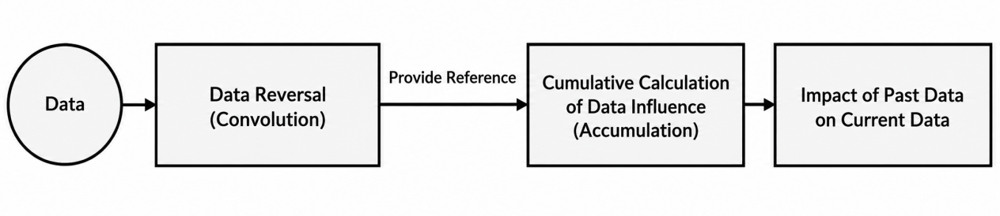

In YOLO26, the data to process consists of images. Images are two-dimensional in computer vision, and the corresponding convolution belongs to two-dimensional convolution. The purpose of two-dimensional convolution is to extract features in images. When performing two-dimensional convolution, understanding the convolution kernel is essential.

A convolution kernel is a unit area for performing convolution calculations each time. Unit areas of convolution kernels use pixels as units, and integration is performed on pixels within each area during calculation. Generally, convolution is conducted by sliding the convolution kernel, and kernel size requires manual configuration.

When performing convolution calculation, the outer periphery of the image remains unchanged or expands by arbitrary pixels according to desired effects, and convolution results are re-inserted into corresponding positions in the image.

Taking an image with a resolution of 6 by 6 as an example, expand it to a 7 by 7 image first, and substitute the image into the convolution kernel for calculation. Finally, fill the data into a blank image with a resolution of 6 by 6.


2. Pooling Layer: Feature Amplification

Pooling layers, also called downsampling layers, are generally used alongside convolutional layers. After convolution computation completes, pooling layers perform further sampling operations on features. Pooling is divided into various types, such as global pooling, average pooling, and max pooling. Different pooling types yield different effects.

For ease of comprehension, max pooling is used here as an example. Before understanding max pooling, filters must be understood, which, like convolution kernels, require manual area setting. Filters slide during computation to filter pixels within the area pixel by pixel.


Max pooling can be understood as retaining the most prominent features while removing remaining features. Taking an image with a resolution of 6 by 6 as an example, when pooling begins, use a 2 by 2 filter to calculate on the original image, obtaining a new image.

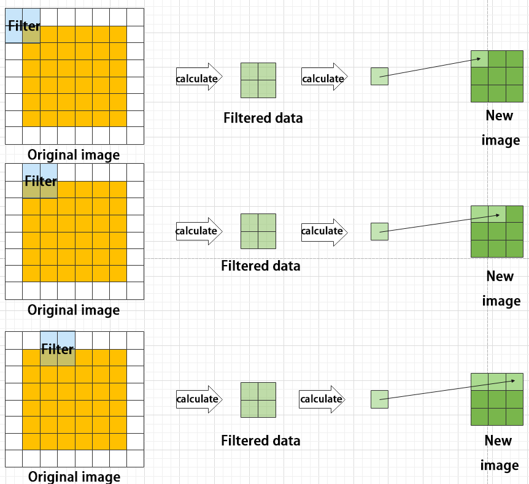

3. Upsampling Layer: Dimension Restoration

Upsampling can be understood as "unpooling". Images shrink after pooling. Performing upsampling restores images to their original dimensions. However, only dimensions are restored, while post-pooling features change accordingly.

Taking an image with a resolution of 6 by 6 as an example, when upsampling begins, use a 3 by 3 filter to calculate on the original image to obtain a new image.

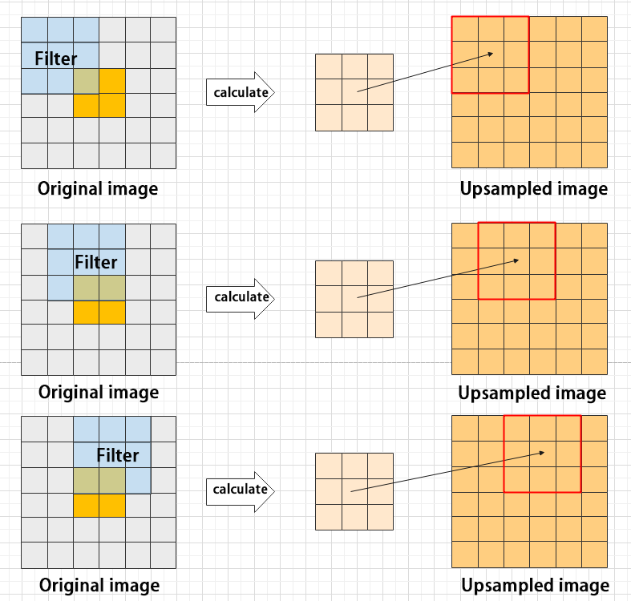

4. Batch Normalization Layer: Data Organization

Batch normalization operations on data refer to rearranging data neatly. Their practical function is to reduce model computation difficulty and allow data to map better into activation functions.

Batch normalization processing reduces feature loss rates after each calculation, allowing more features to be retained for subsequent calculations. After multiple calculations, model sensitivity toward data improves accordingly.


5. RELU Layer: Activation Function

Adding activation functions during model construction increases model non-linearity. Without activation functions, each layer is equivalent to matrix multiplication. The output of each layer is a linear function of input from the upper layer, meaning no matter how many layers a neural network has, the output remains a linear combination of input, preventing constructed models from changing according to practical situations.

Activation functions exist in many types, with common ones including RELU, TANH, and SIGMOID. RELU is used as an example here. The Rectified Linear Unit function is a piecewise function that replaces all values less than 0 with 0 while keeping positive values unchanged.


6. ADD Layer: Tensor Addition

Features are divided into prominent features and non-prominent features. The function of the ADD layer is to add tensors of features together, achieving feature enhancement effects for prominent features.


7. Concat Layer: Tensor Concatenation

The function of the Concat layer is to concatenate tensors of features, thereby concatenating features extracted through different methods together to preserve more features.

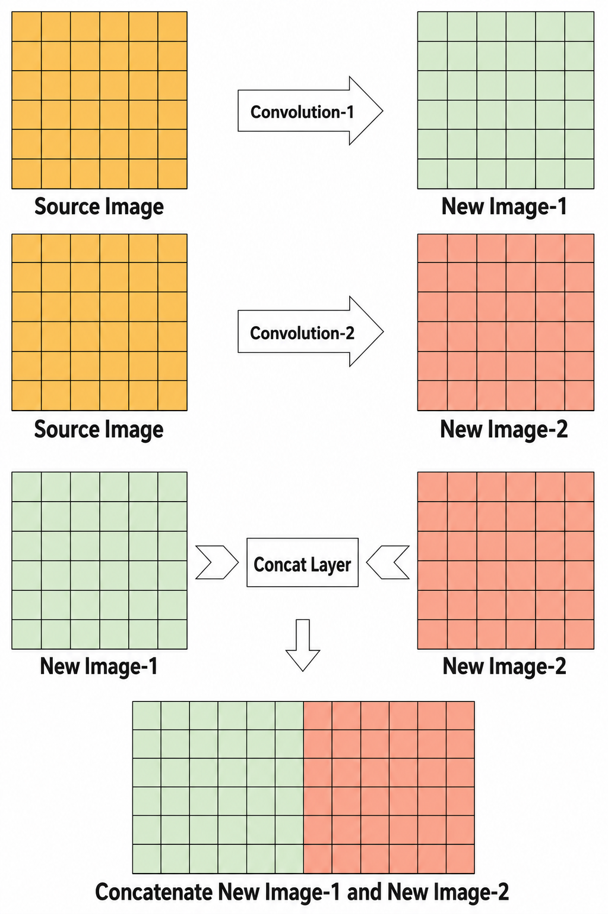

* **Composite Elements**

When building models, using only the basic layers mentioned above to construct functions can easily result in verbose code, chaotic structures, and unclear layering. Organizing basic elements into various units for invocation effectively improves model coding efficiency.

1. Convolutional Unit

A convolutional unit consists of a convolutional layer, a batch normalization layer, and an activation function. Convolution is performed first, followed by batch normalization, and finally activation via the activation function.

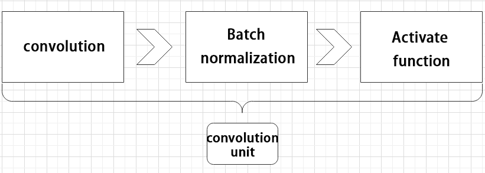

2. Focus Unit

First, divide the input image into multiple large regions, and then concatenate small images located at identical positions within each large region to decompose the input image into several images. Finally, perform initial sampling on images via a convolutional unit.

As shown below, taking an image with a resolution of 6 by 6 as an example, setting one large region as 2 by 2 decomposes the image into 9 large regions, with each large region containing 4 small images.

Concatenating small images located at Position 1 within each large region yields a 3 by 3 image. Small images at other positions are concatenated in the same way, eventually decomposing the original 6 by 6 image into four 3 by 3 images.


3. Residual Unit

The function of a residual unit is to enable the model to learn subtle changes in images. Its structure is relatively simple, implemented by superimposing data obtained through two paths.

The first path features two convolutional units to sample the image, while the second path does not place convolutional units for sampling, using the original image directly instead. Finally, data from the first path is superimposed onto the second path.


4. Composite Convolutional Unit

In YOLO models, the composite convolutional unit is characterized primarily by customizability of convolutional units according to requirements. Composite convolutional units are also implemented via data superposition from two paths.

The first path has only one convolutional layer for sampling, while the second path features `2x+1` convolutional units and one convolutional layer for sampling. After sampling and concatenation, data is organized via batch normalization and passed through an activation function. Finally, one convolutional unit is used for sampling.


5. Composite Residual Convolutional Unit

Composite residual convolutional units replace `2x` convolutional units inside composite convolutional units with `x` residual units. In YOLO26, composite residual units feature customizability of residual units according to requirements.

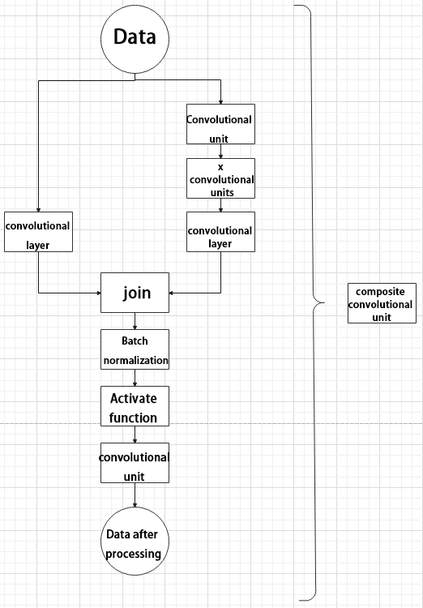

6. Composite Pooling Unit

Output data of the convolutional unit is fed into three max pooling layers separately, with another copy kept unprocessed. Subsequently, data from the four routes is concatenated, and the result is fed into a convolutional unit. Processing data with composite pooling units significantly amplifies features of the original data.

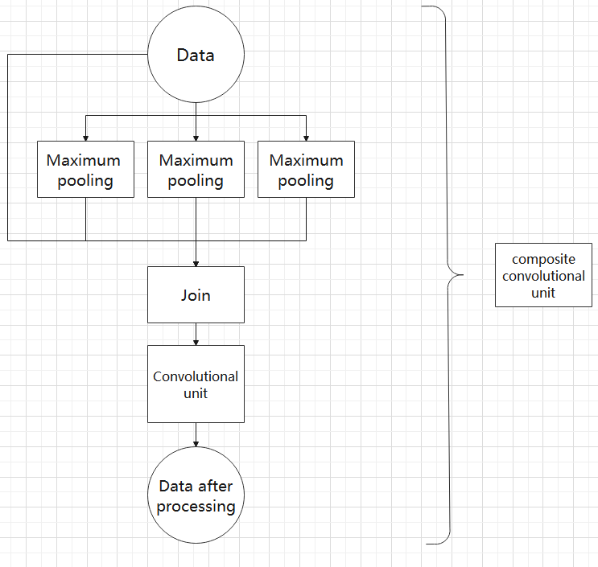

### 6.3.3 YOLO26 Execution Workflow

This section explains model workflow execution using prior boxes, prediction boxes, and anchor boxes used in YOLO26.

* **Prior Box**

When feeding images into the model, target recognition regions on images need to be provided, and prior boxes are boxes used to mark target recognition regions on images in advance.


* **Prediction Box**

Prediction boxes require no manual configuration, as they are output results of the model. When the first batch of training data is fed into the model, prediction boxes are generated automatically. Locations where objects of the same category appear with higher frequency are set as center points of prediction boxes.


* **Anchor Box**

After prediction boxes are generated, deviations in size and location may occur. The function of anchor boxes is to correct the size and location of prediction boxes.

Locations where anchor boxes are generated are determined by prediction boxes. To influence locations of subsequent prediction box generation, anchor boxes are generated at relative center positions of existing prediction boxes.


* **Implementation Workflow**

After completing dataset labeling, prior boxes appear on images. Subsequently, when image data is fed into the model, the model generates prediction boxes according to prior box locations. After prediction boxes are generated, anchor boxes are generated accordingly. Finally, the weights of this training session are updated in the model.

Newly generated prediction boxes are influenced by anchor boxes generated previously. By repeating the above operations, size and position deviations of prediction boxes gradually disappear until overlapping with prior boxes.


## 6.4 YOLO26 Model Training

### 6.4.1 Image Collection and Labeling

Since training YOLO models requires large amounts of data, collecting and labeling data must be performed first to prepare for subsequent model training.

* **Image Collection**

1. Power on the robot and connect it to the remote control software VNC.

2. Click the icon  on the system desktop to open the command line terminal.

```
~/.stop_ros.sh
```

3. Enter the command to start the depth camera service.

```
ros2 launch peripherals depth_camera.launch.py
```

4. Open a new command line terminal and enter the command to create a new directory for storing datasets.

```
mkdir -p ~/my_data
```

5. Then enter the command to launch the image collection tool.

```
cd ~/software/collect_picture && python3 main.py
```


The **save number** in the upper left corner indicates the image ID, representing which image is saved, while **existing** indicates the quantity of saved images.

6. Click to select, modifying the saving path to the created directory folder.

   

7. After selecting the corresponding directory, click **Choose**:

   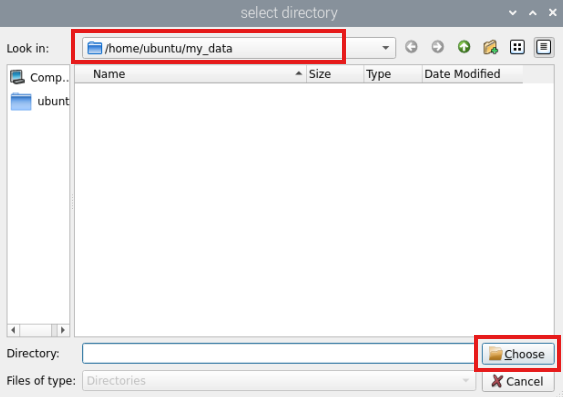

8. Place target recognition contents within the camera field of view, click **Save (space)** button or press **Space** to save current camera frame.

   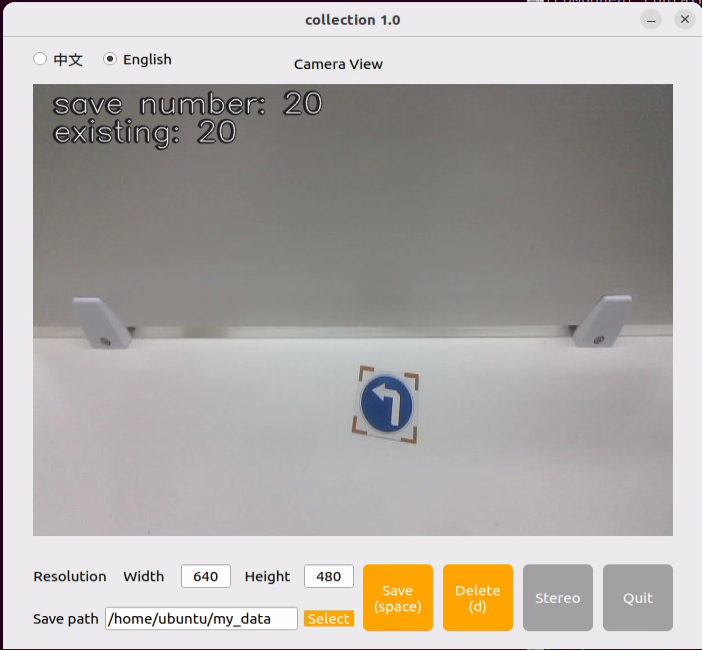

9. After clicking **Save (space)** or pressing **Space**, a **JPEGImages** folder for saving images automatically generates under directory **/home/ubuntu/my_data**.

   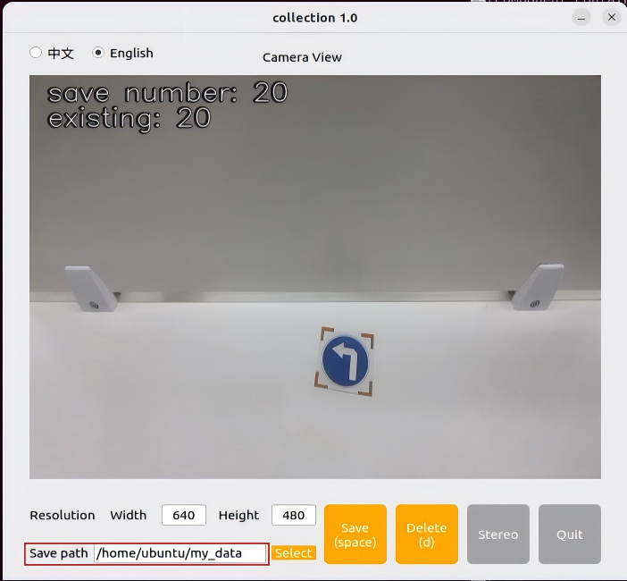

> [!NOTE]
>
> **To enhance model reliability, photograph target recognition contents from different distances, rotation angles, and tilt angles.**

10. After completing image collection, click **Exit** button to close this tool.

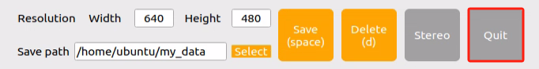

11. Open terminal and enter command to view saved images.

```
cd ~/my_data/JPEGImages && ls
```

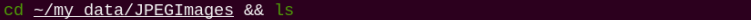

12. Then press key combination **Ctrl+C** in all open command line terminals to exit, completing image collection steps.

* **Image Labeling**

After collecting images, images must be labeled. Image labeling is essential for functional datasets because it informs the training model which categories important image parts belong to, allowing recognition of these categories in new, unseen images later.

> [!NOTE]
>
> **Command inputs require strict case sensitivity, and Tab key can be used to complete keywords.**

1. Open command terminal, enter command, and launch image labeling software.

```
python3 ~/software/roLabelImg/roLabelImg.py
```

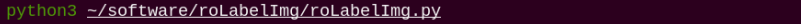

2. After opening software, click **File** in upper left corner, select **Open Dir**, choose directory containing collected images, and click **Choose**.

   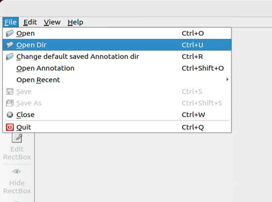

   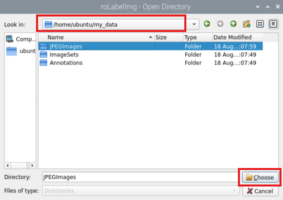

3. Click **File** in upper left corner, select **Change default saved Annotation dir** to change saving path, selecting **Annotations** directory under **my_data** folder.

   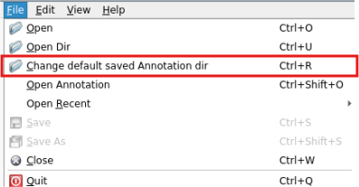

   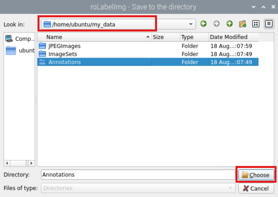

4. Click **View** in upper left corner and select **Advanced Mode** to enable rotation labeling functionality.

   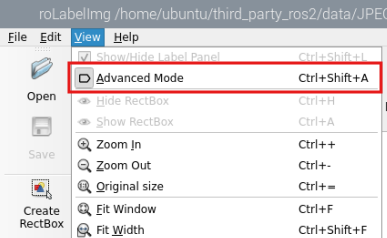

5. Shortcut key **e** represents labeling rotating targets, **d** represents next image, **a** represents previous image, **c** represents slight clockwise rotation, **x** represents slight counterclockwise rotation, **v** represents large clockwise rotation, and **z** represents large counterclockwise rotation. After labeling each image, click **save** icon on left side to save.

   > [!NOTE]
   >
   > **Always use keyboard keys C and X for rotation to align rectangle box angles with object borders, otherwise subsequent recognition will be affected.**

   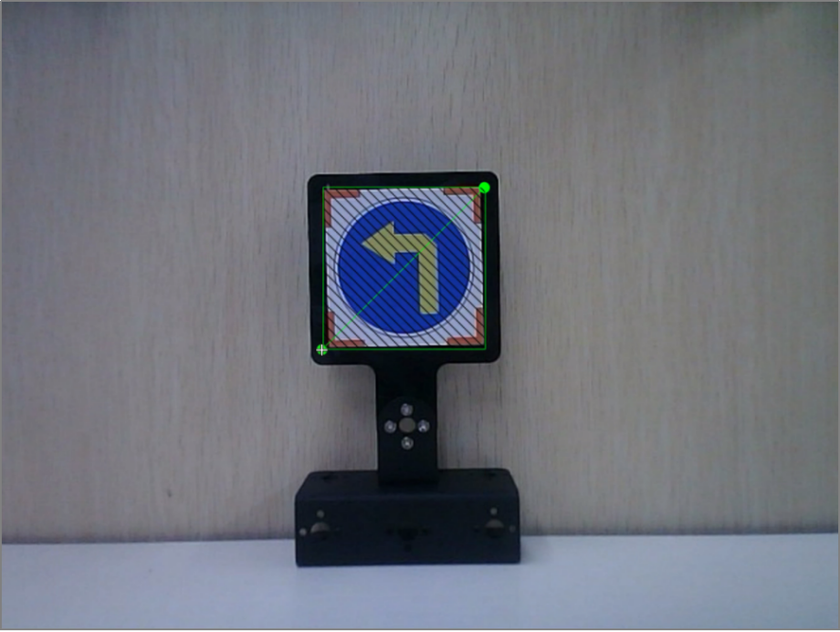

6. Name category of target recognition contents in pop-up window, named after labeled objects here. After naming, click **OK** button to save category.

   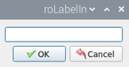

7. Press key **d** to enter next image labeling. After completing labeling for all images, click close button in upper right corner of software to exit.

### 6.4.2 Data Format Conversion

* **Preparation**

Before starting operations in this section, image collection and labeling must be completed. For detailed operation steps, refer to [6.4.1 Image Collection and Labeling](#p6-4-1).

Before feeding data into YOLO26 models for training, setting image categories and converting annotation data format must be performed.

* **Format Conversion**

Before starting operations in this section, image collection and labeling must be completed.

> [!NOTE]
>
> **Command inputs require strict case sensitivity, and the Tab key can be used to complete keywords.**

1. Open a new terminal and enter the command to view the file. **If this file does not exist, create it here.**

```
gedit ~/my_data/classes.names
```

2. Write the labeled category **left** into the text file. If multiple different categories exist, edit with line breaks.

> [!NOTE]
>
> **Class names added here must strictly match names inside image labeling software "roLabelImg".**

3. After editing, press the key combination **Ctrl+S** to save and exit.

4. Return to the command line terminal, enter the data format conversion command, and press **Enter**.

```
python3 ~/third_party_ros2/yolo/xml2yolo_obb.py --data ~/my_data --yaml ~/my_data/data.yaml
```

Parameters involved in the command above:

1. **my_data**: Represents the user-labeled folder, and the path needs to correspond.

2. **data.yaml**: Represents the format conversion form for the whole folder, saved in the **my_data** folder as seen from the command.

### 6.4.3 Model Training

> [!NOTE]
>
> **Command inputs require strict case sensitivity, and the Tab key can be used to complete keywords.**

* **Preparation**

After converting model formats, proceed to model training steps. Before doing so, prepare the dataset converted previously. For details, refer to [6.4.2 Data Format Conversion](#642-data-format-conversion).

* **Model Training**

1. Power on the robot and connect it to remote control software VNC.

2. Click the icon  on the system desktop to open the command line terminal.

3. Enter the command and press **Enter** to navigate to the specified directory.

```
cd ~/third_party_ros2/yolo/yolo26
```

5. Enter the model training command and press **Enter**.

```
python3 train.py --img 640 --batch 64 --epochs 300 --data ~/my_data/data.yaml --weights yolo26n.pt
```

In the command, `--img` represents image dimensions, `--batch` represents single input image quantity, `--epochs` represents training iterations, `--data` represents dataset path, and `--weights` represents training file path.

Modify above parameters according to practical needs. To increase model reliability, training iterations can be increased, though training time consumption increases accordingly.

After model training completes, output path of generated files prints in terminal. Results of this training session save to **/home/ubuntu/runs/detect/train3** directory under home folder.

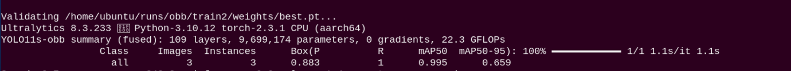

> [!NOTE]
>
> **Generated file paths are not fixed and can be found inside corresponding folders under runs/detect/train.**

### 6.4.4 Target Detection
After extensive training, new models are obtained. For specific operation steps, refer to [6.4.1 Image Collection and Labeling](#641-image-collection-and-labeling) through [6.4.3 Model Training](#643-model-training).

* **Operation Steps**

1. Click icon  on system desktop to open command line terminal, enter command, and press **Enter** to stop app service.

```bash
~/.stop_ros.sh
```

2. Enter command to copy trained **best.pt** file to **~/third_party_ros2/yolo** directory. Paths and filenames of generated files are not fixed and can be modified according to actual situations.

```bash
cp ~/runs/detect/train3/weights/best.pt ~/third_party_ros2/yolo
```

3. Enter command to open file.

```bash
gedit ~/ros2_ws/src/example/example/yolo_detect/yolo_detect_demo.py
```

Fill trained model category name **left** into `CLASSES_NAMES_DEFAULT`, save, and exit. Double quotes " " must be added here.

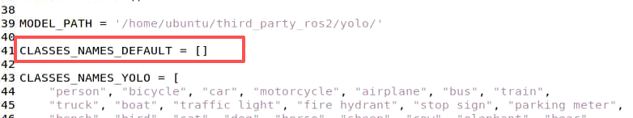

4. Enter command to run target detection.

```bash
ros2 launch example yolo_detect_demo.launch.py model_name:=best
```

* **Detection Effect**

Place target signs within camera field of view. When target signs are recognized, return frames outline signs with bounding boxes, printing category names and detection confidence scores.

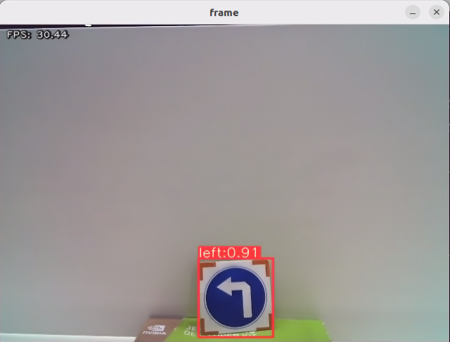

## 6.5 Waste Card Model

> [!NOTE]
>
> **Regarding product names and reference paths appearing in documents, subject to actual conditions.**

When datasets are large, training on robot controllers is not recommended due to I/O speed and memory constraints resulting in slow training. Utilizing computers equipped with dedicated graphics cards is recommended. Training methods remain identical, requiring only environment configuration for program execution.

To train custom models, refer to contents of this section for model training.

### 6.5.1 Preparation

1. Prepare a laptop computer. If using desktop computers, prepare wireless network cards, mice, and other tools.

2. Power on the robotic arm and connect it to remote control software **VNC**. Refer to [1. Tutorials / 1. NexArm User Manual / 1.5 Development Environment Setup and Configuration](https://drive.google.com/drive/folders/1E_TRpBIkzi_glH7KCmwj_b4I6jDOFO-Z?usp=sharing).

### 6.5.2 Model Usage

1. Click icon  on system desktop to open command line terminal.

```
~/.stop_ros.sh
```


2. Enter command to run target detection.

```
ros2 launch example yolo_detect_demo.launch.py model_name:=best_garbage_26
```

* **Detection Effect**

Place signs within camera field of view. When garbage items are recognized, return frames outline items with bounding boxes, printing category names and detection confidence scores.

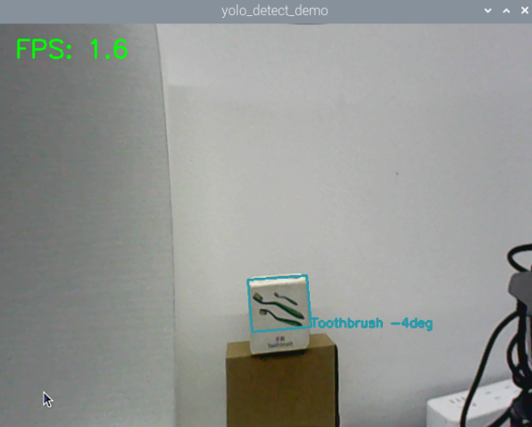
