# 7. URDF Modeling and Simulation

<p id="anther7-1"></p>

## 7.1 Virtual Machine Installation and Configuration

### 7.1.1 Virtual Machine Installation and Import

* **Virtual Machine Software Installation**

(1) VMware Virtual Machine Installation

A virtual machine is software that enables a guest operating system to run within a host operating system. This section uses **VMware Workstation** as an example, with installation steps outlined below:

1. Extract the virtual machine software archive located in the [Configuration Files / VMware](https://drive.google.com/drive/folders/1tvuXSgJsrRZnro8lrqAB8VZBkSFPN-tE?usp=sharing) directory.

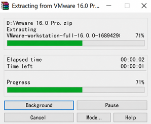

2. Locate the extracted virtual machine folder and double-click the executable file with the **.exe** extension.

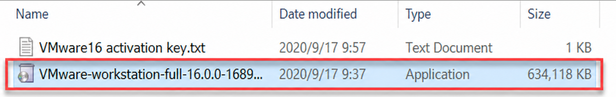

3. Complete the virtual machine installation according to the sequence shown in the figures below:


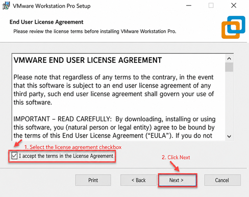


4. When launching the virtual machine for the first time, product key activation is required. Enter any key from the [VMware16 Activation Key](https://drive.google.com/drive/folders/1tvuXSgJsrRZnro8lrqAB8VZBkSFPN-tE?usp=sharing) file inside the virtual machine folder and click **Continue**.

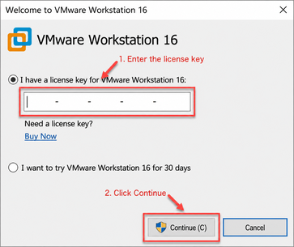

① Start VMware-Related Services on Local Computer

1. Switch to the host computer and press the shortcut keys **WIN+R** to open the **Run** dialog box. Enter `control` and press **Enter** to open **Control Panel**.


2. Click **Administrative Tools** to open the management panel, then double-click **Services**.

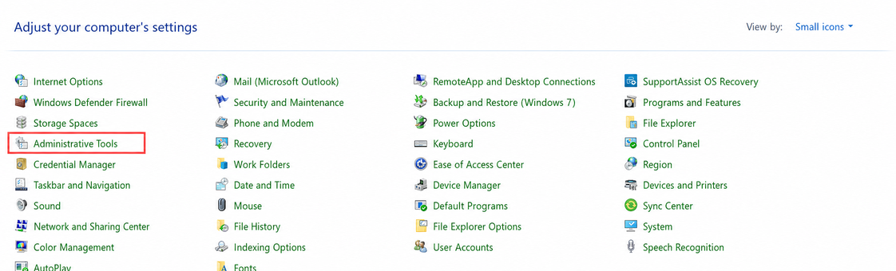


3. Locate the VMware-related services as shown below:


4. Right-click each service and select **Start** to enable all VMware-related services.

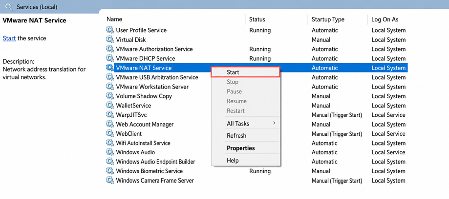

(2) VirtualBox Installation

1. Open the software installation package in the same directory and click **Next**.

    

2. Modify the target installation path if necessary, then click **Next**.

    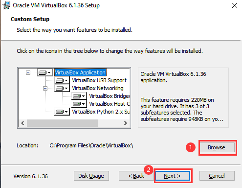

3. Retain the default options and click **Next**.

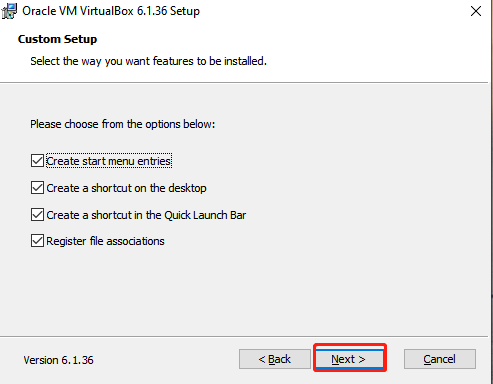

4. Confirm the installation settings and click **Install**.

    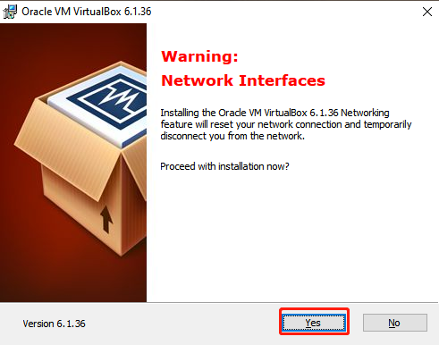

    

5. Upon completing the installation, click **Finish**.


* **Virtual Machine Image Import**

> [!NOTE]
>
> **VMware Workstation is used as the primary example in this section.**

1. In the main software interface, click **Open a Virtual Machine**.

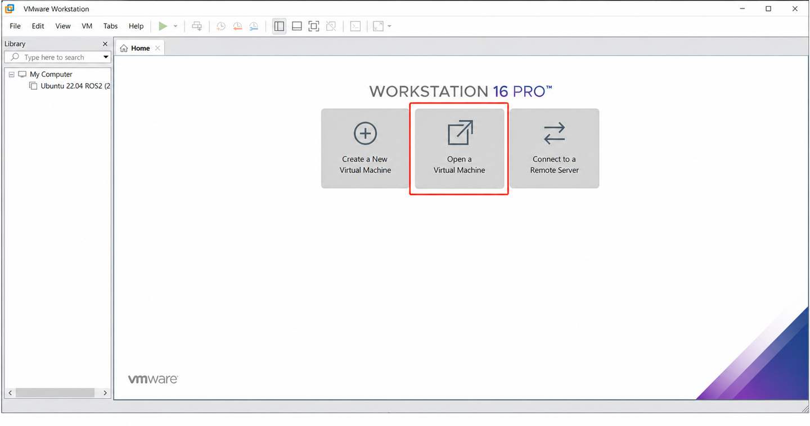

2. Navigate to [Configuration Files / Virtual Machine Image](https://drive.google.com/drive/folders/1No1LdULQ9QS8irzY3_dh74lfwgCsd03o?usp=sharing), select the virtual machine file, and click **Open**.

    

3. Select the target storage path, click **Import**, and wait for the import process to complete.

    

    

4. Once the import process completes, the virtual machine is ready for use.

* **Virtual Machine Settings**

1. Locate the imported virtual machine and click **Edit virtual machine settings**.


2. Click **Network Adapter** and select **Bridged** mode.

    

3. Click **Display** and uncheck **Accelerate 3D graphics**.

> [!NOTE]
>
> **Enabling Accelerate 3D graphics reduces virtual machine performance and may cause latency during simulation.**


### 7.1.2 Configuration Work

The initial virtual machine startup typically takes longer than subsequent boots, which is expected behavior.

The desktop interface after launching the virtual machine is shown below:

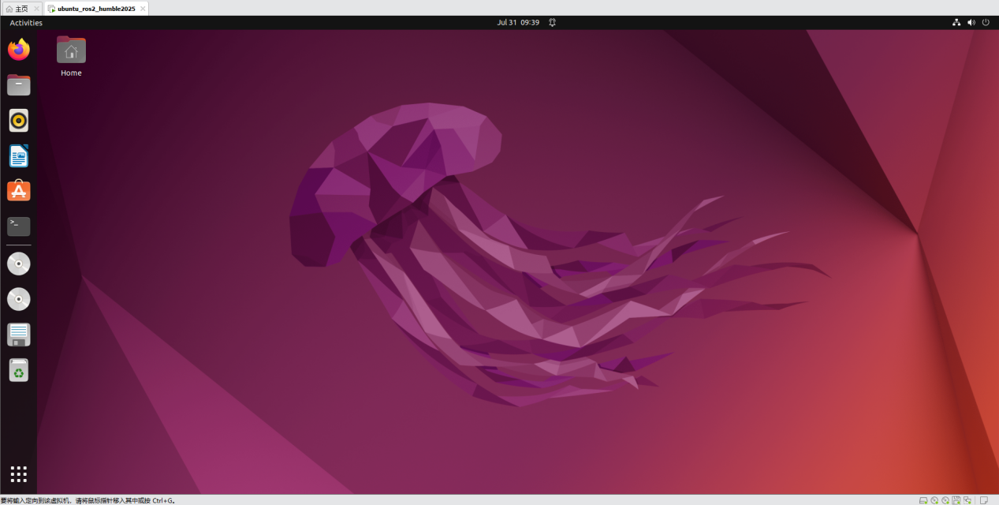

* **Package Import - Conducted on the Virtual Machine**

1. Power on the virtual machine. Click the desktop icon  to open a terminal window.

2. Click the desktop icon **Home** 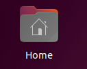 to open the user home directory.

3. Locate the **Simulations** archive under [Configuration Files / Package Files](https://drive.google.com/drive/folders/1No1LdULQ9QS8irzY3_dh74lfwgCsd03o?usp=sharing), and drag it into the **Home** directory of the virtual machine.

4. Right-click inside the **Home** directory and select **Open in Terminal**.

   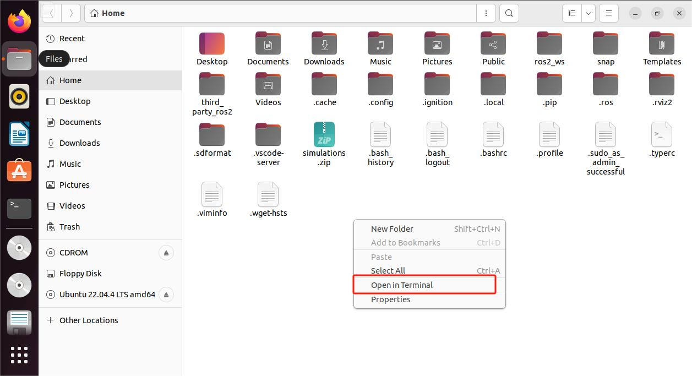

5. Enter the command to create the workspace directory:

   ```bash
   mkdir -p ~/ros2_ws/src
   ```

   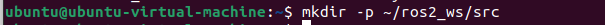

6. Enter the following commands sequentially to extract the archive and move the files into the source directory:

   ```bash
   unzip ~/simulations.zip
   ```

   ```bash
   mv ~/simulations ~/ros2_ws/src/simulations
   ```

   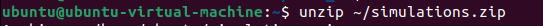

   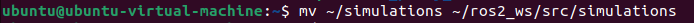

   If prompted to replace existing files, enter **A** and press **Enter**.

   

7. Enter the following command to compile the packages and wait for completion:

   ```bash
   cd ~/ros2_ws && colcon build --symlink-install
   ```

   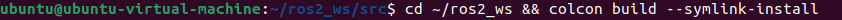

8. Enter the command to relocate the **.typerc** configuration file:

   ```bash
   mv /home/ubuntu/.typerc ~/ros2_ws/.typerc
   ```

   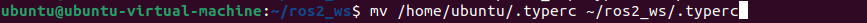

9. Enter the command to verify successful file relocation:

   ```bash
   cd ~/ros2_ws/ && ls -a
   ```

   

10. Enter the following commands to automatically load the configuration file in **.bashrc**:

    ```bash
    echo "source ~/ros2_ws/install/setup.bash">>~/.bashrc
    ```

    ```bash
    echo "source ~/ros2_ws/.typerc">>~/.bashrc
    ```

    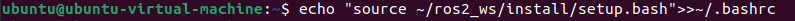

    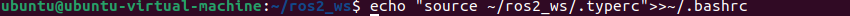

11. Reload the configuration file to apply the updated settings:

    ```bash
    source ~/.bashrc
    ```

    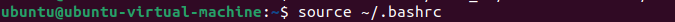

* **Network Configuration - Conducted on the Robot**

To ensure proper communication between the virtual machine and the robot during synchronized control, initial network configuration is required.

1. Power on the robot and click 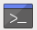 to open a terminal window.

2. Enter the command to open the Wi-Fi configuration file:

   ```bash
   cd ~/hiwonder-toolbox && gedit wifi_conf.py
   ```

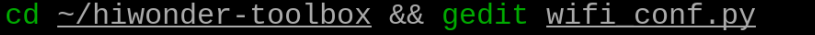

3. Change the configuration to local area network mode and enter the Wi-Fi name and password. Subsequent connections require a self-provided Wi-Fi router or an enabled mobile hotspot:

    

4. Press **Ctrl+S** to save the changes and close the file editor.

5. During subsequent connections, ensure that both the robot and the virtual machine reside on the same network subnet. Verify IP addresses using the terminal command:

   ```bash
   ifconfig
   ```

   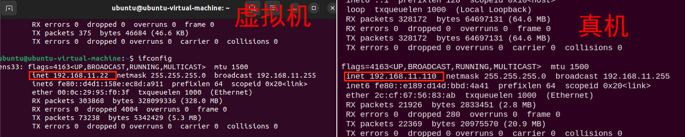

In this configuration, both the virtual machine and the robot reside on the `192.168.11` subnet, establishing proper network communication.

Common connection methods include the following:

1. **Connection via Router - Recommended**: Connect the host computer and the **Raspberry Pi** mainboard to the same router using Ethernet cables.

2. **Connection via Local Area Network - LAN - Recommended**: Configure STA LAN mode as directed, connecting both the robot and the host computer to the same Wi-Fi network or mobile hotspot.

3. **Direct Connection - Not Recommended**: Set the robot to AP mode - Direct Connection - and connect the host computer directly to the robot Wi-Fi AP.

* **Device Configuration - Conducted on the Virtual Machine**

In addition to network configuration, the virtual machine and the robot must share a matching `DOMAIN_ID` to communicate properly, alongside matching camera model settings.

1. Power on the robot and click  on the desktop to open a terminal window.

2. The terminal displays the device `DOMAIN_ID` as shown below:

   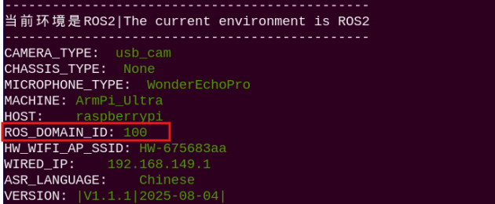

   Taking `100` as an example, configure the virtual machine accordingly.

3. Power on the virtual machine. Click the desktop icon  to open a terminal window.

4. Enter the command to open the configuration file:

   ```bash
   gedit ~/ros2_ws/.typerc
   ```

   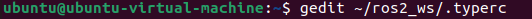

5. Select configuration parameters matching the camera model, setting the ID value to `100`.

   `aurora`: Depth camera. `usb_cam`: Monocular camera.

   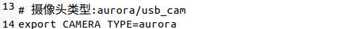

   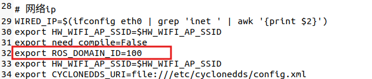

6. Press **Ctrl+S** to save and close the file.

7. Close the current terminal and open a new terminal window to verify that the ID has updated to `100`:

   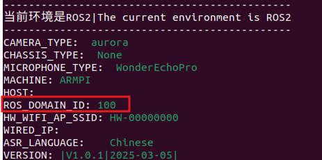


## 7.2 Introduction to URDF Model

### 7.2.1 URDF Model Introduction and Getting Started

> [!NOTE]
>
> **This tutorial relies on virtual machine configuration and simulation. If a virtual machine is not installed, complete the setup in [7.1 Virtual Machine Installation and Configuration](#anther7-1) before proceeding.**

* **URDF Model Overview**

URDF - Unified Robot Description Format - is an XML-based specification used to represent robot structures. The goal of this format is to provide a standardized, general-purpose robot representation.

Robots are typically modeled as assemblies of rigid links and interconnecting joints. Links represent rigid components with mass attributes, while joints connect links and constrain relative motion between them.

Interconnected links and constraining joints combine to form a complete kinematic robot model. A URDF file describes spatial relationships, inertial attributes, geometric features, and collision models across all joints and links.

* **Comparison Between Xacro and URDF Models**

The URDF format provides a straightforward description of robot models, offering a clear structure and high readability. However, describing complex robot structures purely in URDF results in verbose files with duplicated descriptions.

Xacro - XML Macros - extends URDF functionality while maintaining structural compatibility. Using Xacro allows modular macros to streamline robot description files, enhancing code reusability and reducing file length.

For example, when modeling the legs of a bipedal humanoid robot, URDF requires separate descriptions for each leg, whereas Xacro allows defining a single leg macro and reusing it.

* **Installing URDF Dependencies**

> [!NOTE]
>
> **URDF and Xacro packages are pre-installed in the virtual machine environment, making manual installation unnecessary. This section is provided for reference.**

1. Enter the command and press **Enter** to update package indices:

   ```bash
   sudo apt update
   ```

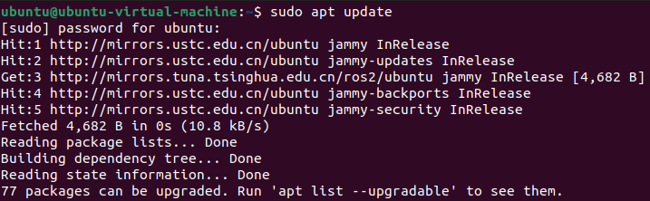

2. Enter the command and press **Enter** to install URDF dependencies:

   ```bash
   sudo apt-get install ros-humble-urdf
   ```

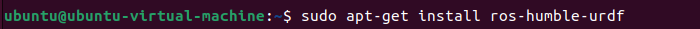

Successful installation is indicated by output similar to the image below:


3. Enter the command and press **Enter** to install the Xacro package:

   ```bash
   sudo apt-get install ros-humble-xacro
   ```

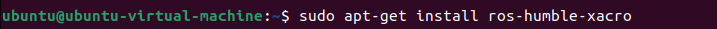

Successful installation is indicated by output similar to the image below:


* **Basic URDF Syntax**

<p id="p7-2-1-1"></p>

(1) Basic XML Syntax

Because URDF models follow XML standards, understanding basic XML structure is essential.

**Elements:**

Elements are declared using custom names according to standard syntax:

`<Element>`

`</Element>`

**Attributes:**

Attributes reside inside element start tags to define properties and parameters:

`<Element attribute_1="value1" attribute_2="value2">`

`</Element>`

**Comments:**

Comments do not affect attributes or elements and follow the syntax rule:

`<!-- Comment Content -->`

(2) Links

Links are declared using the `<link>` tag in URDF, describing physical appearance and inertial properties of rigid robot components using the tags listed below:

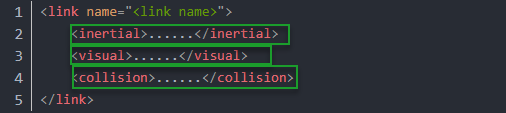

`<visual>`: Describes visual appearance parameters of the link, including size, color, and geometric shape.

`<inertial>`: Describes link inertia parameters, primarily used for dynamics calculations.

`<collision>`: Describes collision boundaries and properties of the link.

Each tag contains child elements with functions detailed below:

| Tag | Function |
| :---: | :---: |
| `origin` | Describes link pose, containing `xyz` for spatial position in simulation space and `rpy` for orientation angles. |
| `mass` | Describes total mass of the link. |
| `inertia` | Describes link inertia tensor parameters `ixx`, `ixy`, `ixz`, `iyy`, `iyz`, and `izz` derived through calculation. |
| `geometry` | Describes link geometry, loading mesh files via `mesh` and file paths via `filename`, or basic shapes `box`, `cylinder`, and `sphere`. |
| `material` | Describes link material properties, requiring `name` attribute and specifying color/opacity via `color` child tag. |

(3) Joints

Joints are declared using the `<joint>` tag, defining kinematic and dynamic attributes between links along with motion limits. Joints are categorized into six types:

| Type and Description | Tag |
| :---: | :---: |
| Continuous Joint: Continuous rotation around a single axis without limits | `continuous` |
| Revolute Joint: Rotational joint with upper and lower angle limits | `revolute` |
| Prismatic Joint: Sliding joint moving along a single axis with linear position limits | `prismatic` |
| Planar Joint: Joint allowing translation or rotation orthogonal to a plane | `planar` |
| Floating Joint: Unconstrained joint permitting translation and rotation in 3D space | `floating` |
| Fixed Joint: Rigid joint permitting no relative motion | `fixed` |

Joint structures utilize the tags shown below:

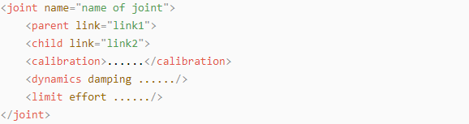

`<parent>`: Specifies the parent link element.

`<child>`: Specifies the child link element.

`<calibration>`: Calibrates joint zero-position offsets.

`<dynamics>`: Describes physical joint properties such as friction and damping.

`<limit>`: Specifies physical motion limits.

Tag functions are detailed below:

| Tag | Function |
| :---: | :---: |
| `origin` | Describes joint pose relative to parent link, with `xyz` defining translation and `rpy` defining rotation. |
| `axis` | Defines rotation or translation axis of child link relative to parent link. |
| `limit` | Constrains child link motion, with `lower` and `upper` defining radian limits, `effort` specifying maximum force in N, and `velocity` defining maximum speed in m/s. |
| `mimic` | Describes joint dependency relationships with other joints. |
| `safety_controller` | Configures safety controller parameters for joint protection. |

(4) robot Tag

Top-level container element wrapping all `<link>` and `<joint>` declarations:

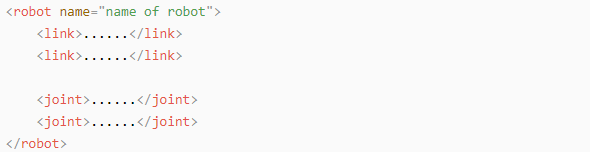

(5) gazebo Tag

Used alongside the **Gazebo** simulator to specify simulation parameters, load **Gazebo** plugins, and configure physics attributes.

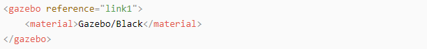

(6) Writing a Simple URDF Model

① Specify Robot Model Name

When starting to write a URDF model, specify the model name at the very beginning: `<robot name="robot_model_name">`. Enter `</robot>` at the end of the model specification to indicate that the robot model description is complete.

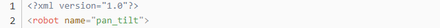

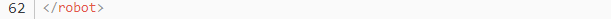

② Define Links

1. Write the first link using indentation to indicate that the link belongs within the model being configured, and set the link name: `<link name="link_name">`. Enter `</link>` at the end of the link specification to indicate that the link description is complete.

   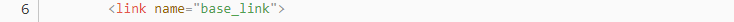

   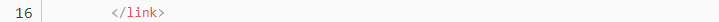

2. Write the link visual description section using indentation to indicate that the description belongs within the specified link. Enter `<visual>` at the beginning of the description and `</visual>` at the end.

   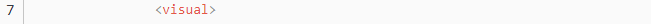

   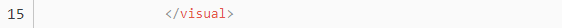

3. `<geometry>` describes the shape of the link, ending with `</geometry>`, where indentation is used to specify the detailed outer shape description. The figure below describes a cylinder shape: `<cylinder length="0.01" radius="0.2"/>`, where `length="0.01"` indicates a link length of 0.01 m and `radius="0.2"` indicates a link radius of 0.2 m.

   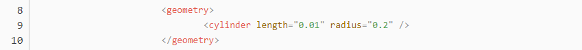

4. `<origin>` describes the link position, using indentation to specify the detailed pose location. The figure below describes a link pose: `<origin rpy="0 0 0" xyz="0 0 0"/>`, where `rpy` defines the link rotation angles and `xyz` defines the coordinate position, placing the link at the origin of the coordinate system.

   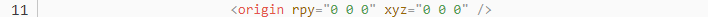

5. `<material>` describes the link material and color properties, using indentation to specify detailed visual color settings. Enter `<material>` at the beginning and `</material>` at the end. The figure below sets the link color to yellow: `<color rgba="1 1 0 1"/>`, where `rgba="1 1 0 1"` sets the color threshold values.

   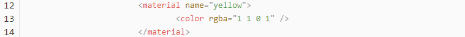

③ Define Joints

1. Write the first joint using indentation to indicate that the joint belongs within the model being configured, and set the joint name and type: `<joint name="joint_name" type="joint_type">`. Enter `</joint>` at the end of the joint specification to indicate that the joint description is complete.

   > [!NOTE]
   >
   > **Refer to [(3) Joints](#p7-2-1-3) for detailed joint classification types.**

   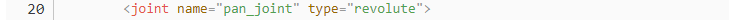

   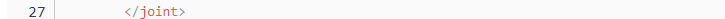

2. Write the joint connection link description section using indentation to indicate that the description belongs within the specified joint, setting the `parent` and `child` parameters according to: `<parent link="parent_link"/>` and `<child link="child_link"/>`. When the joint rotates, it pivots around the parent link to rotate the child link.

   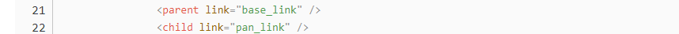

3. `<origin>` describes the joint position, using indentation to specify the detailed coordinate location. The figure below describes a joint position: `<origin xyz="0 0 0.1"/>`, where `xyz` defines the joint coordinate location as x = 0 m, y = 0 m, and z = 0.1 m.

   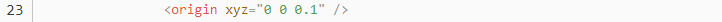

4. `<axis>` describes the joint orientation, using indentation to specify the detailed rotation axis pose. The figure below describes a joint pose: `<axis xyz="0 0 1"/>`, where `xyz` defines the rotation axis orientation position.

   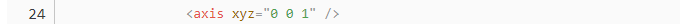

5. `<limit>` constrains joint motion, using indentation to specify detailed joint angle limits. The figure below constrains maximum joint force to not exceed 300 N, with upper rotation limit set to 3.14 rad and lower limit set to -3.14 rad. The parameters are configured as: `effort` specifying joint force in N, `velocity` defining movement speed, `lower` setting lower radian limit, and `upper` setting upper radian limit.

   

6. `<dynamics>` describes joint kinematics and dynamics, using indentation to specify detailed joint physical properties. The figure below describes joint dynamic parameters: `<dynamics damping="50" friction="1"/>`, where `damping="50"` specifies the damping value and `friction="1"` specifies the friction force.

   

   **The complete code is shown below:**

   

### 7.2.2 Explanation of ROS Robot URDF Model

* **Preparatory Work**

Refer to [Basic URDF Syntax](#p7-2-1-1) for foundational rules before inspecting robot description models.

* **Viewing Robot Model Code**

1. Power on the virtual machine. Click the desktop terminal icon  to open a terminal window.

2. Enter the command to navigate into the URDF directory:

   ```bash
   cd ros2_ws/src/simulations/nexarm_description/urdf/
   ```

   

3. Enter the command to view the main Xacro file:

   ```bash
   vim nexarm.xacro
   ```

   

4. Locate the section shown below:

   

   Multiple URDF component models are included to construct the complete robot:

| File Name | Device |
| :---: | :---: |
| `materials` | Color definitions |
| `link` | Robotic arm links |
| `gripper_link` | Gripper link |
| `base_link` | Base link |
| `camera_connet_link` | Camera mount link |

* **Brief Analysis of Robot Main Body Model**

Open a new terminal tab and enter the command to view the arm model file containing joint and link descriptions:

```bash
vim arm.urdf.xacro
```


```xml
<?xml version="1.0" ?>
<robot name="nexarm" xmlns:xacro="http://ros.org/wiki/xacro">
```

This represents the header of the URDF file, specifying XML encoding and naming the robot model `nexarm`. The `xmlns:xacro` namespace is declared for Xacro macro processing.

Declare link `link1`:

```xml
 <link name="link1"/>
```

Define mass, inertia matrix, visual geometry, and collision properties for `link1`:

```xml
<link name="link1">
  <inertial>
    <origin xyz="..." rpy="..." />
    <mass value="..." />
    <inertia ixx="..." iyy="..." izz="..." ... />
  </inertial>
  <visual>
    <geometry>
      <mesh filename="..." />
    </geometry>
    <material name="">
      <color rgba="..." />
    </material>
  </visual>
  <collision>
    <geometry>
      <mesh filename="..." />
    </geometry>
  </collision>
</link>
```

Define revolute joint `joint2` connecting parent `link1` to child `link2`:

```xml
<joint name="joint2" type="revolute">
  <origin xyz="..." rpy="..." />
  <parent link="link1" />
  <child link="link2" />
  <axis xyz="..." />
  <limit lower="..." upper="..." effort="..." velocity="..." />
</joint>
```

The joint position `<origin>` uses an `xyz` attribute to specify placement. Subsequent code continues defining multiple links and joints following the approach described above.


## 7.3 MoveIt2 Simulation

### 7.3.1 MoveIt2 Kinematics Design

* **Introduction to Kinematics**

Kinematics is a branch of mechanics that describes and studies the laws governing how object positions change over time from a geometric perspective, without involving the physical properties of the object itself or the forces applied to it. Forward kinematics and inverse kinematics represent two distinct methods for calculating robot motion changes.

Forward kinematics determines the position and orientation of the end-effector given the values of joint variables, calculating the final position and orientation of the robot from the rotation angles of the servos.

Inverse kinematics determines the values of robot joint variables given the target position and orientation of the end-effector, reverse-calculating the required servo rotation angles from the final position and orientation of the robot.

* **Brief Analysis of Inverse Kinematics**

(1) Geometric Method

For a robotic arm, inverse kinematics calculates the rotation angle of each joint given the position and orientation of the gripper. Three-dimensional robotic arm motion is relatively complex, so to simplify the model, removing the rotation joint of the lower pan-tilt allows kinematics analysis to be conducted on a 2D plane.

Performing inverse kinematics analysis typically involves extensive matrix operations, which are complex and computationally heavy to implement. To better suit practical requirements, the geometric method is applied to analyze the robotic arm.


Simplifying the arm links and end-effectors yields the model above, where target end point P coordinates x and y sum from three segments: x1+x2+x3 and y1+y2+y3.

Angles θ1, θ2, and θ3 represent target servo rotations, while α denotes the gripper angle relative to horizontal. Pitch angle α = θ1 + θ2 + θ3, leading to equations:


Among these, x and y are specified, while l1, l2, and l3 represent inherent arm link length parameters.

To simplify calculations, rearrange the known terms:


Substituting m and n into the existing equations simplifies the system:


Solving through calculation yields θ1:


The above equation is a quadratic formula, where:


Based on this, the angle of θ1 can be calculated, and similarly θ2 can also be calculated. From this, the rotation angles of all three servos can be obtained, enabling coordinate position control by commanding the servo angles.

(2) DH Parameters Method

① Introduction

The Denavit-Hartenberg - DH - parameter table is a standardized method used to describe the relative position and orientation of robotic arm joints and links. Four parameters are used to represent the relationship between each pair of adjacent joints. All four selected DH parameters carry clear physical meanings as follows:

1. Link length: The length of the common normal between the axes of two joints - the rotation axis for a revolute joint or the translation axis for a prismatic joint.

2. Link twist: The angle of rotation of one joint axis relative to another joint axis around their common normal.

3. Link offset: The distance along a joint axis between its common normal with the next joint and its common normal with the previous joint.

4. Joint angle: The rotation angle around a joint axis between its common normal with the next joint and its common normal with the previous joint.

While the above definitions may sound complex, inspecting them alongside coordinate frames makes the concept much clearer.

First, note the two most important lines: a joint axis and the common normal between the axes of adjacent joints.

In the DH parameter system, the joint axis is defined as the Z-axis, and the common normal is defined as the X-axis. The direction of the X-axis points from the current joint to the next joint.

These two rules alone are insufficient to fully determine the coordinate frame for each joint. Detailed steps for establishing coordinate frames are provided below.

In applications such as robotic arm simulation, other methods are frequently adopted to establish coordinate frames. However, mastering the method presented here is essential for understanding the mathematical expression of robotic arms and subsequent analysis.

The figure below shows two typical robot joints. Although these joints and links may not be identical to those on a specific physical robot, they are common and effectively represent any joint on a real robot:


② Coordinate Frame Assignment

Establishing coordinate frames generally follows these steps:

To model a robot using the DH notation, the first step is to assign a reference coordinate frame to each joint. Therefore, a Z-axis and an X-axis must be specified for every joint.

Specify the Z-axis: For a revolute joint, the Z-axis aligns with the rotation direction determined by the right-hand rule, where the rotation angle around the Z-axis serves as the joint variable. For a prismatic joint, the Z-axis aligns with the linear motion direction, where the link offset d along the Z-axis serves as the joint variable.

Specify the X-axis: When two joints are neither parallel nor intersecting, their Z-axes are generally skew lines. However, a shortest common normal always exists that is orthogonal to both skew lines. Define the X-axis of the local reference coordinate frame along the direction of this common normal. If a_n denotes the common normal between Z_(n-1) and Z_n, the direction of X_n aligns along a_n.

Special cases also exist. When the Z-axes of two joints are parallel, infinitely many common normals exist. In this situation, selecting a line collinear with the common normal of the preceding joint simplifies the model. When two joint axes intersect, no common normal exists between them. In this case, defining a line perpendicular to the plane formed by the two joint axes as the X-axis simplifies the model.

After assigning the corresponding coordinate frame to each joint, the resulting structure is shown in the figure below:


After establishing coordinate frames, the four parameters previously defined can be expressed in a more concise manner:

Link length l<sub>i</sub>: Defined as the distance along the positive direction of the X<sub>i-1</sub> axis from the Z<sub>i-1</sub> axis to the Z<sub>i</sub> axis.

Link twist a<sub>i</sub>: Defined as the twist angle around the X<sub>i-1</sub> axis from the Z<sub>i-1</sub> axis to the Z<sub>i</sub> axis.

Joint offset d<sub>i</sub>: Defined as the distance along the positive direction of the Z<sub>i-1</sub> axis from the X<sub>i-1</sub> axis to the X<sub>i</sub> axis.

Joint angle θ<sub>i</sub>: Defined as the rotation angle around the positive direction of the Z<sub>i-1</sub> axis from the X<sub>i-1</sub> axis to the X<sub>i</sub> axis.

> [!NOTE]
>
> **Refer to [7.1 Virtual Machine Installation and Configuration](#anther7-1) for virtual machine setup before performing simulation exercises.**

### 7.3.2 MoveIt2 Configuration

* **Introduction to MoveIt2**

**MoveIt2** is an open-source robot motion planning framework designed specifically for ROS 2 to implement complex motion control and path planning in robots. It represents the ROS 2 version of **MoveIt**, which itself is a highly popular motion planning framework in ROS.

Compared to **MoveIt1**, **MoveIt2** provides superior support for real-time control, benefiting from improvements in ROS 2 that allow more precise and reliable control over robot motion. ROS 2 introduces Data Distribution Service - DDS - as its communication middleware, which **MoveIt2** fully leverages to achieve more flexible and efficient data transmission.

It offers a convenient platform for developing advanced robotics applications, evaluating new robot designs, and building integrated robot products. Furthermore, it has been deployed across industrial, commercial, research, and other sectors, representing the most widely used open-source robotics software currently available.

In addition, **MoveIt2** provides a series of mature plugins and tools to enable rapid configuration of robotic arm control. It encapsulates an extensive set of APIs to facilitate secondary development on top of **MoveIt2** modules, fostering the creation of creative applications.

* **Launching Setup Assistant**

> [!NOTE]
>
> **Command inputs are case-sensitive. Press the keyboard "Tab" key to complete keywords.**

1. Power on the virtual machine. Click the desktop icon  to open a command line terminal.

2. Enter the command to launch the MoveIt2 setup assistant:

   ```bash
   ros2 launch moveit_setup_assistant setup_assistant.launch.py
   ```

   

3. Click **Edit Existing MoveIt2 Configuration Package** to edit an existing configuration package.

   

4. Next, click **Browse**, select the **nexarm_moveit_config** folder under the **home/ubuntu/ros2_ws/src/simulations** path, and click **Open**.

   

   

5. Click **Load Files** and wait for loading to complete. When loading reaches 100%, the robot model appears on the right side, indicating successful loading.

   

   The robot model renders in the right panel upon successful loading:

   

6. Then configure option items on the left side, such as **Virtual joints** and **Robot pose**.

> [!NOTE]
>
> **Reconfiguring overwrites previously configured settings. If any step goes wrong, it may cause the system to become unusable.**

* **Configuration Introduction**

> [!NOTE]
>
> **Factory configurations are pre-installed and do not require reconfiguration. If reconfiguring, save a backup copy of the original program to compare and modify code accordingly.**

(1) Self-Collisions

Generates a custom collision matrix. The default collision matrix generator searches all joints of the robot. This collision matrix can safely disable collision checking, thereby reducing motion planning processing time.

Sampling density refers to how many random joint states are sampled to check for collisions. Higher density requires more computation time, with the default value set to 10000 collision checks.


(2) Virtual Joints

Adds virtual joints. Virtual joints are primarily used to connect the robot to simulation programs. A virtual joint is defined here to connect `base_link` and the `world` frame.


(3) Planning Groups

Adds joint groups, primarily used to describe the different joint components required to form the robot.


(4) Robot Poses

Defines robot poses, customizing pose names and specifying which joint groups are required for each pose.


(5) End Effectors

End-effectors, referring to the gripper of the robotic arm.


(6) Passive Joints

Defines unused joints, specifying which joints are active and which joints are disabled.


(7) ros2_control URDF Modifications

Sets up the URDF file required for simulation.


(8) ROS2 Controllers

Simulated controllers can be added for joints via the **ROS2 Controllers** panel, enabling **MoveIt2** to simulate robotic arm motion.


(9) MoveIt Controllers

Configures controllers for trajectory execution in **MoveIt**.


(10) Author Information

Adds author information.


(11) Configuration Files

Generates configuration files. After confirming the file path, click **Generate Package** to generate the configuration package.


### 7.3.3 MoveIt2 Control

This section uses **MoveIt2** to plan paths and control both the simulation model and the physical robotic arm to move to designated positions according to paths.

* **Launching MoveIt2 Tool**

1. Open a new command line terminal and enter the command to launch the MoveIt2 tool:

   ```bash
   ros2 launch nexarm_moveit_config demo.launch.py
   ```

2. After launching, the application interface is shown in the figure below:

   Area 1 is the **RViz** toolbar, area 2 is the **MoveIt** debugging area, and area 3 is the simulation model adjustment area.


* **Control Instructions**

1. Locate and click the **Planning** tab in the **MoveIt2** debugging area.

   

2. In the simulation model adjustment area, red, green, and blue arrows are provided. Click and drag the arrows to adjust the posture of the robotic arm. Taking the robot first-person perspective, green represents the X-axis direction with the positive direction pointing to the robot left side, red represents the Y-axis direction with the positive direction pointing to the robot front, and blue represents the Z-axis direction with the positive direction pointing to the robot top.

   

3. In addition to overall adjustments using arrows, individual corresponding joints can also be adjusted directly. Locate and click the **Joints** panel.

   

4. Drag the sliders for corresponding joints to individually adjust joint angles.

   

5. After normally planning the robotic arm motion path, the new position is displayed in orange. If the new position collides with other parts of the robot, it is displayed in red. In this case, readjustment to a collision-free state is required, otherwise the action cannot be executed.

   The orange executable state is shown in the figure below:

   

   For example, if the robotic arm path is planned as shown in the figure below, a collision with the base occurs. Therefore, it is displayed in a red non-executable state as shown below:


6. To return the robotic arm to its initial position, under the **Query** category, click the dropdown menu for **Goal State** and select `init_pose`. The simulation model will return to its initial position.


7. After planning the path, return to the **Planning** tab and click **Plan & Execute**. The simulation model will demonstrate the movement path from the original position to the newly planned position.


### 7.3.4 MoveIt2 Random Movement

This section uses **MoveIt2** to plan paths, controlling the simulation model to move to random positions.

* **Launching MoveIt2 Tool**

1. Open a new command line terminal and enter the command to launch the MoveIt2 tool:

   ```bash
   ros2 launch nexarm_moveit_config demo.launch.py
   ```

2. The application interface is shown in the figure below:

   Area 1 is the **RViz** toolbar, area 2 is the **MoveIt** debugging area, and area 3 is the simulation model adjustment area.


* **Control Instructions**

1. Locate and click the **Planning** tab in the **MoveIt2** debugging area.

   

2. In the simulation model adjustment area, red, green, and blue arrows are provided. Taking the robot first-person perspective, green represents the X-axis direction with the positive direction pointing to the robot left side, red represents the Y-axis direction with the positive direction pointing to the robot front, and blue represents the Z-axis direction with the positive direction pointing to the robot top.

   

3. In the **Query** category, click the dropdown menu for **Planning Group** and select the joint group - servo group - to control, taking the **arm** group as a default example here.

   

4. Click the dropdown menu for **Goal State** and select the desired target position.

   

5. The parameter list in the dropdown menu is shown below:

   

   The specific parameter meanings are detailed below:

   The first parameter `random valid` represents a valid random position where collisions will not occur.

   The second parameter `random` represents a random position that may randomly result in a collision state.

   The third parameter `current` represents the current position.

   The fourth parameter `same as start` is identical to the starting position.

   The fifth parameter `previous` represents the previous target position.

   The subsequent `init_pose` and `reset_servo` options represent default positions configured by the program.

6. To avoid generating a position where a collision occurs, select `random valid` to randomize a target position. Each click on this option randomizes a new target position, which is displayed through the simulation model.

   

7. Click **Plan & Execute**.

   

8. The simulation model demonstrates the newly planned movement path.

   

9. To terminate this feature, press **Ctrl+C** in the terminal window. If termination fails, try pressing the shortcut keys repeatedly.

### 7.3.5 MoveIt2 Cartesian Path

* **MoveIt2 Cartesian Path Description**

Cartesian path planning is a method based on planning the trajectory of the robot end-effector in Cartesian space.

In **MoveIt2**, Cartesian path planning can be used to specify the starting position and target position of the robot end-effector, generating a smooth path to move the robot end-effector from the starting position to the target position.

(1) Cartesian Coordinate System

The term Cartesian coordinate system is a collective name for rectangular and oblique coordinate systems. Two number axes intersecting at the origin constitute a planar affine coordinate system. If the measurement units on both number axes are equal, this affine coordinate system is called a Cartesian coordinate system. A Cartesian coordinate system in which the two number axes are perpendicular to each other is called a Cartesian rectangular coordinate system, otherwise it is called a Cartesian oblique coordinate system.

Cartesian coordinate systems are mostly used when describing spatial positions, velocities, and accelerations. When describing rotating a certain angle around an axis, the positive direction is determined using the right-hand rule, as shown in the figure below:


(2) Cartesian Path Analysis

According to path properties, Cartesian path planning can be categorized into Cartesian point-to-point path planning and Cartesian continuous path planning. That is, by specifying target points or target paths for the robot in advance, kinematics calculations yield joint trajectories to achieve tracking of the desired path.

By controlling each axis of the robot in joint space - the space composed of all joint vectors - movement on each axis is executed through interpolation, with each axis operating independently without regarding how other axes move. Consequently, the trajectory traced out by the robot end-effector between two points is an arbitrary curve.

However, in certain special cases, the shape of the end-effector trajectory is required to be a straight line or circular arc. That is, when specific trajectory shape requirements exist, Cartesian path planning must be applied to add Cartesian path constraints.

**This section adds Cartesian path constraints to path planning, restricting both the simulation model and the physical robotic arm to linear motion.**

(3) Cartesian Path Planning Steps

1. Set Motion Group: First, specify the motion group in MoveIt2. A motion group is a set of robot joints used to define the controllable degrees of freedom of the robot. Defining a motion group constrains the degrees of freedom during the planning process to achieve better control over robot motion.

2. Set Path Constraints - Optional: If constraints on the robot motion path are required, such as maintaining a fixed pose for a specific joint, path constraints can be configured. Path constraints ensure that specific conditions are satisfied during the planning process.

3. Specify Start and Target Poses: By specifying the start pose and target pose of the robot end-effector, the robot motion target can be defined. These poses can be described using the coordinate frame of the robot.

4. Execute Path Planning: By calling the path planning interface of MoveIt2, the Cartesian path of the robot can be generated. MoveIt2 will perform path planning based on the robot model, constraints, and target pose, generating a smooth path.

5. Execute Path: Finally, send the generated path to the robot controller to execute movement along the path. The robot will move step by step to the target pose according to the path planning result.

* **Launching MoveIt2 Tool**

1. Open a new command line terminal and enter the command to launch the MoveIt2 tool:

   ```bash
   ros2 launch nexarm_moveit_config demo.launch.py
   ```

2. The application interface is shown in the figure below:

   Area 1 is the **RViz** toolbar, area 2 is the **MoveIt** debugging area, and area 3 is the simulation model adjustment area.


3. Locate the **Planning** tab, check **Use Cartesian Path**, and enable Cartesian path planning.

   

4. Next, drag the arrows in the simulation model adjustment area with the mouse to plan the path of the robotic arm. Taking the robot first-person perspective, green represents the X-axis direction with the positive direction pointing to the robot left side, red represents the Y-axis direction with the positive direction pointing to the robot front, and blue represents the Z-axis direction with the positive direction pointing to the robot top.

   

5. After completing path planning, click **Plan**. The simulation model will execute the action, attempting to linearly move the end-effector in Cartesian space. If the action cannot be realized under Cartesian path constraints, a failure will be displayed.

6. To terminate this feature, press **Ctrl+C** in the terminal window. If termination fails, try pressing the shortcut keys repeatedly.

### 7.3.6 MoveIt2 Collision Detection

* **MoveIt2 Collision Detection Description**

MoveIt2 collision detection is an important feature that utilizes the robot motion planning path and object information in the environment to detect potential collision situations, serving to ensure that the robot will not collide with surrounding objects during motion execution.

(1) Collision Detection Configuration Introduction

Collision detection in **MoveIt2** is configured in the planning scene using the `CollisionWorld` object. Collision detection within this configuration is primarily executed using the FCL software package, which serves as the primary C++ collision library for **MoveIt2**.

(2) Collision Objects Introduction

**MoveIt2** supports collision detection for different types of objects, including:

1. Meshes.

2. Basic shapes - such as boxes, cylinders, cones, spheres, and planes.

3. Octomap - Octomap objects can be directly used for collision detection.

(3) Allowed Collision Matrix - ACM

The Allowed Collision Matrix - ACM - encodes a binary value indicating whether collision detection is required between objects - on the robot itself or in the robot world.

If the value corresponding to two objects in the ACM is set to 1, it indicates that collision detection between these two objects is not required; otherwise, collision detection must be performed.

(4) Collision Detection Steps

1. Robot Description: First, a geometric and kinematic description of the robot must be provided, typically using a URDF - Unified Robot Description Format - file to describe the structure and joint connections of the robot. This description includes information such as robot joints, links, collision geometries, and sensors.

2. Environment Modeling: The environment surrounding the robot must be modeled, including the geometric shapes and positions of obstacles. These obstacles can be static or dynamic.

3. Motion Planning: By specifying the start pose and target pose of the robot through the motion planner of **MoveIt2**, the robot motion trajectory is generated.

4. Collision Detection: In the generated motion trajectory, **MoveIt2** performs collision detection for each pose of the robot. It utilizes the robot model and environment model to compute collision conditions between the robot and obstacles.

5. Collision Avoidance: If a collision condition is detected, **MoveIt2** avoids collisions by adjusting the pose or path of the robot. It replans the motion path of the robot until a collision-free path is found.

* **Launching MoveIt2 Tool**

1. Open a new command line terminal and enter the command to launch the MoveIt2 tool:

   ```bash
   ros2 launch nexarm_moveit_config demo.launch.py
   ```

2. The application interface is shown in the figure below:

   Area 1 is the **RViz** toolbar, area 2 is the **MoveIt** debugging area, and area 3 is the simulation model adjustment area.


3. In the simulation model adjustment area, red, green, and blue arrows are provided. Click and drag the arrows to adjust the posture of the robotic arm. Taking the robot first-person perspective, green represents the X-axis direction with the positive direction pointing to the robot left side, red represents the Y-axis direction with the positive direction pointing to the robot front, and blue represents the Z-axis direction with the positive direction pointing to the robot top.


4. After planning the path, the new position will be displayed in orange as shown below:


5. After completing path planning for the robotic arm, click the **Scene Objects** tab to add a collision model.

   

6. This tab is divided into 4 areas, specifically as follows:

   

7. Click the **Box** dropdown menu and select a collision model, taking the **Sphere** spherical model as an example here.

   

   

8. Click the plus sign to add the currently selected collision model.

   

   The model will be generated at the bottom of the robot by default, as shown in the figure below:

   

9. Drag the slider shown in the figure below to change the size of the collision model. It is recommended to reduce it to approximately 50% of its initial size:

   

10. Drag the 3D arrows of the spherical model to move this collision model between the starting position and target position, facilitating testing of the collision detection effect.

    

11. Click the **Planning** tab and check **Collision-aware IK** to enable model collision detection.

    

12. Next, click **Plan** to prepare to start moving according to the planned path. When the following prompt appears, simply select **Yes**.

    

13. After confirmation, the robotic arm will plan the movement path to avoid models along the way and prevent collisions.


14. To terminate this feature, press **Ctrl+C** in the terminal window. If termination fails, try pressing the shortcut keys repeatedly.

### 7.3.7 MoveIt2 Scene Design

When using **MoveIt2** for scene design, a virtual scene containing the robot, obstacles, and target positions can be created. This scene can be used for robot motion planning, collision detection, path optimization, and other functions.

* **Scene Design Steps**

1. Robot Description: First, a URDF file is typically used to define information such as the structure, connections, and joint limits of the robot. This description includes the geometric shapes, kinematic parameters, sensors, and other information of the robot.

2. Obstacle Modeling: In scene design, obstacles can be added to simulate the environment surrounding the robot. These obstacles can be static - such as walls, tables, or boxes - or dynamic - such as moving objects or other robots.

3. Target Position Setting: Target positions or target poses of the robot in the scene can be specified. These target positions can be specific positions that the robot needs to reach, or specific tasks that need to be executed - such as grasping objects or completing specific actions.

4. Motion Planning: Using the motion planner provided by **MoveIt2**, path planning can be performed for the robot. By specifying the start position and target position of the robot, **MoveIt2** can compute the motion trajectory of the robot to achieve smooth movement from the start position to the target position.

5. Collision Detection: During the path planning process, **MoveIt2** performs collision detection to ensure that the robot will not collide with obstacles during movement. If a collision condition is detected, **MoveIt2** will replan the path to avoid collisions and find a feasible path.

* **RViz Plugin Introduction**

**RViz** is a 3D visualization platform in the ROS system and is also one of the plugins of **MoveIt2**. This plugin enables graphical display of external information and can also publish control information to monitored objects.

Through the **RViz** plugin of **MoveIt2**, virtual environments - scenes - can be configured to interactively set the start and target states of the robot, test various motion planning algorithms, and generate visual outputs.

> [!NOTE]
>
> **Before starting, ensure that there is sufficient operating space around the robot. Maintain a safe distance from the robot during operation to prevent injury from robotic arm collisions with limbs.**

This section introduces how to add object models to the scene.

* **Launching MoveIt2 Tool**

1. Open a new command line terminal and enter the command to launch the MoveIt2 tool:

   ```bash
   ros2 launch nexarm_moveit_config demo.launch.py
   ```

2. The application interface is shown in the figure below:

   Area 1 is the **RViz** toolbar, area 2 is the **MoveIt** debugging area, and area 3 is the simulation model adjustment area.


3. In the simulation model adjustment area, red, green, and blue arrows are provided. Click and drag the arrows to adjust the posture of the robotic arm. Taking the robot first-person perspective, green represents the X-axis direction with the positive direction pointing to the robot left side, red represents the Y-axis direction with the positive direction pointing to the robot front, and blue represents the Z-axis direction with the positive direction pointing to the robot top.


After planning the path, the new position will be displayed in orange as shown below:


4. Locate the **Scene Objects** tab in the debugging area to add scene object models.

   

5. This tab is divided into 4 areas, specifically as follows:

   

6. First, select the required basic model in the custom model area, taking the **Box** model as an example here.

   

7. Above the model selection, adjust the size of the initial object model in meters, specifically as shown in the figure below:

   

8. After completing adjustments, click the plus sign to add the currently configured object model to the scene.

   

9. After addition is completed, the model list will update with the added model, which will be generated at the center position of the scene - the robot center.

   

10. In the simulation model adjustment area, red, green, and blue arrows are provided. Click and drag the arrows to adjust the posture of the object. Taking the robot first-person perspective, green represents the X-axis direction with the positive direction pointing to the robot left side, red represents the Y-axis direction with the positive direction pointing to the robot front, and blue represents the Z-axis direction with the positive direction pointing to the robot top.

    

11. In addition to dragging the arrows, adjustments can also be made in the position and scale adjustment area:

    

    Among them, **Position** adjusts the object position, corresponding to position changes along the X, Y, and Z axes from left to right; **Rotation** adjusts the object angle, corresponding to angle changes around the X, Y, and Z axes from left to right; and **Scale** adjusts the object size by sliding the handle to scale the object size.

12. After adjusting the object, click **Publish** to publish the topic message of this model, which **MoveIt2** will automatically subscribe to.

    

13. Afterwards, to prevent object model collisions, under the **Planning** tab, check **Collision-aware IK** to enable model collision detection.

    

14. To terminate this feature, press **Ctrl+C** in the terminal window. If termination fails, try pressing the shortcut keys repeatedly.

### 7.3.8 MoveIt2 Trajectory Planning

* **Trajectory Planners Introduction**

(1) Open Motion Planning Library - OMPL

OMPL is an open-source robot motion planning library based on sampling methods - written in C++ - whose internal algorithms are mostly derived from RRT and PRM, such as `RRTStar` and `RRT-Connect`.

Due to its modular design, frontend GUI support, and stable updates, OMPL has become the most mainstream motion planning software available - ROS defaults to using OMPL.

The sampling-based planning approach does not need to consider the dimension of the planning target, avoiding dimension explosion and effectively solving path planning problems in high-dimensional spaces and under complex constraints. This is also a key reason why OMPL can be applied to **MoveIt2** robotic arm control.

For an N-degree-of-freedom robotic arm motion planning problem, OMPL can plan a trajectory for the end-effector within the joint space of the robotic arm. This includes M arrays - the trajectory is composed of M control points - where the dimension of each array is N - the joint sequence under each control point - and the robotic arm will not collide with surrounding obstacles when executing this trajectory.

(2) Industrial Motion Planner - Pilz

The Pilz industrial motion planner is a deterministic generator for circular and linear motions. In addition, it supports blending multiple motion segments together using **MoveIt2** features.

(3) Stochastic Trajectory Optimization for Motion Planning - STOMP

STOMP is an optimization-based motion planner built upon the PI^2 algorithm. This planner can plan smooth trajectories for robotic arms, avoid obstacles, and optimize constraints. This algorithm does not require gradients, so any term in the cost function can be optimized.

(4) Search-Based Planning Library - SBPL

SBPL is a set of general motion planners that use search-based planning methods to discretize space.

(5) Covariant Hamiltonian Optimization for Motion Planning - CHOMP

CHOMP is a novel gradient-based trajectory optimization procedure that makes many routine motion planning problems both simple and trainable.

Most high-dimensional motion planners split the trajectory generation process into two distinct stages: planning and optimization. In contrast, this algorithm utilizes covariant gradient and functional gradient methods in the optimization stage to design a motion planning algorithm entirely based on trajectory optimization.

Given an infeasible initial trajectory, CHOMP reacts to the surrounding environment to quickly pull the trajectory out of collisions while optimizing dynamical quantities such as joint velocities and accelerations. This algorithm rapidly converges to a smooth, collision-free trajectory, enabling the trajectory to be executed efficiently on the robot.

The program in this section integrates both the OMPL and CHOMP planners. The program defaults to using the OMPL planner. Below, the procedure for launching the CHOMP planner is demonstrated.

* **Launching MoveIt2 Tool**

1. Open a new command line terminal and enter the command to launch the MoveIt2 tool:

   ```bash
   ros2 launch nexarm_moveit_config demo.launch.py
   ```

2. The application interface is shown in the figure below:

   Area 1 is the **RViz** toolbar, area 2 is the **MoveIt** debugging area, and area 3 is the simulation model adjustment area.


3. In the simulation model adjustment area, red, green, and blue arrows are provided. Click and drag the arrows to adjust the posture of the robotic arm. Taking the robot first-person perspective, green represents the X-axis direction with the positive direction pointing to the robot left side, red represents the Y-axis direction with the positive direction pointing to the robot front, and blue represents the Z-axis direction with the positive direction pointing to the robot top.

   After planning the path, the new position will be displayed in orange as shown below:

   

4. In addition to overall adjustments using arrows, individual corresponding joints can also be adjusted directly. Locate and click the **Joints** panel.

   

5. Drag the sliders for corresponding joints to individually adjust joint angles.

   

6. After normally planning the robotic arm motion path, the new position is displayed in orange. If the new position collides with other parts of the robot, it is displayed in red. In this case, readjustment to a collision-free state is required, otherwise the action cannot be executed.

   The orange executable state is shown in the figure below:

   

7. Locate the **RViz** toolbar, click **Motion Planning** and **Planned Path** in sequence, and then check **Show Trail** to display every frame image of the robotic arm movement.

   

8. Return to the **Planning** tab and click **Plan**. The simulation model will demonstrate the movement path from the original position to the newly planned position.

   

   

9. After observing the demonstration, uncheck **Show Trail**, and then click **Plan & Execute**. The simulation model and the physical robot will simultaneously execute the planned action.

   

10. To terminate this feature, press **Ctrl+C** in the terminal window. If termination fails, try pressing the shortcut keys repeatedly.

### 7.3.9 Linking Simulation with Physical Robotic Arm

This section plans motion trajectories in simulation, enabling the physical robotic arm to synchronously execute planned actions after execution.

> [!NOTE]
>
> **Precautions**
>
> * **The virtual machine and the robot must be on the same network subnet and able to communicate normally to achieve control. Otherwise, only simulation is possible, and the robot cannot execute planned actions. Refer to the [7.1 Virtual Machine Installation and Configuration](#anther7-1) tutorial to configure the network for the robot and virtual machine.**
>
> * **Before starting, ensure that there is sufficient operating space around the robot. Maintain a safe distance from the robot during action execution to prevent injury from robotic arm collisions with limbs.**

* **Launching Related Services on Robot Side**

1. Power on the robot and connect it to the remote control software **VNC**. For details on connecting to the remote desktop, refer to [1. Tutorials / 1. NexArm User Manual / 1.5 Development Environment Setup and Configuration](1.%20NexArm%20User%20Manual.md#p1-5).

2. Click the desktop icon  to open a command line terminal, and enter the command to disable auto-start services:

   ```bash
   ~/.stop_ros.sh
   ```

3. Launch the robot chassis control node, which is used for linkage between simulation and the physical robotic arm:

   ```bash
   ros2 launch sdk nexarm.launch.py
   ```

* **Launching Related Services on Virtual Machine Side**

1. Power on the virtual machine. Click the desktop icon  to open a command line terminal.

2. Enter the command to launch the **MoveIt2** tool:

   ```bash
   ros2 launch nexarm_moveit_config demo.launch.py
   ```

3. Open and drag sliders to control robotic arm motion planning.

   

4. Click **Plan** and then **Execute** to synchronize the simulation model and physical robot arm.

   

   

5. Alternatively, click **Plan & Execute**. The robotic arm will first demonstrate the newly planned movement path, and then execute the action.


6. To terminate this feature, press **Ctrl+C** in the terminal window. If termination fails, try pressing the shortcut keys repeatedly.


## 7.4 Gazebo Simulation

> [!NOTE]
>
> **This tutorial takes the virtual machine as an example for configuration and learning. If the virtual machine is not installed, installation and learning can be performed according to the content under [7.1 Virtual Machine Installation and Configuration](#anther7-1).**

### 7.4.1 Introduction to Gazebo

To simulate a virtual physical environment close to reality so that the robot can perform tasks more realistically, simulation software can be used: **Gazebo**.

**Gazebo** is standalone software. In the ROS system, **Gazebo** is the most commonly used robot simulation software. It can provide high-fidelity physical simulation conditions as well as a full set of sensor models, features a user-friendly interaction method, and can enhance robot working capabilities in complex environments.

**Gazebo** supports format files of `urdf` and `sdf`. The robot uses the `urdf` model, both of which are used to describe simulation environments. Official sources also provide many commonly used model modules that can be used directly.

* **Gazebo GUI Introduction**

The simulation software interface is shown in the figure below:


Specific functions of each position are shown in the table below:

| Name | Function |
| :---: | :---: |
| Toolbar (1) | Provides some of the most commonly used options when interacting with the simulator. |
| Menu Bar (2) | Configures or modifies parameters of the simulation software, as well as some interactive features. |
| Timestamp (3) | Enables operations on time within the virtual space. |
| Action Bar (4) | Performs operations on models and modifies parameters. |
| Scene (5) | The main part of the simulator, where simulation models are displayed. |

For more information about **Gazebo**, please visit the official website ([http://gazebosim.org/](http://gazebosim.org/)).

* **Gazebo Learning Resources**

Gazebo Official Website: [https://gazebosim.org/](https://gazebosim.org/)

Gazebo Tutorials: [https://gazebosim.org/tutorials](https://gazebosim.org/tutorials)

Gazebo GitHub Repository: [https://github.com/osrf/gazebo](https://github.com/osrf/gazebo)

Gazebo Answers Forum: [http://answers.gazebosim.org/](http://answers.gazebosim.org/)

### 7.4.2 Gazebo xacro Model Visualization

To understand the robot model and structure more intuitively, visualization and viewing of the robot model can be performed through **Gazebo**.

* **Launching Simulation**

> [!NOTE]
>
> **Command inputs are case-sensitive. Press the keyboard "Tab" key to complete keywords.**

1. Power on the virtual machine. Click the desktop icon  to open a command line terminal.

2. Enter the command to open the configuration file:

   ```bash
   gedit ros2_ws/.typerc
   ```

3. Fill in corresponding parameters according to the machine type. After filling in, press **Ctrl+S** to save and close.

   > [!NOTE]
   >
   > **Simulation models vary for different machine types!**

   

4. Return to the terminal and enter the command to update environment configurations:

   ```bash
   source ~/.bashrc
   ```

5. Enter the command to open the **Gazebo** simulation model:

   ```bash
   ros2 launch robot_gazebo worlds.launch.py
   ```

   

Press the shortcut keys **Ctrl+C** in the command line terminal window to close the currently running program in the window.

* **Shortcut Key Introduction**

Here, several commonly used shortcut keys and tools are introduced. For shortcut keys, mouse control is taken as an example:

1. Left mouse button: In **Gazebo** simulation, the left mouse button is used to drag the map and select targets. Press and hold the left mouse button on a map point to drag the map, and click a model to make a corresponding selection.

2. Middle mouse button / **Shift** + left mouse button: Press and hold the corresponding key combination while dragging the mouse to rotate around the current target point.

3. Right mouse button / mouse scroll wheel: Pressing and holding the right button or scrolling the wheel allows the map to zoom in or out centered at the location pointed to by the current mouse cursor.

Regarding the tools in the toolbar, the following three tools are taken as examples for explanation:

4. Select tool : The default tool of **Gazebo**, which can be used to select models.


5. Move tool : After selecting a model with this tool, the three axes can be dragged to control model movement.


6. Rotate tool : After selecting a model with this tool, the three axes can be dragged to control model rotation.


For more information about **Gazebo**, please visit the official website ([http://gazebosim.org/](http://gazebosim.org/)).

### 7.4.3 Linkage of Gazebo and MoveIt2 Simulation

* **Starting Services**

1. Power on the virtual machine. Click the desktop icon  to open a command line terminal.

2. Enter the command to enable **Gazebo** and **MoveIt2** linkage:

   ```bash
   ros2 launch robot_gazebo worlds.launch.py moveit_unite:=true
   ```

3. Enter the command to enable **MoveIt2**:

   ```bash
   ros2 launch nexarm_moveit_config demo.launch.py use_sim_time:=true use_gazebo:=true
   ```

* **Operation Instructions**

(1) Robotic Arm Control

The **MoveIt2** application interface is shown in the figure below:

Area 1 is the **RViz** toolbar, area 2 is the **MoveIt** debugging area, and area 3 is the simulation model adjustment area.


1. Locate and click the **Planning** tab in the **MoveIt2** debugging area.

   

2. In the simulation model adjustment area, red, green, and blue arrows are provided. Click and drag the arrows to adjust the posture of the robotic arm. Taking the robot first-person perspective, green represents the X-axis direction with the positive direction pointing to the robot left side, red represents the Y-axis direction with the positive direction pointing to the robot front, and blue represents the Z-axis direction with the positive direction pointing to the robot top.

   

3. After normally planning the robotic arm motion path, the new position is displayed in orange. If the new position collides with other parts of the robot, it is displayed in red. In this case, readjustment to a collision-free state is required, otherwise the action cannot be executed.

   The orange executable state is shown in the figure below:

   

   For example, if the robotic arm is planned at the position shown in the figure below, it will collide with the base. Therefore, it is in a red non-executable state, as shown in the figure below:


4. After planning the path, return to the **Planning** tab and click **Plan**. The simulation model will demonstrate the movement path from the original position to the newly planned position.

   

5. Afterwards, click **Execute** to cause both the simulation model and the robotic arm to execute the planned path for motion.

   

   

6. Alternatively, click **Plan & Execute**. The robotic arm will first demonstrate the newly planned movement path, and then execute the action.


7. At the same time, the path planned inside **MoveIt2** will be synchronized within the **Gazebo** interface.

   

(2) Gripper Control

1. To control gripper movement, select **gripper** under **Planning Group**.

   

2. Then drag `r joint` to control gripper rotation.

   

3. After planning the motion trajectory, return to **Planning** and click **Plan & Execute** to execute.
