# 9. Voice Control Courses

## 9.1 Voice Fundamentals

### 9.1.1 Introduction to WonderEcho Pro

* **Overview of WonderEcho Pro**

WonderEcho Pro, also referred to as the AI voice interaction box, features an onboard high-performance noise-reduction microphone and high-fidelity speaker. Utilizing a USB-to-audio module, it offers driver-free plug-and-play operation with multi-system compatibility for playback and recording.

It integrates different voice processing technology modules, employing advanced noise suppression algorithms to effectively filter background environmental noise, supporting full processes from wake-up to voice recognition and interaction. Through modular design, this interaction box allows independent development and testing of each functional component, such as wake-up, detection, recognition, and synthesis.

* **Features and Parameters of WonderEcho Pro**

1. Onboard microphone and speaker interfaces, supporting audio input and output.

2. Driver-free, multi-system compatible, plug-and-play, dual listen and speak functionality compatible with Windows, macOS, Linux, and Android.

3. Standard USB 2.0 universal interface utilized.

4. Control interface: USB

5. Voice chip model: CI1302

6. Speaker driver: 3.0 W per channel, 4 ohm BTL

7. Power supply voltage: 5 V

### 9.1.2 Firmware Flashing

<p id ="p11-1-2"></p>

This section covers flashing firmware to WonderEcho Pro.

1. First connect WonderEcho Pro to a computer via a Type-C data cable.

   

2. Open the **PACK_UPDATE_TOOL.exe** file under [Appendix / Firmware Flashing Tool](https://drive.google.com/drive/folders/1r2ct899U_7aK2qF7nz46MaSzFiB6Jh4N?usp=sharing), select the **CI1302** chip, and click **Update**.

   

   Flashing **English Firmware with Wake-up word Hello Hiwonder.bin** is taken as an example.

3. Click to select firmware, locating **English Firmware with Wake-up word Hello Hiwonder.bin** under the [Appendix](https://drive.google.com/drive/folders/1THBsl0_o-KakU-_7QVFSXlSznB270g4v?usp=sharing) path.

   

4. Locate the corresponding serial port and select it.

   

5. Next press the **RST key** on the voice interaction module to enter flashing mode, waiting until flashing succeeds.

   


* **Wake-Up Test**

After flashing firmware, refer to [Appendix / Serial Port Debugging Assistant](https://drive.google.com/drive/folders/1sGyh8U9rRrQ4ae4Nfqg9Nw6r4yFPkyl8?usp=sharing) to install the serial port debugging tool, then refer to the following steps to test whether operation proceeds normally.

1. Connect WonderEcho Pro to the computer USB interface via Type-C to USB adapter.

   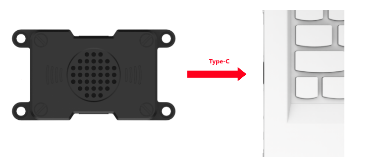

2. Open serial assistant Serial Port Utility, select the connected serial port including CH340 on the interface, and set baud rate to 115200 as shown below.

   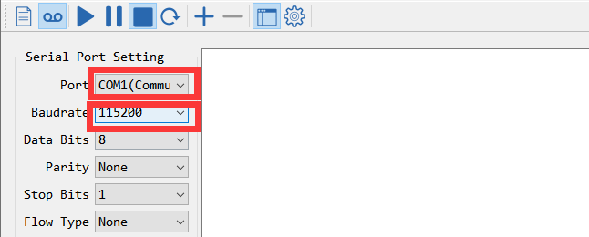

3. Speak the wake-up word **Hello Hiwonder** configured in the firmware Excel sheet. Returned flag information will display on the right side in hexadecimal message format, indicating successful recognition.

   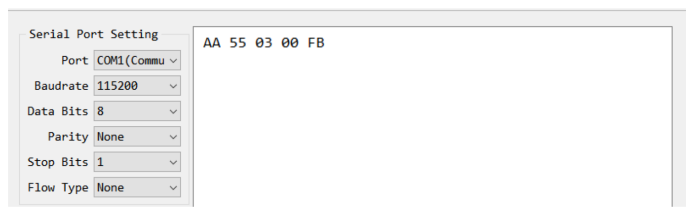

   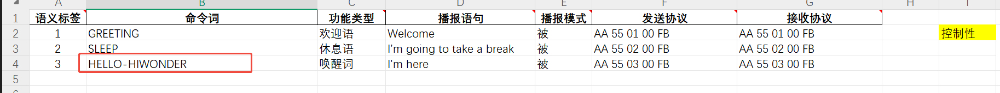

### 9.1.3 Firmware Creation

This section covers creating WonderEcho Pro firmware.

* **Wake-Up Word Firmware Creation**

Taking the wake-up word **HELLO-HIWONDER** as an example to demonstrate firmware creation. English wake-up word settings must be uppercase to take effect.

1. First, open the [ChipIntelli Voice AI Platform](https://aiplatform.chipintelli.com/home/index.html) link to access the official firmware creation website.

2. Click **Platform Features** in the menu bar, then click **Product Firmware and SDK Deep Development** under Product Development.

   

3. The system will prompt for account login. If not registered, complete platform account registration first. In this example, registration has been completed in advance. After logging in successfully, click **Product Firmware and SDK Deep Development** again.

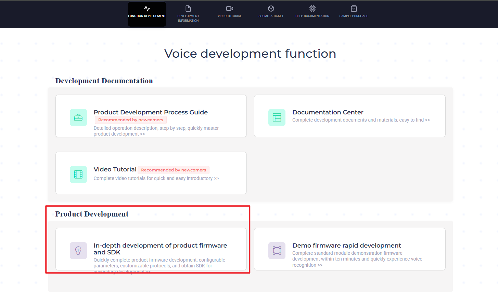

4. After page redirection, click the icon  on the left sidebar to create a new product. Customize the product name and description, select the remaining settings according to the red boxes shown below, set **Product Type** to **General - Intelligent Central Control**, and click **Create**.

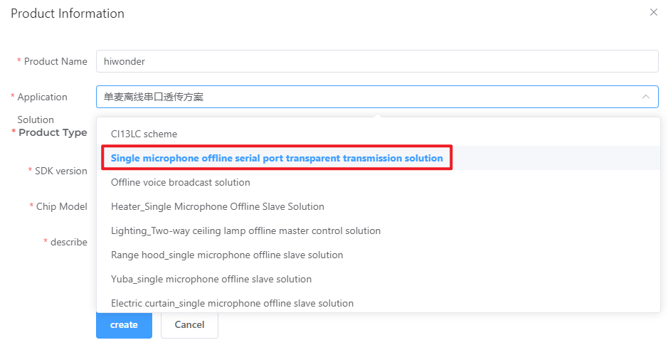

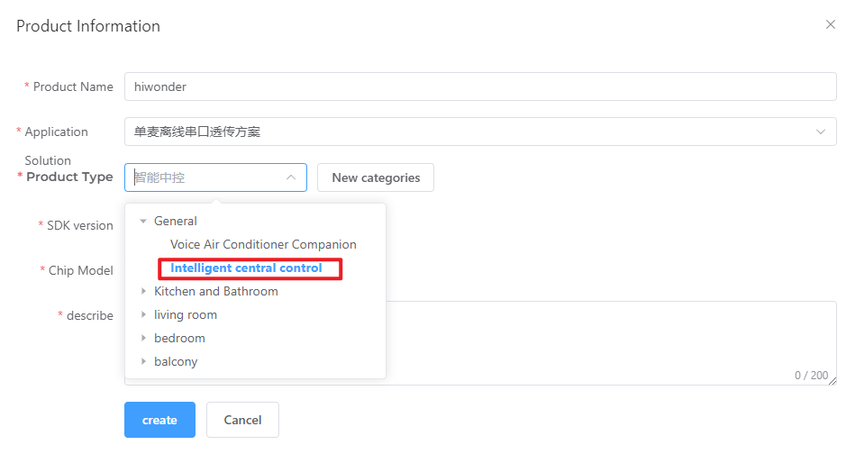

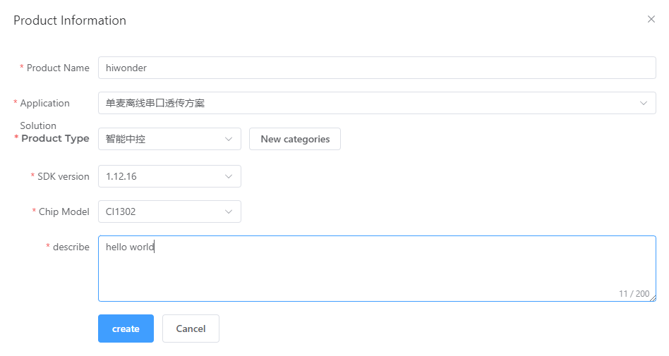

5. Next, fill in basic project information. To recognize English, select **English** as the language type. Select the remaining information as shown below and click **Continue**.

   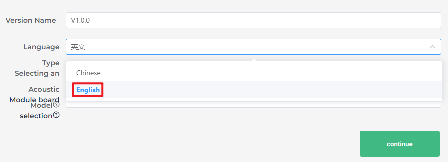

   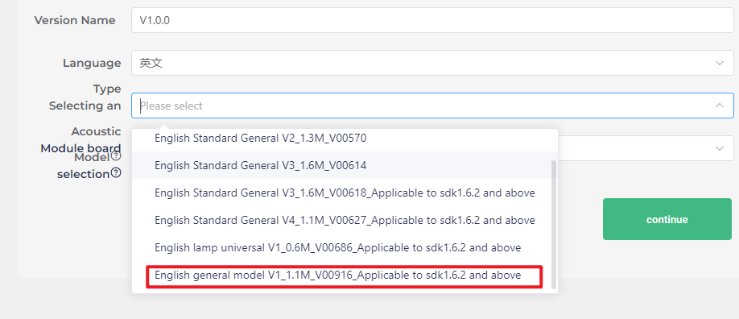

   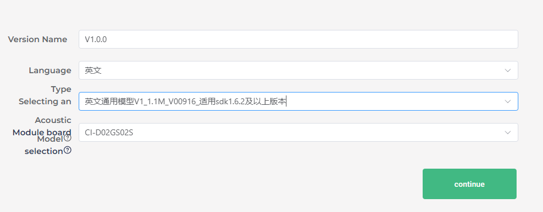

6. After entering the firmware configuration interface, modification steps for key parameters are explained. First, enable **Echo Cancellation** in the algorithm parameters.

   

7. In hardware parameters, select **Internal RC** as crystal oscillator source and disable baud rate calibration.

   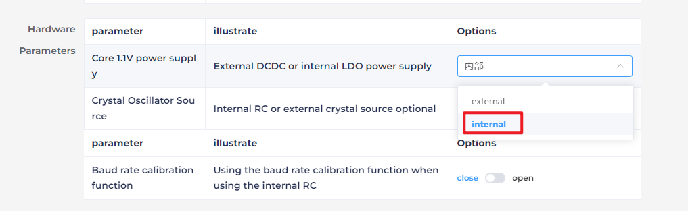

   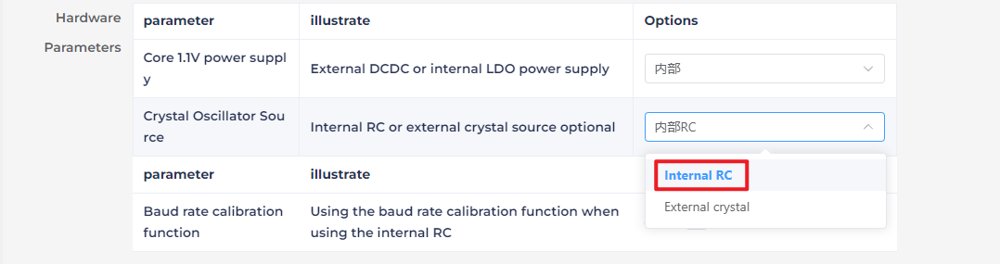

   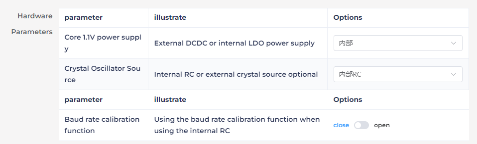

8. In print serial port configuration, configure UART1 level as open-drain supporting external 5V pull-up.

   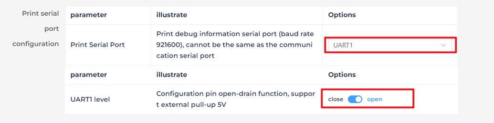

9. In communication serial port configuration, set baud rate to 115200 and configure UART0 level as open-drain supporting external 5V pull-up, clicking **Continue** upon completion.

   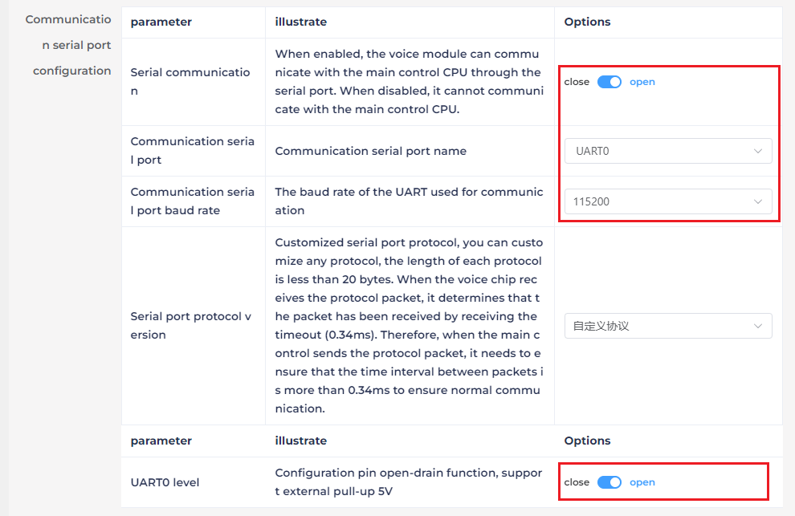

10. Next enter the command word editing function. Select broadcast voice timbre, choosing **Dane-English Male**.

    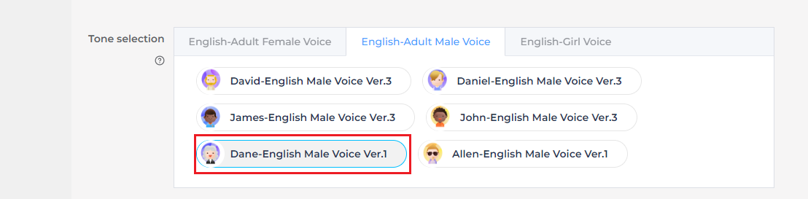

11. Next, upload command word attachments. Locate the table **Command Word Broadcast Protocol List V3 English Template with Hello Hiwonder**, dragging it directly into the web page to upload.

    > [!NOTE]
    >
    > **To modify wake-up words, open the table file Command Word Broadcast Protocol List V3 English Template with Hello Hiwonder and change HELLO-HIWONDER inside to the desired wake-up word. English version wake-up words only support English wake-up and cannot share English and Chinese, requiring uppercase letters to take effect.**

    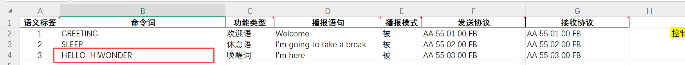

12. After uploading the file, command word data can be viewed in the table below.

    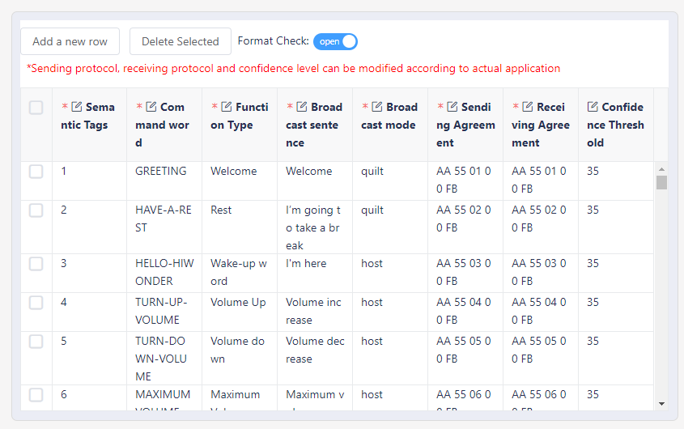

13. After submission, wait several minutes for firmware creation to complete, clicking download firmware to obtain created firmware.

    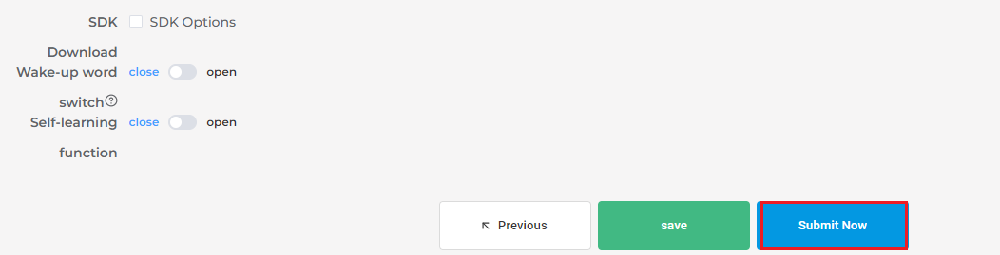

    
    
    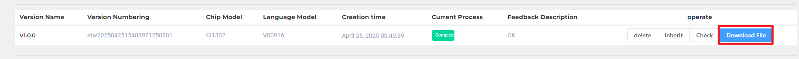

## 9.2 Voice Control Applications

### 9.2.1 WonderEcho Pro Installation

* Use **M4 x 12 screws** to install the AI voice interaction box according to illustrated positions.


* **Wiring**


### 9.2.2 Voice Control Applications

* **Preparation**

(1) WonderEcho Pro Configuration Work

Before usage, flash corresponding firmware as detailed in lesson [9.1.2 Firmware Flashing](#p11-1-2).

* **Voice-Controlled Color Sorting**

This section covers controlling the robot via voice commands to enable specified color block sorting operations. After recognizing corresponding color blocks, they are placed in corresponding locations.

(1) Preparation

1) Before starting this section, install WonderEcho Pro AI voice interaction box on the robot if not already installed, connecting it to the hub USB interface.

2) If the robotic arm or map position has been moved prior to starting this program, re-calibrate positions. Refer to [1. Tutorials / 1. NexArm User Manual / 1.9 Object Grasping Adjustment](https://drive.google.com/drive/folders/1E_TRpBIkzi_glH7KCmwj_b4I6jDOFO-Z?usp=sharing) for calibration.

(2) Program Introduction

1) First, subscribe to the voice recognition service published by the microphone node to process audio inputs through sound localization, noise reduction, and speech recognition, obtaining the recognized text and sound source direction.

2) Upon successfully waking up the robot and speaking a specific voice command, the system provides corresponding voice response feedback.

3) Finally, the system issues control commands to enable or disable color block sorting on the robot.

4) The target sorting application consists of two core phases: color recognition and sorting execution.

5) In the color recognition phase, Gaussian filtering is first applied for image noise reduction, followed by color space conversion using the Lab color space. Refer to [1. Tutorials / 4. OpenCV Vision Courses / 4.1 Position-based Gripping]() for detailed explanations of the Lab color space.

6) Object colors within the region of interest are then identified using color thresholds, followed by image masking to isolate the target region.

7) Next, morphological opening and closing operations are performed on the image to filter noise, and the object with the largest contour is detected and bounded with a circle.

8) Upon identifying the target color, the robotic arm descends to the designated position, grips the color block, and transfers it to the target location.

(3) Program Steps

> [!NOTE]
>
> * **Command inputs require strict case sensitivity, and Tab key can be used to complete keywords.**
>
> * **Ensure no objects similar or identical in color to target color blocks appear in the background during recognition to avoid interference.**
>
> * **If color recognition is inaccurate, navigate to [1. Tutorials / 1. NexArm User Manual / 1.6 Color Threshold Adjustment](https://drive.google.com/drive/folders/1E_TRpBIkzi_glH7KCmwj_b4I6jDOFO-Z?usp=sharing) to adjust color thresholds.**

1. Power on the robot and connect it to remote control software VNC. Refer to [1. Tutorials / 1. NexArm User Manual / 1.5 Development Environment Setup and Configuration](https://drive.google.com/drive/folders/1E_TRpBIkzi_glH7KCmwj_b4I6jDOFO-Z?usp=sharing).

2. Before using **AI voice interaction box WonderEcho Pro**, flash corresponding firmware as detailed in [9.1.2 Firmware Flashing](#p11-1-2).

3. Factory default settings use English wake-up word **Hello Hiwonder**. To switch to wake-up words in other languages, refer to [9.2.3 Switching Wake Word](#p11-2-3).

4. Click icon  on system desktop to open command line terminal.

5. Enter command to disable auto-start service.

   ```
   ~/.stop_ros.sh
   ```

6. When using voice control for the first time or after modifying wake-up words, run the microphone startup file to activate wake-up words, otherwise the microphone cannot function normally.

   Open terminal and enter command:

   ```
   ros2 launch example wonderechopro_init.launch.py
   ```

   Terminal prints prompt information, after which speaking wake-up words wakes up the microphone.

   

   After activating wake-up words, press **Ctrl+C** to close.

7. Enter command to start program execution.

   ```
   ros2 launch example voice_control_color_sorting.launch.py
   ```

8. Speak wake-up word **Hello Hiwonder** by default, then issue commands to start color block sorting.

9. To stop this program, press **Ctrl+C** in terminal interface. If termination fails, retry repeatedly.

10. After completing experience, enable app service , as failure to enable affects subsequent app program usage. Enter command in terminal, press **Enter** to launch app service, and wait briefly for startup.

    ```
    ros2 launch bringup bringup.launch.py
    ```

11. After app service startup completes, robotic arm returns to initial posture and buzzer beeps once.

* **Program Outcome**

After launching the program, speak the wake-up word first, followed by command statements to control and start color block sorting.

For example, speak wake-up word **Hello Hiwonder**, then speak command **sort red**, terminal prints sorted color and begins recognizing color blocks within specified area. Upon recognizing corresponding color blocks, the robot grips and places them at designated locations.

Wake-up words and control commands are shown below:

| Wake-up Word | Control Command | Description |
| --- | --- | --- |
| Hello Hiwonder | Sort red | Grip red |
| Hello Hiwonder | Sort green | Grip green |
| Hello Hiwonder | Sort blue | Grip blue |
| Hello Hiwonder | Stop color sorting | Stop color sorting |

* **Program Analysis**

(1) Launch File Analysis

This section primarily focuses on explaining voice wake-up and voice control mechanisms. For details regarding color sorting, refer to the corresponding courses.

Voice-controlled color tracking establishes connections among voice control nodes, camera nodes, robotic arm control nodes, and color sorting nodes, controlling program execution start or stop via sound commands.

Launch file path located at: **/home/ubuntu/ros2_ws/src/example/example/voice_control/voice_control_color_sorting.launch.py**

1. `launch_setup` Function

   ```py
   def launch_setup(context):
       compiled = os.environ['need_compile']
       start = LaunchConfiguration('start', default='true')
       start_arg = DeclareLaunchArgument('start', default_value=start)
       display = LaunchConfiguration('display', default='true')
       display_arg = DeclareLaunchArgument('display', default_value=display)
   
       if compiled == 'True':      
           example_package_path = get_package_share_directory('example')
       else:
           example_package_path = '/home/ubuntu/ros2_ws/src/example'
   
       mic_launch = IncludeLaunchDescription(
           PythonLaunchDescriptionSource(
               os.path.join(example_package_path, 'example/voice_control/wonderechopro_init.launch.py')),
       )
       color_sorting_node_launch = IncludeLaunchDescription(
           PythonLaunchDescriptionSource(
               os.path.join(example_package_path, 'example/opencv/color_sorting_node.launch.py')),
           launch_arguments={
               'broadcast': 'true',
           }.items(),
       )
   
       voice_control_color_sorting_node = Node(
           package='example',
           executable='voice_control_color_sorting',
           output='screen',
       )
   
       return [ 
               color_sorting_node_launch,
               mic_launch,
               voice_control_color_sorting_node,
               ]
   ```

Includes the launch files **example/voice_control/wonderechopro_init.launch.py** to start microphone-related nodes and **example/opencv/color_sorting_node.launch.py** to start color sorting node configurations with the `broadcast` parameter set to `true` in the **example** package. Defines the `voice_control_color_sorting_node` node to run the `voice_control_color_sorting` executable in the **example** package.

2. `generate_launch_description` Function

   ```py
   def generate_launch_description():
       return LaunchDescription([
           OpaqueFunction(function = launch_setup)
       ])
   ```

Creates and returns `LaunchDescription` object, calling `launch_setup` function via `OpaqueFunction` as standard ROS 2 launch file entry point.

3. Main Function

   ```py
   if __name__ == '__main__':
       # Create a LaunchDescription object
       ld = generate_launch_description()
   
       ls = LaunchService()
       ls.include_launch_description(ld)
       ls.run()
   ```

Creates `LaunchDescription` object and `LaunchService` service, adding launch description to launch service and running to achieve system startup.

(2) Python File Analysis

This content explains voice wake-up and voice control parts. For color sorting details, refer to corresponding courses.

Python file path located at: **/home/ubuntu/ros2_ws/src/example/example/voice_control/include/voice_control_color_sorting.py**

(1) Package Import

```py
import os
import json
import rclpy
from . Import voice_play
from rclpy.node import Node
from std_msgs.msg import String
from interfaces.srv import SetStringBool
from std_srvs.srv import Trigger, SetBool
from rclpy.executors import MultiThreadedExecutor
from ros_robot_controller_msgs.msg import BuzzerState
from rclpy.callback_groups import ReentrantCallbackGroup
```

1. `from std_srvs.srv import Trigger`: Import the `Trigger` service type from `std_srvs.srv` to provide and call simple trigger services.

2. `from rclpy.executors import MultiThreadedExecutor`: Import `MultiThreadedExecutor` from `rclpy.executors` to manage multiple nodes with a multi-threaded executor.

3. `from ros_robot_controller_msgs.msg import BuzzerState`: Import the `BuzzerState` message type from `ros_robot_controller_msgs.msg` to handle buzzer states.

4. `from rclpy.callback_groups import ReentrantCallbackGroup`: Import `ReentrantCallbackGroup` from `rclpy.callback_groups` to support re-entrant callbacks.

2. Initialize Node

```py
class VoiceControlColorSortingNode(Node):
    def __init__(self, name):
        rclpy.init()
        super().__init__(name, allow_undeclared_parameters=True, automatically_declare_parameters_from_overrides=True)
        
        self.running = True
        self.language = os.environ['ASR_LANGUAGE']
        timer_cb_group = ReentrantCallbackGroup()
        self.buzzer_pub = self.create_publisher(BuzzerState, 'ros_robot_controller/set_buzzer', 1)
        self.create_subscription(String, 'asr_node/voice_words', self.words_callback, 1, callback_group=timer_cb_group)

        self.client = self.create_client(Trigger, 'asr_node/init_finish')
        self.client.wait_for_service()
        self.client = self.create_client(Trigger, 'object_sorting/init_finish')
        self.client.wait_for_service()   
        self.set_target_client = self.create_client(SetStringBool, 'object_sorting/set_target', callback_group=timer_cb_group)
        self.set_target_client.wait_for_service()

        self.timer = self.create_timer(0.0, self.init_process, callback_group=timer_cb_group)
```

Initializes ROS node, allowing undeclared parameters and automatically declaring parameters from overrides. Sets running flag, retrieves speech recognition language from environment variables, creates callback group and buzzer state publisher, subscribes to topic `asr_node/voice_words`, waits for initialization services of speech recognition and object sorting nodes to start, creates target setting service client, and starts initialization timer.

(3) `init_process` Function

```py
    def init_process(self):
        self.timer.cancel()
        self.play('running')
        self.get_logger().info('\033[1;32m%s\033[0m' %'Wake up word: hello hiwonder')
        self.get_logger().info('\033[1;32m%s\033[0m' %'No need to wake up within 15 seconds after waking up')
        self.get_logger().info('\033[1;32m%s\033[0m' %'Voice command: sorting red/green/blue object stop color sorting')

        self.create_service(Trigger, '~/init_finish', self.get_node_state)
        self.get_logger().info('\033[1;32m%s\033[0m' % 'start')
```

Cancels initialization timer, plays running prompt audio, outputs wake-up word and control command instructions, creates initialization completion service, and logs startup information.

(4) `get_node_state` Function

```py
    def get_node_state(self, request, response):
        response.success = True
        return response
```

Responds to initialization completion service, returning success response.

(5) `play` Function

```py
    def play(self, name):
        voice_play.play(name, language=self.language)
```

Calls voice playback module, playing designated audio by name based on language parameters.

(6) `send_request` Function

```py
    def send_request(self, client, msg):
        future = client.call_async(msg)
        while rclpy.ok():
            if future.done() and future.result():
                return future.result()
```

Sends asynchronous request to service client, looping to wait for response completion, returning result upon success.

(7) `words_callback` Function

```py
    def words_callback(self, msg):
        words = json.dumps(msg.data, ensure_ascii=False)[1:-1]
        if self.language == 'Chinese':
            words = words.replace(' ', '')

        if words is not None and words not in ['wake-up-success', 'Sleep', 'Fail-5-times',
                                               'Fail-10-times']:
            if words == 'sorting red object':
                self.play('start_sort_red')
                req = SetStringBool.Request()
                req.data_bool = True
                req.data_str = 'red'
                res = self.send_request(self.set_target_client, req)

            elif words == 'sorting green object':
                self.play('start_sort_green')
                req = SetStringBool.Request()
                req.data_bool = True
                req.data_str = 'green'
                res = self.send_request(self.set_target_client, req)

            elif words == 'sorting blue object':
                self.play('start_sort_blue')
                req = SetStringBool.Request()
                req.data_bool = True
                req.data_str = 'blue'
                res = self.send_request(self.set_target_client, req)

            elif words == 'stop color sorting':
                target_list = ["red", "green", "blue"]
                req = SetStringBool.Request()
                req.data_bool = False
                for i in target_list:
                    req.data_str = i
                    res = SetBool.Response()
                    res = self.send_request(self.set_target_client, req)
                self.play('stop_sort')

        elif words == 'wake-up-success':
            self.play('awake')
        elif words == 'Sleep':
            msg = BuzzerState()
            msg.freq = 1900
            msg.on_time = 0.05
            msg.off_time = 0.01
            msg.repeat = 1
            self.buzzer_pub.publish(msg)
```

Voice command callback function, parsing received voice text. According to English commands, processes red, green, or blue sorting commands, calling target setting service to enable sorting for corresponding colors. Processes stop color sorting command, calling target setting service to disable sorting for all colors. Plays wake-up prompt sound or controls buzzer for wake-up success and sleep commands.

(8) `main` Function

```py
def main():
    node = VoiceControlColorSortingNode('voice_control_color_sorting')
    executor = MultiThreadedExecutor()
    executor.add_node(node)
    executor.spin()
    node.destroy_node()
```

Creates `VoiceControlColorSortingNode` instance named `voice_control_color_sorting`, adding node with multi-threaded executor, starting spin loop, and destroying node upon program exit.

* **Voice-Controlled Color Tracking**

This section covers controlling the robotic arm via voice commands to track specific colors. Upon recognizing target colors, the robotic arm moves following target color movement.

(1) Preparation

1) Before starting this section, install WonderEcho Pro AI voice interaction box on the robot if not already installed, connecting it to hub USB interface.

2) If the robotic arm or map position has been moved prior to starting this program, re-calibrate positions. Refer to [1. Tutorials / 1. NexArm User Manual / 1.9 Object Grasping Adjustment](https://drive.google.com/drive/folders/1E_TRpBIkzi_glH7KCmwj_b4I6jDOFO-Z?usp=sharing).

(2) Program Introduction

1) First, subscribe to the voice recognition service published by the microphone node to process audio inputs through sound localization, noise reduction, and speech recognition, obtaining the recognized text and sound source direction.

2) Upon successfully waking up the robot with designated wake-up words, the system provides corresponding voice response feedback.

3) Finally, the system issues control commands to initiate target tracking for the specified color.

4) Target tracking consists of two core phases: color recognition and position tracking.

5) In the color recognition phase, Gaussian filtering is first applied for image noise reduction, followed by color space conversion using the Lab color space. Refer to [1. Tutorials / 4. OpenCV Vision Courses / 4.1 Position-based Gripping]() for detailed explanations.

6) Object colors within the region of interest are then identified using color thresholds, followed by image masking to isolate the target region.

7) Next, morphological opening and closing operations are performed on the image to filter noise, and the object with the largest contour is detected and bounded with a circle.

8) Target tracking utilizes a PID control algorithm to compare the pixel coordinates of the target object with the image center coordinates, continuously reducing coordinate offsets to achieve dynamic target tracking.

9) For detailed principles of the PID algorithm, refer to [1. Tutorials / 4. OpenCV Vision Courses / 4.2 Target Tracking]().

(3) Program Steps

> [!NOTE]
>
> * **Command inputs require strict case sensitivity, and Tab key can be used to complete keywords.**
>
> * **Ensure no objects similar or identical in color to target color blocks appear in background during recognition to avoid interference.**
>
> * **Moving color blocks should not be too fast, as excessive speed causes target loss and tracking failure.**
>
> * **If color recognition is inaccurate, navigate to [1. Tutorials / 1. NexArm User Manual / 1.6 Color Threshold Adjustment](https://drive.google.com/drive/folders/1E_TRpBIkzi_glH7KCmwj_b4I6jDOFO-Z?usp=sharing) to adjust color thresholds.**

1. Power on the robot and connect it to remote control software VNC. Refer to [1. Tutorials / 1. NexArm User Manual / 1.5 Development Environment Setup and Configuration](https://drive.google.com/drive/folders/1E_TRpBIkzi_glH7KCmwj_b4I6jDOFO-Z?usp=sharing).

2. Before using **AI voice interaction box WonderEcho Pro**, flash corresponding firmware as detailed in [9.1.2 Firmware Flashing](#p11-1-2).

3. Factory default settings use English wake-up word **Hello Hiwonder**. To switch to wake-up words in other languages, refer to [9.2.3 Switching Wake Word](#p11-2-3).

4. Click icon  on system desktop to open command line terminal.

5. Execute command to disable auto-start service.

   ```
   ~/.stop_ros.sh
   ```

6. When using voice control for the first time or after modifying wake-up words, run microphone startup file to activate wake-up words, otherwise microphone cannot function normally.

   Open terminal and enter command:

   ```
   ros2 launch example wonderechopro_init.launch.py
   ```

   

   Terminal prints prompt information, after which speaking wake-up words wakes up the microphone.

   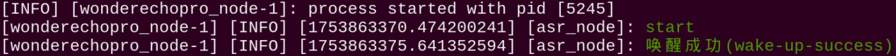

7. Enter command and press **Enter** to launch program.

   ```
   ros2 launch example voice_control_color_track.launch.py
   ```

8. To stop this program, press **Ctrl+C** in terminal interface. If termination fails, retry repeatedly.

9. After completing experience, enable app service , as failure to enable affects subsequent app program usage. Enter command in terminal, press **Enter** to launch app service, and wait briefly for startup.

   ```
   ros2 launch bringup bringup.launch.py
   ```

   

10. After app service startup completes, robotic arm returns to initial posture and buzzer beeps once.

(4) Program Outcome

After launching program, speak wake-up word **Hello Hiwonder** first, followed by tracking commands to initiate robot color tracking.

Trackable colors in this program include red, green, and blue.

Taking red as an example, place red block within camera field of view. Speak wake-up word **Hello Hiwonder**, then speak tracking command **track red**.

Subsequently, upon recognizing red color block, robotic arm rotates servos to point depth camera directly at red block. Moving the color block causes the robotic arm to move left, right, up, and down accordingly.

To stop robot color tracking, speak wake-up word **Hello Hiwonder**, then speak command **stop tracking**.

Wake-up words and control commands are shown below:

| Wake-up Word | Control Command | Description |
| --- | --- | --- |
| Hello Hiwonder | Track red | Follow red block movement |
| Hello Hiwonder | Track green | Follow green block movement |
| Hello Hiwonder | Track blue | Follow blue block movement |
| Hello Hiwonder | Stop tracking | Stop color tracking |

(5) Program Analysis

(1) Launch File Analysis

This section primarily focuses on explaining voice wake-up and voice control mechanisms. For details regarding color tracking, refer to the corresponding courses.

Voice-controlled color tracking establishes connections among voice control nodes, camera nodes, robotic arm control nodes, and color tracking nodes, controlling the robotic arm to recognize and track color blocks via sound commands.

Launch file path located at: **/home/ubuntu/ros2_ws/src/example/example/voice_control/voice_control_color_track.launch.py**

1. `launch_setup` Function

```py
def launch_setup(context):
    compiled = os.environ['need_compile']

    if compiled == 'True':      
        example_package_path = get_package_share_directory('example')
    else:
        example_package_path = '/home/ubuntu/ros2_ws/src/example'

    color_track_node_launch = IncludeLaunchDescription(
        PythonLaunchDescriptionSource(
            os.path.join(example_package_path, 'example/opencv/color_track_node.launch.py')),
        launch_arguments={
            'broadcast': 'true',
        }.items(),
    )

    mic_launch = IncludeLaunchDescription(
        PythonLaunchDescriptionSource(
            os.path.join(example_package_path, 'example/voice_control/wonderechopro_init.launch.py')),
        )

    voice_control_color_track_node = Node(
        package='example',
        executable='voice_control_color_track',
        output='screen',
    )

    return [
            color_track_node_launch,
            mic_launch,
            voice_control_color_track_node,
            ]
```

Includes the launch files **example/opencv/color_track_node.launch.py** to start color tracking node configurations with the `broadcast` parameter set to `true` and **example/voice_control/wonderechopro_init.launch.py** to start microphone-related nodes in the **example** package. Defines the `voice_control_color_track_node` node to run the `voice_control_color_track` executable in the **example** package.

2. `generate_launch_description` Function

```py
def generate_launch_description():
    return LaunchDescription([
        OpaqueFunction(function = launch_setup)
    ])
```

Creates and returns `LaunchDescription` object, calling `launch_setup` function via `OpaqueFunction` as standard ROS 2 launch file entry point.

3. Main Function

```py
if __name__ == '__main__':
    # Create a LaunchDescription object
    ld = generate_launch_description()

    ls = LaunchService()
    ls.include_launch_description(ld)
    ls.run()
```

Creates `LaunchDescription` object and `LaunchService` service, adding launch description to launch service and running to achieve system startup.

(2) Python File Analysis

This content explains voice wake-up and voice control parts. For color tracking details, refer to corresponding courses.

Python file path located at: **/home/ubuntu/ros2_ws/src/example/example/voice_control/include/voice_control_color_track.py**

**Package Import**

```py
import os
import json
import rclpy
from . Import voice_play
from rclpy.node import Node
from std_msgs.msg import String
from interfaces.srv import SetFloat64
from std_srvs.srv import Trigger, SetBool
from rclpy.executors import MultiThreadedExecutor
from ros_robot_controller_msgs.msg import BuzzerState
from rclpy.callback_groups import ReentrantCallbackGroup
```

1. `from interfaces.srv import SetFloat64`: Import the `SetFloat64` service type from the custom `interfaces.srv` package.

2. `from ros_robot_controller_msgs.msg import BuzzerState`: Import the `BuzzerState` message type from `ros_robot_controller_msgs.msg` to control buzzer states.

**Initialize Node**

```py
    def __init__(self, name):
        rclpy.init()
        super().__init__(name, allow_undeclared_parameters=True, automatically_declare_parameters_from_overrides=True)

        self.language = os.environ['ASR_LANGUAGE']
        timer_cb_group = ReentrantCallbackGroup()
        self.buzzer_pub = self.create_publisher(BuzzerState, 'ros_robot_controller/set_buzzer', 1)
        self.create_subscription(String, 'asr_node/voice_words', self.words_callback, 1, callback_group=timer_cb_group)
        self.client = self.create_client(Trigger, 'asr_node/init_finish')
        self.client.wait_for_service()
        self.client = self.create_client(Trigger, 'object_tracking/init_finish')
        self.client.wait_for_service()
        self.start_client = self.create_client(SetBool, 'object_tracking/enable_color_tracking')
        self.start_client.wait_for_service()
        self.set_color_client = self.create_client(SetFloat64, 'object_tracking/set_target_color', callback_group=timer_cb_group)
        self.set_color_client.wait_for_service()

        self.timer = self.create_timer(0.0, self.init_process, callback_group=timer_cb_group)
```

Initializes ROS node, allowing undeclared parameters and automatically declaring parameters from overrides. Retrieves speech recognition language from environment variables, creates callback group and buzzer state publisher, subscribes to topic `asr_node/voice_words`, waits for initialization services of speech recognition and object tracking nodes to start, creates tracking enable service client and target color setting service client, and starts initialization timer.

`init_process` **Function**

```py
    def init_process(self):
        self.timer.cancel()
        self.play('running')
        self.get_logger().info('\033[1;32m%s\033[0m' % 'Wake up word: hello hiwonder')
        self.get_logger().info('\033[1;32m%s\033[0m' % 'No need to wake up within 15 seconds after waking up')
        self.get_logger().info('\033[1;32m%s\033[0m' % 'Voice command: track red/green/blue object')

        self.create_service(Trigger, '~/init_finish', self.get_node_state)
        self.get_logger().info('\033[1;32m%s\033[0m' % 'start')
```

Cancels initialization timer, plays running prompt audio, outputs wake-up word and control command instructions, creates initialization completion service, and logs startup information.

`get_node_state` **Function**

```py
    def get_node_state(self, request, response):
        response.success = True
        return response
```

Responds to initialization completion service, returning success response.

`play` **Function**

```py
    def play(self, name):
        voice_play.play(name, language=self.language)
```

Calls voice playback module, playing designated audio by name based on language parameters.

`send_request` **Function**

```py
    def send_request(self, client, msg):
        future = client.call_async(msg)
        while rclpy.ok():
            if future.done() and future.result():
                return future.result()
```

Sends asynchronous request to service client, looping to wait for response completion, returning result upon success.

`words_callback` **Function**

```py
    def words_callback(self, msg):
        words = json.dumps(msg.data, ensure_ascii=False)[1:-1]
        if self.language == 'Chinese':
            words = words.replace(' ', '')
        if words is not None and words not in ['wake-up-success', 'Sleep', 'Fail-5-times',
                                               'Fail-10-times']:
            if words == 'track red object':
                req = SetFloat64.Request()
                req.data = 1.0 # Tracked color: 0.0 = no tracking, 1.0 = red, 2.0 = green, 3.0 = blue
                res = self.send_request(self.set_color_client, req)
                if res.success:
                    self.play('start_track_red')
                else:
                    self.play('track_fail')
            elif words == 'track green object':
                req = SetFloat64.Request()
                req.data = 2.0 # Tracked color: 0.0 = no tracking, 1.0 = red, 2.0 = green, 3.0 = blue
                res = self.send_request(self.set_color_client, req)
                if res.success:
                    self.play('start_track_green')
                else:
                    self.play('track_fail')
            elif words == 'track blue object':
                req = SetFloat64.Request()
                req.data = 3.0 # Tracked color: 0.0 = no tracking, 1.0 = red, 2.0 = green, 3.0 = blue
                res = self.send_request(self.set_color_client, req)
                if res.success:
                    self.play('start_track_blue')
                else:
                    self.play('track_fail')
            elif words == 'stop tracking':
                req = SetBool.Request()
                req.data = False
                res = self.send_request(self.start_client, req)
                if res.success:
                    self.play('stop_track')
                else:
                    self.play('stop_fail')
        elif words == 'wake-up-success':
            self.play('awake')
        elif words == 'Sleep':
            msg = BuzzerState()
            msg.freq = 1900
            msg.on_time = 0.05
            msg.off_time = 0.01
            msg.repeat = 1
            self.buzzer_pub.publish(msg)
```

Voice command callback function, parsing received voice text. According to the commands, processes red, green, or blue tracking commands, calling target color setting service with corresponding color indicator values `1.0`, `2.0`, or `3.0`, playing success or failure prompt audio based on service response. Processes stop tracking command, calling tracking enable service with false to stop tracking and play prompt audio. Plays wake-up prompt sound or controls buzzer for wake-up success and sleep commands.

`main` Function

```py
def main():
    node = VoiceControlColorTrackNode('voice_control_color_track')
    executor = MultiThreadedExecutor()
    executor.add_node(node)
    executor.spin()
    node.destroy_node()
```

Creates `VoiceControlColorTrackNode` instance named `voice_control_color_track`, adding node with multi-threaded executor, starting spin loop, and destroying node upon program exit.

### 9.2.3 Switching Wake Word

<p id ="p11-2-3"></p>

Factory default settings use the English wake-up word **Hello Hiwonder**. If settings are altered or corrupted and need to be reset or reconfigured back to English wake-up words and commands, follow the steps below.

1. The robot uses the WonderEcho Pro AI voice interaction box as its voice module. Flash the corresponding language firmware first by following the detailed steps in [9.1.2 Firmware Flashing](#p11-1-2).

   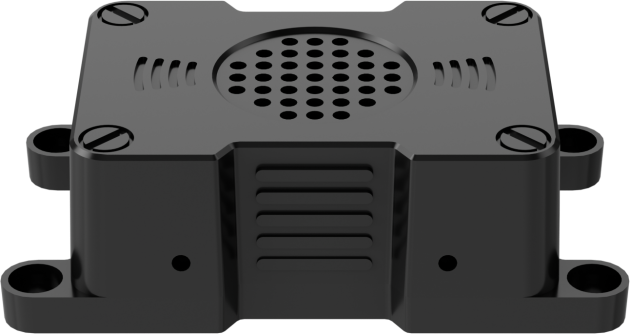

   <p style="text-align:center">AI Voice Box WonderEcho Pro</p>

2. Setting recognition language is required for the AI Voice Box WonderEcho Pro. Connect the robotic arm to remote control software **VNC**, referring to [1. Tutorials / 1. NexArm User Manual / 1.5 Development Environment Setup and Configuration](https://drive.google.com/drive/folders/1E_TRpBIkzi_glH7KCmwj_b4I6jDOFO-Z?usp=sharing).

3. Double-click **Tool** icon  on system desktop, selecting **English**.

   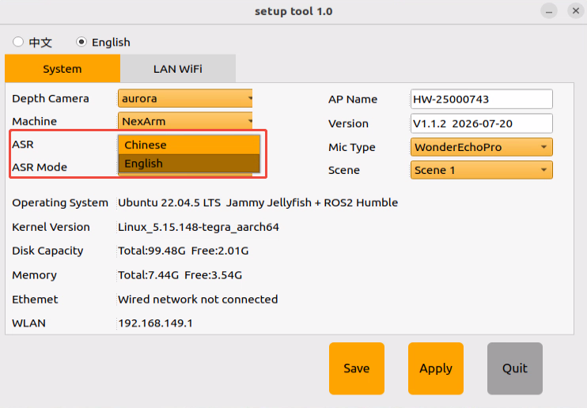

4. Click **Save**.

   

5. Click **Apply**.

   
